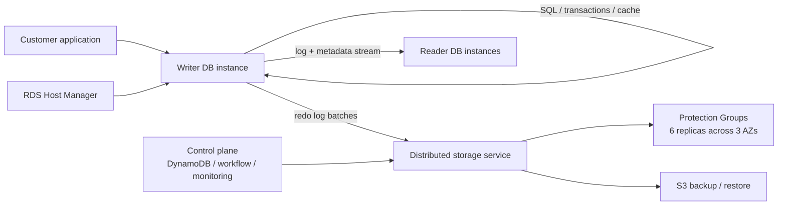

# Aurora

## 1. Aurora 是什么

Aurora 是 Amazon Web Services（AWS）面向 OLTP 工作负载设计的一套**云原生关系型数据库系统**。它不是简单地把 MySQL 或 PostgreSQL 放到云主机上运行，而是重新拆解了传统数据库内核与存储层之间的边界：查询处理、事务、锁、缓存、访问方法等仍保留在数据库实例侧，而 redo logging、持久化存储、崩溃恢复、备份恢复等能力被下沉到一个多租户、可扩展、跨 AZ 的分布式存储服务中。

Aurora 要解决的问题不是“SQL 怎么执行”，而是“在云上，关系型数据库怎样同时获得高吞吐、高可用、低恢复时间和较低运维复杂度”。传统数据库在云环境中使用网络存储时，写路径会把 redo log、binlog、脏页、double-write page、元数据等多类 I/O 反复写到网络和副本上。随着计算和本地磁盘能力提升，真正的瓶颈越来越不是 CPU，也不只是单盘吞吐，而是**网络 I/O 放大、跨可用区同步、尾延迟和故障恢复成本**。

Aurora 的核心判断是：如果所有持久化 I/O 都必须跨网络，那么数据库系统就应该尽量减少跨网络传输的内容。它选择只把 redo log record 发送到存储层，由存储层异步、分布式地完成 page materialization、备份、修复、垃圾回收和校验。换句话说，Aurora 把“log is the database”这件事工程化：数据库实例写日志，分布式存储服务负责把日志变成可靠、可读、可恢复的数据面。

因此，Aurora 的价值不只是“比普通 MySQL 更快”。更准确地说，它把关系型数据库变成了一个云服务体系：兼容主流关系数据库接口，同时让底层存储具备自动扩展、跨 AZ 复制、自修复、快速恢复和持续备份能力。

---

## 2. 设计初衷：云上 OLTP 需要怎样的数据库系统

Aurora 的背景是企业 OLTP 工作负载向公有云迁移。客户希望获得关系型数据库的事务语义、SQL 能力和生态兼容性，同时又希望云数据库具备弹性、托管、高可用和按需付费能力。传统数据库架构在这种环境中会暴露出几个系统性问题。

第一，**网络成为主要约束**。在云上，存储通常是网络化、复制化、跨故障域部署的。一次用户写入会被数据库内核放大成多种写：redo log、数据页、double-write buffer、binlog、元数据等，再被高可用架构继续复制。I/O 的类型、顺序和同步点越多，网络带宽、PPS、跨 AZ 延迟和尾部抖动越容易成为瓶颈。

第二，**可用性不能只按单节点故障设计**。在大规模云环境里，磁盘、节点、网络路径的小故障持续发生，AZ 级别的相关性故障也必须纳入模型。一个 3 副本、2/3 quorum 的设计看似能容忍单点故障，但如果某个 AZ 故障时其他 AZ 中正好存在后台修复中的副本，就可能丢失读 quorum 或写 quorum。

第三，**恢复时间必须从“离线事件”变成“在线常态”**。传统数据库崩溃后需要从 checkpoint 开始 replay WAL；checkpoint 间隔越长，恢复越慢，间隔越短，前台业务越容易被 checkpoint 干扰。Aurora 希望消除这个折中：存储层持续应用 redo log，使崩溃恢复不再依赖数据库启动时的大规模同步 replay。

第四，**客户仍然需要数据库兼容性**。Aurora 不是从零构建一个全新的 SQL 系统，而是在 MySQL/InnoDB 等成熟关系数据库内核基础上进行深度改造。这样可以保留 SQL、事务隔离、应用协议和运维习惯，同时把最适合云化的部分迁移到分布式存储层。

第五，**云数据库必须具备运维服务化能力**。这包括自动扩容、自动修复、持续备份、快速 failover、在线 DDL、软件升级，以及在多租户 SaaS 场景中处理大量连接、大量表和不可预测流量峰值。

从这些要求出发，Aurora 的核心目标可以概括为：

- **降低网络 I/O 放大**：只把必要的 redo log 写过网络。
- **提高跨故障域可用性**：使用跨 3 个 AZ、6 副本、读写 quorum 的存储模型。
- **缩短恢复时间**：把 redo apply 和 backup/restore 从一次性离线操作变成持续后台操作。
- **保持关系数据库语义**：让上层仍然表现得像一个熟悉的 MySQL/PostgreSQL 兼容数据库。
- **适配云服务运维**：自动扩展、自修复、监控、控制面编排和多租户资源管理。

---

## 3. 设计理念：Aurora 为什么“成了”

### 3.1 先承认网络是瓶颈，而不是继续优化本地磁盘路径

Aurora 的第一个关键判断是：在云环境中，数据库性能优化的中心不应继续停留在“本地页写得更快”，而应转向“减少跨网络写什么、写多少、同步多少次”。

传统数据库把数据页、日志、double-write、binlog 等不同物理对象写出，本质上是在网络存储环境中重复表达同一份状态变化。Aurora 认为，事务提交真正需要持久化的是 redo log，而不是立即写出完整数据页。数据页可以稍后由存储层基于 redo chain 生成。

这个理念带来的结果是：**写路径从 page-centric 变成 log-centric**。Aurora 不再让数据库实例把页面写到存储服务；数据库实例只写 redo records，存储服务再把日志应用为页面。

### 3.2 把“存储”变成数据库感知的服务

Aurora 的存储层不是普通块设备，也不是只负责复制 bit 的远端磁盘。它理解 redo log、LSN、page version、Protection Group、quorum、repair、backup 和 crash recovery。

这改变了数据库与存储的关系：

- 数据库实例负责 SQL、事务、锁、缓存和并发控制；
- 存储服务负责日志持久化、页面物化、备份、修复、校验和容量增长；
- 控制面负责编排 failover、实例替换、存储卷元数据和长任务。

这是一种典型的云原生拆分：不是把数据库整体塞进一个更大的机器，而是把数据库内核里最适合 scale-out 的部分变成服务。

### 3.3 用 quorum 承担故障模型，而不是依赖主备镜像

传统主备镜像通常会形成强同步链路：主库写本地存储，再镜像到备库存储，再等待多个顺序步骤完成。Aurora 改用分布式 quorum：每个数据项 6 副本，分布在 3 个 AZ，每个 AZ 2 副本；写入等待 4/6，读取需要 3/6。

这个 quorum 选择有两个目的：

1. 容忍 AZ 级相关故障和节点/磁盘级背景故障的叠加；
2. 避免所有副本都必须同步完成，降低慢节点和尾延迟对提交路径的影响。

因此，Aurora 的复制不是“主库到备库”的线性复制，而是“数据库实例到存储 quorum”的并行复制。

### 3.4 共识不是每次都做，而是让日志有序推进

Aurora 没有在每个事务提交上套用昂贵的 2PC。它利用 redo log 的天然顺序性：数据库为每条 log record 分配单调递增的 LSN，存储节点对各自 segment 的日志缺口进行 gossip 和补洞，数据库根据 write quorum 的 ACK 推进 Volume Durable LSN（VDL）。

事务提交的关键条件不是“所有参与者同步完成一个复杂协议”，而是：该事务的 commit LSN 已经不超过当前 VDL。这样，提交确认可以由专门线程完成，工作线程不必阻塞等待某个事务的持久化结果，而是继续处理后续请求。

### 3.5 恢复不是宕机后的重活，而是后台持续工作

传统数据库的崩溃恢复通常发生在重启时：扫描 WAL，重做 committed update，回滚未提交事务。Aurora 把 redo apply 下沉到存储层，让它持续、并行、异步执行。数据库重启时主要是重建运行时状态和确定各 Protection Group 的 durable point，而不是重新把大量 redo 同步应用到页面。

这体现了一个重要设计原则：**把前台不可预测的大任务，改造成后台持续摊销的小任务**。

### 3.6 兼容性是产品成功的边界条件

Aurora 的架构改动很深，但它没有让应用面对一个陌生数据库。其设计保留了传统关系数据库的查询、事务隔离、缓存和访问方法，使存储服务对数据库引擎呈现出类似本地磁盘的抽象。这种“底层重构、上层兼容”的路线，是 Aurora 能被大量现有 OLTP 应用迁移采用的重要条件。

---

## 4. 核心数据与状态模型：Redo Log、LSN、Segment、PG

Dapper 的核心模型是 trace / span / annotation；Aurora 的核心模型则是 log / LSN / page / segment / Protection Group。

### 4.1 Redo log record

当数据库修改一个页面时，并不必须立即把完整页面写出。它可以生成一条 redo log record，描述如何把页面的 before-image 变成 after-image。事务提交只要求相关 redo log 已经持久化，页面本身可以延迟物化。

在 Aurora 中，跨网络写出的主要对象就是 redo log record。数据页不会因为 checkpoint、缓存淘汰或后台刷脏而从数据库实例写到存储层。存储层通过应用 redo log 来生成页面。

### 4.2 LSN：Log Sequence Number

每条 log record 都有一个单调递增的 Log Sequence Number（LSN）。LSN 是 Aurora 判断日志顺序、完整性、可见性、提交点和恢复点的基础。

Aurora 依赖 LSN 维护多个关键状态：

- 某个 segment 已经连续接收并补齐到哪里；
- 整个 volume 已经 durable 到哪里；
- 某个事务的 commit LSN 是否已经可确认；
- 读取某个页面时应读取哪个 read point；
- 崩溃恢复时哪些日志应被保留，哪些应被截断。

### 4.3 MTR 与 CPL

Aurora 沿用 InnoDB 中 mini-transaction（MTR）的概念。一个数据库级事务会拆分成多个必须原子执行的 MTR，每个 MTR 由连续的 log records 构成。每个 MTR 的最后一条 log record 被标记为 Consistency Point LSN（CPL）。

CPL 的作用是给 Aurora 一个安全的截断/恢复边界：系统不应该恢复到某个 MTR 的中间位置，而应该恢复到一个一致点。

### 4.4 VCL 与 VDL

Aurora 会跟踪 volume 的完整性和持久性。

- **VCL（Volume Complete LSN）**：可以理解为 volume 层面已完整接收的日志上界。
- **VDL（Volume Durable LSN）**：不超过 VCL 的最高 CPL。VDL 是真正可作为 durable state 使用的边界。

事务提交判断与 VDL 直接相关：如果某个事务的 commit LSN 不大于当前 VDL，那么它可以被确认提交。

### 4.5 Segment 与 Protection Group

Aurora 把数据库 volume 切成固定大小 segment。论文中的 segment 大小是 10GB。每个 segment 被复制 6 份，形成一个 Protection Group（PG），跨 3 个 AZ 分布，每个 AZ 2 份。

一个 Aurora storage volume 可以看作多个 PG 的拼接。随着 volume 增长，系统分配新的 PG；当 segment 或节点故障时，系统以 segment 为单位修复，从而缩短 MTTR。

这种小 segment 设计的关键不只是容量管理，而是故障模型：如果修复粒度足够小，系统处在“副本不足但尚未修复”的脆弱窗口就足够短，从而降低叠加故障破坏 quorum 的概率。

### 4.6 Page 是 log 应用结果，不是唯一真相

在传统数据库里，持久化页面通常是数据的主要存在形式；redo log 用于恢复。在 Aurora 中，逻辑上更接近：redo log 是数据库，materialized page 是 redo log 应用后的缓存结果。

这并不意味着 Aurora 每次读取都从头 replay。存储层会在后台持续物化页面，并且只对修改链较长的页面做 rematerialization。相比全局 checkpoint，这是一种更细粒度、更局部化的维护方式。

---

## 5. 实现架构：Aurora 是如何跑起来的

### 5.1 总体架构：把 logging + storage 移出数据库引擎

Aurora 的整体架构可以分为三部分：

- **数据库实例层**：writer instance 和 reader instances，负责 SQL、事务、锁、缓存、访问方法和并发控制；
- **分布式存储层**：负责 redo log 持久化、quorum、page materialization、backup、repair、GC、scrub；
- **控制面**：依托 RDS、Host Manager、DynamoDB、workflow 服务等完成健康监控、failover、实例替换、元数据管理和长任务编排。

这个架构的核心不是“有主库和只读副本”，而是 writer、reader 和 storage fleet 之间共享同一个分布式存储卷。reader 不需要像传统 MySQL replica 那样重放完整复制链路并维护独立存储，而是利用共享存储和来自 writer 的事务元数据实现低延迟只读能力。

### 5.2 写路径：只把 redo log 写过网络

Aurora 的写路径大致如下：

1. SQL 执行导致数据库页面在 buffer cache 中被修改；
2. InnoDB/Aurora 生成 redo log records，并按 LSN 排序；
3. log records 按目标 Protection Group 分组、批量发送；
4. 每个 batch 被发往该 PG 的 6 个 segment 副本；
5. 6 个副本中至少 4 个持久化成功后，写 quorum 达成；
6. 数据库推进 VDL；
7. 当事务 commit LSN 不大于 VDL 时，事务被确认提交；
8. reader instances 接收 log records 和事务元数据，用于更新缓存和支持只读事务。

这条路径里最重要的设计是：数据库实例不会把 data page 写到网络存储。也就是说，没有因为 checkpoint、cache eviction 或 background flush 造成的页面网络写。前台写路径只关注 redo log。

### 5.3 读路径：正常情况下避免 read quorum

Aurora 并不是每次读取都向 3 个副本发请求并做 quorum read。数据库实例维护运行时状态，知道哪些 segment 对当前 read point 是完整的。读取页面时，它可以选择一个满足 read point 的 storage node 直接读取。

read quorum 主要用于恢复场景：当数据库崩溃或运行时状态丢失后，系统需要重新联系每个 PG 的 read quorum，以发现所有可能已经达到 write quorum 的日志，并据此重建 VDL。

这个设计非常关键。它说明 Aurora 虽然使用 quorum 提供持久性和故障容忍，但没有把 quorum 成本平均摊到每一次普通读上。

### 5.4 存储节点流水线：前台只做必要动作

Aurora storage node 对 log record 的处理是一条异步流水线：

1. 接收 log record，放入内存队列；
2. 将 record 持久化到本地磁盘，并向数据库实例 ACK；
3. 整理日志并识别缺口；
4. 与同一 PG 的 peer storage nodes gossip，补齐缺口；
5. 合并 log records，生成新的 data page versions；
6. 周期性把 log 和 page versions 备份到 S3；
7. 周期性垃圾回收旧版本；
8. 周期性校验页面 CRC。

其中只有前两步在前台写路径中直接影响提交延迟。其余工作都被后台化、异步化，并且可以在存储节点空闲时执行。

这就是 Aurora 降低抖动的核心：传统数据库的 checkpoint、刷脏、备份通常与前台负载正相关；Aurora 则试图让后台工作与前台压力负相关，在存储节点繁忙时延后 GC、page materialization 等非关键操作。

### 5.5 Quorum 与故障容忍

Aurora 的基础复制模型是：每个数据项 6 份，跨 3 个 AZ，每个 AZ 2 份。写 quorum 为 4/6，读 quorum 为 3/6。

这个模型满足两个条件：

- `Vr + Vw > V`，即读 quorum 和写 quorum 必然相交；
- `Vw > V/2`，即不同写 quorum 必然相交。

在设计目标上，Aurora 希望做到：

- 丢失一个 AZ 再额外丢失一个节点时，仍不丢数据；
- 丢失一个 AZ 时，不影响写入能力；
- 丢失任意两个节点时，仍能维持写 quorum；
- 保持 read quorum 后，可以通过新建副本恢复 write quorum。

这种模型专门针对云环境中的 correlated failure 设计，而不是只针对单盘或单机故障。

### 5.6 崩溃恢复：重建运行时状态，而不是重放全部 redo

传统数据库崩溃后，通常需要从 checkpoint 开始 replay redo log，再回滚未提交事务。Aurora 不再依赖启动时的集中式 redo replay，因为 redo apply 已经在存储层持续发生。

数据库实例重启时，需要做的是：

- 对每个 PG 联系 read quorum；
- 找出可能达到 write quorum 的最高日志边界；
- 重建 VDL；
- 截断 VDL 之后不应保留的 log records；
- 在线执行 undo recovery，回滚崩溃时未完成的事务。

论文给出的结果是，即使系统崩溃时处理超过 100,000 write statements/sec，Aurora 通常也可以在 10 秒内完成 volume recovery。未提交事务的 undo recovery 可以在数据库重新上线后继续执行。

### 5.7 备份与恢复：持续备份，而不是停顿式快照

Aurora storage node 会周期性将 log 和 page versions 备份到 S3。由于存储层天然维护 redo stream 和 page versions，备份恢复可以与前台处理解耦，而不需要数据库实例像传统系统那样为备份产生大量额外页面 I/O。

这也解释了 Aurora 为什么把 backup/restore 放在存储服务侧：备份不是数据库实例的偶发重负载，而是存储层持续进行的后台服务。

### 5.8 控制面：RDS、Host Manager、DynamoDB、Workflow

Aurora 使用 RDS 作为控制面。每个数据库实例上有 Host Manager，用于监控 cluster 健康，判断是否需要 failover 或替换实例。存储控制面保存 volume 配置、元数据、备份描述等信息，并编排 restore、repair、re-replication 等长任务。

这说明 Aurora 不是一个单进程数据库，而是一套云数据库服务。其可靠性来自数据库内核、存储 quorum、控制面编排、监控告警和后台修复共同组成的系统。

---

## 6. 性能与规模：Aurora 为什么能支撑云上 OLTP

Aurora 的性能收益主要来自两个方向：减少数据库实例侧网络 I/O，以及把存储层 I/O 并行化、后台化。

### 6.1 网络 I/O：Aurora 与 mirrored MySQL

论文使用 100GB 数据集、SysBench write-only workload，对比 mirrored MySQL 和 Aurora with replicas。测试持续 30 分钟，实例为 r3.8xlarge。

| 配置 | Transactions | IOs / Transaction |
|---|---:|---:|
| Mirrored MySQL | 780,000 | 7.4 |
| Aurora with Replicas | 27,378,000 | 0.95 |

论文结论是：Aurora 在 30 分钟内支撑的事务数约为 mirrored MySQL 的 35 倍；数据库节点每事务 I/O 数约少 7.7 倍；考虑到每个 storage node 只处理 6 副本中的一份，存储层需要处理的 I/O 进一步显著减少。

这里的重点不是单个数字，而是方法论：Aurora 先减少过网对象，再让存储服务横向扩展。

### 6.2 数据规模变化下的写吞吐

SysBench write-only 结果如下：

| DB Size | Amazon Aurora writes/sec | MySQL writes/sec |
|---|---:|---:|
| 1 GB | 107,000 | 8,400 |
| 10 GB | 107,000 | 2,400 |
| 100 GB | 101,000 | 1,500 |
| 1 TB | 41,000 | 1,200 |

在 100GB 数据集上，Aurora 相对 MySQL 最高达到约 67 倍；即使在 1TB、out-of-cache 工作负载下，Aurora 仍达到约 34 倍。

### 6.3 连接数增长下的吞吐

SysBench OLTP 在不同连接数下的写吞吐如下：

| Connections | Amazon Aurora writes/sec | MySQL writes/sec |
|---:|---:|---:|
| 50 | 40,000 | 10,000 |
| 500 | 71,000 | 21,000 |
| 5,000 | 110,000 | 13,000 |

MySQL 在连接数上升后吞吐出现峰值后回落；Aurora 则继续扩展到更高写吞吐。这对 SaaS、多租户、大量短连接或突发连接场景非常重要。

### 6.4 Replica lag

SysBench write-only 场景下，Aurora replica lag 与 MySQL replica lag 对比如下：

| Writes/sec | Aurora replica lag | MySQL replica lag |
|---:|---:|---:|
| 1,000 | 2.62 ms | < 1000 ms |
| 2,000 | 3.42 ms | 1000 ms |
| 5,000 | 3.94 ms | 60,000 ms |
| 10,000 | 5.38 ms | 300,000 ms |

Aurora 的 reader 不像传统 MySQL replica 那样依赖独立存储复制和长链路 replay，因此在高写入压力下仍能保持非常低的副本延迟。

### 6.5 热点行竞争与 TPC-C 变体

Percona TPC-C variant 结果如下：

| Connections / Size / Warehouses | Amazon Aurora tpmC | MySQL 5.6 tpmC | MySQL 5.7 tpmC |
|---|---:|---:|---:|
| 500 / 10GB / 100 | 73,955 | 6,093 | 25,289 |
| 5000 / 10GB / 100 | 42,181 | 1,671 | 2,592 |
| 500 / 100GB / 1000 | 70,663 | 3,231 | 11,868 |
| 5000 / 100GB / 1000 | 30,221 | 5,575 | 13,005 |

这说明 Aurora 的收益不仅来自纯顺序写或简单 benchmark，也能体现在存在热点行竞争、连接数高、数据集较大的 OLTP 场景中。

### 6.6 真实客户工作负载

论文中给出两个迁移案例：

- 一个互联网游戏公司从 MySQL 迁移到 Aurora 后，web transaction 平均响应时间从 15ms 降到 5.5ms，约 3 倍改善；
- 一个教育科技公司迁移后，SELECT 和 per-record INSERT 的 P95 latency 明显改善，接近 P50；同时，原本 MySQL replica lag 可飙升到 12 分钟，迁移 Aurora 后 4 个 replica 的最大 lag 未超过 20ms。

这些案例说明 Aurora 的价值不只在平均吞吐，也在降低长尾、降低副本延迟和提升读扩展可用性。

---

## 7. 典型应用场景：Aurora 在云数据库里到底怎么用

### 7.1 SaaS 多租户与数据库整合

很多 SaaS 公司会把不同客户放在同一个数据库实例中，常见方式是以 schema 或 database 作为租户单位，而不是像 Salesforce 那样把所有租户数据放到统一表结构中。这会导致一个实例中有大量 schema、table 和 metadata。

论文提到，某些 SaaS 客户有超过 50,000 个自己的客户；生产实例中超过 150,000 张表并不少见。这类场景需要：

- 高连接数能力；
- 高吞吐；
- 按实际使用量增长的存储；
- 单个租户流量尖峰不显著干扰其他租户；
- 较低的尾延迟和副本延迟。

Aurora 的分布式存储和低 I/O 放大使它很适合这类整合型云数据库负载。

### 7.2 高并发与突发流量

互联网业务经常遇到不可预测的流量峰值，例如营销活动、热点事件、电视节目曝光等。Aurora 的客户案例显示，部分客户可以运行在每秒 8000 以上连接请求的级别。

Aurora 在这类场景中的优势包括：

- 存储容量无需提前一次性规划；
- reader 可以承接读流量；
- writer 写路径减少网络 I/O；
- 存储节点慢点可以被 quorum 吸收；
- 后台任务可以避让前台高峰。

### 7.3 读扩展与低 replica lag

传统 MySQL replica lag 会让只读副本在高写压力场景下只能作为 standby，而不适合承接实时查询。Aurora 通过共享存储和 writer 到 reader 的事务元数据流，显著降低 read replica lag。

这使应用可以把更多 SELECT 查询导向 reader，在降低 writer 压力的同时提高整体可用性。

### 7.4 频繁 schema evolution

现代 Web 应用框架和 ORM 让开发者更频繁地做 schema migration。传统 MySQL 对许多 DDL 操作使用 full table copy，会给 DBA 带来明显运维压力。

Aurora 论文中提到，它实现了更高效的 online DDL：以 page 为粒度维护 schema version，需要时按历史 schema 解码页面，并通过 modify-on-write 懒惰升级页面。这种设计适合频繁 DDL 的云应用开发节奏。

### 7.5 高可用维护与软件升级

托管数据库服务需要频繁修补软件，但客户对 OLTP 中断非常敏感。Aurora 论文中提到 Zero-Downtime Patching（ZDP）：系统寻找没有活跃事务的瞬间，把 application state spool 到本地临时存储，patch engine 后再 reload state，使用户连接保持活跃。

这类能力体现了 Aurora 与传统数据库产品的区别：它不仅是数据库内核优化，也是服务运维能力的产品化。

### 7.6 Serverless 与弹性容量

从今天的 AWS 产品形态看，Aurora Serverless v2 把 Aurora 的云原生思想进一步推到 compute capacity 层：数据库容量可以随 workload 自动扩缩，适合变量负载、多租户、开发测试和不可预测峰值应用。它不是论文中的核心设计，但延续了同一个方向：把数据库的容量规划和运维动作尽可能服务化、自动化。

---

## 8. 优势与局限：应该怎样评价 Aurora

### 8.1 主要优势

**第一，网络 I/O 模型非常克制。** Aurora 只把 redo log 写过网络，不从数据库实例写出 data page，从根本上减少了高可用复制环境里的 I/O 放大。

**第二，存储层具备数据库语义。** 它不是普通远端磁盘，而是理解 redo、LSN、page version、PG、quorum、repair 和 backup 的数据库专用分布式存储服务。

**第三，故障模型面向云规模。** 6 副本、3 AZ、4/6 write quorum、3/6 read quorum 的设计专门处理 AZ 级相关故障和持续存在的背景故障。

**第四，恢复时间短。** 由于 redo apply 持续在存储层后台进行，崩溃恢复不再需要数据库启动时集中 replay 大量日志。

**第五，兼容性与架构创新结合。** Aurora 没有完全抛弃 MySQL/InnoDB 生态，而是在保留上层数据库语义的同时重构底层 logging/storage/recovery。

**第六，平台化运维能力强。** 自动修复、持续备份、读副本、failover、online DDL、ZDP、控制面编排等能力，使 Aurora 更像一个数据库服务平台，而不只是一个数据库二进制。

### 8.2 主要局限

**第一，论文架构的写入仍以 single writer 为中心。** Aurora 通过分布式存储扩展持久化能力和读能力，但写事务仍由单个 writer 生成有序 LSN。这简化了一致性和恢复，但也意味着写扩展不是任意多主横向扩展。

**第二，复杂性从数据库实例转移到存储服务和控制面。** 应用看到的接口更简单，但系统内部需要维护 quorum、gossip、VDL、repair、backup、metadata、failover 和监控。复杂性没有消失，只是被云服务团队集中承担。

**第三，网络仍然是根本约束。** Aurora 减少了网络 I/O，但并没有消除网络依赖。如果存储层或网络跟不上，系统仍需要通过 LSN allocation limit 等机制对写入施加 back-pressure。

**第四，6 副本不是免费的。** Aurora 通过 redo-only 写降低 I/O 放大，但高可用和高持久性仍然需要多副本、跨 AZ 网络、存储节点和后台修复成本。

**第五，兼容不等于完全等同。** Aurora 保持 MySQL/PostgreSQL 兼容接口，但底层存储、备份、恢复、复制、某些参数和某些运维行为与自建数据库不同。依赖底层引擎细节、插件、特殊复制语义或非常规运维流程的应用，迁移前仍需要验证。

**第六，它不是 Spanner 类全球强一致数据库。** Aurora 论文中的核心模型是 region 内的单 writer cluster 和跨 AZ storage quorum；它并不试图提供 Spanner 那种全球外部一致性事务模型。

---

## 9. 今天再看 Aurora：它留下了什么方法论

Aurora 的影响不只在 AWS 产品本身。它代表了一类云原生关系数据库方法论：**把关系数据库中最适合分布式化的 logging、storage、backup、recovery 拆出来，做成数据库感知的 scale-out storage service，同时尽量保留 SQL 层和事务层的兼容性。**

今天再看 Aurora，可以总结出几条仍然有效的方法论。

### 9.1 云数据库的核心不是“托管”，而是架构重写

把数据库进程放到云主机上，最多只是 hosted database。Aurora 的关键是重写了数据库与存储的交互方式，使存储服务理解数据库日志，并承担恢复、备份、修复和复制。

### 9.2 分布式系统设计要围绕故障相关性

单点故障模型不足以解释云规模系统。Aurora 的 quorum 设计显式考虑 AZ failure 与后台独立故障的叠加，这比“复制三份就够了”的模型更贴近现实。

### 9.3 降低前台路径比优化后台路径更重要

Aurora 并没有让所有工作消失，而是把能后台化的工作后台化：page materialization、GC、scrub、backup、repair 都尽量不进入事务提交路径。前台路径只做必要的日志持久化和 ACK。

### 9.4 数据库兼容性是架构创新的约束条件

完全新设计的数据库可以更激进，但迁移成本更高。Aurora 的商业价值部分来自它对 MySQL/PostgreSQL 生态的兼容，使现有 OLTP 应用能获得云原生存储收益，而不是重写业务。

### 9.5 弹性从 storage 继续扩展到 compute

当前 Aurora 已不仅仅是论文时期的 MySQL-compatible storage architecture。AWS 文档中，Aurora 提供 MySQL/PostgreSQL 兼容引擎、自动增长的高性能分布式存储、跨 AZ 复制、最多 15 个 read replicas，以及 Aurora Serverless v2 这类按需自动扩缩 compute capacity 的能力。某些 Aurora PostgreSQL 版本还把最大集群存储容量提升到 256 TiB。

换句话说，Aurora 后来的产品演进仍然沿着同一条线走：把数据库中原本需要人工规划、停机操作或专门 DBA 处理的部分，逐步变成云服务自动完成的控制面能力。

---

## 10. 总结

Aurora 的经典之处不在于“它比 MySQL 快多少倍”这个表层结果，而在于它证明了三件事：

1. **云上 OLTP 的主要瓶颈可以通过重构数据库-存储边界来缓解。**
2. **redo log 可以成为连接事务语义、分布式存储、快速恢复和持续备份的核心抽象。**
3. **关系数据库可以在保持应用兼容性的同时，获得云原生的可用性、弹性和运维能力。**

如果要用一句话概括 Aurora，可以这样说：

**Aurora 不是“托管版 MySQL/PostgreSQL”，而是把关系数据库的日志、存储、恢复和复制重构为云原生分布式服务的数据库系统。**

---

## 参考资料

- Alexandre Verbitski et al., *Amazon Aurora: Design Considerations for High Throughput Cloud-Native Relational Databases*, SIGMOD 2017.
- Amazon Science, *Amazon Aurora: Design considerations for high throughput cloud-native relational databases*.
- AWS Documentation, *What is Amazon Aurora?*
- AWS Documentation, *Amazon Aurora storage*.
- AWS Documentation, *High availability for Amazon Aurora*.
- AWS Documentation, *Using Aurora Serverless v2*.
