# Amazon Aurora: Design Considerations for High Throughput Cloud-Native Relational Databases

## Abstract 

**Amazon Aurora** 是亚马逊网络服务（AWS）提供的一种面向 **OLTP**（联机事务处理）工作负载的关系型数据库服务。本文详细介绍了 Aurora 的架构方案，并阐述了驱动该架构形成的各项设计考量。我们认为，在高吞吐量的数据处理任务中，系统的核心瓶颈（Constraint）已经从传统的**计算与存储**转移到了**网络连接**。为了应对这一挑战，Aurora 为关系型数据库引入了一种新颖的架构：其最显著的特点在于将 **redo log**的处理工作下推（Pushing）到一个专为 Aurora 定制的、具备横向扩展能力的多租户存储服务中。我们将论证这种设计不仅能有效降低网络流量，还能实现快速的崩溃恢复、无数据丢失的副本故障转移，以及具备容错与自愈能力的存储系统。随后，本文将描述 Aurora 如何利用一种高效的**异步方案**，在大量存储节点间就持久化状态达成共识（Consensus），从而规避了开销巨大且通信频繁（Chatty）的传统恢复协议。最后，基于 Aurora 在生产环境运行超过 18 个月的实践经验，我们分享了从客户身上学到的内容，即现代云原生应用对数据库层（Database Tier）的真实诉求与期待。

## Keywords

Databases; Distributed Systems; Log Processing; Quorum Models; Replication; Recovery; Performance; OLTP

## 1. INTRODUCTION

IT 业务负载正加速向公有云服务商迁移。这一席卷全行业的转型，其核心原因在于云端能够提供灵活的**按需（On-demand）资源配置能力**，并将财务模型从传统的**资本支出（CapEx）转变为运营支出（OpEx）**。由于大量的 IT 工作负载都依赖于关系型 **OLTP** 数据库，因此，能否提供与本地部署（On-premise）环境对等、甚至更优越的数据库能力，是支撑这一历史性迁移趋势的关键。

在现代分布式云服务中，系统的**容错性（Resilience）与可扩展性**日益通过**计算与存储解耦（Decoupling compute from storage）以及跨多节点存储复制**来实现。这种设计使我们能够高效地处理各类运维操作，例如：更换行为异常或不可达的主机、增加副本、执行从写节点到副本的故障转移，以及对数据库实例进行垂直伸缩（升配或降配）等。

在云原生环境下，传统数据库系统所面临的 **I/O 瓶颈**发生了本质上的改变。因为 I/O 操作可以被分散到由大量节点和磁盘构成的多租户集群（Fleet）中，单一磁盘或节点已不再是性能热点（Hotspot）。相反，瓶颈转移到了发起 I/O 请求的**数据库层**与执行 I/O 的**存储层**之间的网络连接上。除了每秒包转发率（PPS）和带宽等基础瓶颈外，高性能数据库为了追求效率，会向存储集群发起大规模的并行写入，这进一步导致了**流量放大（Amplification of traffic）**效应。在这种架构下，即便整体性能卓越，个别**离群（Outlier）**的存储节点、磁盘或网络路径的性能表现，也往往会决定最终的系统响应时间。

尽管数据库中的大多数操作可以实现**并发执行**（overlap），但在某些特定场景下，**同步操作**（synchronous operations）仍是必不可少的。这些同步操作会导致系统出现**执行停顿**（stalls）以及频繁的**上下文切换**。一个典型的场景是：由于数据库**缓冲池**（buffer cache）未命中而触发的磁盘读取请求。在这种情况下，读取线程在数据读取完成前无法继续运行，从而进入阻塞状态。此外，缓存未命中还可能带来额外的性能开销（penalty），为了给新调入的页面腾出空间，系统必须**驱逐**（evicting）并**刷写**（flushing）现有的“脏”缓存页。虽然通过**检查点**（checkpointing）和**脏页写回**等后台处理机制可以有效降低上述开销的发生频率，但这些后台进程本身也可能诱发系统停顿、上下文切换以及**资源竞争**（resource contention）问题。

**事务提交**是产生系统干扰的另一个主要来源。单个事务在提交过程中的**停顿**（stall）可能会产生连锁反应，进而阻碍其他事务的正常推进。在云规模（cloud-scale）分布式系统中，采用**二阶段提交**（2PC）等**多阶段同步协议**来处理提交操作面临着严峻挑战。这些协议对故障的容忍度极低，而在大规模分布式系统中，硬件与软件故障如同持续存在的“**背景噪声**”般不可避免。此外，由于大规模系统往往跨越多个数据中心进行分布式部署，此类协议还会引入显著的**高延迟**（latency）问题。

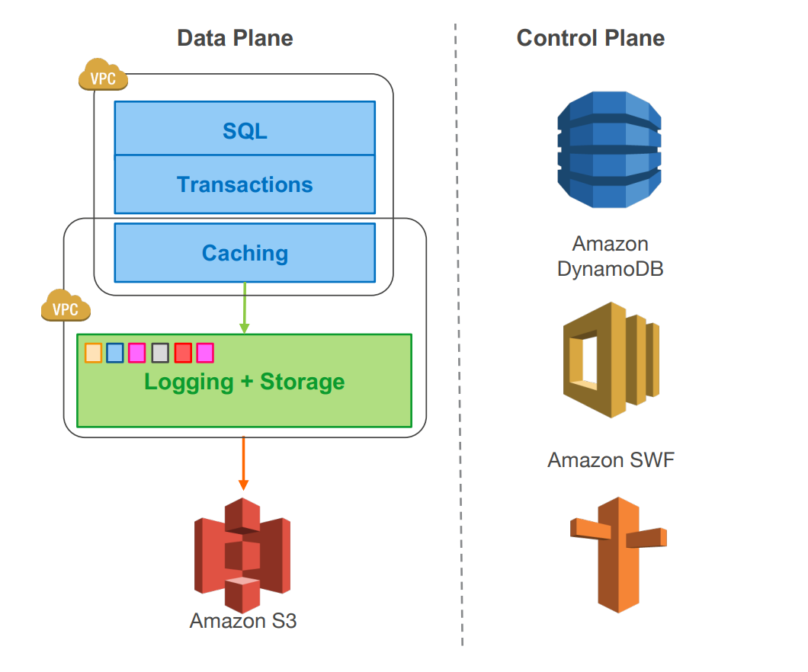

图 1：Move logging and storage off the database engine
	

本文介绍了 **Amazon Aurora**，这是一种全新的数据库服务。它通过在高度分布的云环境中更深层次地利用**重做日志**（redo log），有效地解决了前述问题。我们采用了一种创新的**面向服务的架构**（SOA，见图 1），其核心是一个支持**多租户**且具备**横向扩展**（scale-out）能力的存储服务。该服务抽象出了一种**虚拟化的分段重做日志**，并与数据库实例集群保持**松耦合**关系。尽管每个实例内部仍保留了传统数据库内核的大部分组件（包括查询处理器、事务管理、锁机制、缓冲池、访问方法以及 **undo 管理**），但诸如重做日志记录、持久化存储、崩溃恢复以及备份/恢复等关键功能，均已**卸载**（off-loaded）至专门的存储服务层。

我们的架构相比传统方案具有三个显著优势：

1. **首先，我们将存储构建为跨多个数据中心的独立、容错且具备自愈能力的服务。** 这种设计保护了数据库，使其免受网络或存储层**性能抖动**（performance variance）以及瞬时或永久性故障的影响。我们观察到：持久性（durability）故障可以建模为长时的可用性事件，而可用性事件又可以建模为长时的性能波动——一个设计良好的系统可以将这些问题进行统一化处理。
2. **其次，通过仅向存储层写入重做日志（redo log）记录，我们将网络 IOPS 降低了一个数量级。** 在消除这一瓶颈后，我们得以对其他大量的**资源竞争点**（points of contention）进行激进优化。相比于我们最初基于的 MySQL 原生代码库，Aurora 在吞吐量上实现了质的飞跃。
3. **最后，我们将一些最复杂且关键的功能（如备份和重做恢复）进行了转化。** 这些功能不再是数据库引擎中耗时且昂贵的一次性操作，而是转变为**平摊**（amortized）到大规模分布式集群中的持续异步操作。这使得系统无需**检查点**（checkpointing）即可实现近乎即时的崩溃恢复，并能在不干扰前台处理的情况下，实现低成本的备份。

在本文中，我们将讲述三大核心贡献：

1. **云规模下的持久性建模与容灾设计**：探讨如何在云环境下审视持久性（durability），并设计能够抵御**相关性故障**（correlated failures）的 **Quorum（多数派）系统**。（第 2 节）
2. **利用智能存储实现架构下推**：介绍如何通过将传统数据库的**底层组件（lower quarter）卸载（offloading）至存储层，从而充分发挥智能存储**的性能优势。（第 3 节）
3. **简化分布式存储流程**：阐述如何在分布式存储中省去**多阶段同步协议**、**崩溃恢复**过程以及**检查点**（checkpointing）机制。（第 4 节）

随后，我们将在第 5 节展示如何有机融合这三项核心理念，以构建 Aurora 的整体架构。第 6 节将对性能结果进行评估，第 7 节分享我们的实践经验与教训。最后，我们在第 8 节简要综述相关工作，并在第 9 节给出结论。

## 2. DURABILITY AT SCALE

一个数据库系统即便不具备其他任何功能，也必须履行其最核心的约定：**数据一旦写入，即须确保可读。**然而，现实中并非所有系统都能完美兑现这一承诺。在本节中，我们将论述 **Quorum 模型**的设计初衷、实施**存储分段**（segmenting storage）的原因，以及这两者的结合如何在提升**持久性**、**可用性**并减少**性能抖动**（jitter）的同时，协助我们解决大规模存储集群管理中的**运维**（operational）难题。

### 2.1 Replication and Correlated Failures

**数据库实例的生命周期与存储的生命周期之间并不存在强相关性。** 实例可能因故障而失效，用户也可能主动将其关闭，或是根据负载波峰波谷对其实例规格进行**扩缩容**（resize）。基于上述原因，将**存储层**与**计算层**进行**解耦**（decouple）具有极大的实际意义。

一旦实现了这一步（存算分离），存储节点和磁盘本身同样面临失效风险。因此，必须采用某种形式的**副本机制**（replicated），以增强系统对故障的**容错韧性**（resiliency）。在大规模云环境下，节点、磁盘及网络路径的故障如同一系列持续不断的低分贝“**背景噪声**”。这类故障的持续时间与**影响范围**（blast radius）各不相同。例如，节点可能遭遇瞬时的网络不可访问或因重启导致的短暂宕机；也可能发生磁盘、服务器节点、机架、**交换机**（leaf/spine switch）乃至整个数据中心的永久性故障。

在多副本系统中，一种容忍故障的常用方法是采用基于 **Quorum 的投票协议**。假设为一个冗余数据项的 $V$ 个副本各分配一张选票，那么执行读操作或写操作时，必须分别获得包含 $V_r$ 张选票的“**读 Quorum**”或包含 $V_w$ 张选票的“**写 Quorum**”。为了实现一致性，这些 Quorum 必须遵循以下两条准则：

1. **每次读操作必须能够感知到最近的一次写操作。** 该准则公式化表述为：

   $$
   V_r + V_w > V
   $$

   这一规则确保了用于读取的节点集合与用于写入的节点集合必然存在**交集**，从而保证读 Quorum 中至少有一个位置存放着最新的版本。
   
2. **每次写操作必须能够感知到前一次写操作以避免写入冲突。** 该准则公式化表述为：

   $$
   V_w > V/2
   $$

为了应对单节点失效（Single Node Loss），业界通用的做法是将数据备份至 3 个节点：

$$
V = 3
$$

并依赖于“2/3 写 Quorum”与“2/3 读 Quorum”机制，即：

$$
V_w = 2, \quad V_r = 2
$$

然而，我们认为 2/3 的 Quorum 配置并不能提供足够的保障。究其原因，需先剖析 AWS 中**可用区（Availability Zone，简称 AZ）**的概念。AZ 是地理区域（Region）内的逻辑子集，虽然各可用区之间通过低延迟链路互联，但在电力供应、网络架构、软件部署及自然灾害（如洪涝）等绝大多数故障风险维度上，AZ 之间是保持物理隔离的。

通过将数据副本跨可用区进行分布式存储，可以确保在大规模生产环境下，典型的故障模式仅会波及单一副本。这意味着，只要将三个副本分别部署在不同的可用区，系统不仅能有效容忍微观的单点故障，更能抵御影响范围更广的大规模灾难性事件。

然而，在规模庞大的存储集群（Storage Fleet）中，“背景故障噪声”的存在意味着在任何特定时刻，总会有部分磁盘或节点处于失效状态并处于修复流程中。这类故障通常独立分布在可用区 AZ 的 A、B 和 C 的各个节点上。此时，若 AZ 的 C 因火灾、机房损毁或洪涝等突发事件发生整区故障，对于那些在 AZ 的 A 或 AZ 的 B 中正巧存在并发故障副本的数据而言，其 Quorum 机制将会被彻底破坏。在这种情况下，以$$2/3$$ 读 Quorum 模型为例，由于我们实际上已经丢失了两个副本，系统将无法判断仅存的第三个副本是否包含了最新的数据状态。换言之，尽管各可用区内单个副本的失效是互不相关的随机事件，但**可用区级故障（AZ Failure）本质上是一种相关性故障（Correlated Failure）**，它会导致该区域内所有的磁盘和节点同时瘫痪。因此，健壮的 Quorum 机制必须具备同时容忍整区故障以及并发发生的常态化背景故障的能力。

在 Aurora 的研发中，我们确立了以下设计准则：

1. 在丢失整个可用区（AZ）且额外增加一个节点失效（即 **AZ+1** 故障）的情况下，确保**数据不丢失**；
2. 在丢失整个可用区的情况下，确保系统的**写入能力**不受影响。

为了达成这一目标，我们将每项数据在 3 个可用区内进行 6 路复制（Replication），即每个可用区各存放 2 个副本。我们采用了具有 6 个投票权重的 Quorum 模型，其具体配置如下：

$$
V = 6, \quad V_w = 4, \quad V_r = 3
$$

在该模型下，我们可以实现：

- **(a) 高读取可用性**：即使面对单个可用区故障叠加一个额外节点失效（共计 3 个节点故障），系统依然能维持读取可用性（因剩余 3 个副本仍满足 $V_r=3$）。
- **(b) 高写入可用性**：在任意两个节点失效（包括整个可用区级故障导致两个副本丢失）的情况下，系统依然能够维持写入可用性（因剩余 4 个副本仍满足 $V_w=4$）。

此外，只要能够确保读取 Quorum 的达成，我们便可以通过补齐额外的副本拷贝，来重新构建并恢复写入 Quorum。

### 2.2 Segmented Storage

接下来，我们需要探讨 $AZ+1$ 容错模型是否能提供充足的**持久性（Durability）**。在该模型下，若要确保数据万无一失，必须保证在修复单点故障的时间窗口内（即**平均修复时间MTTR**），由独立随机事件引发“双重故障”的概率（与**平均无故障时间MTTF** 相关）降至极低水平。如果双重故障发生的概率较高，一旦叠加可用区（AZ）级故障，系统的 Quorum 机制将会被彻底破坏。然而，在硬件层面进一步降低独立故障的发生率（提升 MTTF）往往存在物理瓶颈。因此，我们的设计核心转向了**缩短 MTTR**，以此来收缩系统处于双重故障威胁下的“**风险窗口**”（Window of Vulnerability）。

为了实现这一目标，我们将数据库卷（Volume）划分为固定大小的小型**数据分段（Segments）**，目前每个分段的大小设定为 **10GB**。这些分段以 6 副本模式组织为**保护组（Protection Groups, PGs）**；也就是说，每个 PG 由 6 个 10GB 的分段组成，跨 3 个可用区部署，且每个可用区各分布 2 个分段。从架构上看，一个逻辑存储卷是由一系列 PG 串联而成的集合。在物理实现上，这些分段部署在海量存储节点集群中，这些节点由挂载了 SSD 的 Amazon EC2 虚拟化主机组成。随着数据量的增长，系统会自动分配新的 PG。目前，在不计副本（原始容量）的情况下，我们支持单个存储卷扩展至 **64TB**。

**数据分段（Segment）**目前已成为我们应对独立背景噪声故障（Background Noise Failure）以及执行故障修复的基本单元。作为云服务的核心组成部分，我们会对故障进行实时监控并触发自动化修复流程。在 **10Gbps** 的网络链路下，修复一个 **10GB** 的分段仅需 **10 秒**。

这意味着，只有当以下极端情况在同一个 10 秒的修复窗口内并发时，系统的 Quorum 机制才会被破坏：

1. **同时发生两次**独立的分段故障；
2. 并且**叠加一个不包含**上述两个故障点的可用区（AZ）级故障。

根据我们观测到的实际故障率，即便考虑到 Aurora 为客户管理着海量的数据库实例，这种多重故障并发的概率在统计学意义上也是极低的，足以忽略不计。

### 2.3 Operational Advantages of Resilience

一个能够天然抵御长期故障（Long Failures）的系统，必然也具备抵御短期故障的能力。例如，一个足以应对可用区（AZ）长期瘫痪的存储系统，同样能够从容处理因电力波动或软件部署失败（需执行回滚）所导致的短暂中断。同理，如果系统能容忍 Quorum 成员数秒钟的不可用，那么它自然也能化解瞬时的网络拥塞或存储节点的高负载压力。

由于我们的系统具备极高的故障容忍度，我们可以巧妙地利用这一特性来执行那些会导致数据分段（Segment）暂时不可用的运维操作。

- **热点管理（Heat Management）**：其处理过程变得非常直观。我们可以将处于高负载（“热”）磁盘或节点上的某个分段标记为“坏损”，系统便会通过 Quorum 修复机制，迅速将其迁移至集群中负载较低的“冷”节点上。
- **系统补丁（OS and Security Patching）**：对于正在执行补丁更新的存储节点而言，这仅被视为一次极短时间的不可用事件。
- **软件升级（Software Upgrades）**：我们甚至以同样的方式管理存储集群的软件升级。升级过程按可用区（AZ）逐一顺序执行，并严格确保同一个保护组（PG）中同时处于升级状态的成员数不超过一个。

这种设计使我们能够在存储服务中引入**敏捷方法论（Agile Methodologies）并实现快速部署（Rapid Deployments）**。

## 3.THE LOG IS THE DATABASE

在本节中，我们将阐述为何在第 2 节所述的“分段式副本存储系统”上运行传统数据库，会导致在**网络 I/O** 与**同步停顿（Synchronous Stalls）**方面产生难以逾越的性能负担。

随后，我们将介绍 Aurora 的核心方案：**将日志处理逻辑卸载（Offload）至存储服务层**，并结合实验数据证明该方案能够显著降低网络 I/O 开销。最后，我们将详细描述存储服务中所采用的各项关键技术，以最大程度地减少同步停顿及不必要的冗余写入。

### 3.1 The Burden of Amplied Writes

我们的存储卷分段模型、6 路副本复制以及 $4/6$ 写 Quorum 机制共同赋予了系统极高的容错弹性。然而，对于像 MySQL 这样在处理单次应用层写入时会产生多种不同实际 I/O 操作的传统数据库而言，该模型引发的性能负担是难以承受的。

多副本机制进一步放大了原本就已高企的 I/O 流量，给系统带来了沉重的**每秒数据包数（PPS）负担。此外，这些 I/O 操作还构成了诸多同步点（Points of Synchronization）**，不仅会导致执行流水线停顿（Stall），还会显著拉长延迟。尽管链式复制（Chain Replication）及其替代方案能够有效降低网络开销，但它们依然无法摆脱同步停顿和累加延迟的困扰。

以 MySQL 为代表的系统，不仅需要将**数据页（Data Pages）写入其暴露的对象（如堆文件、B 树等），还需将重做日志记录（Redo Log Records）写入预写日志（Write-Ahead Log, WAL）**。每条重做日志记录本质上描述了数据页修改前后的状态差异，即“**前像（Before-image）**”与“**后像（After-image）**”之间的增量。通过将日志记录应用于数据页的前像，即可重新生成对应的后像。

在实际生产环境中，系统还必须处理其他数据的协同写入。例如，考虑一种跨数据中心实现高可用性（HA）的**同步镜像（Synchronous Mirrored）** MySQL 配置，其以图 2 所示的**主备模式（Active-Standby）**运行：

- **活动实例（Active Instance）**：部署在可用区 AZ1，底层使用 Amazon Elastic Block Store (**EBS**) 网络存储。
- **备用实例（Standby Instance）**：部署在可用区 AZ2，同样挂载 EBS 网络存储。

在此架构下，所有对主 EBS 卷的写入操作都必须通过**软件镜像（Software Mirroring）**技术，同步至备用 EBS 卷。

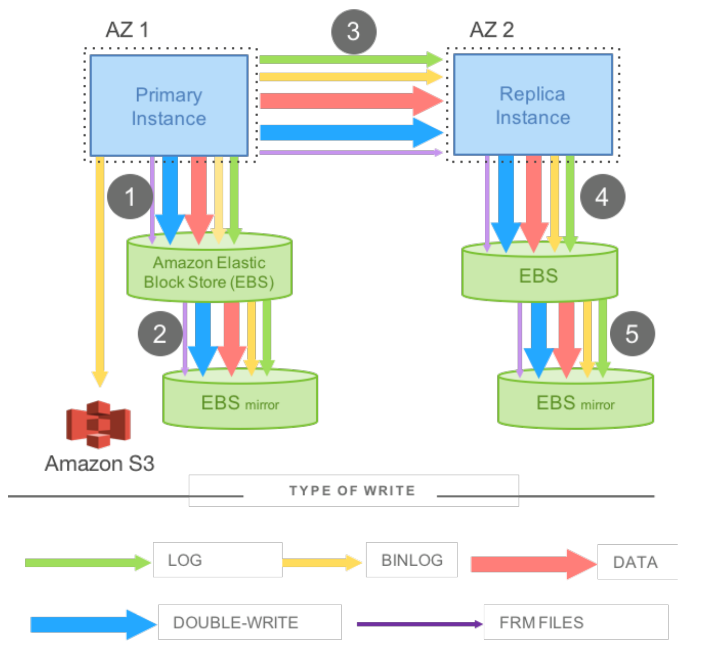

图 2：Network IO in mirrored MySQL

图 2 展示了数据库引擎需要写入的多种数据类型：

- **重做日志（Redo Log）**；
- **二进制日志（Binary Log/Binlog）**：主要用于语句级（Statement）记录，并归档至 Amazon S3 以支持任意时间点恢复（Point-in-time Restores）；
- **修改后的数据页**；
- **双写（Double-write）**：为了防止页面断裂（Torn Pages）而对数据页进行的第二次临时性写入；
- **元数据文件（FRM Files）**。

该图进一步揭示了实际 I/O 流的执行顺序：

1. **步骤 1 与 2**：写入请求被下发至 **EBS**，EBS 继而将其同步至**可用区（AZ）本地镜像**；只有当两者均完成持久化后，系统才会收到确认（ACK）。
2. **步骤 3**：通过同步块级软件镜像（Synchronous Block-level Software Mirroring），将写入操作传输至**备用实例（Standby Instance）**。
3. **步骤 4 与 5**：数据最终被写入备用实例的 **EBS 卷**及其关联的镜像中。

上述 MySQL 镜像模型存在显著弊端，这不仅源于其**写入机制**，更取决于其**写入内容**。

首先，在该流程中，步骤 1、3 和 5 具有明显的串行性与同步性。由于大量写入操作必须按序执行，导致延迟呈现出**累加效应（Additive Latency）**。同时，由于即便在异步写入场景下，系统也必须等待执行最慢的操作完成才能返回，这使得**性能抖动（Jitter）**被显著放大，导致系统极易受“离群值”（Outliers，即慢节点请求）的影响而陷入瘫痪。从分布式系统的视角审视，该模型实质上可被视为执行了 **4/4 写 Quorum** 机制。这意味着系统在面对节点失效或长尾性能波动时表现得异常脆弱。其次，由 OLTP 应用引发的用户操作会产生多种不同类型的写入，而这些写入往往是对相同信息的重复表达——例如，为了防止存储基础设施层出现“页面断裂”（Torn Pages）而引入的**双写缓冲（Double Write Buffer）**操作，本质上就是对同一数据的冗余写入。

### 3.3 Offloading Redo Processing to Storage

在传统数据库中，修改数据页的操作会生成一条**重做日志记录（Redo Log Record）**，并调用日志应用逻辑（Log Applicator），将该记录作用于内存中该页面的“**前像（Before-image）**”，从而生成修改后的“**后像（After-image）**”。对于事务提交（Transaction Commit）而言，系统强制要求必须完成日志的持久化写入。相比之下，实际数据页的刷盘（Write）操作则可以**延迟执行**。

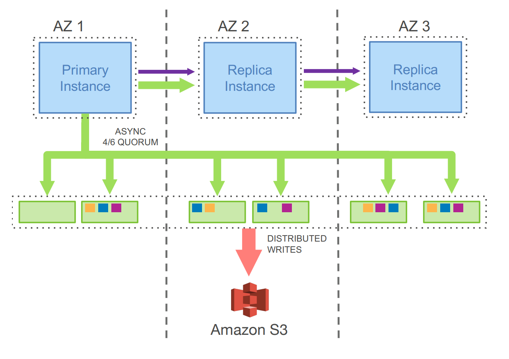

图 3：Network IO in Amazon Aurora
	

在 Aurora 架构中，跨网络传输的唯一写入操作是**重做日志记录（Redo Log Records）**。数据库层（计算层）永远不会向外写出数据页——无论是后台写入、**检查点（Checkpointing）**操作，还是因**缓存淘汰（Cache Eviction）**引发的写盘。相反，我们将日志应用逻辑（Log Applicator）**下推（Pushed）**到了存储层。在该层，系统可以利用这些日志在后台或根据即时需求生成数据库页。当然，如果每次生成页面都要从其诞生之初的完整修改链开始溯源，其代价将高昂到难以接受。因此，我们在后台持续执行数据库页的**物化（Materialization）**操作，以避免每次按需读取时都必须从头开始重新生成。

值得注意的是，从正确性（Correctness）的角度来看，后台物化完全是一个可选过程：对于数据库引擎而言，“**日志即数据库**”，存储系统所物化的任何页面本质上仅仅是日志应用结果的一种**缓存**。此外，与传统的检查点机制不同，Aurora 仅在特定页面的修改链过长时才需要重新物化。传统检查点受制于整个重做日志链的长度，而 Aurora 的页面物化则仅受特定页面修改链长度的约束。

尽管为了实现多副本复制而增加了写入操作，但我们的方案极大地降低了网络负载，并在显著提升性能的同时确保了极高的持久性。存储服务能够以**高度并行（Embarrassingly Parallel）**的方式实现 I/O 的横向扩展，且不会对数据库引擎的写入吞吐量产生负面影响。

以图 3 为例，一个 Aurora 集群包含一个主实例（Primary Instance）以及部署在多个可用区（AZ）内的多个副本实例（Replica Instances）。在该模型下，主实例仅向存储服务写入日志记录，同时将这些日志记录及元数据更新同步流传（Stream）给各副本实例。在具体的 I/O 流程中，系统会根据共同的目的地（即逻辑分段，或称保护组 PG）对**完全有序（Fully Ordered）**的日志记录进行批处理（Batching），并将每个批次分发至全部 6 个副本。当批次在磁盘上完成持久化后，数据库引擎只需等待 6 个副本中的 4 个返回确认（ACK），即可满足“写 Quorum”要求，并认定相关日志记录已进入**持久化（Durable）**或**固化（Hardened）**状态。随后，副本实例会利用这些重做日志记录来更新其自身的缓冲池（Buffer Cache）。

为了对网络 I/O 进行量化测评，我们针对上文所述的两种配置方案，使用 SysBench [9] 的**纯写负载（Write-only Workload）**和 **100GB** 数据集进行了对比实验。这两种配置分别为：

1. 跨多个可用区（Multi-AZ）部署的**同步镜像式 MySQL** 配置；
2. **RDS Aurora** 配置（其副本同样跨多个可用区部署）。

在这两组实验中，测试均在 `r3.8xlarge` 规格的 EC2 实例上运行，数据库引擎持续测试时长为 30 分钟。

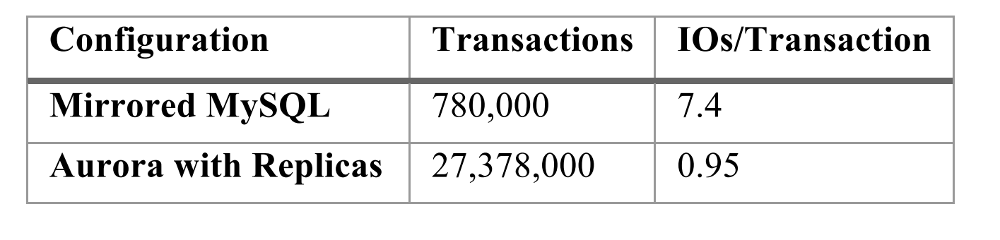

表 1：Network IOs for Aurora vs MySQL
	

实验结果汇总于表 1。在 30 分钟的测试期内，**Aurora 能够支撑的事务处理量达到了镜像式 MySQL 的 35 倍**。尽管 Aurora 将写操作放大了 6 倍（6 副本），且在统计中尚未计入 EBS 内部的链式复制开销以及 MySQL 的跨可用区写入开销，但 Aurora 数据库节点上的**每事务 I/O 数（I/Os per transaction）仍比镜像式 MySQL 少了 7.7 倍**。由于每个存储节点仅负责处理 6 个副本中的一个，其接收到的写入操作并未经过进一步放大，这使得存储层所需处理的 I/O 数量大幅削减了 **46 倍**。通过大幅精简网络传输数据量，我们获得了宝贵的性能余量。这使我们能够更加激进地采用多副本策略来增强系统的持久性与可用性，并能以并行方式下发请求，从而最大限度地抵消性能抖动（Jitter）带来的负面影响。

将计算逻辑移至存储服务还通过**最小化崩溃恢复时间**显著提升了系统可用性，并彻底消除了由检查点（Checkpointing）、后台数据页写入以及备份等后台进程引发的性能抖动。

让我们深入分析崩溃恢复过程。在传统数据库中，系统在发生崩溃后，必须从最近的一个检查点开始重放（Replay）重做日志，以确保所有已持久化的重做记录（Redo Records）均已生效。而在 Aurora 中，重做记录的应用是**在存储层以持续、异步且分布式的方式**在整个节点集群中进行的。当针对某个数据页发起读取请求时，若该页面尚未更新至最新状态，存储节点会实时应用相关的重做记录。因此，崩溃恢复的压力被分摊到了所有的常规前台业务处理中。在数据库启动时，**无需执行任何预先的恢复操作**。

### 3.3 Storage Service Design Points

我们存储服务的一项核心设计准则是：**最大限度地降低前台写入请求的延迟**。为此，我们将绝大部分存储处理逻辑移至后台执行。鉴于存储层接收到的前台请求在峰值与均值之间存在天然波动，我们拥有充足的时间在非前台路径（Foreground Path）上完成这些任务。此外，这种架构使我们能够灵活地执行“以 CPU 换磁盘”的资源调度。例如，当存储节点正忙于处理前台写入请求时，除非磁盘容量即将耗尽，否则无需同步运行旧版本页面的垃圾回收（GC）。

在 Aurora 中，**后台处理与前台处理呈现负相关特性**。这与传统数据库截然不同——在传统架构中，由于前台负载增加会导致脏页堆积，数据页的后台写入及检查点（Checkpointing）操作往往与前台负载呈**正相关**（即系统越忙，后台刷盘压力越大）。在 Aurora 中，若系统出现任务积压，我们会对前台活动进行节流（Throttling）以防止队列过长。由于数据分段（Segments）是以“高熵”（即高度随机且均匀）的方式分布在各个存储节点上的，因此单一存储节点的限流操作可以被我们的 **4/6 Quorum 写入机制**轻松化解，在逻辑上仅表现为一个响应稍慢的节点。

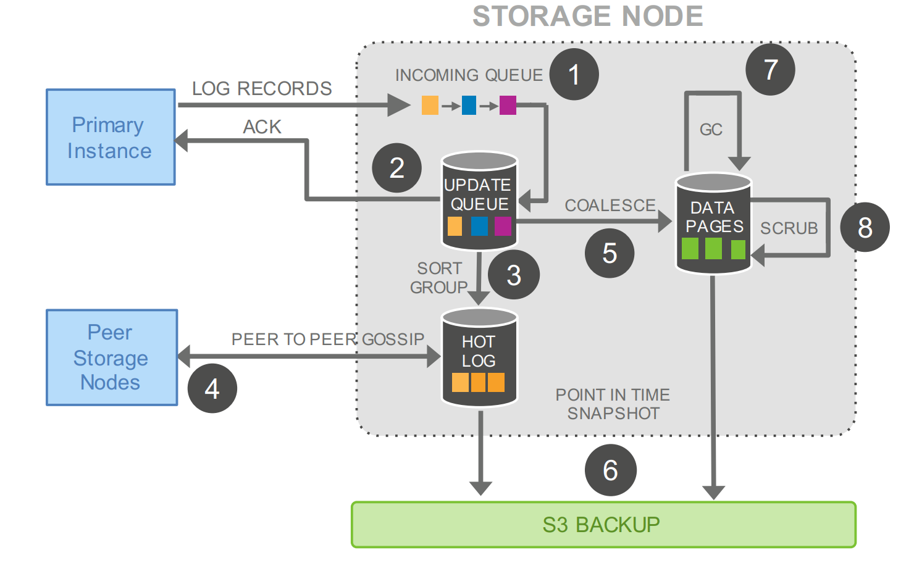

图 4：IO Traffic in Aurora Storage Nodes

让我们更详细地审视存储节点上的各项活动。如图 4 所示，该流程包含以下步骤：

1. **接收日志记录**并将其添加至内存队列中；
2. 将记录**持久化至磁盘**并向计算层返回确认信号（ACK）；
3. 整理记录并**识别日志空洞**（由于部分批次可能在传输中丢失）；
4. 通过 **Gossip 协议**与同伴节点通信，以补全缺失的日志空洞；
5. 将重做日志记录**合并（Coalesce）**为新的数据页（即物化过程）；
6. 定期将日志及新生成的页面**暂存（Stage）至 S3** 进行归档；
7. 定期对旧版本的页面执行**垃圾回收（GC）**；
8. 定期对页面进行 **CRC 循环冗余校验**，以确保数据完整性。

需要特别注意的是，上述所有步骤不仅都是**异步执行**的，而且**只有步骤 (1) 和 (2) 处于前台路径（Foreground Path）中**，可能直接影响系统的写入延迟。

## 4. THE LOG MARCHES FORWARD

在本节中，我们将阐述数据库引擎生成日志的具体机制，以确保系统的**持久化状态（Durable State）**、**运行时状态（Runtime State）**以及**副本状态（Replica State）**始终保持一致。

特别地，我们将重点介绍如何通过高效的手段实现一致性，从而规避开销巨大的**二阶段提交（2PC）协议**。

- 首先，我们将展示如何避免在崩溃恢复过程中执行昂贵的重做（Redo）处理；
- 其次，我们将解释系统的常规运行机制，以及我们如何维护运行时状态与副本状态；
- 最后，我们将提供恢复流程的具体细节。

### 4.1 Solution sketch: Asynchronous Processing

由于我们将数据库建模为重做日志流（如第 3 节所述），因此可以利用日志作为**有序变更序列**不断推进这一事实。在实践中，每条日志记录都关联有一个**日志序列号（Log Sequence Number, LSN）**，这是由数据库生成的单调递增值。这一特性允许我们采用异步方式来处理一致性问题，从而简化维护状态的共识协议，而无需使用像 **2PC（二阶段提交）** 这种通信交互频繁（Chatty）且容错能力差的协议。

从宏观架构上看，我们维护了一系列**一致性点（Points of Consistency）与持久性点（Points of Durability）**；随着收到未完成存储请求的确认（ACK），我们会持续推进这些点。由于单个存储节点可能会遗漏一条或多条日志记录，它们会与所属保护组（PG）内的其他成员进行 **Gossip** 通信，以识别并填补日志空洞（Gaps）。此外，由数据库维护的运行时状态允许我们在大多数情况下执行**单分段读取（Single Segment Reads）**，而无需进行 Quorum 读取，除非是在状态丢失且必须重建的恢复场景下。

数据库中可能存在多个**执行中（Outstanding）**的隔离事务，这些事务完成（即达到终态并实现持久化）的顺序可能与其初始发起的顺序不一致。假定数据库发生崩溃或重启，针对这些独立事务是否需要执行**回滚（Rollback）**的判定是相互分离的。数据库引擎负责维护跟踪“部分完成事务”并执行**撤销（Undo）操作的逻辑，其行为表现与向常规物理磁盘写入数据时并无二致。然而，在系统重启后、数据库获准访问存储卷之前，存储服务会执行一套自身的恢复流程。该流程的重心并非用户级事务，而是旨在确保存储层即便具备分布式特性，仍能向数据库呈现一个统一的存储视图（Uniform View）**。

存储服务会确定一个最高的 LSN，并保证在该序列号之前的所有日志记录均已完整可用，这一指标被称为 **VCL（Volume Complete LSN，卷完整 LSN）**。在存储恢复阶段，所有 LSN 大于 VCL 的日志记录都必须被截断（Truncated）。然而，数据库可以通过标记特定的日志记录并将其指定为 **CPL（Consistency Point LSN，一致性点 LSN）**，从而进一步限定允许进行截断的子集点。基于此，我们将 **VDL（Volume Durable LSN，卷持久 LSN）** 定义为“不大于 VCL 的最高 CPL”，并截断所有 LSN 大于 VDL 的日志记录。

例如：即便存储层已经拥有截止至 LSN 1007 的完整物理数据，但如果数据库引擎声明的 CPL 仅包含 900、1000 和 1100，在这种情况下，系统必须在 1000 处执行截断。此时，数据的“完整性（Complete）”达到了 1007，但“持久性（Durable）”仅计至 1000。

综上所述，“完整性（Completeness）”与“持久性（Durability）”是两个不同的概念。**CPL（一致性点 LSN）**可以被视为界定了某种受限形式的存储系统事务，且这些事务必须按序被接收。如果客户端（即上层引擎）不需要这种区分，它可以简单地将每一条日志记录都标记为 CPL。

在实际运行中，数据库引擎与存储层的交互遵循以下流程：

1. 每个**数据库级事务**被拆分为多个**微事务（Mini-Transactions, MTRs）**；这些 MTR 是有序的，且必须以原子化方式执行。
2. 每个微事务由多条连续的日志记录组成（数量根据需要而定）。
3. **微事务中的最后一条日志记录被标记为一个 CPL。**

在恢复阶段，数据库引擎与存储服务进行通信，以确定每个**保护组（PG）**的持久化点，并据此确立全卷的 **VDL（卷持久 LSN）**。随后，数据库会下达指令，将 VDL 之上的所有日志记录进行截断（Truncate）处理。

### 4.2 Normal Operation

接下来，我们将详细阐述数据库引擎的“**常规运行（Normal Operation）**”模式，并依次针对写入、读取、事务提交以及副本机制展开讨论。

#### 4.2.1 Writes

在 Aurora 中，数据库（计算层）与存储服务保持持续交互，通过维护内部状态来达成 Quorum（法定人数）、推进卷持久性水位，并将事务标记为已提交。例如，在**正常/正向路径（Normal/Forward Path）**中，每当数据库接收到足够数量的确认（ACK）以满足各日志记录批次的写 Quorum 要求时，系统便会相应地推进当前的 **VDL（卷持久 LSN）**。

在任意特定时刻，数据库内可能存在大量活跃的并发事务，且每个事务都在生成各自的重做日志记录。数据库会为每条日志记录分配一个唯一且有序的 LSN。然而，这一分配过程受到如下约束：所分配的 LSN 值不得超过当前 VDL 与一个常数之和，该常数被称为 **LSN 分配限制（LSN Allocation Limit，简称 LAL）**（目前设定为 1,000 万）。其数学约束关系如下：

$$
LSN_{allocated} \le VDL + LAL
$$

引入该限制的目的在于确保数据库的进度不会过度领先于存储系统。同时，它起到了一种**背压（Back-pressure）**的作用，当存储层或网络带宽无法及时跟上处理进度时，该机制能够有效地**节流（Throttle）**传入的写请求，从而维持系统的稳定性。

需要注意的是，每个保护组（PG）中的各个**分段（Segment）仅能接收到存储卷中与其承载页面相关的日志记录子集。为了在分段维度维护日志的逻辑顺序，每条日志记录都包含一个反向链接（Backlink）**，用于指向该 PG 内部的前一条日志记录。利用这些反向链接，系统可以追踪已到达各分段的日志记录的完整性，进而确立**分段完整 LSN（Segment Complete LSN，简称 SCL）**。SCL 标识了这样一个临界值：在该分段接收到的属于该 PG 的日志序列中，SCL 之下（含）的所有日志记录均已完整送达，不存在任何缺失。存储节点在利用 **Gossip 协议**进行对等通信时会交换 SCL 信息，以此精准地识别并补全彼此遗漏的日志条目。

#### 4.2.2 Commits

在 Aurora 中，事务提交是以**异步方式**完成的。当客户端发起事务提交请求时，负责处理该请求的线程会记录下该事务的“**提交 LSN（Commit LSN）**”，将其放入一个专门的“待提交事务列表”中暂时挂起，随后便立即转去执行其他任务。

Aurora 对 **WAL（预写日志）协议**的等效实现逻辑如下：当且仅当当前的 **VDL（卷持久 LSN）** 大于或等于某个事务的提交 LSN 时，该事务才被视为正式完成提交。

$$
\text{Commit Completion} \iff VDL \ge \text{Transaction's Commit LSN}
$$

随着 VDL 的不断推进，数据库会自动识别出列表中已满足提交条件的事务，并利用**专门的确认线程**向等待中的客户端发送提交确认信号（ACK）。在此过程中，**工作线程（Worker Threads）**无需因等待提交结果而陷入阻塞或停顿，它们只需不断拉取其他待处理的请求并持续进行计算。

#### 4.2.3 Reads

与大多数数据库系统类似，Aurora 优先从缓冲池（Buffer Cache）中提供数据页访问；只有当请求的页面不在缓存中时，才会触发存储 I/O 请求。当缓冲池满时，系统必须选出一个**淘汰页（Victim Page）**将其从缓存中驱逐。在传统数据库系统中，如果被选中的是“**脏页**”，则必须在替换前将其刷入磁盘，以确保后续对该页的读取总能获得最新数据。

尽管 Aurora 数据库在页面淘汰（或任何其他场景下）**从不向外写出数据页**，但它强制执行了一项类似的等效保证：缓冲池中的页面必须始终为最新版本。该保证的实现逻辑是：只有当一个页面的“**页面 LSN**”（标识该页最后一次修改所对应的重做日志序列号）**小于或等于** $VDL$ 时，才允许将其从缓存中淘汰。

该协议确保了以下两点：

- **(a)** 该页面涉及的所有修改均已在重做日志中完成**固化（Hardened）**；
- **(b)** 在发生缓存未命中（Cache Miss）时，系统只需请求截止至当前 $VDL$ 的页面版本，即可获取其最新的持久化版本。

在正常情况下，数据库无需通过读 Quorum 来达成一致性共识。当需要从磁盘读取数据页时，数据库会确立一个**读时间点（Read-point）**，该点代表请求发起时刻的 $VDL$。随后，数据库可以选择一个相对于该读时间点具有完整性（Complete）的存储节点，从而确保获取到该页面的最新版本。

存储节点返回的页面必须符合数据库中**微事务（MTR）**的预期语义一致性。由于数据库直接管理向存储节点的日志分发，并实时追踪处理进度（即每个分段的 $SCL$），因此它通常能够精准识别出哪个分段具备满足读取请求的能力（即 $SCL$ 大于或等于读时间点的分段）。基于此，数据库可以直接向拥有充足数据的分段发起读取请求，而无需跨节点比对。

鉴于数据库引擎感知所有**执行中的读取（Outstanding Reads）**请求，它可以在任意时刻计算出基于各保护组（PG）维度的“最小读取点 LSN”。若系统中存在只读副本，主节点（Writer）会与副本进行通信，以确立跨所有节点的 PG 级最小读取点 LSN。

该值被称为 **$PGMRPL$（Protection Group Min Read Point LSN，保护组最小读取点 LSN）**，它代表了一个“**低水位线**”：在此水位线之下的所有该 PG 的日志记录均已失去存在的必要。换言之，存储节点的分段可以确信，未来绝不会再收到读取点（Read-point）低于 $PGMRPL$ 的页面读取请求。每个存储节点都会从数据库端获知 $PGMRPL$，并据此通过合并（Coalescing）旧日志记录来推进磁盘上已物化的数据页，随后安全地执行日志的**垃圾回收（Garbage Collection）**。至于实际的并发控制协议，则完全在数据库引擎中执行，其运作方式与传统 MySQL 组织本地存储的数据页和 **Undo 段（Undo Segments）**的逻辑完全一致。

#### 4.2.4 Replicas

在 Aurora 中，单个主节点（Writer）和多达 15 个只读副本可以同时挂载同一个**共享存储卷**。因此，只读副本在存储容量消耗或磁盘写操作方面不会产生任何额外成本。为了最大限度地降低延迟，主节点生成的、发送至存储节点的日志流也会同步发送给所有只读副本。在副本端，数据库通过依次处理这些记录来消费日志流。

- 如果某条日志记录涉及的页面恰好存在于**副本的缓冲池（Buffer Cache）**中，副本将利用日志应用器（Log Applicator）将指定的重做操作作用于缓存中的该页面。
- 否则，副本将直接丢弃该条日志记录。

需要注意的是，从主节点的视角来看，副本消费日志的过程是**异步**的，主节点对用户提交的确认独立于副本的进度。副本在应用日志记录时遵循以下两条核心规则：

1. **(a)** 仅应用 **$LSN \le VDL$** 的日志记录；
2. **(b)** 属于同一个**微事务（MTR）的日志记录必须在副本缓存中原子化地应用**，以确保副本能够看到所有数据库对象的一致性视图。

在实践中，每个副本落后主节点的延迟通常维持在极短的时间间隔内（**20 毫秒或更短**）。

### 4.3 Recovery

大多数传统数据库采用类似于 **ARIES [7]** 的恢复协议，该协议依赖于**预写日志（Write-ahead Log, WAL）**来记录所有已提交事务的精确内容。此外，这些系统会定期对数据库执行**检查点（Checkpoint）**操作，通过将内存中的脏页（Dirty Pages）刷入磁盘并在日志中写入一条检查点记录，以粗粒度的方式确立持久化点。

在系统重启时，任何给定的数据页要么可能缺失部分已提交的数据，要么可能包含尚未提交的数据。因此，在崩溃恢复期间，系统必须处理自上一个检查点以来的所有重做日志记录，利用日志应用逻辑将每条记录作用于相关的数据库页。这一过程使数据库页面恢复到发生故障时刻的一致性状态，随后再通过执行相关的撤销日志记录（Undo Log Records）来回滚崩溃时的在途事务（In-flight Transactions）。崩溃恢复通常是一项代价高昂的操作。虽然缩短检查点间隔有助于缩短恢复时间，但这会以干扰前台事务的性能为代价。而在 Aurora 中，则完全不需要这种权衡。

传统数据库遵循的一项极其卓越的简化原则在于：无论是在正向处理路径（Forward Processing Path）还是在恢复阶段，系统均调用相同的**重做日志应用逻辑（Redo Log Applicator）**。但在传统模式下，恢复过程是在数据库处于离线状态时，以同步且前台阻塞的方式运行的。

Aurora 同样沿袭了这一设计原则，但进行了关键性的架构改良：我们将重做日志应用逻辑与数据库引擎实现了彻底**解耦**，并将其下推至存储节点执行。该逻辑不仅能跨节点并行执行，而且在系统运行期间始终在后台持续工作。当数据库实例启动时，它会协同存储服务执行“**卷恢复（Volume Recovery）**”。得益于这种设计，即便数据库在每秒处理超过 **100,000 次写入语句**的高负载下发生崩溃，Aurora 依然能够实现极速恢复（通常耗时**不超过 10 秒**）。

数据库在崩溃后确实需要重建其运行时状态。在此场景下，数据库会针对每个保护组（PG）连接一个**读 Quorum（Read Quorum）**的分段。根据 Quorum 协议，读 Quorum 足以确保发现任何可能已达到写 Quorum 的数据。一旦数据库为每个 PG 都建立了读 Quorum，它就能重新计算出 **VDL（卷持久 LSN）**。随后，系统会生成一个**截断范围（Truncation Range）**，将新 VDL 之后的所有日志记录全部废弃。该范围的上限 LSN 能够证明至少与系统可能见过的最高悬挂日志记录持平。

数据库之所以能推导出这个上限，是因为它负责分配 LSN，并限制了分配进度领先于 VDL 的幅度（即前文提到的 **1,000 万个 LSN 的限制**）。这些截断范围带有**纪元号（Epoch Numbers）**版本标识，并被持久化写入存储服务，以确保在恢复过程本身被中断并重启时，截断操作的持久性不会产生混淆。

此外，数据库仍需执行**撤销恢复（Undo Recovery）**，以回滚崩溃时刻尚未完成的“在途事务”。然而，在系统根据 **Undo 段（Undo Segments）**构建出这些在途事务的列表后，撤销恢复可以在**数据库在线（Online）**的状态下进行。

## 5. PUTTING IT ALL TOGETHER

在本节中，我们将介绍 Aurora 的核心构建模块，其整体架构概览如图 5 所示。

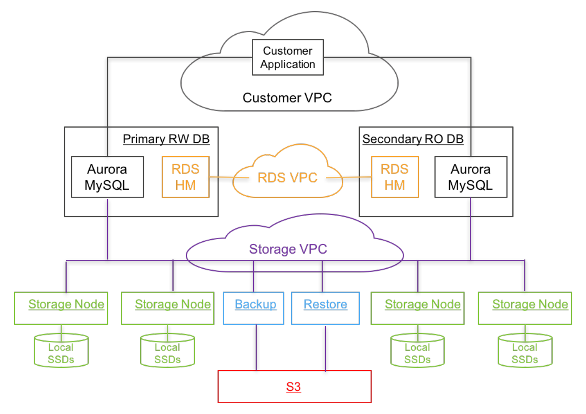

图  5：Aurora Architecture: A Bird's Eye View

Aurora 的数据库引擎是社区版MySQL/InnoDB 的一个分支（Fork），其主要差异体现在 **InnoDB 读写磁盘数据的方式**上。在社区版 InnoDB 中，写入操作会导致缓冲池页面（Buffer Pages）被修改，而相关的重做日志（Redo Log）记录会按 LSN 顺序写入预写日志（WAL）的缓冲区。在事务提交时，WAL 协议仅要求将该事务的重做日志记录持久化写入磁盘。至于实际被修改的缓冲池页面，最终会通过**双写技术（Double-write technique）**写入磁盘，以规避“部分页面写入”（即页面断裂）的问题。

这些页面写入操作通常发生于后台、缓存淘汰过程或执行检查点期间。除 I/O 子系统外，InnoDB 还包含事务子系统、锁管理器、B+ 树实现以及相关的“**微事务（Mini Transaction, MTR）**”概念。MTR 是仅在 InnoDB 内部使用的构建模块，用于对必须原子化执行的操作组进行建模（例如 B+ 树页面的拆分或合并）。

在 Aurora 的 InnoDB 变体中，代表每个 **MTR（微事务）** 内必须原子执行的变更的重做日志记录，被组织成按其所属 **PG（保护组）** 进行分片的批次，并写入存储服务。每个 MTR 的最后一条日志记录会被标记为一个**一致性点（Consistency Point）**。

Aurora 在主节点（Writer）上支持与社区版 MySQL 完全相同的隔离级别（包括标准 ANSI 隔离级别、**快照隔离**或一致性读）。Aurora 的只读副本会持续获取主节点上事务开始与提交的信息，并利用这些信息为本地事务（当然是只读事务）提供快照隔离支持。需要注意的是，**并发控制（Concurrency Control）完全在数据库引擎中实现，不会对存储服务产生影响。存储服务向外呈现的是底层数据的统一视图**，其在逻辑上与在社区版 InnoDB 中将数据写入本地存储所获得的结果完全一致。

Aurora 利用 Amazon RDS（关系型数据库服务）作为其**控制平面（Control Plane）**。RDS 在每个数据库实例上部署了一个名为**主机管理器（Host Manager, HM）**的代理程序，负责监控集群的健康状况，并判定是否需要触发故障转移（Failover）或更换受损实例。每个数据库实例都是集群的一部分，一个集群包含一个单一的主节点（Writer）以及零个或多个只读副本（Read Replicas）。集群内的所有实例均位于同一个地理区域（Region，如 us-east-1），通常跨多个可用区（AZ）部署，并连接到该区域内的统一存储集群（Storage Fleet）。

出于安全考虑，我们对数据库、应用程序与存储之间的通信进行了隔离。在实践中，每个数据库实例通过三个独立的 **Amazon VPC（虚拟私有云）** 网络进行通信：

1. **客户 VPC**：客户端应用程序通过该网络与数据库引擎进行交互；
2. **RDS VPC**：数据库引擎与控制平面之间通过该网络进行内部交互；
3. **存储 VPC**：数据库引擎通过该网络与存储服务集群进行数据传输。

存储服务部署在由 EC2 虚拟机组成的集群上，这些虚拟机跨越每个区域（Region）内至少 3 个可用区（AZ）进行配置。该集群共同负责配置多个客户存储卷、执行这些卷的数据读写，以及完成数据的备份与恢复。存储节点直接操作本地 SSD，并与数据库引擎实例、其他对等存储节点以及备份/恢复服务进行交互；备份/恢复服务负责持续将变更数据备份至 S3，并根据需要从 S3 恢复数据。

存储控制平面利用 **Amazon DynamoDB** 数据库服务来持久化存储集群与存储卷的配置信息、卷元数据，以及备份至 S3 的数据详细描述。针对长时运行操作的编排（例如数据库卷的恢复操作，或存储节点故障后的修复/副本重构操作），存储控制平面采用了 **Amazon Simple Workflow Service (SWF)**。为了维持高可用性，系统需要对现实及潜在问题进行主动、自动化且早期的探测，以确保在最终用户受到影响之前解决问题。存储运营的所有关键环节均受到指标采集服务的持续监控，一旦关键性能或可用性指标异常，系统将立即触发警报。

## 6. PERFORMANCE RESULTS

在本节中，我们将分享 Aurora 自 2015 年 7 月正式商用（Generally Available, GA）以来，作为生产级服务的实际运行经验。我们首先汇总了该系统在行业标准基准测试（Benchmarks）下的表现，随后将展示来自真实客户环境的部分性能测评结果。

### 6.1 Results with Standard Benchmarks

在此，我们展示了通过 SysBench 和 TPC-C 变体等行业标准基准测试，对比 Aurora 与 MySQL 性能的各项实验结果。在对比实验中，我们将 MySQL 运行在挂载了 **30K 预置 IOPS（Provisioned IOPS）** 的 EBS 卷实例上。除非另有说明，实验所采用的硬件环境均为 **r3.8xlarge** EC2 实例，其规格如下：

- **计算资源**：32 个 vCPU。
- **处理器**：Intel Xeon E5-2670 v2 (Ivy Bridge)。
- **内存**：总计 244GB。
- **数据库配置**：在 r3.8xlarge 实例上，数据库**缓冲池（Buffer Cache）**均统一设置为 170GB。

#### 6.1.1 Scaling with instance sizes

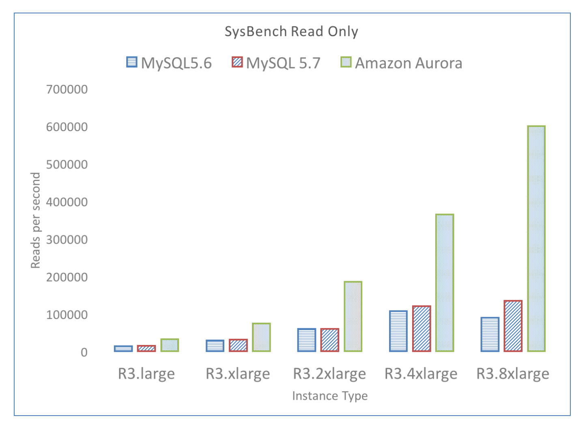

图 6：Aurora scales linearly for read-only workload

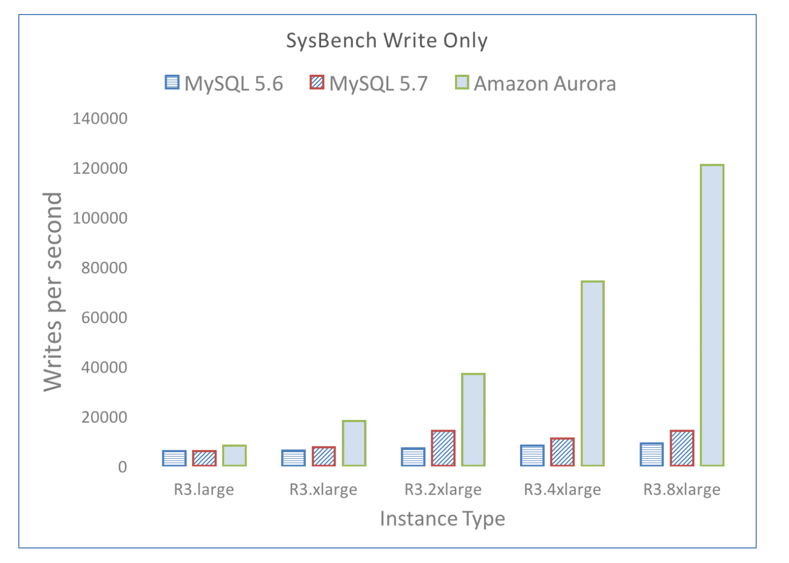

图 7：Aurora scales linearly for write-only workload

在本次实验中，我们观察到 **Aurora 的吞吐量能够随实例规格的提升而实现线性扩展**；在最高规格的实例上，其吞吐量可达 **MySQL 5.6 和 MySQL 5.7 的 5 倍**。需要说明的是，Aurora 目前是基于 MySQL 5.6 代码库构建的。我们针对 1GB 数据集（包含 250 张表）运行了 SysBench 只读和纯写基准测试。实验涵盖了 r3 系列的 5 种 EC2 实例规格（large、xlarge、2xlarge、4xlarge 和 8xlarge）。每种规格实例的 vCPU 数量和内存容量恰好是高一级规格实例的一半。

实验结果详见图 7 和图 6，分别展示了系统在每秒写入和读取语句量方面的性能表现。**Aurora 的性能随实例规格的提升而呈倍数增长**；在最高规格的 **r3.8xlarge** 实例上，Aurora 实现了 **121,000 次写入/秒**以及 **600,000 次读取/秒**的惊人吞吐量。相比之下，MySQL 5.7 的性能峰值仅为 **20,000 次写入/秒**和 **120,000 次读取/秒**。这意味着在相同的硬件条件下，Aurora 的吞吐量达到了 MySQL 5.7 的 **5 倍**

#### 4.1.2 Throughput with varying data sizes

在本次实验中，我们注意到即便在数据量更大、且包含**超出缓存（Out-of-cache）**工作集的负载场景下，Aurora 的吞吐量依然显著超过 MySQL。如表 2 所示，在 **SysBench 纯写（Write-only）** 负载下：

- 当数据库容量为 **100GB** 时，Aurora 的处理速度最高可达 MySQL 的 **67 倍**。
- 即使数据库容量增加到 **1TB** 且处于超出缓存的运行状态，Aurora 的速度依然维持在 MySQL 的 **34 倍**。

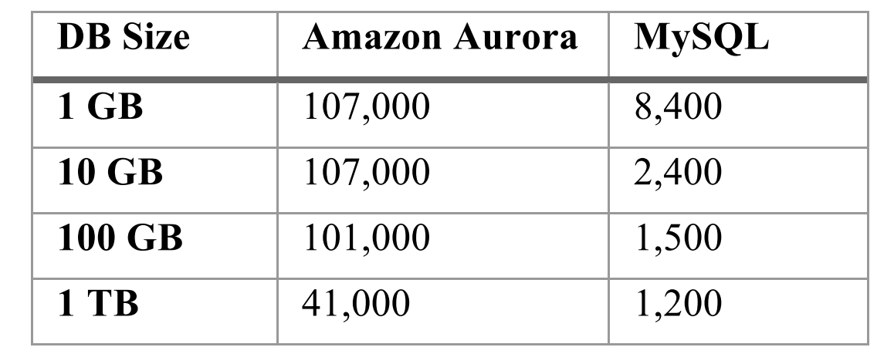

表 2：SysBench Write-Only (writes/sec)

#### 6.1.3 Scaling with user connections

在本次实验中，我们观察到 Aurora 的吞吐量能够随客户端连接数的增加而扩展。表 3 展示了在运行 SysBench OLTP 基准测试时，每秒写入量随连接数从 50 增长到 500，再到 5000 时的变化结果。当 Aurora 的吞吐量从 40,000 次写入/秒提升至 110,000 次写入/秒时，MySQL 的吞吐量却在 500 个连接左右达到峰值，并随后在连接数增至 5000 时出现**剧烈下滑**。

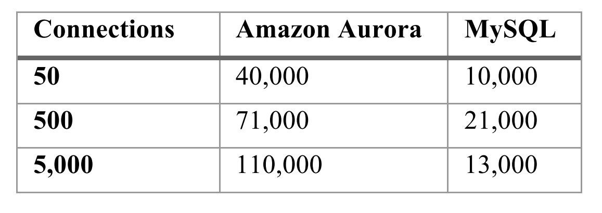

表 3：SysBench OLTP (writes/sec)

#### 6.1.4 Scaling with Replicas

在本次实验中，我们报告了 Aurora 只读副本的延迟显著低于 MySQL 副本，即便在更高强度的负载下也是如此。表 4 显示，当工作负载从每秒 1,000 次写入增加到 10,000 次时，Aurora 的副本延迟仅从 **2.62 毫秒**增长至 **5.38 毫秒**。相比之下，MySQL 的副本延迟从不足 1 秒飙升至 **300 秒**（5 分钟）。在每秒 10,000 次写入的压力下，Aurora 的副本延迟比 MySQL **低了数个数量级**。此处副本延迟的定义为：一个已提交事务在只读副本上变得可见所需的时间。

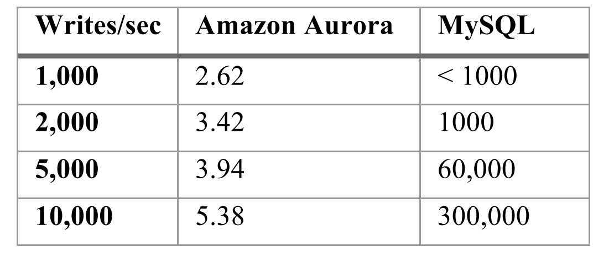

表 4：Replica Lag for SysBench Write-Only (msec)
	

#### 6.1.5 Throughtput with hot row contention

在本次实验中，我们报告了 Aurora 在存在**热点行竞争（Hot Row Contention）**的负载场景下（如基于 TPC-C 基准测试的任务），相对于 MySQL 表现异常出色。我们针对 Amazon Aurora 以及 MySQL 5.6/5.7 运行了 Percona TPC-C 变体测试。实验环境为 r3.8xlarge 实例，其中 MySQL 挂载了具备 30,000 预置 IOPS 的 EBS 存储卷。如表 5 所示，随着工作负载从“500 个连接及 10GB 数据量”增加到“5,000 个连接及 100GB 数据量”，Aurora 能够维持的吞吐量达到了 MySQL 5.7 的 **2.3 倍至 16.3 倍**。

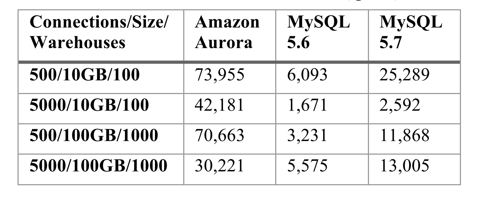

表 5：Percona TPC-C Variant (tpmC)

### 6.2 Results with Real Customer Workloads

在本节中，我们将分享部分客户在将其**生产环境工作负载（Production Workloads）**从 MySQL 迁移至 Aurora 后所反馈的实测结果。

#### 6.2.1 Application response time with Aurora

某互联网游戏公司将其生产环境下的业务从 MySQL 迁移至基于 r3.4xlarge 实例的 Aurora。在迁移之前，其 Web 事务经历的平均响应时间为 **15 毫秒**。相比之下，迁移后的平均响应时间缩短至 **5.5 毫秒**。如图 8 所示，响应速度实现了约 **3 倍**的提升。

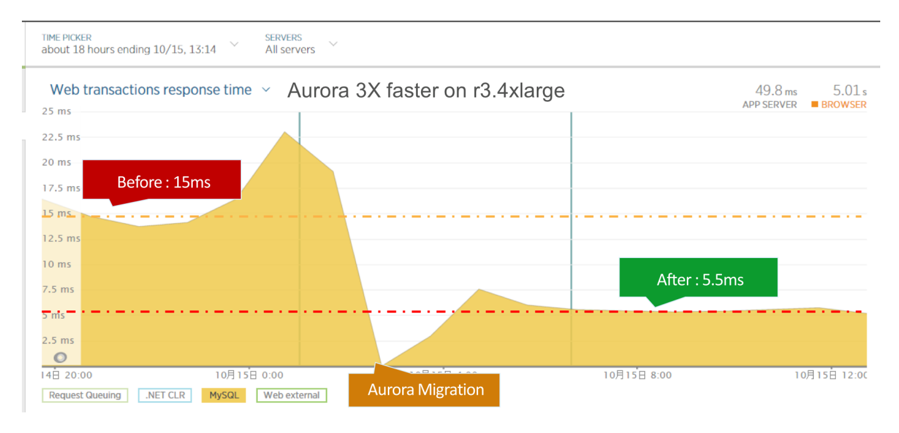

图 8 ：Web application response time

### 6.2.2 Statement Latencies with Aurora

某教育技术公司（其业务旨在帮助学校管理学生笔记本电脑）将其生产环境的工作负载从 MySQL 迁移到了 Aurora。图 9 和图 10 分别展示了在迁移前后（迁移操作发生于 14:00），针对查询（Select）操作和单条记录插入（Per-record Insert）操作的**中位数（P50）**延迟与 **95 分位（P99）** 延迟的对比情况。

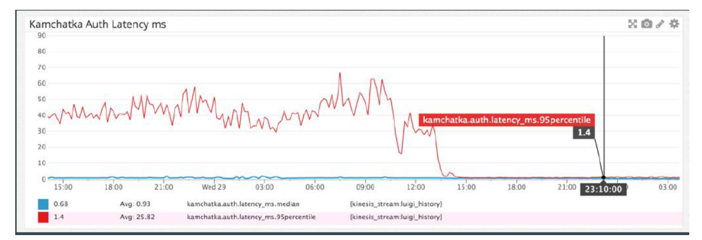

图 9：SELECT latency (P50 vs P95)

在迁移之前，该系统的 **P95 延迟**波动在 40 毫秒至 80 毫秒之间，远差于仅为 1 毫秒左右的 **P50 延迟**。此时，应用程序正经历着我们在本文前段所描述的那种糟糕的**离群值性能（Outlier Performance）**问题。然而，在迁移至 Aurora 之后，上述两种操作的 P95 延迟均得到了戏剧性的改善，并已**趋近于 P50 延迟**。

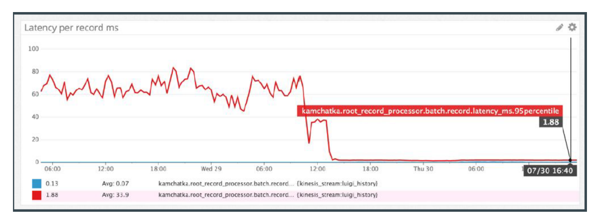

图 10：INSERT per-record latency (P50 vs P95)

#### 6.2.3 Replica Lag with Multiple Replicas

MySQL 副本通常显著落后于其主库，正如 Pinterest 的 Weiner 所指出的那样，这种延迟“可能导致各种诡异的 Bug”[40]。对于前文提到的那家教育技术公司，其副本延迟经常激增至 **12 分钟**，严重影响了应用程序的**正确性**，导致副本在当时仅能作为冷备（Stand-by）使用。相比之下，在迁移到 Aurora 后，如图 11 所示，跨 4 个副本的最大延迟**从未超过 20 毫秒**。Aurora 极佳的副本延迟表现让该公司能够将大部分应用负载分流到副本上，从而在节省成本的同时，显著提升了系统的可用性。

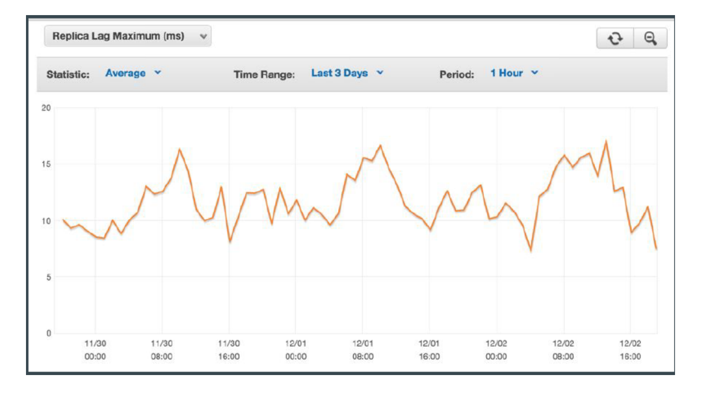

图 11：Maximum Replica Lag (averaged hourly)

## 7. LESSONS LEARNED

时至今日，我们已经见证了极其多样的客户应用运行在 Aurora 之上，这些客户既包括小型互联网初创公司，也包括运营着海量 Aurora 集群的大型精密机构。虽然其中许多用例属于标准数据库范畴，但我们更倾向于关注那些在云环境中具有代表性、且正引领我们迈向新方向的特定场景与期望。

### 7.1 Multi-tenancy and databases consolidation

我们的许多客户都在运营软件即服务（Software-as-a-Service，SaaS）业务，其中一些客户完全采用 SaaS 模式，另一些客户仍保留少量本地部署客户，并正尝试将其迁移到 SaaS 模型中。我们发现，这类客户通常依赖于一套难以轻易修改的应用。因此，他们往往以模式/数据库（schema/database）作为租户划分单元，将不同客户整合到同一个实例中。该做法能够降低成本：由于所有客户不太可能同时处于活跃状态，因而无需为每个客户分别支付专用实例的成本。例如，我们的一些 SaaS 客户表示，他们自身服务的客户数量已超过 50,000 个。

这种模型与 Salesforce.com [14] 等广为人知的多租户应用存在显著差异。后者通常采用多租户数据模型，将多个客户的数据存放在同一模式（schema）下的统一表中，并通过逐行标识的方式区分数据所属租户。

因此，我们看到许多客户的整合型数据库中包含大量数据表。即使是规模较小的数据库，其生产实例中包含超过 150,000 张表的情况也相当常见。这会给负责管理元数据的组件带来压力，例如数据字典缓存（dictionary cache）。更重要的是，这类客户通常需要具备以下能力：

1.  能够维持较高吞吐量，并支持大量并发用户连接； 
2.  采用按需配置、按实际使用付费的数据模型，因为预先准确估计所需存储空间十分困难； 
3.  降低性能抖动，使单个租户的负载峰值对其他租户的影响尽可能小。 

Aurora 支持上述特性，因此非常适合这类 SaaS 应用场景。

### 7.2 Highly concurrent auto-scaling workloads

互联网工作负载经常需要应对由突发、意外事件引发的流量峰值。我们的一位主要客户曾在一档全国范围内高度热门的电视节目中特别亮相，由此产生了一次流量突增，其规模远超该客户平时的峰值吞吐量，但并未对数据库造成明显压力。为了支撑这类流量峰值，数据库必须能够处理大量并发连接。Aurora 之所以能够采用这种方式，是因为其底层存储系统具备良好的扩展能力。我们有多位客户的系统运行负载已超过每秒 8,000 个连接。

### 7.3 Schema evolution

现代 Web 应用框架（如 Ruby on Rails）深度集成了对象关系映射（Object-Relational Mapping，ORM）工具。因此，应用开发者可以很容易地对数据库进行大量模式（schema）变更，这使得 DBA 难以管理模式的演化过程。在 Rails 应用中，这类变更被称为“DB Migrations”。我们从 DBA 的一手经验中了解到，他们要么每周需要处理“数十次迁移”，要么必须预先设计相应的兜底策略，以确保后续迁移能够平滑完成。与此同时，MySQL 提供了较为宽松的模式演化语义，并且在实现大多数变更时需要进行整表复制，这进一步加剧了问题。

由于频繁执行 DDL 已成为现实需求，我们实现了一种高效的在线 DDL 机制。该机制：

1.  以数据页为粒度对模式进行版本化管理，并根据每个数据页的模式历史按需解码该数据页； 
2.  借助写时修改（modify-on-write）原语，将单个数据页惰性升级到最新模式。

### 7.4 Availability and Software Upgrades

我们的客户对云原生数据库有着较高要求，而这些要求有时会与我们管理服务机群以及定期对服务器进行补丁更新的方式发生冲突。由于客户主要将 Aurora 作为支撑生产应用的 OLTP 服务使用，任何中断都可能造成严重影响。

因此，许多客户对数据库软件更新的容忍度极低；即使只是大约每 6 周一次、持续 30 秒的计划停机，也难以接受。为此，我们近期发布了一项新的零停机补丁（Zero-Downtime Patch，ZDP）功能，使我们能够在不影响现有数据库连接的情况下为客户实例应用补丁。

如图 12 所示，ZDP 的工作方式是：首先寻找一个不存在活动事务的瞬间；在该瞬间，将应用状态暂存到本地临时存储中；随后对数据库引擎应用补丁，并重新加载应用状态。在整个过程中，用户会话始终保持活动状态，并且用户不会感知到底层引擎已经完成了变更。

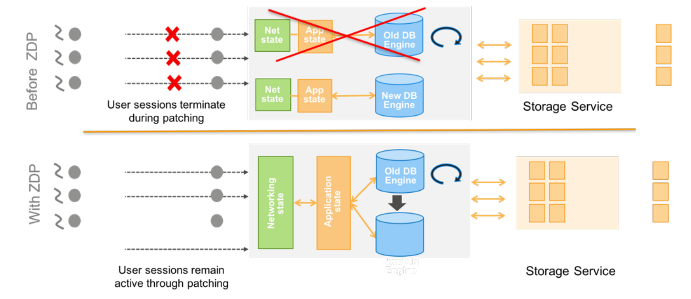

图 12：Zero-Downtime Patching

## 8. RELATED WORK

本节讨论其他相关研究贡献，并分析它们与 Aurora 所采用方法之间的关系。

**存储与计算解耦。** 尽管传统系统通常被构建为单体式守护进程，但近年来已有一些数据库研究尝试将数据库内核拆分为不同组件。例如，Deuteronomy 就是这样一种系统：它将负责并发控制与恢复的事务组件（Transaction Component，TC），同负责访问方法的数据组件（Data Component，DC）分离开来；其中，DC 构建在 LLAMA 之上，后者是一种无闩锁（latch-free）的日志结构化缓存与存储管理器。Sinfonia 和 Hyder 则将事务性访问方法抽象为一种可横向扩展的服务，数据库系统可以基于这些抽象来实现。Yesquel 系统实现了一种多版本分布式平衡树，并将并发控制与查询处理器相分离。与 Deuteronomy、Hyder、Sinfonia 和 Yesquel 相比，Aurora 在更低的系统层次上实现了存储解耦。在 Aurora 中，查询处理、事务管理、并发控制、缓冲区缓存以及访问方法，与日志、存储和恢复机制相互解耦；后者被实现为一种可横向扩展的服务。

Google 的 Spanner [24] 提供具有外部一致性（external consistency）[25] 的读写操作，并支持基于某一时间戳在整个数据库范围内执行全局一致读。借助这些特性，Spanner 能够在全球规模下支持一致性备份、一致的分布式查询处理 [26] 以及原子化的模式更新；即使系统中存在正在执行的事务，这些能力仍然可以得到保证。

**分布式系统。** 在发生网络分区时，正确性与可用性之间存在权衡，这一点早已为人所知。其中一个重要结论是：在网络分区存在的情况下，系统无法实现单副本可串行化（one-copy serializability）。近来，由 Brewer 提出的 CAP 定理在文献中得到了证明；该定理指出，在存在网络分区时，高可用系统无法同时提供“强”一致性保证。这些理论结果，以及我们在云规模环境中处理复杂且相关联故障的实践经验，共同促使我们设定 Aurora 的一致性目标：即使出现由可用区（Availability Zone，AZ）故障引发的网络分区，系统仍应尽可能维持预期的一致性语义。

Bailis 等人研究了如何提供高可用事务（Highly Available Transactions，HATs）：这类事务既不应在网络分区期间变得不可用，也不应引入较高的网络延迟。他们表明，可串行化（Serializability）、快照隔离（Snapshot Isolation）以及可重复读隔离（Repeatable Read isolation）并不符合 HAT 要求；而其他大多数隔离级别则可以在高可用条件下实现。Aurora 通过引入一个简化假设来支持上述所有隔离级别：在任意时刻，系统中只有一个写入者负责生成日志更新，并且这些更新所使用的日志序列号（Log Sequence Number，LSN）来自同一个有序域。

Google 的 Spanner 提供具有外部一致性（external consistency）的读写操作，并支持基于某一时间戳在整个数据库范围内执行全局一致读。借助这些特性，Spanner 能够在全球规模下支持一致性备份、一致的分布式查询处理以及原子化的模式更新；即使系统中存在正在执行的事务，这些能力仍然可以得到保证。正如 Bailis 所指出的，Spanner 是针对 Google 读密集型工作负载高度定制化设计的系统，并且在读写事务中依赖二阶段提交和二阶段锁机制。

**并发控制。** 在分布式数据库中，较弱的一致性模型（如 PACELC）以及隔离模型已为人熟知，并催生了乐观复制技术以及最终一致性系统。在集中式系统中，相关方法则更加多样：既包括基于锁机制的经典悲观方案，也包括乐观方案，例如 Hekaton 中的多版本并发控制；此外还包括 VoltDB 这类分片式方法，以及 HyPer 和 Deuteronomy 中采用的时间戳排序机制。Aurora 的存储服务向数据库引擎提供了一种“持久化本地磁盘”的抽象，使数据库引擎能够自行决定隔离语义和并发控制策略。

**日志结构化存储。** 日志结构化存储系统最早由 1992 年的 LFS 引入。近年来，Deuteronomy 以及与其相关的 LLAMA 和 Bw-Tree 等工作，在存储引擎栈的多个层面采用了日志结构化技术；它们与 Aurora 类似，都是通过写入差量（delta）而非整个数据页来降低写放大。Deuteronomy 和 Aurora 都实现了纯重做日志（pure redo logging），并维护最高稳定日志序列号（highest stable LSN），以此作为确认事务提交的依据。

**恢复。** 传统数据库通常依赖基于 ARIES 的恢复协议，而近年来的一些系统出于性能考虑选择了其他路径。例如，Hekaton 和 VoltDB 在系统崩溃后，会借助某种形式的更新日志来重建其内存状态。Sinfonia 等系统则通过进程对（process pairs）和状态机复制（state machine replication）等技术来规避恢复过程。Graefe 描述了一种系统，该系统为每个数据页维护日志记录链，从而支持按需、逐页执行重做操作，使恢复过程更加快速。与 Aurora 类似，Deuteronomy 也不需要执行重做恢复。这是因为 Deuteronomy 会延迟事务处理，确保只有已提交的更新才会写入持久化存储。因此，与 Aurora 不同，Deuteronomy 中的事务规模可能会受到限制。

## 9. CONCLUSION

我们将 Aurora 设计为一种高吞吐量 OLTP 数据库，使其在云规模环境中既不牺牲可用性，也不牺牲持久性。其核心思想是摆脱传统数据库的单体式架构，并将存储与计算解耦。

具体而言，我们将数据库内核中较底层的约四分之一功能迁移到一个独立、可扩展的分布式服务中，由该服务负责日志记录和存储管理。当所有 I/O 都需要通过网络完成时，网络就成为系统的根本约束。因此，我们必须重点采用能够减轻网络压力并提升吞吐量的技术。

为此，我们依赖以下机制：

1.  **Quorum 模型**：用于应对大规模云环境中复杂且相关联的故障，并避免异常节点带来的性能惩罚； 
2.  **日志处理机制**：用于降低整体 I/O 负载； 
3.  **异步共识机制**：用于消除通信频繁且代价高昂的多阶段同步协议，同时避免分布式存储中的离线崩溃恢复和检查点操作。 

这种方法形成了一种更加简化、复杂度更低且易于扩展的架构，并为未来进一步演进奠定了基础。