# Large-scale cluster management at Google with Borg

## Abstract

Google 的 Borg 系统是一种集群管理器，能够在多个集群中运行来自数千种不同应用的数十万级作业。这些集群中的每一个都可包含多达数万台机器。

Borg 通过综合采用准入控制、高效任务封装、资源超额承诺，以及在进程级性能隔离机制支撑下的机器共享，实现了较高的资源利用率。对于高可用应用，Borg 提供了能够最小化故障恢复时间的运行时机制，并通过调度策略降低关联故障发生的概率。此外，Borg 还通过提供声明式作业描述语言、名称服务集成、实时作业监控，以及用于分析和模拟系统行为的工具，降低了用户的使用难度。

本文概述了 Borg 系统的架构与功能特性，讨论了其关键设计决策，对部分策略决策进行了定量分析，并基于十余年的实际运行经验，对其中积累的经验教训进行了定性考察。

## 1. Introduction

我们在内部称为 Borg 的集群管理系统，负责接纳、调度、启动、重启并监控 Google 所运行的各类应用。本文将解释 Borg 如何实现这些功能。

Borg 主要提供三方面收益：

1.  它屏蔽了资源管理和故障处理的细节，使用户能够将精力集中在应用开发上； 
2.  它自身具备很高的可靠性和可用性，同时也支持具有同样需求的应用； 
3.  它使我们能够在数万台机器上高效运行各类工作负载。 

Borg 并不是第一个尝试解决这些问题的系统，但在如此规模下运行，并同时具备这种程度的韧性与功能完备性的系统并不多见。本文将围绕上述主题展开，并在最后总结我们基于 Borg 十余年生产环境运行经验所得的一组定性观察。

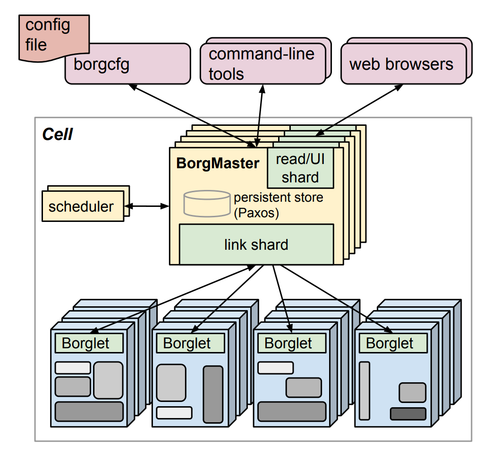

<center>图 1：The high-level architecture of Borg. *Only a tiny fraction of the thousands of worker nodes are shown.*</center>

## 2. The user perspective

Borg 的用户主要是负责运行 Google 应用和服务的 Google 开发者与系统管理员，即站点可靠性工程师（Site Reliability Engineers，SREs）。用户以**作业**（job）的形式将工作提交给 Borg；每个作业由一个或多个**任务**（task）组成，这些任务均运行同一个程序（二进制文件）。每个作业都运行在一个 Borg **单元**（cell）中；一个 cell 是一组作为整体统一管理的机器。本节后续内容将从用户视角介绍 Borg 所呈现的主要功能特性。

### 2.1 The workload

Borg 单元承载的是一种异构工作负载，主要由两类负载构成。

第一类是长期运行的服务。这类服务按要求应“永不”宕机，主要用于处理生命周期很短且对延迟敏感的请求，其处理时间通常从数微秒到数百毫秒不等。这些服务既支撑 Gmail、Google Docs 和网页搜索等面向终端用户的产品，也用于 BigTable 等内部基础设施服务。

第二类是批处理作业，其完成时间可能从数秒到数天不等。与前一类服务相比，批处理作业对短期性能波动的敏感性要低得多。

不同 Borg 单元中的工作负载组合并不相同：各个 cell 会根据其主要租户运行不同类型的应用组合，例如某些 cell 的批处理负载占比较高。此外，工作负载组合还会随时间变化：批处理作业会不断提交与结束，而许多面向终端用户的服务作业则呈现出明显的日周期使用模式。Borg 必须能够同等有效地处理上述所有情形。

一个具有代表性的 Borg 工作负载，可以在 2011 年 5 月公开发布的、持续一个月的运行轨迹数据集中找到；该数据集已经被大量研究工作进行了深入分析。

过去几年中，许多应用框架都构建在 Borg 之上，包括 Google 内部的 MapReduce 系统、FlumeJava、Millwheel 和 Pregel。这些框架大多包含一个控制器，由该控制器提交一个主作业以及一个或多个工作作业；其中，控制器和主作业承担的职责类似于 YARN 的应用管理器。此外，Google 的分布式存储系统也运行在 Borg 之上，包括 GFS 及其后继系统 CFS、Bigtable 和 Megastore。

在本文中，我们将优先级较高的 Borg 作业归类为**生产类**（production，简称 prod）作业，其余作业则归类为**非生产类**（non-production，简称 non-prod）作业。大多数长期运行的服务端作业属于 prod，而大多数批处理作业属于 non-prod。

在一个具有代表性的 cell 中，prod 作业被分配了约 70% 的总 CPU 资源，但其实际 CPU 使用量约占总 CPU 使用量的 60%；同时，prod 作业被分配了约 55% 的总内存资源，但其实际内存使用量约占总内存使用量的 85%。资源分配量与实际使用量之间的这种差异，将在第 5.5 节中体现出重要意义。

### 2.2 Clusters and cells

一个 cell 中的机器都属于同一个**集群**（cluster）；这里的集群由连接这些机器的数据中心级高性能网络结构来界定。一个集群位于单个数据中心建筑内部，而多个数据中心建筑共同构成一个**站点**（site）。¹ 通常，一个集群会承载一个大型 cell，同时也可能包含若干规模较小的测试 cell 或专用 cell。我们会严格避免系统中出现任何单点故障。

在排除测试 cell 后，我们的 cell 规模中位数约为 1 万台机器，其中部分 cell 的规模要大得多。一个 cell 内部的机器在多个维度上都具有异构性，包括资源规格（CPU、内存、磁盘和网络）、处理器类型、性能水平，以及是否具备外部 IP 地址或闪存存储等能力。Borg 通过决定任务应在 cell 中的哪些位置运行、为任务分配资源、安装其程序及其他依赖、监控其健康状态，并在任务失败时进行重启，从而向用户屏蔽了这些差异中的大部分。

### 2.3 Jobs and tasks

一个 Borg 作业的属性包括其名称、所有者以及所包含的任务数量。作业可以设置**约束**（constraints），以强制其任务运行在具备特定**属性**（attributes）的机器上，例如特定的处理器架构、操作系统版本，或外部 IP 地址。约束可以分为**硬约束**和**软约束**；其中，软约束更类似于偏好条件，而不是必须满足的要求。作业的启动也可以被延迟，直到某个前置作业完成之后再开始。一个作业只会运行在一个 cell 中。

每个任务对应于一组运行在某台机器容器中的 Linux 进程。绝大多数 Borg 工作负载并不运行在虚拟机（Virtual Machines，VMs）内部，因为我们不希望承担虚拟化带来的开销。此外，Borg 系统设计之初，Google 已经在大量处理器上进行了相当规模的投入，而这些处理器在硬件层面并不支持虚拟化。

任务同样具有自身属性，例如资源需求以及该任务在所属作业中的索引。一个作业内，大多数任务属性在所有任务之间保持一致，但也可以针对特定任务进行覆盖，例如为某个任务指定专属的命令行标志。每个资源维度都可以以细粒度独立指定，包括 CPU 核数、内存、磁盘空间、磁盘访问速率、TCP 端口² 等；Borg 不强制使用固定大小的资源桶或槽位（见第 5.4 节）。为减少对运行时环境的依赖，Borg 程序采用**静态链接**，并被组织为由二进制文件和数据文件构成的**包**（packages）；这些包的安装过程由 Borg 统一编排。

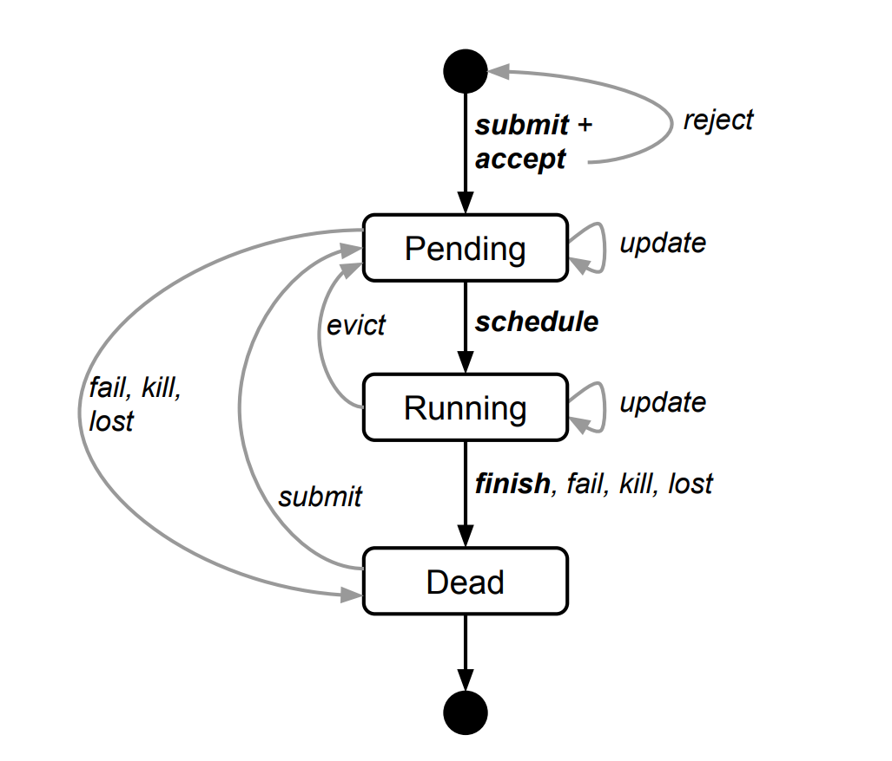

<center>图 2：The state diagram for both jobs and tasks. *Users can trigger submit, kill, and update transitions.*</center>

用户通过向 Borg 发起远程过程调用（Remote Procedure Calls，RPCs）来对作业进行操作。这些调用最常见的来源包括命令行工具、其他 Borg 作业，以及 Google 的监控系统（见第 2.6 节）。大多数作业描述都使用声明式配置语言 BCL 编写。BCL 是 GCL 的一个变体，用于生成 protobuf 文件，并在此基础上扩展了一些 Borg 专用关键字。GCL 提供 lambda 函数以支持计算，应用程序可借此根据其运行环境动态调整配置。数以万计的 BCL 文件长度超过 1000 行，而我们已经积累了数千万行 BCL 代码。Borg 作业配置与 Aurora 配置文件具有一定相似性。

图 2 展示了作业和任务在其生命周期中会经历的各类状态。

用户可以通过向 Borg 推送新的作业配置，改变运行中作业内部分或全部任务的属性，并随后指示 Borg 按照新的规格更新这些任务。该过程相当于一个轻量级的非原子事务；在其关闭（即提交）之前，可以较容易地撤销。更新通常以滚动方式进行，并且可以限制一次更新所引发的任务扰动数量，包括重新调度或抢占。如果某些变更会导致扰动数量超过该限制，则这些变更会被跳过。

某些任务更新总是需要重启任务，例如推送新的二进制文件；某些更新可能会使任务不再适合在当前机器上运行，例如提高资源需求或修改约束条件，从而导致任务被停止并重新调度；还有一些更新，例如修改优先级，则始终可以在不重启任务、也不迁移任务的情况下完成。

任务可以请求在被 `SIGKILL` 强制终止之前，先通过 Unix 的 `SIGTERM` 信号获得通知，以便有时间执行清理操作、保存状态、完成当前正在处理的请求，并拒绝新的请求。如果抢占方设置了延迟上限，实际的提前通知时间可能会更短。在实践中，约 80% 的情况下该通知能够成功送达。

### 2.4 Allocs

Borg 中的 **alloc**（allocation 的缩写，可理解为资源分配单元）指的是在某台机器上预留的一组资源，一个或多个任务可以在其中运行。无论这些资源是否被实际使用，它们都会保持分配状态。alloc 可用于为未来任务预留资源，也可用于在停止某个任务并再次启动它之间保留资源，还可用于将来自不同作业的任务聚集到同一台机器上运行。例如，一个 Web 服务器实例可以与其关联的 logsaver 任务放在同一台机器上，后者负责将该服务器的 URL 日志从本地磁盘复制到分布式文件系统中。alloc 中的资源处理方式类似于机器资源；运行在同一个 alloc 内的多个任务会共享其资源。如果某个 alloc 必须迁移到另一台机器，那么其中的任务也会随之被重新调度。

**alloc set** 类似于一个作业：它由一组 alloc 构成，用于在多台机器上预留资源。一旦创建了 alloc set，就可以提交一个或多个作业在其中运行。为简洁起见，本文后续通常使用“task”同时指代 alloc 内的任务或顶层任务（即不在 alloc 内部的任务），并使用“job”同时指代作业或 alloc set。

### 2.5 Priority, quota, and admission control

当出现的工作量超过系统可容纳范围时，会发生什么？Borg 采用的解决机制是**优先级**和**配额**。

每个作业都有一个**优先级**（priority），其值为一个较小的正整数。高优先级任务可以以低优先级任务让出资源为代价来获得资源，即使这意味着需要抢占（杀死）后者。Borg 为不同用途定义了互不重叠的**优先级区间**（priority bands），按优先级从高到低依次包括：监控类、生产类、批处理类，以及尽力而为类（也称为测试类或免费类）。在本文中，**prod 作业**指位于监控类和生产类优先级区间中的作业。

尽管被抢占的任务通常会在 cell 中的其他位置重新调度，但如果一个高优先级任务驱逐了一个优先级略低的任务，而后者又继续驱逐另一个优先级再略低的任务，就可能引发**级联抢占**。为尽量消除这类情况，Borg 不允许生产优先级区间内的任务相互抢占。不过，在其他场景下，细粒度优先级仍然很有价值。例如，为提高可靠性，MapReduce 的 master 任务会以略高于其所控制 worker 任务的优先级运行。

优先级用于表示在某个 cell 中正在运行或等待运行的作业之间的相对重要性。**配额**（quota）则用于决定哪些作业可以被接纳进入调度流程。配额表示为在给定优先级下、特定时间段内（通常以月为单位）的一组资源数量向量，包括 CPU、内存、磁盘等。这些数量规定了用户作业请求在同一时间可申请的最大资源量。例如：“从现在起到 7 月底，用户在 xx cell 中可以以 prod 优先级申请最多 20 TiB 内存”。

配额检查属于**准入控制**的一部分，而不是调度过程本身；如果作业提交时配额不足，该作业会被立即拒绝。

高优先级配额的成本高于低优先级配额。生产优先级配额受限于 cell 中实际可用的资源总量，因此，只要用户提交的生产优先级作业处于其配额范围内，除资源碎片化和约束条件可能造成的影响外，用户通常可以预期该作业能够运行。

尽管我们鼓励用户只购买满足其实际需求的配额，许多用户仍会超额购买，因为这可以在其应用用户规模增长时，为未来可能出现的资源短缺提供缓冲。对此，Borg 的做法是在较低优先级层级上**超售配额**：每个用户在优先级 0 上都拥有无限配额，尽管由于资源通常已被超额订购，这类配额往往难以真正使用。低优先级作业可能会通过准入检查，但由于资源不足而一直处于等待状态，即尚未被调度。

配额分配在 Borg 系统之外完成，并与我们的物理容量规划紧密相关。容量规划的结果会体现在不同数据中心中配额的价格和可获得性上。只有当用户作业在所需优先级下拥有足够配额时，才会被系统接纳。配额机制的使用降低了对主导资源公平性（Dominant Resource Fairness，DRF）等策略的依赖。

Borg 还包含一个**能力机制**（capability system），用于向部分用户授予特殊权限。例如，该机制可以允许管理员删除或修改 cell 中的任意作业，也可以允许某些用户访问受限的内核功能，或使用特定的 Borg 行为，例如为其作业禁用资源估算（见第 5.5 节）。

### 2.6 Naming and monitoring

仅仅创建任务并确定其放置位置还不够：服务的客户端以及其他系统还必须能够找到这些任务，即使它们已经被重新迁移到新的机器上。为此，Borg 会为每个任务创建一个稳定的 **Borg 命名服务**（Borg Name Service，BNS）名称，其中包含 cell 名称、作业名称和任务编号。

Borg 会以该名称在 Chubby 中维护一个一致且高可用的文件，并将任务的主机名和端口写入其中；Google 的 RPC 系统会利用该文件查找任务端点。BNS 名称也是任务 DNS 名称的基础。例如，在 cell `cc` 中，由用户 `ubar` 拥有的作业 `jfoo` 的第 50 个任务，可以通过如下地址访问：

```
50.jfoo.ubar.cc.borg.google.com
```

此外，每当作业规模或任务健康状态发生变化时，Borg 也会将相关信息写入 Chubby，使负载均衡器能够确定应将请求路由到何处。

几乎每个在 Borg 下运行的任务都包含一个内置 HTTP 服务器，用于发布该任务的健康状态信息以及数千项性能指标，例如 RPC 延迟。Borg 会监控健康检查 URL；对于未能及时响应或返回 HTTP 错误码的任务，Borg 会将其重启。其他数据则由监控工具进行跟踪，用于生成仪表盘，并在服务级别目标（Service Level Objective，SLO）发生违约时触发告警。

一个名为 Sigma 的服务提供了基于 Web 的用户界面（User Interface，UI）。用户可以通过该界面查看其所有作业的状态、某个特定 cell 的状态，也可以下钻到单个作业和任务，进一步检查其资源行为、详细日志、执行历史以及最终状态。我们的应用会产生大量日志；这些日志会自动轮转，以避免耗尽磁盘空间，并会在任务退出后保留一段时间，以辅助调试。

如果某个作业未能运行，Borg 会提供一条“why pending?”注释，说明其处于等待状态的原因，并给出如何修改该作业资源请求以更好适配当前 cell 的建议。我们还会发布关于“符合规范”的资源形状的指导原则，这类资源请求形态通常更容易被调度。

Borg 会将所有作业提交记录、任务事件，以及每个任务的详细资源使用信息记录到 Infrastore 中。Infrastore 是一个可扩展的只读数据存储系统，并通过 Dremel 提供交互式、类 SQL 的查询接口。这些数据可用于基于使用量的计费、作业与系统故障调试，以及长期容量规划。同时，它们也为 Google 集群工作负载轨迹数据集提供了数据来源。

上述所有功能都有助于用户理解并调试 Borg 及其作业的行为，同时也帮助我们的 SRE 实现每人管理数万台机器的运维规模。

## 3. Borg architecture

一个 Borg cell 由一组机器、一个名为 **Borgmaster** 的逻辑集中式控制器，以及运行在该 cell 中每台机器上的代理进程 **Borglet** 构成（见图 1）。Borg 的所有组件均使用 C++ 编写。

### 3.1 Borgmaster

每个 cell 的 **Borgmaster** 由两个进程组成：主 Borgmaster 进程和一个独立的调度器（见第 3.2 节）。主 Borgmaster 进程负责处理客户端 RPC 请求，这些请求要么会修改系统状态，例如创建作业；要么提供对数据的只读访问，例如查询作业。它还负责管理系统中所有对象的状态机，包括机器、任务、alloc 等；同时与各个 Borglet 通信，并提供一个 Web UI，作为 Sigma 的备用界面。

从逻辑上看，Borgmaster 是一个单一进程，但实际上会复制为 5 个副本。每个副本都会在内存中维护 cell 大部分状态的一份拷贝，同时这些状态也会记录在副本本地磁盘上的一个高可用、分布式、基于 Paxos 的存储系统中 [55]。每个 cell 中会选举出一个 master，它同时充当 Paxos leader 和状态变更执行者，负责处理所有会改变 cell 状态的操作，例如提交作业，或终止某台机器上的任务。当 cell 启动时，以及当前选举出的 master 发生故障时，系统都会使用 Paxos 重新选举 master；该 master 会获取一个 Chubby 锁，以便其他系统能够找到它。master 选举及向新 master 的故障转移通常需要约 10 秒；但在大型 cell 中，由于部分内存状态必须重建，这一过程最长可能需要 1 分钟。当某个副本从故障中恢复后，它会从其他状态最新的 Paxos 副本中动态地重新同步自身状态。

某一时刻的 **Borgmaster** 状态称为一个**检查点**（checkpoint）。检查点以周期性快照加变更日志的形式保存在 Paxos 存储系统中。检查点具有多种用途，包括：将 Borgmaster 的状态恢复到过去的任意时间点，例如恢复到某个触发 Borg 软件缺陷的请求被接受之前，以便进行调试；在极端情况下对状态进行手工修复；构建持久化事件日志，以支持后续查询；以及开展离线仿真。

一个名为 **Fauxmaster** 的高可靠 Borgmaster 模拟器可以读取检查点文件。它包含生产环境 Borgmaster 代码的一份完整副本，只是将与 Borglet 交互的接口替换为桩实现。Fauxmaster 可以接收 RPC 请求，以触发状态机变更并执行相关操作，例如“调度所有等待中的任务”。我们通过像操作在线 Borgmaster 一样与 Fauxmaster 交互来调试故障；与此同时，模拟的 Borglet 会重放检查点文件中记录的真实交互。用户可以逐步执行并观察过去实际发生过的系统状态变化Fauxmaster 还可用于容量规划，例如回答“这种类型的新作业还能容纳多少个？”这类问题；同时，它也可用于在修改 cell 配置之前进行合理性检查，例如判断“这一变更是否会驱逐某些重要作业？”。

### 3.2 Scheduling

当一个作业被提交后，**Borgmaster** 会将其持久化记录到 Paxos 存储系统中，并把该作业的各个任务加入**等待队列**（pending queue）。随后，**调度器**（scheduler）会异步扫描该队列；如果存在满足作业约束且具有足够可用资源的机器，调度器就会将任务分配到这些机器上。（调度器主要以任务为操作对象，而不是以作业为操作对象。）扫描过程按照优先级从高到低进行；在同一优先级内部，则通过轮询机制进行调节，以保证不同用户之间的公平性，并避免某个大型作业造成队头阻塞。调度算法由两个部分组成：一是**可行性检查**（feasibility checking），用于找出任务可以运行的机器；二是**评分**（scoring），用于从这些可行机器中选择一台具体机器。

在**可行性检查**阶段，调度器会找出一组既满足任务约束、又具有足够“可用”资源的机器。这里的“可用”资源也包括那些已经分配给低优先级任务、但可通过驱逐这些任务而释放出来的资源。

在**评分**阶段，调度器会评估每台可行机器的“适合程度”。评分会考虑用户指定的偏好，但主要由一组内置准则决定，例如：尽量减少被抢占任务的数量，并尽量避免抢占较高优先级的任务；优先选择已经拥有该任务 package 副本的机器；将任务分散到不同的电源域和故障域中；以及提高装箱质量，包括将高优先级任务和低优先级任务混合放置在同一台机器上，使高优先级任务在负载突增时能够获得扩展空间。

Borg 最初使用 E-PVM 的一个变体进行评分。该方法会在异构资源之间生成一个统一的成本值，并在放置任务时最小化成本变化。实践中，E-PVM 往往会把负载分散到所有机器上，从而为负载突增保留余量；但代价是资源碎片化程度增加，尤其不利于那些需要占用机器大部分资源的大型任务。我们有时将这种策略称为 **“最差适配”**（worst fit）。与之相对的另一端是 **“最佳适配”**（best fit），其目标是尽可能紧密地填满机器。这会使部分机器不承载用户作业（尽管它们仍会运行存储服务器），因此放置大型任务会更加直接。然而，紧密装箱会放大用户或 Borg 对资源需求估计不准所带来的影响。这会损害具有突发负载特征的应用，对于批处理作业尤其不利：这类作业通常会声明较低的 CPU 需求，以便更容易被调度，并尝试机会性地利用空闲资源运行；在 non-prod 任务中，有 20% 请求的 CPU 核数少于 0.1 个。

我们当前采用的是一种**混合式评分模型**，其目标是减少**搁置资源**（stranded resources）的数量。所谓搁置资源，是指由于机器上的另一类资源已经被完全分配，导致某些资源虽然仍有剩余却无法被继续利用。对于我们的工作负载而言，该模型相比最佳适配策略（best fit）可带来约 3%–5% 的装箱效率提升。

如果评分阶段选中的机器没有足够的可用资源来容纳新任务，Borg 就会按照从低优先级到高优先级的顺序，抢占（杀死）较低优先级的任务，直到释放出足够资源为止。被抢占的任务会被重新加入调度器的等待队列，而不是被迁移或休眠。

### 3.3 Borglet

**Borglet** 是运行在 cell 中每台机器上的本地 Borg 代理。它负责启动和停止任务，在任务失败时将其重启；通过调整操作系统内核设置来管理本地资源；对调试日志进行轮转；并将机器状态上报给 Borgmaster 以及其他监控系统。

Borgmaster 每隔数秒轮询一次各个 Borglet，以获取机器的当前状态，并向其发送所有待处理请求。通过这种方式，Borgmaster 能够控制通信速率，避免引入显式的流量控制机制，并防止出现恢复风暴（recovery storms）。

被选举出的 master 负责准备发送给 Borglet 的消息，并根据 Borglet 的响应更新 cell 的状态。为提高性能可扩展性，每个 Borgmaster 副本都会运行一个无状态的 **link shard**（链路分片），用于处理与部分 Borglet 的通信；每当发生 Borgmaster 选举时，这种分片划分都会重新计算。为增强系统韧性，Borglet 始终会上报自身的完整状态；但 link shard 会对这些信息进行聚合与压缩，只向状态机报告状态差异，从而降低被选举出的 master 上的更新负载。

如果某个 **Borglet** 连续多次未响应轮询消息，则其所在机器会被标记为宕机，该机器上正在运行的所有任务都会被重新调度到其他机器上。如果随后通信恢复，**Borgmaster** 会指示该 Borglet 终止那些已经被重新调度的任务，以避免出现重复实例。即使 Borglet 与 Borgmaster 失去联系，它仍会继续正常运行，因此，即便所有 Borgmaster 副本都发生故障，当前正在运行的任务和服务也能保持可用。

### 3.4 Scalability

我们尚不确定 Borg 集中式架构的最终可扩展性瓶颈会来自何处；到目前为止，每当系统接近某个限制时，我们都设法将其消除了。单个 **Borgmaster** 可以管理一个 cell 中数千台乃至更多机器，并且已有多个 cell 的任务到达率超过每分钟 10,000 个任务。一个繁忙的 Borgmaster 通常会使用 10–14 个 CPU 核心，以及最高 50 GiB 的内存。为达到这一规模，我们采用了多种技术。

早期版本的 **Borgmaster** 使用一个简单的同步循环来接收请求、调度任务，并与各个 **Borglet** 通信。为支持更大规模的 cell，我们将调度器拆分为一个独立进程，使其能够与 Borgmaster 中其他为容错而复制的功能并行运行。

调度器副本基于一份缓存的 cell 状态副本工作，并不断重复以下过程：

1.  从被选举出的 master 获取状态变更，包括已分配的工作和等待中的工作； 
2.  更新其本地状态副本； 
3.  执行一次调度遍历，为任务分配机器； 
4.  将这些分配结果通知被选举出的 master。 

master 会接受并应用这些分配结果，除非它们不再适用，例如这些结果是基于过期状态生成的。在这种情况下，相关任务会在调度器的下一轮遍历中被重新考虑。这一机制在思想上与 Omega 中使用的**乐观并发控制**非常相似。事实上，我们最近还为 Borg 增加了针对不同工作负载类型使用不同调度器的能力。

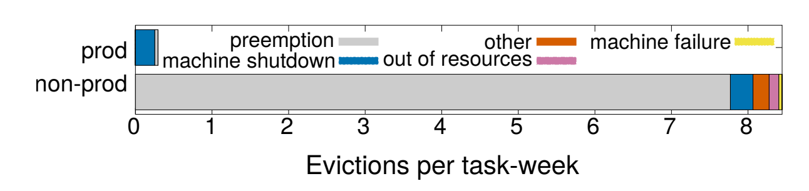

<center>图 3：Task-eviction rates and causes for production and non-production workloads. Data from August 1st 2013</center>

为缩短响应时间，我们增加了独立线程，用于与各个 **Borglet** 通信并响应只读 RPC。为进一步提升性能，我们将这些功能在 5 个 **Borgmaster** 副本之间进行了分片（partitioned）（见第 3.3 节）。这些机制共同保证了 UI 响应时间的第 99 百分位低于 1 秒，同时使 Borglet 轮询间隔的第 95 百分位低于 10 秒。

有几项机制提升了 Borg 调度器的可扩展性：

+ **评分缓存**：对一台机器进行可行性检查并计算其评分的开销较高，因此 Borg 会缓存评分结果，直到机器或任务的属性发生变化，例如该机器上的某个任务终止、某个属性被修改，或某个任务的资源需求发生变化。通过忽略资源数量上的微小变化，可以减少缓存失效的次数。
+ **等价类**：Borg 作业中的任务通常具有相同的资源需求和约束条件。因此，Borg 不会对每个等待中的任务逐一在每台机器上进行可行性检查，也不会对所有可行机器逐一评分；相反，它只会针对每个**等价类**中的一个任务执行可行性检查和评分。这里的等价类指一组具有相同需求的任务。
+ **宽松的随机化**：在大型 cell 中，为所有机器计算可行性和评分会造成资源浪费。因此，调度器会按随机顺序检查机器，直到找到“足够多”的可行机器用于评分，然后从该集合中选择最优机器。这种方法减少了任务进入和离开系统时所需的评分计算量与缓存失效次数，并加快了任务到机器的分配过程。宽松随机化在一定程度上类似于 Sparrow 的批量采样机制，但同时还需要处理优先级、抢占、异构性以及 package 安装成本等问题。

在我们的实验中（见第 5 节），从零开始对一个 cell 的全部工作负载进行调度通常需要数百秒；但如果禁用上述技术，即使运行超过 3 天也无法完成。尽管如此，在正常情况下，对等待队列执行一次在线调度遍历通常可在半秒以内完成。

## 4. Availability

在大规模系统中，故障是一种常态。图 3 对 15 个样本 cell 中任务被驱逐的原因进行了分类统计。运行在 Borg 上的应用需要能够处理这类事件，常用技术包括副本复制、将持久化状态存储到分布式文件系统中，以及在适当情况下周期性地创建检查点。即便如此，我们仍会尽量降低这些事件带来的影响。例如，Borg 会：

+ 在必要时，自动将被驱逐的任务重新调度到新的机器上； 
+  通过将同一作业的任务分散到不同的故障域中，降低关联故障的影响；这些故障域包括机器、机架和电源域等； 
+  在执行操作系统升级或机器升级等维护活动时，限制任务扰动的允许速率，以及同一作业中可同时处于不可用状态的任务数量。
+ 使用声明式的**期望状态表示**以及**幂等的状态变更操作**，使得发生故障的客户端可以安全地重新提交任何可能丢失的请求； 
+ 对为来自不可达机器的任务寻找新放置位置的过程进行速率限制，因为系统无法区分大规模机器故障与网络分区； 
+ 避免重复使用曾导致任务或机器崩溃的 task–machine 配对； 
+ 通过反复重新运行 `logsaver` 任务（见第 2.4 节），恢复任务写入本地磁盘的关键中间数据；即使该 `logsaver` 所依附的 alloc 已经被终止或迁移到另一台机器，也会继续尝试恢复。用户可以设置系统持续尝试的时长；通常会设置为数天。

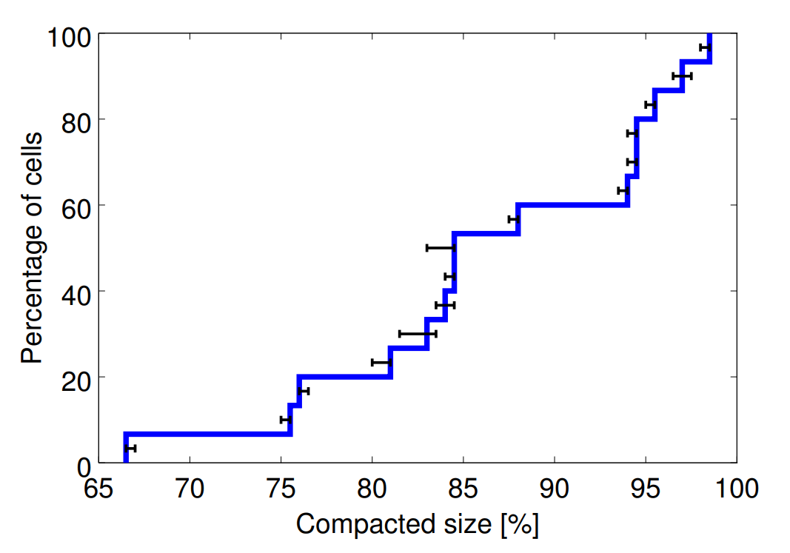

<center>图 4：The effects of compaction. A CDF of the percentage of original cell size achieved after compaction, across 15 cells.</center>

Borg 的一个关键设计特性是：即使 **Borgmaster** 或某个任务所在机器上的 **Borglet** 发生故障，已经运行的任务仍会继续运行。不过，保持 master 可用仍然非常重要，因为一旦 master 宕机，系统就无法提交新作业，也无法更新已有作业；同时，来自故障机器的任务也无法被重新调度。

Borgmaster 结合使用多种技术，使其在实践中能够达到 99.99% 的可用性：

+ 通过副本复制应对机器故障；
+ 通过准入控制避免系统过载；
+ 并使用简单、低层次的工具部署实例，以尽量减少外部依赖。

各个 cell 彼此独立，以降低运维人员误操作之间产生关联的概率，并减少故障传播。限制 cell 规模继续扩大的主要原因正是这些目标，而不是系统的可扩展性瓶颈。

## 5. Utilization

Borg 的主要目标之一，是高效利用 Google 的大规模机器资源。该机器资源池代表着一项巨大的资金投入：即便资源利用率只提高几个百分点，也可能节省数百万美元的成本。本节将讨论并评估 Borg 为实现这一目标所采用的部分策略与技术。

### 5.1 Evaluation methodology

我们的作业存在放置约束，并且需要应对少见的工作负载突增；机器本身具有异构性；同时，我们还会利用从服务作业中回收的资源来运行批处理作业。因此，为了评估不同策略选择，我们需要一种比“平均利用率”更精细的指标。经过大量实验后，我们选择了 **cell 压缩**（cell compaction）作为评估指标：给定一个工作负载后，我们通过不断移除机器，来判断该工作负载最小可以被装入多小规模的 cell 中，直到其不再能够被容纳为止。在此过程中，我们会反复从零开始重新装箱该工作负载，以避免结果受某个偶然不利配置的影响。这种方法提供了清晰的终止条件，也便于进行自动化比较，同时避免了合成工作负载生成与建模所带来的问题。

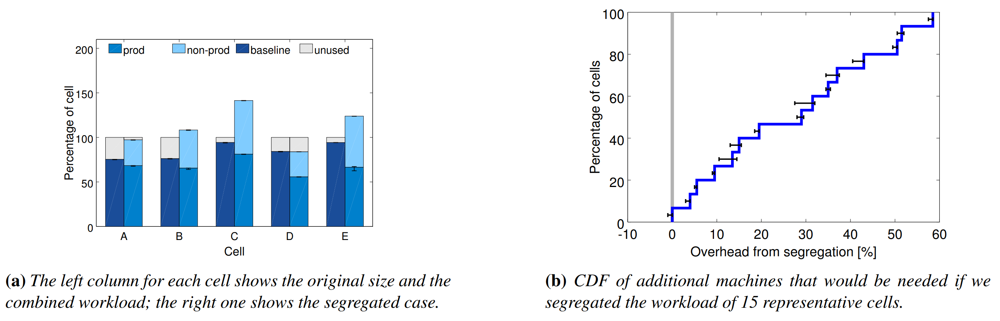
<center>图 5：Segregating prod and non-prod work into different cells would need more machines. Both graphs show how many extra machines would be needed if the prod and non-prod workloads were sent to separate cells, expressed as a percentage of the minimum number of machines required to run the workload in a single cell. In this, and subsequent CDF plots, the value shown for each cell is derived from the 90%ile of the different cell sizes our experiment trials produced; the error bars show the complete range of values from the trials.</center>

我们无法直接在在线生产 cell 上开展实验，因此使用 **Fauxmaster** 基于真实生产 cell 和真实工作负载的数据获取高保真仿真结果。这些数据包含所有约束、实际资源上限、资源预留以及资源使用情况（见第 5.5 节）。这些数据来自 Borg 在太平洋夏令时 2014 年 10 月 1 日星期三 14:00 生成的检查点。（其他检查点也产生了类似结果。）我们最终选取 15 个 Borg cell 进行报告：首先剔除专用 cell、测试 cell 以及小规模 cell（少于 5000 台机器），然后从剩余 cell 集合中进行抽样，使样本在不同规模范围内大致均匀分布。

为保持压缩后 cell 中机器的异构性，我们随机选择要移除的机器。为保持工作负载的异构性，我们保留了全部工作负载，只有绑定到特定机器上的服务器任务和存储任务除外，例如 Borglet。对于规模超过原始 cell 一半的作业，我们将其硬约束转换为软约束；如果某些任务对放置位置非常“挑剔”，只能被放置在少数几台机器上，则允许最多 0.2% 的任务进入等待状态。大量实验表明，这种处理方式能够产生可重复且方差较低的结果。如果需要构造一个比原始 cell 更大的 cell，我们会在压缩前先将原始 cell 克隆若干次；如果需要更多 cell，则直接克隆原始 cell。

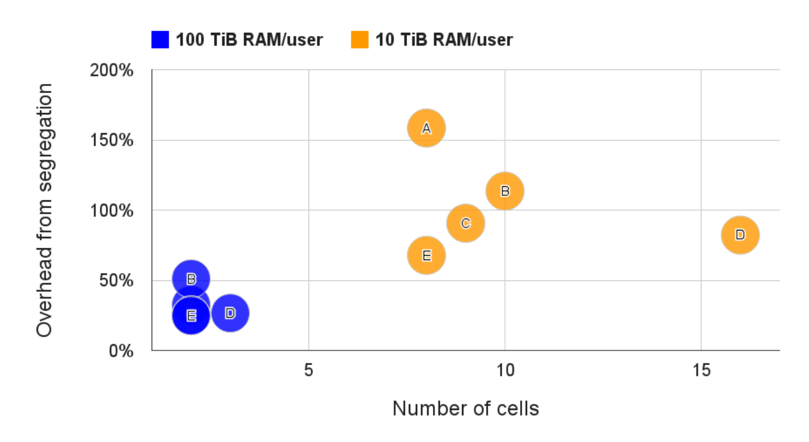

<center>图 6：Segregating users would need more machines. The total number of cells and the additional machines that would be needed if users larger than the threshold shown were given their own private cells, for 5 different cells.</center>

对于每个 cell，每项实验都使用不同的随机数种子重复 11 次。在图中，我们使用误差条展示所需机器数量的最小值和最大值，并将第 90 百分位值作为“结果”。之所以不采用均值或中位数，是因为如果系统管理员希望较有把握地确保该工作负载能够被容纳，这两类统计量并不能反映其实际决策方式。我们认为，**cell 压缩**提供了一种公平且一致的方法，用于比较不同调度策略；同时，它也可以直接转化为成本/收益结果：更好的策略在运行相同工作负载时需要更少的机器。

我们的实验关注的是对某一时刻的工作负载进行调度（装箱），而不是重放一段长期工作负载轨迹。这样做有多方面原因：一方面是为了避免处理开放式和封闭式排队模型所带来的困难；另一方面，由于我们的环境中存在大量长期运行的服务，传统的任务完成时间指标并不适用；此外，这种方式能够为策略比较提供更清晰的信号；同时，我们也认为采用长期轨迹重放不会使结果产生显著差异。还有一个现实原因是实验成本：在某个阶段，我们的实验消耗了 200,000 个 Borg CPU 核心。即便以 Google 的规模来看，这也不是一项可以忽略的资源投入。

在生产环境中，我们会有意保留大量容量余量，以应对工作负载增长、偶发的“黑天鹅”事件、负载突增、机器故障、硬件升级，以及大规模局部故障，例如供电母线槽故障。图 4 展示了如果对真实生产中的 cell 应用 **cell 压缩**，这些 cell 的规模可以缩小到什么程度。后续各图中的基线均采用这些压缩后的 cell 规模。

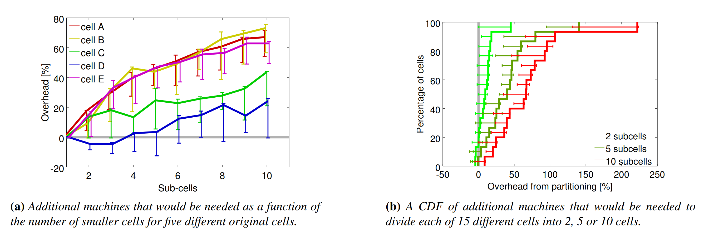

<center>图 7：Subdividing cells into smaller ones would require more machines. The additional machines (as a percentage of the single-cell case) that would be needed if we divided these particular cells into a varying number of smaller cells.</center>

### 5.2 Cell sharing

几乎所有机器都会同时运行 **prod** 与 **non-prod** 任务：在共享的 Borg cell 中，98% 的机器同时承载这两类任务；在 Borg 管理的全部机器范围内，这一比例也达到 83%。（我们仅为特殊用途保留了少量专用 cell。）

由于许多其他组织会将面向用户的作业与批处理作业部署在不同集群中，我们也评估了如果采用同样做法会产生什么影响。图 5 表明，如果将 prod 与 non-prod 工作负载隔离运行，那么在中位数 Borg cell 中，为了承载相同工作负载，需要额外增加 20%–30% 的机器。原因在于，prod 作业通常会为应对罕见的负载峰值而预留资源，但这些资源在大多数时间并不会被实际使用。Borg 可以回收这些闲置资源（见 5.5 节），并将其用于运行大量 non-prod 工作负载，因此整体上所需机器数量更少。

大多数 Borg cell 都由数千名用户共享。图 6 解释了其中原因。在该测试中，如果某个用户的内存消耗至少达到 10 TiB（或 100 TiB），我们就将其工作负载拆分到一个新的 cell 中。结果表明，我们现有的策略是合理的：即使采用更高的阈值，也需要将 cell 数量增加到原来的 2–16 倍，并额外增加 20%–150% 的机器。由此可见，资源池化能够显著降低成本。

但另一个可能的问题是：将互不相关的用户和作业类型打包部署到同一批机器上，是否会造成 CPU 干扰，从而需要更多机器来弥补性能损失？为评估这一点，我们考察了在相同机器类型、相同时钟频率下，不同运行环境中的任务其 CPI（cycles per instruction，每条指令所需周期数）如何变化。在这些条件下，CPI 具有可比性，并可作为衡量性能干扰的代理指标，因为对于 CPU 密集型程序而言，CPI 翻倍意味着运行时间也会翻倍。数据来自一周内随机选取的约 12,000 个 prod 任务；我们使用文献中描述的硬件性能剖析基础设施，在 5 分钟时间窗口内统计周期数和指令数，并对样本进行加权，使每一秒 CPU 时间都具有相同权重。最终结果并不十分明确。

1.  我们发现，在同一时间窗口内，CPI 与两个指标呈正相关：一是机器整体的 CPU 利用率，二是该机器上运行的任务数量，且这两个因素在很大程度上彼此独立。根据对数据拟合得到的线性模型，每向一台机器增加一个任务，其他任务的 CPI 会上升 0.3%；机器 CPU 利用率每提高 10%，CPI 的增幅不到 2%。不过，尽管这些相关性在统计意义上显著，它们只能解释 CPI 测量值中约 5% 的方差；真正占主导地位的是其他因素，例如应用自身的固有差异，以及特定的干扰模式 [24, 83]。 
2.  我们还将共享 cell 中采样得到的 CPI 与少数专用 cell 中的 CPI 进行了比较。后者承载的应用类型更少、工作负载多样性较低。结果显示，共享 cell 中的平均 CPI 为 1.58，标准差为： 
$$
σ=0.35
$$
专用 cell 中的平均 CPI 为 1.53，标准差为：
$$
σ=0.32
$$
也就是说，共享 cell 中的 CPU 性能大约下降了 3%。

3. 为了回应这样一种疑虑：不同 cell 中的应用可能承载不同类型的工作负载，甚至可能存在选择偏差，例如那些对干扰更敏感的程序可能已经被迁移到了专用 cell 中。为此，我们考察了 Borglet 的 CPI。Borglet 会运行在两类 cell 的所有机器上，因此更适合作为对比对象。 
我们发现，在专用 cell 中，Borglet 的 CPI 为：
$$
1.20  (σ=0.29)
$$
而在共享 cell 中，其 CPI 为：
$$
1.43(σ=0.45)
$$
这表明，Borglet 在专用 cell 中的运行速度大约是共享 cell 中的：
$$
1.19\times
$$
不过，这一结果会过度放大轻负载机器的影响，从而使结论略微偏向于支持专用 cell。

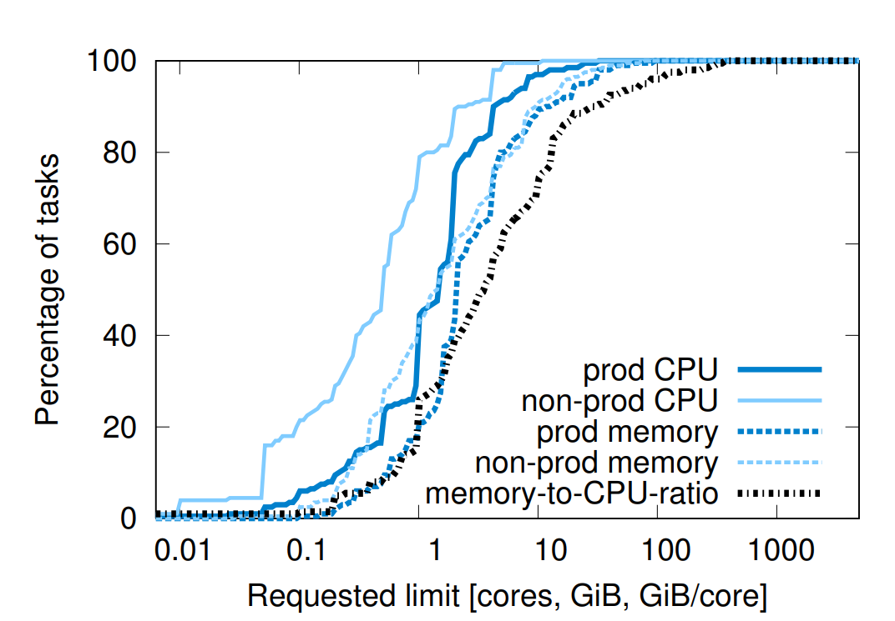

<center>图 8：No bucket sizes fit most of the tasks well. CDF of requested CPU and memory requests across our sample cells. No one value stands out, although a few integer CPU core sizes are somewhat more popular.</center>

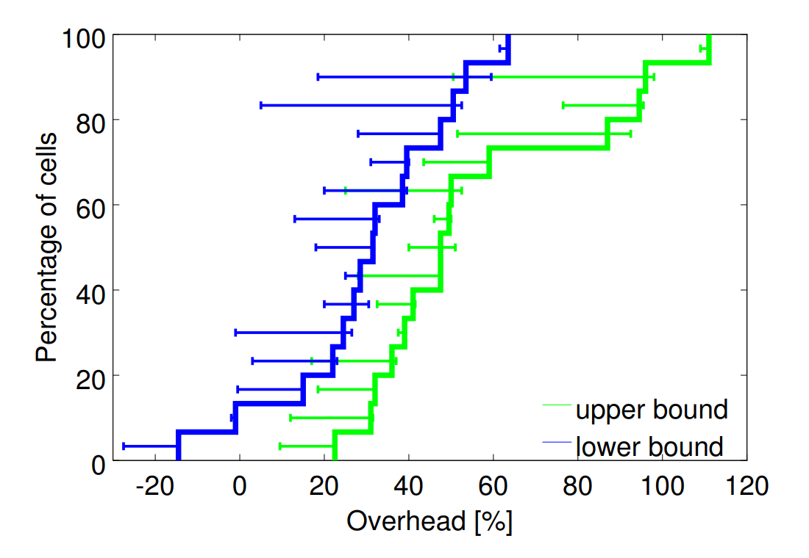

<center>图 9：“Bucketing” resource requirements would need more achines. A CDF of the additional overheads that would result rom rounding up CPU and memory requests to the next nearest owers of 2 across 15 cells. The lower and upper bounds straddle he actual values (see the text).</center>

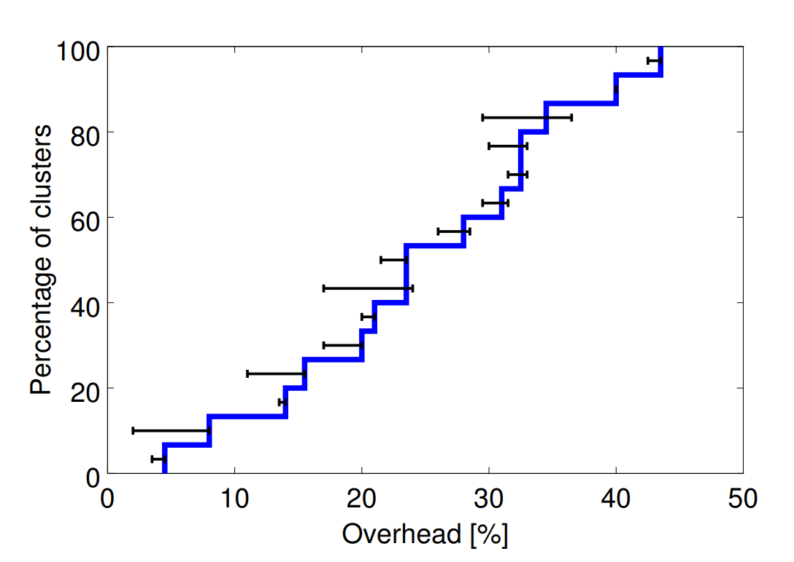

<center>图 10: Resource reclamation is quite effective. A CDF of the additional machines that would be needed if we disabled it for 15 representative cells.</center>

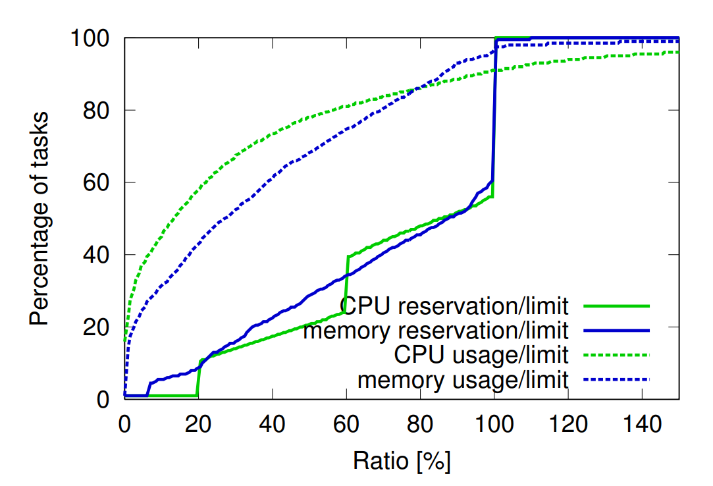

<center>图 11: Resource estimation is successful at identifying unused resources. The dotted lines shows CDFs of the ratio of CPU and memory usage to the request (limit) for tasks across 15 cells. Most tasks use much less than their limit, although a few use more CPU than requested. The solid lines show the CDFs of the ratio of CPU and memory reservations to the limits; these are closer to 100%. The straight lines are artifacts of the resource-estimation process.</center>

这些实验表明，在仓库级规模下进行性能比较并不容易，这也印证了文献 [51] 中的观察。同时，实验结果还表明，资源共享并不会显著增加程序运行成本。

即便采用对我们最不利的实验结果进行估计，资源共享仍然是有利的：在多种不同的资源划分方案下，CPU 性能下降所带来的损失，都小于所需机器数量减少带来的收益。此外，共享带来的优势并不只作用于 CPU，而是适用于包括内存和磁盘在内的所有资源。

### 5.3 Large Cells

Google 构建大规模 cell，目的有二：一是支持大规模计算任务的运行，二是降低资源碎片化。我们通过将某个 cell 的工作负载划分到多个更小的 cell 中，来测试后者所带来的影响。具体而言，我们首先对作业进行随机重排，然后以轮询方式将它们分配到各个分区中。图 7 证实，如果采用更小规模的 cell，将需要显著更多的机器。

### 5.4 Fine-grained resource requests

Borg 用户以 **milli-core** 为单位申请 CPU 资源，并以字节为单位申请内存和磁盘空间。（这里的一个 **core** 指一个处理器超线程，并且已经针对不同机器类型之间的性能差异进行了归一化。）图 8 表明，用户确实利用了这种细粒度的资源申请机制：在内存或 CPU core 的申请量上，几乎不存在明显的“甜点”或集中偏好的取值；这些资源之间也很少呈现出明显相关性。这些分布与文献 [68] 中给出的结果非常相似，区别仅在于，在第 90 百分位及更高分位处，我们观察到的内存申请量略大。

提供一组固定规格的容器或虚拟机，虽然是 IaaS（infrastructure-as-a-service，基础设施即服务）提供商中的常见做法 ，但并不适合我们的需求。为说明这一点，我们对 **prod** 作业和 **alloc**（见 2.4 节）的 CPU core 与内存资源上限进行了“分桶”处理：在每个资源维度上，将其向上取整到最近的 2 的幂次规格；其中 CPU 从 0.5 core 起步，RAM 从 1 GiB 起步。图 9 表明，在中位数情况下，这种做法会额外消耗 30%–50% 的资源。其中，上界来自如下处理：对于在紧凑化开始前、即使将原始 cell 扩大到 4 倍后仍无法容纳的大型任务，为其分配整台机器；下界则来自允许这些任务进入 pending 状态。需要说明的是，这一额外开销低于文献中报告的约 100% 开销，原因在于我们支持超过 4 个资源桶，并允许 CPU 与 RAM 容量彼此独立地扩展。

### 5.5 Resource reclamation

作业（Job）可以指定**资源限制（Resource Limit）**，即为该作业下的每个任务（Task）所分配的资源上限。Borg 依据此限制来执行两项关键判定：首先，判断用户是否拥有足够的配额（Quota）以准入该作业；其次，确定特定的物理机是否有充足的空闲资源来调度该任务。正如现实中存在超额购买配额的用户一样，部分用户申请的资源也会远超其实际需求。这主要是由于 Borg 的强制约束机制：一旦任务尝试使用的内存或磁盘空间超过其申请值，Borg 通常会直接将其**终止（Kill）**；而对于 CPU 资源，Borg 则会将其限制（Throttle）在申请的数值之内。此外，尽管大多数任务在大部分时间内并不会满负荷运行，但它们偶尔也需要动用全部资源（例如在每日业务高峰期或应对拒绝服务攻击时）。

为了避免浪费已分配但当前尚未消耗的资源，我们通过估算任务的实际资源需求，将剩余部分回收并重新分配给那些对资源质量要求较低的工作（例如批处理作业）。这一完整过程被称为**资源回收（Resource Reclamation）**。上述估算值被称为任务的**预留值（Reservation）**。Borgmaster 每隔几秒就会利用 Borglet 采集到的细粒度使用量（Usage，即实际资源消耗）信息，对预留值进行重新计算。在初始阶段，预留值被设定为等同于资源申请值（即 Limit）；考虑到启动阶段的瞬时波动（Startup Transients），预留值在 300 秒后会开始缓慢衰减，直至趋近于“实际用量加上安全余量”的水平。而一旦实际使用量超过了预留值，系统则会迅速调高预留值以作应对。

Borg 调度器在为**生产任务（Prod Tasks）计算可行性（详见 3.2 节）时是以其“资源限制（Limits）”为准的。因此，生产任务绝不会依赖回收资源，也不会暴露在资源超卖（Resource Oversubscription）的风险之下。相比之下，对于非生产任务（Non-prod Tasks）**，调度器则参考现有任务的预留值（Reservations）进行计算，从而允许新任务被调度到回收资源中。如果预留值（即预测结果）**出现偏差，即便所有任务的实际用量均低于其资源限制，物理机仍可能在运行时面临资源耗尽的情况。一旦发生此类故障，系统会通过**终止（Kill）**或**限流（Throttle）非生产任务来释放资源，而绝不会影响生产任务。

图 10 表明，若不采用资源回收机制，则需要投入远超现状的机器设备。在一个中位规模的集群（Cell）中，约有 20% 的负载（详见 6.2 节）运行在回收资源上。

图 11 展示了更详尽的信息，即预留值（Reservations）及实际使用量（Usage）相对于资源限制（Limits）的比率。当系统需要回收资源时，任何超过内存限制的任务都将首先被**抢占（Preempted）**，且不受优先级的保护；因此，任务超出其内存限制的情况极为罕见。相比之下，由于 CPU 资源极易执行**限流（Throttle）**，因此短时间的 CPU 峰值（Spikes）导致实际用量超过预留值的情况通常是基本无害的。

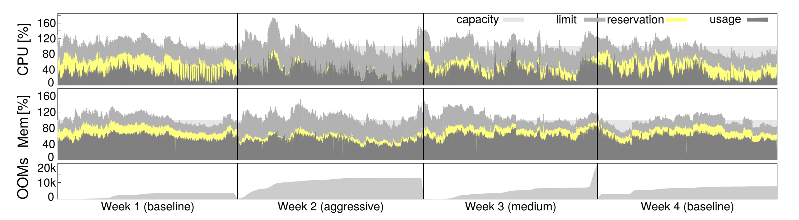

<center>图 12：More aggressive resource estimation can reclaim more resources, with little effect on out-of-memory events (OOMs). A timeline (starting on 2013-11-11) for one production cell of usage, reservation and limit averaged over 5-minute windows and cumulative out-of memory events; the slope of the latter is the aggregate rate of OOMs. Vertical bars separate weeks with different resource estimation setting.</center>

图 11 表明，现有的资源回收机制可能过于保守：在预留值（Reservation）曲线与实际使用量（Usage）曲线之间存在巨大的**冗余空间**。为了验证这一猜想，我们选取了一个线上生产集群，并对其资源估算算法的参数进行了为期三周的调整测试：第一周，通过缩小安全余量（Safety Margin）将参数设为“激进”模式；第二周，将参数调整为介于基准值与激进值之间的“中等”模式；最后一周则恢复至基准模式。

图 12 展示了实验结果。显而易见，第二周的预留值最贴近实际使用量，第三周次之，而处于基准模式的第一周和第四周差距最为显著。正如预料，第二周和第三周的内存溢出（OOM）**事件频率略有上升。在综合评估实验结果后，我们认定其带来的**净收益（Net Gains）超过了负面影响，因此最终在其他集群中全面部署了“中等”强度的资源回收参数。

## 6. Isolation

在我们的集群中，50% 的机器运行着 9 个或更多的任务；而在 **90 分位数（90%ile）** 水平的机器上，任务数量约为 25 个，且同时运行着大约 4500 个线程。尽管在不同应用程序间共享物理机器（即**混部**）可以提升资源利用率，但这同时也要求系统具备完善的机制，以防止任务之间相互干扰。这种隔离需求不仅适用于安全性，在性能层面也同样至关重要。

### 6.1 Security isolation

我们利用 **Linux chroot jail** 作为同一台机器上多个任务之间的主要安全隔离机制。为了支持远程调试，我们早期曾采用自动分发（及撤销）SSH 密钥的方案，使用户仅在机器为其运行任务期间拥有访问权限。目前，对于大多数用户而言，该方案已被 `borgssh` 命令取代。`borgssh` 通过与 Borglet 协作，建立一个指向特定 Shell 的 SSH 连接，而该 Shell 与目标任务运行在完全相同的 **chroot** 和 **cgroup** 环境中，从而实现了更严密的访问受限（Lockdown）。

对于 Google App Engine (GAE) [38] 和 Google Compute Engine (GCE) 运行的外部软件，则采用了虚拟机（VM）及安全沙箱（Sandboxing）技术。我们将每个托管的虚拟机运行在一个 **KVM 进程** [54] 中，而该进程本身则作为一个 Borg 任务进行管理。

### 6.2 Performance isolation

早期版本的 Borglet 在资源隔离的强制执行上相对原始：它主要依赖对内存、磁盘空间和 CPU 周期的**事后（Post-hoc）使用量检查**。具体手段包括：直接终止内存或磁盘占用过高的任务，以及激进地利用 Linux CPU 优先级（Priorities）来约束那些过度消耗 CPU 的任务。然而，在这种机制下，异常任务（Rogue Tasks）依然能够轻易干扰同一台机器上其他任务的性能。

受此影响，部分用户开始**虚报（Inflate）资源申请量，以此减少 Borg 调度到其机器上的混部任务数量，但这直接导致了系统整体利用率的下降。虽然资源回收机制可以收回部分盈余资源，但受限于安全余量（Safety Margins）**，这种回收并不完全。在最极端的情况下，用户甚至会申请使用专用的物理机或集群（Cells）。

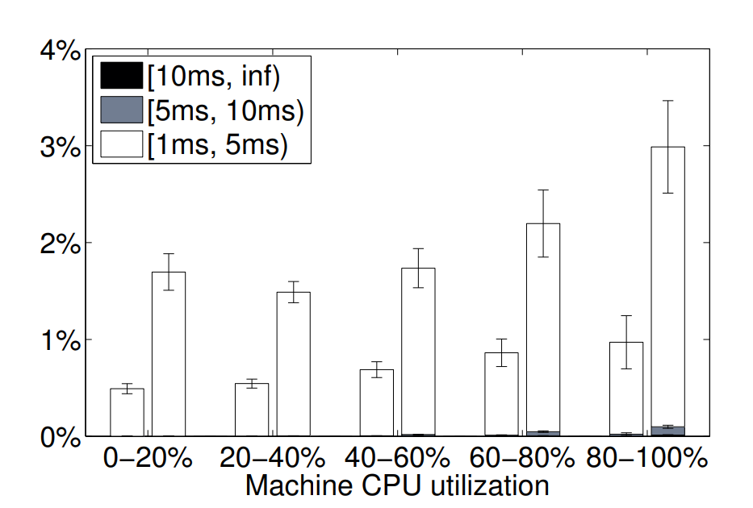

<center>图 13： Scheduling delays as a function of load. A plot of how often a runnable thread had to wait longer than 1ms to get access to a CPU, as a function of how busy the machine was. In each pair of bars, latency-sensitive tasks are on the left, batch ones on the right. In only a few percent of the time did a thread have to wait longer than 5 ms to access a CPU (the white bars); they almost never had to wait longer (the darker bars). Data from a representative cell for the month of December 2013; error bars show day-to-day variance.</center>

目前，所有 Borg 任务均运行在基于 **Linux cgroup** 的资源容器中，由 Borglet 负责操作容器配置。由于操作系统内核深度介入了这一管控流程，系统的控制精度得到了显著改善。即便如此，底层的资源干扰（例如内存带宽争抢或 **L3 缓存污染**）偶尔仍会发生。

为了应对资源过载与**超额配置（Overcommitment）**，Borg 任务被赋予了“应用类别”（Application Class，简称 **appclass**）。其中最核心的区别在于**延迟敏感型（Latency-Sensitive, LS）**类别与其余类别（本文统称为“批处理（Batch）”）之间的划分。LS 任务通常用于面向用户的应用程序，以及对请求响应速度有严格要求的共享基础设施服务。高优先级的 LS 任务拥有最优的资源保障待遇，甚至能够做到在运行过程中，每次暂时“剥夺”批处理任务资源达数秒之久，使其处于**资源饥饿（Starving）状态**。

另一种分类方式是将资源划分为**可压缩资源（Compressible Resources）与不可压缩资源（Non-compressible Resources）**。可压缩资源（如 CPU 周期、磁盘 I/O 带宽）具有基于速率（Rate-based）的特性，系统可以通过降低任务的服务质量（QoS）来回收此类资源，而无需将其终止。相比之下，不可压缩资源（如内存、磁盘空间）通常只有通过终止任务才能回收。若机器耗尽了不可压缩资源，Borglet 会立即按照优先级从低到高的顺序终止任务，直到满足剩余任务的**预留值（Reservations）需求。若机器耗尽的是可压缩资源，Borglet 则会执行限流（Throttle）**（并优先保障 LS 任务），从而在不终止任何任务的前提下应对短期负载峰值。如果情况持续未能改善，Borgmaster 将会把一个或多个任务从该机器上移除（即执行驱逐）。

Borglet 运行着一个**用户态控制循环（User-space control loop）**，负责为容器分配内存。其分配策略因任务优先级而异：对于生产任务，分配依据是**预测的未来使用量**；而对于非生产任务，则主要参考**内存压力（Memory Pressure）**。该控制循环还负责处理来自内核的 **OOM（内存溢出）事件**，并在两种场景下终止任务：一是任务尝试分配的内存超出了其设定的限制（Limit）；二是当物理机处于**超额配置（Over-committed）状态且实际物理内存耗尽时。此外，由于需要实现精确的内存统计（Memory-accounting）**，Linux 激进的文件缓存（Eager file-caching）机制显著增加了系统实现的复杂性。

为了提升性能隔离效果，**延迟敏感型（LS）任务**可以预留并独占完整的物理 CPU 核心，从而防止其他 LS 任务抢占其资源。**批处理（Batch）任务**虽被允许在任何核心上运行，但相比于 LS 任务，分配给它们的调度权重（Scheduler Shares）微乎其微。

为了确保批处理任务不至于连续数分钟处于资源饥饿（Starve）状态，Borglet 会动态调整那些“贪婪型”LS 任务的资源上限。在必要时，Borglet 会有选择地应用 **CFS 带宽控制（CFS Bandwidth Control）**；这是因为在存在多级优先级的情况下，单纯依靠权重机制（Shares）已不足以实现精细的资源管控。

与 Leverich 的研究结论一致，我们发现标准 Linux CPU 调度器（CFS）需要经过深度调优，方能同时兼顾**低延迟**与**高利用率**。为了降低调度延迟，我们定制化的 CFS 版本采用了扩展的**单 cgroup 负载历史记录**，支持 LS 任务对批处理任务的强制抢占，并能在单核上存在多个就绪态 LS 任务时缩短**调度时间片（Scheduling Quantum）**。

幸运的是，我们的多数应用采用了“每个请求一个线程（Thread-per-request）”的模型，这有效缓解了持续性负载失衡带来的负面影响。对于延迟要求极度严苛的应用，我们会谨慎地通过 **cpusets** 为其分配专属的 CPU 核心。上述努力的部分成果见图 13。相关研究仍在持续推进中，包括引入能够感知 **NUMA 架构**、**超线程**以及**功耗**的线程放置与 CPU 管理策略，并致力于进一步提升 Borglet 的**控制精度（Control Fidelity）**。

任务获准使用的资源量最高可达其设定的限制值（Limit）。对于 CPU 等可压缩资源，大多数任务被允许超出限制运行，以便利用机器上的**闲置（Slack）资源**。仅有 5% 的延迟敏感型（LS）任务禁用了这一特性，据推测是为了获得更佳的性能**可预测性**；而禁用此特性的批处理任务比例则不足 1%。

相比之下，利用**闲置内存**的功能默认是关闭的，因为这会增加任务被强制终止（Kill）的风险。即便如此，仍有 10% 的 LS 任务手动开启了该功能，而 79% 的批处理任务也开启了该功能（这是由于 MapReduce 框架的默认设置所致）。上述数据对回收资源的研究结果（详见 5.5 节）形成了补充。批处理任务倾向于投机性（Opportunistically）地利用闲置及回收的内存：在绝大多数情况下这种策略行之有效，尽管当 LS 任务急需资源时，偶尔会有批处理任务成为被“牺牲”的对象。

## 7. Related Work

资源调度领域的研究已延续数十年之久。其涵盖的应用场景极其广泛，包括广域高性能计算（HPC）超级计算网格、工作站网络以及大规模服务器集群。在本文中，我们仅聚焦于与**大规模服务器集群**语境最为相关的研究工作。

近期，多项研究通过分析雅虎（Yahoo!）、谷歌（Google）及脸书（Facebook）的**集群追踪数据（Cluster Traces）**，揭示了现代数据中心及其工作负载中固有的规模性与异构性（Heterogeneity）挑战。

**Apache Mesos** 将资源管理与任务放置（Placement）功能进行了解耦：其架构由一个中央资源管理器（类似于去掉了调度器的 Borgmaster）和多个如 Hadoop 、Spark 等“框架”组成，并采用了基于资源邀约（Offer-based）**的机制。相比之下，Borg 则主要采用基于**请求（Request-based）的机制将这些功能集中化，且该机制展现出了极佳的可扩展性。此外，**主导资源公平算法（DRF）最初是为 Mesos 开发的，而 Borg 则选择使用优先级与准入配额机制。Mesos 的开发者已表示，计划将 Mesos 扩展至包含推测性资源分配**与回收功能。

**YARN** 是一款以 Hadoop 为中心的集群管理器。在 YARN 架构中，每个应用程序都拥有一个独立的管理器（即 ApplicationMaster），负责与中央资源管理器（ResourceManager）协商申领所需资源；这一机制与 2008 年前后 Google MapReduce 作业从 Borg 获取资源的方式基本一致。值得注意的是，YARN 的中央资源管理器直到近期才实现了**容错（Fault Tolerant）**。另一项相关的开源成果是 **Hadoop Capacity Scheduler** ，它通过资源容量保证、**分层队列（Hierarchical Queues）**、弹性共享及公平性机制，提供了完善的**多租户（Multi-tenant）**支持。此外，YARN 近期还进行了扩展，以支持多种资源类型、优先级、抢占（Preemptions）及高级准入控制（Admission Control）。而研究原型 Tetris 则支持**感知完成时间（Makespan-aware）**的作业装箱（Job Packing）策略。

Facebook 开发的 **Tupperware** 是一款类似于 Borg 的系统，专门用于在集群中调度 **cgroup** 容器。尽管目前披露的公开细节较少，但该系统似乎也支持某种形式的**资源回收**机制。Twitter 则开源了 **Aurora** —— 这是一款运行在 Mesos 之上的类 Borg 调度器，主要面向**长时运行服务（Long-running Services）**。其配置语言和状态机（State Machine）的设计均与 Borg 颇为相似。

微软研发的 **Autopilot** 系统 [48] 为其集群实现了“软件配置与部署自动化、系统监控，以及针对软硬件故障的修复执行”。Borg 生态系统也具备类似的特性，但受限于**篇幅（Space）**，本文不在此赘述；Isard 总结的许多最佳实践亦为我们所遵循。

**Quincy** 采用**网络流模型（Network Flow Model）**，在数百个节点规模的集群上，为数据处理的**有向无环图（DAG）提供兼顾公平性与数据局部性感知（Data Locality-aware）的调度。相比之下，Borg 通过配额和优先级机制实现用户间的资源共享，并能支撑数万台机器的超大规模。此外，Quincy 直接处理执行图（Execution Graphs）**，而这一功能在 Borg 中则是作为上层组件独立构建的。

**Cosmos** 专注于批处理，其核心目标是确保用户能够公平地获取其向集群贡献的资源。该系统采用“单作业管理器（Per-job Manager）”来申请资源，目前公开的技术细节较少。

微软的 **Apollo** 系统则为短周期批处理作业采用了“单作业调度器（Per-job Schedulers）”，在规模与 Borg 集群（Cell）相当的集群上实现了高吞吐量。Apollo 通过**投机性执行（Opportunistic Execution）低优先级的后台任务，将资源利用率提升至极高水平，但代价是（有时会产生）长达数日的排队延迟。在具体实现上，Apollo 节点会提供一个关于任务启动时间的预测矩阵**，该矩阵是基于两个资源维度下的任务规模所计算的函数；调度器结合启动开销和远程数据访问的估算值来做出**放置决策（Placement Decisions）**，并引入随机延迟进行调节以减少调度冲突。

相比之下，Borg 使用中央调度器根据已分配状态做出放置决策，能够处理更多的资源维度，并侧重于满足高可用、长时运行应用的需求；而 Apollo 则可能具备更高的任务到达率（Task Arrival Rate）处理能力。

阿里巴巴的 **Fuxi（伏羲）** 主要支持数据分析类工作负载，该系统自 2009 年起开始投入运行。与 Borgmaster 类似，Fuxi 采用中心化的 **FuxiMaster**（通过多副本实现容错）来收集各节点的资源可用性信息，接收应用请求，并执行资源与任务的匹配。Fuxi 的**增量调度策略（Incremental Scheduling Policy）**在逻辑上与 Borg 的“等价类（Equivalence Classes）”机制互为逆向：Borg 的逻辑是将每个任务与一组适配的机器进行匹配，而 Fuxi 则是将新释放的可用资源与积压的待处理任务进行匹配。此外，与 Mesos 类似，Fuxi 允许定义“虚拟资源”类型。目前，该系统仅公开了针对**合成负载（Synthetic Workload）**的测试结果。

**Omega** 支持多个并行的、专门化的“**垂直调度路径（Verticals）**”，每个路径在大致功能上相当于去掉了持久化存储和链路分片（Link Shards）的 Borgmaster。Omega 调度器采用**乐观并发控制（Optimistic Concurrency Control）来操作存储在中央持久化存储中的共享视图**，该视图涵盖了集群的**期望状态（Desired State）与观测状态（Observed State）**，并通过一个独立的链路组件实现与 Borglet 之间的同步。

Omega 的架构旨在支持多种互异的工作负载，这些负载可以拥有各自特定于应用的 RPC 接口、状态机和调度策略（例如：长时运行的服务器、来自不同框架的批处理作业、集群存储系统等基础设施服务，以及 Google Cloud Platform 的虚拟机）。相比之下，Borg 提供的是一种“**通用型（One size fits all）**”的 RPC 接口、状态机语义和调度策略。随着支持的工作负载日益多样化，Borg 的这些组件在规模和复杂度上也不断增长，但目前其可扩展性尚未成为瓶颈（详见 3.4 节）。

Google 开源的 **Kubernetes** 系统将封装在 **Docker 容器** 中的应用程序部署到多个**宿主机节点（Host Nodes）**上。与 Borg 类似，Kubernetes 既支持运行在**裸金属（Bare Metal）**环境，也支持各种云托管平台（如 Google Compute Engine）。该系统目前正由许多参与过 Borg 开发的原班工程师进行积极迭代。此外，Google 还提供了一个名为 **Google Container Engine (GKE)** 的托管版本。在下一节中，我们将探讨 Borg 的相关设计经验是如何应用到 Kubernetes 之中的。

**高性能计算（HPC）**社区在资源调度领域有着深厚的技术沉淀（例如 Maui、Moab 及 Platform LSF）；然而，HPC 系统在规模、工作负载特征以及**容错性（Fault Tolerance）**方面的需求与 Google 的**集群（Cells）**存在显著差异。通常情况下，此类系统通过维护大规模的**待处理作业积压（Backlogs/Queues）**来实现极高的资源利用率。

诸如 VMware 等虚拟化厂商，以及 HP 和 IBM 等数据中心解决方案提供商，所提供的集群管理方案通常仅能支持**千台（O(1000)）级**的机器规模。此外，若干研究团队也开发了一些原型系统，旨在从不同维度优化调度决策的质量。

最后，正如前文所述，管理大规模集群的另一个关键环节在于**自动化**以及“**运维效率的规模化扩展（Operator Scaleout）**”。Borg 秉持了相似的设计理念，这使得我们能够实现**平均每位 SRE（网站可靠性工程师）管理数万台机器**的卓越目标。

## 8. Lessons and future work

在本节中，我们将回顾在长达十余年的 **Borg** 生产环境运维过程中所积累的一些**定性经验**，并阐述这些实践观察是如何指导并应用到 **Kubernetes** 的设计之中的。

### 8.1 Lessons learned: the bad

在本节中，我们将回顾在长达十余年的 Borg 生产环境运维过程中所积累的一些**定性经验**，并阐述这些实践观察是如何指导并应用到 Kubernetes 的设计之中的。我们首先讨论 Borg 的一些特性，这些特性不仅具有警示意义，也为 Kubernetes 提供了更为明智的替代设计方案。

#### **Job 作为 Task 的唯一分组机制具有局限性。** 

Borg 缺乏一种原生（first-class）的方式来将整个多作业（multi-job）服务作为一个单一实体进行管理，也无法直接引用服务的相关实例（例如：金丝雀版本与生产版本）。为了解决这一问题，用户不得不采取一种折中的方案（hack）：将服务拓扑信息编码在 Job 名称中，并构建更高层级的管理工具来解析这些名称。另一方面，系统也无法引用 Job 的任意子集，这导致在执行滚动更新（rolling updates）和 Job 扩缩容（resizing）时，其语义表达缺乏灵活性。

Kubernetes 摒弃了基于 **Job** 的组织方式，转而采用一种更具灵活性且基于 **Label（标签）** 的组织机制。Label 是用户附加在系统对象（如 Pods）上的键值对（key-value pairs）。在 Kubernetes 中，任何集合的操作（例如：定义服务、负载均衡或更新操作等）都通过 **Label Selector（标签选择器）** 来选定目标对象。这种设计比 Borg 的 Job 机制更为强大：它允许开发者以多维度的度量标准来灵活划分和组织服务集合，从而实现更精细化的管理。**每个 Pod 拥有独立的 IP 地址。** 在 Borg 系统中，同一台物理机上的所有 Task 共享该主机的 IP 地址，因此不得不共享主机的端口空间。这导致了严重的问题：Borg 必须将端口作为一种稀缺资源进行调度；用户必须预估自己需要多少端口，并在程序启动时显式声明；此外，由于端口冲突，用户无法轻易运行多个版本的服务。

#### **单机单一 IP 地址增加了系统复杂性。** 

在 Borg 中，同一台机器上的所有 Task 都使用该宿主机的单一 IP 地址，因此必须共享宿主机的端口空间。这引发了一系列难题：Borg 必须将端口作为一种资源进行调度；Task 必须预先声明所需端口的数量，并接受系统在启动时为其分配的具体端口；**Borglet** 必须强制执行端口隔离；此外，命名系统和 **RPC** 系统也必须同时处理端口和 IP 地址。

得益于 **Linux namespaces**、虚拟机（VMs）、**IPv6** 以及软件定义网络（**SDN**）的出现，Kubernetes 能够采用一种更用户友好的方案来消除这些复杂性：每个 Pod 和 Service 都拥有独立的 IP 地址。这使得开发者可以自主选择端口，而无需让软件去适配基础设施所指定的端口，同时也消除了基础设施层面管理端口的复杂性。

#### **以牺牲普通用户为代价，过度优化高级用户体验。** 

Borg 提供了大量旨在服务“**高级用户（power users）**”的功能，以便他们能够对其程序的运行方式进行精细调优（**BCL** 规范中列出了约 230 个参数）。其最初的重点是支持 Google 内部最大的资源消耗者，对这些用户而言，效率的提升至关重要。然而，这种功能过于丰富的 **API** 却增加了“普通（casual）”用户的使用难度，并制约了系统的演进。我们的解决方案是构建运行在 Borg 之上的自动化工具和服务，通过实验来确定合适的配置参数。得益于容错（failure-tolerant）应用所提供的实验空间，这些工具能够发挥巨大作用：即使自动化工具偶尔出错，也仅仅是带来些许不便，而不会酿成灾难。

### 8.2 Lessons learned: the good

另一方面，Borg 的许多设计特性表现出极大的优势，并经受住了时间的考验。

#### **Alloc 机制非常实用。**

 Borg 的 **alloc** 抽象衍生出了被广泛使用的 **logsaver** 模式，以及另一种流行的应用模式——即通过一个简单的 **data-loader** 任务定期更新 Web 服务器所使用的数据。Alloc 和软件包（packages）机制使得这些辅助服务（helper services）可以由独立的团队进行开发。在 Kubernetes 中，与 alloc 对应的概念是 **pod**；它是一个资源信封（resource envelope），包含一个或多个容器，这些容器总是被调度到同一台机器上并可以共享资源。虽然 Kubernetes 在同一个 Pod 中使用的是辅助容器（helper containers）而非 alloc 中的任务（tasks），但其核心设计思想是一致的。

#### **集群管理不仅仅是任务管理。** 

尽管 Borg 的核心职责是管理任务与机器的生命周期，但运行于其上的应用还受益于许多其他集群服务，包括**命名（naming）和负载均衡（load balancing）**。Kubernetes 通过 **Service** 抽象来支持命名与负载均衡：一个 Service 拥有一个唯一的名称，以及一组通过标签选择器（label selector）动态定义的 Pod 集合。集群中的任何容器都可以通过该 Service 名称发起连接。在底层实现上，Kubernetes 会自动将指向该 Service 的连接负载均衡到与其标签选择器相匹配的各个 Pod 之间；同时，当 Pod 因故障被重新调度时，系统会持续追踪其运行位置的变更。

#### **自省机制（Introspection）至关重要。** 

尽管 Borg 几乎总是能“正常工作”，但一旦出现故障，寻找根因可能会极具挑战性。Borg 的一个重要设计决策是向所有用户公开调试信息，而非将其隐藏：由于 Borg 拥有成千上万名用户，因此“自主排障（self-help）”必须作为排障的第一步。虽然这种做法导致我们更难废弃某些功能或更改用户已产生依赖的内部策略，但这依然是值得的（win），而且我们目前还没有发现更务实的替代方案。为了处理庞大的数据量，我们提供了多个层级的 UI 和调试工具，以便用户能够快速识别与其作业相关的异常事件，进而深入钻研来自应用及基础设施本身的详细事件与错误日志。

Kubernetes 旨在复现 Borg 的许多自省技术。例如，它内置了用于资源监控的 **cAdvisor**，以及基于 **Elasticsearch/Kibana** 和 **Fluentd** 的日志聚合工具。用户可以向 **Master** 节点查询其对象状态的快照。此外，Kubernetes 拥有一种统一的机制，可供所有组件记录事件（例如：Pod 正在被调度、容器启动失败等），并将这些信息提供给客户端。

#### **Master 节点是分布式系统的内核。** 

**Borgmaster** 最初被设计为一个**单体系统（monolithic system）**，但随着时间推移，它演变成了一个位于服务生态系统核心的“内核”，这些服务通过协同工作来管理用户作业。例如，我们将调度器和主要 UI（Sigma）拆分为独立的进程，并新增了用于**准入控制（admission control）**、纵向与横向自动扩缩容、任务重打包（re-packing tasks）、周期性作业提交（cron）、工作流管理以及用于离线查询的系统操作归档等服务。这些改进共同协作，使我们能够在不牺牲性能或可维护性的前提下，扩展系统的工作负载规模和功能集。

Kubernetes 的架构则更进一步：其核心是一个 **API server**，它仅负责处理请求以及操作底层的状态对象。集群管理逻辑被构建为一系列细粒度、**可组合（composable）的微服务，这些服务作为 API server 的客户端运行，例如：用于在故障发生时维持 Pod 期望副本数量的副本控制器（replication controller）**，以及负责管理机器生命周期的**节点控制器（node controller）**。

### 8.3 Conclusion

在过去的十年中，几乎所有 Google 的集群**工作负载（workloads）都已转向使用 Borg。我们始终致力于推动该系统的持续演进**，并将其在发展过程中积累的宝贵经验深度应用到了 **Kubernetes** 的研发之中。