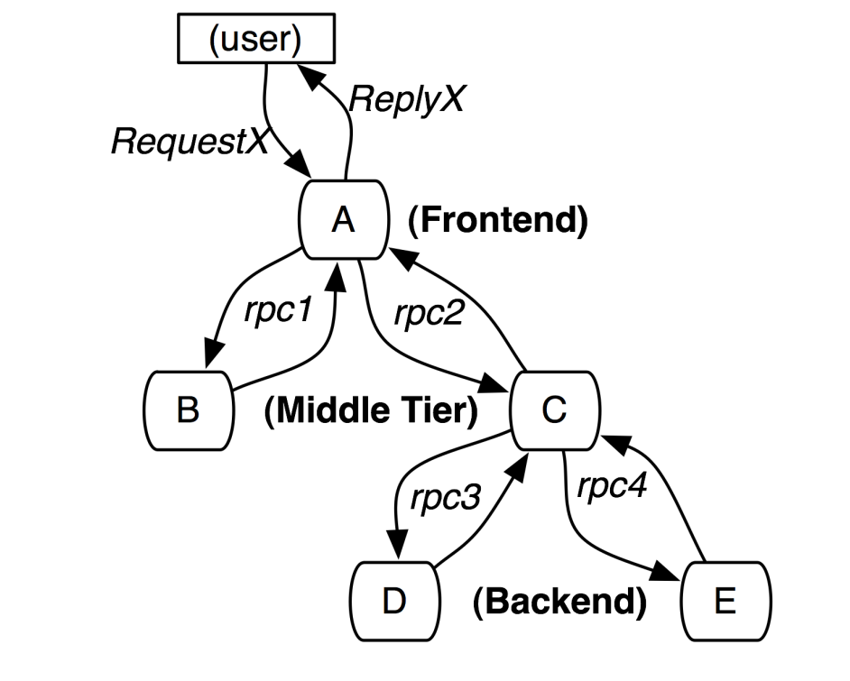
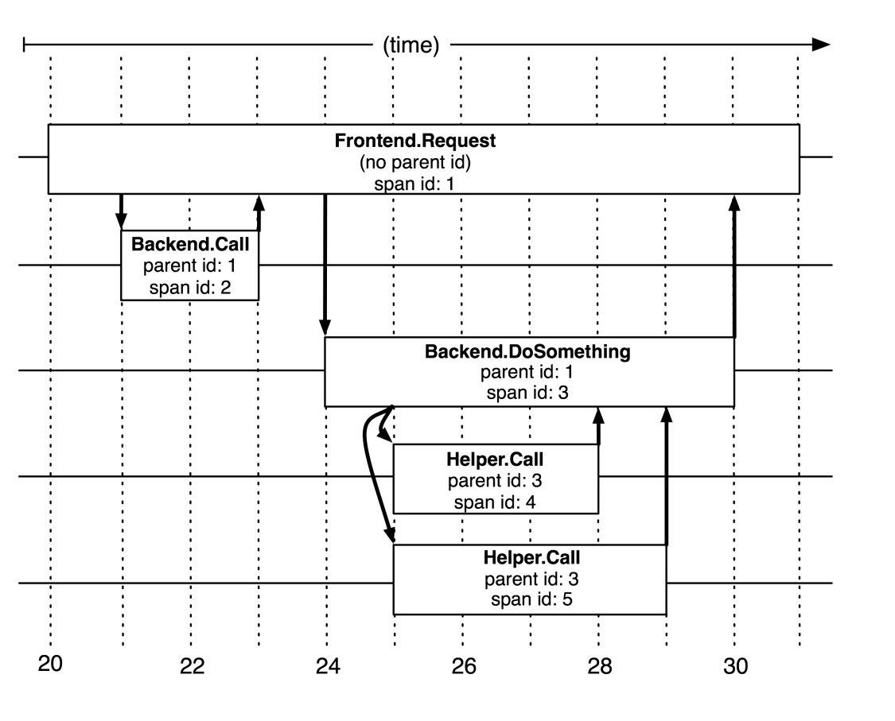
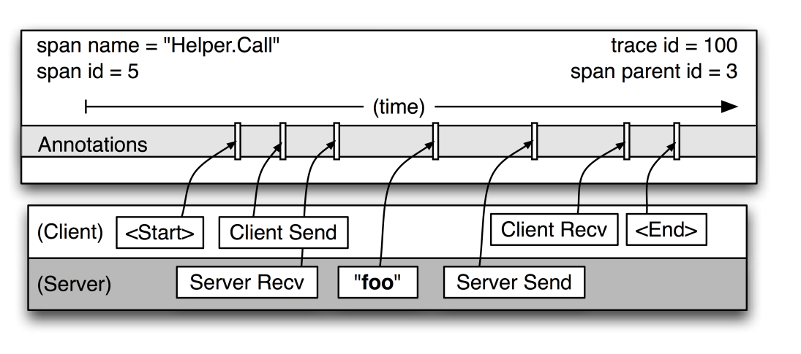
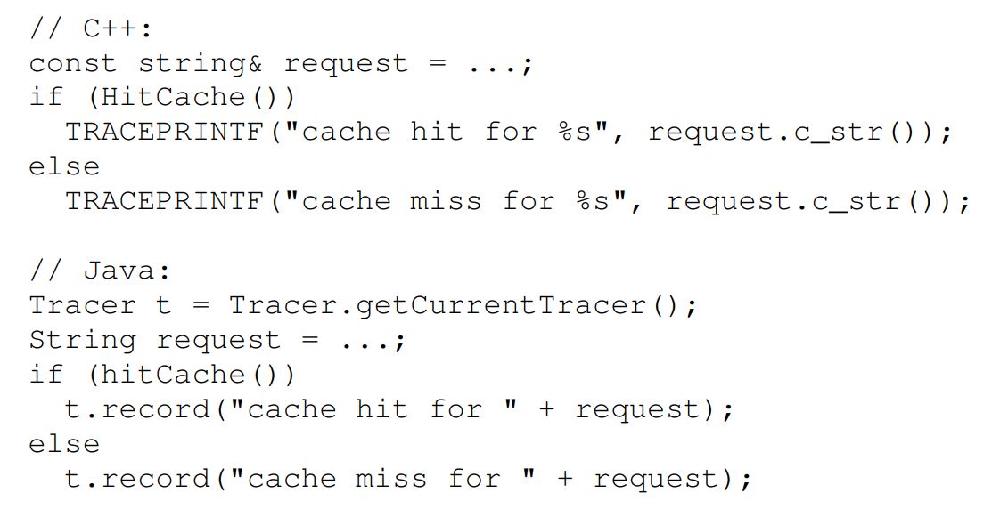
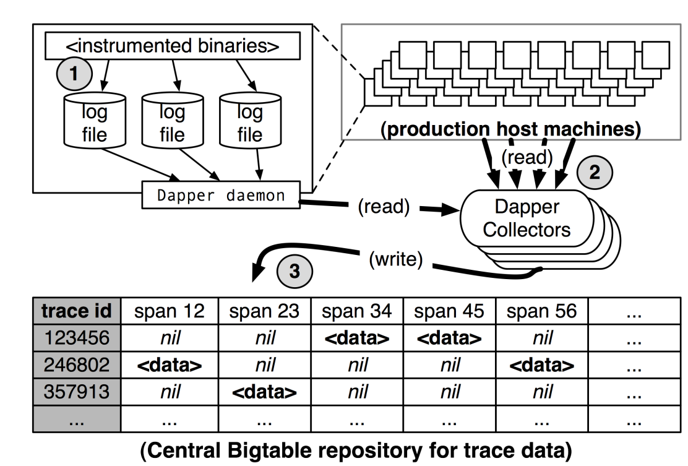
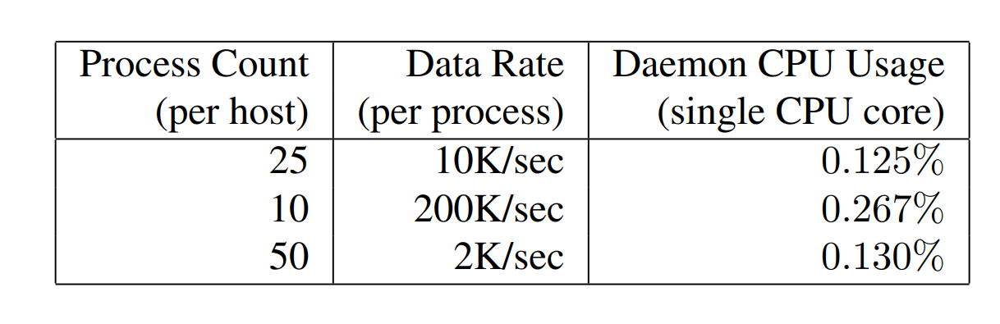
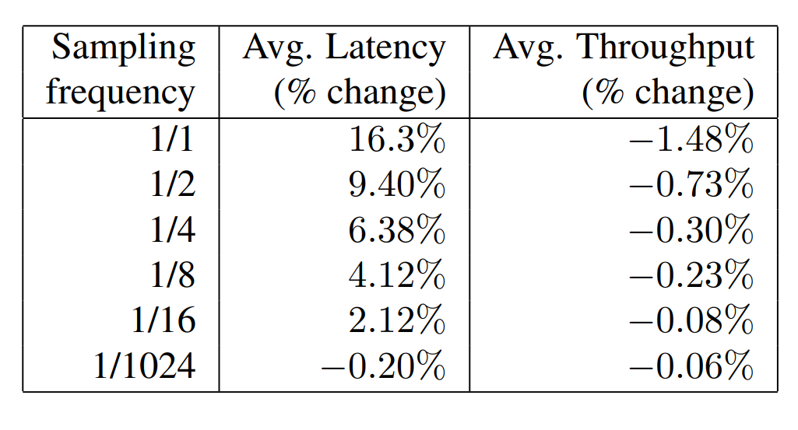
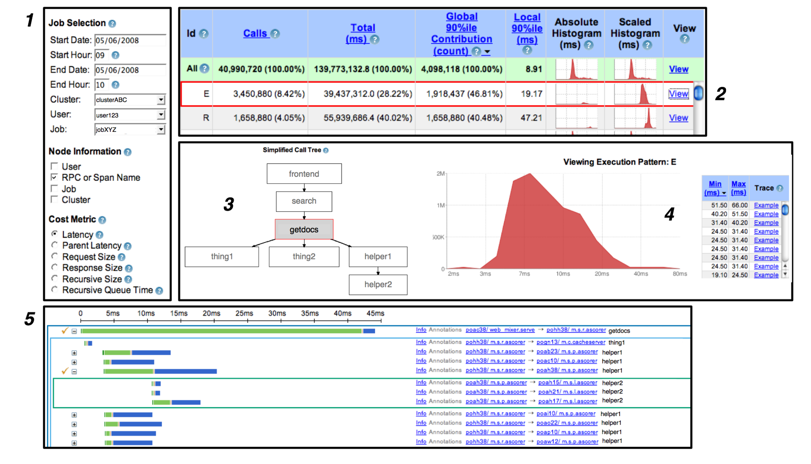
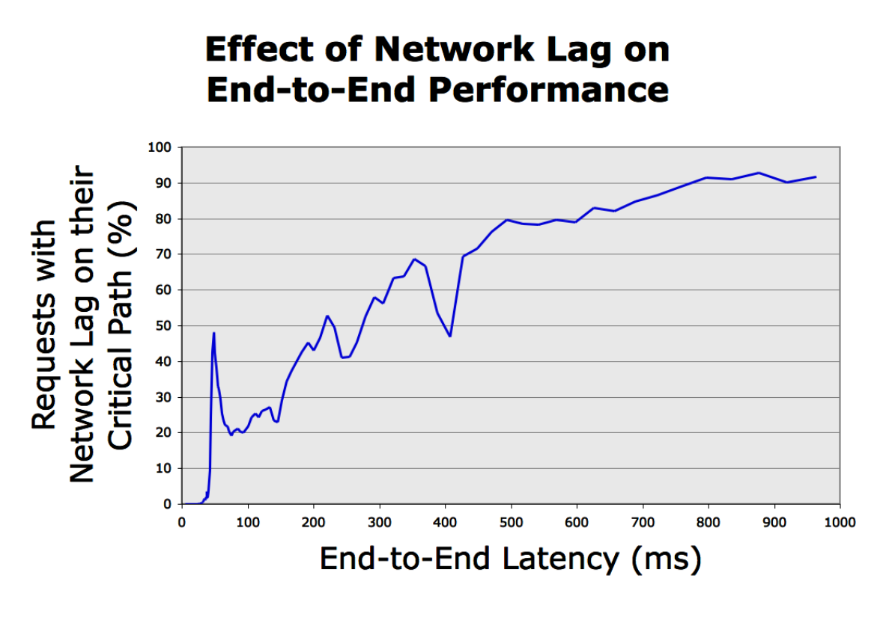

# Dapper: 面向大规模分布式系统的追踪基础设施
## Abstract

现代互联网服务通常都是通过复杂的大规模分布式系统构建的。这些应用往往由许多软件模块共同组成，而这些模块可能分别由不同团队开发，以及使用不同的编程语言实现，并且会部署在多个物理机房、成千上万台机器之上。因此在这样的环境里，能够帮助人们了解系统、分析性能问题的工具，具有非常重要的价值。

本文介绍了 Google 在线上生产环境中使用的分布式系统追踪基础设施—— Dapper，并说明它是如何实现**三项**核心设计目标：低开销、对应用层透明，以及能够在超大规模系统中广泛部署。Dapper 与其他链路追踪系统有不少相似之处，尤其是 Magpie 和 X-Trace。但Dapper在一些关键设计取舍上做出了更适合 Google 运行环境的选择，而这些选择也正是它成功的重要原因。比如，它采用了采样机制，并且将埋点工作尽量限制在少量通用库中，从而有效控制了系统复杂度和接入成本。

本论文的主要目的是总结我们在两年多时间里构建、部署并实际使用 Dapper 的经验。因为衡量 Dapper 是否成功，最重要的标准始终是：它到底能否真正为开发和运维团队带来价值。Dapper 最初只是一个相对独立的追踪工具，但后来逐步演变成了一个监控平台，并在此基础上催生出许多不同的工具，其中有些甚至超出了设计者最初的预期。本文会介绍接种基于 Dapper 构建的分析工具，并分享它在 Google 内部的使用情况和统计数据，展示一些典型的应用场景，并总结我们目前为止得到的经验与教训。

## 1. Introduction
我们开发 Dapper，是为了让 Google 的工程师能够更清楚地了解复杂分布式系统的运行行为。之所以特别关注这类系统，是因为由大量小型服务器组成的集群，对于承载互联网服务负载来说，是一种成本效益很高的方案。但在这样的环境中，要真正理解系统的行为，就必须能够观察许多不同程序、不同机器之间彼此关联的活动。

一个 Web 搜索的例子可以说明这类系统需要面对的挑战。前端的服务器可能会将一次 Web 查询分发到数百台查询服务器上，由每台负责查询服务器在其各自负责的索引分片中进行检索。该查询还可能被发送到其他子系统中，这些子系统可能负责处理广告、进行拼写检查，或者查找专门的结果，例如图片、视频、新闻等。来自所有这些服务的结果会被有选择地组合到最终的结果页面中；我们将这种模型称为“**通用搜索**”。总而言之，处理一次通用搜索查询可能需要动用数千台机器以及许多不同的服务。此外，Web 搜索中用户对延迟非常敏感，而任何一个子系统性能出现问题都会引发延迟问题。只观察整体延迟的工程师或许能够意识到系统存在问题，却很难去判断究竟是哪个服务出了故障，也无法弄清其性能异常的原因。首先，工程师未必能准确知道当前究竟有哪些服务正在被使用；新的服务和模块可能每周都在增加或修改，既是为了加入用户可见的新功能，也是为了改进性能或安全性等其他方面。其次，工程师通常不可能精通每个服务的内部实现；每个服务往往都由不同的团队构建和维护。第三，服务和机器可能同时被许多不同的客户端共享，因此某种性能异常可能实际上是由其他应用程序的行为所导致的。例如，前端系统可能需要处理许多不同类型的请求，而像 Bigtable 这样的存储系统在被多个应用共享时，反而可能达到最高效率。

上述场景使 Dapper 产生了两项根本的需求：**无处不在的部署**，以及**持续监控**。之所以强调普遍部署，是因为如果系统中哪怕只有很小一部分没有被监控，链路追踪基础设施也可能受到严重影响。此外，监控应当始终保持开启状态，因为系统中那些异常的或其他值得关注的行为，往往**很难甚至无法再次复现**。

+ **低开销**：追踪系统对运行中服务的性能影响应当可以忽略不计。在一些经过高度优化的服务中，即便是很小的监控开销也很容易被察觉，并可能迫使部署团队关闭追踪系统。
+ **应用层透明**：程序员不应当需要感知追踪系统的存在。如果一个追踪基础设施必须依赖应用层开发人员的主动配合才能正常运行，那么它会变得极其脆弱，并且常常会由于埋点错误或遗漏而失效，从而违背**普遍部署**这一要求。在像我们这样节奏很快的开发环境中，这一点尤为重要。
+ **可扩展性**：它必须能够支撑 Google 的服务与集群规模，且至少要满足未来几年的扩展需求。

Dapper 的另一个设计目标是：追踪数据在生成之后应当能够被尽快用于分析，理想情况下应控制在一分钟以内。尽管基于数小时前数据运行的链路分析系统仍然具有很高的价值，但刚刚获得的数据能够使系统对生产环境中的异常作出更快速的响应。

真正的应用层透明性（这或许是我们最具挑战性的设计目标）是通过将 Dapper 的核心追踪埋点限制在一小部分广泛存在的线程管理、控制流以及 RPC 库代码中来实现的。正如第4.4节将要介绍的那样，系统之所以能够具备**可扩展性**并**降低性能开销**，得益于**自适应采样技术**的使用。由此形成的系统还包括用于收集追踪数据的代码、用于将其可视化的工具，以及用于分析大规模追踪数据集合的库和 API。尽管仅凭 Dapper 有时就足以帮助开发人员定位性能异常的来源，但它并不是为了取代其他所有工具。我们的实践结果表明，Dapper 的全系统范围数据往往能够将性能排查工作聚焦到特定范围之内，从而使其他工具可以进一步在局部开展分析。

### 1.1 Summary of contributions
关于分布式系统链路追踪工具的设计，已经有了许多篇优秀的论文进行了探索，其中与 Dapper 关系最为密切的是 Pinpoint、Magpie 和 X-Trace。这类系统通常在其发展过程的早期就发表出了文献，而在那个阶段，人们往往还没有机会对一些重要的设计选择进行清晰而充分的评估。由于 Dapper 已经在生产环境中大规模运行了多年，我们认为，本文更合适的关注点应当是：
+ Dapper 的实际部署带给了我们哪些经验
+ 我们的设计决策在实践中取得了怎样的效果
+ 以及它在哪些方面体现出了最大的价值。
我们相关的研究表明，Dapper 不仅本身是一个监控工具，而且还可作为开发性能分析工具的平台；这种平台价值，正是我们发现的少数几个出乎意料的结果之一。

尽管 Dapper 与 Pinpoint、Magpie 等系统在高层设计理念上有许多相似之处，但 Dapper 仍在这一领域提出了许多新的贡献。比如，我们发现，为了实现低开销，**采样机制**是必不可少的，尤其是在那些经过高度优化且对延迟非常敏感的 Web 服务中更是如此。更出人意料的是，我们还发现，即使仅对数千个请求中的一个进行采样，也已经能够为追踪数据的许多常见用途提供足够的信息。

我们系统的另一个重要特征是**对应用层的透明性**。我们的埋点被限制在足够底层的位置，因此即便是像 Google Web 搜索这样的大规模分布式系统，也能够在无需额外标注的情况下实现追踪。尽管由于我们的部署环境具有一定程度的**同构性**，但我们的实践结果表明，要实现这种水平的透明性，需要满足额外的一些充分条件。

图 1

# 2. Distributed Tracing in Dapper
分布式服务中的追踪基础设施，需要记录系统中代表某一给定发起者所执行的全部信息。比如，图 1 展示了一个由5台服务器构成的服务：一个前端（A）、两个中间层（B 和 C），以及两个后端（D 和 E）。当一个用户请求（在这里它就是发起者）到达前端时，前端会向服务器 B 和 C 分别发送两个RPC请求。B 可以立即返回，而 C 在回复 A 之前，还需要后端 D 和 E 完成相应工作；随后，A 再对最初的请求作出响应。对于该请求，一个简单但很有用的分布式追踪可以表示为：对每台服务器上每一条发送和接收的消息，都记录其消息标识符以及带时间戳的事件集合。

为总结这些信息，从而将所有记录条目与某个给定的发起者（例如图 1 中的 RequestX）关联起来，我们在研究中提出了两类方案：**黑盒监测方案**和***基于标注的监测方案**。黑盒方案是基于假定除前文所述的消息记录之外，不存在任何额外信息，并利用统计回归技术来推断这种关联关系。基于标注的方案则依赖应用程序或中间件，显式地为每条记录打上一个全局标识符，以便将这些消息记录回溯并关联到原始请求。尽管黑盒方案比基于标注的方法具有更好的**可移植性**，但由于其**依赖统计推断**，因此为了获得足够的准确性，需要更多的数据。相比之下，基于标注方法的关键缺点显然在于必须对程序进行插桩。在我们的环境中，由于所有应用都采用相同的线程模型、控制流和 RPC 系统，我们发现可以将插桩限制在一小部分公共库中，从而实现一种对应用开发者实际上近乎透明的监测系统。

我们通常将一条 Dapper 追踪视为一棵由嵌套的 RPC 请求构成的树。不过，我们的核心数据模型并不局限于特定的 RPC 框架；对于像 Gmail 中的 SMTP 会话、外部的 HTTP 请求，以及发往 SQL 服务器的出站查询等活动，我们同样会进行追踪。从形式化的角度俩将，我们使用 树（trees）、跨度（spans） 和 标注（annotations） 来对 Dapper 追踪进行建模。

## 2.1 Trace trees and spans
在 Dapper 追踪树中（Trace trees），树的节点是工作的基本单元，我们称之为跨度（span）。边则表示某个 span 与其父 span（parent span） 之间的因果关系。不过，抛开它在更大追踪树中的位置不谈，一个 span 本身也可以看作是一个简单的、带时间戳的记录日志，用于编码该 span 的开始时间与结束时间、任意 RPC 请求时序数据，以及多个应用特定的标注；关于后者，将在第 2.3 节中讨论。

图 2

我们在图 2 中说明了 span 如何构成更大规模的链路追踪系统。为了重建单个分布式追踪中各个 span 之间的因果关系，Dapper 会为每个 span 记录一个便于人理解的 span 名称，以及 span id 和 parent id。没有 parent id 的 span 被称为 根跨度（root span）。与某一特定 trace 相关联的所有 span 还共享同一个 trace id（图中未示出）。所有这些 id 都是概率意义上唯一的 64 位整数。在一个典型的 Dapper 追踪系统中，我们通常预期每个 RPC 对应一个 span，而基础设施中每增加一层，就会为该追踪树增加一层深度。

图 3

图 3 更详细地展示了一个典型的 Dapper 追踪中 span 所记录的事件。这个特定的 span 对应于图 2 中两个 “Helper.Call” RPC 里耗时较长的那个。span 的起始与结束时间，以及所有 RPC 时序信息，都是由 Dapper 的 RPC 库插桩来记录的。若应用的所有者选择使用其自定义标注来增强该追踪（例如图中的 “foo” 标注），那么这些标注也会与 span 的其余数据一并被记录下来。需要特别注意的是，一个 span 可能包括来自多个主机的信息；实际上，每个 RPC span 都同时包含客户端进程和服务端进程的标注，因此跨两台主机的 span 是最非常常见的情况。

## 2.2 Instrumentation points
Dapper 主要依靠对少数几个公共库进行**插桩(instrumentation)**，就能够在应用开发者几乎无需干预的情况下，追踪分布式控制路径：
+ 当某个线程处理一条被追踪的控制路径时，Dapper 会将一个 追踪上下文（trace context） 附加到线程的局部存储（thread-local storage）中。追踪上下文是一个小型且易于复制的容器，其中保存了诸如 trace id 和 span id 之类的 span 属性。
+ 当计算被**延迟执行**或以**异步**方式执行时，大多数 Google 开发者会用一个通用的控制流库来构造回调，并将其调度到线程池或其他执行器中。Dapper 会确保所有此类回调都保存其创建者的追踪上下文，并在被回调时，将该追踪上下文与相应线程关联起来。通过这种方式，用于重建追踪的 Dapper 标识符便能够以透明的方式沿着异步控制路径传播。
+ Google 几乎所有的进程间通信（IPC）都构建在同一个 RPC 框架上。我们对该框架进行了插桩，使其能够围绕所有 RPC 定义 span。对于被追踪的 RPC，span id 和 trace id 会从客户端传递到服务端。对于像 Google 内部这样被广泛使用的基于 RPC 的系统而言，这是一个至关重要的插桩点。随着非 RPC 通信框架的不断演进并逐步形成用户基础，我们也计划对其进行插桩。

Dapper 的追踪数据与编程语言无关，生产环境中的许多追踪都结合了由 C++ 和 Java 编写的进程所产生的数据。我们将在第 3.2 节讨论在实践中能达到什么层次的应用层透明性。

## 2.3 Annotations
上述插桩点已经足以构造出复杂分布式系统的跟踪，从而使 Dapper 的核心功能能够直接服务于原本无需修改的 Google 应用。不过，Dapper 也允许应用开发者为 Dapper 跟踪补充额外的信息，以便监控更高层次的系统行为，或辅助排查问题。我们允许用户通过一个简单的 API 来定义带**时间戳**的标注，其核心接口如图 4 所示。这些标注的内容可以是任意的。为了防止 Dapper 用户因无意中过度记录日志而带来问题，单个 trace span 的标注总量设有一个可配置的上限。无论应用程序的行为如何，应用级标注都不会挤占结构性 span 信息或 RPC 信息。

图 4

除简单的文本标注之外，Dapper 还支持一种键值对标注映射（map of key-value annotations），从而为开发者提供更强的跟踪能力，例如维护计数器、记录二进制消息，以及在进程内部沿着被跟踪请求传递任意用户定义数据。

## 2.4 Sampling
**低开销**是 Dapper 的一个核心设计目标，因为如果一个新工具价值尚未得到证明，却会对性能产生任何显著影响，那么服务运维人员显然不愿意部署它。此外，我们也希望开发者能够在不担心额外开销的前提下使用标注 API。我们还发现，某些类型的 Web 服务确实对插桩开销较为敏感。因此，除了尽可能降低 Dapper 采集过程中的基础插桩开销之外，我们还通过只记录全部跟踪中的一部分来进一步控制开销。关于这种跟踪采样方案，我们将在第 4.4 节中作更详细的讨论。

## 2.5 Trace collection
Dapper 的跟踪日志记录与采集流水线是一个三阶段过程（见图 5）。首先，span 数据会被写入（1）本地日志文件；随后，Dapper 守护进程和采集基础设施会从所有生产主机上将其拉取出来（2）；最后，再将这些数据写入（3）若干区域性 Dapper Bigtable 仓库中的某个单元（cell）。一条 trace 在 Bigtable 中被列为单独的一行，其中每一列对应一个 span。这里，Bigtable 对稀疏表的布局非常有用，因为单条 trace 所包含的 span 数量可以是任意的。trace 数据采集的中位延迟，即也就是数据从经过插桩的应用二进制程序传播到中央仓库所需的时间小于 15 秒。p98 延迟随时间呈现双峰分布：大约在 75% 的时间里，p98 的采集延迟低于 2 分钟；而在其余约 25% 的时间里，该延迟可能增长到数小时。

图 5

Dapper 还提供了一个 API，用于简化对其仓库中跟踪数据的访问。Google 的开发者利用这一 API 构建了通用型分析工具以及应用特定的分析工具。关于该 API 目前为止的使用情况，我们将在第 5.1 节中进行详细讨论。

### 2.5.1 Out-of-band trace collection
如前文所述，Dapper 系统的跟踪日志记录与采集是相对于请求树本身带外（out-of-band）进行的。之所以这样设计，有两个彼此独立的原因。
1. 带内（in-band）采集方案——即将跟踪数据通过 RPC 响应头一并回传，这会影响应用的网络动态特性。在 Google 的许多大型系统中，包含成千上万个 span 的 trace 并不少见。然而，即便是在这类大型分布式跟踪靠近根部的位置，RPC 响应本身仍可能相当小，往往不足 10 KB。在这种情况下，带内传输的 Dapper 跟踪数据会远大于应用数据本身，并使后续分析结果产生偏差。
2. 带内（in-band）采集方案默认假设所有 RPC 都是严格嵌套的。但我们发现，许多中间件系统会在其自身所有后端都尚未返回最终结果之前，就先向调用方返回结果。对于这种非嵌套的分布式执行模式，带内采集系统无法正确处理。

## 2.6 Security and privacy considerations
记录一定量的 RPC 负载信息本可以丰富 Dapper 跟踪信息，因为分析工具或许能够从负载数据中发现某些模式，从而解释性能异常。然而，在一些特殊情况下，负载数据可能包含不应泄露给未经授权的内部用户的信息，其中也包括负责性能调试的工程师。

由于安全与隐私问题，Dapper 会保存 RPC 方法名，但当前不会记录任何负载数据。相反，应用级标注提供了一种便捷的**自愿启用（opt-in）**机制：应用开发者可以选择将其认为对后续分析有用的任意数据与某个 span 关联起来。

Dapper 还带来了一些其设计者事先未曾预料到的安全方面的收益。通过跟踪公开的安全协议参数，Dapper 可用于监测应用是否满足安全策略要求，例如是否采用了合适级别的认证或加密。Dapper 还能够提供相关信息，以确保基于策略的系统隔离确实按预期得到执行；例如，携带敏感数据的应用不会与未经授权的系统组件发生交互。与源代码的审查相比，这种方法能够提供更强的保障。

# 3. Dapper Deployment Status
Dapper 已经作为我们的生产级跟踪系统运行了两年多。在本节中，我们将详述该系统的运行现状，重点说明它是否实现了我们的目标，即广泛部署以及应用层透明性。

## 3.1 Dapper runtime library
Dapper 代码库中也许最关键的部分，是对基础 RPC、线程以及控制流库所进行的插桩。这部分功能包括 span 的创建、采样以及向本地磁盘写日志。除开销要低之外，这些代码还必须保持稳定且健壮，因为它们会被链接到大量应用之中，这也使得维护和缺陷修复变得困难。核心插桩代码在 C++ 中不足 1000 行，在 Java 中不足 800 行。键值对标注功能的实现则额外增加了约 500 行代码。

## 3.2 Production coverage
Dapper 的覆盖程度可以从两个维度来衡量：
1. 生产环境中能够生成 Dapper 跟踪的进程所占比例（即链接了经过 Dapper 插桩的运行时库的进程）；
2. 运行 Dapper 跟踪采集守护进程的生产机器所占比例。
Dapper 的守护进程是我们基础机器镜像的一部分，因此几乎部署在 Google 的每一台服务器上。至于具备 Dapper 能力的进程所占的精确比例，则较难确定，因为那些不生成任何跟踪信息的进程对 Dapper 来说是不可见的。不过，鉴于经过 Dapper 插桩的库已经非常普遍，我们估计几乎所有 Google 的生产进程都支持跟踪。

在某些情况下，Dapper 无法正确跟踪控制路径。这通常源于使用了非标准的控制流原语，或者 Dapper 错误地将因果关系归因于彼此无关的事件。作为一种变通方案，Dapper 提供了一个简单的库，用于帮助开发者手动控制跟踪传播。目前，有 40 个 C++ 应用和 33 个 Java 应用需要进行一定程度的手动跟踪传播；相较于总量达到数千的应用而言，这只占很小一部分。另有极少数程序使用了未经插桩的通信库（例如原始 TCP 套接字或 SOAP RPC），因此不支持 Dapper 跟踪。如果确有必要，也可以为这些应用补充 Dapper 支持。

作为一种生产环境下的安全措施，Dapper 跟踪是可以被关闭的。事实上，在其早期阶段，在我们尚未对其稳定性和低开销建立充分信心之前，Dapper 默认就是关闭的。Dapper 团队会不定期审查那些由服务负责人将跟踪关闭的配置变更。这类变更非常少见，通常源于对监控开销的担忧。迄今为止，所有此类变更在经过进一步调查并对实际开销进行测量后，都已被撤销，因为实际开销微乎其微。

## 3.3 Use of trace annotations
程序员往往将应用特定的标注用作一种分布式调试日志，或者用于依据某些应用特定特征对 trace 进行分类。举例来说，所有 Bigtable 请求都会标注其所访问的表名。当前，70% 的 Dapper span 和 90% 的 Dapper trace 至少包含一个应用定义的标注。

已有 41 个 Java 应用和 68 个 C++ 应用添加了自定义应用标注，以便更好地理解其服务内部 span 内部的活动。值得注意的是，到目前为止，采用标注 API 的 Java 开发者在每个 span 上添加的标注数量，C++ 开发者更多。这可能是因为我们的 Java 工作负载通常更接近终端用户；这类应用往往需要处理更为多样的请求组合，因此其控制路径也相对更复杂。

# 4. Managing Tracing Overhead
一个跟踪系统的代价主要体现在两个方面:
1. 由于跟踪生成与采集开销而给被监控系统带来的性能下降。
2. 为存储和分析跟踪数据所需消耗的资源。

尽管可以认为，一个有价值的跟踪基础设施即便以性能损耗为代价也是值得的，但我们认为，如果能够证明其基线开销几乎可以忽略不计，那么系统在初始阶段的推广采用将会容易得多。

本节将介绍 Dapper 主要插桩操作的开销、跟踪采集的开销，以及 Dapper 对生产工作负载的影响。我们还将说明 Dapper 的自适应跟踪采样机制如何帮助我们在低开销需求与获得有价值的跟踪之间取得平衡。

## 4.1 Trace generation overhead
跟踪生成开销是 Dapper 性能开销中最关键的部分，因为在紧急情况下，采集与分析功能更容易被关闭。Dapper 运行时库中，跟踪生成开销最主要的来源包括：创建和销毁 span 与标注，以及将其记录到本地磁盘以供后续采集。根 span 的创建与销毁平均耗时为 204 纳秒，而对非根 span 执行相同操作的平均耗时为 176 纳秒。二者之间的差异，来自于为根 span 分配全局唯一 trace id 所增加的额外成本。

如果某个 span 未被采样用于跟踪，那么额外添加 span 标注的成本几乎可以忽略不计，其开销仅包括在 Dapper 运行时中进行一次线程局部查找，平均约为 9 纳秒。如果该 span 被采样，那么为 trace 添加一个字符串字面量形式的标注平均开销为 40 纳秒(与图 4 所示的方式基本相同)。上述测量是在一台 2.2GHz 的 x86 服务器上完成的。

写入本地磁盘是 Dapper 运行时库中代价最高的操作，但其可见开销被大幅降低了，因为每次磁盘写入都会合并多次日志文件写操作，并且相对于被跟踪应用是异步执行的。尽管如此，日志写入活动仍可能对高吞吐应用的性能产生可感知的影响，尤其是在所有请求都被跟踪的情况下。我们将在第 4.3 节中以一个 Web 搜索工作负载为例，对这种开销进行量化分析。

表 1

表 2

## 4.2 Trace collection overhead
读取本地跟踪数据同样可能干扰被监控的前台工作负载。表 1 给出了在一种不切实际地沉重的负载测试基准下，Dapper 守护进程 CPU 使用率的最坏情况。即便在采集过程中，该守护进程占用的生产机器单核 CPU 也从不超过 0.3%，其内存占用也非常小（小到基本落在堆碎片噪声范围之内）。此外，我们还将 Dapper 守护进程在内核调度器中的优先级设为尽可能低，以便在高负载主机上发生 CPU 竞争时，将影响降到最低。

Dapper 对网络资源的消耗也很轻：在我们的仓库中，每个 span 平均仅对应 426 字节的数据。若将其放在被监控应用整体网络活动中，Dapper 跟踪数据采集在 Google 生产环境中的网络流量占比不足 0.01%。

## 4.3 Effect on production workloads
对每个请求都会动用大量机器的高吞吐在线服务，是最难实现高效跟踪的一类系统：这类服务往往会生成规模最大的跟踪数据，同时又对性能干扰最为敏感。在表 2 中，我们以 Web 搜索集群作为这类服务的一个示例；通过改变被采样 trace 的比例，我们测量了 Dapper 对平均延迟和吞吐量的性能影响。

我们看到，尽管对吞吐量的影响并不十分显著，但为了避免可察觉的延迟劣化，进行 trace 采样确实是必要的。不过，当采样频率低于 1/16 时，与之相关的延迟和吞吐量损失都落在实验误差范围之内。在实践中，我们发现，对于高流量服务，即使采样率低至 1/1024，仍然能够获得足够数量的跟踪数据。将 Dapper 的基线开销保持在极低水平非常重要，因为这帮助应用充分使用标注 API 的全部能力而无需担心性能损失。较低的采样频率还有一个额外好处，它使数据在主机本地磁盘上被垃圾回收之前能够保留更长时间，从而为采集基础设施提供更大的灵活性。

## 4.4 Adaptive sampling
分配给任一给定进程的 Dapper 开销，与该进程单位时间内采样到的 trace 数量成正比。Dapper 的第一个生产版本对 Google 内所有进程都采用统一的采样概率，平均每 1024 个候选请求中采样 1 个 trace。对于我们的高吞吐在线服务而言，这种简单方案是有效的，因为绝大多数感兴趣事件仍然有足够高的出现频率，因此能够被捕获到。

然而，对于流量较低的工作负载，这样低的采样率可能会遗漏重要事件；与此同时，这类系统往往能够在可接受的性能开销下容忍更高的采样率。针对这类系统，一种解决办法是覆盖默认采样率，但这就需要进行某种人工干预，而这恰恰是我们在 Dapper 中试图避免的。

我们正在部署一种自适应采样方案。该方案不再是统一的采样概率，而是单位时间内期望采样到的 trace 数量。这样一来，低流量工作负载会自动提高其采样率，而超高流量工作负载则会相应降低采样率，从而使开销保持在可控范围内。实际采用的采样概率会与 trace 本身一同记录下来；这有助于围绕 Dapper 数据构建的分析工具准确统计 trace 的出现频率。

## 4.5 Coping with aggressive sampling
新接触 Dapper 的用户常常会担心，较低的采样概率(对于高流量服务，这个值往往低至0.01%)是否会干扰他们的分析。我们在 Google 的经验可以相信，对于高吞吐服务而言，这种较为激进的采样并不会妨碍大多数关键分析。如果某种值得关注的执行模式在这类系统中出现一次，它往往会再出现成千上万次。而对于请求量较低的服务（例如每秒只有几十次请求，而不是每秒数以万计），则完全可以承担对每个请求都进行跟踪。这正是我们决定转向**自适应采样**的原因。

## 4.6 Additional sampling during collection
上述采样机制的设计目标，是将集成了 Dapper 运行时库的应用中可感知的开销降到最低。不过，Dapper 团队还需要控制写入中央仓库的数据总量，因此我们为此又引入了第二轮采样。

目前，我们的生产集群每天会生成超过1 TB的采样跟踪数据。Dapper 用户希望这些跟踪数据在最初从生产进程记录下来之后，至少还能保留两周。因此，提高跟踪数据密度所带来的收益，必须与 Dapper 仓库所需机器和磁盘存储成本进行权衡。此外，对较高比例的请求进行采样，还会使 Dapper 采集器在写入吞吐量上接近 Dapper Bigtable 仓库的上限。

为了在实际资源需求和 Bigtable 累计写入吞吐量这两方面都保持足够的灵活性，我们在采集系统中加入了额外采样的支持。对于某一给定 trace，其所有 span（尽管它们可能分布在成千上万台不同的主机上）都共享同一个 trace id。因此，我们可以通过对 trace id 进行采样来控制跟踪数据的总量。对于采集系统中看到的每个 span，我们都会将其对应的 trace id 哈希为一个标量 𝑧，其中 0 ≤ 𝑧 ≤ 1。如果 𝑧 小于我们的采集采样系数，就保留该 span 并将其写入 Bigtable；否则便将其丢弃。由于采样决策依赖于 trace id，我们采样或丢弃的是整条 trace，而不是 trace 中的单个 span。我们发现，这一额外的配置参数使得采集流水线的管理简单了许多，因为只需修改配置文件中的一个参数，我们就能方便地调节全局写入速率。

如果整个跟踪与采集系统只使用一个采样参数，系统会更简单。但要在所有已部署的二进制程序中快速调整运行时采样配置并不可行。我们选择的运行时采样率会产生略多于仓库可写入量的数据，而后通过采集系统中的二级采样系数来限制这一写入速率。这样一来，Dapper 流水线的维护会更加容易，因为我们只需对二级采样配置做一次修改，就能够立即提高或降低全局覆盖率和写入速率。

# 5. General-Purpose Dapper Tools
几年前，当 Dapper 还只是一个原型系统时，只有在 Dapper 开发人员耐心协助下，它才能被使用。此后，我们逐步构建起采集基础设施、编程接口以及一个交互式的 Web 用户界面，以帮助 Dapper 用户独立解决问题。在本节中，我们将总结哪些方法是有效的，哪些方法并不奏效，并介绍这些通用分析工具的基本使用情况。

## 5.1 The Dapper Depot API
Dapper 的“Depot API”，即 DAPI，提供了对区域性 Dapper 仓库（或称 “Depots”）中分布式跟踪记录的直接访问能力。DAPI 与 Dapper 跟踪仓库是协同设计的，其目标是为这些 Dapper 仓库中包含的原始数据提供一个简洁、直观的访问接口。根据我们的使用场景，需要以下三种访问跟踪数据的方式：
+ **按 trace id 访问：** 给定某条 trace 的全局唯一 trace id，DAPI 就可以按需加载该 trace。
+ **批量访问：** DAPI 可以借助 MapReduce 并行访问数十亿条 Dapper trace。用户只需重写一个虚函数，该函数仅接受一条 Dapper trace 作为参数；随后，框架会在用户指定的时间窗口内，对每一条已采集的 trace 调用一次该函数。
+ **索引访问：** Dapper 仓库支持一个单一索引，该索引是依据我们常见的访问模式选定的。这个索引将常被查询的 trace 特征（如下文所述）映射到不同的 Dapper trace。由于 trace id 是以伪随机方式分配的，因此，要快速访问与特定服务或特定主机相关联的 trace，这种方式是最优选择。

这三种访问模式都会将用户引导到彼此不同的 Dapper 跟踪记录。如第 2.1 节前文所述，Dapper trace 被建模为由多个 trace span 构成的树，因此，Trace 数据结构本质上就是一棵由各个 Span 结构组成、可遍历的简单树。span 通常对应于 RPC 调用.在这种情况下，可以获得 RPC 的时序信息。带时间戳的应用标注也可以通过 span 结构访问。

为 DAPI 选择合适的自定义索引，是设计中最具挑战性的部分。一个指向 trace 数据的索引，其压缩后存储开销仅比实际 trace 数据本身少 26%，因此成本相当可观。最初，我们部署了两个索引。一个针对主机机器，另一个针对服务名。然而，我们发现基于机器的索引并没有获得足够多的应用，无法证明其存储成本是合理的。用户在关心单台机器时，通常也会同时关心某个具体服务，因此我们最终将两者合并为一个复合索引，使其能够按照服务名、主机机器和时间戳这一顺序进行高效查找。

### 5.1.1 DAPI usage within Google
在 Google 内部，DAPI 的使用大致可以分为三类。一类是持续运行、使用 DAPI 的在线 Web 应用；一类是维护良好的、可按需通过命令行运行的 DAPI 分析工具；还有一类是一次性的分析工具，这类工具被编写、运行之后，往往很快就被遗忘。据我们所知，目前有 3 个持续性的基于 DAPI 的应用、8 个额外的按需 DAPI 分析工具，以及大约 15 到 20 个基于 DAPI 框架构建的一次性分析工具。最后这一类工具很难被准确统计，因为开发者可以在 Dapper 团队并不知情的情况下构建、运行并弃用这些项目。

## 5.2 The Dapper user interface 
大多数 Dapper 的使用场景都发生在其交互式、基于 Web 的用户界面中。由于篇幅所限，我们无法在此展示其中的全部功能，但图 6 给出了一个典型的用户工作流程。
1. 用户首先描述其感兴趣的服务及时间窗口，并提供用于区分不同追踪模式所需的信息（在此例中为 span 名称）。此外，用户还需要指定一个与其分析任务最相关的代价度量指标（在本例中为服务延迟）。
2. 随后，系统会展示一个大型表格，其中汇总了与给定服务相关的所有分布式执行模式的性能摘要。用户可以按照自己的需要对这些执行模式进行排序，并选择其中之一以查看更为详细的信息。
3. 当选定某一个分布式执行模式后，系统会以图形化方式呈现该执行模式。被分析的服务会在图的中心位置高亮显示。
4. 在按照步骤 1 所选代价度量将其取值空间划分为若干桶之后，Dapper 界面会在该度量空间上给出一个简单的频率直方图。由此可见，在该示例中，所选执行模式的延迟近似服从对数正态分布。界面同时列出了许多具体的示例追踪，分别对应直方图中的不同区间。在本例中，用户点击第二个示例追踪，随后进入 Dapper 的追踪检查视图。
5. 许多甚至大多数 Dapper 用户，最终都会查看具体的追踪记录，以期从中分析系统行为的根本原因。受篇幅限制，这里无法完整展示追踪视图的细节；不过，其核心特征包括位于顶部的全局时间线，以及对各子树进行交互式展开与折叠的能力。分布式追踪树的各层级以嵌套彩色矩形的形式呈现。对于每个 RPC span，系统还会进一步区分其在服务器进程内部消耗的时间（绿色）与在网络上传输所消耗的时间（蓝色）。尽管该截图中未显示用户注释，但这些注释可以按 span 选择性地加入到全局时间线中。

图 8

对于需要实时数据的用户，Dapper 界面能够直接与部署在各生产机器上的 Dapper 守护进程进行通信。在该模式下，用户虽然无法查看前文的系统级图形，但仍可依据延迟或网络特征方便地筛选和定位具体追踪。此时，数据通常可在接近实时后的数秒内获得。

根据日志统计，在典型工作日里，约有 200 名 Google 工程师使用 Dapper 界面；按整周计，独立用户总数约为 750 至 1000 人。除内部新功能发布带来的波动外，这些数字在不同月份之间总体保持稳定。用户还经常分享指向特定关注追踪的链接，这往往会在追踪检查器中带来大量一次性的、短时突发访问流量。

# 6. Experiences
Dapper 在 Google 内部被广泛采用，其使用方式既包括通过 Dapper 用户界面进行直接访问，也包括借助编程 API 及其上层应用进行间接调用。本节不打算列举 Dapper 的全部已知应用场景，而是希望通过概括 Dapper 使用方式的“基向量”，来说明哪些类型的应用实践最为成功。

## 6.1 Using Dapper during development
Google AdWords 系统围绕一个大规模数据库构建，该数据库保存了关键词定向条件及其对应的文本广告。当有新的关键词或广告被添加或修改时，需要对其是否符合服务策略要求（如是否含有不当语言）进行检查，而自动化审核系统提升了这一流程的执行效率。

在 Ads Review 团队对其中一项服务进行自底向上重构时，团队从系统原型设计、上线到后续维护的整个过程中，持续迭代地使用了 Dapper。Dapper 在以下几个方面帮助他们改进了服务：

+ **性能：** 开发人员利用 Dapper 持续跟踪系统距离请求延迟目标的改进进度，并据此发现较易落地的优化点。Dapper 还帮助团队识别出关键路径上若干非必要的串行请求；这些请求往往来自开发人员并未直接编写的子系统。基于这些发现，团队随后对相关问题进行了修复。
+ **正确性：** Ads Review 服务依赖于一个大型数据库系统，该系统同时提供只读副本（访问代价较低）和读写主库（访问代价较高）。借助 Dapper，团队发现了多种查询本可访问副本却被不必要地路由到主库的情况。如今，系统已经能够对直接访问主库的场景进行有效约束与说明，并据此保障关键系统不变式。
+ **理解：** Ads Review 的查询会扇出到多类系统，包括 BigTable、前文提到的数据库、多维索引服务，以及其他多种以 C++ 和 Java 实现的后端服务。团队利用 Dapper 追踪对查询的总体代价进行评估，并据此推动相关操作的重新设计，以尽量减少对各依赖系统造成的负载。
+ **测试：** 新代码在发布前需要经过基于 Dapper 追踪的质量保证流程，以验证系统行为与性能是否符合预期。借助这一流程，团队发现了多个问题，这些问题既出现在 Ads Review 自身代码中，也出现在其依赖的支撑库中。

Ads Review 团队广泛使用了 Dapper 的注解 API。借助开源 AOP 框架 Guice，团队将关键软件组件标注为“@Traced”。与此同时，追踪中还补充记录了重要子程序输入输出规模、状态消息以及其他调试信息，而这些信息在传统做法下通常会被写入日志文件。

当然，Dapper 对 Ads Review 团队而言也存在一定局限。例如，团队希望能够以交互式方式检索全部追踪注解，但目前仍需借助定制的 MapReduce 作业，或通过人工方式逐条检查追踪记录。与此同时，Google 内部还存在其他用于收集和集中化管理通用调试日志信息的系统，而要将这些系统中的海量数据与 Dapper 存储库有效整合，并不是一件容易的事情。

尽管如此，Ads Review 团队总体估计，借助从 Dapper 追踪平台获得的数据，其系统延迟指标已经实现了两个数量级的改善。

### 6.1.1 Integration with exception monitoring
Google 维护了一项持续收集并集中化管理运行中进程异常报告的服务。当这些异常发生于某个已采样的 Dapper 追踪上下文中时，对应的 trace ID 与 span ID 会作为元数据一并写入异常报告。异常监控服务的前端随后提供从具体异常报告跳转至其对应分布式追踪的链接。Ads Review 团队借助这一能力，得以从更大范围的环境中理解异常监控服务所识别出的缺陷。由于 Dapper 平台导出的接口建立在简单唯一标识符之上，因此它也能够较为方便地与其他事件监控系统集成。

## 6.2 Addressing long tail latency
由于系统内部存在大量相互关联的组件，同时代码库与部署环境的规模和复杂度都非常高，因此，像通用搜索（第 1 节已介绍）这类服务的调试工作极具挑战性。这里我们介绍了为削弱通用搜索延迟分布长尾现象所开展的一系列工作。Dapper 能够帮助验证有关端到端延迟的各种假设，尤其是关于通用搜索请求关键路径的判断。当一个系统不仅涉及数十个子系统，还横跨数十个工程团队时，即使是最优秀、最有经验的工程师，也会经常误判端到端性能下降的根本原因。在这种情形下，Dapper 能够提供十分关键的事实依据，并对许多重要的性能问题作出有决定性的回答。

图 9

一位从事长尾延迟调试的工程师开发了一个小型库，用于从 DAPI Trace 对象中推断层次化关键路径。随后，团队利用这些关键路径结构进行问题诊断，并为通用搜索中潜在的性能优化措施设定优先级。基于 Dapper 的这项工作带来了如下发现：
+ 关键路径上的瞬时网络性能退化虽然不会影响系统吞吐量，但可能对尾部延迟产生显著影响。如图 7 所示，大多数较慢的 Universal Search 追踪在其关键路径上都经历了网络性能退化。
+ 系统中存在许多有问题且代价高昂的查询模式，它们源于服务之间非预期的交互。这些问题在被识别后通常较容易修复，但在 Dapper 出现之前，问题识别本身却相当困难。
+ 团队首先从 Dapper 之外的安全日志仓库中提取常见查询，再利用 Dapper 的唯一 trace ID 将其与 Dapper 存储库相关联。基于这一映射关系，团队得以构建示例查询列表，用于定位通用搜索内部各个子系统中的慢查询。

## 6.3 Inferring service dependencies
在任意时刻，Google 的一个典型计算集群通常都会承载数千个逻辑“作业”，即一组执行共同功能的进程。Google 自然维护着大量此类集群，而实际情况表明，一个集群中的作业往往还会依赖于其他集群中的作业。由于作业之间的依赖关系会动态变化，因此仅依赖配置信息并不足以推断全部服务间依赖。然而，公司内部的诸多流程仍然需要准确的服务依赖信息，以支持瓶颈识别、服务迁移规划等工作。为此，Google 名为“Service Dependencies”的项目利用追踪注解以及 DAPI MapReduce 接口，尝试实现服务依赖关系判定的自动化。

通过结合 Dapper 的核心埋点能力与追踪注解，服务依赖项目不仅能够推断各个作业之间的依赖关系，还能够识别这些作业对共享软件基础设施的依赖。例如，所有 Bigtable 操作都会标注其所作用的数据表名称。借助 Dapper 平台，服务依赖团队因而能够在不同服务粒度下，自动推断对具名资源的依赖关系。

## 6.4 Network usage different services
Google 在其网络基础设施上投入了大量的人力和物力资源。因而，网络运维人员长期以来一直能够访问来自各类独立硬件设备的监控信息，并构建了定制化工具与仪表板，以获得全球网络利用率的全局视图。虽然他们对广域网整体运行状况已具备较好的可观测性，但在出现问题时，仍缺乏能够将网络负载准确归因到具体应用层责任源的有效工具。

尽管 Dapper 并非为链路级监控而设计，但实践表明，它非常适合用于分析集群间网络活动在应用层面的行为。Google 借助 Dapper 平台构建了一个持续更新的控制台，用于展示集群间网络流量中最活跃的应用层端点。更进一步地，依托 Dapper，团队不仅能够观察两台对等机器之间的通信情况，还能够追溯这些高开销网络请求背后的因果追踪根源。值得注意的是，这一仪表板基于 Dapper API 开发完成，整体耗时不足两周。
