# An Open-Source Benchmark Suite for Cloud and IoT Microservices

## Abstract 

近年来，云服务正经历着一场重大的范式变革：从传统的**单体应用（monolithic applications）转向由数百个松耦合微服务（loosely-coupled microservices）构成的复杂图拓扑结构**。微服务从根本上颠覆了现有云系统设计的诸多核心假设。在**优化服务质量（QoS）与资源利用率**时，这种架构既带来了全新的机遇，也引入了严峻的挑战。

本文深入探讨了微服务对整个云系统技术栈所带来的深刻影响。首先，我们推出了 **DeathStarBench**，一个新颖且开源的微服务基准测试套件。该套件具有高度的模块化和可扩展性，能够真实代表大规模端到端服务的运行特征。DeathStarBench 涵盖了多种典型应用场景，包括社交网络、媒体服务、电子商务网站、银行系统，以及用于无人机群（UAV swarms）协同控制的物联网（IoT）应用。随后，我们利用 DeathStarBench 详细研究了微服务的架构特性，分析了其在网络通信与操作系统层面的影响、在集群管理方面面临的挑战，以及在应用设计与编程框架之间的权衡取舍。最后，我们探讨了微服务在数百用户规模的实际部署环境中所产生的**大规模长尾效应（tail at scale effects）**，并重点强调了微服务架构对性能可预测性（performance predictability）带来的巨大压力。

## Introduction

大规模数据中心承载着日益增多的流行在线云服务，这些服务已广泛渗透到人类社会活动的方方面面。其中，许多应用属于**交互式且延迟敏感型（latency-critical）服务，它们不仅必须满足严苛的性能指标（如吞吐量和尾延迟**）以及可用性约束，同时还需应对频繁的软件更新。

为了平衡这些往往相互冲突的需求，数据中心应用正处于一场重大设计变革的边缘：即从复杂的**单体服务（monolithic services）**（即将整个应用功能封装在单个二进制文件中）转向由数十甚至上百个功能单一、松耦合（loosely-coupled）的微服务所构成的图拓扑结构。这种转型在大型云服务提供商中已愈发普遍，Amazon、Twitter、Netflix、Apple 以及 EBay 等行业巨头均已采纳了微服务应用模型。例如，截至 2016 年底，Netflix 报告其生态系统中运行的独立微服务数量已超过 200 个。

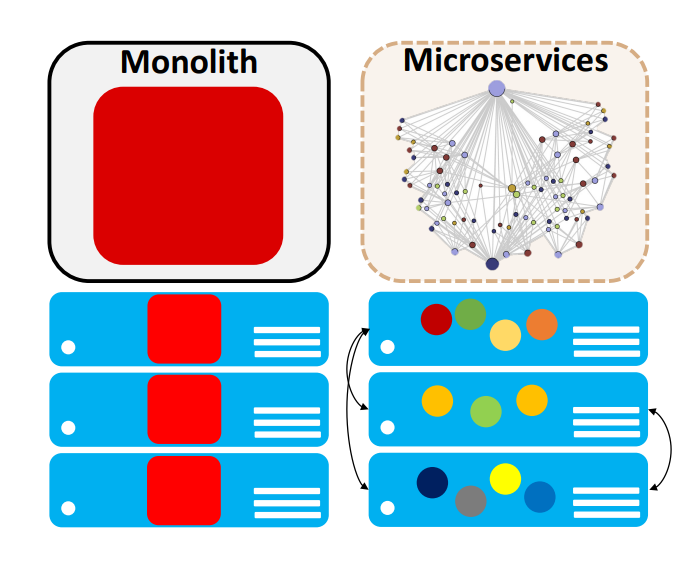

图 1：Differences in the deployment of monoliths and microservices

微服务架构之所以日益普及，主要归因于以下几个核心优势。

+ 首先，微服务推动了**可组合式（composable）软件设计**，由于每个微服务仅负责应用功能的一个特定子集，这极大地简化并加速了开发进程。随着云服务功能日趋丰富，微服务的模块化设计在应对系统复杂性方面的优势愈发凸显。
+ 此外，它支持单个微服务的独立部署、扩缩容及更新，不仅规避了冗长的开发周期，还显著提升了系统的**弹性（elasticity）**。

图 1 展示了传统单体服务与微服务应用在部署模式上的差异。传统的单体应用在扩展时必须进行整体的**水平扩展（scaled out）**。相比之下，微服务架构允许端到端应用中的各个组件根据需求进行独立的弹性扩缩容。通过这种方式，资源互补的微服务可以实现**装箱（bin-packed）**，共同运行在同一台物理服务器上，从而优化资源利用率。

尽管云服务的模块化设计理念在**面向服务架构（SOA）**中早已有之，但微服务更细的粒度（granularity）及其独立部署的特性，在硬件与软件层面引入了与传统 SOA 负载截然不同的新挑战。

其次，微服务架构支持编程语言与框架的异构性。系统的各个层级均可采用最适宜的语言进行开发，微服务之间仅需借助统一的 API（通常基于远程过程调用（RPC）或 RESTful API）即可实现互通通信。相比之下，*单体架构*（Monoliths）不仅限制了开发语言的选择，还使得频繁的系统更新变得繁琐且极易出错。  

最后，微服务架构简化了系统正确性与性能的调试工作。其原因在于，系统故障（Bug）可以被隔离并定位在特定的层级。相比之下，在单体架构中修复故障往往需要对整个服务进行排查。这一特性使得微服务格外适用于物联网（IoT）应用场景。由于物联网应用通常承载着关键任务型计算（Mission-critical computation），从而对系统正确性的验证提出了更高的要求。

尽管微服务架构具备诸多优势，但它与传统的云服务设计方式存在显著差异，并对从云管理、编程框架到操作系统，乃至数据中心硬件设计的各个层面产生了广泛而深远的影响。

在本文中，我们借助一套全新的、具备代表性的端到端应用程序（每款应用均由数十个微服务构建而成），深入探讨了微服务对整个云系统栈（从底层硬件一直到上层应用设计）所带来的影响。我们的 DeathStarBench 测试套件包含六个端到端服务，广泛覆盖了当前主流的云服务与边缘计算场景，具体包括：社交网络、媒体服务（涵盖电影影评、租赁与流媒体）、电子商务网站、安全的银行系统，以及 Swarm，一个用于无人机集群协同控制的物联网（IoT）服务（提供带云端后端与无云端后端两种模式）。

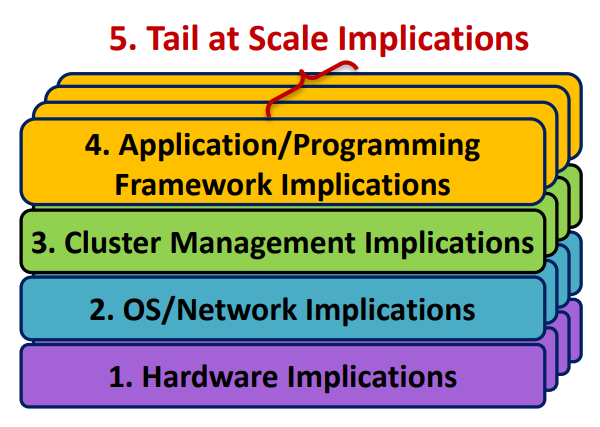

图 2： Exploring the implications of microservices across thesystem stack.

每一项服务均包含数十个采用不同编程语言与编程模型（包括 Node.js、Python、C/C++、Java、JavaScript、Scala 和 Go）编写的微服务，并集成了诸如 NGINX、Memcached、MongoDB、Cylon 以及 Xapian 等开源应用。为了构建这些端到端服务，我们利用 Apache Thrift 和 gRPC 等主流开源框架，开发了定制化的 RPC 与 RESTful API。最后，为了追踪用户请求在各个微服务间的流转过程，我们研发了一套轻量级且对用户透明的分布式追踪系统。该系统类似于 Dapper 和 Zipkin，能够以 RPC 为粒度对请求进行追踪，将归属于同一个端到端请求的所有 RPC 调用关联起来，并将追踪链路记录在集中式数据库中。我们的研究同时考察了由服务真实用户产生的实际流量，以及由开环工作负载生成器（Open-loop workload generators）产生的合成负载。

如图 2 所示，我们借助这些服务，深入研究了微服务对整个系统栈所产生的影响。

+ 首先，我们量化评估了当前*数据中心架构*在运行微服务时的实际效能，并探讨了为更好地满足微服务的性能与资源需求，数据中心硬件应如何演进（详见第 4 节）。具体的研究工作包括：分析现代服务器的 CPU 周期分布，评估采用大核（Big cores）还是小核（Small cores）更为适宜，测定微服务对指令缓存造成的压力，以及探索微服务在硬件加速领域的潜力。我们的研究结果表明，尽管单个微服务承载的计算量较小，但各个独立层级对延迟的要求却比传统应用更为苛刻。这进而对处理器提供稳定且可预测的高单线程性能提出了更高的要求。

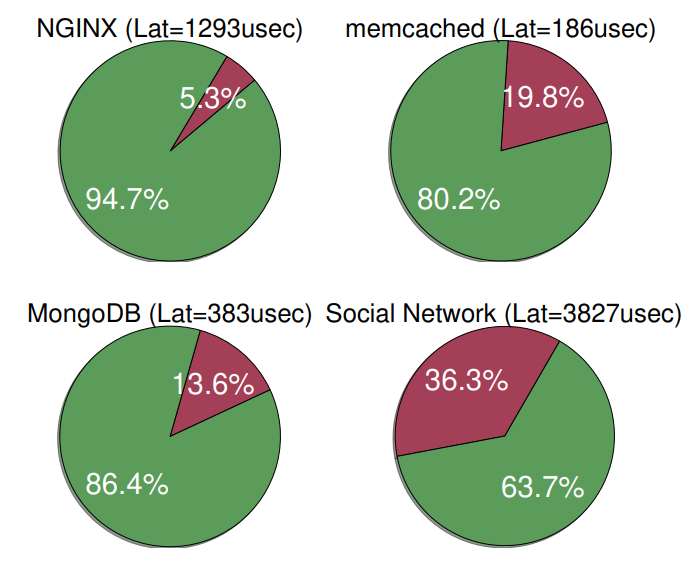

图 3：Network (red) vs. application processing (green) for monoliths and microservices.

+ 其次，我们量化评估了微服务在*网络与操作系统*层面所产生的影响。具体而言，我们的研究表明，与传统的云应用程序类似，微服务有很大一部分时间消耗在内核态。然而，与单体服务不同的是，微服务在通过 RPC 或其他 REST API 发送与处理网络请求上，消耗了大量额外的时间。图 3 展示了三款单体服务（NGINX、Memcached、MongoDB）以及端到端社交网络（Social Network）应用在网络处理（红色部分）与应用处理（绿色部分）上的执行时间分布。对于单层服务而言，仅有极少部分时间用于网络处理。但在采用微服务架构时，该部分时间骤增至总执行时间的 36.3%，从而导致系统的资源瓶颈发生剧烈转变。在第 5 节中，我们证明了将 RPC 处理卸载至与宿主服务器紧密耦合的 FPGA 上，可将网络性能提升 10 至 60 倍。  

+ 第三，微服务极大地增加了*集群管理*的复杂性。尽管集群管理器能够按需对单个微服务进行横向扩容（而非像扩展整个单体应用那样），但微服务之间的依赖关系会引发**背压效应**（Back-pressure effects）与级联的服务质量（QoS）违规。这些问题会迅速在整个系统中蔓延，致使系统性能变得不可预测。现有的那些以优化性能和/或资源利用率为目标的集群管理器，缺乏足够的表达能力去充分考量两两之间的微服务依赖对端到端性能所造成的影响。在第 6 节中，我们证明了即使仅对其中一项依赖关系处理不当，也会导致尾延迟（Tail latency）急剧恶化（例如，在社交网络应用中尾延迟增加了 10.4 倍），并且与相应的单体服务相比，系统需要经历更长的恢复期。我们的研究还表明，许多云基础设施中普遍采用的传统自动弹性伸缩（Autoscaling）机制，难以解决由微服务间依赖关系所引发的 QoS 违规问题。  
+ 第四，在第 7 节中，我们定位了在端到端服务关键路径上引发性能瓶颈的微服务，量化评估了 RPC 与 RESTful API 之间的性能权衡（Trade-offs），并深入探讨了在*无服务器*（Serverless）编程框架上运行微服务对系统性能与成本所产生的影响。
+ 最后，鉴于云环境中的性能问题往往只有在系统达到一定规模时才会显现，我们在第 8 节中借助涉及数百名用户的真实应用部署论证了如下观点：相较于单体应用，微服务架构中的“大规模长尾效应”（Tail-at-scale effects）更为显著。这是因为，哪怕仅仅是单一微服务配置不当，或是某台服务器响应迟缓，都足以导致系统的端到端延迟恶化数个数量级。

随着微服务架构的不断演进，数据中心硬件、操作系统与网络系统、集群管理器以及编程框架也必须与之协同演进。唯有如此，才能确保微服务的广泛应用不会以牺牲系统性能和/或效率为代价。目前，DeathStarBench 已被多家学术机构与业界企业投入使用，其应用领域涵盖了无服务器计算、硬件加速以及运行时管理。我们期望，通过将其向更广泛的群体开源，能够进一步推动并激发这一新兴领域内的相关研究。  

## 2. Related Work

在过去十年中，云应用引发了学术界与工业界的广泛关注，双方均发布了数款基准测试套件。例如，CloudSuite 包含了批处理（Batch）与交互式（Interactive）两种服务类型（如 Memcached），并已被广泛用于研究云基准测试对微体系结构所产生的影响。与此类似，TailBench 汇集了一系列交互式基准测试，涵盖了从 Web 服务器、数据库到语音识别及机器翻译系统的多种场景，并提出了一种全新的性能分析方法学。此外，Sirius 专注于智能个人助理的工作负载（如语音转文字），被用于探索交互式机器学习（ML）应用的硬件加速潜力。

然而，这些基准测试套件存在一个局限性，即它们主要关注单层应用，或者最多包含两到三个层级的服务，这与当今云服务的实际部署方式相去甚远。例如，即便是像网络搜索（Websearch）这种典型的多层级工作负载，在这些套件中也被配置为独立的叶节点，从而无法捕获跨层级之间的关联性。正如我们在第 4 至 7 节中所论证的，若直接使用现有的基准测试来研究微服务所产生的影响，将会得出完全不同的根本性结论。

微服务架构的兴起推动了近期一系列对其特性与需求的研究。例如，$\mu$Suite 量化评估了微服务中的系统调用、上下文切换以及其他操作系统（OS）开销。而 Ueda 等人的工作则展示了计算资源分配、应用框架和容器配置对数款微服务性能与可扩展性的影响。相比之下，DeathStarBench 与这些已有研究的不同之处在于，它专注于由数十个不同的微服务构建而成的大规模应用。这使我们能够深入研究只有在大规模场景下才会显现的系统效应，例如网络竞争（Network contention）以及由层级间依赖引发的级联服务质量（QoS）违规。此外，该套件还涵盖了多样化的应用场景，包括社交网络、媒体和电子商务服务，以及运行在边缘设备集群上的应用程序。

## 3. The DeathStarBench Suite

我们首先阐述该测试套件的设计原则，进而介绍各款端到端服务的架构组成与具体功能。

### 3.1 Design Principles

**DeathStarBench 遵循以下设计原则：**

- **代表性（Representativeness）**：该套件基于云厂商广泛部署的主流开源应用构建而成，例如 NGINX、Memcached、MongoDB、RabbitMQ、MySQL、Apache HTTP 服务器、ardrone-autonomy，以及 Weave 开发的 Sockshop 微服务。系统新增的核心代码主要用于实现各服务之间的交互接口，并采用了 Apache Thrift、gRPC 或 HTTP 请求进行通信。
- **端到端运行（End-to-end operation）**：诸如 Memcached 等开源云服务虽然可以作为大型服务的组件运行，但它们无法捕获服务间依赖关系对端到端性能所造成的影响。相比之下，DeathStarBench 实现了服务的完整功能链链路，涵盖了从客户端生成请求开始，到请求到达服务后端，以及最终返回至客户端的全生命周期过程。
- **异构性（Heterogeneity）**：软件的异构性对于微服务而言既是挑战也是机遇。这是因为，采用不同的编程语言意味着截然不同的性能瓶颈、同步原语（Synchronization primitives）、间接寻址层级（Levels of indirection）以及开发工作量。本套件选用了由底层到高层、托管型到非托管型等多种编程语言编写的应用，涵盖 C/C++、Java、JavaScript、Node.js、Python、HTML、Ruby、Go 和 Scala。
- **模块化（Modularity）**：在设计端到端应用程序时，我们遵循了康威定律（Conway’s Law），即服务的软件架构与其开发团队（公司）的组织架构相契合。此举旨在避免任意两个相互依赖的微服务之间出现过度的双向通信，并确保各服务具备单一职责（Single-concerned）与松耦合（Loosely-coupled）的特性。
- **可重构性（Reconfigurability）**：能够轻松更新大型服务中的各个组件，是微服务架构的核心优势之一。我们所设计的 RPC/HTTP API 支持对微服务进行替代版本的无缝热插拔更换，且仅需对现有组件做出微调。

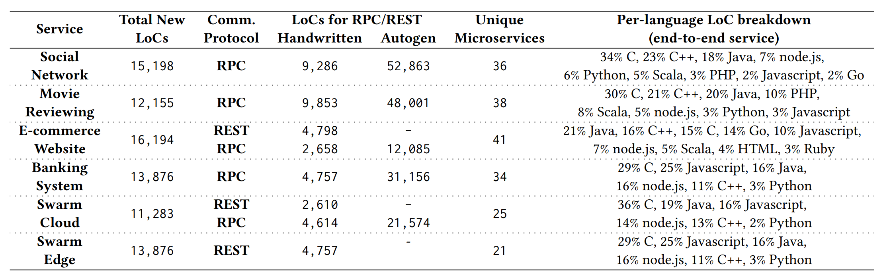

表 1：Characteristics and code composition of each end-to-end microservices-based application

表 1 展示了各款服务所开发的代码行数（LoCs），以及通信协议的代码行数（包括手写代码，以及在适用情况下由 Thrift 自动生成的代码）。在*社交网络*（Social Network）、*媒体*（Media）、*电子商务*（E-commerce）和*银行*（Banking）服务中，新增的大部分代码主要用于构建跨微服务 API，以及少数不存在现成开源框架的微服务（例如为电影评分的功能）。对于 *Swarm* 应用，我们展示了两个版本的代码构成细分：一个版本的大部分计算发生在云端后端（*Swarm Cloud*），另一个版本则发生在边缘设备本地（*Swarm Edge*）。此外，我们还展示了每款应用所包含的独立微服务数量，以及按编程语言分类的代码分布。除非另有说明，所有微服务均运行在 Docker 容器中。

### 3.2 Social Network

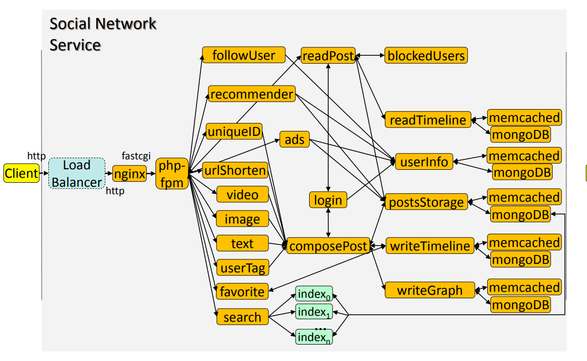

图 4：The architecture (microservices dependency graph) of Social Network.

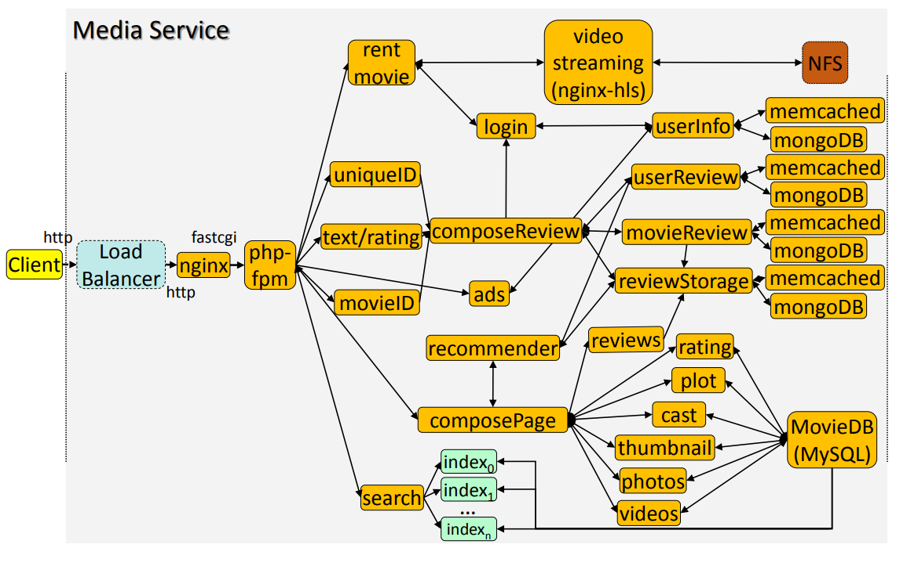

图 5： The architecture of the Media Service for reviewing, renting, and streaming movies

**业务范围（Scope）：** 该端到端服务实现了一个具备单向关注关系的广播式社交网络。  

**具体功能（Functionality）：** 图 4 展示了该端到端服务的架构。用户（客户端）通过 HTTP 发送请求，请求首先到达由 Nginx 实现的负载均衡器。一旦选定了特定的 Web 服务器（同样基于 Nginx 实现），后者便通过 PHP-FPM 模块与负责撰写和显示动态（Posts）的微服务，以及负责广告、搜索引擎等业务的微服务进行通信。PHP-FPM 下游的所有消息交互均采用 Apache Thrift RPC。  

用户可以创建内嵌文本、媒体、链接以及提及（Tags）其他用户的动态，随后这些动态将被广播给其所有的粉丝（Followers）。用户还可以阅读、收藏和转发动态，或者进行公开回复、向其他用户发送私信（Direct message）。此外，该应用还集成了机器学习插件，如广告与用户推荐引擎、基于 Xapian 的搜索服务，以及用于记录和展示用户统计数据（如粉丝数量）的微服务，并支持用户关注、取消关注或拉黑其他账号。  

在服务后端，系统使用 Memcached 进行数据缓存，并使用 MongoDB 对动态、用户信息（Profiles）、媒体内容和推荐数据进行持久化存储。最后，该服务配置有分布式追踪系统（详见第 3.7 节），用于记录每个网络请求的延迟以及每个微服务的处理开销，所有的追踪链路数据均记录在集中式数据库中。该服务已在我们机构内部广泛部署，目前稳定支撑着数百名用户。我们将在第 8 节中利用这一部署来量化评估微服务的“大规模长尾效应”（Tail-at-scale effects）。  

### 3.3 Media Service

**业务范围（Scope）：** 该应用实现了一个端到端服务，用于浏览电影信息，以及对电影进行评论、评分、租赁和流媒体播放。  

**具体功能（Functionality）：** 图 5 展示了该端到端服务的架构。与社交网络应用类似，客户端请求首先到达负载均衡器，随后由其将请求分发至多个 Nginx Web 服务器。用户可以搜索并浏览电影的相关信息，包括剧情梗概、剧照、视频片段、演职人员及评论信息；用户还可以通过登录个人账户，在系统中对特定电影发表新的评论。  

用户还可以选择租赁电影，这涉及一个用于验证用户资金是否充足的支付认证模块，以及一个基于 `nginx-hls`（一款用于 HTTP 实时流媒体传输的生产级 Nginx 模块）的视频流媒体模块。实际的电影文件存储在网络文件系统（NFS）中，以避免从非关系型数据库中访问分块记录（Chunked records）所带来的高延迟与高复杂性；与此同时，电影评论则保存在 Memcached 和 MongoDB 实例中。电影的基本信息维护在一个进行了分片（Sharded）和多副本复制（Replicated）的 MySQL 数据库中。此外，该应用还包含电影与广告推荐引擎，以及若干用于系统维护和服务发现（Service discovery）的辅助服务（图中未予显示）。与之类似，我们正在康奈尔大学部署该*媒体服务*（Media Service），作为项目演示的托管网站，供社区成员浏览和评审。  

### 3.4 E-Commerce Service

**业务范围（Scope）：** 该服务实现了一个服装类电子商务网站。其设计汲取了开源应用 Sockshop 的灵感，并复用了其中的数个组件。

**具体功能（Functionality）：** 图 6 展示了该端到端服务的架构。在此场景下，应用前端由一个 Node.js 服务构成。客户端可通过调用名为 `catalogue` 的 Go 微服务来浏览库存商品；该微服务负责从后端的 Memcached 和 MongoDB 实例中检索并调取商品的相关信息。

用户可以通过将商品添加至购物车（由 Java 实现）来执行下单操作（由 Go 实现）。在登录账户（Go）后，用户可以选择物流配送选项（Java）、处理订单支付（Go），并获取对应的订单发票（Java）。所有订单均通过 `QueueMaster`（Go）进行序列化与提交。最后，该服务还集成了一个用于商品推荐的推荐引擎，以及负责创建商品愿望单（Java）和展示当前优惠折扣的微服务。

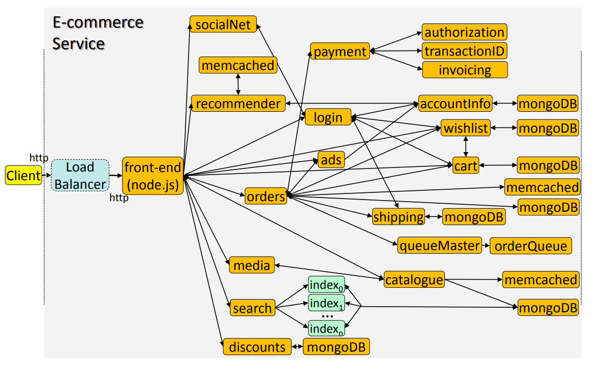

图 6：The architecture of the E-commerce service.

### 3.5 Banking System

**业务范围（Scope）：** 该服务实现了一个安全的银行系统，用户可利用该系统进行转账支付、贷款申请或信用卡账单结算。  

**具体功能（Functionality）：** 用户通过一个类似于电子商务服务中的 Node.js 前端进行交互，以此登录个人账户、查询银行信息或联系客户代表。登录成功后，用户可以执行账户付款、信用卡还款或申办新卡，浏览贷款信息并提交贷款申请，以及获取理财方案的相关信息。  

大多数微服务均采用 Java 和 JavaScript 编写。后端数据库由内存型 Memcached 与持久化 MongoDB 实例共同构成。此外，该服务还包含一个关系型数据库（BankInfoDB），用于存储银行基本情况、核心业务及客户代表的资料。  

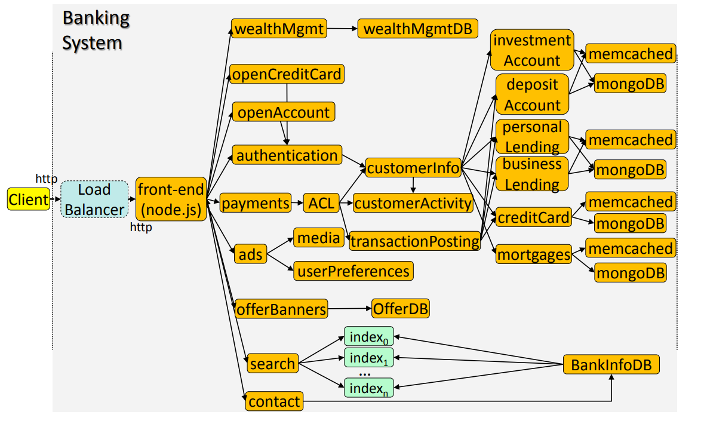

图 7：The architecture of the Banking end-to-end service.

### 3.6 Swarm Coordination

**业务范围（Scope）：** 最后，我们探索了一种不同的微服务执行环境，其应用程序协同运行在云端与边缘设备上。该服务负责协调可编程无人机集群（Swarm of programmable drones）的航路规划，这些无人机能够自主执行图像识别与避障。  

**具体功能（Functionality）：** 我们针对该服务考察了两种版本。在第一种版本中（如图 8a 所示），绝大部分计算任务均在无人机本地完成，包括运动规划（Motion planning）、图像识别以及避障；而云端仅负责为每架无人机生成初始航路（由 Java 服务 `ConstructRoute` 实现），并对传感器数据进行持久化备份。这种架构有效避免了云端与边缘端之间高昂的网络延迟，但同时也受限于无人机的机载资源（On-board resources）。  

在组件实现方面，`Controller` 和 `MotionController` 采用 JavaScript 编写，`ImageRecognition` 基于用于图像识别的 Node.js 库 *jimp* 实现，而 `ObstacleAvoidance` 则采用 C++ 实现。运行在无人机上的服务均以原生（Natively）方式执行，并借由进程间通信（IPC）实现节点间互联；相比之下，云端与无人机之间则采用 HTTP 协议进行通信，从而避免了在边缘设备上安装 Thrift 这样繁重的依赖项。  

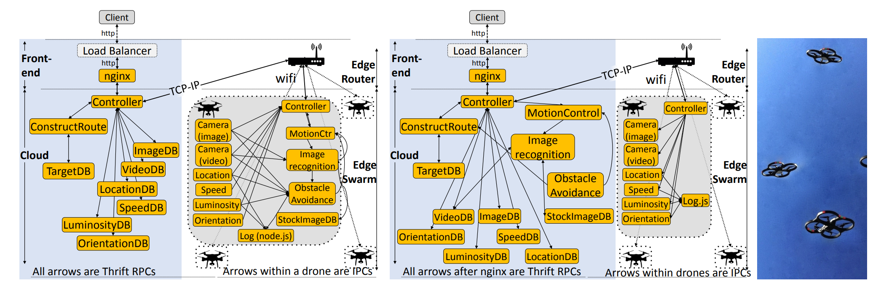

图 8：The Swam service running (a) on edge devices, and (b) on the cloud. (c) Local drone swarm executing the service.

在第二种版本中（如图 8b 所示），云端承担了绝大部分的计算任务。它通过 `ardrone-autonomy` 和 `Cylon` 库（分别基于 OpenCV 和 JavaScript），实现对所有无人机的运动控制、图像识别与避障。相比之下，边缘设备仅负责采集传感器数据并将其传输至云端，同时利用本地的 Node.js 日志服务记录部分诊断信息。在这种情况下，尽管各服务能够受益于云端丰富的硬件资源，但几乎每一次动作的执行都会受到云-边网络延迟的影响。实验中我们使用了 24 架可编程 Parrot AR2.0 无人机（图 8c 中展示了其中的一部分），以及一个由 20 台双路（Two-socket）、40 核服务器组成的后端集群。无人机之间以及无人机与服务器集群之间均通过无线路由器进行通信。  

### 3.7 Methodological Challenges of Microservices

微服务架构面临的一大核心挑战在于，它无法像传统的“客户端-服务器”（C/S）应用那样，仅简单地依赖客户端来上报性能数据。排查并解决性能问题需要准确判定究竟是哪个（或哪些）微服务导致了服务质量（QoS）违规，而这通常需要借助分布式追踪技术来实现。为此，我们研发并部署了一套分布式追踪系统，该系统利用 Thrift 定时接口（Timing interface），能够以 RPC 为粒度记录每个微服务的延迟。当 RPC 或 REST 请求到达和离开各个微服务时，追踪模块会对其进行打时间戳（Timestamped）处理。随后，这些数据由追踪收集器（Trace Collector，其实现方式类似于 Zipkin Collector）进行汇聚，并最终存储在集中式的 Cassandra 数据库中。此外，我们还采用了类似的方法，专门追踪了网络请求处理所消耗的时间（以便与纯应用层计算的时间进行对比）。经实验验证，该追踪系统带来的性能开销微乎其微：在所有测试场景下，其对端到端延迟的影响均低于 0.1%，这在此类分布式系统中是完全可以接受的。  

### 3.8 Provisioning & Query Diversity

在分析微服务的微体系结构行为之前，我们首先对端到端应用进行资源调配（Provision），以确保各微服务之间的负载保持均衡，避免单一微服务因资源饱和而过早引入性能瓶颈。为此，我们首先为端到端工作负载中的所有微服务分配对等的初始资源，随后逐步扩容（Upsize）已饱和的微服务，直至系统内的所有层级在大致相同的负载水平下达到饱和。不同端到端服务在各层级之间的资源比例存在显著差异，这进一步凸显了引入应用感知型（Application-aware）资源管理机制的必要性。

此外，不同的查询类型在各服务中表现出的性能也各不相同。例如，社交网络（Social Network）应用中的 composePost（撰写动态）请求因其消息中嵌入的多媒体内容不同而存在差异，涵盖了从纯文本信息到包含图片和视频文件的各种动态（我们将视频大小控制在数 180°C MB 以内，这与 Twitter 等生产级社交网络所允许的视频规格相仿）。在社交网络的所有查询类型中，转发动态（Reposting）引发的延迟最高。这是因为该操作必须首先读取一条既有动态，对其进行前置拼接，随后再将该消息扇出传播至该用户所有粉丝的时间线（Timelines）上。

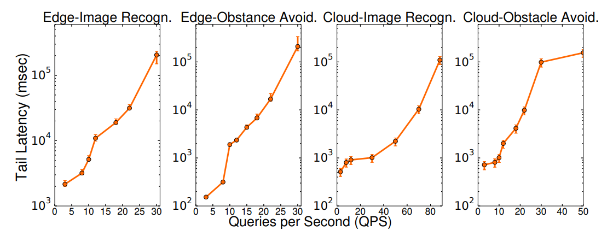

图 9：Throughput-tail latency for the Swarm service when execution happens at the edge versus the cloud.

另一方面，在电子商务（E-commerce）应用中，下单操作（包括将商品添加至购物车、登录账户、确认支付以及选择物流）所消耗的时间，比浏览在线商店的商品目录要高出 1 至 2 个数量级。在现实场景中，下单过程需要与终端用户进行交互；而在本文的实验中，我们对客户端的决策进行了自动化模拟，使其产生零延迟，从而使端到端延迟完全由服务器端主导。在媒体（Media）和银行（Banking）服务中，不同查询类型的性能趋势也极为相似：无论是租赁电影时的支付处理，还是银行账户中的交易流水，支付业务均在延迟中占据绝对主导地位，并定义了各款服务的饱和点（Saturation point）。

最后，在图 9 中，我们对比了物联网（IoT）应用在边缘端计算与云端计算时的性能表现。由于无人机必须跨越数十米的距离与无线路由器进行通信，其延迟显著高于纯云端服务。当计算任务在云端执行时，在低负载下，由于受到漫长网络延迟的制约（Penalized），其延迟相对较高。然而，随着负载的增加，由于机载资源有限，边缘设备很快就会陷入资源超配与过载（Oversubscribed）状态。相比之下，在相同的尾延迟下，云端处理能够实现高出 7.8 倍的吞吐量；或者在相同的吞吐量下，将延迟降低 20 倍。避障（Obstacle avoidance）任务则表现出了截然不同的权衡特征，因为它是轻计算密集、重延迟敏感的任务。在低负载下，如果将避障任务卸载（Offloading）至云端，一旦航路调整出现滞后，可能会引发灾难性的后果。这进一步凸显了在云-边之间引入延迟感知型（Latency-aware）资源管理机制的重要性，尤其是对于安全关键型计算（Safety-critical computation）而言。

## 4. Architectural Implications

**实验方法（Methodology）：** 我们首先在本地集群上对端到端服务进行评估。该集群由 20 台双路（Two-socket）、40 核 Intel Xeon 服务器（具体型号为 E2699-v4 与 E5-2660 v3）组成，每台服务器均配备 128–256GB 内存；各服务器通过 10GbE 网卡（NIC）连接至一台 10Gbps 的柜顶式（ToR）交换机。所有服务器均运行 Ubuntu 16.04 操作系统。除非另有说明，系统均已关闭电源管理（Power management）与睿频加速（Turbo boosting）功能。

**时钟周期分布与 IPC（Cycles breakdown and IPC）：** 我们利用 Intel vTune 工具对 CPU 时钟周期进行了拆解分析，以此来定位性能瓶颈。图 10 展示了*社交网络*（Social Network）和*电子商务*（E-commerce）服务中各个微服务的 IPC 与时钟周期消耗情况。虽然我们省略了其他服务的相关图表，但其实际观测到的规律高度相似。  

在所有服务中，有很大一部分（通常是绝大部分）时钟周期消耗在处理器的前端（Processor front-end）。引发前端流水线停顿（Front-end stalls）的原因有多种，其中包括长延迟内存访问和指令缓存（I-cache）未命中。这与传统云应用的相关研究结论相吻合；不过，由于微服务的代码足迹（Code footprint）更小，因此其受前端停顿影响的程度要低于单体服务（如 *Memcached* 和 *MongoDB*）。绝大多数前端停顿是由取指（*Fetch*）阶段引起的，而相比于其他云端或物联网（IoT）交互式应用，分支预测错误（Branch mispredictions）在微服务停顿中所占的比例要更低。在总时钟周期中，仅有极少部分用于实际的指令提交（在*社交网络*应用中平均仅为 21%），这表明目前的硬件系统在应对基于微服务的应用时，其架构设计与资源配置仍显不足（Poorly provisioned）。

另一方面，电子商务（E-commerce）应用中包含少数几个逆此趋势而行的微服务，它们表现出较高的 IPC 以及高比例的已提交指令（Retired instructions），例如搜索（Search）服务。搜索服务（基于 Xapian 实现）已经针对内存局部性（Memory locality）进行了优化，且其代码库（Codebase）体积相对较小，这解释了为何其产生的前端流水线停顿（Front-end stalls）较少。这一规律同样适用于一些简单的微服务（如愿望单），对于这些服务而言，指令缓存（I-cache）未命中的影响几乎可以忽略不计。电子商务应用中还包含一个推荐引擎，其 IPC 极低；这再次印证了先前关于机器学习（ML）应用微体系结构行为的研究结论。微服务架构面临的挑战在于，尽管单个应用组件的技术特征可能已被充分掌握，但端到端依赖图的拓扑结构才真正决定了各个独立服务将如何影响系统的整体性能。

针对这两款服务，我们还展示了从用户视角来看具备相同端到端功能、但采用单体架构构建的对应应用的时钟周期分布（Cycles breakdown）与 IPC。在这两种场景下，单体应用均采用 Java 开发，并将除后端数据库（基于 Memcached 和 MongoDB）以外的所有应用功能打包封装在单个二进制文件（Single binary）中。与微服务相比，单体应用的时钟周期分布并未表现出剧烈差异。不过，由于减少了前端流水线停顿（因为单体架构内部组件通信无需跨网络，从而降低了等待网络请求完成的概率），单体应用的已提交指令（Committed instructions）比例略高。其 IPC 也与微服务相仿，且与以往关于云服务的研究工作保持了一致。

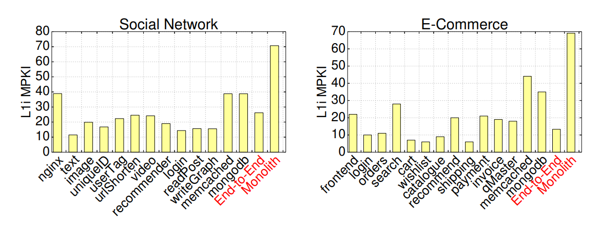

图 11： L1-i misses in Social Network and E-commerce.

**指令缓存压力（I-cache pressure）：** 先前的研究工作已经表征了云应用程序对指令缓存（Instruction caches）所施加的高水平压力。由于微服务架构将原本庞大的单体二进制文件拆分为诸多小型且松散耦合的服务，因此我们需要检验先前关于指令缓存压力的研究结论在此场景下是否依然成立。图 11 展示了*社交网络*（Social Network）和*电子商务*（E-commerce）应用中各个微服务的 MPKI（每千条指令未命中数）。此外，我们还引入了后端缓存层与数据库层进行对比，并给出了相应单体架构实现下的 L1i MPKI（一级指令缓存 MPKI）。

首先，nginx、memcached、MongoDB 以及（尤其是）单体架构应用（monoliths）的指令缓存（i-cache）压力依然维持在较高水平，这一结论与先前的研究工作相吻合。相比之下，其余微服务的指令缓存压力则明显较低，在 **E-commerce** 业务中这一现象尤为突出。鉴于微服务本身的代码体量（code footprint）较小，这一结果完全符合预期。由于非微服务场景下的 node.js 应用并不能保持较低的指令缓存缺失率，因此我们推断：**正是微服务的精简性（simplicity）带来了更好的指令缓存局部性（locality）。**此外，绝大多数的一级指令缓存（L1i）缺失（特别是在 **Social Network** 业务中）都发生在内核态，且主要由 Thrift 框架所致。我们还对末级缓存（LLC）和数据快表（D-TLB）的缺失情况进行了评估，发现其缺失率远低于传统的云应用，这与当前微服务架构倡导“**尽量保持无状态（mostly stateless）**”的设计趋势是完全一致的。

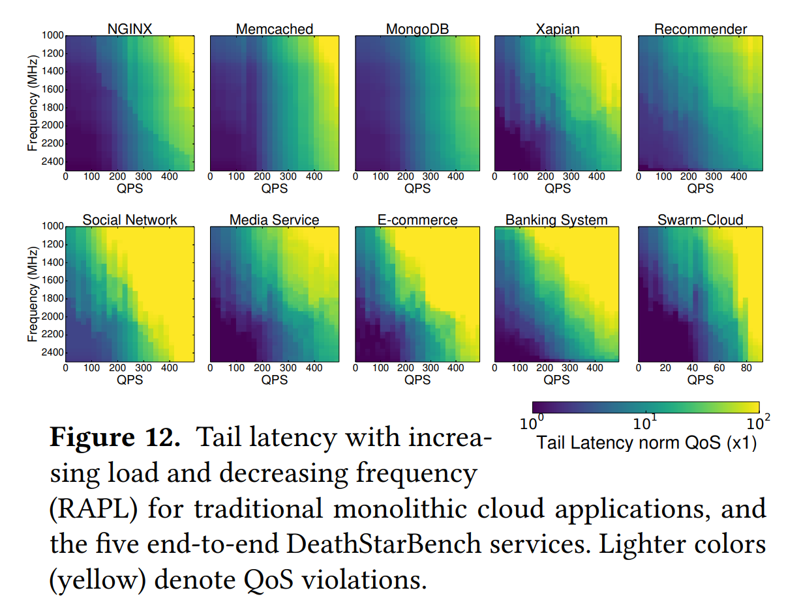

图 12：Tail latency with increasing load and decreasing frequency(RAPL) for traditional monolithic cloud applications, and the five end-to-end DeathStarBench services. Lighter colors(yellow) denote QoS violations.

**强劲核心与精简核心（Brawny vs. wimpy cores）**：目前已有大量研究工作聚焦于在云环境中，小服务器能否取代高端计算平台。尽管精简核心在功耗方面表现出明显的优势，但对于交互式服务而言，在针对单线程性能进行了深度优化的服务器上运行，依然能够获得更佳的延迟表现。不过，鉴于单个微服务的计算负载通常较小，微服务架构为精简核心提供了一个极具吸引力的应用场景。我们从两个维度对低功耗机器进行了评估。首先，我们在本地集群上利用 RAPL（运行期平均功率限制技术）调低了所有微服务运行时的时钟频率。图 12（顶行）展示了随着负载的增加以及运行频率的降低，五种常见的开源**单层交互式服务（single-tier interactive services）**——即 nginx、memcached、MongoDB、Xapian 和 Recommender 的**尾部延迟（tail latency）变化趋势。我们将这些服务与五种端到端服务（end-to-end services）**（对应图中的底行）进行了对比。

正如预期，大多数交互式服务对频率调节（frequency scaling）都较为敏感。在单体架构的测试负载中，由于 MongoDB 属于 I/O 密集型（I/O-bound）应用，它是唯一一个在最大负载下仍能容忍接近最低运行频率的服务。其余四种单层服务则表现为随着频率的下降而出现延迟上升，其中 Xapian 对频率变化最为敏感，nginx 和 memcached 次之。然而，对微服务进行相同的对比研究表明：尽管端到端服务的整体尾部延迟较高，但与传统云应用相比，**微服务对单线程性能劣化的敏感度要高得多**。这一结果看似反直觉，实则合乎情理。因为与整个端到端单体应用相比，每一个独立的微服务都必须满足更为严苛的尾部延迟约束，这无疑对系统的性能可预测性（performance predictability）带来了更大的压力。

在五种端到端服务中（由于计算主要发生在边缘设备上，此处省略了 Swarm-Edge），**Social Network** 和 **E-commerce** 对低频运行最为敏感；相反，**Swarm** 服务的敏感度最低，这主要是因为其性能主要受限于**云边通信延迟（cloud-edge communication latency）**，而非核心的计算速度。

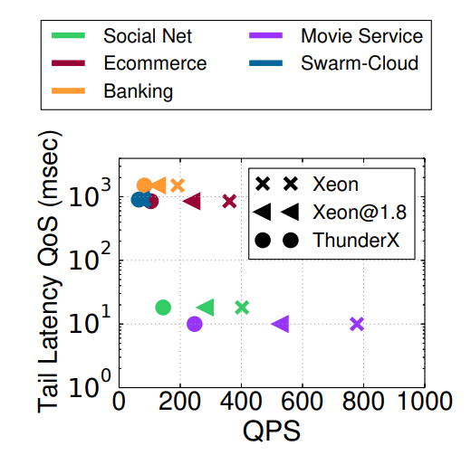

图 13：Throughput-tail latency on an IntelXeon and a Cavium ThunderX server for all end-to-end services.

除了利用频率调节（frequency scaling）外，市场上还存在一类在设计之初就原生采用低功耗核心的计算平台。为此，本文在两块 Cavium ThunderX 开发板上对端到端服务进行了评估。其具体硬件配置为：双路插槽（2 sockets），每路插槽包含 48 个主频为 1.8GHz 的**顺序执行核心（in-order cores）**，并配有 16 路组相联的 16MB 共享末级缓存（LLC）。这些开发板与集群中的其他服务器接入同一个**柜顶（ToR）交换机**，且其内存与网络子系统配置也与其他服务器保持完全一致。图 13 展示了各应用程序在上述两种平台达到饱和点（saturation point）时的吞吐量变化。同时，我们也给出了当 Xeon 服务器降频至与 Cavium 开发板同等水平（1.8GHz）时的性能表现。尽管 ThunderX 在低负载下能够满足端到端的服务质量（QoS）目标，但所有五款应用在 ThunderX 上达到吞吐饱和的时间均远早于高端服务器。这一现象在 **Social Network** 和 **Media Service** 中尤为显著（因其延迟约束更为苛刻），而在 **E-commerce** 中同样明显（因其属于计算密集型业务）。

与功耗管理实验的结果类似，**Swarm** 服务受到的性能冲击较小，因为其属于网络密集型（network-bound）**应用。值得注意的是，尽管 Xeon 服务器在 1.8GHz 运行时的性能劣于其在**标称频率（nominal frequency）**下的表现，但其输出的性能依然显著优于 Cavium SoC。由此可见，即便低功耗机器在这种场景下会导致性能退化，它们仍可被部署在**非关键路径（off the critical path）上的微服务中，或用于运行那些对频率调节不敏感的微服务。

## 5. OS & Networking Implications

接下来，我们将探讨在全新的微服务架构下，操作系统与网络所发挥的作用。

### 操作系统与用户态层面的开销分解

图 14 展示了各端到端服务中，时钟周期（C）和指令数（I）在**内核态**（kernel）、**用户态**（user）以及**底层库**（libraries）中的分布情况。

- **社交网络与媒体服务：** 在所有应用程序中（特别是*社交网络*和*媒体服务*），很大一部分的执行开销都集中在内核态。这主要是由于系统频繁使用 memcached 进行内存缓存，并伴随着极高的网络流量。此外，还有几乎相同比例的开销分配给了 *libc*、*libgcc*、*libstdc* 以及 *libpthread* 等基础库。
- **电子商务与银行服务：** 相比之下，*电子商务*和*银行服务*的开销分布则相对均衡。由于这两类应用的微服务更偏向于**计算密集型**（computationally-intensive），因此它们在用户态中运行的时间更长。
- **Swarm 服务：** 至于 *Swarm*，无论是在云端配置还是（特别是）在边缘配置下，其将近一半的运行时间都消耗在各类底层库中。

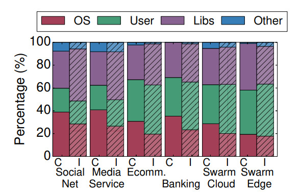

图 14：Time in kernel mode, user mode, and libraries for each service.

### 内核态与底层库的开销成因分析

- **内核态高开销的合理性：** 内核态中消耗的大量时钟周期完全在情理之中。毕竟像 memcached 和 MongoDB 这类应用，其大部分执行时间都花在内核中，用于处理硬件中断、解析 TCP 数据包，以及激活和调度处于空闲状态的交互式服务。
- **底层库高开销的直观原因：** 同样，底层库占据了大量的时钟周期也不难理解。因为微服务架构通常以提升开发速度为核心导向，往往倾向于大量复用现有的基础库，而不是从零开始重新实现相关功能。
- **专用内核的兴起与适用性：** 鉴于通用（general-purpose）Linux 操作系统会带来不小的额外开销，这也催生了许多结构更精简的专用内核，例如 Unikernel。此类内核往往通过牺牲一定的兼容性，来换取更高的性能表现。这种类似的操作系统设计理念，同样非常适用于功能单一（single-concerned）的微服务。

### 计算与通信开销比例

- **社交网络服务的开销对比：** 图 15a 对比了在低负载和高负载情况下，*社交网络（Social Network）* 中各微服务在处理网络请求与应用计算上所消耗的时间。图 15b 则展示了其余端到端服务中，处理 RPC 请求在**尾部延迟**（tail latency）中所占的比例。

- **低负载下的特征：** 在低负载状态下，RPC 处理占 *社交网络* 各微服务总执行时间的 5% 至 75%，并占端到端尾部延迟的 18%。究其原因，是因为其中部分微服务功能过于简单，自身并不涉及复杂的计算处理。

- **与其他服务的对比：** 相比之下，网络处理在 *电子商务* 和 *银行服务* 中所占的延迟比例较低，这主要是因为这两类应用的微服务更偏向于**计算密集型**。最后，在 *Swarm* 的两种配置模式下，即便在低负载状态下，网络处理在尾部延迟中的占比也超过了 30%。

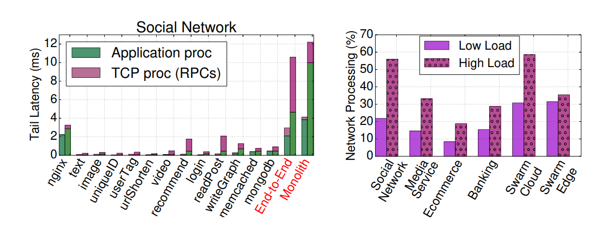

图 15：Time in application vs network processing for (a) microservices in Social Network, and (b) the other services.

### 高负载下的网络延迟表现

- **网卡队列积压的影响：** 在高负载情况下，由于网络接口卡（NIC）中积压了长队列，网络处理成为所有端到端服务（电子商务和银行服务除外）尾部延迟中更为显著的主导因素。这对系统性能产生了重大影响，其中*社交网络*的端到端尾部延迟激增至原来的 3.2 倍。
- **通信协议的对比（RPC vs. HTTP）：** 这种由网络处理带来的巨大延迟冲击，无论微服务是基于 RPC（如*社交网络*、*媒体服务*、*银行服务*）还是基于 HTTP（如*电子商务*、*Swarm 边缘配置*）进行通信都会发生。尽管如此，在低负载状态下，RPC 引入的延迟还是要明显低于 HTTP。
- **微服务与单体架构的开销对比：** 最后，图 15a 还展示了单体（monolithic）架构下的*社交网络*应用在处理网络请求时所消耗的时间。无论是在低负载还是（特别是）在高负载下，单体应用与微服务之间的性能差异都极其显著。不过，这种差异完全在情理之中，因为单体应用是以单个二进制文件的形式部署的，其绝大部分网络流量仅对应于常规的客户端-服务器通信，不存在微服务内部复杂的内部通信开销。

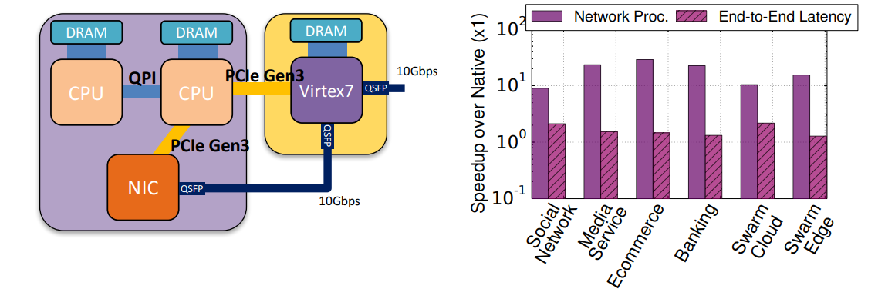

图 16：(a) Overview of the FPGA configuration for RPC acceleration, and (b) the performance benefits of acceleration in terms of network and end-to-end tail latency.

### 网络处理的硬件加速探索

鉴于网络处理对尾部延迟有着至关重要的影响，接下来我们将探讨对其进行硬件加速的潜在空间与可行性。

- **硬件加速环境部署（串接式架构）：** 如图 16a 所示，我们采用了一种类似于前人研究的串接式（bump-in-the-wire）配置。利用 Vivado HLS，我们将整个 TCP 协议栈完整地卸载（offload）到一块 Virtex 7 FPGA 上。该 FPGA 部署在网卡（NIC）与柜顶交换机（ToR）之间，并通过匹配的收发器与二者互连，在网络中充当过滤与数据处理节点的角色。

- **低负载下的资源复用：** 在网络低负载期间，为了不让硬件资源闲置，我们保留了主机与 FPGA 之间的 PCIe 连接，以便为其他服务提供加速（例如运行推荐引擎中的机器学习模型）。

- **加速效果与性能提升：** 图 16b 展示了硬件加速对纯网络处理延迟以及各服务端到端延迟所带来的加速比（Speedup）。

  - 相比于原生的 TCP 协议栈，纯网络处理延迟实现了

    $$
    10\times \sim 68\times
    $$

    的显著提升；

  - 各服务的端到端尾部延迟也优化了 $43\%$，最高可获得

    $$
    2.2\times
	$$

    的性能加速。

对于交互式且**对延迟极度敏感**（latency-critical）的服务而言，尾部延迟的哪怕一丝改善都具有重要意义，因此这种网络硬件加速方案能够为其带来巨大的性能飞跃。

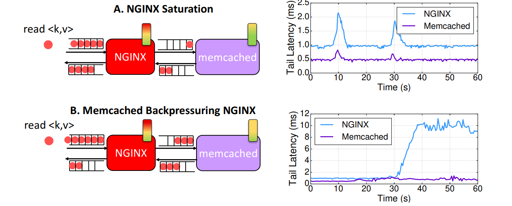

图 17：Example of backpressure between microservices in a simple, two-tier application. Case A shows a typical hotspot that autoscalers can easily address, while Case B shows that a seemingly negligible bottleneck in memcached can cause the front-end NGINX service to saturate.

## 6. Cluster Management Implications

### 微服务架构对集群管理的挑战

- **反压与热点效应：** 微服务架构显著增加了集群管理的复杂性。由于不同服务层（tiers）之间存在错综复杂的依赖关系，极易引发**反压**（backpressure）效应，从而导致整个系统范围内出现**热点**（hotspots）问题。
- **集群管理器的误判机制：** 此外，反压还会误导集群管理器，使其对一个已经处于**饱和状态**（saturated）的微服务采取惩罚（如限流）或扩容（upsizing）措施。然而，该服务的饱和往往只是表象，其根本原因在于受到了另一个服务（该服务自身甚至可能并未达到饱和）所传递过来的反压影响。

### 典型案例分析（两层架构应用）

图 17 以一个简化的两层架构应用为例阐明了这一问题。该应用由一个 Web 服务器（nginx）和一个内存缓存型键值存储系统（memcached）组成：

- **典型场景（情况 A）：** 在情况 A 中，随着客户端持续发起读请求，nginx 逐渐达到饱和状态，导致其响应延迟急剧上升，并在其输入端（input）积压了冗长的请求队列。
- **弹性伸缩的应对：** 这是一个相对直观且易于处理的场景。弹性伸缩（autoscaling）系统通常可以通过对 nginx 进行**横向扩展**（scaling out）来轻松解决这一瓶颈。

在示例图中的以下时间点均展示了这一自动化扩容过程：

$$
t = 14s \quad \text{和} \quad t = 35s
$$

### 复杂反压场景分析（情况 B）

- **HTTP/1 协议下的连接阻塞：** 与前文所述的直观场景相反，情况 B 凸显了反压带来的严峻挑战。在使用 HTTP/1 协议时，单个连接内部的请求处理是**阻塞式**的，这意味着在跨层通信时，每个连接只能有一个处于挂起/待处理状态（outstanding）的请求。
- **表象饱和与链式反应：** 因此，即便 memcached 本身并没有达到饱和状态，它也会导致 nginx 的上游积压大量待处理请求的长队列，从而反过来迫使 nginx 走向饱和。

### 现有集群管理器的伸缩误判

- **基于利用率扩容的弊端：** 现有的集群管理器很难有效应对这种复杂场景。因为传统的**基于资源利用率的自动扩容策略**（utilization-based autoscaling scheme）会直接对 nginx 进行横向扩展——因为此时的 nginx 正处于**忙等待**（busy waiting）状态，在指标上呈现出“高度饱和”的假象。
- **系统恶性循环：** 正如图中所示，这种盲目扩容的做法不仅无法解决根本问题，反而会因为允许更多的流量涌入系统，从而可能导致系统整体瓶颈进一步恶化。

### 反压的本质成因

- **多层架构的非理想流水线特性：** 值得注意的是，即使没有 HTTP/1 的连接阻塞限制，反压现象依然普遍存在。这是因为多层架构（multi-tier）应用并不是完美的流水线，各个服务层之间不可能做到完全独立地运转。

图 18：Microservices graphs for three real production cloud providers. We also show these dependencies for Social Network.

### 现实云应用的复杂性与动态依赖

- **实际场景的复杂性：** 然而，现实世界中的云应用程序远比上述简单示例要复杂得多。
- **微服务拓扑图分析：** 图 18 展示了三家主流云服务提供商以及本文所研究的*社交网络（Social Network）*应用程序的微服务依赖图。在该图的圆周（或球面）上分布着各种不同的微服务，而它们之间的连线（边）则刻画了彼此之间的依赖关系。
- **描述难度与动态演进：** 这种错综复杂的依赖关系无论是对开发者还是用户而言，都极难进行准确的描述。更为棘手的是，由于旧的微服务需要经常被下线并被新服务所更替，这些依赖关系往往处于频繁的动态变化之中。

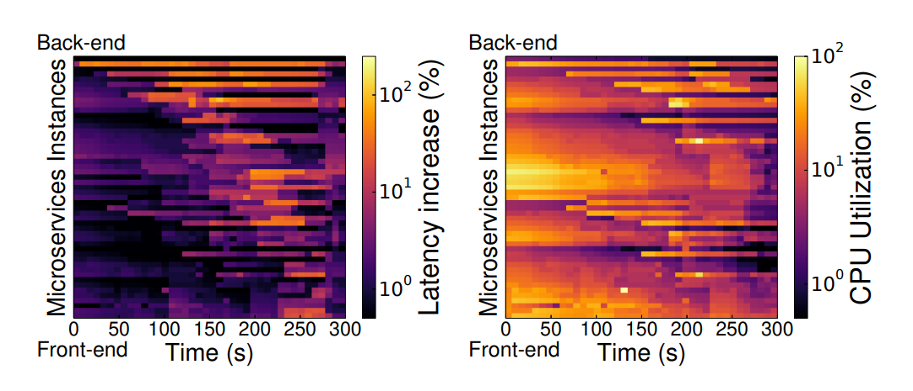

图 19：Cascading QoS violations in Social Network compared to per-microservice CPU utilization

### 级联 QoS 违规与资源利用率误导分析

图 19 展示了*社交网络（Social Network）*服务中**级联 QoS 违规**（服务质量违规）所带来的影响。

- **图表颜色含义说明：** * **深色：** 在图 19a 中，较深的颜色表示特定微服务的尾部延迟接近其**正常运行状态**（nominal operation）；而在图 19b 中，深色则代表**低资源利用率**。
  - **亮色（浅色）：** 相反，较亮的颜色则显著代表了各微服务的高尾部延迟以及高 CPU 利用率。
- **微服务的排列顺序：** 图中的微服务是依据整体服务架构进行排序的，即从顶部的**后端服务**开始，逐层向下延伸到底部的**前端服务**。

### 核心实验发现

- **热点的拓扑传播：** 图 19a 清楚地表明，一旦位于顶部的后端服务遭遇高尾部延迟，该**热点**（hotspot）就会迅速向其**上游服务**传播，并顺着调用链一路蔓延至最底层的前端服务。
- **资源利用率指标的误导性：** 在这种级联故障场景下，单纯依赖资源利用率指标往往会产生误导。正如图 19b 所示，尽管已达饱和状态的后端服务确实表现出高利用率，但处于调用链中间位置的一些微服务甚至呈现出了更高的利用率，然而这些中间服务的高利用率却并没有转化为任何实际的 QoS 违规。

### 利用率异动与新型集群管理器的诉求

- **低利用率下的性能恶化：** 与此相反，另一些微服务则表现出资源利用率相对较低、但性能却严重恶化的反常现象。例如，这种情况通常是由于它们正在等待来自另一个已饱和服务层的阻塞式或同步（blocking/synchronous）请求。
- **对资源分配机制的启示：** 这一现象进一步凸显了研发新型集群管理器的紧迫性：在进行资源分配时，集群管理器不能仅依赖单一节点的指标，而是必须将**微服务之间的依赖关系对端到端性能所带来的联动影响**纳入考量。

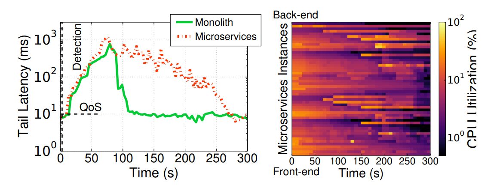

图 20：(a) Microservices taking longer than monoliths to recover from a QoS violation, even (b) in the presence of autoscaling mechanisms.

### 微服务与单体架构的故障恢复速度对比

- **热点传播对恢复时间的影响：** 最后，由于热点会在不同的服务层之间发生联动传播，这意味着微服务一旦遭遇 QoS（服务质量）违规，其恢复所需的时间要明显长于传统的单体应用。即便引入了大多数云服务商普遍部署的自动扩容（autoscaling）机制，这一痛点依然存在。
- **实验场景对比：** 图 20 展示了这样一个对比案例：分别以微服务架构和基于 Java 的单体架构来实现相同的*社交网络（Social Network）*服务。在这两种部署模式下，系统检测到 QoS 违规的时间点是完全相同的。

### 自动扩容机制的局限性与恢复延迟

- **单体架构的快速恢复：** 面对 QoS 违规，集群管理器对于单体应用的处理非常简单——只需直接实例化该单体应用的新副本，并重新平衡流量负载，即可快速实现性能恢复。
- **微服务架构的恢复滞后：** 相比之下，微服务的自动扩容机制则需要耗费更长的时间才能改善性能。正如图 20b 中高利用率微服务（表现为颜色逐渐加深）所示，自动扩容机制往往只是简单地去增加那些表面上处于饱和状态的服务资源。
- **故障根源错配与队列积压：** 然而，资源利用率最高的微服务并不见得就是导致 QoS 违规的根源。这导致集群系统需要耗费极长的时间，才能在错综复杂的依赖中揪出引发性能恶化的真实源头并对其进行扩容。其造成的后果是，等到系统终于锁定了真正的故障根源时，上游早已积压了冗长的请求队列，需要耗费相当长的时间才能将这些积压彻底疏导完毕。

## 7. Application & Programming Framework Implications

### 各微服务延迟开销分解

- **层间不平衡性探讨：** 我们首先探讨了端到端服务在不同服务层（tiers）之间是否存在不平衡现象，即某些微服务是否承担了极不成比例的计算量、贡献了绝大部分的端到端延迟，或者极易成为引发系统热点的诱因。
- **测量方法与验证：** 我们分别在低负载和高负载状态下对各个服务进行了测试，利用分布式追踪（distributed tracing）框架获取了单个微服务的延迟数据，并借助英特尔的 Intel vTune 性能分析器对测试结果进行了交叉验证。

### 低负载下的延迟特征

- **前端主导现象：** 实验结果表明，在低负载情况下，*社交网络（Social Network）*和*媒体服务（Media Service）*的延迟均主要由前端（nginx）所主导。
- **其余服务的分布：** 与此同时，其余微服务的延迟开销则分布得相对均匀。
- **唯一的数据库例外：** 期间唯一的例外是 MongoDB，其在上述两类服务中表现出了稍高的存在感，分别占端到端总延迟的 8.5% 和 10.3%。

### 高负载下的延迟特征与瓶颈转移

在高负载状态下，前文所述的特征发生了显著变化。

- **核心服务的瓶颈下沉：** 此时，尽管前端对延迟依然有不小的影响，但系统整体性能的瓶颈已经转移到了**后端数据库**以及负责管理这些数据库的微服务（例如 `writeGraph`）上。
- **语言特性对电商与银行服务的影响：** *电子商务*和*银行服务*在不同负载水平下也经历了类似的波动。此外，这两类服务还受到一个关键因素的影响：其旗下的数个微服务属于**计算密集型**，且是用 Node.js 和 Go 等高级语言编写的。这直接影响了系统的执行时间：
  - 在*电子商务*中，订单（orders）、商品目录（catalogue）和支付（payment）微服务占据了端到端延迟的绝大部分；
  - 在*银行服务*中，延迟则主要集中在支付和身份认证（authentication）微服务上。
- **热点演进的成因：** 在上述场景中，后端数据库对执行时间的开销贡献反而较少。这表明，**编程语言的选择会直接影响系统内部热点的演变方式**。

### 同步机制带来的扩展性制约

- **queueMaster 的高延迟分析：** 此外，在*电子商务*服务中，`queueMaster` 微服务也遭遇了高延迟瓶颈。究其原因，是因为该服务采用了**同步机制**（synchronization）来确保订单能够严格地按序进行序列化、处理并提交，这在很大程度上制约了其在高负载下的**可扩展性**（scalability）。

### Swarm 协调服务的云边权衡与瓶颈动态性分析

- **云端与边缘端的架构权衡：** 最后，与在边缘设备上运行相比，*Swarm 协调服务*在云端运行时面临着截然不同的性能权衡（trade-offs）。
- **资源受限下的性能恶化：** 尽管无论该微服务部署在何处，`imageRecognition`（图像识别）都在总体延迟中占据主导地位，但当它在**资源受限的边缘端**运行时，其对**尾部延迟**（tail latency）的冲击要剧烈得多。由于边缘端计算资源匮乏，这种延迟甚至会恶化到导致运动控制器（motion controller）无法正常介入或启动的地步。

### 对集群动态管理机制的启示

- **瓶颈的多维动态特性：** 这一现象充分表明，尽管底层的单个微服务完全相同或高度相似，但系统的瓶颈表现不仅在不同的端到端服务之间存在显著差异，而且这些瓶颈还会**随着系统负载的波动发生动态转移**。
- **对敏捷管理带来的挑战：** 这种多维度的动态变化，无疑对集群的**动态与敏捷管理**（dynamic and agile management）机制提出了更高的要求，带来了更大的架构施压。

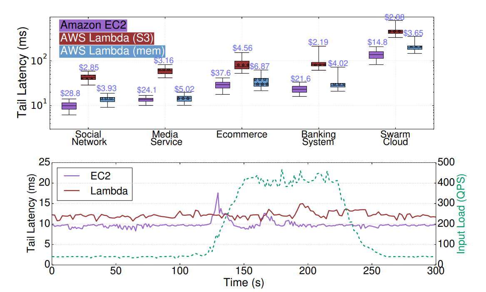

图 21：Performance and cost for the five services on Amazon EC2 and AWS Lambda (top). Tail latency for Social Network under a diurnal load pattern (bottom).

### Serverless 框架的特征与架构开销

- **Serverless 框架的定义：** 微服务通常部署在 **Serverless（无服务器）** 编程框架中。在这种框架下，应用程序与数据完全由云服务提供商进行托管，用户只需启动生命周期短暂的“函数”（functions），并完全基于请求量进行付费。
- **适用场景（经济性与并发度）：** * Serverless 极其适合具有**间歇性活跃特征**（intermittent activity）的应用场景；在这类场景下，维持长期运行的实例（long-running instances）通常不具备经济效益。
  - 此外，Serverless 还非常适用于**易并行**（embarrassingly parallel）的服务，这类服务能够通过在极短时间内调用海量的计算资源来显著提升性能。
- **引入的代码侵入性（间接层）：** 然而，Serverless 同时也引入了一个额外的**间接层**（level of indirection）。为了能够与 Serverless 框架的接口进行对接，开发者必须对现有的应用程序进行**代码插桩**（instrumented）甚至完全重写。
- **瞬时性带来的存储开销：** 另外，由于 Serverless 函数具有**瞬时性/生命周期短暂**（ephemeral）的特点，函数之间无法直接传递状态，数据必须保存在持久化存储（persistent storage）中，以便后续的函数能够对其进行连续操作。以 AWS Lambda 为例，函数的输出结果通常需要转储到 S3 中，与传统的纯内存计算（in-memory computation）相比，这种机制会引入显著的额外开销。

图21（上）展示了在传统容器（部署于 Amazon EC2）与 AWS Lambda 函数上，各端到端服务的性能与成本对比。每个微服务均进行了插桩改造，以实现与 Lambda API 的交互。由于部分微服务所使用的编写语言目前尚未获得 Lambda 的原生支持，我们对此类微服务的业务逻辑进行了重构。  

在 EC2 的测试场景下，每个服务分配了 20 至 64 个 m5.12xlarge 实例，运行基准时间为 10 分钟。箱线图的箱体边缘分别代表延迟的第 25 和第 75 百分位数，而两侧的触须（whiskers）则分别对应第 5 和第 95 百分位数。  针对 Lambda 架构，我们评估并展示了两种配置下的性能与成本表现：  

- **默认配置**：采用标准的 S3 持久化存储。  
- **优化配置**：引入 4 个额外 EC2 实例的内存空间，用于缓存和维护在下游依赖微服务之间传递的中间状态。  

在使用 S3 存储时，Lambda 的延迟显著增加，这主要归咎于远程持久化存储带来的额外开销以及速率限制（rate limiting）。值得注意的是，为了遵循微服务应尽可能保持“无状态”的设计原则，微服务之间传输的数据量本身极小，但上述开销依然不可忽视。  

当改用远程内存（remote memory）在相互依赖的 Serverless 函数之间传递状态时，上述绝大部分开销便不复存在。然而，即便在这种配置下，Lambda 的性能波动性（performance variability）依然较高。这是因为函数可能会被调度到数据中心的任意节点，从而引入不确定的网络延迟；此外，它们还会受到共同部署（co-scheduled）在同一台物理机上的外部函数的噪邻干扰（而相比之下，EC2 场景中的实例则是完全由我们的服务独占的）。需要说明的是，为了确保网络流量对比的公平性，在 EC2 场景下，相互依赖的微服务同样被部署在不同的物理机上。但在另一方面，Lambda 在成本上具有压倒性优势，其开销几乎比 EC2 低了一个数量级（尤其是在配合 S3 使用时），这主要得益于 Serverless 资源完全基于请求量按需计费（per-request basis）的机制。

图21（下）突出了无服务器（Serverless）架构按需弹性扩展资源的能力。输入负载源自 *Social Network* 应用中的真实用户流量，表现出明显的昼夜交替规律。出于实验成本的考虑，我们将该负载的时间跨度压缩至更短的区间，并通过开环负载生成器（open-loop workload generator）对其进行回放。实验结果与前述结论一致：尽管在低负载阶段 EC2 的尾部延迟（tail latency）低于 Lambda，但当负载攀升时，Lambda 响应用户需求并调整资源的速度明显快于 EC2。究其原因，请求数量的激增可直接转化为更多 Lambda 函数的并发调用，整个过程无需任何人工干预。相比之下，EC2 采用的是基于资源利用率监测的自动扩缩容机制（autoscaling mechanism）。当利用率超过预设阈值（本实验中设为 70%，与 EC2 默认的自动扩缩容配置一致）时，系统才会通过申请额外实例来扩展资源分配。这种机制会对系统延迟产生不利影响，因为系统只有在负载大幅增加后才会触发资源扩容，且新实例的初始化与就绪也并非瞬时完成。

因此，微服务若想充分释放 Serverless 架构的潜在红利，必须尽可能保持无状态特性，并高效利用内存原语（in-memory primitives）来实现依赖函数间的数据传递。

## 8. Tail At Scale Implications

随后，我们将研究重心转向 *Social Network* 服务，以探究微服务在大规模场景下的长尾效应（tail at scale effects）——即纯粹由系统和应用呈现出的超大规模（large-scale）所引发的特定效应。该 *Social Network* 系统拥有数百名注册用户，日均活跃用户（DAU）平均为 165 人，本项研究所采用的输入负载正是源自这部分真实用户产生的实际流量。  

为了突破本地基础设施的物理限制、构建更大规模的测试集群，我们将该服务部署在一个专用的 EC2 集群上。根据实验需求，该集群的资源规模横跨 40 至 200 个 c5.18xlarge 实例（每个实例均独占 72 个 vCPU 和 144GB 内存）。  

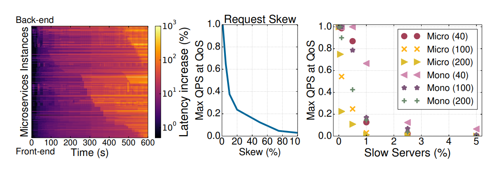

图 22：(a) Cascading hotspots in the large-scale Social Network deployment, and tail at scale effects from (b) request skew, and (c) slow servers.

**大规模级联热点**：图 22a 展示了在 100 个 EC2 实例上运行时，微服务间的依赖关系对系统性能带来的影响。纵轴（y 轴）上的微服务同样遵循自上而下、由后端向前端的顺序进行排列。尽管在初始阶段所有微服务均表现正常，但在 `$t = 260\text{s}$` 时，中间层（具体而言是 `composePost` 和 `readPost`）由于交换机路由配置错误而陷入饱和状态。该误配置未能将请求均匀地负载均衡至各个实例，而是导致每个微服务的其中一个实例出现严重过载。这进而引发了其下游服务的连锁饱和，导致各层级的延迟呈现出类似于图 19 中的瀑布流效应。

在采样阶段的尾声（`$t > 500\text{s}$`），后端服务也因类似原因发生饱和，从而导致位于关键路径上游的微服务也接连过载。这一现象在纵轴中部的微服务（图中显示为亮黄色）中尤为显著，因为这些服务的性能此前已因服务质量（QoS）违规而发生了劣化。

为了使系统在此种场景下实现自我修复，我们引入了限流（rate limiting）机制，通过压制准入的用户流量，直至现存的热点完全消散。尽管限流策略收效显著，但由于需要丢弃部分请求，不可避免地会对用户体验造成一定影响。

**请求倾斜（Request skew）：** 在面向用户的云服务中，负载极少呈现均匀分布，往往是少数用户产生了绝大部分的系统负载。社交网络中的实际流量通常高度契合这一规律：极少数用户（约占 5%）贡献了超过 30% 的访问请求。

为了进一步探究请求倾斜在极端情况下的系统表现，我们在实验中额外引入了模拟用户（synthetic users），这些用户生成的请求量远高于普通用户。具体而言，我们将倾斜度（skew）的改变范围设定为 0% 到 99%。在此处，倾斜度定义为：

$$
\text{skew} = 100 - u
$$

其中，$u$ 代表触发了 90% 总请求的用户占比。

倾斜度为 0% 意味着请求呈完全均匀分布。图 22b 展示了请求倾斜度对“满足 QoS（服务质量）要求下的最大持续负载”所带来的影响。当倾斜度为 0% 时，该集群规模（100 个实例）下的服务能够达到满足 QoS 约束的最大 QPS（每秒查询率）。

然而，随着倾斜度的增加，有效吞吐量（goodput，即满足 QoS 条件下的吞吐量）会急剧下降。当触发绝大部分请求的用户比例低于 20% 时，系统的有效吞吐量几乎跌落至零。

**慢服务器的影响（Impact of slow servers）：** 图 22c 展示了随着集群规模的扩大，少数慢服务器对系统整体服务质量（QoS）所带来的冲击。在实验中，我们通过启用激进的电源管理策略，特意降低了一小部分服务器的运行速度——正如正文第 4 节所述，这种电源管理方式对系统性能具有极大的破坏性。

- **大规模集群（>100 个实例）：** 当集群中出现 1% 或更多的低效服务器时，系统的有效吞吐量（goodput）几乎跌落至零。这是因为这些低效服务器托管了系统关键路径（critical path）上的至少一个微服务，从而拖垮了整体的 QoS。
- **小规模集群（40 个实例）：** 即使在较小的集群中，仅出现一台慢服务器，就已经达到了该服务在保障基本 QoS 并输出一定 QPS（每秒查询率）时所能承受的极限。

最后，我们对比了在相同集群规模下，慢服务器对采用单体架构设计（monolithic design）的 *Social Network* 系统所产生的影响。结果表明，在单体架构下，即使集群规模不断扩大，系统的有效吞吐量依然维持在较高水平。其原因在于，单个慢服务器只会波及托管在其上的那一个单体实例，而其他实例彼此独立运行、互不干扰。

然而，**后端数据库**是个例外。即便在单体架构中，后端数据库也是由所有应用实例所共享，并且跨多台机器进行了数据分片（sharded）。如果某台慢服务器正好托管了某个数据库分片，那么所有路由至该实例的请求，其性能都会发生显著恶化。

**总结而言：** 应用的微服务依赖图（microservices graph）越复杂，慢服务器带来的负面影响就越严重。因为随着微服务复杂度的增加，位于关键路径上的某项服务遭遇性能退化的概率也会随之急剧上升。

## 9. Conclusions

**本文提出了 DeathStarBench，一套面向云计算与物联网（IoT）微服务的开源基准测试套件。** 该套件涵盖了多个具有代表性的典型服务场景，包括社交网络、视频流媒体、电子商务以及群体控制（swarm control）服务。

我们利用 DeathStarBench 深入探讨了微服务架构对整个云系统技术栈（cloud system stack）带来的深远影响，具体的研究维度横跨：

- **底层硬件与架构：** 数据中心服务器设计与硬件加速；
- **系统软件与通信：** 操作系统及网络开销；
- **上层管理与开发：** 集群管理系统与编程框架设计。

此外，我们还量化了随着集群规模的扩大和服务复杂度的提升，微服务架构所引发的**大规模长尾效应（tail-at-scale effects）**。结果表明，微服务架构的引入，对系统维持低长尾延迟（low tail latency）**以及保障**性能可预测性（performance predictability）带来了更为严峻的挑战。