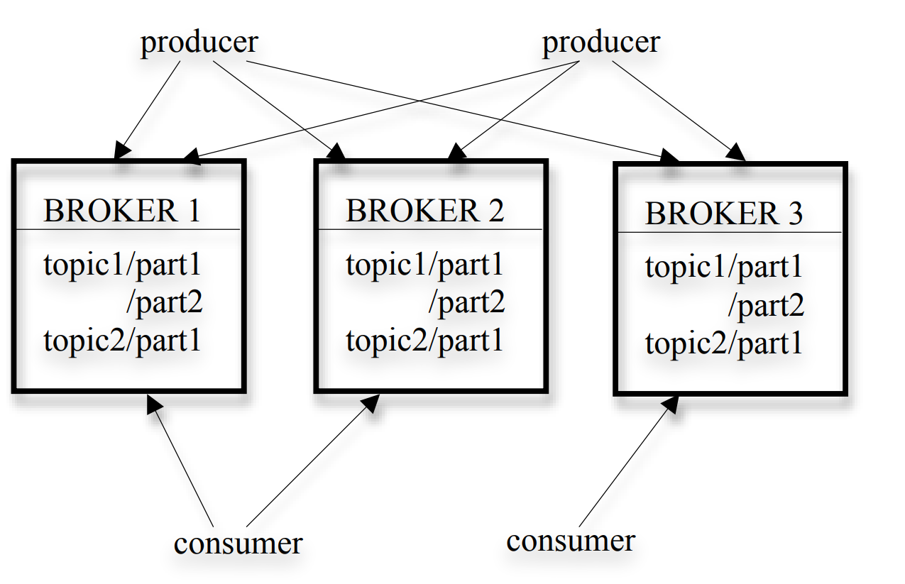
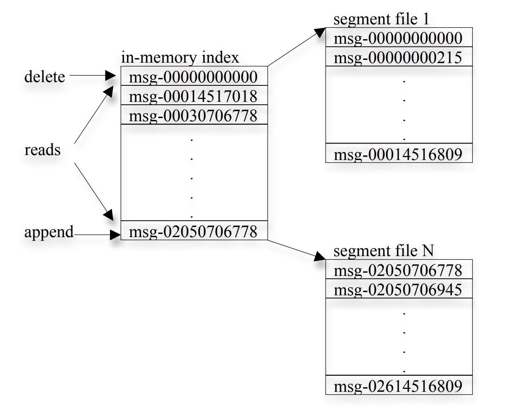
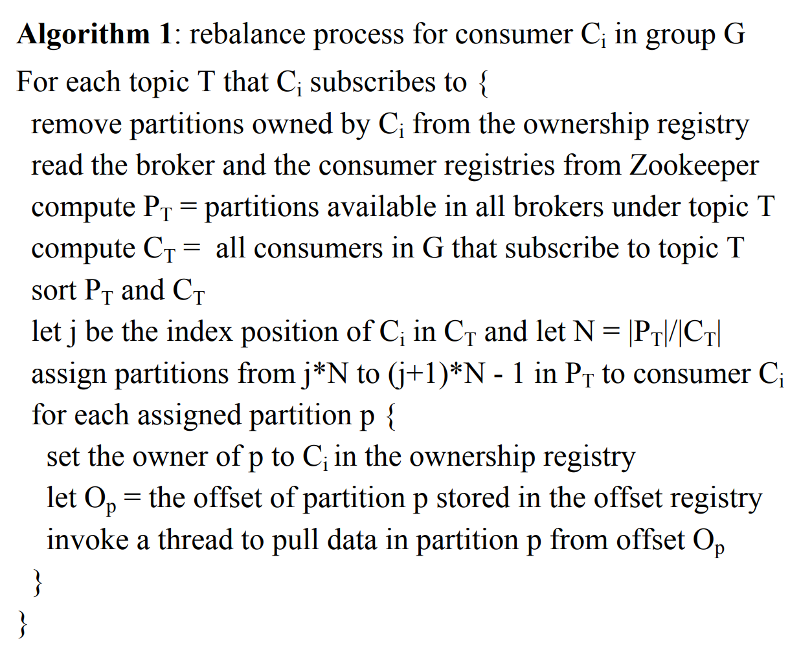
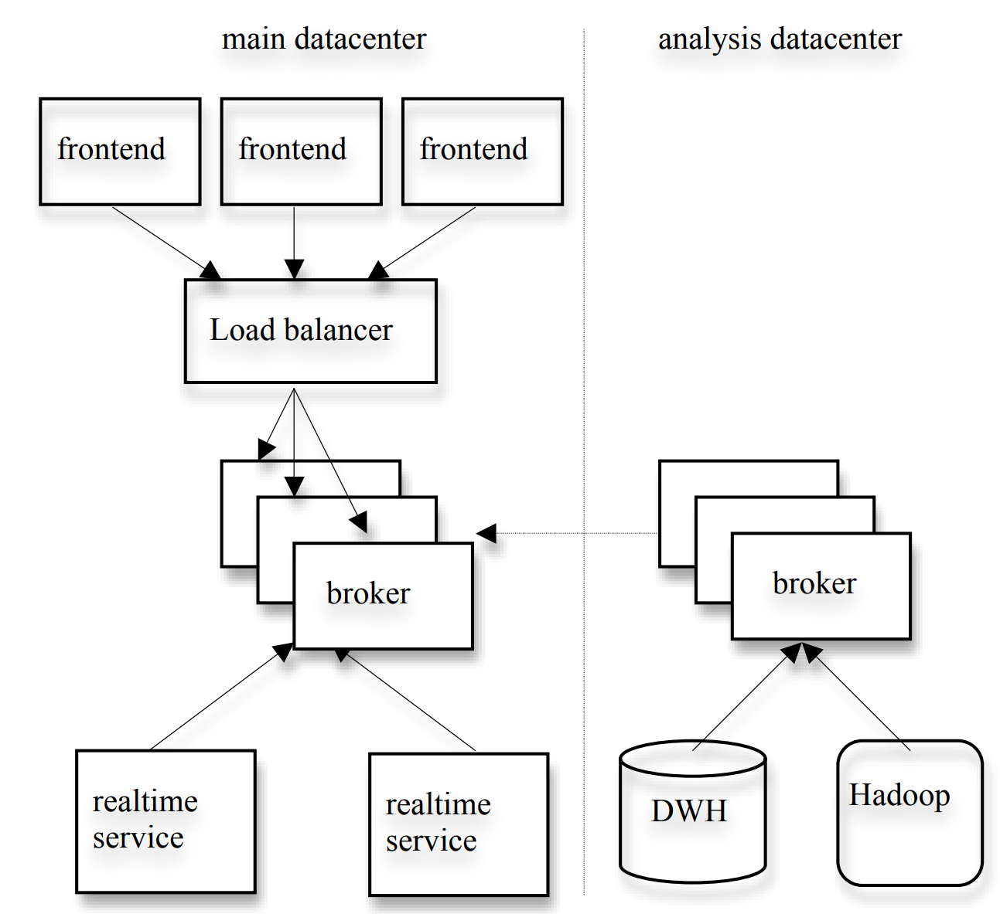
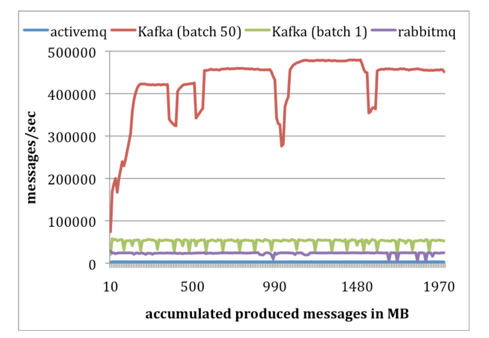
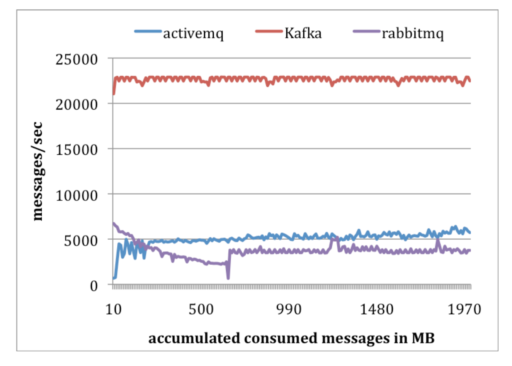

# Kafka: a Distributed Messaging System for Log Processing

## Abstract
日志处理如今已成费互联网公司数据管道中的关键环节。我们推出了 Kafka，一套由我们研发的分布式消息系统，专门用于以低延迟方式采集并传输海量日志数据。这套系统借鉴了现有日志聚合系统和消息系统的思路，既适用于**离线**处理，也适用于**在线**消息消费。为了让 Kafka 具备更高的效率和可扩展性，我们在设计上做出了一些看似不那么传统、但非常务实的选择。实验结果表明，与另外两种流行的消息系统相比，Kafka 在性能上更胜一筹。我们已经在生产环境中使用 Kafka 一段时间了，目前它每天都在处理数百 GB 的新增数据。

## Introduction
任何一家具有一定规模的互联网公司，都会产生大量的"日志"数据。这类数据通常涵盖两大类：一是**用户行为事件**，包括登录、页面浏览、点击、"点赞"、分享、评论及搜索查询等；二是**运营指标**，如服务调用栈、调用延迟、错误信息，以及各机器的 CPU、内存、网络、磁盘使用率等系统指标。长期以来，日志数据一直是数据分析的基础组成部分，被广泛用于追踪用户活跃度、系统资源利用率及其他各类指标。然而，随着互联网应用的发展趋势不断演进，行为数据已不再局限于离线分析，而是直接融入生产数据管道，驱动着各类线上功能的实现，具体包括：
1. **搜索相关性**优化；
2. **个性化推荐**，可基于内容热度或用户行为流中的共现关系来驱动；
3. **广告定向投放与效果归因**；
4. **安全防护**，用于识别和拦截垃圾信息、恶意爬取等滥用行为；
5. **信息流**功能，将用户的状态更新或操作动态汇聚呈现给其"好友"或"关注者"。

将日志数据用于生产环境的实时场景，给数据系统带来了全新的挑战，这是因为日志数据的体量往往比"业务本体"数据高出几个数量级。以搜索、推荐和广告为例，这些场景通常需要计算精细粒度的点击率。它们不仅要为每一次用户点击生成日志记录，还要为页面上数十条未被点击的内容逐一留存记录。仅就规模而言，中国移动每天采集 5 至 8TB 的通话记录，而 Facebook 每天汇聚的各类用户行为事件数据则接近 6TB。

早期处理此类数据的系统，大多依赖于从生产服务器上直接抓取日志文件再进行分析。近年来，业界已陆续构建出多个专用的分布式日志聚合系统，典型代表包括 Facebook 的 Scribe、Yahoo 的 Data Highway 以及 Cloudera 的 Flume。这些系统的主要定位是将日志数据采集并导入数据仓库或 Hadoop，以供离线处理消费。然而，在 LinkedIn（一家社交网络平台）的实践中，我们发现：除了传统的离线分析需求之外，我们还需要以秒级延迟支撑上文提到的大多数实时应用场景。这是现有系统难以胜任的。

为此，我们构建了一套专为日志处理设计的新型消息系统——Kafka，它融合了传统日志聚合系统与消息系统各自的优势。
1. Kafka 具备分布式、可扩展的特性，能够提供高吞吐量；
2. 它对外暴露了类似消息系统的 API，允许应用程序实时消费日志事件。

目前，Kafka 已开源，并在 LinkedIn 生产环境中稳定运行超过 6 个月。由于我们可以用这一套系统统一承载所有类型日志数据的在线与离线消费，基础设施的复杂度也因此大幅降低。本文其余部分的结构安排如下：
+ 第 2 节回顾传统消息系统与日志聚合系统；
+ 第 3 节介绍 Kafka 的整体架构及其核心设计原则；
+ 第 4 节描述 Kafka 在 LinkedIn 的实际部署情况；
+ 第 5 节呈现 Kafka 的性能评测结果；
+ 第 6 节展望未来工作并作出总结。

## Related Work
传统企业级消息系统由来已久，长期以来在异步数据流处理领域扮演着事件总线的核心角色。然而，它们往往并不适合用于日志处理场景，原因主要有以下几点。
1. **企业级系统的功能定位与日志处理需求存在错位。** 这类系统通常着力于提供丰富的消息投递保障机制。例如，IBM WebSphere MQ 支持事务性操作，允许应用程序以原子方式将消息写入多个队列；JMS 规范则允许每条消息在消费后单独确认，且确认顺序可以与消费顺序不一致。然而对于日志采集场景而言，这些保障机制往往是大材小用——偶尔丢失几条页面浏览事件，根本无伤大雅。这些用不上的特性，只会徒增系统 API 和底层实现的复杂度。
2. **许多系统并未将高吞吐量作为首要设计目标。** 以 JMS 为例，它没有提供任何允许生产者将多条消息合并为单次请求批量发送的 API，导致每条消息都需要独占一次完整的 TCP/IP 往返通信，这对于我们所面对的高吞吐量需求而言根本无法满足。
3. **这些系统对分布式场景的支持普遍薄弱。** 它们缺乏将消息分区并分散存储到多台机器上的便捷机制。
4. **许多消息系统默认消息会被几乎及时地消费掉**，因此待消费消息的积压队列通常很短。一旦消息出现大量堆积，系统性能便会急剧下降——而这恰恰是离线消费场景的常态，例如数据仓库类应用往往采用周期性批量拉取的方式，而非持续消费。

近年来，业界已涌现出多个专用的日志聚合系统。Facebook 采用的是名为 Scribe 的系统，每台前端机器通过 socket 将日志数据发送至一组 Scribe 机器，后者对日志条目进行汇聚，并定期将其转储至 HDFS 或 NFS 存储设备。Yahoo 的 Data Highway 项目与此类似，由一批机器负责从客户端聚合事件，生成以"分钟"为粒度的文件后写入 HDFS。Flume 则是 Cloudera 推出的一款相对较新的日志聚合系统，它支持可扩展的"管道"与"sink"机制，使日志数据的流式传输更加灵活，同时也具备更完善的内置分布式支持。然而，上述系统大多面向离线日志消费而设计，且往往将底层实现细节（如"分钟文件"）不必要地暴露给消费方。此外，这些系统大多采用"推"模式，由 broker 主动将数据推送给消费者。在 LinkedIn，我们认为"拉"模式更适合我们的应用场景，即每个消费者可以按照自身所能承受的最大速率主动拉取消息，从而避免因数据推送速度超过处理能力而被消息"淹没"。拉模式还带来了另一个好处：便于对消费者进行回溯重放，我们将在第 3.2 节末尾对此展开讨论。

近期，Yahoo! 研究院推出了一套名为 HedWig 的新型分布式发布/订阅系统。HedWig 具备出色的可扩展性和高可用性，并提供强持久化保障。不过，它的设计初衷主要是用于存储数据存储系统的提交日志，应用场景相对专一。

## 3. Kafka Architecture and Design Principles
正是由于现有系统的种种局限，我们研发了基于消息机制的新型日志聚合系统——Kafka。下面先介绍 Kafka 中的几个基本概念。同一类型的消息流由一个***主题（topic）***来标识。***生产者（producer）***可以向某个主题发布消息，已发布的消息随即被持久化存储到一组称为***broker***的服务器上。***消费者（consumer）***则可以订阅一个或多个主题，并通过主动从 broker 拉取数据的方式来消费所订阅的消息。

消息传递在概念上本就简洁明了，我们也力求让 Kafka 的 API 同样保持简洁。与其列出完整的 API 定义，不如通过示例代码来直观展示其用法。下文将给出生产者端的示例代码。在 Kafka 中，消息被定义为一段纯粹的字节载荷（payload），用户可以自由选择偏好的序列化方式对消息进行编码。为了提升效率，生产者可以在单次发布请求中批量发送多条消息。

```
// Sample producer code:
 producer = new Producer(…);
 message = new Message(“test message str”.getBytes());
 set = new MessageSet(message);
 producer.send(“topic1”, set);
```

消费者若要订阅某个主题，首先需要为该主题创建一个或多个消息流，发布到该主题的消息将被均匀分发到这些子流中。Kafka 消息分发的具体机制将在第 3.2 节详细介绍。每个消息流对外提供一个迭代器接口，用于遍历持续产生的消息。消费者通过该迭代器逐条遍历流中的消息并处理其载荷内容。与传统迭代器不同的是，消息流迭代器永不终止，当暂时没有新消息可消费时，迭代器会阻塞等待，直到有新消息发布到该主题为止。Kafka 同时支持两种消息投递模型：一是**点对点模型**，多个消费者共同消费同一份主题消息，每条消息只被处理一次；二是**发布/订阅模型**，多个消费者各自独立获取主题的完整消息副本。

```
// Sample consumer code: 
 streams[] = Consumer.createMessageStreams(“topic1”, 1)
 for (message : streams[0]) {
  bytes = message.payload();
  // do something with the bytes 
 }
```

Kafka 的整体架构如图 1 所示。由于 Kafka 天生是一个分布式系统，因此一个 Kafka 集群通常由多个 broker（代理节点）组成。为了实现负载均衡，一个 topic（主题）会被划分为多个 partition（分区），而每个 broker 会存储其中一个或多个分区。多个生产者和消费者可以同时进行消息的发布与读取。在第 3.1 节中，我们将介绍 broker 上单个分区的组织方式，以及为提升分区访问效率而采用的一些设计选择。在第 3.2 节中，我们将说明生产者和消费者在分布式环境下如何与多个 broker 协同工作。第 3.3 节则讨论 Kafka 所提供的消息投递保障。


图 1

### 3.1 Efficiency on a Single Partition
我们在 Kafka 中做了一些关键设计，以提升整个系统的效率。

**简化存储：** Kafka 的存储布局非常简单。一个主题的每个分区都对应一份逻辑日志。在物理层面上，这份日志由一组大小大致相同的段文件组成，例如每个约 1GB。每当生产者向某个分区发布消息时，broker 只需将消息顺序追加到最后一个段文件中即可。为了获得更好的性能，我们不会在每条消息写入后立刻刷盘，而是等到累计达到可配置的消息数量，或经过一定时间后，再统一将段文件刷新到磁盘。消息只有在完成刷盘之后，才会对消费者可见。

不同于传统的消息系统，Kafka 中存储的消息并没有显式的消息 ID。取而代之的是，每条消息都通过它在日志中的逻辑偏移量（offset）来定位。这样做避免了维护额外索引结构的开销；否则，系统需要建立那种依赖频繁寻道、用于将消息 ID 映射到实际存储位置的随机访问索引。需要注意的是，这里的消息 ID 是单调递增的，但并不是连续递增的。要计算下一条消息的 ID，需要在当前消息 ID 的基础上加上当前消息的长度。下文中，我们将把“消息 ID”和“偏移量”这两个说法不加区分地交替使用。

消费者总是按顺序消费某个特定分区中的消息。如果消费者确认了某个消息偏移量，就意味着它已经收到了该分区中该偏移量之前的所有消息。在底层实现上，消费者会向 broker 异步发起拉取请求，以便 broker 预先准备好一段可供应用消费的数据缓冲区。每个拉取请求都会带上两个关键信息：消费开始的消息偏移量，以及本次可接受的拉取字节数。每个 broker 都会在内存中维护一份有序的偏移量列表，其中包含每个段文件第一条消息的偏移量。broker 通过查找这份偏移量列表，就能定位请求的消息所在的段文件，并将相应数据返回给消费者。当消费者收到一条消息后，它会计算下一条待消费消息的偏移量，并在下一次拉取请求中使用这个偏移量。图 2 展示了 Kafka 日志以及其内存索引的布局，其中每个方框表示一条消息的偏移量。


图 2

**高效传输：** 我们非常重视 Kafka 的数据进出效率。前文已经说明，生产者可以在一次发送请求中提交一批消息。虽然面向最终用户的消费者 API 是按一条一条消息进行迭代的，但在底层实现中，消费者的每次拉取请求实际上也会一次取回多条消息，直到达到某个大小上限，通常是数百 KB。

我们做出的另一个不太传统的选择，是不在 Kafka 这一层显式地把消息缓存到内存中。相反，我们依赖底层文件系统的页缓存（page cache）。这样做的一个主要好处，是避免了双重缓冲，即消息只会在页缓存中保存一份。另一个额外好处是，即使 broker 进程重启，也能够保留“预热”后的缓存状态。由于 Kafka 根本不会在进程内缓存消息，因此它在内存垃圾回收方面的开销非常小，这也使得用基于虚拟机的语言来高效实现 Kafka 成为可能。最后，由于生产者和消费者都是按顺序访问段文件，而消费者通常只会比生产者落后一点点，操作系统常规的缓存策略就会非常有效，尤其是直写缓存（write-through caching）和预读（read-ahead）机制。我们的实践表明，无论是生产还是消费，Kafka 的性能都能够随着数据规模近似线性增长，并且这种稳定表现可以扩展到数 TB 级别的数据量。

此外，我们还专门针对消费者的网络访问做了优化。Kafka 是一个支持多订阅者的系统，同一条消息可能会被多个不同的消费者应用重复消费。通常情况下，把数据从本地文件发送到远程套接字大致需要经历以下几个步骤：
1. 先把数据从存储设备读入操作系统的页缓存；
2. 再把页缓存中的数据拷贝到应用程序缓冲区；
3. 接着把应用程序缓冲区中的数据再拷贝到另一个内核缓冲区；
4. 最后再由内核缓冲区发送到套接字。

而在 Linux 及其他类 Unix 系统中，存在 `sendfile` API，可以直接把字节数据从文件通道传输到套接字通道。这样通常就能省掉上述第 2 步和第 3 步引入的 2 次数据拷贝，以及其中 1 次系统调用。Kafka 正是利用 `sendfile` API，把日志段文件中的数据高效地从 broker 直接传送给消费者。

**无状态 broker：** 与大多数其他消息系统不同，在 Kafka 中，关于每个消费者已经消费了多少数据这一信息，并不是由 broker 维护的，而是由消费者自己维护。这样的设计大大降低了 broker 端的复杂度和运行开销。不过，这种设计也带来了一个问题：消息删除会变得不那么直接，因为 broker 并不知道是否所有订阅者都已经消费了这条消息。Kafka 对此采用了一种非常简单的基于时间的保留策略 SLA 来解决：一条消息只要在 broker 中保留超过某个设定时长，就会被自动删除，这个时长通常是 7 天。这种方案在实践中效果很好。大多数消费者（包括离线消费者）都会按天、按小时，或者实时地完成消费。而且 Kafka 的性能不会因为数据量变大而明显下降，这也使得较长时间的数据保留成为可行方案。

这种设计还有一个很重要的附带好处：消费者可以主动把消费位置回退到较早的某个偏移量，然后重新消费数据。虽然这打破了传统队列“一条消息消费完就过去了”的常见语义，但对很多消费者来说，这恰恰是一个非常关键的能力。例如，当消费者中的应用逻辑出现错误时，在修复问题之后，应用就可以把相关消息重新回放一遍。这对于向数据仓库或 Hadoop 系统执行 ETL 数据加载尤其重要。再比如，消费者处理过的数据可能只是周期性地刷写到持久化存储中，例如全文索引系统。如果消费者在刷写之前崩溃了，那么那部分尚未落盘的数据就会丢失。在这种情况下，消费者可以把尚未刷写的数据中最小的偏移量记录为检查点；等它重启后，再从这个偏移量重新开始消费。还需要指出的是，相比推送模型，这种“回退并重放消费者”的能力在拉取模型中要更容易实现。

### 3.2 Distributed Coordination
下面我们来说明，在分布式环境下，生产者和消费者是如何工作的。每个生产者都可以将消息发布到一个随机选定的分区，或者根据**分区键（partitioning key）**以及**分区函数（partitioning function）**，发送到语义上确定的某个分区。接下来，我们将重点讨论消费者如何与 broker 进行交互。

Kafka 引入了**消费者组（consumer group）**的概念。一个消费者组由一个或多个消费者组成，它们共同消费一组已订阅的主题；也就是说，在同一个消费者组内部，每条消息只会投递给组内的某一个消费者。而不同的消费者组之间，则会各自独立地消费这整套订阅消息，彼此之间不需要进行协调。同一组内的消费者可以运行在不同的进程中，也可以部署在不同的机器上。我们的目标是：在不过多增加协调开销的前提下，把 broker 中存储的消息尽可能均匀地分配给各个消费者。

我们的第一个决定，是把一个主题中的**分区（partition）**设定为并行处理的最小单位。这意味着，在任意时刻，对于每个消费者组来说，一个分区中的所有消息都只能由组内的**一个**消费者来消费。如果我们允许多个消费者同时消费同一个分区，那么它们就必须彼此协调“谁来消费哪些消息”，这就会引入加锁以及状态维护等额外开销。相比之下，在我们的设计里，消费进程只需要在消费者进行**负载再均衡（rebalance）**时相互协调，而这类情况并不频繁。为了真正做到负载均衡，我们要求一个主题中的分区数量要明显多于每个消费者组中的消费者数量。这个目标可以通过为主题设置较多的分区来轻松实现。

我们的第二个设计选择，是**不引入一个中心化的“主节点（master）”**，而是让各个消费者之间**以去中心化的方式自行协调**。这样做的原因在于：如果增加一个主节点，系统会变得更复杂，因为我们还得额外处理**主节点失效**带来的问题。为了实现这种协调机制，我们采用了一个**高可用的一致性服务，即ZooKeeper**。ZooKeeper 提供了一套非常简单、类似文件系统的 API。你可以对某个路径执行以下操作：
- 创建路径
- 设置路径对应的值
- 读取路径的值
- 删除路径
- 查看某个路径下的子节点

除此之外，ZooKeeper 还有几个很重要的特性：
1. **Watcher 机制**：  
   可以在某个路径上注册监听器；一旦该路径的子节点发生变化，或者该路径的值被修改，相关客户端就会收到通知。
2. **临时节点（ephemeral）**：  
   路径不仅可以创建为持久节点（persistent），也可以创建为临时节点。  
   所谓临时节点，就是如果创建它的客户端断开或消失了，这个节点会被 ZooKeeper 服务器自动删除。
3. **多副本复制**：  
   ZooKeeper 会把数据复制到多个服务器上，因此数据具有很高的**可靠性**和**可用性**。

Kafka 使用 ZooKeeper 主要完成以下几项工作：
1. **感知 broker 和 consumer 的加入与退出**
2. **当这些变化发生时，触发各个 consumer 执行再均衡（rebalance）**
3. **维护消费关系，并记录每个 partition 的消费偏移量（offset）**

具体来说，每个 broker 或 consumer 在启动时，都会把自己的信息写入 ZooKeeper 中对应的 **broker 注册表**或**consumer 注册表**。其中：
- **broker 注册表**记录的是：
  - broker 的主机名和端口
  - 它所存储的 topic 和 partition 集合

- **consumer 注册表**记录的是：
  - 某个 consumer 属于哪个 consumer group
  - 它订阅了哪些 topic

在 ZooKeeper 中，broker 注册表，consumer 注册表，ownership 注册表，这三类路径都是**临时节点（ephemeral）**。而 **offset 注册表**中的路径则是**持久节点（persistent）**。这样设计的好处是：
- 如果某个 **broker 故障**，那么它在 broker 注册表中的相关信息，以及它所对应的所有 partition 信息，都会被**自动移除**。
- 如果某个 **consumer 故障**，那么它在 consumer 注册表中的条目，以及它在 ownership 注册表中所“拥有”的所有 partition 记录，也都会**自动消失**。

此外，每个 consumer 都会同时在 **broker 注册表**和 **consumer 注册表**上注册 ZooKeeper 的 **watcher**。因此，只要 broker 集合或 consumer group 发生变化，consumer 就会立刻收到通知。

当一个 consumer **初次启动**时，或者它通过 watcher 得知 **broker / consumer 发生变化**时，就会发起一次 **再均衡（rebalance）**，以确定自己接下来应该消费哪些 partition。这个过程可由“算法 1”描述，核心步骤如下：
1. consumer 先从 ZooKeeper 读取 **broker 注册表**和**consumer 注册表**；
2. 对于每个已订阅的 topic `T`，计算：
   - `P_T`：该 topic 当前可用的 partition 集合
   - `C_T`：订阅该 topic 的 consumer 集合
3. 然后把 `P_T` 按照 `|C_T|` 的数量划分成若干区间（chunks）；
4. 每个 consumer 再以**确定性的方式**选择其中一块，作为自己负责的 partition 子集；
5. 对于它选中的每个 partition，consumer 都会在 **ownership 注册表**中把自己写成这个 partition 的新 owner；
6. 接着，consumer 会启动线程，从自己“拥有”的各个 partition 中拉取数据，起始位置就是 **offset 注册表**里保存的 offset；
7. 在持续消费过程中，consumer 还会定期把最新的消费进度回写到 **offset 注册表**中。


算法 1

当一个 consumer group 中存在多个 consumer 时，只要 broker 或 consumer 发生变化，**组内所有 consumer 都会收到通知**。不过，这些通知到达各个 consumer 的时间可能会有细微差别。因此，就可能出现这样一种情况：**某个 consumer 在执行 rebalance 时，试图接管一个其实仍由另一个 consumer 持有的 partition。**遇到这种冲突时，处理方式很直接：
- 当前这个 consumer 会先**释放自己现在持有的所有 partition**
- 然后**稍等片刻**
- 再重新尝试执行 **rebalance**

在实际运行中，这种再均衡过程通常只需要**重试几次**就能稳定下来。

当一个**新的 consumer group**刚被创建时，**offset 注册表中还没有任何消费位移记录**.
- **最小 offset**，或者
- **最大 offset**

开始消费，具体取决于系统配置。而这个起始 offset，是通过 broker 提供的 API 获取的。

### 3.3 Delivery Guarantees
总体来说，Kafka 只保证 **“至少一次投递”（at-least-once delivery）**。至于 **“恰好一次投递”（exactly-once delivery）**，通常需要依赖 **两阶段提交（two-phase commit）** 来实现，而对文中所说的应用场景来说，并没有这个必要。在大多数情况下，一条消息对每个 consumer group 来说，实际上通常只会被消费一次。但如果某个 consumer 进程**没有正常关闭而是直接崩溃**，那么后来接管它所负责 partition 的 consumer，就可能会再次收到一部分**重复消息**。这些重复消息，通常出现在**上一次成功提交到 ZooKeeper 的 offset 之后**。因此，如果应用本身**非常在意重复消费问题**，就需要自行加入**去重逻辑**。去重可以基于以下信息来实现：
- Kafka 返回给 consumer 的 **offset**
- 消息内部某个 **唯一标识键（unique key）**

相比使用两阶段提交，这种由应用层自行去重的方式，通常**成本更低，也更划算**。

Kafka 能保证：**同一个 partition 中的消息，会按原有顺序依次投递给 consumer**。但如果消息来自**不同的 partition**，Kafka **不保证它们之间的全局顺序**。也就是说：
- **单分区内有序**
- **跨分区之间无序保证**

为了避免日志数据损坏，Kafka 会为日志中的**每一条消息**保存一个 **CRC 校验值**。如果 broker 发生了某种 **I/O 错误**，Kafka 就会执行恢复流程，把那些 **CRC 校验不一致** 的消息清理掉。同时，把 CRC 做到**消息级别**还有一个额外好处：无论是在消息被生产之后，还是被消费之后，都可以据此检查是否发生了**网络传输错误**。

如果某个 **broker 宕机**，那么存放在它上面、**还没有被消费的消息**就会暂时**无法访问**。如果这个 broker 的存储系统遭到了**永久性损坏**，那么这些尚未消费的消息就会被**永久丢失**。为了解决这个问题，未来计划在 Kafka 中加入**内置复制机制（built-in replication）**，把每条消息**冗余保存到多个 broker 上**，从而提升数据的可靠性和容错能力。

## 4. Kafka Usage at LinkedIn
本节介绍的是：**LinkedIn 是如何使用 Kafka 的**。图 3 展示了他们部署方案的一个简化版本。LinkedIn 的做法是，在每一个运行用户前台服务的**数据中心（datacenter）**旁边，部署一个对应的 **Kafka 集群**。也就是说，**每个数据中心基本都会配套一个本地 Kafka 集群**。前端服务会生成各种类型的**日志数据**，并以**批量（batch）**的方式，把这些数据发布到本地的 Kafka broker 上。为了把这些发布请求尽可能均匀地分配到各个 Kafka broker，系统使用了一个**硬件负载均衡器（hardware load-balancer）**。与此同时，Kafka 的**在线消费者（online consumers）**也运行在同一个数据中心内的服务中，从而就近消费数据。


图 3

LinkedIn 还在一个**独立的数据中心**部署了一套 Kafka 集群，专门用于**离线分析**。这个数据中心在地理位置上靠近他们的 **Hadoop 集群** 和其他**数据仓库基础设施**，这样便于后续数据处理与分析。这套 Kafka 实例中运行着一组**内嵌消费者（embedded consumers）**，负责从在线数据中心中的 Kafka 实例里拉取数据。随后，他们会再运行数据加载任务，把这个**副本 Kafka 集群**中的数据导入 Hadoop 和数据仓库中，再在这些平台上执行各种**报表任务**和**分析处理**。此外，这个 Kafka 集群还被用于：
- **原型验证（prototyping）**
- 直接针对原始事件流运行一些**简单脚本**
- 支持临时性的**即席查询（ad hoc querying）**

即使没有做太多额外调优，整条数据处理链路的**端到端延迟**平均大约也只有 **10 秒**，已经足以满足他们的需求。

他们的跟踪体系中还包含一个**审计系统（auditing system）**，用于验证整条数据处理链路中**没有发生数据丢失**。为了实现这一点，每条消息在生成时都会附带**时间戳（timestamp）**和**生成该消息的服务器名称**。此外，他们还对每个 **producer** 做了埋点，使其能够**定期生成监控事件（monitoring event）**。这些监控事件会记录：在一个固定时间窗口内，该 producer 向每个 topic 实际发布了多少条消息。随后，producer 会把这些监控事件发布到 Kafka 中一个**单独的 topic** 里。这样一来，consumer 就可以：
1. 统计自己从某个 topic 实际接收到了多少条消息；
2. 再将这个数量与监控事件中的发布数量进行比对；
3. 由此验证数据是否完整、传输是否正确。

将数据导入 **Hadoop 集群**，是通过实现一种专门的 **Kafka 输入格式（input format）** 来完成的。这种输入格式使得 **MapReduce 任务可以直接从 Kafka 读取数据**。具体流程是：
1. 一个 MapReduce 作业先读取原始数据；
2. 然后对这些数据进行**分组**和**压缩**；
3. 以便后续能够更高效地处理和分析。

这里，Kafka 的两个设计特性再次发挥了作用：
- **broker 是无状态的（stateless broker）**
- **消息 offset 保存在客户端侧（client-side storage of offsets）**

正因为如此，MapReduce 的任务管理机制（也就是那种**允许任务失败后重新启动**的机制）才能比较自然地处理数据加载过程。即使某个任务中途重启，也能够避免**消息重复**或**消息丢失**。另外，只有当整个作业**成功完成**时，数据和对应的 offset 才会真正写入 **HDFS**。

我们选择使用 **Avro** 作为序列化协议，主要是因为它**效率高**，而且支持**模式演进**。对于每条消息，我们都会在负载中保存其 **Avro schema 的 ID** 以及对应的**序列化字节数据**。这样一来，就能通过 schema 对生产者和消费者之间的数据格式进行约束，从而保证双方兼容。我们还使用了一个**轻量级的 schema registry 服务**，用于将 schema ID 映射到实际的 schema 内容。消费者收到消息后，会先到 schema registry 中查询对应的 schema，再利用该 schema 将字节数据反序列化为对象。由于同一个 schema 的内容是**不可变的**，因此这种查询通常**每个 schema 只需要做一次**。

## 5. Experimental Results
我们开展了一项实验研究，对比了 **Kafka** 与 **Apache ActiveMQ v5.4** 以及 **RabbitMQ v2.4** 的性能表现。其中，ActiveMQ 是一种广泛使用的开源 **JMS** 实现，而 RabbitMQ 则是一个以高性能著称的消息系统。在实验中，我们使用了 ActiveMQ 默认的持久化消息存储机制 **KahaDB**。虽然本文未展示相关结果，但我们也测试了另一种 **AMQ 消息存储**，其性能与 KahaDB 非常接近。只要条件允许，我们都尽量在所有系统中采用**可比、对等的配置参数**。

我们的实验在两台 **Linux** 机器上进行。每台机器都配备了 **8 个 2GHz 处理器核心、16GB 内存，以及 6 块采用 RAID 10 的磁盘**。两台机器之间通过 **1Gb 网络链路**互连。其中，一台机器用作 **Broker**，另一台机器则根据实验需要充当 **Producer** 或 **Consumer**。

**生产者测试：** 在所有系统中，我们都将 **Broker** 配置为以**异步方式**将消息刷写到持久化存储中。对于每个系统，我们都使用**单个生产者**发布总计 **1000 万条消息**，每条消息大小为 **200 字节**。对于 Kafka，我们将生产者配置为按 **1** 和 **50** 两种批量大小发送消息。相比之下，ActiveMQ 和 RabbitMQ 似乎并没有简便的消息批处理方式，因此我们将其近似视为采用 **批大小为 1** 的情况。实验结果如图 4 所示。其中，**横轴**表示单位时间内发送到 Broker 的数据量（MB），**纵轴**表示生产者吞吐量，即**每秒发送的消息数**。平均来看，当批大小分别为 **1** 和 **50** 时，Kafka 的消息发布速率分别可达到 **5 万条/秒** 和 **40 万条/秒**。这一结果相比 ActiveMQ **高出几个数量级**，相比 RabbitMQ 也**至少高出 2 倍**。


图 4

Kafka 之所以表现明显更好，主要有几个原因。首先，目前 **Kafka 生产者**在发送消息时**不会等待 Broker 的确认应答**，而是按照 Broker 所能承受的速度尽可能快地持续发送消息，这显著提升了生产端的吞吐量。当批量大小为 **50** 时，单个 Kafka 生产者几乎就能把生产者与 Broker 之间的 **1Gb 网络链路跑满**。对于**日志聚合**这类场景来说，这是一种合理的优化方式，因为数据需要**异步发送**，以避免给在线流量服务引入额外延迟。当然，这样做的代价在于：如果 Broker 不对生产者进行确认，就**无法保证**每一条已发布的消息都一定被 Broker 实际接收。对于许多日志数据而言，只要丢失的消息数量相对较少，那么**以一定的持久性为代价换取更高吞吐量**是可以接受的。不过，对于更关键的数据，我们计划在未来进一步解决其**持久性保障**问题。

第二，Kafka 采用了**更高效的存储格式**。平均来看，在 Kafka 中，每条消息的额外开销只有 **9 字节**，而在 ActiveMQ 中则高达 **144 字节**。这意味着，对于同样的 **1000 万条消息**，ActiveMQ 所占用的存储空间比 Kafka **多出约 70%**。ActiveMQ 的额外开销一部分来自 **JMS 要求的较为臃肿的消息头**，另一部分则来自维护各种**索引结构**所需的成本。我们观察到，ActiveMQ 中最繁忙的线程之一，大部分时间都耗费在访问 **B-Tree** 上，用于维护消息的元数据和状态。最后，**批处理**通过分摊 **RPC 开销**，显著提升了系统吞吐量。在 Kafka 中，当批量大小设置为 **50 条消息**时，吞吐量提升了**将近一个数量级**。

**消费者测试：** 在第二个实验中，我们测试了消费者端的性能。与前面的实验一样，对于所有系统，我们都只使用**单个消费者**来接收总计 **1000 万条消息**。我们对各系统进行了统一配置，使得每次拉取请求预取的数据量大致相同，即**最多 1000 条消息，约 200KB**。对于 ActiveMQ 和 RabbitMQ，我们将消费者的**确认模式**设置为**自动确认**。由于所有消息都能够装入内存，因此各系统在读取数据时，实际上都是从底层文件系统的**页缓存**或某些**内存缓冲区**中提供数据。实验结果如图 5 所示。


图 5

平均来看，Kafka 的消费速率达到 **每秒 22,000 条消息**，是 ActiveMQ 和 RabbitMQ 的 **4 倍以上**。造成这一结果的原因可以从几个方面来理解。首先，由于 Kafka 采用了**更高效的存储格式**，从 Broker 传输到 Consumer 的数据字节数更少。其次，ActiveMQ 和 RabbitMQ 中的 Broker 都需要维护**每条消息的投递状态**。我们观察到，在该测试过程中，ActiveMQ 的一个线程一直在忙于将 **KahaDB** 的页面写入磁盘。相比之下，Kafka 的 Broker 在测试期间**没有发生磁盘写入活动**。最后，Kafka 通过使用 **sendfile API**，进一步降低了数据传输过程中的开销。

在本节最后，我们想说明的是，这项实验的目的**并不是证明**其他消息系统不如 Kafka。毕竟，**ActiveMQ 和 RabbitMQ 在功能丰富性方面都强于 Kafka**。这组实验真正想表达的是：**针对特定场景进行专门化设计的系统，能够带来多大的性能提升潜力**。

## 6. Conclusion and Future Works
我们提出了一种名为 `Kafka` 的新系统，用于处理**海量日志数据流**。与消息系统类似，`Kafka` 采用**基于拉取的消费模型**，使应用程序能够按照自身节奏消费数据，并在需要时**回溯消费进度**。由于专门面向**日志处理场景**进行设计，`Kafka` 的吞吐量明显高于传统消息系统。同时，它还内置了**分布式支持**，具备**横向扩展**能力。我们已经在 `LinkedIn` 成功将 `Kafka` 应用于**离线**和**在线**两类业务场景。

未来我们希望从几个方向继续推进这项工作。

首先，我们计划在多个 **Broker** 之间加入**内置的消息副本机制**，从而即使在发生**不可恢复的机器故障**时，也能保证数据的**持久性**和**可用性**。我们希望同时支持**异步复制**和**同步复制**两种模式，以便在**生产者延迟**和**可靠性保障强度**之间进行权衡。应用可以根据自身对**持久性、可用性和吞吐量**的要求，选择合适的冗余级别。

其次，我们希望在 `Kafka` 中加入一定的**流处理能力**。在从 `Kafka` 读取消息之后，实时应用通常还需要执行一些相似的处理操作，例如**基于窗口的统计**，或者将消息与**辅助存储**中的记录、或与**另一条数据流**中的消息进行关联。最基础的支持方式，是在消息发布时按照 **join key** 对消息进行**语义分区**，使具有相同键的消息都进入同一个分区，从而最终由同一个消费者进程处理。这样就为在**消费者机器集群**上进行分布式流处理奠定了基础。

在此基础上，我们认为，如果还能提供一套实用的**流处理工具库**，例如不同类型的**窗口函数**或 **join 技术**，将会对这类应用带来很大帮助。
