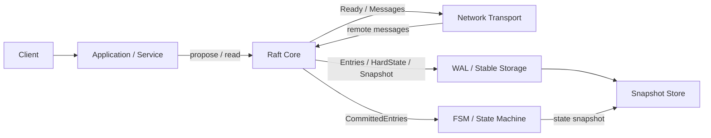

# Raft

> **范围说明**  
> Raft 论文定义的是协议、状态机和安全性质，并没有附带一个唯一、长期维护的“官方生产实现”。因此，本文在“实现”部分主要参考三类最具代表性的公开工程：**etcd-io/raft**（Go，极简核心库）、**HashiCorp raft**（Go，面向应用 FSM 的库）和 **TiKV 的 raft-rs**（Rust，面向低层引擎、适合 Multi-Raft 的核心库）。[^etcd][^hashiraft][^raftrs][^tikv_multi]

## 一句话概括

**Raft 是一个围绕“复制日志（replicated log）”设计的崩溃容错一致性算法：它先选主，再由 leader 串行化写入、复制日志、推动提交与应用，最终把一个服务器组表现为一个单一、可靠、可线性化的状态机。**[^paper]

---

## 1. Raft 要解决什么问题？

Raft 解决的是**复制状态机（replicated state machine）的一致性问题**。每个节点都维护同一份日志；只要所有节点以相同顺序执行相同命令，且状态机本身是确定性的，那么它们就会得到同样的状态和输出。Raft 的职责，就是在节点崩溃、网络延迟、分区、丢包、重排等非拜占庭故障下，仍然让这份日志保持一致。论文给出的目标很明确：在**非拜占庭条件**下保证安全性；只要多数节点存活且能通信，就保持可用；并且一致性**不依赖时序假设**，时钟异常和消息延迟最多影响可用性，不应破坏正确性。[^paper]

从系统视角看，Raft 不是数据库，也不是 KV 系统；它更像一个**一致性复制内核**。真实系统会把它包在更高层：上层是客户端请求、元数据或事务命令，下层是 WAL、快照、网络传输、状态机应用和监控运维。Kubernetes 的 etcd、Consul、Nomad、Vault、TiKV、CockroachDB 等都把 Raft 放在各自系统的关键控制面或复制层里。[^k8s][^consul][^nomad][^vault][^tikv_overview][^cockroach_rep][^cockroach_arch]

---

## 2. 设计初衷：Raft 为什么会出现？

Raft 出现的直接背景，是作者认为 **Paxos 不适合作为工程实现与教学的基础**。论文指出，Paxos 的单值分解方式和对称式 peer-to-peer 核心，导致真实系统最后往往会偏离原始描述，形成一个“看起来不太像 Paxos 的实现”；这会增加实现时间、出错概率和理解难度。Raft 的目标因此不是“再造一个更快的 Paxos”，而是**提供一个更适合系统构建和教育的共识算法**。[^paper]

论文对目标的表述非常直接：Raft 必须是**完整的、实用的、安全的、可用的、常见操作高效的**；但最重要、也最难的目标，是**可理解性（understandability）**。作者希望读者不只是“知道 Raft 能工作”，而是“知道它为什么这样工作”。[^paper]

这个目标并不只是论文写作风格，而是 Raft 的一等设计约束。作者明确说，他们在多个分叉设计点上优先比较“哪个更容易解释、哪个状态空间更小、哪个更容易建立直觉”。论文还做了一个用户研究：43 名学生在学习 Raft 与 Paxos 之后，有 33 人在 Raft 题目上的成绩更高；这说明 Raft 的“可理解性优先”并不只是作者主观感受，而是能被实验观察到。[^paper][^study]

---

## 3. 设计理念：Raft 为什么更容易实现？

### 3.1 分而治之：把共识拆成几个相对独立的问题

Raft 不是把“共识”作为一个巨大整体来描述，而是主动拆成几块：

1. **Leader election**：谁来当主。  
2. **Log replication**：主节点怎样复制日志。  
3. **Safety**：为什么不会出现两个不同的已提交结果。  
4. **Membership changes**：如何在线调整成员。[^paper]

这种分解降低了心智负担。你可以先理解“怎么选主”，再理解“有主之后怎么复制”，最后理解“为什么安全”；相比之下，Paxos 的许多讲解把“安全”和“提议过程”缠绕得更紧。

### 3.2 强领导（strong leader）

Raft 的核心取舍，是**用更强的 leader 简化整个系统**。论文明确强调：Raft 中日志条目只从 leader 流向 follower；leader 接收客户端命令、决定日志位置、推动复制和提交，这比对称式协议更容易建立工程直觉。[^paper]

这种选择的代价也很明显：单个 Raft group 的写入、提交和读一致性路径，会天然围绕 leader 收敛，leader 可能成为瓶颈。但换来的好处是**实现边界清晰**、**状态转移少**、**排障路径短**。

### 3.3 缩小状态空间，减少非确定性

Raft 另一项关键方法，是**状态空间缩减**。论文明确说，它通过限制日志不出现“洞”、限制日志不一致的形成方式、尽量消除非确定性，来让系统更容易解释和证明。只有在少数场景——例如 leader election——它才故意引入**随机化**，因为随机化可以减少复杂分支，让“任何候选者都可能赢”的行为更容易分析。[^paper]

---

## 4. 协议核心：论文里的 Raft 到底包含什么？

### 4.1 节点角色与 term

Raft 节点总是在三种状态之一：**follower、candidate、leader**。集群中的时间被切分成单调递增的 **term**。term 既是“时代编号”，又是“逻辑时钟”。一旦节点看到更高 term，就会更新自己的 term，并在需要时退回 follower。[^paper]

这一点非常重要：Raft 的许多安全性判断，本质上都是“**高 term 覆盖低 term**”的工程化表达。

### 4.2 两类核心 RPC，再加一个快照 RPC

论文把核心协议压缩成非常少的消息种类：

- `RequestVote`：候选者拉票。  
- `AppendEntries`：leader 复制日志，也兼作心跳。  
- `InstallSnapshot`：给严重落后的 follower 发送快照。[^paper]

消息类型少，是 Raft 易学、易实现的一个原因。论文甚至在相关工作部分强调，Raft 的消息种类比若干同类协议更少。[^paper]

### 4.3 Leader election：随机超时选主

一个 follower 如果在选举超时内没有收到当前 leader 的有效心跳，就会转成 candidate，递增 term、给自己投票，并向其他节点发送 `RequestVote`。只要拿到多数票，就成为 leader。由于每个节点在一个 term 内最多投一次票，所以同一 term 最多只有一个 leader。[^paper]

Raft 的选主依赖一个非常经典的时序关系：

> `broadcastTime ≪ electionTimeout ≪ MTBF`[^paper]

这句话的含义是：广播心跳的时间应远小于选举超时，而选举超时又应远小于平均故障间隔。Raft **不依赖时序保证安全**，但它的**可用性**高度依赖这组参数是否合理。

### 4.4 Log replication：leader 负责把日志推进到多数派

leader 接收客户端命令后，先把命令附加到本地日志，然后通过 `AppendEntries` 复制给 follower。一个条目被 leader 复制到多数节点后，leader 才能把它视为 **committed**，随后推进 `commitIndex`，并让各节点按日志顺序把条目应用到状态机。[^paper]

这套机制里最关键的工程点有两个：

- `AppendEntries` 带有 `prevLogIndex` 和 `prevLogTerm`，follower 只有在自己的日志中找到完全匹配的前置项时，才接受新的 entries。  
- 如果 follower 发现“相同 index、不同 term”的冲突条目，就删除该条目及之后所有条目，然后接受 leader 的版本。[^paper]

这就形成了 Raft 的日志修复机制：**leader 不需要理解 follower 的全部历史，只需不断用前置索引与前置任期去探测和回退**。

### 4.5 Safety：Raft 靠哪些不变量保证正确？

论文把 Raft 的关键安全性质总结为 5 个属性：

1. **Election Safety**：同一 term 至多选出一个 leader。  
2. **Leader Append-Only**：leader 只追加，不覆盖/删除自己日志中的条目。  
3. **Log Matching**：如果两个日志在同一 index 和 term 上有相同条目，则在此之前的所有条目都相同。  
4. **Leader Completeness**：某 term 中已提交的条目，必然出现在所有更高 term 的 leader 日志里。  
5. **State Machine Safety**：如果某节点已经把某 index 的日志应用到状态机，任何其他节点将来都不可能在同一 index 应用不同的日志。[^paper]

这 5 条几乎就是“读懂 Raft 是否安全”的最短路径。

有一个容易被忽略但极重要的细节：**leader 不能通过“多数副本存在”来直接判定旧 term 的条目已提交**。Raft 只允许 leader 通过“当前 term 的条目达到多数”来直接提交；一旦当前 term 某条目被提交，之前的条目才会借助 Log Matching 间接成为已提交。论文专门花了较长篇幅解释这个限制，是为了避免旧 leader 残留条目在后续选举中被覆盖却仍被误判为 committed。[^paper]

### 4.6 在线成员变更：joint consensus

Raft 的成员变更不是“先停旧集群、再启新集群”，而是通过 **joint consensus** 在中间引入一个过渡配置。论文要求：在过渡期内，**旧配置和新配置的多数派都必须同意**，从而保证两套配置的多数集合有重叠，不会出现两个互相独立的决策中心。[^paper]

这类设计在论文里非常优雅，但到了真实系统里，成员变更往往会成为最棘手的运维问题之一。后文会看到，几乎所有成熟实现都在这里加了额外的工程护栏。

### 4.7 快照与日志压缩

随着日志增长，系统必须做 compaction。Raft 采用的基本办法是 **snapshotting**：状态机把某一时刻的完整状态写入快照，然后把该点之前的日志截断。快照需要带上 `lastIncludedIndex`、`lastIncludedTerm`，以及当时最新的配置，以便后续继续进行一致性检查和成员变更。[^paper]

一个很有意思的点是：**snapshotting 是论文中少数偏离“强 leader”原则的地方**。论文允许 follower 独立地做本地快照整理，因为此时共识已经完成，不会引入决策冲突；数据仍然只从 leader 流向 follower，只是 follower 可以自行重组本地存储布局。[^paper]

### 4.8 读请求：论文已经意识到“写一致性”和“读一致性”不是同一个问题

Raft 最初常被理解为“把一切都走日志就好了”，但论文第 8 节明确指出：**只读请求不必进入日志**，否则会平白放大延迟和写放大。问题在于：如果 leader 已经被更新的 leader 取代，而自己还不知道，那么它可能返回陈旧读。[^paper]

因此，论文给出两种思路：

- 更稳妥的方式：leader 先和多数派交换心跳，确认自己仍是 leader，再处理只读请求。  
- 更激进的方式：依赖类似 **lease** 的机制，但这需要**有界时钟偏差**这一额外假设。[^paper]

这个观察非常重要，因为今天几乎所有高性能 Raft 系统，都在“**怎么做线性一致读**”上投入了大量工程设计。

---

## 5. 从论文到工程实现：Raft 真正落地时会变成什么样？

论文中的 Raft 讲的是协议；工程中的 Raft 讲的是**协议 + 持久化 + 传输 + 应用循环 + 快照 + 运维 API + 性能优化**。实际系统里，最关键的不是“会不会写 `RequestVote`”，而是下面这些边界能不能处理正确：

- **WAL 与 HardState 的持久化顺序**  
- **什么时候允许发网络包**  
- **何时把 committed entries 交给状态机 apply**  
- **配置变更在‘写入日志’还是‘真正 apply’时生效**  
- **快照、重放、重启后如何恢复 lastApplied / commitIndex**  
- **如何把一致性读做快，而不是把所有读都走日志**

下面按三类代表性实现看。

---

## 6. 代表性实现一：etcd-io/raft —— “只做核心协议”的极简 Raft 库

etcd-io/raft 的设计哲学非常鲜明：**它只实现 Raft 核心算法，不负责网络和磁盘 I/O**。README 直接说明，大多数 Raft 实现是单体式的，包含存储、序列化和网络；而 etcd-io/raft 刻意只保留协议核心，由使用者自己实现 transport 和 storage。这个取舍换来的收益是：**灵活性、确定性和性能**。[^etcd]

更关键的是，它把 Raft **建模成一个确定性状态机**：输入是 `Message`（本地 tick 或远端消息），输出是消息、日志条目和状态变化。对于同样的状态和同样的输入，输出必须一致。这种建模对测试和故障复现实在太重要了。[^etcd]

### 6.1 etcd/raft 的工程主循环：`Ready` / `Advance`

etcd-io/raft 最有代表性的接口不是某个 RPC，而是 `Node.Ready()` 返回的一批“待处理工作”。README 明确规定了处理顺序：[^etcd]

1. **先持久化** `Entries`、`HardState`、`Snapshot`，而且要按约定顺序写。  
2. **再发送消息**；在最新 `HardState` 落盘、之前批次 entries 落盘之前，不能先把消息发出去。  
3. **然后 apply** 快照和 `CommittedEntries` 到状态机。  
4. 对配置变更条目调用 `ApplyConfChange()`。  
5. 最后调用 `Advance()`，告诉 Raft 这一批处理完了。[^etcd]

这其实是在说：**持久化边界本身就是协议边界的一部分**。如果 I/O 顺序错了，Raft 逻辑即使“看起来没错”，也可能在崩溃恢复后破坏安全性。

### 6.2 etcd/raft 在原论文之外加了什么？

etcd-io/raft 除了完整支持 leader election、log replication、compaction 和 membership change 之外，还加入了多项实用扩展：[^etcd]

- leadership transfer  
- 线性一致只读：leader quorum check + follower safe read index  
- 更高性能的 lease-based 只读  
- optimistic pipelining  
- flow control  
- 网络与磁盘批处理  
- leader 失去 quorum 时自动降级  
- quorum 丢失时防止日志无限增长

这组特性基本可以概括现代工程对 Raft 的补充方向：**读路径优化、复制流水线化、失联保护和运维可控性**。

### 6.3 etcd/raft 对成员变更的一个重要实现差异

README 的 implementation notes 专门说明：它的 membership change 实现与论文/论文后的 thesis 并不完全一致。它保持了“**一次只改一个节点**”这一关键不变量，但配置变更在其实现中是**entry 被 apply 时生效**，而不是刚追加到日志时生效；同时，leader 在存在未提交配置变更时，不允许再提出新的配置变更。[^etcd]

这说明一个重要事实：**Raft 的核心安全思想稳定，但工程实现会根据可操作性和复杂度，在不破坏安全前提下调整“生效时机”和“约束方式”**。README 甚至明确建议集群至少使用 3 个节点，因为 2 节点在成员删除场景下会非常脆弱。[^etcd]

---

## 7. 代表性实现二：HashiCorp Raft —— 面向“应用状态机”的库

HashiCorp 的 raft 库，把 Raft 表达成一个非常工程化的 API 组合：**FSM、LogStore、StableStore、SnapshotStore、Transport**。这意味着它不是纯协议研究代码，而是一个“可以直接拿来嵌进 Consul / Nomad / Vault 这类系统”的构件。[^hashiraft][^consul][^nomad][^vault]

### 7.1 HashiCorp Raft 的抽象边界

在这个实现里：

- `FSM` 负责状态机 `Apply / Snapshot / Restore`；并明确要求 **Apply 必须是确定性的**。  
- `LogStore` 与 `StableStore` 负责日志和稳定状态。  
- `SnapshotStore` 负责快照。  
- `Transport` 负责节点间通信。[^hashiraft]

这种分层特别适合基础设施软件，因为它把“**复制一致性**”和“**业务状态**”区分得很清楚：Raft 只关心一致地复制日志；FSM 决定日志是什么意思。

### 7.2 HashiCorp Raft 的工程特征

HashiCorp 文档中几个值得注意的点：

- 库支持 **AppendEntries 的 pipeline**，并显式说明其目的是**隐藏延迟、提高复制吞吐**。[^hashiraft]
- 提供 `Barrier()`，用于阻塞直到前序操作都已经 apply 到 FSM，这对“一致性可见性”很实用。[^hashiraft]
- 提供 `CommitIndex()`，文档明确说它可帮助实现论文中的 **read index optimization**。[^hashiraft]
- 自 v1.0.0 起引入了**non-voting servers**、更健壮的快照等能力。[^hashiraft]

所以，HashiCorp Raft 的风格可以概括为：**把 Raft 做成一个面向系统开发者的“可插拔共识骨架”**。相比 etcd-io/raft，它更“库化”；相比论文，它更强调 API 与运维友好性。

---

## 8. 代表性实现三：TiKV 的 raft-rs —— 为存储引擎和 Multi-Raft 设计的低层核心

TiKV 团队的 `raft-rs` 明确说明：它只提供 **core consensus module**，不包含完整的 Log、State Machine 和 Transport；使用者需要自己实现这些部件。[^tikv_impl][^raftrs]

这和 etcd-io/raft 的极简思想很接近，但 `raft-rs` 在接口设计上更突出了**低层存储引擎场景**，特别适合大规模、多 Raft group、异步 I/O 的系统。

### 8.1 `RawNode` / `Ready` / `LightReady`

`raft-rs` 的典型驱动方式是：

- 用 `RawNode::new()` 创建节点；  
- 周期性 `tick()`；  
- 收到外部消息后 `step()`；  
- 客户端写入用 `propose()`；  
- 检查 `has_ready()` 后取出 `ready()`；  
- 按顺序处理 `messages / snapshot / committed_entries / entries / hardstate / persisted_messages`；  
- 再调用 `advance()` 和 `advance_apply()`。[^raftrs][^tikv_impl]

这里有两个很像现代存储引擎的设计点：

1. `persisted_messages` 明确区分“**落盘前可发**”和“**落盘后才能发**”的消息。  
2. `LightReady` 把“后续仍需处理但不必重新完整构造 Ready 的数据”提取出来，减少额外开销。[^raftrs]

### 8.2 异步 I/O 与 `async ready`

`raft-rs` 文档明确提到：为了避免 Raft 主循环被 I/O 阻塞、提高读写延迟的可预测性并控制 fsync 频率，它支持 **async ready**。此时写入可以先进入内存缓存，而 `persisted_messages` 要等对应状态真正持久化后再发送。[^raftrs]

这几乎就是现代高性能共识引擎的标准思路：**协议循环尽量短，慢 I/O 尽量外移**。

### 8.3 Joint Consensus 与 learner / voter 管理

`raft-rs` 文档还直接支持更灵活的成员管理：添加 peer、移除 learner、提升 learner 为 voter、把 voter 降为 learner、替换节点等，并明确说明这是通过 **Joint Consensus** 完成的。[^raftrs]

这代表着一个趋势：在现代工程里，成员变更早已不只是“加一个节点、删一个节点”的简单 API，而是需要明确区分 **voter / learner / transitional membership** 的完整生命周期。

---

## 9. Multi-Raft：Raft 真正扩展到大规模系统的关键

如果说单个 Raft group 解决的是“一份日志的一致性复制”，那大规模数据库真正需要的是：**成千上万个 Raft group 在同一批机器上并行运行**。这就是 Multi-Raft 的意义。

TiKV 的做法非常典型：它把数据分成多个 **Region**，每个 Region 是一个独立的 Raft group；多个 group 共同跑在一个节点上。TiKV 文档说明，每个 Region 通常有 3 个 Peer，其中一个 leader 对外提供读写服务；PD（Placement Driver）负责 Region 的调度与均衡。[^tikv_overview]

TiKV 的 Multi-Raft 实现还展示了若干非常关键的工程优化：[^tikv_multi][^tikv_overview]

- 用事件循环批量驱动多个 group；  
- 用 `WriteBatch` 批量处理多个 group 的持久化；  
- 复用节点间连接，不为每个 group 单独建链路；  
- 把数据 RocksDB 与 Raft 日志 RocksDB 分离，以利用更好的顺序 I/O 特性；  
- 根据 Region 大小自动 split / merge，避免单个 group 过热或过大。

**这就是今天 Raft 在数据库里真正“能扩起来”的原因**：不是单个 Raft 更强，而是**系统把大量小 Raft group 管理好了**。

---

## 10. 一个抽象架构图：现代 Raft 系统通常长这样

这张图的要点是：**Raft Core 本身只负责“共识状态机”；网络、存储、状态机语义、快照、调度和监控，都是外部系统的一部分。**  
这正是 etcd-io/raft、HashiCorp raft、raft-rs 三类实现共同体现出来的现实。

---

## 11. 性能：Raft 快不快，瓶颈在哪里？

### 11.1 论文中的结论：正常路径并不慢

论文明确说，Raft 在性能上与 Paxos 类算法相近；在稳定 leader 的常见场景下，复制新日志条目只需要**从 leader 到半数节点的一次 round trip**。论文还指出，Raft 很自然地支持 **batching** 和 **pipelining**，因此高吞吐和低延迟优化是可以叠加进去的。[^paper]

### 11.2 论文中的选主实验：参数选得对，故障切换很快

论文对 leader crash 后重新选主做了实验，结果很有代表性：[^paper]

- **没有随机化**时，由于频繁 split vote，选主时间在实验中经常超过 **10 秒**。  
- 在 `150–300ms` 的选举超时窗口上，只增加 **5ms** 的随机性，中位数 downtime 就降到 **287ms**。  
- 增加到 **50ms** 随机性时，1000 次试验里的最坏完成时间为 **513ms**。  
- 把选举超时降到 `12–24ms` 时，平均只要 **35ms** 就能完成选主，但会违反 Raft 的时序要求，导致不必要的重新选主和可用性下降。  
- 论文因此建议使用更保守的超时，比如 **150–300ms**。[^paper]

这组结果的启发非常直接：**Raft 的故障切换不是越快越好，而是要在“恢复速度”和“误触发选举”之间做参数折中。**

### 11.3 工程中的真实瓶颈：不是算法本身，而是 RTT 与 fsync

etcd 官方性能文档把问题说得非常透：共识性能，尤其是 commit latency，主要受两类物理约束支配：**网络 RTT** 和 **磁盘 `fdatasync` 延迟**。在常见云环境中，3 节点 etcd 集群在轻载下请求完成时间可低于 **1ms**，重载下可超过 **30,000 requests/s**；但这已经是“协议 + 网络 + 磁盘 + 存储引擎 + 批处理策略”的综合结果，而不是“裸 Raft 算法”的理论上限。[^etcd_perf]

换句话说，Raft 的性能判断不能只看“几轮消息”：

- 写路径看 **leader 到多数派的 RTT**；  
- durability 看 **WAL/fsync**；  
- 吞吐看 **batching / pipeline / max inflight**；  
- 读路径看 **ReadIndex / lease read 的设计**；  
- 大规模看 **是否做了 Multi-Raft 分片**。

### 11.4 读性能：现代 Raft 系统几乎都不会让所有读都走日志

论文已经给出只读优化思路；现代实现则把它做成了体系化能力。etcd-io/raft 把 **quorum check + safe read index** 和 **lease-based linearizable read** 都列为特性。[^etcd]  
TiKV 进一步解释了三种读法：

1. **Raft Log Read**：把读请求也写日志，最保守，但性能最差。  
2. **ReadIndex**：leader 向多数派确认自己仍然有效，再读。  
3. **Lease Read**：在租约窗口内直接由 leader 服务读请求，性能最好，但依赖时钟约束。[^lease_read]

这说明：**“写一致性”是 Raft 的基线能力；“高性能一致读”是现代系统必须单独设计的上层机制。**

### 11.5 单个 Raft group 的天花板

Raft 是 leader-based 协议，所以**单个 group 的写入扩展性天然受 leader 限制**。这不是实现缺陷，而是设计结果。真正的大规模系统不会试图把所有数据压进一个巨型 group，而是像 TiKV、CockroachDB 那样，把数据拆成很多 Region / Range，每个分片一个 Raft group。[^tikv_overview][^cockroach_rep][^cockroach_arch]

---

## 12. 应用场景：Raft 适合放在什么地方？

### 12.1 控制面元数据与配置中心

这是 Raft 最经典的使用场景。Kubernetes 官方文档明确写明：**etcd 是所有 API server 数据的一致且高可用的 KV 存储**。控制面元数据通常规模不算夸张，但要求非常强的一致性和故障恢复能力，Raft 正适合这类场景。[^k8s]

### 12.2 服务发现、集群注册与调度控制面

Consul 用 Raft 管理分布式数据中心操作，日志条目里包括节点加入、服务注册和 KV 更新。[^consul]  
Nomad 的共识协议也直接建立在 Raft 之上，并把状态机（FSM）与 server peer set 作为核心概念。[^nomad]

这类系统的共同点是：**状态变化频率中等，状态价值极高，错误代价远高于单次写入延迟。**

### 12.3 秘密管理与内部存储后端

Vault 的 Integrated Storage 后端采用 Raft 复制 Vault 数据，使集群中所有节点都持有数据副本，而不是依赖单一后端源。[^vault]

这里的关键不是“Raft 很快”，而是“Raft 让内部存储后端变成一个高可用、强一致的复制层”。

### 12.4 分布式 KV / SQL 存储引擎

TiKV 把 Region 作为数据分片，每个 Region 对应一个 Raft group；写入必须由 Region leader 发起并复制到多数副本才算成功。[^tikv_overview]  
CockroachDB 也把数据复制建立在 Raft 之上；其文档说明，当一个 range 收到写入时，包含该 range 副本的多数节点必须确认，写入才算达成共识。并且在 CockroachDB 中，leaseholder 通常与 Raft leader 同位。[^cockroach_rep][^cockroach_arch]

这种场景下，Raft 的价值不只是“容错复制”，而是**把每个分片都变成一个强一致、可独立迁移和独立恢复的复制单元**。

---

## 13. Raft 不适合什么？

Raft 不是银弹。以下几类场景通常不适合直接用“单组 Raft + 默认实现”硬上：

1. **超大热点单分片写入**  
   单个 Raft group 的写入由 leader 串行化并提交到多数派，热点最终会压在 leader 上。解决方式通常不是“继续优化 Raft”，而是**拆分 group、迁移 lease / leader、重新分片**。[^tikv_overview][^cockroach_arch]

2. **跨洲低延迟、对写时延极端敏感的场景**  
   只要你要求“提交必须跨多数副本确认”，RTT 就是硬成本。etcd 文档对跨地域 RTT 的量级有非常直白的说明。[^etcd_perf]

3. **需要拜占庭容错的场景**  
   论文从一开始就把目标限定为**非拜占庭条件**。如果故障模型包含恶意节点，Raft 不是正确工具。[^paper]

4. **把运维复杂度低估为“只要会选主就行”的场景**  
   现实里最容易出事故的往往不是 election 本身，而是**成员变更、快照、重启恢复、参数配置、读一致性路径和运维误操作**。[^etcd_learner][^etcd]

---

## 14. 对当前实际应用的启发：Raft 今天仍然教会我们什么？

这一部分不是论文原文结论，而是结合当前主流实现与生产系统得出的工程判断。

### 14.1 共识内核应当尽量“小、纯、可测试”

etcd-io/raft 和 raft-rs 都体现出一个共同取向：**把 Raft 做成尽量纯粹的确定性状态机，把网络、磁盘、调度和业务状态外置**。[^etcd][^raftrs]

这对现代系统的启发非常大：  
**不要把“共识协议”和“完整系统”绑死在一个难以验证的巨型模块里。**  
你会得到更清晰的测试边界、更好的故障注入能力，以及更容易形式化/模型化验证的协议核心。

### 14.2 真正的难点不只在“写一致”，更在“读路径设计”

论文第 8 节已经说明只读优化的必要性，而 etcd、TiKV 等实现进一步证明：**高性能一致性读必须被当作一条独立数据路径来设计**。[^paper][^etcd][^lease_read]

这对今天做分布式数据库、控制面服务和元数据系统都很重要：  
你不能只证明“写是安全的”，还要证明“读是线性化的，并且不会把 leader 压垮”。

### 14.3 成员变更首先是运维问题，其次才是协议问题

论文里的 joint consensus 解决了“如何安全变更成员”；但 etcd learner 设计说明，真实事故往往出在**新节点追日志、错误配置、quorum 变化和操作顺序**上。etcd 为此引入 learner：新节点先以**不参与投票的非投票成员**身份加入，追平日志后再提升为 voting member，从而避免一加入就改变 quorum。[^etcd_learner]

这说明：**好的共识系统不仅要“理论上可重配置”，还要“运维上不容易把自己搞死”。**

### 14.4 Raft 的扩展性来自“多组并行”，不是“单组魔改”

TiKV、CockroachDB 这类系统的共同经验是：**单个 Raft group 不负责整个集群的可扩展性；真正的扩展单元是 Region / Range + Multi-Raft 管理层。**[^tikv_multi][^tikv_overview][^cockroach_rep]

也就是说，Raft 最适合做的是：  
**把一个局部状态空间变成强一致复制单元**。  
至于全局扩展，要靠分片、调度、负载均衡和元数据服务来完成。

### 14.5 持久化顺序与恢复语义，和协议本身一样重要

etcd-io/raft 的 `Ready` 顺序、raft-rs 的 `persisted_messages` 与 `advance`、HashiCorp FSM 的 `Snapshot / Restore` 约束，都说明一件事：  
**共识实现不是“算法正确 + 存储凑合一下”**。[^etcd][^hashiraft][^raftrs]

一旦发生崩溃恢复，真正决定系统是否安全的，往往是：

- 日志何时落盘  
- `HardState` 是否先于消息发送  
- `commitIndex` 与 `appliedIndex` 是否一致  
- 快照恢复是否等价于历史日志重放  
- 成员配置在什么时刻生效

这也是为什么成熟 Raft 实现通常把主循环和 I/O 边界写得非常严格。

### 14.6 “可理解性”本身就是生产力

Raft 最被低估的一点，是它把“更容易解释”变成了实际工程收益：更短的学习曲线、更低的实现门槛、更清晰的排障路径、更容易建立监控指标、更容易形成团队共识。[^paper][^study]

对于今天的系统软件而言，这个启发依然成立：  
**一个容易被团队正确理解的协议，长期来看往往比一个理论上更优但难以被稳定实现的协议更有价值。**

---

## 15. 结论

Raft 的成功，首先不是因为它在理论上“推翻了 Paxos”，而是因为它把一个本来就很难的分布式一致性问题，改写成了**更容易实现、更容易验证、更容易运维**的工程语言。论文层面，Raft 通过**强领导、问题分解、状态空间缩减、joint consensus** 建立了简洁而完整的协议框架。实现层面，etcd-io/raft、HashiCorp raft、raft-rs/TiKV 又把它分别推进成了**极简核心库、应用态库、存储引擎内核**三种不同风格。[^paper][^etcd][^hashiraft][^raftrs]

今天再看 Raft，最有价值的不是“它还能不能再快一点”，而是它已经证明了三件事：

1. **共识协议要服务工程，不只是服务证明。**  
2. **一致性系统的扩展性来自分层与分片，而不是把单个协议做成万能组件。**  
3. **可理解性是一种硬工程能力。**

如果把这三点理解透，Raft 这篇论文即使放到今天，依然不过时。

---

## 参考资料

[^paper]: Diego Ongaro, John Ousterhout, *In Search of an Understandable Consensus Algorithm (Extended Version)*, 2014. <https://raft.github.io/raft.pdf>
[^study]: Raft User Study. <https://ongardie.net/static/raft/userstudy/>
[^etcd]: `etcd-io/raft` README / docs. <https://github.com/etcd-io/raft>
[^hashiraft]: HashiCorp `raft` package documentation. <https://pkg.go.dev/github.com/hashicorp/raft>
[^raftrs]: Rust crate `raft` documentation (`docs.rs`). <https://docs.rs/raft/latest/raft/>
[^tikv_impl]: TiKV Blog, *Implement Raft in Rust*. <https://tikv.org/blog/implement-raft-in-rust/>
[^tikv_multi]: TiKV Deep Dive, *Multi-raft*. <https://tikv.org/deep-dive/scalability/multi-raft/>
[^etcd_perf]: etcd documentation, *Performance*. <https://etcd.io/docs/v3.5/op-guide/performance/>
[^etcd_learner]: etcd documentation, *etcd learner design*. <https://etcd.io/docs/v3.5/learning/design-learner/>
[^k8s]: Kubernetes documentation, *Components*. <https://kubernetes.io/docs/concepts/overview/components/>
[^consul]: HashiCorp Consul documentation, *Consensus*. <https://developer.hashicorp.com/consul/docs/concept/consensus>
[^nomad]: HashiCorp Nomad documentation, *Consensus Protocol*. <https://developer.hashicorp.com/nomad/docs/architecture/cluster/consensus>
[^vault]: HashiCorp Vault documentation, *Integrated storage (Raft) backend*. <https://developer.hashicorp.com/vault/docs/configuration/storage/raft>
[^tikv_overview]: TiDB / TiKV documentation, *TiKV Overview*. <https://docs.pingcap.com/tidb/stable/tikv-overview/>
[^cockroach_rep]: CockroachDB documentation, *Replication Layer*. <https://www.cockroachlabs.com/docs/stable/architecture/replication-layer>
[^cockroach_arch]: CockroachDB documentation, *Architecture Overview*. <https://www.cockroachlabs.com/docs/stable/architecture/overview>
[^lease_read]: TiKV Blog, *How TiKV Uses "Lease Read" to Guarantee High Performances, Strong Consistency and Linearizability*. <https://tikv.org/blog/lease-read/>
