# In Search of an Understandable Consensus Algorithm(Extended Version)

## Abstract
Raft 是一种用于管理复制日志的一致性算法。它产生的结果与（多）Paxos 等价，效率也与 Paxos 相当，但其结构不同于 Paxos；这使得 **Raft 比 Paxos 更易于理解**，也为构建实际系统提供了更好的基础。为了提升可理解性，Raft 分离了一致性中的关键要素，例如**领导者选举、日志复制和安全性**，并通过实现更强的结构一致性来减少必须考虑的状态数量。用户研究的结果表明，**相较于 Paxos，学生更容易学习 Raft**。此外，Raft 还提出了一种新的集群成员变更机制，该机制通过**多数派**来保证安全性。

## 1. Introduction
一致性算法使一组机器能够作为一个协调一致的整体协同工作，即使其中部分成员发生故障，该整体仍能继续运行。正因如此，这类算法在构建可靠的大规模软件系统中发挥着关键作用。在过去十年中，Paxos  一直主导着一致性算法领域的讨论：大多数一致性算法的实现要么直接基于 Paxos，要么受到它的影响；同时，Paxos 也已成为教学中最主要的工具。

遗憾的是，尽管人们已经做出了许多努力让 Paxos 更容易理解，但它仍然相当难以掌握。不仅如此，它的体系结构若要支持实际系统，还需要进行复杂的改动。因此，无论是架构师还是学生，在理解和使用 Paxos 时都有不小的困难。

在我们自己艰难学懂 Paxos 之后，便开始着手寻找一种新的一致性算法，希望它能为系统开发和教学提供更好的基础。我们的做法有些不同寻常，因为我们的**首要目标是可理解性**，即是否能够为实际系统设计出一种一致性算法，并以一种显著比 Paxos 更易学习的方式来描述它？此外，我们还希望这种算法能够帮助形成对系统开发者至关重要的**直觉认识**。**重要的不仅是让算法能够正确运行，更要让人清楚地理解它为何能够正确运行。**

我们发明了一致性算法命名为 Raft。在设计 Raft 的时候，我们使用了许多技术用于提升可理解性，包括**分解**（Raft 将领导者选举、日志复制和安全性彼此分离）以及**状态空间缩减**（相较于 Paxos，Raft 降低了非确定性的程度，也减少了服务器之间可能出现不一致的方式）。一项在两所大学中对 43 名学生开展的用户研究表明，在学习了这两种算法之后，这 **43 名学生中有 33 人**在回答有关 Raft 的问题时，表现优于回答有关 Paxos 的问题。

Raft 在许多方面与已有的一致性算法相似，其中最典型的是 Oki 和 Liskov 提出的 Viewstamped Replication。不过，Raft 也有许多新的特性：
+ **强领导者（Strong leader）：** Raft 采用了比其他一致性算法更强的领导者机制。例如，日志记录只能从领导者发送到其他服务器。这简化了日志的管理，也使得 Raft 更易于理解。
+ **领导者选举（Leader election）：** Raft 使用随机化定时器来选举领导者。这种方式能够以简单而迅速地解决冲突，但仅仅增加了很少的额外机制（相比于任何一致性算法本就需要的心跳机制）。
+ **成员变更（Membership changes）：** Raft 在变更集群服务器集合时，采用了一种新的联合共识（joint consensus）方法。在过渡期间，两种不同配置的多数派会发生重叠。这使得集群在配置变更过程中仍能保持正常运行。

**我们认为，无论是作为教学内容，还是作为系统实现的基础，Raft 都优于 Paxos 及其他一致性算法。**与其他算法相比，它更简单，也更易于理解；其定义已经足够充分去满足实际系统的需求；它拥有多个开源实现，并已被多家公司采用；其安全性也已经被形式化表述并证明；同时，它的效率也与其他算法相当。

本文其余部分的安排如下：第 2 节介绍复制状态机问题，第 3 节讨论 Paxos 的优势与不足，第 4 节阐述我们关于可理解性的一般方法，第 5 至第 8 节介绍 Raft 一致性算法，第 9 节对 Raft 进行评估，第 10 节讨论相关工作。

## 2. Replicated state machines
一致性算法通常认为源于**复制状态机（replicated state machines）**这个概念。在这种方法中，分布在一组服务器上的状态机计算并维护同一状态的相同副本，因此即使其中部分服务器宕机，系统仍然能够继续运行。复制状态机被广泛用于解决分布式系统中的各种容错问题。例如，那些具有单一集群领导者的大型系统，如 GFS、HDFS 和 RAMCloud，通常会使用一个独立的复制状态机来管理领导者选举，并存储在领导者崩溃后仍必须保留的配置信息。复制状态机的典型实例包括 Chubby 和 ZooKeeper。

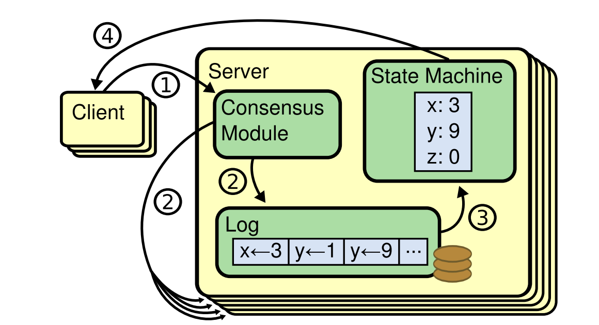
图 1

复制状态机通常通过**复制日志（replicated log）**来实现，如图 1 所示。每台服务器都保存一份日志，其中包含一系列命令，其状态机会按顺序执行这些命令。每份日志都以相同的顺序包含相同的命令，因此每个状态机处理的都是同一序列的命令。由于这些状态机是确定性的，因此它们会计算出相同的状态以及相同的输出序列。

保持复制日志的一致性是一致性算法的职责。服务器上的一致性模块接收来自客户端的命令，并将其追加到本地日志中。随后，它会与其他服务器上的一致性模块进行通信，以确保即便有部分服务器失效，所有日志最终仍会以相同顺序包含相同的请求。一旦命令被正确复制，各服务器的状态机便会按照日志顺序处理这些命令，并将输出返回给客户端。最终，这些服务器整体上表现得像一台单一且高度可靠的状态机。

面向实际系统的一致性算法通常具有如下性质：
+ 它们能够在所有**非拜占庭（non-Byzantine）**条件下保证**安全性**，即绝不会返回错误结果。这些条件包括网络延迟、网络分区，以及数据包丢失、重复和乱序等情况。
+ 只要服务器中**多数**仍然正常运行，并且彼此之间以及与客户端之间能够通信，这些算法就能保证功能正常，也即具备**可用性（availability）**。因此，一个 5 节点集群可以容忍任意两台服务器失效。这里假定服务器的失效方式是停止型故障（fail-stop）：服务器之后可以依靠稳定存储中的状态恢复，并重新加入集群。
+ 它们**不依赖时序来保证日志一致性**：时钟故障以及极端的消息延迟，最坏情况下也只会导致可用性问题，而不会破坏一致性。
+ 在常见情况下，一条命令只需经过**一轮远程过程调用（RPC）**，并在集群中的多数节点作出响应后即可完成；少数运行缓慢的服务器不会影响整个系统的总体性能。

## 3. What's wrong with Paxos?
在过去十年中，Leslie Lamport 提出的 Paxos 协议几乎已经成为“共识算法”的代名词。它既是教学中最常讲授的协议，也是大多数共识系统实现的基础。Paxos 首先定义了一种靠单个决策就能达成一致的协议，例如确定一条复制日志中的单个日志记录。我们将这一子集称为单值 Paxos（single-decree Paxos）。随后，Paxos 通过组合该协议的多个实例，来支持一系列决策，例如形成一份日志。这通常称为 multi-Paxos。Paxos 同时保证**安全性（safety）**和**活性（liveness）**，并支持集群成员变更。它的正确性已经得到证明，并且在通常情况下具有较高效率。

遗憾的是，Paxos 存在**两个明显的缺点**。第一个缺点是，Paxos **极其难以理解**。Paxos 的完整说明是公认的晦涩难懂，很少有人完全理解 Paxos，即使完全理解了也是花费了巨大的时间和精力。正因如此，后来的许多人多次尝试去用一种简洁明了的方式来解释 Paxos。这些解释主要聚焦于单值 Paxos 这一子集，但即便如此，理解起来依然非常具有挑战性。在 NSDI 2012 与会者的一次非正式调查中，我们发现，即便是在资深研究者中，真正对 Paxos 有充分把握的人也寥寥无几。我们自己在理解 Paxos 时也经历了不少困难；直到阅读了许多简化版的解释，并设计出我们自己的替代协议之后，我们才真正彻底理解这一完整协议，而这一过程几乎花费了我们整整一年。

我们推测，Paxos 之所以显得晦涩，是因为它选择以单值 Paxos作为基础。单值 Paxos 本身既紧凑又微妙：它被划分为两个阶段，而这两个阶段都缺乏简单直观的解释，也无法彼此独立地理解。因此，人们很难直观地理解为什么单值协议能够正确地运行。而 multi-Paxos 的组合规则又进一步增加了大量额外的复杂性。我们认为，就多个决策达成共识这一整体问题（也就是说，针对一份日志而非单个日志记录达成一致），其实可以采用其他分解方式，而且这些方式会更加直观，也更容易理解。

Paxos 的第二个问题在于，它**并不能为构建一个实际的系统提供良好的基础**。其中一个原因是，对于 multi-Paxos，目前并不存在一个被广泛接受的标准算法。Lamport 的描述主要集中在单值 Paxos；对于 multi-Paxos，他只是勾勒了几种可能的实现思路，但其中缺失了许多关键细节。后来虽然出现了一些对 Paxos 进行补充和优化的尝试，但这些方案彼此之间并不一致，与 Lamport 最初给出的构想也存在差异。像 Chubby 这样的系统实现了类似 Paxos 的算法，但其实现细节并未公开发表。

此外，Paxos 的体系结构也并不适合用于构建实际系统；这同样是将问题分解为单值决策所带来的后果。例如，先独立地选择一组日志记录，再将它们拼接成一个顺序日志，几乎没有什么实际收益，反而只会增加系统复杂性。相比之下，围绕日志本身来设计系统要更简单也更高效：新的日志记录按照受约束的顺序依次追加即可。另一个问题在于，Paxos 在其核心机制上采用了一种对等、对称的节点间协作方式（尽管它最终也提出了一种弱化形式的领导者机制，作为性能优化手段）。这种设计在一种被简化的场景中是合理的，即系统只需要做出一次决策，但现实中的实际系统很少采用这种方式。如果系统需要连续做出一系列决策，更简单且更高效的做法是，先选举出一个领导者，再由该领导者协调这些决策。

因此，实际系统与 Paxos 本身往往相去甚远。每一种实现通常都以 Paxos 为起点，在实现过程中逐步发现其落地难点，随后演化出一种与原始 Paxos 明显不同的体系结构。这个过程不仅耗时，而且容易出错；而 Paxos 本身难以理解这一点，又进一步加剧了问题。Paxos 的表述方式也许很适合用于证明其正确性相关定理，但真实系统中的实现与 Paxos 相差过大，以至于这些证明实际价值有限。下面这段来自 Chubby 的实现者的评论就很有代表性：
> Paxos 算法的描述与现实系统的需求之间存在显著差异……最终实现出来的系统将建立在一种尚未被证明的协议之上

基于这些问题，我们得出结论：**Paxos 无论作为系统构建的基础，还是作为教学内容的基础，都不是一个理想选择。**鉴于一致性算法在大规模软件系统中的重要性，我们决定尝试设计一种在性质上优于 Paxos 的替代性共识算法。**Raft 正是这一尝试的成果。**

## 4. Designing for understandability
在设计 Raft 算法时，我们设定了多个目标。首先，它必须提供一套**完整且实用**的基础架构，从而能够显著降低开发者在设计上的负担。其次，它必须在任何极端条件下都能确保安全性（Safety），并在常规运行环境下保持高可用性（Availability）；此外，针对常用操作，它还必须具备很高的性能。然而，我们最核心的目标（同时也是最具挑战性的难题）在于算法的易理解性（Understandability）。我们力求让广大的技术受众能够直观、顺畅地掌握该算法。不仅如此，算法的设计必须有助于开发者建立起清晰的**直觉认知**，以便系统架构师在面对实际工程实现中不可避免的扩展需求时，能够基于对原理的深刻理解进行灵活定制。

在 Raft 的设计过程中，我们曾多次面临在不同技术方案之间进行权衡与抉择。我们评估备选方案的核心准则始终是**易理解性**。具体而言，我们会考量：阐述该方案的难度有多大？（例如，该方案的状态空间是否过于复杂？是否隐藏着某些微妙的逻辑关联或副作用？）以及，读者能否毫不费力地透彻理解该方法及其带来的深层影响？

我们深知，此类分析不可避免地带有较强的主观色彩；尽管如此，我们仍采用了两种具有普适性的设计方法。第一种技巧是广为人知的**“问题分解”**法：即在可行的情况下，将复杂问题拆解为若干个独立的子模块，从而使每个部分都能被相对独立地解决、阐述和理解。例如，在 Raft 的设计中，我们将系统功能解构为领导者选举（Leader Election）、日志复制（Log Replication）、安全性保证（Safety）以及集群成员变更（Membership Changes）等核心模块。

我们的第二种方法是通过减少需要考虑的状态数量来**简化状态空间**。这种方法增强了系统的连贯性（Coherence），并在可行的情况下尽可能消除了非确定性（Nondeterminism）。具体而言，Raft 不允许日志中出现空洞（Holes），并严格限制了日志之间产生不一致性的各种情形。尽管我们在大多数场景下都努力去消除非确定性，但在某些特定情况下，引入非确定性反而能提升算法的易理解性。特别是随机化方法，虽然它引入了非确定性，但由于它能以统一的方式处理所有可能的选择（即“任选其一即可，无关紧要”），从而有效地缩减了状态空间。我们正是通过引入随机化机制，简化了 Raft 的**领导者选举**算法。

## 5. The Raft consensus algorithm
Raft 是一种用于管理复制日志（Replicated Log）的算法，其具体形式已在第 2 节中阐述了。为了便于参考，图 2 以精简形式概括了该算法的整体框架，图 3 则列举了算法的核心特性。在本节接下来的内容中，我们将对这些图示所涉及的各项要素进行逐一详细讨论。

Raft 算法实现一致性的核心机制是：首先在集群中选举出一名**主节点（leader）**，并由该主节点承担管理**复制日志（replicated log）**的**全部责任**。主节点负责接收客户端提交的日志记录，并将其同步到其他服务器上。同时，只有当主节点确认安全性后，才会通知其他服务器将这些日志条目应用到各自的状态机（state machines）中。引入主节点机制**极大地简化了复制日志的管理工作**。例如，主节点无需与其他服务器协商，即可自行决定新日志条目在日志序列中的存储位置，从而使数据流向从主节点到其他服务器。此外，一旦主节点发生故障或与集群断开连接，系统将自动触发新一轮选举以产生新的主节点。

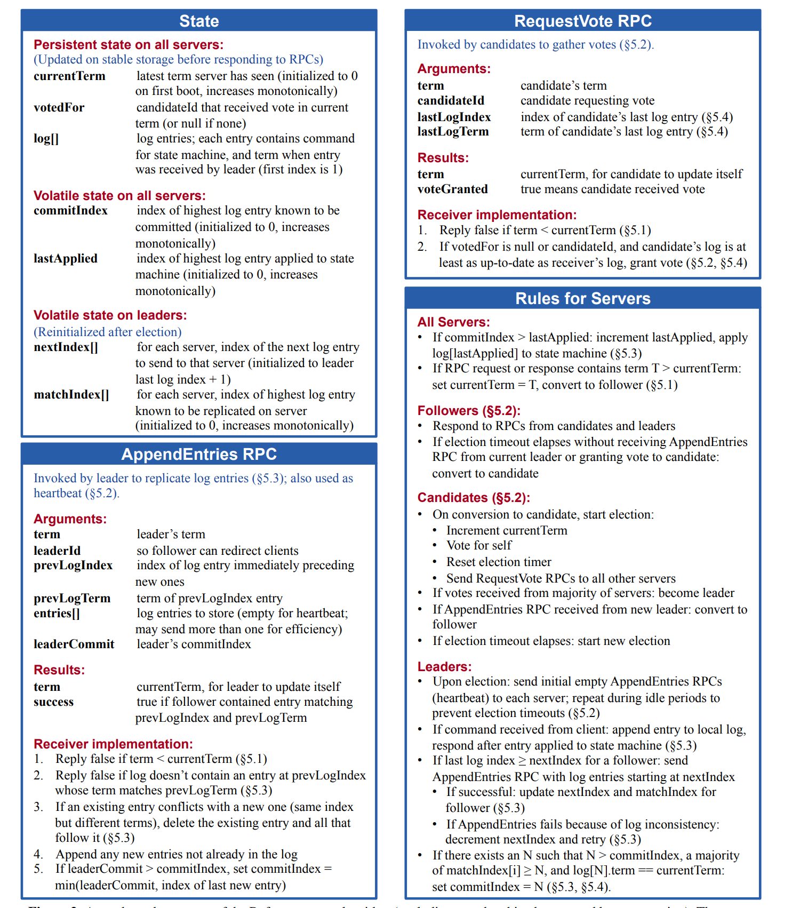
图 2

基于上述的“主节点机制”，Raft 将一致性问题分解为三个相对独立的子问题，并在后续章节中分别进行讨论：
+ **领导者选举（Leader election）：** 当现有的主节点发生故障时，必须选举出新的主节点（详见 5.2 节）。
+ **日志复制（Log replication）：** 主节点必须接收来自客户端的日志记录，并将其同步到集群中的其他节点，强制要求其他节点的日志与主节点保持一致（详见 5.3 节）。
+ **安全性（Safety）：** Raft 的关键安全属性是图 3 中定义的“状态机安全属性”。该属性规定：如果任一服务器已将特定的日志记录应用到其状态机中，则其他服务器在相同的日志索引（log index）处，不得应用不同的指令。5.4 节将详细说明 Raft 如何保证这一属性；其解决方案涉及对 5.2 节所述选举机制的一项额外约束。
在阐述完一致性算法后，本节还将探讨系统的**可用性（availability）**以及**时序（timing）**在系统中所起的作用。

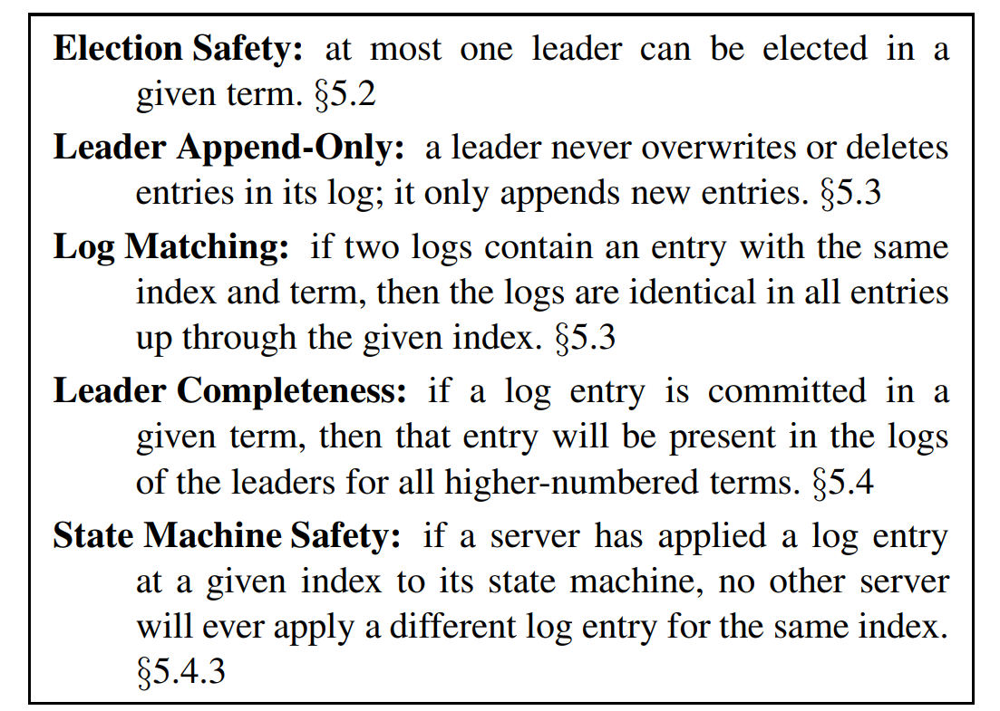
图 3

### 5.1 Raft basics
一个 Raft 集群通常由多台服务器组成。**5 个节点**是一个通常典型的配置，这种配置下系统能够容忍 **2 台服务器**发生故障。在任意给定时刻，每台服务器均处于以下三种状态之一：**领导者（leader）**、**跟随者（follower）**或**候选人（candidate）**。在集群正常运行期间，系统中**有且仅有一个领导者**，其余所有服务器均为跟随者。跟随者处于被动状态，它们不会主动发起任何请求，而仅需响应来自领导者和候选人的请求。领导者负责处理所有的客户端请求（若客户端连接到跟随者，跟随者会将其重定向至领导者）。第三种状态（候选人），则专门用于在 5.2 节所述的选举过程中选出新的领导者。图 4 展示了这些状态及其转换关系，具体的转换机制将在下文中详细讨论。

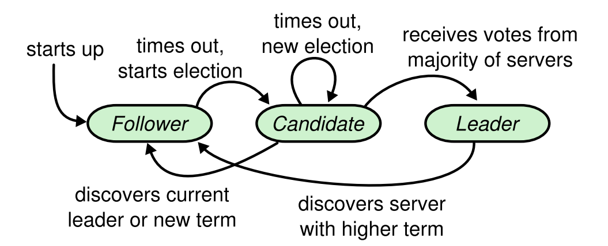
图 4

如图 5 所示，Raft 算法将时间划分为长度任意的任期（terms），并使用递增的整数对任期进行编号。每个任期的开始阶段均为选举期（election）。在此期间，一个或多个候选人会尝试竞选领导者（具体过程见 5.2 节）。若某个候选人赢得选举，它将在该任期的剩余时间内担任领导者。在某些情况下，选举可能会导致**选票分裂（split vote）**，此时该任期将在没有选取出领导者的情况下结束，随后系统会迅速开启新一轮任期并重新进行选举。Raft 机制确保在任何给定的任期内，**最多只能存在一个**领导者。

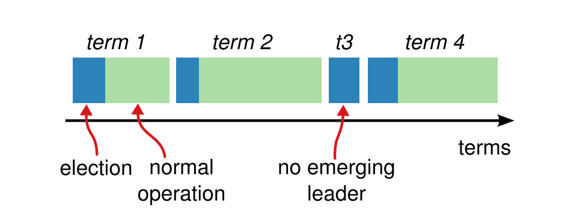
图 5

由于网络延迟或分区等原因，不同的服务器感知到任期切换的时间可能并不一致；在某些极端情况下，某个服务器甚至可能完全错过一次选举或整个任期。在 Raft 协议中，任期充当了逻辑时钟（Logical Clock）的角色，这使得服务器能够识别出诸如“过时的领导者”等过期信息。每台服务器都维护着一个随时间**单调递增**的“当前任期号（current term number）”。服务器之间在进行任何通信时都会交换这一任期号。如果一台服务器发现自己的当前任期号小于对方，它便会立即将其更新为那个较大的值。此外，如果一个候选人（Candidate）或领导者（Leader）发现自己的任期号已经落后，它必须立即回退（revert）为跟随者（Follower）状态。最后，若服务器收到任何携带过时任期号的请求，均会直接予以拒绝。

Raft 服务器之间通过 RPC 进行通信。其基础一致性算法**仅需两种类型的 RPC**即可实现：投票请求（RequestVote）RPC 由候选人在选举期间发起（详见 5.2 节）；追加条目（AppendEntries）RPC 则由领导者发起，用于实现日志记录的复制以及提供一种形式的“心跳”机制（详见 5.3 节）。此外，第 7 节还引入了第三种 RPC，专门用于在服务器之间传输快照（snapshots）。为了确保通信的可靠性，若服务器未能在规定时间内收到响应，则会进行 RPC 重试；同时，为了获得最佳性能，服务器会以并行方式发起这些 RPC 调用。

### 5.2 Leader election
Raft 算法利用**心跳机制（heartbeat mechanism）**来触发领导者选举。在系统启动初期，所有服务器节点均初始设定为跟随者（follower）状态。只要服务器能持续接收到来自领导者或候选者的 RPC，它就会一直保持跟随者状态。为了保持其领导地位，领导者会定期向所有跟随者发送心跳包（即不包含任何日志就的 AppendEntries RPC）。若跟随者在一段被称为**选举超时（election timeout）**的时间内未收到任何通信，它便会认定当前集群中不存在有效的领导者，进而发起一轮新的选举以选出领导者。

为了启动选举程序，跟随者会增加其当前的任期号（term），并切换至候选者状态。随后，该节点会为自己投下一票，并并行地向集群中的其他所有服务器发送请求投票（RequestVote） RPC。候选者将维持这一状态，直到以下三种情况之一发生：
+ (a) 该候选者赢得选举；
+ (b) 集群中其他服务器成功确立了领导者地位；
+ (c) 经过一段时间后，仍未能产生胜选者。
下文将针对这三种不同的结果分别进行详细阐述。

若候选者在同一任期内获得了整个集群中**多数派（majority）**服务器的投票，则判定该候选者赢得选举。在给定的任期内，每台服务器遵循先到先得（first-come-first-served）的原则，**最多只能为一名候选者投票**（注：5.4 节对投票增加了额外的限制条件）。这种“多数派原则”确保了在任何特定任期内，最多只能有一名候选者赢得选举（即图 3 中所述的选举安全性）。候选者一旦胜选，便立即转换为领导者状态，并向所有其他服务器发送心跳消息，以确立其领导地位并防止新一轮选举的发生。

在等待投票期间，候选者可能会收到来自另一台声称自己是领导者的服务器所发送的 AppendEntries RPC。若该领导者的任期号（包含在 RPC 请求中）不小于候选者当前的任期号，则候选者会认可该领导者的合法性，并随即退回到跟随者状态。反之，若 RPC 中的任期号小于候选者的当前任期，候选者将拒绝该请求并继续维持其候选者身份。

第三种可能的情形是选举陷入僵局，即候选者既未胜选也未败选：若多个跟随者同时转变为候选者，选票可能会被分散（即出现选票瓜分现象），导致没有任何一名候选者能够获得多数派的支持。一旦发生这种情况，各候选者将在超时后通过递增任期号并发起新一轮的 RequestVote RPC，从而启动下一轮选举。然而，若不采取额外的干预措施，选票瓜分的局面可能会无限循环下去。

Raft 算法采用**随机化选举超时（randomized election timeouts）**机制，旨在确保选票瓜分现象极少发生，且即便发生也能得到快速解决。为了从源头上预防选票瓜分，系统会从一个固定的区间（例如 150–300ms）内随机选取每个节点的选举超时时间。这种方式能够有效地使各服务器的触发时间点相互错开（spread out），从而在绝大多数情况下，集群中仅有单一服务器会率先超时；该服务器随即赢得选举，并在其他任何服务器超时之前发出心跳信号。同样的机制也被用于处理已发生的选票瓜分。每名候选者在开启一轮选举时，都会重新启动其随机化选举超时计时器，并只有在超时期满后才会尝试启动下一轮选举。这一策略显著降低了在新一轮选举中再次陷入选票瓜分僵局的概率。论文第 9.3 节的分析进一步证明，该方法能够极其迅速地选出领导者。

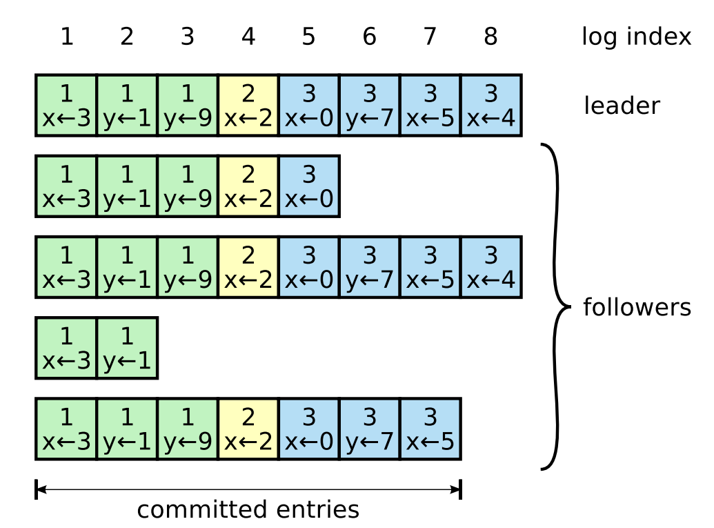
图 6

选举机制的设计有力地说明了“易理解性”是如何引导我们在不同设计方案中进行取舍的。起初，我们曾计划采用一套排名系统（ranking system）：为每名候选者分配一个唯一的优先级（rank），并据此在相互竞争的候选者中进行抉择。若某候选者发现存在优先级更高的竞争者，它将退回跟随者状态，从而使高优先级的候选者能够更顺利地赢得下一轮选举。然而，我们发现该方案在可用性（availability）方面引发了一些棘手的问题：例如，若高优先级服务器发生故障，低优先级服务器虽需通过超时重新进入候选者状态，但若其动作过快，反而可能干扰整个集群选出领导者的进程。尽管我们多次对算法进行微调，但每次修订后都会衍生出新的边界情况（corner cases）。最终我们得出结论：**随机化重试（randomized retry）**方案远比排名系统更加直观且易于理解。

### 5.3 Log replication
领导者一经选出，便开始受理客户端请求。每个客户端请求都包含一条待由**复制状态机（replicated state machines）**执行的命令。领导者首先将该命令作为一条新记录追加至其本地日志中，随后并行地向集群中的其他所有服务器发起 AppendEntries RPC，以实现该条目的复制。一旦该条目完成安全复制（具体机制见下文），领导者会将其应用（apply）到自身的状态机，并将执行结果反馈给客户端。若跟随者出现崩溃、运行缓慢或网络丢包等异常情况，领导者将无限期地重试 AppendEntries RPC（即便此时已完成对客户端的响应），直至所有跟随者最终均成功存储了全部日志条目。

日志的组织形式如图 6 所示。每条日志记录均存储了一条状态机命令，以及该条记录被领导者接收时的任期号（term number）。日志记录中的任期号用于检测不同日志之间可能存在的不一致性，并用以确保图 3 中定义的许多安全特性。此外，每个日志记录还包含一个整数索引（integer index），用于标识其在日志序列中的具体位置。

领导者负责判定将日志记录应用到状态机中是否安全；这类已确认为安全的记录被称为**已提交（committed）**。Raft 算法保证所有已提交的记录均具备**持久性（durable）**，并最终会被集群中所有可用的状态机执行。当创建某条目的领导者成功将其复制到集群中的**多数派（majority）**服务器时（例如图 6 中的记录 7），该记录即进入已提交状态。此外，该操作还会连带提交领导者日志中所有先前的记录，包括由前任领导者创建的记录。论文第 5.4 节深入讨论了在领导者更迭后应用此规则时的一些微妙细节，并论证了这种提交定义的安全性。领导者会持续追踪其已知已提交的最大索引号，并将其包含在后续的 AppendEntries RPC（包括心跳包）中，从而使其他服务器最终获得提交状态。跟随者一旦得知某条日志记录已提交，便会（按日志顺序）将其应用到本地状态机中。

我们设计 Raft 日志机制的初衷，是使不同服务器间的日志保持高度的一致性。这不仅简化了系统行为并提升了其可预测性，更是确保系统安全性的重要基石。Raft 维护着以下两项特性，它们共同构成了图 3 中所述的**日志匹配特性（Log Matching Property）**：
+ **若不同日志中的两条记录拥有相同的索引和任期号，则它们所存储的命令也必然相同。**
+ **若不同日志中的两条记录拥有相同的索引和任期号，则这两份日志中所有先前的条目也完全一致。**

第一项特性源于这样一个事实：在任一给定任期内，领导者在特定的日志索引处最多只能创建一条日志条目，且条目在日志中的位置一经确定便绝不会改变。第二项特性则由 AppendEntries RPC 执行的简单**一致性检查（consistency check）**来保证。在发送该 RPC 时，领导者会将其日志中紧邻新记录前方的那个日志记录的索引（prevLogIndex）和任期号（prevLogTerm）一并包含在请求中。若跟随者在其本地日志中未能找到匹配该索引和任期号的日志记录，它将拒绝接收这些新日志记录。

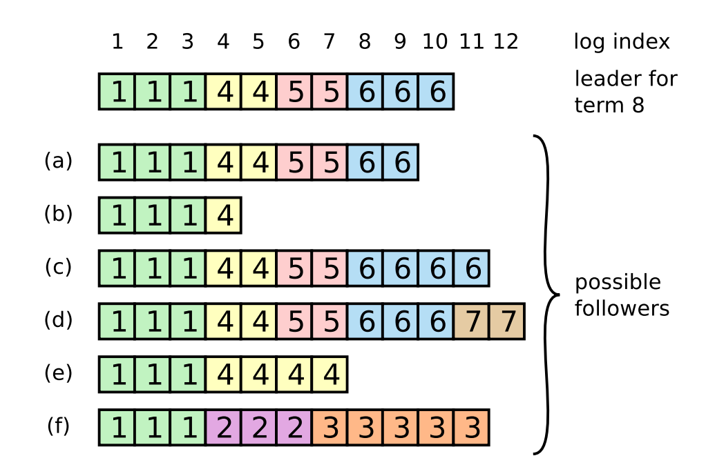
图 7

在系统正常运行期间，领导者与跟随者的日志始终保持一致，因此 AppendEntries 一致性检查总能顺利通过。然而，领导者的宕机可能会导致日志产生不一致（例如，原领导者在崩溃前未能将其日志中的所有条目完整地复制到其他节点）。随着领导者与跟随者接连发生故障，这类不一致性可能会不断**累积（compound）**。图 7 展示了跟随者日志与新领导者日志之间产生差异的具体表现形式：跟随者可能缺失了领导者已有的记录，也可能包含了领导者并不存在的冗余记录，甚至两者兼而有之。这些缺失或冗余的条目在日志中可能会跨越多个任期。

在 Raft 中，领导者通过强制跟随者的日志与自己的日志保持一致来处理不一致的情况。这意味着，跟随者日志中存在冲突的记录将被领导者日志中的记录所覆盖。第 5.4 节将说明，在加上另一个限制条件的情况下，这样做是安全的。

为了使跟随者的日志与自己保持一致，领导者需要找到两份日志最后达成一致的那条记录，删除跟随者在此之后的所有条目，并将领导者在此之后的所有记录发送给跟随者。上述所有操作都是在响应 AppendEntries RPC 的一致性检查时完成的。领导者为每个跟随者维护一个 *nextIndex* 变量，用于记录下一条即将发送给该跟随者的日志条目的索引。当领导者刚上任时，它会将所有跟随者的 nextIndex 初始化为自己日志中最后一条记录的下一个位置（在图 7 中即为 11）。若某个跟随者的日志与领导者不一致，下一次 AppendEntries RPC 的一致性检查就会失败。收到拒绝响应后，**领导者会将该跟随者的 nextIndex 减一并重新发起 AppendEntries RPC，如此反复，直到 nextIndex 回退到领导者与跟随者日志相匹配的位置为止**。此时 AppendEntries 将会成功，它会自动清除跟随者日志中所有冲突的条目，并将领导者的后续条目追加进去（如有）。一旦 AppendEntries 成功，跟随者的日志便与领导者完全一致，并且在整个任期内都将维持这种一致状态。

> 如果有需要，这个协议还可以进一步优化，以减少被拒绝的 `AppendEntries RPC` 数量。比如，当跟随者拒绝一次 `AppendEntries` 请求时，它可以在响应中附带**冲突条目的任期号**，以及自己日志中该任期**第一条记录的索引位置**。有了这些信息，领导者就可以直接把 `nextIndex` 回退到更合适的位置，一次性跳过该任期中所有冲突条目。这样一来，就不再是**每个冲突条目都要一次 RPC**，而是**每个存在冲突的任期只需要一次 RPC**。不过在实际系统中，我们认为这种优化未必是必要的，因为故障本身发生得并不频繁，而且通常也不会积累大量不一致的日志条目。

借助这一机制，领导者在刚取得领导权时，**不需要额外采取任何专门措施来恢复日志一致性**。它只需开始正常工作；一旦 `AppendEntries` 的一致性检查失败，双方日志就会在后续交互中**自动逐步收敛并恢复一致**。同时，领导者**永远不会覆盖或删除自己日志中的条目**，这就是图 3 中所说的 **Leader Append-Only Property（领导者只追加性质）**。

这种**日志复制机制**体现了第 2 节所描述的那些理想的**一致性特性**：
+ 只要**大多数服务器**处于正常运行状态，Raft 就能够**接受、复制并应用新的日志记录**；
+ 在正常情况下，一条新的日志记录只需要经过**一轮发往集群多数节点的 RPC**，就可以完成复制；
+ 而且，**单个速度较慢的跟随者**不会对整体性能造成影响。

### 5.4 Safety
前面的章节介绍了 **Raft 如何选举领导者以及复制日志记录**。但是，仅靠目前描述的这些机制，还不足以保证**每个状态机都以完全相同的顺序执行完全相同的命令**。例如，某个跟随者可能在领导者提交了许多条日志期间处于不可用状态；之后它又可能被选为新的领导者，并用新的日志记录覆盖掉原先那些条目。这样一来，不同的状态机最终就可能执行**不同的命令序列**。

本节通过增加一条**关于哪些服务器可以被选为领导者的限制条件**，来补全 **Raft 算法**。这条限制保证：**任意一个任期中的领导者，都一定包含此前所有任期中已经提交的日志记录**，这也就是图 3 中所说的 **Leader Completeness Property（领导者完备性）**。在有了这项选举限制之后，我们就可以把**日志提交（commitment）规则**定义得更加精确。最后，我们还会给出 **Leader Completeness Property** 的一个证明思路，并说明它如何进一步保证**复制状态机**能够表现出正确的行为。

#### 5.4.1 Election restriction
在任何**基于领导者的共识算法**中，领导者最终都必须保存所有**已经提交的日志条目**。在某些共识算法里，例如 **Viewstamped Replication**，一个节点即使在刚当选时**并不包含全部已提交条目**，也仍然可以成为领导者。对此，这类算法通常需要引入额外机制，在**选举过程中**或**选举刚结束后不久**，识别出缺失的日志条目，并把它们传输给新的领导者。但这样做的代价是：系统会增加相当多的**额外机制和复杂性**。Raft 采用了一种更简单的思路：它保证**每一位新当选的领导者，从当选那一刻起，就已经拥有此前各个任期中所有已提交的日志条目**，而不需要再把这些条目额外传给领导者。这样一来，日志条目就始终只会沿着**一个方向流动**，从**领导者到跟随者**；同时，领导者也**永远不会覆盖自己日志中已经存在的条目**。

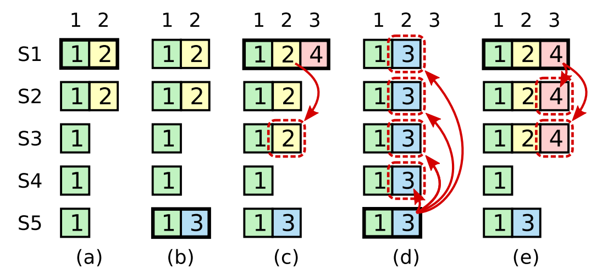
图 8

Raft 通过**投票机制**来防止某个候选人在其日志**未包含全部已提交条目**的情况下赢得选举。一个候选人要想当选，必须获得**集群中大多数节点**的支持。这意味着，每一条**已提交的日志条目**，至少都会存在于这多数节点中的某一个节点上。于是，只要候选人的日志**至少与这多数节点中其他节点一样新**（这里“**一样新**”的精确定义会在下文给出），它就一定包含了所有已提交的条目。这种限制是通过 **RequestVote RPC** 实现的：该 RPC 会携带候选人日志的相关信息；如果投票者发现**自己的日志比候选人的日志更新**，它就会拒绝把票投给对方。

Raft 判断两份日志**哪一份更新**，方法是比较它们**最后一条日志的任期号和索引值**
+ 如果两份日志的最后一条记录**任期不同**，那么**任期号更大的那份日志更新**；
+ 如果两份日志的最后一条记录**任期相同**，那么**日志更长（即最后一条记录索引更大）的那份更新**。

#### 5.4.2 Committing entries from previous terms
正如**5.3 节**所述，对于**当前任期**中的日志记录，只要该记录已经存储在**大多数服务器**上，领导者就可以认定它已经被**提交**。如果领导者在提交某条日志之前崩溃了，后续的领导者会继续尝试完成这条日志的复制。但是，对于**之前任期**中的日志记录，情况就没有这么简单了：即使它已经存储在大多数服务器上，领导者也**不能立刻断定它已经提交**。图 8 展示的正是这样一种情况：某条旧任期的日志虽然已经存在于大多数服务器上，但在之后仍然有可能被未来的领导者**覆盖掉**。

为了解决图 8 中那类问题，**Raft 不会通过“统计副本数”来提交之前任期的日志记录**。只有**领导者当前任期**中的日志记录，才可以通过这种方式被判定为已提交。而一旦当前任期中的某条日志以这种方式被提交，那么由于 **Log Matching Property（日志匹配性质）**，它之前的所有日志条目也都会被**间接地视为已提交**。当然，在某些特定情况下，领导者其实也可以安全地判断某条旧日志已经提交了——例如这条日志已经存储在**所有服务器**上。但为了保持算法的**简洁性**，Raft 采用了更保守的处理方式。

Raft 之所以在**提交规则**上引入这部分额外复杂性，是因为当领导者复制**之前任期**的日志条目时，这些条目会**保留它们原来的任期号**。而在其他一些共识算法中，如果新的领导者要重新复制早先“任期”中的记录，就必须给这些条目赋予当前新的**任期号**。Raft 的这种做法，让日志记录更容易分析和推理，因为它们**无论随着时间推进，还是在不同节点的日志之间传播，始终保持相同的任期号**。此外，Raft 中的新领导者在处理先前任期的日志时，需要发送的日志记录也比其他算法更少；而其他算法往往必须先发送一些**冗余日志记录**，给它们重新编号之后，才能将其提交。

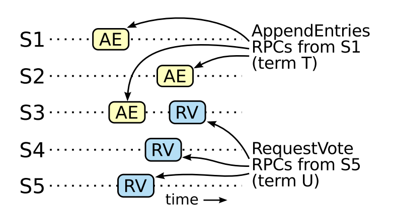
图 9

#### 5.4.3 Safety argument
在完整给出 **Raft 算法**之后，我们现在可以更精确地论证：**Leader Completeness Property（领导者完备性）**是成立的。（这一论证建立在安全性证明的基础上，参见 **9.2 节**。）我们的证明方法是：**先假设领导者完备性不成立，然后推出矛盾**。具体来说，假设在任期 **T** 中的领导者 `leader_T` 提交了一条属于该任期的日志，但这条日志**没有被某个后续任期的领导者保存下来**。接着，考虑所有大于 **T** 的任期中，最早出现这种情况的那个任期 **U**：也就是其领导者 `leader_U` **没有保存这条日志**。
1. 这条**已提交的日志条目**，在 `leader_U` 当选时，一定**还不在它的日志中**，因为领导者**不会删除或覆盖**自己已有的日志条目。
2. `leader_T` 曾经把这条日志复制到了**集群中的大多数节点**上，而 `leader_U` 也是通过获得**大多数节点的选票**才当选的。因此，这两个多数集合必然至少有一个共同节点。也就是说，至少存在这样一台服务器（文中称为 **the voter**）——它**既接收过来自 `leader_T` 的这条日志，又投票支持了 `leader_U`**，如图 9 所示。这个投票者是后续推出矛盾的关键。
3. 这个投票者一定是**先接收了 `leader_T` 提交的那条日志，之后才投票给 `leader_U`**。否则，如果它先给 `leader_U` 投了票，那么它当前任期就会已经大于 **T**，从而会拒绝 `leader_T` 发来的 `AppendEntries` 请求。
4. 当这个投票者把票投给 `leader_U` 时，它**仍然保存着那条日志**。原因是：在 `T` 到 `U` 之间的每一任领导者都包含这条日志（这是前面的假设）；而且**领导者从不删除日志条目**，跟随者也只会在日志与领导者发生冲突时才删除条目。
5. 既然这个投票者把票投给了 `leader_U`，那就说明 `leader_U` 的日志**至少和该投票者一样新**。这会进一步导出两种可能的矛盾。
6. 第一种情况是：如果投票者和 `leader_U` 的**最后一条日志属于同一个任期**，那么根据 Raft 对“日志新旧”的判定规则，`leader_U` 的日志长度至少不小于投票者，因此它理应包含投票者日志中的**所有条目**。但这就产生了矛盾：因为投票者明明包含那条**已提交的日志**，而我们一开始却假设 `leader_U` **不包含**这条日志。
7. 否则，`leader_U` 最后一条日志的任期就一定**大于**投票者最后一条日志的任期。而且这个任期还一定**大于 T**，因为投票者的最后一条日志任期至少是 **T**（它包含了任期 **T** 中那条已提交的日志）。那么，最早产生 `leader_U` 这条“最后日志”的那个更早期领导者，根据前面的假设，也一定包含这条已提交日志。于是，根据 **Log Matching Property（日志匹配性质）**，`leader_U` 的日志也必然应当包含这条已提交日志。这再次与我们的假设相矛盾。
8. 这样，矛盾就完整建立起来了。因此，**所有大于 T 的后续任期中的领导者，都必然包含任期 T 中那些已经在任期 T 被提交的日志条目**。
9. 进一步地，**Log Matching Property** 还保证，未来的领导者也会包含那些**被间接提交**的日志条目，例如图 8(d) 中索引为 2 的那条记录。

> 有了 **Leader Completeness Property（领导者完备性）**，我们就可以进一步证明图 3 中的 **State Machine Safety Property（状态机安全性）**。这条性质的含义是：如果某个服务器已经将某个索引位置上的日志记录应用到它的**状态机**中，那么其他任何服务器都不可能再在这个相同索引位置上应用**不同的日志记录**。原因在于：当一个服务器把某条日志应用到自己的状态机时，它的日志在该条目之前的部分一定已经与领导者的日志完全一致，并且这条日志本身也一定已经被**提交**。现在，考虑这样一个时刻：某个特定日志索引第一次在某个任期中被某台服务器应用到状态机。根据 **Leader Completeness Property**，之后所有更高任期的领导者都一定会包含这条相同的日志记录。因此，在更晚任期中应用该索引位置日志的服务器，最终也只能应用**同样的值**。于是，**State Machine Safety Property** 得证。

> 最后，Raft 还要求服务器必须按照**日志索引顺序**依次记录日志。再结合 **State Machine Safety Property**，这就意味着：所有服务器都会以完全相同的顺序，将完全相同的一组日志记录到各自的状态机中。

### 5.5 Follower and candidate crashes
到目前为止，我们主要讨论的是**领导者故障**。相比之下，**跟随者**和**候选人**的崩溃要容易处理得多，而且这两类故障的处理方式是相同的。如果一个跟随者或候选人崩溃了，那么之后发给它的 **RequestVote RPC** 和 **AppendEntries RPC** 都会失败。Raft 对这种情况的处理方式很直接：**无限重试**。只要崩溃的服务器重新启动，相应的 RPC 最终就会成功完成。如果某台服务器是在**已经完成 RPC 处理、但还未来得及响应**时崩溃，那么它重启后还会再次收到同一个 RPC 请求。不过这不会带来问题，因为 **Raft 的 RPC 是幂等的**。例如，如果一个跟随者收到一条 `AppendEntries` 请求，而其中包含的某些日志条目其实**已经存在于它自己的日志中**，那么它会在新的请求里**忽略这些已有条目**。

### 5.6 Timing and availability
Raft 的一个基本要求是：**安全性不能依赖于时间因素**。也就是说，系统不能仅仅因为某些事件发生得比预期更快或更慢，就产生错误结果。但是，**可用性**（也就是系统能否及时响应客户端请求）则不可避免地会受到时间因素的影响。例如，如果消息传递所花的时间，比服务器两次故障之间的典型时间间隔还要长，那么候选人可能还没来得及赢得选举就又失效了；而如果系统始终无法稳定地产生一个领导者，Raft 就无法继续向前推进。

**领导者选举是 Raft 中对时序要求最敏感的部分。**只要系统满足下面这个**时间关系**，Raft 就能够选出并维持一个稳定的领导者：
> *broadcastTime* << *electionTimeout* << MTBF
这里：
+ *broadcastTime* 表示一台服务器**并行地向集群中所有其他服务器发送 RPC 并收到响应**所需的平均时间；
+ *electionTimeout* 是 **5.2 节**中介绍的**选举超时时间**；
+ MTBF 是单台服务器的**平均故障间隔时间**（Mean Time Between Failures）。
这个不等式的含义是：
+ *broadcastTime* 应该比 *electionTimeout* 小一个数量级，这样领导者才能稳定地发送**心跳消息**，防止跟随者误以为领导者失联而发起新一轮选举；
+ 同时，由于 Raft 对选举超时采用了**随机化机制**，这一关系也能降低**票数分裂（split vote）**发生的概率；
+ 此外，**electionTimeout 还应当比 MTBF 小几个数量级**，这样系统才能持续稳定地向前推进。
因为一旦领导者崩溃，系统通常会在大约一个 **electionTimeout** 的时间内不可用，所以我们希望这段不可用时间只占整个系统运行时间中的很小一部分。

**broadcastTime** 和 **MTBF** 是底层系统本身的属性，而 **electionTimeout** 则是我们需要自行选择的参数。Raft 的 RPC 通常要求接收方把相关信息**持久化到稳定存储**中，因此 **broadcastTime** 会受到存储技术的影响，通常大约在 **0.5ms 到 20ms** 之间。由此推算，**electionTimeout** 一般会设置在 **10ms 到 500ms** 这个范围内。至于典型服务器的 **MTBF**，通常是**数个月甚至更长**，因此很容易满足前面提到的时序要求。

## 6. Cluster membership changes
到目前为止，我们一直假设集群配置（即参与共识算法的一组服务器）是固定不变的。在实际中，偶尔需要更改配置，例如在服务器发生故障时替换服务器，或者改变副本数量。虽然也可以通过让整个集群下线、更新配置文件，然后再重启集群来完成这些更改，但这样会使集群在切换期间不可用。此外，如果过程中存在任何人工步骤，还会有操作失误的风险。为了避免这些问题，我们决定将配置变更自动化，并将其纳入 Raft 共识算法之中。

为了确保配置变更机制是安全的，在配置过渡过程中，任何时刻都不能出现“同一任期内选出两个领导者”的可能性。遗憾的是，若让服务器直接从旧配置切换到新配置，这种做法并不安全。由于无法让所有服务器在同一时刻完成原子切换，集群在过渡期间就可能暂时分裂为两个彼此独立的多数派，进而埋下同一任期内产生两个领导者的风险（见图10）。

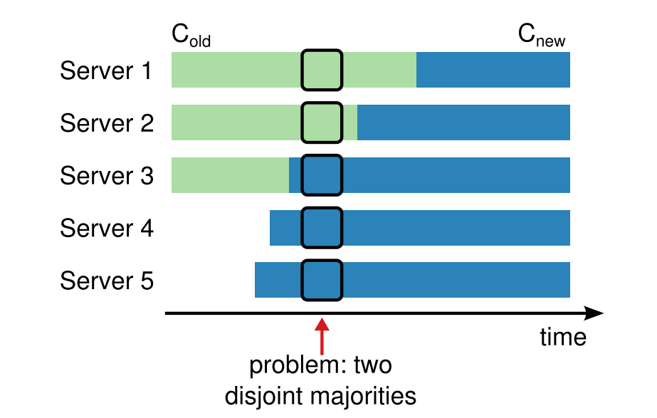
图 10

为保证安全性，配置变更必须采用**两阶段**的方法。两阶段具体如何实现，可以有多种不同方案。例如，一些系统会在第一阶段先使旧配置失效，使其不再处理客户端请求；随后在第二阶段启用新配置。Raft 采用的做法则不同：集群首先切换到一种过渡性的配置状态，我们称之为**联合共识**（joint consensus）；待联合共识对应的配置被提交后，系统再进一步过渡到新配置。所谓联合共识，就是将旧配置与新配置同时纳入一致性决策过程之中。
+ 日志记录会被复制到**新旧两套配置中的全部服务器**上。  
+ 来自**任一配置**的服务器都可以担任领导者。  
+ 无论是领导者选举还是日志条目提交，达成一致都必须**同时分别获得旧配置和新配置中的多数支持**。

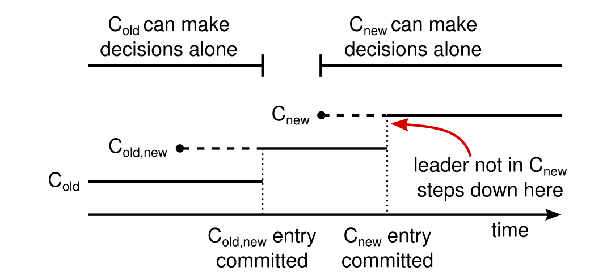
图 11

联合共识使各个服务器能够在不同时间点完成配置切换，而不会破坏系统安全性。进一步说，借助联合共识，集群在整个配置变更过程中**仍可持续响应客户端请求**。

集群配置信息以特殊日志条目的形式存储在复制日志中并进行同步。图 11 展示了配置变更的具体流程。当领导者（Leader）接收到将配置从 $C_{old}$ 变更为 $C_{new}$ 的请求时，它会将用于“联合共识”阶段的配置（图中标记为 $C_{old,new}$）封装为一个日志条目，并按照前述机制将其分发到各个节点。一旦某个服务器将该新配置条目写入其本地日志，它便会立即在后续的所有决策中启用该配置（即服务器始终采用其日志中最新的配置，无论该条目是否已达成共识/提交）。这意味着，领导者将依据 $C_{old,new}$ 的规则，来判定 $C_{old,new}$ 日志条目本身是否已达到提交状态。在此期间，如果领导者发生宕机，新领导者的选举可能会根据 $C_{old}$ 或 $C_{old,new}$ 的规则进行，这取决于胜选的候选人是否已经接收到了 $C_{old,new}$ 条目。在任何情况下，在此过渡阶段内，$C_{new}$ 都不具备独立做出决策的能力。

一旦 $C_{old,new}$ 条目被提交，无论 $C_{old}$ 还是 $C_{new}$ 均无法在未获得对方认可的情况下独立做出决策。同时，**领导者完备性（Leader Completeness Property）**确保了只有拥有 $C_{old,new}$ 日志条目的服务器才有资格当选领导者。此时，领导者可以安全地创建一个描述 $C_{new}$ 的日志条目，并将其分发到整个集群。同样地，该配置一旦被服务器感知，便会立即在各节点生效。当新配置在 $C_{new}$ 的规则下达成提交状态后，旧配置即告失效，不再属于新配置范畴的服务器便可以关闭。如图 11 所示，在整个过程中，$C_{old}$ 与 $C_{new}$ **绝无可能在同一时刻分别独立做出决策**，这在机制上保障了系统的安全性。

关于配置变更，还有三个问题需要解决。首要问题是，新加入的服务器初始状态下可能不存储任何日志条目。若在此状态下直接将它们添加至集群，这些服务器可能需要相当长的时间才能完成数据追赶；在此期间，集群可能无法提交新的日志条目。为了避免出现这种可用性空窗期，Raft 在正式启动配置变更前引入了一个额外阶段。在该阶段，新服务器以**非投票成员**（non-voting members）的身份加入集群（领导者会向其复制日志条目，但在计算法定多数派时不会将其计入）。一旦这些新服务器的进度追赶上集群中的其他节点，便可以按照前文所述的流程继续执行配置变更。

第二个问题是，当前的集群领导者可能不在新配置（$C_{new}$）的名单中。在这种情况下，一旦 $C_{new}$ 日志条目被提交，该领导者将**卸任**（退回到跟随者状态）。这意味着会存在一段时期（即正在提交 $C_{new}$ 的过程中），领导者在管理一个并不包含其自身的集群；此时，它虽然仍在负责复制日志，但在计算法定多数派时不再将自己计入。领导者的更迭发生在 $C_{new}$ 提交之后，因为这是新配置能够独立运行的最早时间点（届时必能从 $C_{new}$ 中选举出新的领导者）。而在该时间点之前，可能只有属于 $C_{old}$ 的服务器才有资格当选领导者。

第三个问题是，已被移除的服务器（即不在 $C_{new}$ 名单中的节点）可能会干扰集群的正常运行。由于这些服务器不再接收心跳，它们会因选举超时而发起新的选举请求。随后，它们会发送带有更高任期号（Term Number）的 `RequestVote` RPC。这会导致当前合法的领导者被迫退回到跟随者（Follower）状态。虽然最终仍能选出新的领导者，但被移除的服务器会反复因超时而触发上述过程，循环往复，从而导致集群的可用性严重下降。

为了防止该问题，当服务器认为当前存在合法领导者时，会选择**忽略**接收到的投票请求（`RequestVote` RPC）。具体而言，如果一个服务器在收到当前领导者的消息后，尚处于“最小选举超时时间”范围内，又收到了投票请求，则它既不会更新自己的任期号（Term Number），也不会投出选票。这一机制并不会影响正常的选举流程，因为在正常选举中，每台服务器在发起选举前至少都会等待一个最小选举超时周期。然而，它能有效避免被移除服务器所带来的干扰：只要领导者还能向其集群发送心跳，它就不会因为更大的任期号而被废黜。

## 7. Log compaction
在正常运行过程中，Raft 的日志会随着客户端请求的不断到来而持续增长；但在实际系统中，日志不可能无限制地扩张。日志越长，占用的存储空间就越大，回放所需的时间也越长。若没有某种机制来丢弃日志中累积的过时信息，这种增长最终将引发系统可用性问题。

**快照**是日志压缩中最简单的一种方法。在快照机制下，系统当前的完整状态会被写入稳定存储中的一个快照，随后截至该时刻的全部日志都会被丢弃。Chubby 和 ZooKeeper 都采用了快照机制，本节余下内容将着重介绍 Raft 中的快照实现。

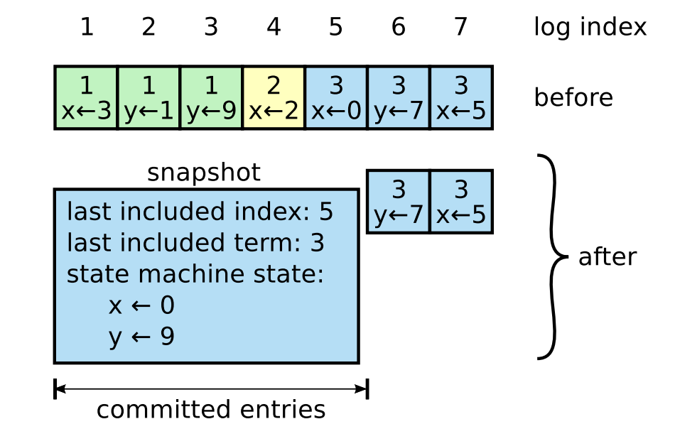
图 12

除快照之外，也可以采用增量式的压缩方法，例如日志清理（log cleaning）和日志结构合并树（log-structured merge tree, LSM tree）。这类方法每次只处理一部分数据，因此能够将压缩带来的负载更均匀地分散到时间线上。其基本做法是：先选取一段已经积累了大量已删除对象和被覆盖对象的数据区域，再将其中仍然有效的对象以更紧凑的方式重写到其他位置，从而释放该区域。与快照机制相比，这种方法需要引入更多额外机制，也带来了更高的实现复杂度；而快照由于始终面向整个数据集进行操作，因此在问题处理上更为直接。对于 Raft 而言，若要采用日志清理机制，就需要对协议本身作出修改；相比之下，状态机则可以通过与快照相同的接口来实现 LSM 树。

图 12 展示了 Raft 中快照机制的基本思想。每个服务器都会独立生成快照，所覆盖的范围仅限于其日志中已经提交的条目。快照工作的核心，主要在于由状态机将当前状态写入快照之中。此外，Raft 还会在快照中保存少量元数据。其中，**最后包含索引**（*last included index*）指的是该快照所替代的那部分日志中最后一条日志的索引，也就是状态机已应用的最后一条日志；而 **最后包含任期**（*last included term*）则是该条日志所属的任期。之所以保留这些信息，是为了支持快照之后第一条日志在执行 `AppendEntries` 一致性检查时的匹配需求，因为该日志条目需要对应的前一条日志的索引和任期信息。为了支持集群成员变更（见第 6 节），快照中还会包含截至最后包含索引时日志中的最新配置。一旦服务器完成快照写入，它就可以删除直到最后包含索引为止的全部日志条目，以及此前更早生成的快照。

尽管服务器通常会独立地生成快照，但领导者有时仍需向落后的跟随者发送快照。当领导者已经丢弃了某个跟随者下一步所需的日志条目时，就会出现这种情况。幸运的是，在正常运行条件下，这种情况并不常见：若某个跟随者始终能够跟上领导者的进度，它通常早已拥有该日志条目。不过，若跟随者异常缓慢，或者是一个刚加入集群的新服务器（见第 6 节），情况就并非如此。此时，要使这类跟随者更新到最新状态，领导者就需要通过网络向其发送快照。

图 12

领导者使用一种名为 **`InstallSnapshot`** 的新 RPC，向进度显著滞后的跟随者发送快照；具体流程详见图 13。当跟随者通过此 RPC 接收到快照时，必须决定如何处理其现有的日志条目。通常情况下，快照包含的是接收者日志中尚未存在的新信息。在此类情况下，跟随者将丢弃其全部日志；这些日志已被快照内容所取代，且其中可能存在与快照内容相冲突的未提交条目。相反，如果跟随者收到的快照仅描述了其日志的一个前缀（这可能是由于网络重传或误操作导致的），那么被快照覆盖的日志条目将被删除，但快照之后的条目依然有效，必须予以保留。  

这种快照机制在一定程度上偏离了 Raft 的强领导者原则，因为跟随者可以在领导者不知情的情况下自行生成快照。不过，我们认为这种偏离是合理的。领导者的存在主要是为了在达成共识时避免出现相互冲突的决定，而在进行快照时，共识事实上已经达成，因此不存在决策冲突的问题。数据的流向仍然保持不变，即依旧只从领导者流向跟随者；只是现在允许跟随者自行重组其本地数据。

我们也曾考虑过另一种以领导者为中心的方案：由领导者独自创建快照，然后再将该快照发送给所有跟随者。然而，这种做法存在两个明显缺点。首先，将快照逐一发送给各个跟随者，会额外消耗网络带宽，并拖慢快照生成与分发的整体过程。事实上，每个跟随者本身已经具备生成本地快照所需的全部信息；通常而言，服务器依据自身本地状态生成快照，其成本远低于通过网络发送和接收快照。其次，这会显著提高领导者实现上的复杂度。举例来说，为了不阻塞新的客户端请求，领导者必须在向跟随者复制新日志条目的同时，并行地向它们发送快照。

还有两个问题会影响快照机制的性能。首先，服务器必须决定何时进行快照。若快照过于频繁，就会浪费磁盘带宽和系统资源；若快照间隔过长，则可能耗尽存储容量，并增加系统重启时回放日志所需的时间。一个较为简单的策略是：当日志大小达到某个固定的字节阈值时，就生成一次快照。如果这一阈值被设定得明显大于预期的快照大小，那么执行快照所带来的磁盘带宽开销通常就会比较小

第二个性能问题在于，写入快照可能耗时较长，而我们并不希望这一步延缓系统的正常运行。解决办法是采用**写时复制**（copy-on-write）技术，使系统在写入快照的同时仍能接收新的更新，而不致影响快照生成过程。例如，使用函数式数据结构构建的状态机通常天然支持这一机制。另一种做法是借助操作系统提供的写时复制能力（例如 Linux 中的 `fork`），为整个状态机创建一个内存中的快照；我们的实现采用的正是这种方式。

## 8. Client interaction
本节讨论客户端如何与 Raft 交互，包括客户端如何发现集群中的领导者，以及 Raft 如何支持**线性一致性语义**。这些问题适用于所有基于共识的系统，而 Raft 的解决思路与其他系统基本类似。

Raft 的客户端会将**所有请求都发送给领导者**。客户端在启动时，通常先随机连接到某个服务器。如果它最初连接的并不是领导者，那么该服务器会拒绝客户端请求，并告知其最近一次获知的领导者信息（因为 `AppendEntries` 请求中会携带领导者的网络地址）。如果领导者发生故障，客户端请求就会超时；此后，客户端会重新随机选择服务器并再次尝试。

我们对 Raft 的目标是实现**线性一致性语义**（即每个操作看起来都是在从调用到响应之间的某个时刻，瞬时地、且恰好被执行一次）。然而，就目前所描述的机制而言，Raft 可能会多次执行同一条命令。例如，如果领导者在提交日志条目之后、但在向客户端返回响应之前发生宕机，客户端会向新领导者重试该命令，从而导致该命令被第二次执行。解决方案是让客户端为每个命令分配唯一的序列号。随后，状态机会记录每个客户端已处理的最新序列号以及与之对应的响应。如果状态机收到一条序列号显示已被执行过的命令，它将立即返回之前的响应，而不会重新执行该请求。

只读操作可以在不向日志写入任何内容的情况下进行处理。然而，如果不采取额外措施，这种做法将面临返回**过期数据（Stale data）**的风险，因为响应请求的领导者可能已被新领导者取代，而其自身并未察觉。**线性一致性读（Linearizable reads）决不能返回过期数据**，因此 Raft 需要两项额外的防范措施，以便在不依赖日志记录的情况下确保一致性。首先，领导者必须掌握关于哪些条目已提交的最新信息。“领导者完备性”（Leader Completeness Property）特性虽能确保领导者拥有所有已提交的条目，但在其任期开始时，它可能并不确定具体哪些条目已达提交状态。为了明确这一点，它需要提交一个属于其当前任期的条目。Raft 的处理方式是：让每位领导者在任期开始时向日志中提交一个空白的**空操作（no-op）**条目。其次，领导者在处理只读请求之前，必须检查自己是否已被废黜（如果已经选出了更新的领导者，其掌握的信息可能已过时）。Raft 的应对策略是：让领导者在响应只读请求之前，先与集群中的大多数节点交换一次心跳消息。或者，领导者也可以利用心跳机制提供某种形式的租约（Lease），但这需要依赖时序来实现安全性（即假设时钟偏移是有界的）。

## 9. Implementation and evaluation
我们已将 Raft 实现为复制状态机的一个组件，用于存储 RAMCloud 的配置信息，并协助 RAMCloud 协调器进行故障切换（Failover）。该 Raft 实现（剔除测试、注释及空行后）约包含 2000 行 C++ 代码，其源代码已公开发布。此外，基于本文草案开发的独立第三方开源实现约有 25 个，目前处于不同的开发阶段。同时，多家企业也正在部署基于 Raft 的系统。

本节接下来的部分将从**可理解性（Understandability）、正确性（Correctness）和性能（Performance）**这三个维度对 Raft 进行评估。

### 9.1 Understandability
为了衡量 Raft 相对于 Paxos 的可理解性，我们以斯坦福大学“高级操作系统”课程和加州大学伯克利分校“分布式计算”课程的高年级本科生及研究生为对象，进行了一项实验研究。我们录制了关于 Raft 和 Paxos 的教学视频，并设计了相应的测验题。其中，Raft 的讲座涵盖了除日志压缩以外的本文所有内容；而 Paxos 的讲座则涵盖了足以构建一个等效复制状态机的素材，包括单决议（Single-decree）Paxos、多决议（Multi-decree）Paxos、配置变更以及一些实践中所需的优化（如领导者选举）。测验题旨在考察学生对算法基础知识的理解，并要求他们对边缘情况（Corner cases）进行逻辑推导。每位学生需观看一段视频并完成相应测验，随后再观看第二段视频并完成第二次测验。为了消除个体表现差异以及首轮实验所积累的经验（学习效应）对结果的影响，约一半的参与者先进行 Paxos 部分，另一半则先进行 Raft 部分。我们对比了参与者在两次测验中的得分，以确定他们是否对 Raft 表现出更好的理解力。

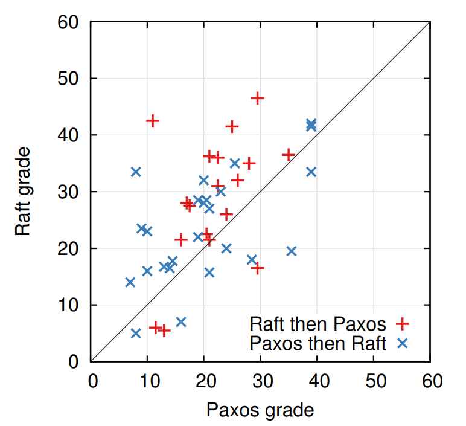
图 14

我们力求使 Paxos 与 Raft 之间的对比尽可能保持客观公平。实际上，实验设计在两个方面更有利于 Paxos：首先，在 43 名参与者中，有 15 名表示此前已具备一定的 Paxos 既往经验；其次，Paxos 的教学视频时长比 Raft 的视频长出 14%。如表 1 所示，我们已采取相应措施来削弱这些潜在偏见来源的影响。目前，我们所有的实验材料均已公开以供查阅。

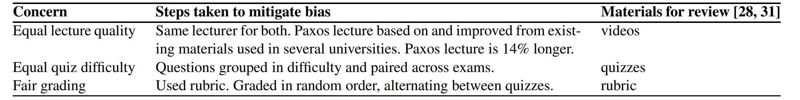
表 1

统计结果显示，参与者在 Raft 测验中的**平均得分比 Paxos 测验高出 4.9 分**（满分为 60 分，Raft 的平均得分为 **25.7**，而 Paxos 为 **20.8**）；图 14 展示了每位参与者的个人得分情况。配对 $t$ 检验（Paired $t$-test）表明，在 **95% 的置信水平**下，Raft 得分真实分布的均值至少比 Paxos 高出 **2.5 分**。

我们还建立了一个线性回归模型，通过三个维度来预测学生的测验成绩：参加的测验类型、对 Paxos 的既往经验程度，以及学习这两种算法的先后顺序。模型预测显示，仅“测验类型”这一变量就产生了 12.5 分的差异，且显著向 Raft 倾斜。该数值显著高于实际观测到的 4.9 分差异，原因在于许多参与实验的学生具备 Paxos 既往经验，这极大地提升了他们在 Paxos 测验中的表现，而对提升 Raft 成绩的作用则相对较小。令人费解的是，模型还预测，对于那些已经参加过 Paxos 测验的学生，其 Raft 成绩会下降 6.3 分。尽管目前尚不明确这一现象的具体诱因，但它在统计学上具有显著性（Statistically significant）。

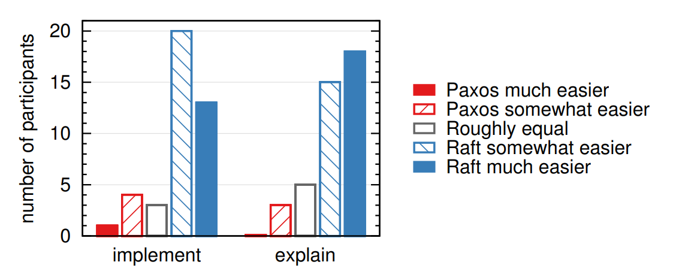
图 15

在测验结束后，我们还对参与者进行了问卷调查，以评估他们主观认为哪种算法更易于实现或讲解，调研结果详见图 15。结果显示，**压倒性多数**的参与者认为 Raft 在实现与讲解上都更为简单（针对这两个问题，**41 名参与者中均有 33 人**持此观点）。然而，这种自我报告的主观感受（self-reported feelings）在可靠性上可能弱于客观的测验成绩；此外，如果参与者预先了解我们关于“Raft 更易理解”的研究假设，其评价可能会产生主观偏差。

### 9.2 Correctness
我们为第 5 节所述的共识机制制定了**形式化规范（Formal specification）**及安全性证明。该形式化规范采用 **TLA+** 规范语言，使图 2 中汇总的信息变得极其精确。该规范长约 400 行，不仅是证明过程的核心对象，对于任何 Raft 的实现者而言，其本身也具有极高的参考价值。我们利用 TLA 证明系统对“日志完备性”（Log Completeness Property）进行了**机械化证明（Mechanically proven）**。然而，该证明依赖于一些尚未经过机械化检查的不变式（例如，我们尚未证明该规范的类型安全性）。此外，我们还为“状态机安全性”（State Machine Safety）编写了一份非正式证明；该证明内容完整（仅依赖于规范本身）且较为严谨（长度约为 3500 字）。

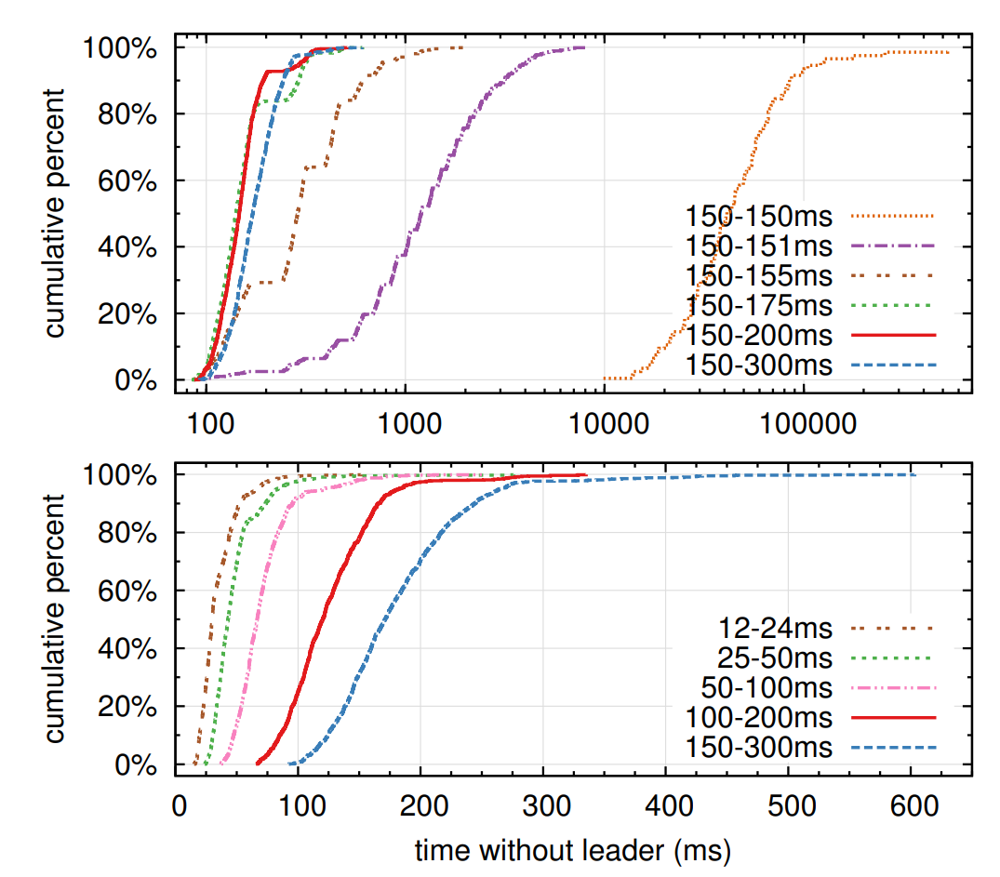
图 16

### 9.3 Performance
Raft 的性能表现与 Paxos 等其他共识算法**相近**。在性能评估中，最关键的场景是当领导者地位确立后，其向各节点复制新日志条目的过程。Raft 以最少的消息开销实现了这一过程（仅需领导者与集群半数节点之间的**一次往返通信**）。此外，Raft 的性能仍有进一步提升的空间。例如，它能够轻松支持请求的**批处理（Batching）**与**流水线化（Pipelining）**，从而在降低延迟的同时显著提高吞吐量。现有的学术文献中已针对其他算法提出了多种优化方案，其中许多亦可应用于 Raft，但我们将此项工作留待后续研究。

我们利用所开发的 Raft 实现对领导者选举算法的性能进行了评估，并旨在解答以下两个问题：
1. 选举过程能否快速收敛？
2. 在领导者宕机（Crash）后，系统所能实现的最小停机时间（Downtime）是多少？

为了评估领导者选举的性能，我们对一个包含五个节点的集群进行了反复测试：通过不断模拟领导者宕机，记录从检测到故障到选出新领导者所消耗的时间（详见图 16）。为了构建最坏情况（worst-case scenario），我们在每次实验中特意设置了各服务器日志长度不一致的情形，使得部分候选人因日志不够新而失去当选资格。此外，为了诱发**瓜分选票（split votes）**现象，测试脚本会在终止领导者进程前，触发一次心跳 RPC 的同步广播（此举旨在模拟领导者在宕机前瞬间刚完成新日志记录分发的行为）。在所有测试中，领导者会在其心跳间隔内被随机终止，而该心跳间隔设定为最小选举超时时间的一半。因此，理论上可能实现的最小停机时间约为最小选举超时时间的一半。

图 16 上方的图表表明，仅需在选举超时时间中引入少量的随机化，便足以避免选举过程中出现“瓜分选票”（Split votes）的现象。在缺乏随机性的情况下，由于频繁引发瓜分选票，我们在测试中观察到领导者选举耗时稳定在 **10 秒以上**。仅引入 **5ms** 的随机波动就能产生显著改善，使停机时间的中位数（Median downtime）缩短至 **287ms**。进一步增加随机性的范围还能有效优化最坏情况下的表现：当随机范围设定为 **50ms** 时，在 1000 次实验观测中，最长选举耗时（即最坏情况）仅为 **513ms**。

图 16 下方的图表显示，缩短选举超时时间可以有效减少系统停机时间。当选举超时时间设定在 **12–24ms** 时，选举产生新领导者平均仅需 **35ms**（其中耗时最长的一次实验为 **152ms**）。然而，若进一步降低该超时时间，则会违反 Raft 的时序要求（Timing requirement）：领导者将难以在其他服务器发起新一轮选举之前完成心跳广播。这会导致非必要的领导者频繁更迭，从而降低系统的整体可用性。因此，我们建议采用较为稳健（保守）的选举超时设定，例如 **150–300ms**；此类设定既能避免触发非必要的领导者更迭，同时仍能保障良好的可用性。

## 10. Related work
针对共识算法，目前已有大量相关的学术文献发表，其中多数研究可归纳为以下几类：
+ **Paxos 的原始定义与解读：**包括 Lamport 最初对 Paxos 的阐述，以及后续旨在提升其可理解性的相关尝试。
+ **Paxos 的衍生与完善**：这些研究填补了原始算法中缺失的细节，并对算法进行了改进，从而为实际的工程落地奠定了更坚实的基础。
+ **共识算法的系统实现：**例如 Chubby、ZooKeeper 和 Spanner 等系统。尽管 Chubby 和 Spanner 均声称其核心基于 Paxos，但相关的算法细节尚未完全披露。相比之下，ZooKeeper 的算法（即 ZAB）虽有较为详尽的公开描述，但其架构与 Paxos 存在显著差异。
+ **Paxos 性能优化研究：**探讨了可应用于 Paxos 的各种性能优化方案。
+ **视图戳复制（Viewstamped Replication, VR）：**由 Oki 和 Liskov 提出，是与 Paxos 大约同时期开发的另一种共识路径。在其最初的描述中，VR 与一套分布式事务协议耦合在一起，但在最近的更新版本中，其核心共识协议已被剥离出来。VR 采用的是一种基于领导者（Leader-based）的方法，与 Raft 具有诸多相似之处。

**Raft 和 Paxos 之间最大的区别在于 Raft 的强领导者机制。**Raft 将领导者选举作为共识协议中的一个关键组成部分，并尽可能把更多功能集中到领导者身上。这种做法使算法更简单，也更容易理解。例如，在 Paxos 中，领导者选举与基础共识协议是相互独立的：它仅仅作为一种性能优化手段，并不是达成共识所必需的。然而，这也带来了额外的机制：Paxos 既包含一个用于基础共识的两阶段协议，又包含一个单独的领导者选举机制。相比之下，Raft 直接将领导者选举纳入共识算法之中，并把它作为共识两个阶段中的第一阶段。因此，Raft 比 Paxos 需要更少的机制。

和 Raft 一样，VR 和 ZooKeeper 也是基于领导者的，因此它们也拥有许多 Raft 相对于 Paxos 的优势。然而，Raft 比 VR 或 ZooKeeper 的机制更少，因为它尽量减少非领导者所承担的功能。例如，在 Raft 中，日志记录只沿一个方向流动：通过 `AppendEntries` RPC 从领导者向外发送。而在 VR 中，日志记录会双向流动（领导者在选举过程中也可以接收日志记录）；这就带来了额外的机制和复杂性。

据我们所知，在所有用于基于共识的日志复制算法中，Raft 的消息类型比其他任何算法都更少。例如，我们统计了 VR 和 ZooKeeper 在基础共识和成员变更中使用的消息类型数量（不包括日志压缩和客户端交互，因为这些基本上独立于算法本身）。VR 和 ZooKeeper 各自定义了 **10 种**不同的消息类型，而 **Raft 只有 4 种消息类型**（两种 RPC 请求及其对应的响应）。Raft 的单条消息比其他算法的消息稍微更“密集”一些，但总体来说它们更简单。此外，VR 和 ZooKeeper 的描述中都提到在领导者变更期间需要传输完整日志；如果要让这些机制在实践中真正可用，还需要额外增加一些消息类型来进行优化。

Raft 的强领导者方法简化了算法，但也排除了一些性能优化的可能。例如，无领导者方式的 Egalitarian Paxos（EPaxos）在某些条件下可以实现更高的性能。EPaxos 利用了状态机命令之间的可交换性。只要与某条命令并发提出的其他命令都与它可交换，任何服务器都可以仅通过一轮通信就提交该命令。然而，如果并发提出的命令彼此之间不可交换，EPaxos 就需要额外的一轮通信。由于任何服务器都可以提交命令，EPaxos 能够较好地在各服务器之间平衡负载，并且在广域网（WAN）环境下实现比 Raft 更低的延迟。不过，这也给 Paxos 带来了显著的复杂性。

关于集群成员变更，其他研究中已经提出或实现了几种不同的方法，包括 Lamport 最初的方案 VR 和 SMART。我们为 Raft 选择了联合共识（joint consensus）的方法，因为它能够利用其余的共识协议机制，从而使成员变更只需要很少的额外机制。Lamport 基于 α 的方法不适用于 Raft，因为该方法假设在没有领导者的情况下也能达成共识。相比 VR 和 SMART，Raft 的重配置算法有一个优势：**成员变更可以在不限制正常请求处理的情况下进行**；相反，VR 会在配置变更期间停止所有正常处理，而 SMART 会对未完成请求的数量施加一种类似 α 的限制。Raft 的这种方法所需的机制也比 VR 和 SMART 更少。

## 11. Conclusion
算法在设计时，通常将正确性、效率和/或简洁性作为首要目标。尽管这些目标都很值得追求，但我们认为，**可理解性同样重要**。在开发者将算法实现为可实际运行的系统之前，其他目标都无法真正达成；而这种实现过程不可避免地会偏离并扩展论文中发表的形式。除非开发者对算法有深刻的理解，并且能够形成关于它的直觉，否则他们将很难在自己的实现中保留该算法所期望具备的性质。

在本文中，我们讨论了分布式共识问题。在这一领域中，Paxos 虽然被广泛接受，却晦涩难懂，多年来一直困扰着学生和开发者。我们提出了一种新的算法——**Raft**，并表明它**比 Paxos 更易于理解**。我们也认为，**Raft 为系统构建提供了更好的基础**。将“可理解性”作为首要设计目标，改变了我们设计 Raft 的方式；随着设计的推进，我们发现自己反复使用了几种技巧，例如将问题分解以及简化状态空间。这些技巧不仅提升了 Raft 的可理解性，也使我们更容易确信它的正确性
