# Remote Procedure Call as a Managed System Service

## Abstract

远程过程调用（RPC）是云计算中广泛采用的一种核心抽象。程序员只需指定每个远程过程的类型信息，编译器便会自动生成链接到各应用程序中的存根（Stub）代码，从而负责将参数序列化与反序列化（Marshal/Unmarshal）到消息缓冲区中。然而，如今的应用与运维团队越来越需要对服务间的 RPC 流量具备高度的可见性与控制力，这促使许多系统部署选择引入 Sidecar 或 Service Mesh 代理，以提升可管理性与策略配置的灵活性。然而，这些 Sidecar 通常需要检查甚至修改 RPC 数据，而这些数据恰恰是存根编译器刚刚精心组装完成的，这无疑引入了不必要的额外开销。此外，若想升级各类异构应用中的 RPC 存根以利用 RDMA 或 DPDK 等高级硬件特性，不仅过程漫长且错综复杂，而且往往还会与 Sidecar 现有的策略控制机制发生冲突。

本文提出、实现并评估了一种新颖的方法，将 RPC 序列化（marshalling）与策略执行（policy enforcement）作为一项系统服务来实现，而非像传统方式那样将其作为库链接到每个应用程序中。在这种架构下，应用程序仍如往常一样向 RPC 系统指定类型信息 。与此同时，该 RPC 服务负责运行策略引擎、仲裁资源使用，并结合底层网络硬件的能力对数据进行定制化的序列化处理。

我们所设计的系统 mRPC 还支持热升级（live upgrades），使得策略和序列化代码的更新对应用程序代码而言完全透明。与使用 sidecar 的方案相比，mRPC 在标准微服务基准测试集 DeathStarBench 上实现了高达 2.5 倍的加速，同时还具备更高水平的策略灵活性与可用性。

## 1. Introduction

远程过程调用（RPC）是现代数据中心分布式系统不可或缺的基石。RPC 允许开发人员基于简单且熟悉的编程模型来构建网络应用，并得到了 gRPC、Thrift 以及 eRPC 等诸多流行库的广泛支持。

目前，RPC 模型已被广泛应用于分布式数据存储、网络文件系统、共识协议、数据分析框架、集群调度与编排系统以及机器学习系统等众多领域。谷歌的研究发现，其数据中心内大约 10% 的 CPU 周期都仅仅消耗在执行 gRPC 库代码上。鉴于其举足轻重的地位，如何提升 RPC 的性能长期以来外一直是该领域的核心研究课题。

近年来，应用与网络运维团队越来越需要对数据中心内部的 RPC 流量具备快速且灵活的可见性与控制力。这些具体需求包括但不限于：对特定类型 RPC 的性能进行监控与管控；通过优先级划分与限流来满足特定应用的性能与可用性目标；动态植入高级诊断功能以跨微服务网络追踪用户请求；以及采用面向特定应用的负载均衡以提升缓存效率，等等。

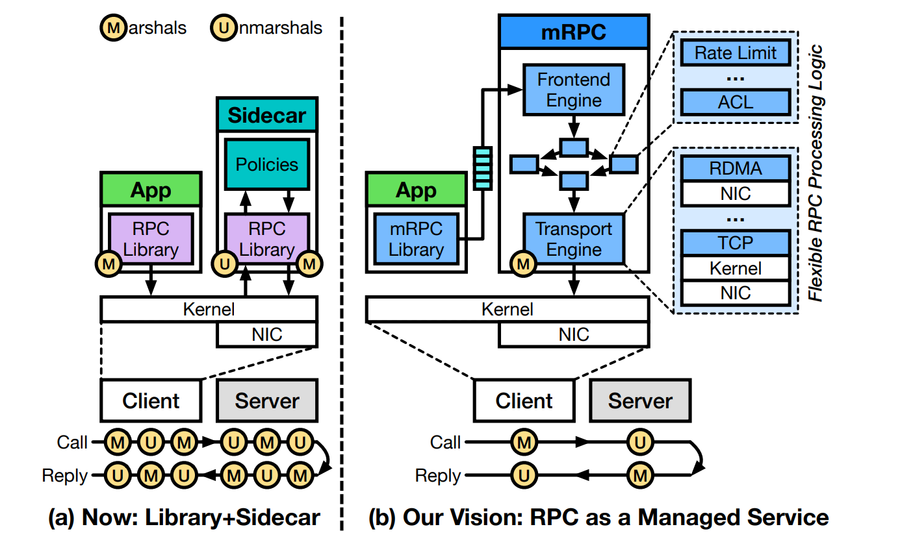

图 1：Architectural comparison between current (RPC library + sidecar) and our proposed (RPC as a managed service) approaches.

一种典型的架构是在 **sidecar** 中执行策略，即通过一个独立的进程来接管和调解应用程序 RPC 库的网络流量（如图 1a 所示）。这种架构通常被称为 **service mesh**。为了满足对 **sidecar** RPC 代理的需求，业界已经涌现出诸多成熟的产品，例如 Envoy、Istio、HAProxy、Linkerd、Nginx 和 Consul。

尽管在理论上，某些策略也可以由链接到每个应用程序中、功能丰富的 RPC 运行时（Runtime）来直接支持，但这会显著拖慢部署速度。Facebook 最近指出，全面推广其某个应用通信库的变更往往需要耗费数月之久。在实际应用中，急需快速部署的典型场景包括及时应对新出现的应用安全威胁，或者迅速诊断并修复直接影响用户体验的关键故障。此外，许多安全策略属于强制性策略而非选择性策略，网络运维团队通常无法完全信任内置于应用程序内部的库代码。常见的强制性安全策略包括访问控制、身份验证与加密，以及防御针对 RDMA 等广泛使用的网络协议的已知漏洞利用。

尽管利用 **sidecar** 进行策略管理能够满足功能与安全需求，但在性能上却十分低效。在具体运行时，应用程序的 RPC 库会根据程序员指定的类型信息，将 RPC 参数序列化（marshal）至缓冲区中。该缓冲区经由操作系统的网络协议栈发送，随后被向上转发给 **sidecar**。此时，**sidecar** 通常需要对网络、虚拟化以及 RPC 首部进行解析与解包，甚至往往需要深入检查数据包的载荷（Payload），以此来正确执行既定的策略。此后，它还需要对数据进行重新序列化以继续传输。

此外，虽然在应用层直接访问 RDMA 或 DPDK 等网络硬件能够提供极高的性能，但这却使得 **sidecar** 的策略管控机制无法介入。类似地，尽管如今的网卡功能日益强大，但由于序列化操作在网络协议栈中所处的位置过高，应用程序或 **sidecar** 很难充分利用这些新型硬件特性。同时，对序列化代码的任何改动都需要对每个应用程序和/或 **sidecar** 进行重新编译与重启，从而损害了系统的端到端可用性。简而言之，现有的解决方案要么只能提供优异的性能，要么只能提供灵活且强制可执行的策略控制，二者鱼与熊掌不可兼得。

本文提出了一种名为“RPC即托管服务”（RPC as a managed service）的新方法来解决上述局限性。该方法不再将序列化（marshalling）与策略执行分隔在不同的域中，而是将二者整合为一个统一的高特权且可信的系统服务（如图 1b 所示），从而实现了在策略处理**之后**再进行数据序列化。在我们实现的原型系统 mRPC（即托管式 RPC）中，这一特权 RPC 服务运行在用户态，并通过共享内存区域与应用程序进行通信。不过，mRPC 同样也可以通过动态可更换的内核模块直接集成到操作系统内核之中。

我们的设计目标是实现高性能、支持灵活的策略配置，并为应用程序提供高可用性。为达成这一目标，我们必须攻克以下几项核心挑战：

- **首先，实现序列化与应用库的解耦：** 需要将序列化（marshalling）操作从应用程序的 RPC 库中完全剥离出来。
- **其次，设计高效安全的策略执行机制：** 必须设计一种全新的策略执行机制，以便在不引入额外序列化开销的前提下，高效且安全地处理 RPC。
- **最后，确保动态变更对运行中应用无感知：** 须为运维人员提供一种便捷的途径来指定或变更策略，甚至直接修改底层传输实现，同时确保完全不中断正在运行的应用程序。

我们设计并实现了 mRPC，这是首个采用“RPC即托管服务”（RPC as a managed service）理念的 RPC 框架。实验结果表明，在采用相同传输机制的前提下，相比于结合当前最先进的 RPC 库与 **sidecar**（即 gRPC 与 Envoy）的传统方案，mRPC 在平均延迟指标上将 DeathStarBench 基准测试集提升了高达 2.5 倍。若能从服务内部进一步充分发掘网络硬件的潜力，还有望获得更高的性能提升。

此外，mRPC 支持对其内部组件进行热升级（live upgrades），由此带给应用程序的停机时间几乎可以忽略不计。这意味着，在变更策略或序列化（marshalling）代码时，应用程序无需重新编译或重启。

不过，当前版本的 mRPC 仍存在三个主要的局限性：

- **首先**，作为 RPC 参数传递的数据结构必须分配在特定的共享内存堆（shared-memory heap）中。
- **其次**，尽管我们采用了跨语言的通用协议来定义 RPC 类型签名，但目前的原型系统仅支持由 Rust 编写的应用程序。
- **最后**，我们开发的存根（Stub）生成器在功能完备性上与 gRPC 相比仍有差距。

本文的主要贡献如下：

- **一种新颖的 RPC 架构**：成功将序列化与反序列化（marshalling/unmarshalling）操作从传统的 RPC 库中完全解耦，并将其收归于一个集中的系统服务中。
- **一种兼顾安全与高效的 RPC 机制**：在应用网络策略与可观测性特性的同时，确保了高安全性与极低的性能开销，即将数据移动降至最低，并彻底消除了冗余的（反）序列化操作。此外，该机制还支持在不中断运行中应用的前提下，对 RPC 绑定、安全策略、传输实现以及序列化代码进行热升级（live upgrade）。
- **原型系统实现与全面评估**：设计并实现了 mRPC 原型系统，并在基准测试负载（synthetic workloads）与真实应用场景下对其进行了全方位的实验评估。

## 2. Background

本节首先探讨现有的 RPC 库架构。随后，我们将分析系统对可管理性（manageability）日益迫切的新需求，并阐述在现有的 RPC 库架构下如何实现这种可管理性。

### 2.1 Remote Procedure Call

在使用 RPC 时，开发人员通常需要先在模式文件（Schema，例如 gRPC 的 `.proto` 文件）中定义相关的服务接口与消息类型。随后，协议编译器会将该模式文件编译为对应的程序存根（Stub），并直接链接到客户端与服务端应用程序中。

在运行时发起 RPC 调用时，应用程序只需调用存根提供的相应函数即可。此时，存根负责将请求参数进行序列化（marshalling），并与传输层（如 TCP/IP 套接字或 RDMA verbs）进行交互。传输层将数据包送达远程服务器后，服务端的存根会对参数进行反序列化（unmarshalling），并将该 RPC 请求分发给具体的执行线程，最终将响应结果返回给客户端。由于所有的 RPC 功能都封装在链接至各应用的用户态库中，我们将这种传统方式称为“库式RPC”（RPC-as-a-library）。尽管最早的 RPC 实现可以追溯到 20 世纪 80 年代，但如今的现代 RPC 框架（如 gRPC、eRPC 和 Thrift）依然沿用了这一架构理念。

高效性是 RPC 框架的核心设计目标。为此，谷歌与 Facebook 分别构建了各自的高效 RPC 框架，gRPC 与 Apache Thrift。尽管 gRPC 的主要设计初衷是确保可移植性与互操作性，但它也引入了诸多用于优化性能的特性，例如支持二进制载荷（binary payloads）。与此同时，学术界也对提升 RPC 效率的多种途径展开了广泛研究，主要涵盖了网络协议栈优化、软硬件协同设计以及过载控制等多个方向。

随着网络链路速率的不断提升，RPC 所带来的性能开销在未来势必会变得愈发凸显。为此，部分研究人员开始提倡让应用程序直接访问网络硬件，例如采用 RDMA 或 DPDK 技术。然而，尽管内核旁路（Kernel Bypass）技术能够带来极低的开销，但正如后文所述，它在很大程度上难以满足对 7 层（应用层）策略进行灵活且强制管控的需求。此外，在实际应用中，由于 RDMA 硬件自身存在多处安全缺陷，大多数云厂商最终都选择避免向不可信的应用程序开放 RDMA 的直接访问权限。

### 2.2 The Need for Manageability

随着基于 RPC 的分布式应用逐渐扩展至大规模、复杂的部署场景，系统对提升 RPC 流量可管理性的需求日益迫切。我们将这些管理需求归纳为以下三类：

- **1) 可观测性（Observability）**：提供详尽的遥测（telemetry）数据，使开发人员能够精准诊断并优化应用程序的性能。
- **2) 策略执行（Policy Enforcement）**：允许运维人员对 RPC 应用和服务施加自定义策略（例如访问控制、限流和加密等）。
- **3) 可升级性（Upgradability）**：支持软件升级（如修复缺陷和引入新功能），同时将应用程序的停机时间（downtime）降至最低。

一个自然而然的问题是：**能否在不修改现有 RPC 库的前提下引入这些特性？** 针对可观测性与策略执行，目前最先进的解决方案是部署 **sidecar**（如 Envoy 或 Linkerd）。作为一种独立运行的进程，**sidecar** 会拦截应用程序发送的每一个数据包，借此重构出应用层数据（即 RPC 内容），从而执行既定策略或实现可观测性。

然而，由于引入了冗余的 RPC （反）序列化（marshalling/unmarshalling）操作，**sidecar** 方案会带来沉重的性能负担。例如，在 gRPC+Envoy 组合中，由于涉及 HTTP 成帧（framing）与 Protobuf 编码，这种冗余的（反）序列化开销占到了端到端延迟的 62%~73%。我们的评估结果同样证实，引入 **sidecar** 会使 RPC 的 P99 延迟（99th percentile latency）激增 180%，同时导致带宽骤降 44%。从具体交互流程来看，当 RPC 在客户端与服务端之间往返时，**sidecar** 会使调用过程中所需的（反）序列化步骤整整翻了三倍（从 4 步增加到 12 步）。

此外，**sidecar** 架构在很大程度上与当前“应用层高效访问网络硬件”的技术趋势难以兼容。使用 **sidecar** 意味着数据缓冲区必须在应用程序与 **sidecar** 之间进行多次内存拷贝，这极大地蚕食了零拷贝内核旁路（Zero-copy Kernel-bypass）网络访问本应带来的高性能红利。

最后，将 **sidecar** 与应用程序的 RPC 库结合使用，并不能彻底解决系统的可升级性问题。尽管策略通常可以实现动态变更（这取决于具体 **sidecar** 实现所支持的功能集），但序列化（marshalling）与传输代码的修改却要困难得多。无论是为了修复底层 RPC 库中的缺陷（bug），还是仅仅为了通过升级代码来利用新的硬件特性，我们都必须使用应用了补丁的 RPC 库来重新编译整个应用程序（以及 **sidecar**）并进行重启。

例如，gRPC 针对缺陷修复与新特性的发布周期通常仅为一到两个月。在这种情况下，任何计划内的停机维护都必须明确通知应用用户，或者必须通过多副本冗余（replication）机制来加以掩蔽。然而，无论采取哪种方式，都会带来复杂的应用程序生命周期管理问题。

基于以下两点原因，我们认为继续优化这种“RPC库+**sidecar**”的架构方案很难再取得实质性突破：

- **首先，RPC 库与应用程序之间存在强耦合关系**。传统的 RPC 库紧密内嵌于各个应用程序之中，这导致在不中断应用程序运行的前提下，对 RPC 库进行独立升级变得极其困难，甚至几乎无法实现。
- **其次，RPC 库与 sidecar 之间仅存在弱耦合甚至完全缺乏耦合**。由于两者在架构上过于孤立、缺乏紧密的逻辑关联，这直接阻碍了 RPC 库与 **sidecar** 之间进行深度的跨层优化（cross-layer optimization）。

与之相反，我们主张采用一种全新的替代架构，将 RPC 作为一项托管服务（as a managed service）来提供。通过将（反）序列化、传输接口等 RPC 逻辑从应用程序中完全解耦，该服务得以同时兼顾高性能、策略灵活性以及零停机升级。

## 3. Overview

我们所设计的系统 mRPC 实现了“RPC即托管服务”（RPC-as-a-managed-service）这一全新抽象，同时保持了与传统 RPC 库（如 gRPC、Thrift）高度相似的端到端语义。mRPC 的核心设计目标是提供卓越的性能、支持灵活的策略执行，并为应用程序提供高可用性保障。

  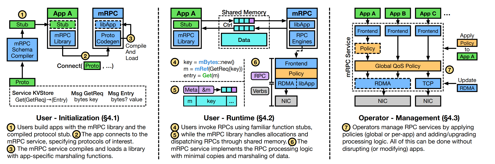

图 2：Overview of the mRPC workfow from the perspective of the users (and their applications) as well as infrastructure operators.

图 2 展示了 mRPC 架构与工作流程的宏观概述，并将其划分为三个主要阶段：初始化、运行时以及管理。mRPC 服务作为一个非 root 的用户态进程运行，它拥有访问必要网络设备的权限，并为每个应用程序提供了一个共享内存区域。在阐述各个阶段时，我们主要立足于单机视角，即重点关注同时运行着 RPC 客户端应用程序与 mRPC 服务的单台机器。

当然，RPC 服务端同样可以与 mRPC 服务协同运行。在此情景下，系统可以使用 mRPC 特有的序列化（marshalling）机制。此外，我们还提供了灵活的序列化支持，以允许 mRPC 应用使用业界通用的标准格式（如 gRPC）与外部节点进行交互。在后文的实验评估中，我们主要聚焦于客户端和服务端均部署了 mRPC 的场景。

初始化阶段涵盖了从构建应用程序到该程序绑定至特定 RPC 接口的完整过程。具体步骤如下：

- **① 协议模式定义与存根生成**：与 gRPC 类似，用户首先需要定义协议模式（Protocol Schema）。mRPC 模式编译器会据此生成相应的存根（Stub）代码，并将其嵌入到应用程序中。文中以一个仅包含单个 `Get` 函数的键值存储服务为例来对此进行阐述。
- **② 服务连接与协议指定**：当应用程序部署完毕后，它会与运行在同一台机器上的 mRPC 服务建立连接，并指定其所关注的协议，这些协议由先前生成的存根代码进行维护。
- **③ 动态编译与库加载**：与此同时，mRPC 服务也会利用该协议模式来生成、编译并动态加载一个特定于该协议的函数库，其中包含了专门针对该应用模式的序列化与反序列化（marshalling/unmarshalling）代码。

这种动态绑定（Dynamic Binding）机制是 mRPC 能够作为一项长期运行的系统服务、并支持处理任意应用程序（及其相应 RPC 模式）的核心技术支撑。

至此，系统进入运行时阶段，应用程序开始正式发起 RPC 调用。我们的方法在应用程序与 mRPC 之间采用共享内存（Shared Memory）机制，其中既包含了控制队列（Control Queues），也包含了数据缓冲区（Data Buffer）。

- **④ 接口调用与共享内存分配**：由 mRPC 协议编译器生成的应用协议存根（Stub）可以像传统的 RPC 接口一样被直接调用，唯一的区别在于，作为输入参数或返回值的复杂数据结构必须分配在共享数据缓冲区的特定堆（Heap）空间中。文中以调用 `Get` 函数的类 Rust 伪代码片段为例对此进行了展示。
- **⑤ 内部调用与缓冲区管理**：在底层内部，存根与 mRPC 库协同工作，负责管理控制队列中的 RPC 请求与回复，并同步处理数据缓冲区中的内存分配与释放。
- **⑥ 模块化引擎与数据通路执行**：mRPC 服务通过模块化的“引擎（Engine）”来处理 RPC。这些引擎通过相互组合，从而构建出针对每个应用程序的数据通路（Datapath，即一连串 RPC 处理逻辑的序列）。每个引擎各自负责一类特定的任务（如应用程序接口、限流、传输接口等）。需要说明的是，引擎自身并不包含执行上下文（Execution Context），而是由 mRPC 中对应于内核级线程的运行时（Runtime）统一进行调度。在具体执行时，引擎从输入队列中读取数据，完成处理后，再将输出结果推入后续队列。其中，面向外部的引擎（即前端和传输引擎）使用异步控制队列，而所有其他引擎则由运行时以同步方式执行。此外，应用程序的控制队列与 mRPC 服务共同驻留在同一块共享内存中。

这种架构与动态绑定机制相结合，使 mRPC 能够**直接面向 RPC（而非网络数据包）进行操作**，从而彻底避免了传统基于 sidecar 方案所带来的高昂开销。

此外，mRPC 处理逻辑的模块化设计使其能够以对应用程序完全透明的方式，充分利用 RDMA 和 smartNICs（智能网卡）等高性能网络硬件的优势。其间面临的一个核心挑战（我们将在第 4.2 节中详细阐述）在于：如何在将数据拷贝（data copies）降至最低的前提下，安全地对共享内存中的 RPC 流量执行运维策略。

最后，mRPC 旨在提升基础设施运维人员对 RPC 的可管理性。此时，我们将视角放大，重点关注由单个 mRPC 服务所支持的所有应用程序的整体处理逻辑。

- **⑦ 策略的动态管控与硬件交互**：运维人员可能希望对应用程序发起的 RPC 请求施加多种不同的策略，这既可以针对特定应用单独配置（如限流、访问控制），也可以跨应用进行全局部署（如 QoS）。mRPC 允许运维人员在运行时动态地添加、移除、更新或重新配置这些策略。这种灵活性并不仅限于策略层面，还同样扩展到了负责与网络硬件进行交互的底层组件。

其间面临的一个核心挑战（我们将在第 4.3 节中详细阐述）在于：如何在完全不中断运行中应用的前提下，支持 mRPC 引擎的热升级（live upgrade），同时妥善管理那些共享内存队列的引擎。

## 4. Dsign

本节将阐述 mRPC 如何提供动态绑定、高效的策略与可观测性支持、热升级以及安全保障。

### 4.1 Dynamic RPC Binding

不同的应用程序具有不同的 RPC 模式（schemas），这些模式最终决定了 RPC 数据的序列化（marshalling）方式。在传统的“库式RPC”（RPC-as-a-library）方案中，协议编译器会生成序列化代码，并将其直接链接到应用程序中。

而在我们的设计中，序列化工作改由 mRPC 服务统一负责。这意味着，特定于具体应用的序列化代码必须从 RPC 库中完全解耦出来，并在 mRPC 服务内部独立运行。倘若无法切实保障这种架构上的隔离，恶意用户便有可能乘虚而入，导致任意代码执行（arbitrary code execution）的安全漏洞。

应用程序直接向 mRPC 服务提交 RPC 模式（而非序列化代码）。mRPC 服务会据此自动生成相应的序列化代码，随后对其进行编译并动态加载该函数库。因此，系统完全依赖 mRPC 服务的代码生成器来确保为**任何**用户提供的 RPC 模式都能生成正确的序列化代码。此外，在 RPC 客户端与服务端进行初始握手时，两端的 mRPC 服务会校验双方提供的 RPC 模式是否一致；若不匹配，则会直接拒绝客户端的连接请求。

接下来还需要解决三个遗留问题。首先，**内嵌于应用程序中的用户存根（user stub）与 mRPC 库各自承担什么职责？** 在 mRPC 中，应用程序依赖用户存根来实现其 RPC 模式（schema）中所指定的抽象。这意味着，系统仍然需要生成胶水代码（glue code）以维持传统的应用程序编程接口（API）。

我们的解决方案是提供一个独立的协议模式编译器（该编译器处于不可信域，由应用开发人员运行），用以生成不涉及序列化（marshalling）与传输逻辑的用户存根代码。在具体运行时，应用程序的 RPC 存根（在 mRPC 库的协助下）会在共享内存堆上创建一个消息缓冲区，其中包含该 RPC 的元数据，以及指向各 RPC 参数的有类型指针（typed pointers）。随后，该消息会被放入一个共享内存队列中，由 mRPC 服务进行后续处理。接收端的工作机制与之类似。

其次，**这种方法是否会增加 RPC 的连接/绑定时间（connect/bind time）？**

如果仅进行简单朴素的实现，该设计确实会延长 RPC 的连接/绑定时间。这是因为当 RPC 客户端首次连接到对应的服务端时（或者等同于 RPC 服务端绑定到该服务时），mRPC 服务必须现场编译 RPC 模式并加载生成的序列化库。然而，这种延迟并非该架构固有的缺陷，我们可以通过以下方式予以缓解：

作为一种预取（prefetching）机制，mRPC 服务可以在启动应用程序之前提前接收 RPC 模式。在获取模式后，服务会提前编译并缓存相应的序列化代码。这样，在实际发起 RPC 连接/绑定时，mRPC 服务只需根据 RPC 模式的哈希值进行缓存检索（cache lookup）。如果缓存命中，mRPC 服务将直接加载关联的动态库；若未命中，服务才会调用编译器实时生成该库并将其推入缓存。通过这种方式，连接/绑定时间可以从数秒骤降至几毫秒。

第三，**当新应用接入时，现有的应用程序是否会面临停机（downtime）？** 多线程的 mRPC 服务是一个单一进程，同时为众多 RPC 应用程序提供服务。然而，针对不同 RPC 应用的序列化引擎（marshalling engines）在彼此之间并不共享。它们驻留在不同的内存地址空间中，能够完全独立地进行加载或卸载。我们将在第 4.3 节中详细阐述如何在不干扰运行中应用程序的前提下，实现引擎的动态加载与卸载。

### 4.2 Effcient RPC Policy Enforcement and Observability

为了实现高效的 RPC 策略执行与可观测性，我们提出了一个核心理念：**发送端应该只进行一次序列化（且尽可能滞后），而接收端应该只进行一次反序列化（且尽可能提前）。**

- **发送端流程**：我们希望直接面向来自应用程序的 RPC 请求执行策略管控与可观测性操作，在此之后，再统一将 RPC 逻辑序列化（marshal） into 网络数据包。
- **接收端流程**：与之对应，网络数据包送达后应首先被反序列化（unmarshal）为 RPC 形式，在依次应用策略和可观测性操作后，直接交付给目标应用程序。

与传统的“库式RPC + **sidecar**”方案相比，这种设计彻底消除了中间冗余的（反）序列化步骤（参见图 1）。

**数据：支持 DMA 的共享内存堆**。我们的设计核心在于每个应用程序与 mRPC 服务之间建立的专属共享内存堆（注意，该堆在不同应用程序之间并不共享）。在 mRPC 库的协助下，应用程序可以直接在共享内存堆中构建用作 RPC 参数的数据结构。由于每个应用都拥有独立的共享内存区域，这在（可能互不信任的）不同应用之间提供了极佳的隔离性。

此外，mRPC 库还包含一个标准的 **slab 分配器**（slab allocator），用于管理该共享内存之上的对象分配。若共享内存内的空间不足，slab 分配器会向 mRPC 服务申请额外的共享内存，并将其映射到对应应用程序的地址空间中。mRPC 服务拥有对该共享内存堆的访问权限，从而能够直接面向应用的 RPC 请求执行相应的处理逻辑。同时，该服务还维护了一个私有内存堆，用以处理一些必要的内存拷贝。

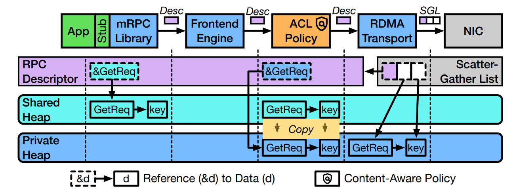

图 3：Overview of memory management in mRPC. Shows an example for the Get RPC that includes a content-aware ACL policy.

图 3 展示了一个包含键值存储服务访问控制的示例工作流程。通过将数据结构直接驻留在共享内存中，应用程序在向 mRPC 服务提交 RPC 请求时，只需提供指向数据的指针，而无需传递数据本身。

我们将应用程序发送给 mRPC 服务的此类消息称为 **RPC 描述符**（RPC descriptor）。如果存在多个 RPC 参数，该 RPC 描述符则会指向一个指针数组（每个指针分别指向堆上的不同参数）。

假设存在一个 ACL 策略，其规则为当键（key）与特定字符串匹配时拒绝该 RPC 请求。为此，mRPC 服务会首先将该参数（即 key）以及所有父级数据结构（即 `GetReq`）复制到自身的私有堆中。此举旨在防御“检查时至使时”（TOCTOU）攻击。由于应用程序拥有对支持 DMA 的共享内存的持久访问权限，在 mRPC 服务执行策略的间隙，应用完全有可能篡改内存中的内容。复制参数是一项标准的缓解技术，正如操作系统内核为了防止 TOCTOU 攻击，会强制将系统调用参数从用户空间（用户态）复制到内核空间（内核态）一样。需要指出的是，只有当策略的判定行为依赖于 RPC 的具体内容时，才需要执行这一复制操作。我们在第 7.2 节的实验中表明，即便引入了此类复制开销，mRPC 在执行 ACL 策略时的性能损耗仍远低于 gRPC + Envoy 组合。

RPC 描述符会被相应修改，使指向已复制参数的指针重新指向私有堆（private heap）。在接收端，虽然不存在 TOCTOU（检查时至使用时）攻击的威胁，但我们仍需注意，不能将 RPC 数据直接放入共享内存中。如果存在依赖于 RPC 参数值的接收端策略，mRPC 服务会首先将网络中的 RPC 数据接收到自身的私有堆中，待策略处理完成后，再将该 RPC 数据复制到共享堆（shared heap）中。这可以有效防止应用程序读取到本应被策略丢弃或修改的 RPC 数据。

值得注意的是，当策略处理不依赖于 RPC 参数的具体值时（例如限流策略），我们可以直接绕过这一复制过程。在执行 ACL 策略期间，如果键（key）参数存在于黑名单（blocklist）中，该 RPC 将被直接丢弃。需要说明的是，一旦 RPC 被丢弃，任何后续的处理逻辑都将不再执行（包括序列化操作）。

最后，在处理逻辑的末尾，传输适配器引擎（transport adapter engine）开始执行。mRPC 目前支持两种传输方式：TCP 和 RDMA。

- **针对 TCP 传输**：mRPC 采用内核提供的标准**分散-聚集（scatter-gather，即 iovec）套接字接口**。
- **针对 RDMA 传输**：mRPC 则采用**分散-聚集 verb 接口**，从而允许网卡（NIC）直接与驻留在共享（或私有）内存堆上、包含 RPC 元数据及参数的缓冲区进行交互。

无论是 TCP 还是 RDMA，mRPC 都能直接向传输层提供离散的内存块（disjoint memory blocks），从而彻底消除了不必要的数据移动。

**控制：共享内存队列**。为了实现应用程序与 mRPC 服务之间的高效通信，我们采用了共享内存控制队列。针对应用程序与 mRPC 服务之间的交互，mRPC 会分配两个单向队列分别用于发送和接收请求。

- **请求内容与安全防御**：这些请求中包含了 **RPC 描述符**，用以引用共享内存堆上的具体参数。为了防御 TOCTOU（检查时至使用时）攻击，mRPC 服务总是会强制复制应用程序放入发送队列中的 RPC 描述符。
- **队列轮询的两种机制**：mRPC 提供了两种队列轮询选项：
  1. **忙轮询（busy polling）**：应用端的 mRPC 库和 mRPC 服务均在各自对应的队列端进行持续的忙轮询。
  2. **基于 eventfd 的自适应轮询（eventfd-based adaptive polling）**：mRPC 库或 mRPC 服务在向原本为空的队列中执行入队（enqueue）操作后，会发送事件通知。接收到通知后，系统会排空队列（完成相应的处理工作），随后继续等待后续事件。当队列为空时，eventfd 方案能够显著节省 CPU 周期。

> **方案权衡与实际应用**：虽然其他替代方案可以通过动态增减 mRPC 服务中用于忙轮询的线程数量来优化性能，但出于架构简便性的考虑，我们最终选择了 eventfd 方案。在实际的实验评估中，我们**对 RDMA 采用忙轮询**，而**对 TCP 采用基于 eventfd 的自适应轮询**。

**内存管理**。我们在 mRPC 库中实现了一个内存分配器，允许应用程序直接在共享内存堆上分配待发送的 RPC 数据结构。

- **共享内存申请机制**：该分配器可以代表应用程序向 mRPC 服务发起请求，以分配共享内存区域。这一机制类似于标准的堆管理器（heap manager）通过调用 `mmap` 或 `sbrk` 从操作系统内核申请内存。
- **三方共享与安全回收**：由于 RPC 消息（及其参数）需要在**应用程序**、**mRPC 服务**以及网卡（NIC）这三个实体之间共享，因此系统必须采用专门的内存分配器。只有当确定没有任何实体会再次访问某个内存块时，该内存块才能被安全地回收。

我们采用了一种**基于通知的内存管理机制**。具体而言，在发送端，待发送消息（outgoing messages）由应用程序内部的 mRPC 库进行管理；而在接收端，接收到的消息（incoming messages）则由 mRPC 服务统一管理：

- **发送端内存回收**：当应用程序不再访问待发送消息所占用的内存块时，该内存块不会被立即回收。只有当 mRPC 库收到来自 mRPC 服务的通知、确认相应消息已通过网卡（NIC）成功发送后，该内存块才会被释放。这种设计与 Linux 中零拷贝套接字（zero-copy sockets）的工作机制非常相似。
- **接收端内存回收**：接收到的消息会被放置在独立的**只读共享堆**缓冲区中。当应用程序完成数据处理（例如 RPC 调用返回）后，这些接收缓冲区即可被回收。为了支持这一回收流程，当特定消息不再被应用程序使用时，mRPC 库会向 mRPC 服务发送通知。此外，为了进一步提升性能，多个 RPC 消息的通知会进行**批量合并发送**（batched）。
- **语义差异与显式拷贝**：如果接收端应用代码需要长期保存或修改传入的数据，则必须对其进行**显式拷贝**。尽管这种按需拷贝的设计与传统的 RPC 语义有所不同，但在我们基于 Masstree 和 DeathStarBench 的系统实现与评估中，尚未发现任何必须进行这种额外拷贝的实际场景。

**跨数据通路策略引擎**。mRPC 支持可在多条数据通路（这些通路可能跨越多个应用程序）上操作的引擎。例如，任何全局策略（如 QoS）都需要面向所有数据通路进行操作（参见第 5 节）。

对于此类引擎，我们会为其所适用的每条数据通路分别实例化一个引擎副本。这些副本在状态管理上支持两种可选的交互机制：

- **通过共享状态通信**：副本之间可以通过共享状态（shared state）进行交互，但这需要妥善管理跨运行时（runtimes）的资源竞争（contention）。
- **支持运行时本地状态**：副本也可以仅维护运行时本地状态（runtime-local state），从而实现完全无竞争（contention-free）的高效运行。

### 4.3 Live Upgrades

尽管 mRPC 服务的模块化引擎设计与 Snap [58] 和 Click [47] 类似，但我们在升级机制上采用了截然不同的设计理念。Click 完全不支持热升级（live upgrades），而 Snap 则通过启动一个升级后的新进程与旧进程并行运行。在此过程中，旧进程会序列化引擎状态并将其传递给新进程，再由新进程恢复并重新启动这些状态。这意味着，即使只是修改某个 Snap 引擎中的单行代码，也必须完全重启所有的 Snap 引擎。

这种设计理念在根本上与 mRPC 互不兼容，因为 mRPC 需要不断应对接入具有不同 RPC 模式（schemas）的新应用，这使得我们的升级需求更加频繁。此外，我们希望避免应用之间的“命运共享”（fate sharing）：对某一应用程序数据通路的修改，绝不应给其他应用程序的性能带来任何影响。从本质上说，Snap 是一个不包含任何特定应用代码的纯网络协议栈，而 mRPC 则必须具备应用感知（application-aware）能力，以此来实现 RPC 数据的序列化。

我们将引擎实现为插件化模块（即动态可加载的函数库）。在此基础上，我们设计了一种热升级（live upgrade）方法，能够支持**在完全不干扰其他数据通路的前提下，对特定数据通路中的组件进行升级、添加或移除**。

**引擎升级**。为了升级单个引擎，mRPC 采用了一套清晰的流水线步骤：

- **步骤一：断开运行时调度**：mRPC 首先将目标引擎从其运行时（runtime）中分离出来，从而阻止其被继续调度。
- **步骤二：销毁旧引擎并保留状态**：接着，mRPC 会销毁旧引擎并释放其占用的内存空间，但会在内存中继续保留该旧引擎的原有状态。需要注意的是，此时该引擎已与其队列解耦，且处于非运行状态。
- **步骤三：加载新引擎与配置队列**：随后，mRPC 加载新引擎，并为其配置相应的发送和接收队列。新引擎将直接承接旧引擎留下的状态并启动。
- **步骤四：状态结构转换（若有变化）**：如果引擎状态的数据结构发生了变更，升级后的引擎需要负责执行必要的状态迁移与转换（这部分逻辑必须由引擎开发者具体实现）。值得注意的是，这一规则同样适用于跨数据通路引擎的任何共享状态。
- **步骤五：重新挂载运行时**：最后一步，mRPC 将这个全新引擎重新挂载到运行时中，使其恢复正常的调度执行。

**数据通路的动态变更**。当运维人员通过添加或移除引擎来变更数据通路时，这一过程将涉及队列的创建（或销毁）以及**在途 RPC**（in-flight RPCs）的管理。

- **添加引擎（相对简便）**：此类变更非常简单直接，因为它仅涉及断开并重新配置现有引擎之间的逻辑队列。
- **移除引擎（较为复杂）**：此类变更要复杂得多，因为某些在途 RPC 可能会滞留在引擎的内部缓冲区中。例如，限流（rate limiter）策略引擎必须维护一个内部队列，以确保其输出队列满足预设的流量速率。

因此，引擎开发者有责任确保：在引擎被移除时，必须将这些内部缓冲区中的残留数据完全刷新（flush）至输出队列中。

**跨主机升级或数据通路变更**。某些同时涉及发送端和接收端主机的引擎升级或数据通路变更，需要非常谨慎地管理跨主机的在途 RPC（in-flight RPCs）。

- **升级挑战与方案制定**：例如，若要升级 mRPC 核心利用 RDMA 的方式，发送端和接收端主机都必须协同进行升级。在这种场景下，运维人员必须制定周密的升级方案，其中可能需要将现有引擎先升级为某种**过渡性的、向后兼容的**中间态引擎实现。
- **升级顺序的控制**：该方案还需要明确规定具体的升级顺序，例如采取“先升级接收端、后升级发送端”的步骤。

我们在第 7.3 节的实验评估中展示了这样一个复杂的具体热升级（live upgrade）案例，该案例成功优化了基于 RDMA 处理大量小 RPC 请求时的系统性能。

### 4.4 Security Considerations

我们为 mRPC 设想了两种部署模式：

1. **租户自主管理模式**：云租户使用 mRPC 来管理自身的 RPC 工作负载（类似于如今 sidecar 的使用方式）。
2. **提供商托管模式**：云服务提供商代表租户，利用 mRPC 来统一管理 RPC 工作负载。

在这两种模式中，都存在两类 trade-off 截然不同的**主体（principals）**：**运维人员（operators）与应用程序（applications）**。

- **运维人员**：负责配置硬件或虚拟基础设施、部署 mRPC 服务，并设定由 mRPC 强制执行的各类策略。
- **应用程序**：运行在运维人员提供的基础设施之上，通过与 mRPC 服务进行交互来发起 RPC 调用。

### 信任模型（Trust Model）

应用程序信任运维人员，以及运维人员所提供的所有特权软件（如操作系统）和底层硬件；同时，应用程序和运维人员均信任本系统提供的 mRPC 服务及协议编译器。

然而，在这两种部署模式中，**应用程序本身都是不可信的**，甚至可能是恶意的（例如，应用可能会企图绕过或规避既定的网络策略）。在第一种部署模式（租户自主管理模式）下，mRPC 服务运行在专属于该租户的虚拟化网络之上。由于云服务提供商已经在底层提供了完备的租户间隔离机制，因此在 mRPC 服务内部运行任意策略与可观测性代码，并不会对其他租户的流量构成攻击威胁。而在第二种部署模式（提供商托管模式）下，我们目前的原型系统尚不支持在 mRPC 服务内部运行由租户自行提供的策略实现。如何在保障安全的前提下，将租户提供的策略实现与云服务提供商自身的策略实现进行有机整合，将作为我们未来的研究方向。

从应用程序的角度来看，我们希望确保**与现有的“RPC 库 + sidecar”方案相比，mRPC 能够提供同等的安全保障**。我们将从以下两个维度对此展开讨论：1) 动态绑定，2) 策略执行。

- **动态绑定的流程与潜在隐患**：我们的动态绑定方法涉及用于应用 RPC （反）序列化（(un)marshalling）的共享库的生成、编译以及运行时加载。鉴于最终编译出的代码是基于应用端提供的 RPC 模式（schema）生成的，这便构成了一个潜在的**攻击向量**（vector of attack）。
- **编译器的信任与安全防范**：为了防范这一风险，mRPC 模式编译器被设计为完全可信的实体，且仅暴露**极简接口**（minimal interface）——除了提供 RPC 模式本身之外，应用程序对于序列化代码的具体生成过程没有任何控制权。此外，我们开源了该编译器的代码实现，以便接受业界的公开审查。

在我们的所有 RPC 处理逻辑中，系统 Ox 都是通过操作共享内存控制队列和数据缓冲区中的 RPC 表现形式，来对 RPC 请求执行策略管控的。

- **TOCTOU 攻击隐患**：如果仅采用简单朴素的共享内存实现，这会引入一个潜在的攻击向量，即易遭受“检查时至使用时”（TOCTOU）攻击。例如，应用程序完全有可能在策略执行完毕之后、但在传输引擎真正处理该消息之前的间隙，对 RPC 消息进行篡改。
- **发送端的防御对策**：在 mRPC 中，我们的解决之道是：在执行任何依赖于 RPC 具体内容（而非数据包长度等元数据）的策略之前，强制将数据提前复制到 mRPC 的私有堆（private heap）中。
- **接收端的安全机制**：同理，接收到的 RPC 在通过所有策略审核之前，绝不能直接放入共享内存中。否则，在策略来得及对这些 RPC 进行丢弃（或修改）之前，应用程序就已经能够读取到这些传入的数据了。

> **隔离性保障**：为了确保安全性，共享内存区域由 mRPC 服务**针对每个应用程序独立进行维护**，从而在不同应用之间提供完备的隔离性。

## 5. Advanced Manageability Features

mRPC 的架构为实现**跨应用程序 RPC 调度**等高级可管理性特征（manageability features）创造了可能。在本节中，我们将具体介绍基于我们的策略引擎框架所开发的两个此类特征，以此来展示“RPC 即托管服务”（RPC-as-a-managed-service）架构更广泛的实用价值与普适性。

**特性 1：全局 RPC QoS**。mRPC 允许基于当前未决 RPC（outstanding RPCs）的全局视图，对跨应用程序的工作负载进行集中式 RPC 调度。例如，为了支持延迟 SLO（服务水平目标），mRPC 可以强制执行一项跨应用的全局策略，优先处理截止时间最早（earliest deadlines）的 RPC，或者优先处理延迟敏感型的工作负载。

- **核心挑战**：如果仅进行简单朴素的实现，系统可能会尝试直接向横跨多个运行时（即执行线程上下文）的数据通路应用 QoS 策略。这将要求每条数据通路上的策略引擎副本必须共享关于未决 RPC 的状态，从而带来高昂的同步开销。
- **协同设计**：因此，我们采用了类似于 Linux 内核的架构策略——在每个运行时（per-runtime）的粒度上独立应用 QoS 策略。这种设计可以直接利用运行时本地存储（runtime-local storage），从而在完全无需同步的情况下高效运行。

在目前的系统实现中，我们支持一种基于可配置大小阈值、**优先处理小型 RPC** 的 QoS 调度策略。

**特性 2：规避 RDMA 性能异常**。众所周知，若缺乏精细调优（fine-tuning），RDMA 工作负载往往无法充分发挥特定 RDMA 网卡（NIC）的潜在性能，而且特定的流量模式（traffic patterns）甚至可能引发性能异常（例如 RDMA 吞吐量低下、暂停帧风暴等）。

- **前人工作的局限**：尽管诸如 ScaleRPC 和 Flock 等前人工作已提出相关技术来更高效地利用 RNIC，但它们的方法均基于传统的库模式（library-based），且仅能作用于单一应用程序。因此，当多个应用的工作负载发生叠加（combination）并共同导致 RDMA 性能恶化时，这些方案便无法应对。
- **mRPC 的优势**：相比之下，mRPC 的架构使我们能够掌握所有 RDMA 请求的全局视图（global view），从而能够从根本上有效规避此类性能异常。

我们在 **RDMA 传输引擎**内部实现了一个**全局 RDMA 调度器**，用于将 RPC 请求转换为 RDMA 消息并发送给 RDMA 网卡（NIC）。

- **解决的核心问题**：在具体实现中，我们重点解决由于大小不一的分散-聚集（scatter-gather）元素相互交织（这些元素可能横跨不同的 RPC 以及不同的应用程序）而导致的性能退化问题。
- **聚合优化机制**：我们通过引入**显式拷贝**（explicit copy）将这些元素融合（fuse）在一起，并将融合后整个元素的大小上限严格控制在 **16 KB** 以内。

## 6. Implementation

mRPC 基于 Rust 语言实现，总计约 **3.2 万行（32K 行）代码**。具体代码分布如下：

- **协议编译器**：约 3000 行
- **mRPC 控制面**：约 6000 行
- **引擎具体实现**：约 1.2 万行
- **mRPC 核心库**：约 1.1 万行

其中，mRPC 控制面是 mRPC 服务的重要组成部分，主要负责各个引擎的动态加载与卸载。

### 热升级局限性与设计考量

需要指出的是，**mRPC 控制面并不支持热升级**（live-upgradable）。同时，由于 **mRPC 核心库**是直接链接（linked）到各个应用程序中的，因此它同样不支持热升级。尽管如此，我们在设计中并未预见频繁升级这些组件的需求。因为它们仅负责实现高层且极其稳定的 API 逻辑，例如基于共享内存队列的通信机制，以及引擎的加载与卸载管理。

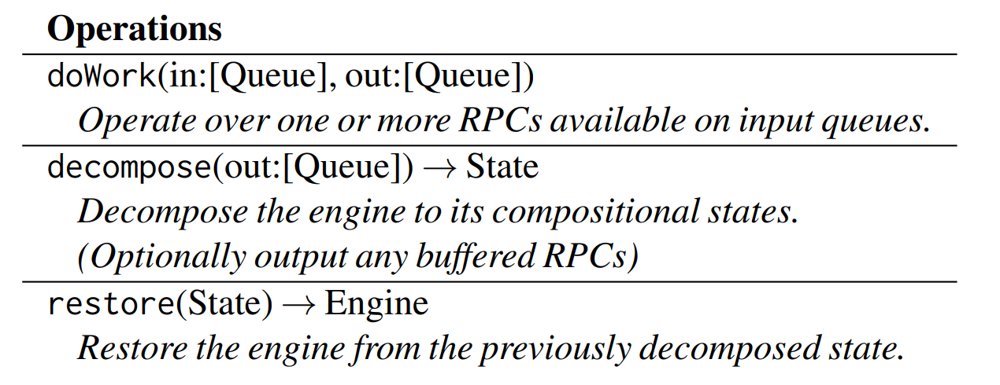

表 1：mRPC Engine Interface.

**引擎接口**。表 1 展示了所有引擎必须实现的核心 API 函数。

- **异步驱动机制**：每个引擎都代表某种异步计算逻辑，通过调用 `doWork` 来对输入和输出队列进行操作，其本质类似于 Rust 中的 `Future`。mRPC 维护了一个运行时执行器池（pool of runtime executors），通过持续调用 `doWork` 来驱动各个引擎运行，其中每个运行时执行器都唯一对应一个内核线程。
- **启发式调度策略**：我们目前实现了一种受 Snap [58] 启发的简单调度策略：在启动时，引擎可以被调度分配给一个专属的（dedicated）**或**共享的（shared）运行时。此外，当某个运行时中没有处于活跃状态的引擎时，它将自动进入休眠状态（put to sleep）并释放 CPU 周期。

### 热升级 API 支持：`decompose` 与 `restore`

为了支持高效的热升级，引擎还必须实现以下两个关键 API：

1. **decompose（解构）**：在此阶段，引擎的具体实现负责对自身进行析构，并在内存中构建出其最终状态的呈现形式（representation），随后向 mRPC 控制面返回该状态的引用。
2. **restore（恢复）**：随后，mRPC 会在升级后的全新引擎实例上调用 `restore`，并将旧引擎最终状态的引用作为参数传入，从而完成状态的无缝接管。

> **向后兼容性提示**：引擎开发者需要自行负责处理不同引擎版本之间的**向后兼容性**（backward compatibility）。这一过程与应用程序数据库在表结构（schema）发生变更时所进行的升级和数据迁移非常相似。

**传输引擎**。我们将消息的可靠网络通信抽象为传输引擎，它们在设计理念上与 Snap 和 TAS 类似。

我们目前实现了两种传输引擎：

- **RDMA 传输引擎**：基于 **OFED libibverbs 5.4** 进行具体实现。
- **TCP 传输引擎**：构建于 **Linux 内核的 TCP 套接字**（TCP socket）之上。

**mRPC 核心库**。现代 RPC 库普遍允许用户通过独立于语言的模式文件（schema file）来定义 RPC 数据类型和服务接口（例如 gRPC 使用 protobuf，Apache Thrift 使用 thrift）。mRPC 实现了对 protobuf 的支持，并采用了与 gRPC 极为相似的服务定义形式（但去掉了 gRPC 的流式 API）。此外，mRPC 还与 Rust 的 async/await 生态进行了深度集成，从而极大地方便了应用开发中的异步编程。

### 服务创建与内存抽象

对于开发者而言，利用 mRPC 构建和管理服务的过程非常高效：

- **极简的开发流程**：开发者只需实现 RPC 模式（schema）中声明的业务函数。其所依赖的 RPC 数据类型会由 mRPC 模式编译器自动生成并链接到应用程序中。其余的一切底层繁琐事务——包括任务分发（task dispatching）、线程管理以及错误处理，均由 mRPC 库全权托管。
- **零感知的共享内存分配**：为了让应用程序能够在**不改变原有编程抽象**的前提下，直接在共享内存中分配数据，我们实现了一组共享内存数据结构，它们向外暴露了与 Rust 标准库完全一致且功能丰富的 API。

> **底层实现机制**：这一透明的高效特性，是通过将传统数据结构（如 `Vec` 和 `String`）的底层内存分配行为，直接替换为基于**共享内存堆分配器**（shared memory heap allocator）的分配逻辑来实现的。

##  Evaluation

我们在一个本地实验平台（on-premise testbed）上对 mRPC 展开评估。该平台的服务器配置了两个 100 Gbps Mellanox Connect-X5 RoCE 网卡（NIC）以及两颗 10 核 Intel Xeon Gold 5215 CPU（基频为 2.5 GHz）。这些机器通过一台 100 Gbps 的 Mellanox SN2100 交换机进行互联。

在具体测试中，我们采用了以下负载与指标评估配置：

- **延迟评估（Latency）**：除非另有说明，我们默认在全流程中仅维持单个在途 RPC（in-flight RPC）来精准测量时延。
- **吞吐量与速率评估（Goodput & RPC Rate）**：为了对实际有效吞吐量（goodput）和 RPC 吞吐速率进行基准测试，我们令每个客户端线程在 **TCP** 模式下维持 **128 个并发 RPC**，而在 **RDMA** 模式下维持 **32 个并发 RPC**。

### 7. Microbenchmarks

我们首先通过在两台机器（一台作为客户端，另一台作为服务器）上运行的一组**微基准测试**（microbenchmarks）来评估 mRPC 的性能。

- **测试负载配置**：RPC 请求包含一个字节数组参数，其响应同样是一个字节数组。我们通过改变该数组的长度来动态调整 RPC 的数据大小（RPC size）。其中，RPC 响应固定为一个填充了随机字节的 **8 字节**数组。
- **对比基线选择**：我们将 mRPC 与两种当前最先进的 RPC 实现进行对比，分别为 **eRPC** 和 **gRPC (v1.48.0)**。在实验中，我们分别使用 mRPC 的 **TCP 后端**和 **RDMA 后端**与 gRPC 和 eRPC 进行对应比较。
- **Sidecar 代理部署**：为了构建公平的对比环境，我们在 HTTP 模式下部署了 **Envoy (v1.20)** 作为 gRPC 的 sidecar 边车代理。由于目前现有的 sidecar 均不支持 RDMA，为了能够评估利用 sidecar 控制 eRPC 流量时的性能表现，我们基于 eRPC 接口自行实现了一个单线程的 sidecar 代理。

> **测试时长**：在所有实验中，我们均让应用程序持续运行 **15 秒**来测量并获取最终的基准测试结果。

**小 RPC 延迟**。我们通过在单条连接上发起 64 字节的 RPC 请求来评估 mRPC 的延迟。

- **测试表现与稳定性**：表 2 展示了小 RPC 请求的延迟结果。需要注意的是，由于现代 CPU 处理小消息的序列化（marshalling）速度极快，即使将消息大小扩展至 1 KB，表中的延迟数据依然保持稳定。在此实验中，我们使用 `netperf` 和 `ib_read_lat` 来测量底层的原始往返延迟。
- **具体延迟数据**：mRPC 在 TCP 模式下实现了 32.8 μs 的中位数延迟，在 RDMA 模式下实现了 7.6 μs 的中位数延迟。
- **抽象层开销分析**：相较于 `netperf` (TCP) 或底层的原始 RDMA 读取（raw RDMA read），mRPC 使往返延迟分别增加了 11.8 μs 和 5.1 μs。这部分增加的时延，正是构建在原始传输接口（如套接字 socket、verbs）之上的 mRPC 抽象层所带来的性能开销。

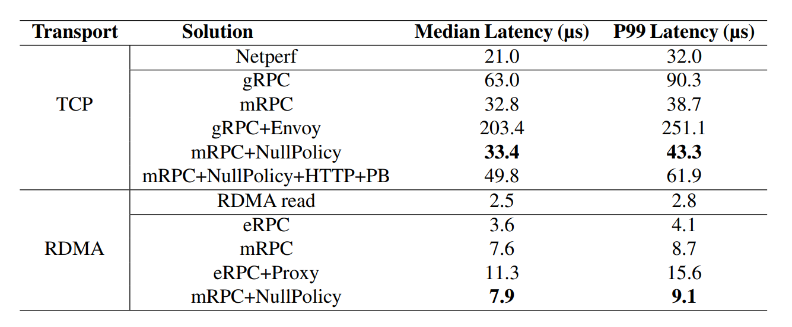

表 2：Microbenchmark [Small RPC latency]: Round-trip RPC latencies for 64-byte requests and 8-byte responses.

我们还评估了在引入边车代理（sidecar proxies）情况下的系统延迟。在此测试中，边车并不强制执行任何特定策略，因此我们测得的仅为其固有的**基础开销**（base overhead）。

- **传统边车方案的延迟激增**：实验结果表明，引入边车会显著增加 RPC 的延迟。在 gRPC 框架下，添加 Envoy 边车会导致其中位数延迟**增加至原先的三倍以上**；同时，在 eRPC 上也观察到了类似的延迟激增结果。
- **mRPC 的极低开销表现**：相比之下，在 mRPC 服务内部运行一个仅执行简单转发逻辑的**空策略引擎**（NullPolicy engine），对系统时延几乎没有任何影响，其中位数延迟仅仅增加了 **300 ns**。

在完整解决方案的对比中（即**启用了策略的 mRPC** 对比**挂载了代理的 gRPC/eRPC**）：

- **显著的延迟优化**：mRPC 将中位数延迟降低了 **6.1 倍**（即 33.4 μs 对比 203.4 μs），并将 99 分位长尾延迟（tail latency）降低了 **5.8 倍**。
- **RDMA 性能表现**：在 RDMA 环境下，mRPC 在中位数延迟和尾部延迟上分别比 eRPC 实现了 **1.3 倍**和 **1.4 倍**的加速。

### 架构优势与根因分析

上述性能差异的核心原因在于：eRPC 应用程序与其代理之间的通信必须通过网卡（NIC）进行，这导致终端主机驱动程序中的开销（包括 PCIe 延迟）**激增至原先的三倍**。相比之下，mRPC 的架构利用**共享内存**直接绕过了这一繁琐的步骤，从而实现了极具优势的“捷径”传输。

此外，为了将**架构设计的性能红利**与**具体系统实现上的差异**分离开来，我们进行了一项**消融实验**（ablation study）：在挂载空策略引擎（NullPolicy engines）的环境下，评估了采用完整 gRPC 风格序列化（即 Protobuf 编码与 HTTP/2 帧封装）的 mRPC 延迟表现。

- **消融实验结果**：在此配置下，与传统的 “gRPC + Envoy” 方案相比，mRPC 在中位数延迟和尾部延迟上均实现了 **4.1 倍**的加速。我们还观察到，mRPC 框架本身并没有引入显著的固定开销——即便扣除 Protobuf 和 HTTP/2 编码的成本，与独立运行的 gRPC（standalone gRPC）相比，mRPC 仍实现了略低的延迟。
- **序列化策略的灵活性**：在 mRPC 中，由于明确已知通信对端同样是 mRPC 服务，我们可以直接选择**定制化的序列化格式**以追求极致性能。而在其他特定场景下（例如与外部流量对接或处理不同机器的字节序/大小端差异时），我们依然可以灵活启用完整的 gRPC 风格序列化。
- **开销位置的深层对比**：当 mRPC 配置为使用完整 gRPC 风格序列化时，系统**仅需在 mRPC 服务之间**付出一次（反）序列化的开销。相比之下，在 “gRPC + Envoy” 方案中，除了 Envoy 代理之间需要进行（反）序列化之外，应用程序与 Envoy 代理之间的本地通信也必须重复承担这一（反）序列化开销。

> **后续测试说明**：在本文后续的实验评估中，我们均默认采用 mRPC 自带的**定制化序列化协议**。更多关于 gRPC 风格序列化的补充测试结果已在附录 §A.1 中给出。

**大 RPC 有效吞吐量**。在我们的有效吞吐量（goodput）测试中，客户端和服务器均使用单个应用程序线程。图 4 左侧展示了测试结果。在此后的性能讨论中，我们都将重点关注至少挂载了一个空策略引擎（NullPolicy engine）时的 mRPC 性能，以便与基于边车（sidecar）的方法进行公平对比。

- **吞吐量大幅提升**：对于 **8 KB** 的 RPC 请求，mRPC 相比于 “gRPC + Envoy” 和 “eRPC + Proxy” 的吞吐量分别提升了 **3.1 倍**和 **9.3 倍**。mRPC 在处理大 RPC 请求时效率尤为显著，因为在这类场景下，（反）序列化（(un)marshalling）在端到端 RPC 数据通路中所占用的 CPU 周期比例更高。
- **边车带来的带宽瓶颈**：无论是在 TCP 还是 RDMA 模式下，引入边车都会严重损害 RPC 的有效吞吐量。特别是在 RDMA 模式下，通过 RNIC 的**主机内（intra-host）往返流量**可能会与**主机间（inter-host）流量**在 RNIC/PCIe 总线上发生资源竞争，从而导致主机间流量的可用带宽**直接减半**。
- **超越独立 gRPC 的根因**：mRPC 的表现甚至超越了未挂载 Envoy 的独立 gRPC。从根本上说，mRPC 在序列化格式上更加高效：它直接使用了 **iovec** 结构，**不引入任何数据移动/拷贝**。

> **消融实验补充说明**：附录 §A.1 中的消融实验表明，即使让 mRPC 采用完整的 gRPC 风格序列化引擎，由于其**减少了（反）序列化的步骤次数**，其整体性能表现依然优于 “gRPC + Envoy”。

**CPU 开销**。为了深入理解 mRPC 的 CPU 开销，我们测量了单核有效吞吐量（per-core goodput）。测试结果展示在图 4 的右侧：

- **CPU 利用效率大幅提升**：mRPC 相比于 “gRPC + Envoy” 和 “eRPC + Proxy”，其单核有效吞吐量分别提升了 **3.8 倍**和 **9.3 倍**。这表明 mRPC 在 CPU 利用效率上远胜于基于边车/代理的传统方案。
- **与独立 eRPC 的对比**：尽管未挂载代理的独立 eRPC（standalone eRPC）自身表现出极高的运行效率，但随着 RPC 数据大小（RPC size）的不断增加，其效率最终会逐渐**收敛至与 mRPC 相当的水平**。

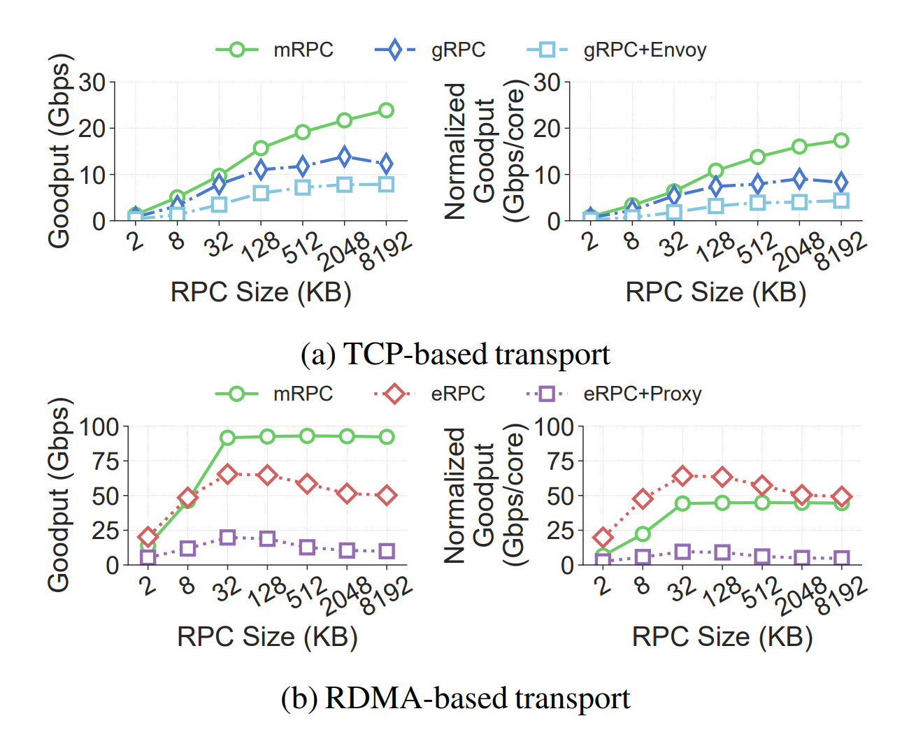

图 4：Microbenchmark [Large RPC goodput]: Comparison of goodput for large RPCs. Note that different solutions demand different amounts of CPU cores, so we also normalized the goodput to their CPU utilization, as shown in the right fgures. The error bars show the 95% confdence interval, but they are too small to be visible.

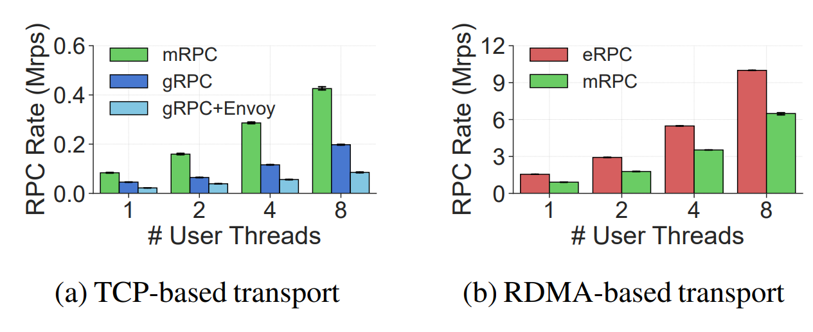

图 5：Microbenchmark [RPC rate and scalability]: Comparison of small RPC rate and CPU scalability. The bars show the RPC rate. The error bars show the 95% confdence interval.

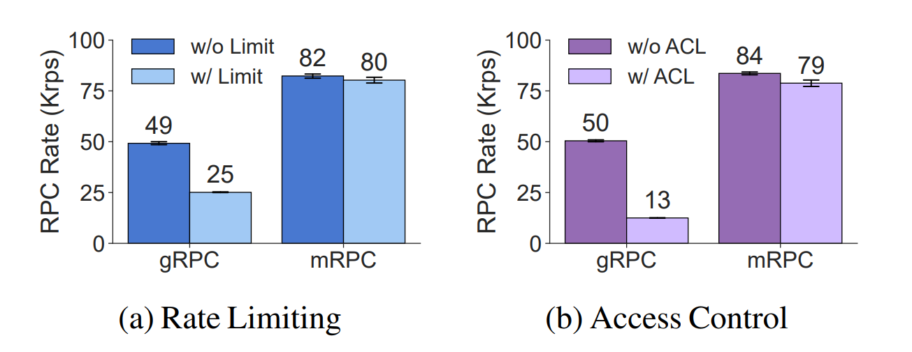

图 6：: Effcient Support for Network Policies. The RPC rates with and without policy are compared. The bars of w/o Limit and w/o ACL for gRPC show its throughput when the sidecar is bypassed. The error bars show the 95% confdence interface.

**RPC 吞吐速率与可扩展性**。我们评估了 mRPC 的小包 RPC 吞吐速率及其多核可扩展性。在实验中，我们将 RPC 请求大小固定为 32 字节，并逐步扩展客户端线程的数量。服务器端采用与客户端完全相同的线程数，且每个客户端线程对应连接一个服务器线程。图 5 展示了当用户线程数从 1 扩展到 8 时的 RPC 吞吐速率。所有参与测试的方案均展现出良好的可扩展性。

- **线程扩展表现**：从单线程扩展至 8 线程时，mRPC 在 TCP 和 RDMA 模式下的 RPC 吞吐速率分别提升了 **5.1 倍**和 **7.2 倍**。作为参考，独立 gRPC 提升了 4.3 倍，“gRPC + Envoy” 提升了 3.9 倍，而独立 eRPC 则提升了 6.5 倍。
- **绝对吞吐速率对比**：在 8 线程配置下，mRPC 在 TCP 模式下达到了 **0.43 Mrps**（百万次请求/秒）的吞吐速率，在 RDMA 模式下更是达到了 **6.5 Mrps**。相比之下，“gRPC + Envoy” 仅有 0.09 Mrps，即 mRPC 的性能达到了其 **5 倍**。
- **关于 eRPC + Proxy 的特殊说明**：我们在此未对 “eRPC + Proxy” 方案进行多线程扩展性评估，因为我们自行实现的 eRPC 代理仅支持单线程。在单线程运行环境下，“eRPC + Proxy” 达到了 0.51 Mrps 的吞吐速率。由此可见，即便该方案能够完美线性扩展至 8 线程，mRPC 的性能表现（6.5 Mrps）依然显著优于它。

### 7.2 Efficiency Policy Enforcement

我们以两种网络策略为例，来展示 mRPC 对 RPC 策略的高效支持：**(1) RPC 限流** 与 **(2) 基于 RPC 参数的访问控制**。

- **RPC 限流（Rate Limiting）**：该策略允许运维人员指定客户端每秒可以发送的 RPC 请求数量。在具体实现中，我们基于**令牌桶算法（token bucket algorithm）** [91] 将限流功能构建为一个独立的引擎。
- **基于参数的访问控制（Access Control）**：该策略会深入检查 RPC 的具体内部参数，并根据网络运维人员预设的一组规则直接丢弃（drop）不合规的 RPC。

> **与传统机制的区别**：这两种网络策略与传统的限流和访问控制机制有着本质的不同。传统机制通常仅用于限制底层的网络带宽，且其操作范围完全局限于数据包报头（packet headers）。

我们对比了使用 mRPC 策略执行限流，与在 gRPC 工作负载上使用 Envoy 限流器的性能表现。

- **实验配置与方法**：为了准确评估纯粹的性能开销（performance overheads），我们将限流阈值设定为**无穷大（infinity）**，以确保实际的 RPC 速率永远不会触发限流限制，从而使我们能够集中观察策略机制本身的固定开销。图 6a 展示了在启用和未启用限流策略时的 RPC 吞吐速率对比。
- **gRPC + Envoy 方案的剧烈性能衰退**：在传统方案中，一旦引入限流，gRPC 的 RPC 吞吐速率瞬间从 **49K 骤降至 25K**。这主要是因为引入 Envoy 边车代理（sidecar proxy）会带来巨大的系统级性能开销。
- **mRPC 的极低开销表现**：相比之下，mRPC 在启用限流策略后的 RPC 速率依然**稳定保持在 82K**，几乎没有受到影响。这表明在 mRPC 中启用策略所引入的开销微乎其微——该附加策略仅为整个 RPC 数据通路（datapath）增加了**数十至数百条额外的 CPU 指令**。

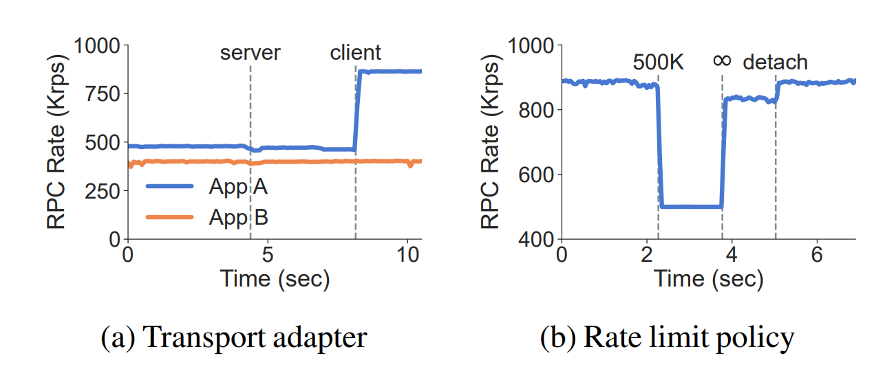

图 7：Live upgrade. In (a), the annotations indicate when the client of App A and server of A and B are upgraded. In (b), the annotations denote the specifed rate and when the policy is removed.

我们在 **DeathStarBench** 的酒店预订（hotel reservation）基准应用上评估了访问控制策略。该服务负责处理包含客户姓名、入住日期等参数的 RPC 请求，并返回推荐的酒店名称列表。在此测试中，我们设定了一项访问控制策略，专门基于请求中的 `customerName` 参数对 RPC 进行过滤。实验采用了一个包含 99% 有效请求和 1% 无效请求的合成工作负载（synthetic workload）。

- **对比方案与实现**：我们再次将 mRPC 的策略执行表现与使用 Envoy 过滤 gRPC 请求的方案进行了对比。其中，Envoy 端的过滤策略是基于 **WebAssembly (Wasm)** 插件实现的。
- **gRPC + Envoy 方案的性能剧变**：在该配置下，gRPC 的 RPC 吞吐速率从 **50K 骤降至 13K**。这不仅是因为固有的边车（sidecar）架构开销，更是因为 Envoy 此时必须进一步深度解析数据包，才能提取出用于匹配的 RPC 内部参数。
- **mRPC 的高能效表现**：相比之下，mRPC 的性能下降幅度要小得多，吞吐速率仅从 **84K 轻微降至 79K**。

### 开销根因与安全机制分析

> **设计注记**：在 mRPC 中，引入访问控制策略所带来的性能开销要明显大于之前的限流策略。

这种额外的开销主要源于 mRPC 为了兼顾数据安全而设计的双向内存拷贝机制：

1. **发送端（Sender side）**：mRPC 服务必须将相关的特定字段（即 `customerName`）强制复制到私有堆（private heap）中，以从根本上杜绝“检查时至使用时”（TOCTOU）篡改攻击。
2. **接收端（Receiver side）**：系统在策略审核通过后，必须将 RPC 数据从私有堆再次复制到共享堆（shared heap）中，以便上层应用程序读取。

### 7. Live Upgrades

我们通过两个具体场景来展示 mRPC 的**热升级**（live upgrade）能力。

- **场景 1：RDMA 性能优化驱动的引擎升级** 在开发 mRPC 的过程中，我们意识到，利用 RDMA 网卡的**分散-聚集列表**（scatter-gather list）在单个 RPC 中发送多个参数，可以显著提升 mRPC 的性能。在这种方法中，即使一个 RPC 所包含的参数在虚拟内存中是分散存储的，我们仍然可以通过**单次 RDMA 操作**（即 `ibv_post_send`）来完成该 RPC 的发送。
- **无感升级验证** 我们通过前后这两个版本的 RDMA 传输引擎来证明，mRPC 能够在**完全不影响正在运行的应用程序**的前提下实现此类热升级。需要说明的是，本文中的所有其他实验评估均已默认启用了这一优化后的 RDMA 特性。
- **升级影响范围与对比** 由于该升级涉及跨机器间 RDMA 的具体使用方式（即传输适配器引擎），因此它会**同时涵盖客户端和服务端的 mRPC 服务**。相比之下，传统的 gRPC 和 eRPC 框架根本无法支持此类架构层的热升级。

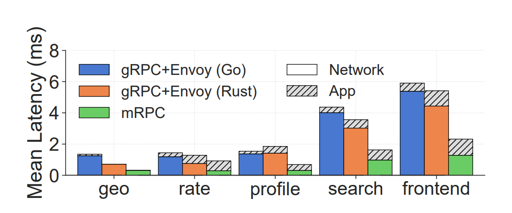

图 8：DeathStarBench: Mean latency of in-application processing and network processing of microservices. The latency of a microservice includes RPC calls to other microservices. The frontend latency represents complete end-to-end latency.

### 实验配置与热升级步骤

我们同时运行了两个应用程序（App A 和 App B）。两个应用均发送 **32 字节**的 RPC 请求，且其响应大小均为 **8 字节**。

- **多租户共享拓扑**：App A 和 App B 在服务端**共享同一个 mRPC 服务**，而它们各自的 RPC 客户端则部署在不同的物理机器上。
- **流量速率控制**：我们将 App B 的并发 RPC 数量限制为 8 个，以此强制其以较低的速率发送请求；同时，将 App A 的并发 RPC 数量设定为 32 个。
- **阶梯式升级流程**：我们首先对服务端进行热升级，使其能够接收以**分散-聚集列表**（scatter-gather list）形式呈现的参数；随后，我们再对 App A 端的客户端进行升级。

### 评估结果分析

图 7a 详细展示了 App A 和 App B 在升级前后的 RPC 吞吐速率变化：

- **服务端升级阶段（平滑无感）**：当服务端进行热升级时，我们观察到其对 App A 和 App B 运行速率的影响微乎其微。在整个升级期间，**App A 和 App B 均无需重新编译，也无需重启系统**。
- **客户端升级阶段（性能跃升）**：当 App A 客户端侧的 mRPC 服务完成升级后，由于启用了优化后的 RDMA 特性，**App A 的吞吐性能从 480K 直接飙升至 860K**。
- **多租户隔离验证**：在此期间，App B 的性能完全没有受到任何干扰，这是因为 App B 客户端侧的 mRPC 服务并未进行升级，从而完美验证了系统在热升级时的多租户隔离性。

**场景 2：运行时的策略动态移除**。强制执行网络策略通常会带来固有的性能开销，即便这些策略在当时并未触发实际效果（未发生拦截）。例如，即使将限流阈值设定得极大，系统为了通过令牌桶（token buckets）持续追踪当前速率，依然会引入一定的性能损耗。mRPC 允许在**运行时（runtime）动态移除策略**，且完全不会中断正在运行的应用程序。

- **实验配置**：我们采用了与 §7.2 相同的限流配置，但将其构建于 **RDMA 传输**之上。图 7b 详细记录了这一动态调整过程中的 RPC 吞吐速率变化。
- **动态演进流程与速率表现**：
  1. **未挂载状态**：系统在不挂载任何限流引擎的初始状态下运行。
  2. **引擎加载与限流**：随后，我们动态加载限流引擎并将限流阈值设定为 **500K**，RPC 吞吐速率随即瞬间变为 **500K**。
  3. **阈值设为无穷大（测算策略空转开销）**：接着，我们将限流阈值调整为**无穷大（infinite）**，此时 RPC 速率恢复至 **840K**（由于仍需维持令牌桶的追踪逻辑，该值略低于无引擎状态）。
  4. **彻底卸载引擎**：最后，在我们将限流引擎完全卸载（detach）后，该追踪开销被彻底释放，RPC 吞吐速率进一步提升并达到了 **890K**。

**核心要点**。通过上述实验，我们可以得出以下两个核心启示：

- **零业务中断的平滑升级**：首先，mRPC 允许在**完全不中断正在运行的应用程序**的前提下，对底层 mRPC 服务进行升级。
- **极具弹性的服务管理**：其次，热升级（live upgrades）为 RPC 服务带来了更加灵活的管理维度。这使得系统能够**在无需重新部署应用程序的前提下**，立竿见影地实现性能跃升，或者对管控策略进行实时的动态配置。

### 7.4 RealApplication

我们评估了 mRPC 的性能红利如何转化为**端到端（end-to-end）的应用层性能指标**。

**DeathStarBench 基准测试**：我们使用了 DeathStarBench 微服务基准测试套件中的酒店预订（hotel reservation）服务。

- **对照组（参考基准）配置**：官方参考基准（reference benchmark）是基于 **Go 语言**实现的，并采用了 gRPC 以及用于服务发现的 Consul。
- **实验组移植与优化**：由于我们的 mRPC 原型系统目前仅支持 Rust 应用程序，为了进行公平对比，我们将该应用的代码**移植（port）到了 Rust 语言**。
- **外部组件一致性**：在两组测试中，我们均使用了相同的开源后端服务，例如 memcached 和 MongoDB。

### 拓扑与环境配置

我们将 HTTP 前端和微服务分布式部署在实验平台的四台服务器上。

- **服务混部拓扑**：单体服务（如 memcached、MongoDB）与依赖它们的微服务**同宿部署**（co-located）在同一台服务器上。我们为每个微服务以及前端服务均分配了一个独立的单线程。
- **Sidecar 部署**：此外，我们在每台服务器上都部署了一个 Envoy 代理作为 sidecar（此时未启用任何活跃策略）。
- **底层网络与运行介质**：所有这三种方案均基于 **TCP** 传输。我们将 mRPC 和 Tonic 实现直接部署在**裸金属**（bare metal）上；而官方参考的 Go 套件则运行在采用主机网络（host network）的 Docker 容器中（已有研究 [103] 表明，相比于裸金属，这种配置引入的性能开销微乎其微）。

### 测试负载与基准对比

实验采用基准测试自带的负载生成器 [23] 向前端提交 HTTP 请求。

为了确保对比的公平性，除了官方参考的 Go 语言套件外，我们还基于 **Tonic [93]** 实现了该基准测试的 Rust 版本（Tonic 是目前 Rust 生态中事实上的 gRPC 标准实现）。

### 测试评测细节

在具体测试中，我们以 **20 rps**（每秒请求数）的负载速率持续加压 **250 秒**，并精准记录了每个请求的延迟表现：

- **延迟多维拆分**：我们将总延迟细致地拆分为两部分进行定量分析：1) 涉及到的每个微服务的**应用内处理时间**，2) **网络处理时间**。
- **动态绑定开销说明**：需要说明的是，在本次评估中，用户应用程序的动态绑定（dynamic bindings）已经提前缓存在了 mRPC 服务中，因此最终的延迟评测结果中**不包含动态绑定代码的生成时间**。

表 3：Masstree analytics: Latency and the achieved throughput for GET operations. MOPS is Million Operations Per Second.

图 8 展示了延迟的细分拆分结果。通过该实验，我们主要验证了以下两点结论：

- **Rust 版本移植的准确性验证**：首先，数据证实了我们自行在 Rust 上实现的 DeathStarBench 是对官方版本的**忠实重构**。可以看到，原始的 Go 语言实现与我们的 Rust 实现具有高度相似的延迟表现。此外，两者在 gRPC 框架上所消耗的延迟时间也基本一致。
- **端到端性能的大幅跃升**：其次，在**平均端到端延迟**指标上，挂载了空策略（null policy）的 mRPC 的性能达到了“gRPC + 边车代理（sidecar proxy）”方案的 **2.5 倍**。

> **更多细节提示**：附录 §A.2 中包含了关于尾部延迟（长尾延迟）以及未挂载边车代理场景的更多详细数据与深入分析。

**Masstree 性能分析**。我们还评估了 Masstree（一种内存键值存储系统）在基于 RDMA 的 mRPC 和 eRPC 上的性能表现。

- **工作负载配置**：我们采用了与 eRPC 完全相同的工作负载配置，其中包含 **99% 的 I/O 密集型单点 GET 请求**（point GET request）和 **1% 的 CPU 密集型范围 SCAN 请求**（range SCAN request）。
- **测试环境与拓扑**：我们在一台机器上运行 Masstree 服务器，在另一台机器上运行客户端。服务器端和客户端均使用 10 个线程，且每个客户端线程维持 16 个并发请求。基准测试总共持续运行 60 秒。

### 实验结果与设计权衡

表 3 的测试结果表明，eRPC 的性能优于 mRPC。

- **符合预期的性能差距**：这一结果符合技术逻辑，因为 eRPC 本身就是一种精心设计的、完全专注于极致高性能的传统库模式实现（library implementation）。
- **可管理性与性能的权衡**：相比之下，mRPC 则是通过付出轻微的性能代价，来换取更丰富的**高级可管理性特征**。在本实验场景下，使用 mRPC 代替 eRPC 意味着**中位数延迟增加了 34%**，同时**吞吐量降低了 20%**。

### 7.5  Benefts of Advanced Manageability Features

接下来，我们展示引入**集中式 RPC 管理**（centralized RPC management）所带来的性能红利。具体而言，我们将通过我们开发的两个**高级可管理性特征**（见 §5）来展开论证。

- **测试方法**：我们使用**合成工作负载**（synthetic workloads）来对这些高级可管理性特征进行全面的评估与测试。

表 4：Global QoS: Performance of latency- and bandwidthsensitive applications with and without a global QoS policy.

**全局 RPC QoS**。我们启用了**跨应用 QoS 策略**（cross-application QoS policy），该策略能够对来自多个应用程序的请求进行重新排序，并优先处理小 RPC 请求。

- **多租户混合部署配置**：我们配置了两个应用程序，并将它们绑定（pin）到同一个 mRPC 运行时（runtime）上。
  - **延迟敏感型应用（Latency-sensitive）**：发送 **32 字节**的 RPC 请求，且在全流程中仅保持单个在途 RPC（in-flight RPC）。
  - **带宽敏感型应用（Bandwidth-sensitive）**：发送 **32 KB** 的大包请求，并同时维持 **64 个并发 RPC**。
- **评测指标**：我们分别测量了延迟敏感型应用的**尾部延迟**（长尾延迟），以及带宽敏感型应用的**实际利用带宽**。

表 4 展示了最终的测试结果：

- **未启用 QoS 策略时**：带宽敏感型应用表现出极高的带宽利用率；然而，延迟敏感型应用则会受到严重的长尾延迟（high tail latency）干扰。
- **启用 QoS 策略后**：来自延迟敏感型应用的小请求被赋予了更高的优先级并得以优先发送。这直接将系统的 **P99 尾部延迟从 54.6 μs 显著降低至 21.8 μs**。

> **多租户带宽影响**：由于小包 RPC 请求所消耗的网络带宽微乎其微，因此该 QoS 重新排序策略对带宽敏感型应用几乎没有带来负面干扰，其**实际可用带宽的跌幅低于 1%**。

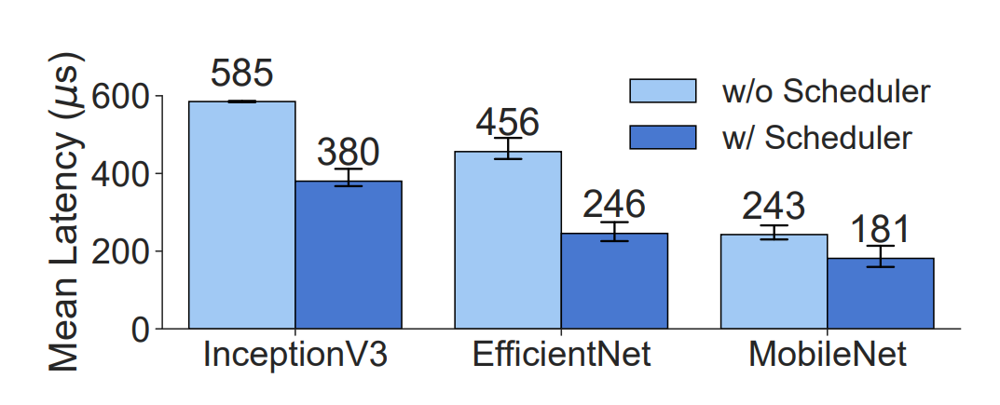

图 9：RDMA Scheduler: Mean RPC latency with or without RDMA scheduler. The error bars show the 95% confdence interval.

**RDMA 调度器**。我们的 RDMA 调度器将小包 RPC 请求批量打包为（最多）16 KB 的消息，并通过单次 RDMA 操作进行发送，从而有效减轻了 RDMA 网卡（NIC）的负载。

- **测试基准与背景**：我们的合成工作负载基于 **BytePS [37]**（一种将 RDMA 用于分布式深度学习的系统）。为了在服务器与客户端之间同步张量（tensor），BytePS 会前置一个 8 字节的键（key）并追加一个 4 字节的长度（length）来描述该张量。
- **引发性能异常的根因**：上述三个不连续的内存块会被放置在一个**分散-聚集列表（scatter-gather list）中并提交给网卡，从而形成了一种“小-大-小”（small-large-small）的消息模式。这种特殊的模式会引发系统底层的性能异常（performance anomaly）[49]**。然而，该消息模式在实际应用中极为普遍，因为程序经常需要使用一小段元数据（metadata）来描述庞大的有效载荷（payload）。
- **实验测试配置**：我们模拟了 BytePS 的 RPC 请求模式，并基于三种广泛使用的神经网络模型生成了 RPC 流量，分别为：**MobileNet**、**EfficientNetB0** 和 **InceptionV3 [31, 89, 90]**。每次 RPC 调用均由一个 8 字节的键、一个张量有效载荷以及一个 4 字节的长度组成，并使用单线程来发起请求。

### 评估结果分析

图 9 展示了平均 RPC 延迟表现。实验表明，我们的 RDMA 调度器带来了 **30% 至 90% 的延迟优化**。

> **网络差异说明**：这种性能提升幅度在不同的神经网络中有所差异，其根本原因在于不同模型在传输时所产生的 **RDMA 消息模式（RDMA message patterns）** 各不相同。

## 8. Related Work

**快速 RPC 实现**。RPC 的优化拥有悠久的历史。

- **早期设计与基础优化**：Birrell 和 Nelson 的早期 RPC 设计 [10] 引入了通过编译器生成绑定（bindings）、与传输协议对接以及诸如隐式确认（implicit ACK）等各类优化机制。
- **同机共享内存演进**：Bershad 等人 [8] 展示了如何利用共享内存队列在同机进程间高效传递 RPC 消息。mRPC 的共享内存区域借鉴了这一核心思想并对其展开了关键扩展——允许在**策略强制执行（policy enforcement）之后**再应用序列化代码（marshalling code）。
- **与现代 Linux 机制的联结**：类似的共享内存队列应用在近期 Linux 对异步系统调用（asynchronous system calls）[3] 的支持中也屡见不鲜，并通常与分散-聚集 I/O（scatter-gather I/O）[54] 结合使用。

> **关键区别**：然而，与传统的系统调用不同，mRPC 的协议描述可以在**运行时（runtime）进行动态定义**。

**RDMA 加速与安全权衡**：另一类研究工作专注于利用 RDMA 来加速网络 RPC。

- **传统 RDMA RPC 的缺陷**：此类研究通常假设应用程序可以直接访问网络硬件，因此容易受到 RDMA 固有安全缺陷（security weaknesses）的影响 [79]。
- **mRPC 的兼顾方案**：mRPC 借鉴了 RDMA RPC 研究中的思想，但创新性地通过将其作为一种服务（as a service）来运行，从而确保了高性能与策略强制执行（policy enforcement）及可观测性（observability）的完美兼容。

**序列化开销优化**：还有一类研究通过采用替代数据格式 或设计硬件加速器来降低序列化（marshalling）的开销。

> **技术正交性说明**：这类工作与我们旨在“消除不必要的序列化步骤”的目标在很大程度上是**正交（orthogonal）**的，但它们未来完全可以被应用于进一步提升和压榨 mRPC 的性能表现。

**快速网络栈**。构建高效的主机网络栈是一个热门的研究方向。

- **用户态库方案（内核旁路）**：MegaPipe、mTCP、Arrakis、IX、eRPC 和 Demikernel 提倡将网络栈构建为**用户态库**（user-level library），通过**绕过内核**（bypassing the kernel）来追求极致性能。在这些系统中，应用程序可以直接访问网络接口，但它们假设管控策略可以由网络硬件来强制执行，因此如果硬件存在安全缺陷，系统将变得十分脆弱。相比之下，mRPC 能够在任何 RPC 上插入并执行策略。
- **服务化网络栈方案（第 4 层 vs 第 7 层）**：与 mRPC 类似，Snap 和 TAS 将网络栈**作为一种服务**（as a service）来实现，但它们仅止步于**第 4 层**（TCP 和 UDP），而非**第 7 层**（RPC）。为了使用 Snap 或 TAS，应用程序的 RPC 桩（stubs）必须将数据序列化到共享内存队列中。尽管灵活的策略引擎是 Snap 的一个核心特性，但由于 Snap 运行在第 4 层，它只能通过对 RPC 数据进行**反序列化和重新序列化**来间接应用第 7 层策略。
- **内核态高效网络栈方案**：像 mRPC 这样快速的网络栈也可以直接在内核中实现。例如，LITE 将 RDMA 操作实现为内核内部的系统调用以提高可管理性，而 Shenango 则针对网络消息干预（interpose）了一个专用的内核数据包调度器。

**快速网络代理**。长期以来，已有大量研究工作致力于提升网络代理的性能。这些工作大多针对的是独立代理（standalone proxy）的通用场景。

相比之下，本研究在以下两个方面有所不同：

- **专为 RPC 流量设计**：我们提出的技术专门针对 RPC 流量，而非通用的 TCP 流量。
- **桩与代理的协同设计**：我们对应用程序库桩（library stub）与代理进行了**协同设计（co-design）**。因此，两者必须同宿部署（co-located）在同一台机器上，以便我们的共享内存队列能够正常发挥作用。

> **关于基线的适用性说明**：在当今的**边车代理（sidecar proxies）**（即本文的对比基线）中，这种同宿部署的假设是完全成立的；然而，对于更通用的网络代理而言，该假设并不适用。

**系统软件的热升级**。在不中断或重启应用程序的情况下更新系统软件，是实现端到端高可用性（end-to-end high availability）的关键。

- **现有方案与粒度对比**：Snap 支持对以代理形式运行的网络栈进行热升级；Bento 则为常驻内核的文件系统提供了类似的功能。相较于这些系统，mRPC 的升级粒度更加精细（more fine-grained）。
- **停机时间与机制差异**：例如，Snap 旨在通过派生（spawn）另一个自身实例并将所有连接迁移至新进程的方式，将升级期间的最大业务停机时间（outage）控制在 200 毫秒以内。相比之下，我们的目标是对 RPC 协议定义、策略引擎（policy engines）以及序列化代码（marshalling code）进行近乎瞬时（near instantaneous）的变更与升级。
- **具体实现路径**：我们通过保持控制面（control plane）完好无损，并完全通过加载和卸载动态链接库（dynamic libraries）的方式来执行在线更新，从而达成了这一目标。

> **与 eBPF 的关键区别**：eBPF 是一种支持动态更新的 Linux 内核扩展机制。但与 eBPF 不同的是，mRPC 不仅能够动态改变各个独立的策略引擎本身，还可以动态调整这些策略引擎的整个**执行图（execution graph）**。

## 9. Conclusion

## 论文片段学术译文（摘要/导言总结）

远程过程调用（RPC）已成为在数据中心构建分布式应用的事实标准抽象。然而，面对日益增长的可管理性（manageability）需求，现有的传统 RPC 库已显得难以为继。在网络数据通路（datapath）中引入边车代理（sidecar proxy）虽然能带来可管理性，但由于引入了冗余的序列化（marshalling）与反序列化（unmarshalling）操作，会导致 RPC 性能的大幅衰退。

为此，我们提出了 **mRPC**。这是一种将 RPC 作为**托管服务（managed service）来实现的新颖架构，旨在同时兼顾高性能**与**高可管理性**。

- **消除冗余开销**：mRPC 通过在执行序列化之前直接将策略应用于原始 RPC 数据，并且仅在出于安全必要时才进行数据拷贝，从而彻底消除了冗余的序列化开销。
- **支持动态演进**：这种全新架构支持对 RPC 处理逻辑进行热升级（live upgrade），并允许引入全新的 RPC 调度与传输方法以持续优化性能。