# ServiceRouter: Hyperscale and Minimal Cost Service Mesh at Meta

## Abstract

数据中心应用通常由大量相互连接的微服务构成，而服务网格（service mesh）已成为在服务间进行 RPC 流量路由的主流方案。本文介绍了 Meta 的全球服务网格——**ServiceRouter（简称 SR）**，该系统自 2012 年起已投入生产环境运行。SR 与目前公开的常见服务网格在以下几个关键维度上存在显著差异：

- **超大规模的设计架构**：SR 专为超大规模（hyperscale）场景打造。目前，它通过数百万个七层（L7）路由器，在数万个服务之间实现每秒数百亿次请求的高并发路由。
- **去代理化的路由库设计**：尽管 SR 延续了常规做法，利用 Sidecar 或远程代理来路由集群中 1% 的 RPC 请求，但对于其余 99% 的流量，它采用了直接编译进服务可执行文件中的路由库（routing library）来实现。这种设计使请求能够直接从客户端发送至服务端，免去了经过代理的额外网络跳跃（hop），从而大幅降低了超大规模服务网格的硬件成本，节省了数十万台服务器。
- **内置支持分片服务**：SR 提供了对分片服务（sharded services）的内置支持。在 Meta 的集群中，这类服务占到了 RPC 总请求量的 68%，而现有的通用服务网格普遍缺乏对分片服务的支持。
- **创新的位置环机制**：SR 引入了**位置环（locality rings）**的概念。该机制旨在最小化 RPC 延迟的同时，实现地理分布式数据中心区域之间的负载均衡。据我们所知，此前尚未有研究在这一方向上进行过尝试。

## 1. Introduction

在数据中心环境中，随着对持续集成与部署（CI/CD）需求的日益增长，微服务架构得到了广泛采用。在这种架构下，应用程序被拆分为一系列独立的服务集合，其中每个服务都可以进行单独的开发与部署。为了有效管理这些服务之间的远程过程调用（RPC）流量，许多组织纷纷引入了服务网格（service mesh）技术。

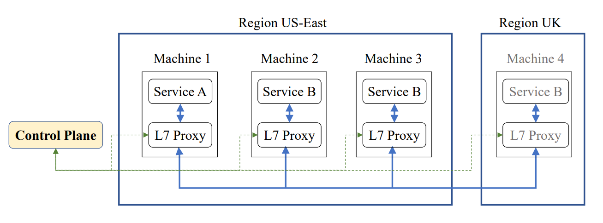

<center>图 1：Sidecar-proxy-based service mesh.</center>

图 1 展示了最常见的七层（L7，即应用层）服务网格形态。在该架构中，每个服务进程都配置了一个运行在同一台机器上的七层 Sidecar（边车）代理，用于代表该服务进行 RPC 请求的路由转发。例如，当机器 1 上的服务 A 向服务 B 发起请求时，机器 1 上的 Sidecar 代理 green 会将这些请求负载均衡地分发至部署了服务 B 的机器 2 和机器 3。若自动扩缩容（autoscaling）系统检测到业务负载增加，并在机器 4 上启动了服务 B 的新实例副本，控制面的服务发现（service discovery）功能便会实时通知机器 1 上的代理，从而将机器 4 纳入服务 B 后续请求的负载均衡目标池中。

本文介绍了 Meta 的全球服务网格——**ServiceRouter（简称 SR）**。SR 具备一套完善的功能特性，涵盖服务发现、负载均衡、故障转移、身份验证、加密、可观测性、过载保护、分布式请求追踪、用于容量管理的资源归属，以及用于影子测试（shadow testing）的流量复制等。受篇幅所限，本文的研究重点主要聚焦于回答以下四个核心问题：

1. **如何将服务网格的规模扩展**至支持数百万个七层（L7）路由器；
2. **如何最大程度地降低**超大规模服务网格的硬件成本；
3. **如何支持分片服务（sharded services）**——这类服务至关重要，但在现有研究中往往被忽略；
4. **如何在地理分布式的服务网格中**，同时实现 RPC 延迟的最小化与负载的均衡化。

**可扩展性（Scalability）。** 传统上，软件定义网络采用了集中式的控制面（control plane）与分布式的数据面（data plane）架构。大多数服务网格也沿用了这一设计，通过中心控制器来统一配置每个 Sidecar 代理的路由表。然而，对于超大规模（hyperscale）服务网格而言，这种架构在可扩展性上显得力不从心。在传统设计中，控制面承担着双重职能：既要生成全局的路由元数据（routing metadata），又要负责管理每一个七层（L7）路由器。我们主张将前一项职能（生成元数据）继续保留在集中式的控制面中，而将后一项职能进行去中心化（decentralizing），即把管理权限下放给 L7 路由器本身。通过这种架构重构，每个 L7 路由器都将具备自配置（self-configuring）与自管理（self-managing）的能力，从而有效卸载中心控制面的压力，使其能够轻松实现横向扩展（scale out）。

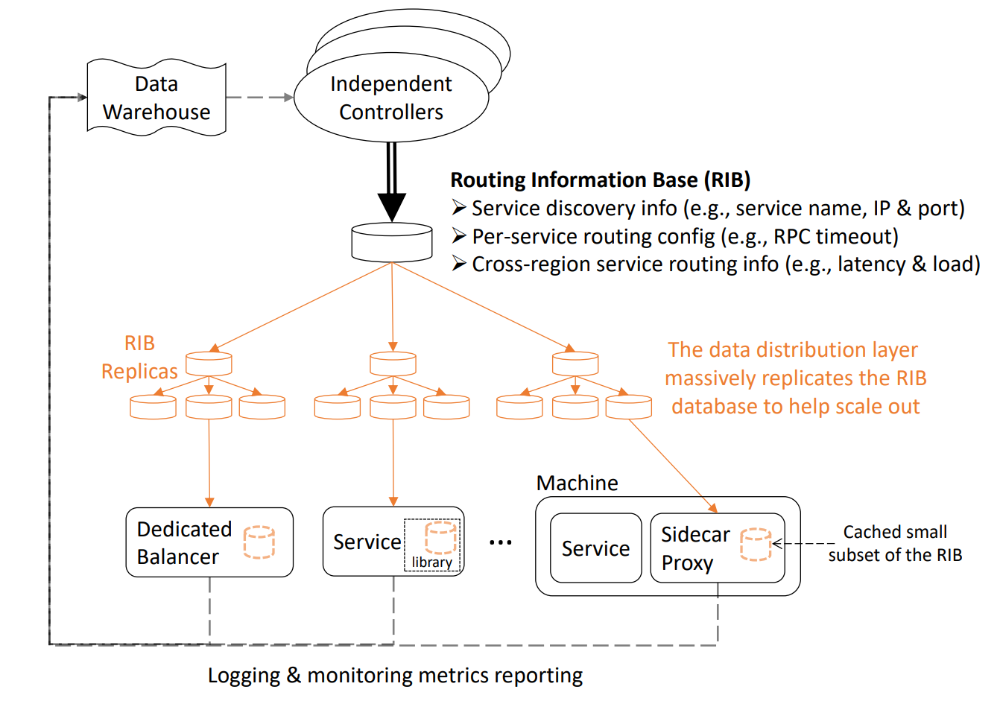

<center>图 2：ServiceRouter’s scalable service-mesh architecture.</center>

图 2 展示了 SR 的可扩展架构。该架构在逻辑上自上而下划分为三个层次，并采用了创新的**动态按需路由**机制：

- **顶层（控制层）**：由不同的控制器组成，它们独立执行服务注册、为单个服务生成跨区域路由表等核心功能。各个控制器独立更新中央**路由信息库（Routing Information Base，简称 RIB）**，而无需参与具体单个七层（L7）路由器的配置或管理工作。
- **中层（分发层）**：如图 2 中部所示，分发层负责对 RIB 进行多副本复制。通过维持充足的 RIB 副本数量，该层能够有效承载并消化来自数百万个 L7 路由器的海量读请求流量。
- **底层（路由层）**：在底层，各 L7 路由器在 RIB 的指引下进行自配置（self-configures），整个过程无需控制面的直接干预。
- **按需获取与订阅机制**：初始状态下，L7 路由器的本地路由表为空。只有当它接收到发往某一特定服务的 RPC 请求时，才会主动从邻近的 RIB 副本中拉取该服务的路由信息，并同时订阅该服务后续的 RIB 变更更新。

**硬件成本（Hardware cost）。** 现有的服务网格普遍采用 Sidecar（边车）代理的方式来转发请求（如图 1 所示）。然而，这种架构不可避免地引入了额外的路由跳跃（routing hop），其在代理内部所产生的诸如数据序列化与反序列化等开销，会带来高昂的额外硬件成本。根据 Istio 的基准测试（benchmarking）数据显示，每秒仅处理 1,000 次请求就需要消耗 0.35 个 vCPU。照此推算，若要支撑每秒 100 亿次请求的超大规模流量路由，则需要耗费相当于 1,750,000 台 AWS `t4g.small` 虚拟机（VM）的庞大计算资源。

SR 通过一个名为 **SRLib** 的开发库来提供服务网格功能，从而彻底摆脱了对代理（proxy）的依赖，并消除了由此产生的硬件成本。SRLib 被直接链接进服务自身的可执行文件中，使得 RPC 请求能够直接从客户端路由至服务端。然而，这种方案需要对服务的源代码进行修改（即具有侵入性），但在实际生产环境中，这并非在所有场景下都可行。例如，Meta 内部一些使用 Erlang 语言编写的服务，就无法在其可执行文件中链接 SRLib。

为了满足服务的多样化需求，SR 实现了不同类型七层（L7）路由器的无缝共存（如图 2 所示），包括 Istio 风格的 Sidecar 代理、AWS-ELB 风格的专用负载均衡器，以及 gRPC 风格的旁路（lookaside）负载均衡器。赋予 SR 如此高度通用性的核心考量在于：图 2 中顶层的控制器与底层的 L7 路由器在设计上是完全解耦的（即控制器对具体的路由器类型保持无感知）。这种架构上的隔离，使得底层的 L7 路由器能够根据实际业务场景自由选择并采用最契合自身的架构形态。

内嵌式 **SRLib** 助力我们大幅降低了硬件开销。目前在 Meta 内部，高达 99% 的 RPC 请求都通过 SRLib 进行直连路由。而剩余的 1% 流量则由 Sidecar 代理以及一组专用的负载均衡器共同分担，仅仅为了支撑这 1% 的代理流量，就已经消耗了数千台服务器。反之，如果我们完全放弃 SRLib，转而彻底采用代理模式来路由 100% 的全量流量，则意味着我们需要额外扩容**数十万台**服务器。

**分片服务（Sharded services）。** 分片（Sharding）与副本复制（replication）是构建高可扩展性服务的两项核心技术。在我们的集群中，绝大部分 RPC 流量都流向了分片服务。然而，尽管分片服务至关重要，现有的通用服务网格普遍缺乏对其路由的直接支持。例如，在图 1 所示的场景中，假设服务 B 部署在机器 2、3 和 4 上的副本托管了不同的数据分片，且这些分片允许在机器之间进行动态迁移。此时，机器 1 上的代理极有可能将某次请求错误地路由到机器 2，即使该请求的目标分片当时其实正运行在机器 3 上。

SR 将支持分片服务视为重中之重，并采用统一的框架来同时兼顾分片与副本复制。鉴于分片通常与具体的业务逻辑深度绑定，我们认为通过在服务网格与上层服务之间定义一套简单且通用的**分片抽象（sharding abstraction）**，从而实现彻底的**关注点分离（separation of concerns）**。基于这种设计，SR 无需感知任何底层的业务逻辑，便能直接为各种不同的分片服务实施高效的流量路由。

**跨区域路由（Cross-region routing）。** 现有的解决方案并未针对地理分布式数据中心区域之间的路由进行深度优化。例如，在图 1 的场景中，面临着一个权衡难题：机器 1 究竟应当将请求路由到本地但当前**负载较高**的机器 2 和机器 3，还是路由到跨区域但**网络延迟更大**的机器 4？此外，如何确保某项服务最终形成的**全局流量分布**，能够与该服务在不同区域的全局服务容量供给（capacity supply）实现精准匹配？在此前的研究中，这些关键问题尚未得到妥善的解答。

为了更好地支持跨区域路由，我们为服务引入了位置环（locality rings）的概念，以便其表达自身在延迟与负载之间所偏好的权衡策略。该机制的具体运行原理与流程如下：

- **灵活的策略配置（以阶梯式分流为例）**：服务可以向 SR 显式声明其配置意图。例如，**当且仅当**本地区域（local region）的负载超过 70% 时，SR 才可以放宽位置约束，将部分本地流量调度至同一大洲的其他区域；而当负载进一步攀升至 80% 以上时，SR 甚至可以将部分本地流量跨大洲路由至更远的区域。
- **全局动态计算与分发**：在后台，SR 会持续收集每项服务的全局流量与负载信息，据此计算出完全符合位置环约束要求的跨区域路由表，并将该路由表实时分发给底层的各七层（L7）路由器。
- **实现全局流量整形**：通过七层路由器依据该表进行精确的流量转发，SR 最终能够为各类服务提供全局最优的流量整形（traffic shaping）能力。

**主要贡献（Contributions）。** 我们将本文的主要贡献总结如下：

- **专为超大规模打造的架构设计**：SR 专为超大规模场景而设计。尽管业界可能存在类似规模的闭源私有系统，但其具体技术细节均未公开发布，而现有的开源服务网格方案在面对极大规模场景时普遍存在扩展性瓶颈。我们希望 Meta 的大规模工程实践经验能够为致力于构建高可扩展性服务网格的同行提供有价值的参考。
- **异构七层路由器的无缝共存与落地**：SR 支持在单个服务网格中实现多种类型七层（L7）路由器的无缝共存，涵盖 Sidecar 代理、专用负载均衡器、旁路（lookaside）负载均衡器以及内嵌路由库。为了大幅降低硬件成本，SR 利用内嵌路由库转发了集群中 99% 的 RPC 请求。这种创新的架构方案及其达到的应用规模，在整个工业界中都是独一无二的。
- **内置的原生分片服务支持**：现有的主流服务网格几乎完全聚焦于未分片（un-sharded）的服务，但这在 Meta 集群的 RPC 请求中仅占 32%；相比之下，SR 提供了对分片服务（sharded services）的原生内置支持，从而有效覆盖了集群中高达 68% 的核心业务流量。
- **创新的位置环机制**：尽管此前已存在初级形态的“位置感知路由（locality-aware routing）”，但本文的突破性创新在于引入了位置环（locality rings）的概念，从而首次实现了在地理分布式数据中心区域之间，同时最大程度地降低 RPC 延迟并实现负载均衡。

## 2. Comparison of Services Mesh Architectures

在本节中，我们对服务网格的不同架构进行了对比。如表 1 所示，该系统的设计空间（design space）由以下两个核心问题的答案所决定：

1. 哪个组件负责获取并缓存**路由元数据（routing metadata）**？
2. 哪个组件负责路由应用程序的 **RPC 流量**？

在表 1 中，*Library*（库）、*Kernel*（内核）、*Local*（本地）和 *Remote*（远程）四个标签分别用于定义 RPC 路由或路由元数据的维护工作具体由谁执行。它们依次对应：**内嵌库（embedded library）**、**操作系统内核**、**RPC 客户端机器上的本地代理/守护进程**，以及**客户端机器外部的远程代理/服务**。

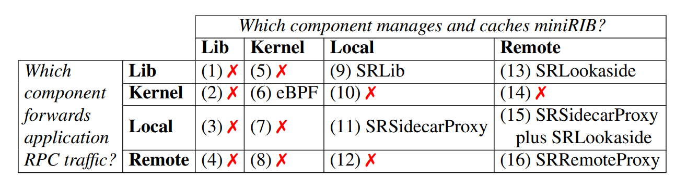

<center>表 1：The complete solution space for service mesh. The symbol  ❌️: indicates undesirable solutions.</center>

### 2.1 Different Types of L7 Routers in SR

为了支持多样化的应用场景，SR 允许在一个服务网格（service mesh）中同时并存多种不同的七层（L7）路由器部署形态。这些具体的部署架构如图 4 所示，并在下文中进行了详细阐述。不同类型的 L7 路由器之间具备良好的互操作性，能够同时向同一个服务端发起 RPC 请求。

**SRLib**。该部署形态如图 4(a) 所示，对应表 1 中的方案 (9)。它通过一个开发库来提供服务网格功能，该库被直接链接到 RPC 客户端的可执行文件中。由于省去了代理（proxy）环节，该库能够将请求直接路由至服务端，从而彻底消除了代理架构所带来的额外硬件成本与路由延迟。在此架构下，客户端仅需获取并缓存其当前活跃使用的一小部分 RIB 数据，即 **miniRIB**。

我们在客户端机器上运行了一个独立的守护进程 **RIBDaemon** 来负责缓存 `miniRIB`，而不是将其交由 `SRLib` 处理。这种“前后端分离”的设计使得我们可以利用操作系统的 **cgroup** 机制，在以下两类职能之间实现强有力的资源隔离：

- **后端同步工作（RIBDaemon 负责）**：紧急度较低，主要在后端负责维持 `miniRIB` 的最新时效性。
- **前端路由工作（SRLib 负责）**：对延迟极度敏感，负责实际的 RPC 请求路由，处于应用程序性能的关键路径（critical path）上。

由于 RIB 的更新往往具有很强的**突发性（spiky）**，当大量路由变更集中推送到 `miniRIB` 时，处理这些更新会导致 CPU 使用率瞬间飙升。图 3 便展示了生产环境机器中 `RIBDaemon` 这种突发性的 CPU 消耗特征。

在这种架构下，即便 `cgroup` 因为 CPU 飙升而对 `RIBDaemon` 进行了**限流（throttling）**，对 `SRLib` 产生的影响也微乎其微。这是因为 `SRLib` 仅在针对某一服务的**首次 RPC 请求**时才会查询一次 `RIBDaemon`。随后该服务的所有后续 RPC 流量都将由 `SRLib` 直连服务端，整个转发路径完全无需 `RIBDaemon` 的参与。反之，如果直接让 `SRLib` 来管理 `miniRIB`，由于 `SRLib` 已经被编译链接到了应用程序内部（属于同一个进程），`cgroup` 将无法把“维护 `miniRIB` 的路由开销”与“应用程序自身的资源消耗”进行有效的独立隔离。

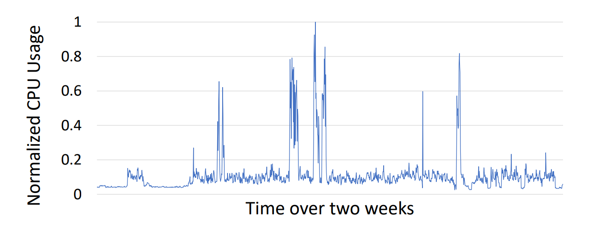

<center>图 3：Spiky CPU usage of a machine’s RIBDaemon.</center>

**SRLookaside**。该部署形态如图 4(b) 所示，对应表 1 中的方案 (13)。它的提出旨在解决前述方案中，由于在每台 RPC 客户端机器上都运行 `RIBDaemon` 而导致的资源消耗（特别是内存开销）问题。该模式的核心优化机制如下：

- **彻底消除本地守护进程**：它通过将 `miniRIB` 管理和服务器选择（server selection）的功能，统一上移至一个远程且共享的 **SRLookasideService** 中，从而彻底免去了在客户端本地部署 `RIBDaemon` 的需要。
- **保留高性能直连路径**：尽管控制面逻辑进行了外包，但在数据面上，RPC 请求依然直接从客户端路由至远端服务端，整个过程完全无需经过任何中间代理（intermediate proxy）。

从历史上看，基于高能效比（power efficiency）的代际优势，Meta 曾大规模部署内存低至 16GB 的小型服务器集群。鉴于此，团队开发了 **SRLookaside** 架构，以最大程度地节省这些低配机器的内存开销。然而，随着硬件的升级迭代，如今即便是集群中的低配服务器，其内存也已至少达到了 64GB。因此，`SRLookaside` 模式目前已被**废弃（deprecated）**。这是因为在当前的硬件条件下，该模式所能节省的有限内存，已不足以抵消维护一套独立的 `SRLookaside` 远程服务所带来的额外系统复杂性与运维负担。

**SRSidecarProxy**。该部署形态如图 4(c) 所示，对应表 1 中的方案 (11)。虽然这种模式与 Istio 类似，不可避免地会带来额外的硬件成本与路由延迟，但在架构实现上，它比 Istio 具备**更强 spider 的可扩展性**。这主要得益于以下两点：

- **去中心化自管理**：每个 `SRProxy` 均独立进行自管理，整个转发过程无需控制面的实时干预；
- **轻量级按需缓存**：代理在本地仅需缓存与当前应用活跃相关的 `miniRIB`，而无需承载全局完整的 `RIB`。

在 Meta 内部，`SRSidecarProxy` 的应用场景基本局限于使用 Erlang 语言编写的服务，这主要是因为前文提到的内嵌路由库 `SRLib` 无法直接提供对 Erlang 的原生支持。

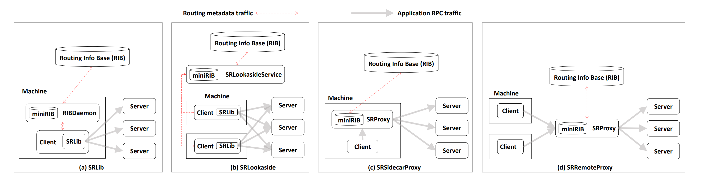

<center>图 4：Service mesh design alternatives. The diagrams show how RPC clients send requests to RPC servers.</center>

**SRRemoteProxy**。该部署形态如图 4(d) 所示，对应表 1 中的方案 (16)，其设计类似于 AWS ELB。如图 5 所示，`SRRemoteProxy` 作为一个由多个客户端共享的**专用负载均衡器**运行。它的核心优势与优化机制体现在以下几个方面：

- **连接减载与高复用性**：它能够有效减少系统中的 RPC 连接总数，并显著提高长连接（keep-alive connections）的复用率。
- **攻克跨区域建连的延迟瓶颈**：设想在海量客户端的场景下，若每个客户端仅偶尔向远端数据中心区域的服务器发起请求，每次请求都需要重新建立 TLS/TCP 连接。由于建立新连接需要经历整整三轮跨区域的往返时间（RTT），这将导致每次 RPC 都会产生严重的网络延迟。
- **基于共享代理的流量收敛**：`SRRemoteProxy` 这一共享代理机制完美化解了上述开销。它在后台统一维持极少量的跨区域长连接，并通过复用这些既有通道来代表众多客户端转发请求，从而彻底消除了频繁建连带来的高昂握手开销。

### 2.2 Comparison of L7 Routers

接下来，我们对表 1 中的各种方案进行对比分析：

- **方案 (1) 至 (4)（库级管理的性能干涉）**：这些方案并不理想。因为如果直接在开发库（library）中管理 `miniRIB`，由于缺乏有效的隔离机制（isolation），其运行开销会直接波及并拖累应用程序自身的性能。
- **方案 (5)、(7) 和 (8)（内核缓存的访问壁垒）**：这些方案同样不可行。因为在当前的操作系统中，缺乏现成的系统调用（system call）来允许上层应用去访问缓存在内核中的 `miniRIB`。
- **方案 (6)、(10) 和 (14)（内核级七层路由的实现瓶颈）**：
  - 尽管方案 (6) 目前已以**基于 eBPF 的服务网格**形式落地，但其功能严重受限于内核中 eBPF 程序的能力边界。
  - 例如，**Cilium** 的 eBPF 程序目前只能处理三层/四层（L3/L4）网络协议，一旦涉及七层（L7）应用层协议，它仍然不得不依赖 Sidecar 代理来辅助处理。
  - 与方案 (6) 类似，方案 (10) 和 (14) 的不理想之处也在于，在操作系统内核中直接实现复杂的高级七层路由特性具有极高的工程难度。
  - **方案 (12)（架构冗余与次优设计）**：该方案并不理想，因为其在设计上**严格劣于方案 (16)**。换言之，如果流量路由已经交由远程代理来执行，那么将 `miniRIB` 的管理职能同样迁移至该远程代理，显然是更具合理性的闭环设计。
  - **方案 (15) 与 方案 (11)（内存优化与边际效益折中）**：
    - **理论优势**：从理论上讲，方案 (15) 在客户端机器上所消耗的内存资源要比方案 (11) 更少。
    - **生产现状**：然而，方案 (15) 并未在 Meta 的实际生产环境中得到应用。这主要是因为即便是作为基准的方案 (11) 自身都未被广泛采用；在此背景下，方案 (15) 所能带来的额外性能收益非常有限，不足以体现其部署价值。

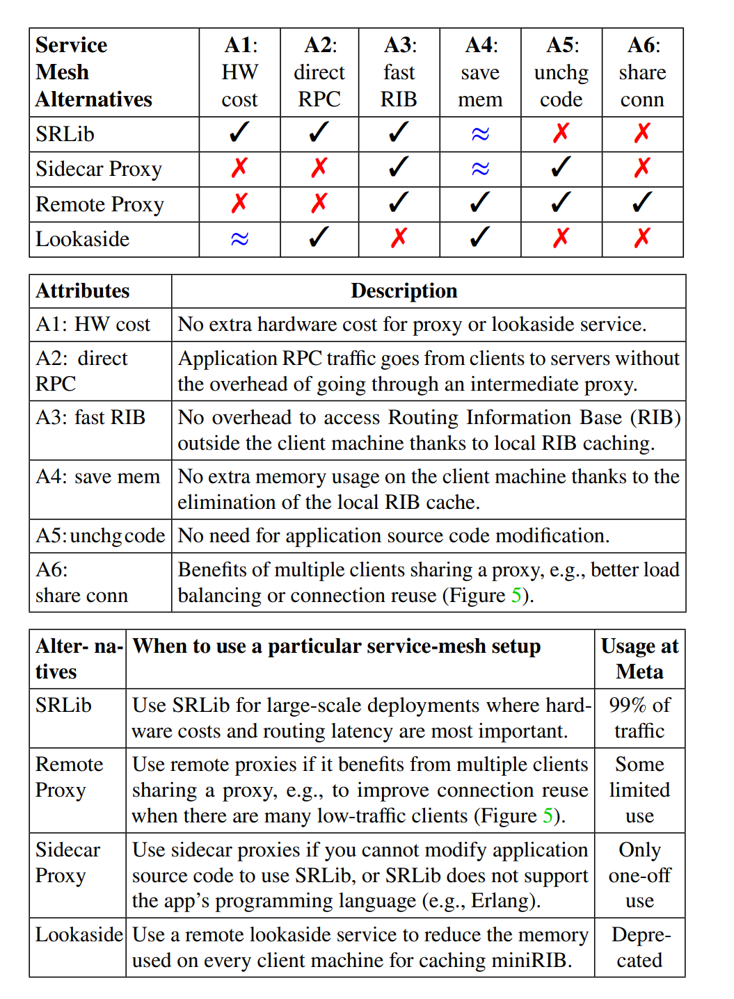

<center>表 2：Comparison of service mesh design alternatives.</center>

最后，为了便于查阅，我们在表 2 中对各种设计备选方案的对比进行了归纳总结。

## 3. ServiceRouter Design

在本节中，我们首先对 ServiceRouter 进行整体概述，随后详细阐述其核心设计思想。

### 3.1 Overview

SR 支持图 4 所示的全量四种七层（L7）路由器部署形态。为了兼容不同的代理模式，SR 在工程实现与架构上采用了高度复用的设计：

- **代码高复用设计**：对于 Sidecar 或远程代理（remote proxy）模式，我们并没有重写一套代理系统，而是通过在 `SRLib` 代码之上封装一层**包装层（wrapper layer）**，使其能够作为一个独立的代理进程（standalone proxy）脱离应用运行。
- **控制面组件架构**：SR 的控制面（control-plane）组件架构如图 6 所示，并在下文中进行详细阐述。

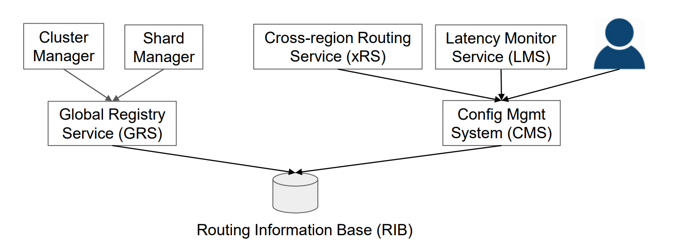

<center>图 6： ServiceRouter’s control-plane components.</center>

**路由信息库（RIB，Routing Information Base）**。RIB 是一种基于 Paxos 共识算法的分布式键值存储系统。其核心架构与运行机制如下：

- **高可用多中心部署**：为了确保系统的高可用性，RIB 在 5 个不同的地理区域中总共部署了 9 个 Paxos 接收者（Acceptor）。它以集中化的方式，统一存储了运行在所有区域中全部服务的路由元数据。
- **海量副本与高吞吐读取**：在分发侧，RIB 利用数以千计的 Paxos 学习者（Learner）在各个区域构建了大量的本地 RIB 副本。这种设计极大地提升了系统的读取吞吐量。
- **强鲁棒性与网络分区容错**：得益于本地副本机制，即便某个数据中心区域与其他区域发生网络断连（形成网络分区孤岛），本地服务依然能够正常读取路由信息，从而保障了业务的连续性与高可用性。

关于如何对 RIB 进行水平扩展以支撑超大规模场景，我们将在**第 4.1 节**中展开深入探讨。

**全局注册服务（GRS，Global Registry Service）。** GRS 负责在 RIB（路由信息库）中维护服务与分片的发现信息（discovery information）。图 7 展示了在 GRS 中注册的两项示例服务。

- **未分片服务的注册流程**：以 *服务 A（Service A）* 为例，该服务**仅进行了副本复制但未进行分片**。当集群管理器（cluster manager）启动或停止 *服务 A* 的某个容器时，它会实时通知 GRS，以便 GRS 动态更新 *服务 A* 的实例副本列表（list of replicas）。

关于 SR 对分片服务（sharded services）的内置原生支持机制，我们将在**第 3.3 节**中展开深入阐述。

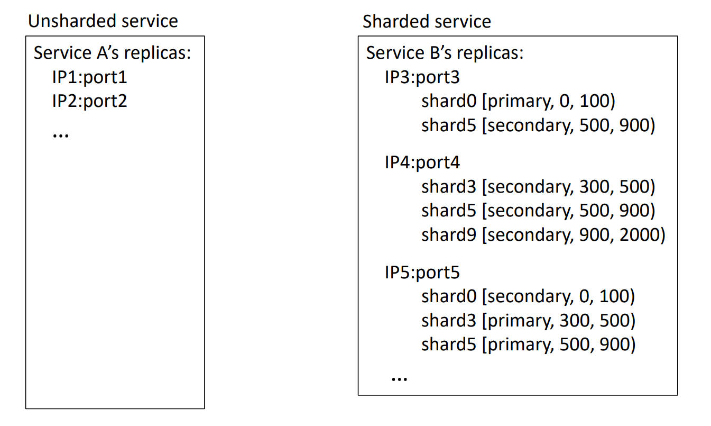

<center>图 7：Examples of GRS’ service registry records.</center>

**配置管理系统（CMS，Configuration Management System）。** CMS 支持对每项服务的路由策略进行定制化配置，包括 RPC 超时时间、连接复用以及位置感知路由（locality routing）偏好等。

其核心运作模式如下：

- **配置即代码范式**：服务负责人遵循配置即代码（configuration as code）的规范，对路由配置进行编写、审查（review）与代码提交（commit）。
- **自动化配置更新**：CMS 同样支持自动化的配置动态演进。例如，延迟监控服务（LMS，Latency Monitoring Service）会定期聚合与跨区域延迟相关的监测数据并自动提交配置更新，以此动态指导 `SRLib` 做出最优的路由决策。

**跨区域路由服务（xRS，Cross-region Routing Service）。** 与集中式负载均衡器相比，内嵌路由库 `SRLib` 仅拥有来自单一客户端流量的**局部视角（local view）**，因此在独立运行时可能无法做出全局最优的路由决策。

xRS 通过以下机制解决了这一局限性：

- **全局流量聚合**：汇总并聚合每项服务的全局流量信息；
- **跨区域路由动态计算**：基于全局视角，计算出兼顾全局最优的跨区域路由表；
- **异步分发与消费**：该路由表通过 RIB（路由信息库）进行全网分发，并最终由各客户端的 `SRLib` 消费（读取），以此指导其前台的路由决策。

### 3.2 Service Discovery

每台机器上均运行着一个 **RIBDaemon**，负责维护一个被称为 **miniRIB** 的本地缓存。该 miniRIB 仅缓存当前机器上的 **RPC 客户端**所必需的特定 **RIB** 数据。在初始状态下，miniRIB 为空。当 **SRLib** 需要向特定服务（例如*服务 X*）发起 RPC 请求时，它会向 RIBDaemon 请求该*服务 X*的**路由元数据**。此时，RIBDaemon 会从 RIB 副本（replica）中获取该元数据，并将其缓存至磁盘中以实现**持久化**（确保在机器重启后数据不丢失）；同时，它会订阅与*服务 X*相关的后续更新，并最终将元数据返回给 SRLib。随后，SRLib 也会向 RIBDaemon 订阅后续更新，并将该元数据缓存到**内存**（而非磁盘）中以供后续复用，从而避免在每次发起 RPC 请求时都与 RIBDaemon 进行通信交互。

未来当**服务 X** 的部署发生变更时，集群管理器（cluster manager）会通知 GRS 更新 RIB。该更新会立即被推送到所有 RIB 副本，随后这些副本会进一步将更新下发给所有订阅了*服务 X* 路由元数据的 RIBDaemon。最终，RIBDaemon 将更新推送给 SRLib。

*服务 X* 可能会部署在多个数据中心区域（datacenter regions），且各区域内的服务副本分别由不同的区域集群管理器进行管理。所有这些集群管理器都会通知 GRS 更新*服务 X* 的同一条**服务注册记录**（service-registry record），从而使客户端的 RPC 请求有可能被路由到任意区域的服务副本。此外，服务的 RPC 客户端也可以选择仅向与自身处于同一区域的服务器发送请求。在这种场景下，为了降低系统开销，RIBDaemon 将仅订阅源自**本地区域**的路由更新。

在集群管理器的协助下，客户端无需再通过超时（timeouts）机制来独立感知服务器故障。当服务器因代码部署等**计划内维护**（planned maintenance）而需要下线时，集群管理器会首先更新 RIB 以通知客户端，随后再关闭该服务器。而针对**计划外故障**（unplanned failures），集群管理器则能够自动检测包括进程崩溃/挂起（process crashes/hangs）以及机器物理故障（machine failures）在内的各类异常，并同样通过更新 RIB 来及时告知客户端。

### 3.3 Support for Sharded Services

SR 提供了对分片服务（sharded services）的内置支持。如图 7 所示，*服务 B* 同时采用了分片与多副本架构。为了实现**关注点分离**（separation of concerns），我们在 SR 与具体服务之间定义了一种简化的分片抽象，从而使 SR 无需感知分片服务的内部应用逻辑即可实现流量路由。

具体而言，服务会指定如何将一个 128 位的键空间（key space）划分为若干分片。每个分片均可独立进行副本复制，并支持跨容器迁移。此外，每个分片副本都与一个抽象角色（如 *primary* 或 *secondary*）相关联。在本例中，*shard5* 对应键范围 `[500, 900)`，且其位于 *IP4:port4* 上的副本承担 *secondary* 角色。SR 并不关心分片键（shard key）或角色的真实业务语义，而仅仅纯粹地根据客户端的请求来进行请求路由。

```c
SRClient *cln = SR_get_client("ServiceB", 618/*key*/, SECONDARY);
cln->foo(); // 为 foo() 发起 RPC 调用。
```

在本例中，SR 识别出 *shard5* 包含了键 618，且该 *shard5* 的 *secondary* 角色由其位于 *IP3:port3* 和 *IP4:port4* 上的副本共同承担。随后，SR 会根据**负载均衡策略**（load balancing policy）从中选择一个副本来响应该请求。在具体服务的实现中，*primary* 和 *secondary* 角色可以分别映射到数据库的 *leader*（主）和 *follower*（从）副本。

SR 的分片映射（shard-map）抽象具有极强的通用性，目前已支持数百个分片服务。这些服务绝大多数（但并非全部）由一个统一的分片管理器（shard manager）进行管理。每当有新分片添加、既有分片移除，或是现存分片进行跨容器迁移时，该管理器便会通知 GRS 更新分片注册表（shard registry）。

在 SR 架构下，分片服务与未分片服务均能完全共享并复用 SR 内部的所有高级组件。此外，分片服务的路由功能支持开箱即用，无需引入任何额外的开发工作。与此形成鲜明对比的是，现有的通用服务网格（service meshes）普遍缺乏对分片服务的支持，迫使应用系统不得不自行研发相应的解决方案。

**备选设计方案。** 除 SR 的分片映射方案外，另一种替代选择是**一致性哈希**（consistent hashing）。在给定服务器列表的情况下，一致性哈希通过哈希算法，能够确定性地计算出负责处理特定键（key）的服务器。因此，该方案无需在系统内显式存储分片映射数据。

尽管一致性哈希具有机制精简的优势，但它无法满足更为复杂的高级分片应用场景。其根本原因在于，一致性哈希这种确定性的键分配机制，无法支持根据分片负载变化而进行的**动态分片迁移**。为了兼顾不同的业务需求，SR 对一致性哈希和分片映射这两种方案均提供了内置支持。工业界实际运行数据表明，在 Meta 的数百个分片服务中，选择采用灵活分片映射的服务数量是采用一致性哈希的 **5.4 倍**，这一显著的数据对比有力地证实了分片映射方案的核心价值与实际成效。

除了 SR 的分片映射方案外，另一种备选方案是允许服务提供自定义的**旁路服务**（lookaside-service）实现。该方案能够提供最大程度的灵活性，从而将服务特有的分片发现与选择逻辑从**服务网格**（service mesh）中完全解耦。gRPC 与 SR 的旁路接口均能支持此方案。在 Meta 内部，部分服务负责人最初因该方案的灵活性而对其表现出浓厚兴趣。然而，他们最终并未真正采用，一方面是因为独立维护一个自定义旁路服务会带来沉重的**维护成本**（burden of maintaining），另一方面则是由于实践表明，分片映射与一致性哈希两者的结合已足以满足几乎所有分片服务的业务需求。

### 3.4 Load Balancing

SR 的**负载均衡**（load-balancing）方案基于 **Pick-2** 算法。Pick-2 的机制是从候选池中随机抽取两台服务器，并选择其中负载较低的一台作为 RPC 请求的目标服务器。然而，在**跨地域分布式服务网格**（geo-distributed service mesh）的场景下，单纯使用 Pick-2 算法已不足以满足实际需求。因此，我们提出了三种创新技术来对 Pick-2 进行补充与完善：

1. **引入地域局部性**：在随机抽取两台服务器时，将地域局部性（regional locality）纳入考量，以实现就近路由。
2. **基于稳定子集采样**：从稳定的服务器子集（而非全体服务器）中随机抽取两台服务器，从而最大程度地提高**连接复用率**（connection reuse）。
3. **自适应负载估算**：结合具体的工作负载特征，采用自适应的方法进行负载估算。

关于这些技术的详细设计，我们将在后文中展开深入阐述。

#### 3.4.1 Locality Awareness

在跨地域分布式服务网格中，如果机械地完全照搬 **Pick-2** 算法，将会导致高昂的 RPC 延迟，因为该算法未能将**地域局部性**（regional locality）纳入考量。我们的实际测量数据显示，区域内（within-region）RTT 的 **P50** 仅为 116 μs，而跨区域（cross-region）RTT 的 **P50** 则跃升至 35 ms，其 **P99** 更是高达 163 ms。这些数据充分突显了在路由 RPC 请求时，将地域局部性纳入考量的极端重要性。

SR 并未采用 Pick-2 从候选池中随机抽取两台服务器的做法，而是引入了一种被称为**局部性环**（*locality rings*）的机制。该机制能够首先过滤掉远离客户端且延迟较高的服务器，然后再从剩余的就近服务器中进行采样。

每个服务均可定义一组延迟依次递增的环，例如：

$$
[\text{ring}_1: 5\text{ ms} \mid \text{ring}_2: 35\text{ ms} \mid \text{ring}_3: 80\text{ ms} \mid \text{ring}_4: \infty]
$$

**延迟监控服务**（LMS）会定期更新各区域之间的往返时延（RTT），而 RPC 客户端则通过 CMS 来获取这些时延数据。

RPC 客户端利用跨区域 RTT 来估算其到各个服务器的延迟。具体检索流程从 $\text{ring}_1$ 开始：若客户端发现有任意 RPC 服务器的延迟处于 $\text{ring}_i$ 的延迟阈值（latency bound）之内，它便会直接过滤掉所有属于 $\text{ring}_{i+1}$ 及更高层级的服务器，并仅从当前的 $\text{ring}_i$ 中随机抽取两台服务器进行采样。反之，若该服务在 $\text{ring}_i$ 中没有部署任何服务器，算法则会进一步考量 $\text{ring}_{i+1}$ 中的服务器，以此类推。

在 SR 的默认配置中，各局部性环与实际地理位置的映射关系如下：

$$
[\text{ring}_1 \mid \text{ring}_2 \mid \text{ring}_3 \mid \text{ring}_4] \rightarrow [\text{同区域} \mid \text{邻近区域} \mid \text{同大洲} \mid \text{全球}]
$$
尽管利用局部性环进行过滤能够有效降低路由延迟，但由于**缺乏全局视图**（global view），该方案仍存在以下局限性：

1. **资源利用不均**：位于 $\text{ring}_i$ 中的服务器可能会发生**过载**，而处于外层的 $\text{ring}_{i+1}$ 中的服务器却可能面临负载不足（或资源利用率低下）的问题。
2. **全局局部最优冲突**：各客户端孤立做出的本地路由决策，无法促成与全球服务器总容量相匹配的**全局最优流量分布**。

具体而言，当某一区域 $X$ 发生故障时，如果所有客户端都各自独立地将原本发往 $X$ 的流量重定向至距离 $X$ 最近的区域 $Y$，则极有可能导致区域 $Y$ 因瞬间过载而**崩溃下线**。随后，这些流量又会集体顺延转移至下一个邻近区域 $Z$，以此类推，从而引发灾难性的**多米诺骨牌效应**。

跨区域路由服务（xRS）通过利用全局信息为每个服务计算一张跨区域路由表，从而解决了上述问题。该路由表的表项 $[P_{ij}]$ 意味着，在源自区域 $R_i$ 的该服务 RPC 请求中，应有比例为 $P_{ij}$ 的流量被路由至区域 $R_j$。该跨区域路由表存储于 RIB 中，并会被分发至所有客户端。当 RPC 客户端需要发起请求时，它会依据流量分布 $P_{ij}$ 随机选择一个目标区域，随后调用常规路由算法（normal routing algorithm）在该目标区域中挑选一台具体的服务器。

xRS 能够主动更新路由表，以便在预先为即将到来的维护做准备或响应突发灾难时，将流量迁出特定区域。在此过程中，系统会尽可能避免对其他区域造成过载压力。在 **PID 控制器**的控制与调节下，xRS 能够平滑地（gracefully）在各区域间迁移流量，从而防止因调节过猛而产生**过度反应（或超调震荡）**。若全球范围内的服务容量依然不足，系统则会在路由表中构建所谓的“黑洞”（black holes），以此指示客户端直接丢弃部分流量，从而避免压垮后端服务器。

接下来，我们将阐述 xRS 计算跨区域路由表的具体过程。xRS 在全局范围内收集流量与负载信息，并模拟当路由至某一区域的流量增加或减少时，该区域的负载会如何发生变化。针对每项服务，xRS 会定期从其对应的服务器中获取负载信息，并按区域进行聚合。同时，它还会收集各区域服务器当前处理的每秒请求数（RPS），并以此计算 **RPS 开销**（*RPS cost*）——即区域负载与 RPS 的比值。**RPS 开销**定义为每增加单位 RPS 所带来的预估负载增量。例如，若某区域当前负载为 60% 且处理的吞吐量为 100 RPS，当该区域增加 1 RPS 的流量时，其负载将相应增加 0.6%。

xRS 致力于在**最小化 RPC 延迟**的同时，实现**跨区域的负载均衡**。该服务通过引入**负载阈值**对局部性环进行了扩展，具体示例如下：

$$
[\text{ring}_1: 5\text{ ms} : 55\% \mid \text{ring}_2: 35\text{ ms} : 65\% \mid \text{ring}_3: 80\text{ ms} : 80\% \mid \text{ring}_4: \infty : \infty]
$$

直观来看，这表明（例如）当 $\text{ring}_1$ 的负载超过 $55\%$ 时，xRS 将放宽对延迟的限制，并开始考虑将部分流量路由至 $\text{ring}_2$ 中的服务器，以此类推。这种融入了负载特征的局部性环信息并不会被 SRLib 直接读取，而是作为基础输入传递给 xRS，用于按如下步骤计算每个服务的跨区域路由表：

首先，xRS 尝试将所有请求直接在**源区域**（source region）进行本地化处理，即初始化条件设置为：

$$
\forall i \quad P_{ii} = 1 \quad \text{且} \quad \forall i, \forall j \neq i \quad P_{ij} = 0
$$

随后，借助各区域的 **RPS 开销**（*RPS cost*），系统会识别出当前负载最高的区域，并尝试根据局部性环所设定的优先级偏好，将该区域的部分流量迁移至邻近区域。该过程将持续循环迭代，直至不再有任何区域发生过载，或者所有区域的负载达到完全均衡为止。

目前，系统内 **46%** 的服务通过 xRS 的跨区域路由表进行流量路由，而其余服务则直接采用基础的局部性环（baseline locality rings）机制，无需依赖该路由表。部分服务由于考虑到收集全局流量与负载信息所带来的**系统开销**（overhead），因而选择不启用 xRS。此外，还有一些服务本身会产生巨大的流量且对延迟要求极高，针对这类场景，系统宁愿让请求直接失败，也不愿将其进行跨区域路由。

总体而言，在我们的整个服务器集群中，大约有 **16%** 的 RPC 请求需要进行跨区域路由。这一实际数据充分凸显了全球服务网格（global service meshes）优化跨区域路由机制的极端重要性，而这一关键领域在现有的服务网格系统中往往在很大程度上被忽略了。

**备选设计方案。** 在 xRS 机制下，服务负责人需要结合自身的领域知识，来为局部性环中的网络 RTT 以及服务器利用率设定相应的阈值。为了免去手动设定这些阈值所带来的运维负担，另一种备选方案是将**端到端 RPC 延迟**作为唯一的度量指标。从理论上讲，该指标能够自动将网络 RTT 和服务器利用率同时纳入综合考量。在这种以延迟为核心的方案中，负载均衡的设计目标即是最小化平均 RPC 延迟。Pacifici 等人曾在本地集群环境中采用过类似的方法。然而，SR 并未采纳这一方案。因为无论是根据**排队论**（queuing theory）推导，还是结合我们的生产实践经验，在服务器处于高利用率的状态下，对延迟进行建模的**健壮性**（robustness）较差。这意味着，xRS 将无法准确预测流量迁移（traffic shifts）会如何具体影响 RPC 延迟。

此外，通过容忍 RPC 服务器端高昂的**排队延迟**（queuing delay）来换取（或规避）跨区域的长网络 RTT，以此实现 RPC 延迟最小化，并不是一种**健壮**（robust）的策略。因为这种方法极易导致就近服务器（nearby servers）发生严重过载，并引发高昂的 RPC 错误率。

下面我们通过一个具体示例来对此进行说明： 假设一个客户端向两台服务器 *X* 和 *Y* 发送请求，其中 *X* 部署在同区域内，其往返时延（RTT）仅为 **100 μs**；而 *Y* 部署在另一区域，其 RTT 高达 **100 ms**。并进一步假设服务器处理单个请求需要 **1 ms** 的时间。为了最大程度地降低 RPC 延迟，上述**以延迟为核心的方案**（latency-focused approach）会将所有请求均发送至本地区域的服务器 *X*。直到 *X* 端的排队延迟堆积至 **100 ms** 时，该方案才会开始将后续请求发送至远端区域的服务器 *Y*。然而，考虑到单个请求的实际处理时间仅为 1 ms，当 *X* 的排队延迟达到 100 ms 时，*X* 实际上已经陷入了极其严重的**过载状态**，随时可能产生高昂的错误率。

综上所述，在跨地域分布式环境中，网络 RTT 的波动范围往往会横跨 **3 个数量级**（从 100 μs 到 100 ms）。在如此极端的环境下，单纯以延迟为核心的路由方案显然缺乏健壮性。

### 3.4.2 RPC Connection Reuse

我们的实际测量数据显示，建立一个新的 TLS/TCP 连接需要耗时 1.6ms，且通信两端均需消耗 14KB 的内存。为了降低这一系统开销，SR 会选择维持这些 TLS/TCP 连接，并在不同的 RPC 请求之间进行复用。然而，Pick-2 算法所采用的随机化机制却导致这种连接复用策略难以奏效。由于 Pick-2 在处理每个请求时，都会从全体 $n$ 台服务器中随机抽取两台进行采样，随着时间的推移，一个 RPC 客户端最终将会与全部 $n$ 台服务器都发生通信。显然，当 $n$ 的规模较大时，由于维持连接需要高昂的内存与 CPU 资源，让客户端与所有 $n$ 台服务器均保持**长连接**（keep-alive connections）在工程实践中是不切实际的。

为了提高**连接复用率**，RPC 客户端会从全部 $n$ 台服务器中选择一个由 $k$ 台服务器组成的**稳定子集**（通常满足 $k \ll n$），并持续复用这 $k$ 台稳定服务器。在处理每次 RPC 请求时，Pick-2 算法会直接从该 $k$ 台稳定服务器中随机抽取两台服务器进行采样，而非针对全体 $n$ 台服务器进行。如此一来，随着时间的推移，客户端只需与这 $k$ 台稳定服务器维持**长连接**（keep-alive connections）。

面临的**核心挑战**在于：如何在允许每个 RPC 客户端独立选择其 $k$ 台稳定服务器的同时，确保全局负载仍能均匀地分摊到所有 $n$ 台服务器上。假设每台服务器平均与 $M$ 个客户端维持长连接（keep-alive connections）。当向现有的 $n$ 台服务器集群中新增一台服务器时，一个理想且稳定的解决方案应该**仅需**其中的 $M$ 个客户端调整其包含 $k$ 台稳定服务器的列表，即从列表中移出一台现有服务器并添加这台新服务器。通过这种方式，新服务器也能与其他服务器一样，恰好为 $M$ 个客户端提供服务。

在 SR 架构下，每个 RPC 客户端均采用 **Rendezvous Hashing**（最高权重随机哈希）来选择 $k$ 台稳定服务器，从而完美实现了前文所述的理想特性。具体而言，客户端将其唯一的客户端 ID 作为**哈希盐**（hashing salt），计算出所有服务器的哈希值，并挑选哈希值最大的 $k$ 台服务器。通过将稳定服务器机制与 Rendezvous Hashing 有效结合，SR 成功将**连接复用率**提升至极限。生产环境的实际运行数据显示，超过 **99%** 的 RPC 请求均成功复用了现有连接。

**备选设计方案。** 相比于一致性哈希（Consistent Hashing），我们更倾向于采用 Rendezvous Hashing。因为该算法允许 SR 利用**加权哈希**（weighted hashing）机制，按照服务器的计算能力成比例地分配客户端连接。这一特性与另一种加权机制相结合（该机制使 Pick-2 算法的选择概率与服务器的计算能力成正比），成功解决了由于我们庞大的服务器集群中运行着多代硬件、且各代硬件性能特性差异巨大所带来的实际问题。此外，Rendezvous Hashing 还能实现更佳的负载均衡效果。例如，当某台服务器宕机（dies）时，无需像一致性哈希那样引入“虚拟服务器”（virtual servers）机制，其原有负载便能被均匀地重新分配到其他服务器上。

#### 3.4.3 Adaptive Load Estimation

为了让 Pick-2 能够在两个候选节点之间准确选择路由目标，系统必须获知相应的负载信息。在默认情况下，SR 采用 RPC 服务器端的**在途请求数**（outstanding requests，即未完成请求数）来表征其负载。此外，SR 还支持自定义负载度量指标，例如 CPU、内存、磁盘以及任何应用层（application-level）指标。目前，在我们的整个服务器集群中，分别有 **77%** 和 **18%** 的 RPC 请求选择在途请求数和 CPU 利用率作为其负载指标，其余则采用其他度量方式。

为了评估服务器的负载状态，客户端通常有以下两种方案可选：

1. **主动轮询机制**：在最终决定是否向某台服务器发送请求之前，客户端先对其当前负载进行轮询。这种做法会不可避免地引入额外的系统开销与访问延迟。
2. **响应捎带与本地缓存机制**：让服务器在返回的响应中直接附带自身的负载信息，随后客户端将该信息缓存下来以供后续复用。该方案虽然运行高效，但其潜在问题在于，客户端可能会因为使用了**陈旧的负载信息**（stale information）而引发系统内部的负载不均衡。

为了在这两种方法之间取得平衡，SR 采用了一种**自适应机制**。在这种机制下，RPC 响应中总是会**捎带**（piggybacked）服务器当前的负载信息。当客户端在发送新请求前评估服务器负载时，其核心调度逻辑如下：

首先，仅当本地缓存的负载信息**足够新鲜**时，客户端才会直接采用该缓存数据（方法 1）。否则，若当前缓存已不够新鲜，且到该服务器的网络 RTT 相较于服务器的平均请求处理时间较低，客户端则会主动轮询服务器以获取其实时负载（方法 2）。而在最坏的情况下（即缓存的负载信息已然陈旧，且由于网络延迟导致主动轮询的系统开销过高）系统将不再纠结于获取精准负载，而是直接在两台候选服务器中**随机选择**一台进行响应（方法 3）。

**备选设计方案。** LI 试图仅通过组合方法 1 和方法 3 来解决负载估算问题，而未引入方法 2（即轮询机制）。然而，我们的生产系统实际运行数据表明，在 SR 的自适应机制下，最终分别有约 **50%**、**25%** 和 **25%** 的 RPC 请求调用了方法 1、方法 2 和方法 3。这一关键的数据分布有力地证实了引入**即时轮询**（just-in-time polling）方法的实际成效与重要价值。

## 4. Evaluation

我们的评估工作旨在回答以下几个核心问题：

1. **SR 是否具备良好的可扩展性？**
2. **SRLib 在多大程度上能够节约硬件成本？在何种场景下应当选择使用 SRProxy 还是 SRLib？**
3. **SR 能否有效实现区域内以及跨区域的负载均衡？**
4. **分片服务是否具有重要意义？SR 能否同时对分片服务与未分片服务提供有效的支持？**

### 4.1 Scalability

**超大规模**（Hyperscale）是 SR 的核心设计目标，也是其区别于大多数现有服务网格的显著特征。目前，SR 已在数十个数据中心区域部署运行，并通过数百万个**七层（L7）路由器**为数万个服务提供支撑。同时，GRS 在全球范围内分发**服务发现信息**（service discovery information），其覆盖规模涵盖数百万个容器以及数亿个分片（shards）。

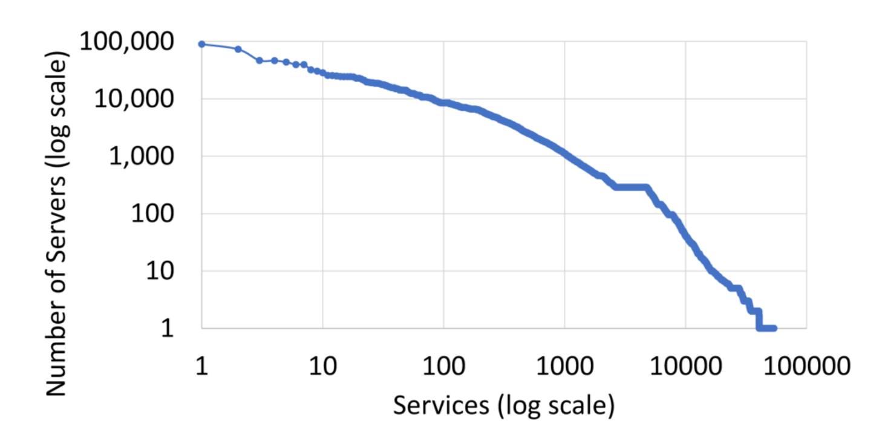

<center>图 8：Number of servers used by services. Each dot represents one service. Note that both axes are in log scale.</center>

为了深入了解单个服务的规模，我们在**图 8** 中绘制了各服务所使用的服务器数量。可以看出，少数服务的规模极大，而绝大多数服务的规模都非常小。具体而言，尽管有 **90%** 的服务各自使用的服务器不足 **200 台**，但却有 **2%** 的服务各自占用了超过 **2000 台**服务器，其中规模最大的单个服务更是使用了约 **9 万台**服务器。

**图 9** 展示了这些服务所处理的 RPS（每秒请求数）。与之类似，尽管大多数服务的 RPS 处于较低水平，但某些超大规模服务需要处理高达**数十亿级别**的 RPS。这些超大规模服务往往对 SR 提出了最极致的性能要求，并且需要调用其最精细、复杂的特性（most sophisticated features）。总体而言，**图 8** 和**图 9** 充分表明，无论是面对少量的超大规模服务，还是海量的轻量级服务，SR 均具备优秀的**可扩展性**（scales well）。

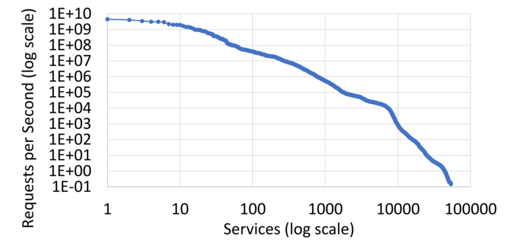

<center>图 9：Requests per second by services. Each dot represents one service. Note that both axes are in log scale.</center>

在 SR 的整体架构中（图 6），**中央 RIB**（路由信息库）实现了数据面与控制面中不同组件之间的**关注点分离**（separation of concerns），从而使每个组件都能够独立地进行横向扩展（scale out）。然而，由于 RIB 中存储了海的服务发现数据以及随之而来的写入压力，RIB 自身可能会成为系统瓶颈。目前，RIB 的总数据量约为 **12GB**，在总数据吞吐率约为 **39MB/s** 的情况下，每秒处理约 **335 次**写入。这一写入速率之所以能保持在较低水平，是因为写入操作采用了高度的**批处理机制**。具体而言，有时多达数千次的服务发现注册中心（registry）更新会被打包合并为单次写入。

过去，我们使用 ZooKeeper 作为 RIB 的数据存储引擎，但由于其容量无法扩展至几个 GB 以上，因此我们当时对 RIB 进行了分片处理。如今，我们采用了具备良好扩展性的**自研数据存储**，因此目前没有进一步对 RIB 进行分片的迫切需求。总体而言，当前 RIB 并未成为系统瓶颈，且在未来有需求时，仍可以通过进一步分片来轻松实现横向扩展。

RIB 的分发速度极快，远未达到任何扩展性瓶颈。我们在全球范围内运行着大约 **2000 个** RIB 副本，这些副本在彼此之间构建起了一个**双层（2-layer）数据分发树**。在我们的生产环境中，单次 RIB 更新同步至全球地理分布式数据中心区域的客户端时，其分发延迟在 **P50、P95 和 P99** 分位数下分别仅为 **400 ms、900 ms 和 1300 ms**。

由于服务发现信息的**传播延迟**（propagation delay），任何执行服务发现与路由的系统（并非仅限于 SR）都会面临部分客户端**路由信息陈旧**（stale routing information）的问题。针对陈旧路由信息带来的挑战，SR 在**保证正确性**的同时，致力于最大程度地降低其对系统性能的影响。

例如，若 SR 客户端向一台不再持有该分片的服务器发起针对特定分片（shard）的请求，客户端将会接收到一个错误提示，随后自动向另一台不同的服务器发起**重试**。为了进一步优化性能，SR 通过实现**平滑的分片迁移**（graceful shard migration）来尽量减少这种异常场景的发生。正如我们此前的工作所述，当把某一分片从服务器 $X$ 迁移至服务器 $Y$ 时，分片管理器（shard manager）首先会在 $Y$ 上启动该分片，随后更新 RIB 以重定向客户端，使其将流量发往 $Y$，最终再停止 $X$ 上的分片服务。

只要 RIB 具备良好的扩展性，xRS、CMS、LMS、GRS 以及七层（L7）路由器便均能实现**横向扩展**（scale out）。其中，xRS 按照服务进行分片，支持横向扩展，计算单个服务的路由表仅需大约 **1 秒**。CMS 每天为约 2,500 个服务处理大约 10,000 次路由配置变更，且其中 **99%** 的变更均由自动化工具驱动。总体而言，CMS 的写入速率远未达到任何系统瓶颈。

为了深入探究路由配置变更的内在特征，我们列出了常态化单日中发生最频繁的几种变更类型。下文中的数据对 **(X%/Y)** 表示：每日总变更中有 **X%** 属于该特定类型，且这些变更共应用（涉及）了 **Y** 个不同的服务。

发生频率最高的几大变更类型如下：

1. **处理超时**（27%/1700）：即服务器端 RPC 处理超时时间的调整；
2. **局部性环**（30%/700）：即局部性环相关参数的配置更新；
3. **流量削减**（11%/3）：指系统在过载情况下，针对给定客户端 ID 需要削减（丢弃）的流量百分比；
4. **影子流量**（6%/100）：指需要复制（镜像）到测试服务中的真实生产流量百分比。

这些数据有力地证明了，在中央 CMS 上为数千个服务动态地重新配置路由策略是极其轻量且高效的。此外，这也表明**局部性环**是一个极其重要的核心特性，各服务需要高频对其进行调优，以斩获最佳的跨区域路由性能。

### 4.2 Hardware Cost

我们对比了 SRLib 与 SRProxy 的 CPU 开销，并结合案例研究（case studies）来阐明 SRProxy 的适用场景。

#### 4.2.1 SRLib versus SRProxy

为了量化硬件成本，我们进行了一项实验来对比以下三种 RPC 架构方案：

1. **SRLib**：客户端直接使用 SRLib，将请求路由至一个运行在 10 台机器上的简单服务；
2. **SRProxy**：客户端将请求发送至远程的 SRProxy，再由该代理组件将请求转发给后端服务器；
3. **Thrift**：一个最简客户端（barebone client）通过硬编码的方式，以最高效的途径从 10 台服务器中随机选择一台，并使用 Thrift RPC 协议对其进行调用。

SRLib 和 SRProxy 的内部底层实现同样基于 Thrift，但在此基础上增加了额外的控制逻辑。因此，纯 Thrift 方案代表了该实验中性能开销的**下界基线**（lower-bound baseline）。

在上述三种方案中，RPC 连接均实现了 **100% 复用**，从而完全规避了连接建立带来的额外开销。同时，实验中所使用的所有服务器均部署在**同一区域内**，以最大程度地消除网络延迟对实验结果的干扰。

此外，我们评估了三种不同的 **RPC 载荷大小**（payload sizes）：

- **“生产规模（Production）”**：其请求和响应大小分别设为 **5.4 KB** 和 **6 KB**，这与真实生产环境中的平均载荷大小相对应。
- **“大规模（Large）”与“小规模（Small）”**：其采用的载荷数据量则分别对应为生产规模的 **10 倍** 和 **$\frac{1}{10}$ 倍**。

我们在**图 10** 中展示了在处理单个 RPC 请求时，涵盖客户端、代理（若启用）以及服务器端在内的**端到端 RPC 延迟**以及所执行的**总 CPU 指令数**。

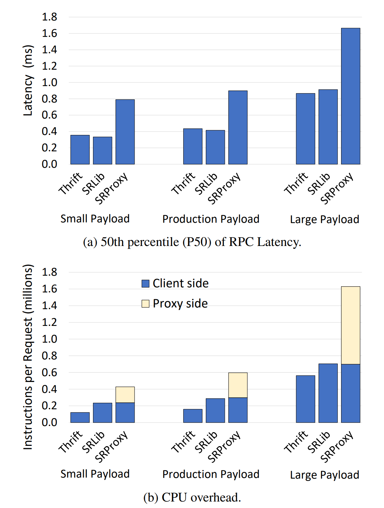

<center>图 10：Comparison of latency and CPU overhead across three setups: the Thrift baseline, SRLib, and SRProxy.</center>

在使用生产规模的载荷时，与纯 Thrift 方案相比，SRLib 和 SRProxy 分别消耗了 **80%** 和 **273%** 的额外 CPU 周期。这一开销之所以居高不下，是因为本实验的配置几乎模拟了 SRLib 和 SRProxy 的**最差工况**（worst case）。由于实验载荷的数据类型仅为常规字符串（trivial string），Thrift 框架层面的序列化与反序列化耗时极短。此外，RPC 客户端与服务器端均未执行任何实质性的业务逻辑处理。总体而言，这一配置将所有其他层面的开销降至最低，从而能够极限放大并清晰地揭示出 SRLib 和 SRProxy 在最差工况下的相对开销。

然而，在我们的实际生产环境中，当对运行在所有服务器上的所有工作负载进行全局聚合统计时，与纯 Thrift 相比，SRLib 实际上仅消耗了 **36%** 的额外 CPU 周期。这一实际数据显著低于在本最差工况实验中所观测到的 **80%** 的开销。

在使用生产规模载荷的 SRProxy 方案中，CPU 资源消耗在客户端与代理（proxy）之间几乎是均等分摊的。在延迟表现上，纯 Thrift 方案与 SRLib 的访问延迟几乎完全一致，相比之下，SRProxy 的延迟则高出了 **107%**。而当切换至大尺寸载荷（large-size payloads）时，SRLib 和 SRProxy 的相对额外开销均有所收窄。具体而言，与纯 Thrift 方案相比，SRLib 和 SRProxy 消耗的额外 CPU 周期分别降至 **25%** 和 **190%**。

本实验表明，若将 RPC 客户端与代理端综合来看，SRProxy 方案总共消耗的 CPU 周期达到了 SRLib 方案的**两倍以上**。在我们的实际生产环境中，我们部署了**数千台** SRProxy 机器，却仅仅路由了占总数 **1.1%** 的 RPC 请求，而这些请求所产生的数据传输量更是仅占总体的 **0.1%**。其余所有的 RPC 请求则全部由 SRLib 进行路由。可以预见，如果我们要在生产中彻底摒弃 SRLib 并完全切换为 SRProxy，从而让后者承载 **100%** 的 RPC 流量，那么我们还需要额外购置**数十万台**机器来专门部署 SRProxy。

在使用生产规模载荷的 SRProxy 方案中，在**内核态**（kernel）与**用户态**（user space）执行的 CPU 指令比例分别为 **26%** 和 **74%**。这表明，即便通过**零拷贝数据转发**（zero-copy data forwarding）等技术手段将内核开销完全消除，也依然不足以显著降低代理组件的整体开销。况且，由于该代理需要深度参与**数据加密**与**身份认证**（identity）的管理，其在实际工程中本身也无法实现零拷贝数据转发。

在使用小尺寸和生产规模的载荷时，SRLib 的延迟表现似乎略优于纯 Thrift 方案。然而，由于实验数据的**标准差**（standard deviation）较高，这一微小差异很大程度上只是由生产网络中的**测量噪声**（measurement noises）所导致的，因为该网络同时还在为大量的其他生产服务提供支撑。最后，理论上我们预期 SRProxy 方案的客户端所消耗的 CPU 周期应当少于 SRLib 方案的客户端，因为前者承担的路由计算工作更少。然而，在本实验中两者的差异却微乎其微。其核心原因在于，得益于我们多年来在该项目上的持续研发投入，SRLib 的**代码路径**（code path）已经得到了相对更深度的优化。

#### 4.2.2 Case Study of When to Use SRProxy

**如图 5 所示**，采用**共享式 SRProxy**（shared SRProxy）可以显著提升连接复用率。这在潜在上能够有效降低跨区域 RPC 的访问延迟，但其代价是必须投入额外的硬件资源来承载和部署 SRProxy。这一核心**权衡**（tradeoff）最终取决于“降低延迟所创造的**业务价值**”与“增设额外硬件带来的**资源成本**”之间的博弈。在工程实践中，针对用户提出的使用 SRProxy 的申请，我们始终坚持**一事一议**（case by case）的原则进行极其严谨的评估。下文我们将通过几个具体的**案例研究**（case studies）对此进行详细阐述。

**E-Comm（电商服务）。** E-Comm 是电子商务业务中使用的一种分片排序服务。由于其对延迟有着极为苛刻的**服务水平目标**（SLO，Service-Level Objective），该服务此前将其所有的分片（shards）均全量复制到每一个区域，以实现完全的本地就近访问。我们对其流量模式（traffic pattern）进行了深入分析，结果表明，如果允许仅 **5%** 的流量进行跨区域路由，我们便能免去在每个区域复制其 **33%** 分片的操作。这无疑会带来巨大的硬件资源节约，但代价是跨区域流量的访问延迟会有所增加。在**图 11** 中，我们对比了启用与未启用 SRProxy 两种配置下 E-Comm 的实际表现。结果发现，SRProxy 显著提升了跨区域连接的复用率，成功将 **P90 延迟**从大约 **325ms** 大幅降低至大约 **150ms**。

在业务吞吐量方面，E-Comm 的单区域最大 RPS（每秒请求数）约为 **300K**。由于单台 SRProxy 机器能够承载约 **87K** 的 RPS，理论上仅需 4 台 SRProxy 机器即可应对这一峰值。但在实际工程落地中，为了应对节点故障以及不可预期的**突发流量尖峰**（unexpected load spikes）并提供充足的容灾缓冲空间，我们每个区域实际部署了大约 10 台 SRProxy 机器。在完成全面的评估后，我们最终决定为 E-Comm 服务正式启用 SRProxy。因为通过在每个区域仅增设 10 台 SRProxy 机器，我们只需将 5% 的流量导向跨区域路由，便能为整个 E-Comm 服务**节省高达 33% 的硬件容量**，同时其业务延迟依然能完美地控制在 SLO 要求的范围之内。

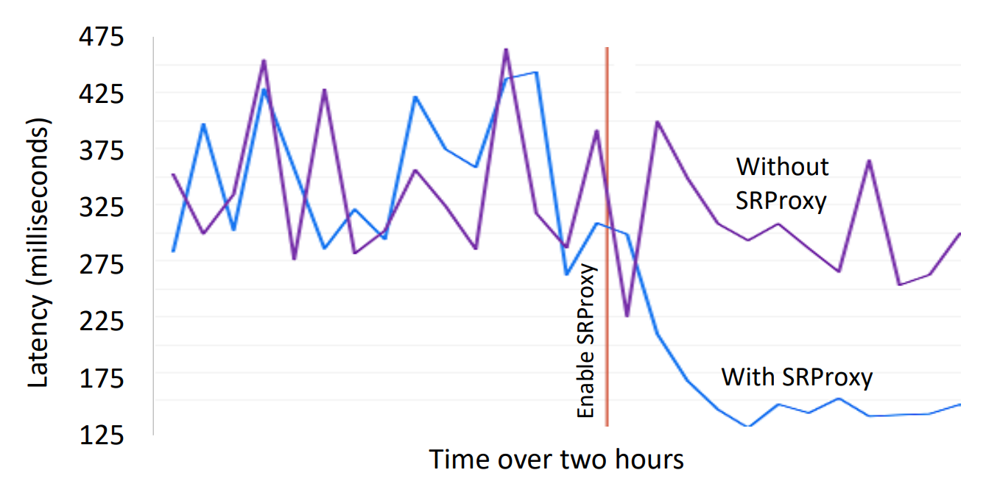

<center>图 11：E-Comm’s P90 latency with and without SRProxy.</center>

**键值存储（Key-value store）。** 该分布式键值存储拥有多达 **150 万个**数据分片。相应地，其服务发现信息中包含一张针对这 1500 万个分片的庞大**分片映射表**（shard map，参见图 7 示例）。如果让该键值存储的客户端去直接缓存如此体量服务的完整服务发现信息，将会消耗极其高昂的客户端内存。

为此，我们评估了通过启用 SRProxy 来将服务发现缓存从客户端机器**卸载**（offload）到 SRProxy 上的可行性。测试结果表明，在 **P99** 分位数下，该方案能为客户端机器节省 **250MB** 的内存空间。此外，SRProxy 还有助于提升连接复用率，进而优化延迟表现。在此前的传统架构中，由于客户端的请求需要大规模**扇出**（fanout）到由不同服务器托管的众多不同分片上，导致客户端的连接复用率表现极差。而引入**共享式 SRProxy**（Shared SRProxies）则能彻底扭转这一局面，不仅可以大幅改善连接复用情况，还能使平均延迟显著降低 **27%**。

然而，由于该键值存储自身的 RPS 吞吐量高得惊人，若要全量承载其流量，将需要额外配备 **1500 台** SRProxy 机器。最终，我们判定其产生的硬件资源成本并不能通过上述性能收益得到充分证明（即投入产出比不足），因此决定不对该键值存储的流量使用 SRProxy 进行路由。

### 4.3 Load Balancing

SR 能够同时实现**区域内**（within a region）与**跨区域**（across regions）的负载均衡。在本节中，我们将对这两种场景的实际表现分别进行评估。

#### 4.3.1 Same-Region Load Balancing

为了评估**同地域（同区域）负载均衡**的表现，我们选择了 15 个在单区域内产生显著流量的代表性服务。在这些服务中，有 10 个为**未分片服务**，5 个为**分片服务**。我们测量了每个服务在其所有服务器上的平均生产负载（其中，未分片服务采用**待处理请求数**作为指标，分片服务采用 **CPU 利用率**作为指标），并利用其均值对负载进行了**归一化处理**。

为了评估负载是否均匀地分散在单个服务的不同服务器上，我们计算了每个服务的**变异系数**（CV，Coefficient of Variation）。**图 12** 总结了评估结果。我们观察到，对于所有服务而言，其负载均集中在一个极窄的区间内。在全部 15 个服务中，变异系数的中位数极低，满足 $P50_{CV} = 0.18$ 且 $P95_{CV} = 0.6$。特别是未分片服务的变异系数始终保持在很低的水平（$P50^u_{CV} = 0.13$ 且 $P95^u_{CV} = 0.20$），这有力地表明 SR 能够高效、精准地平衡其服务器之间的负载。

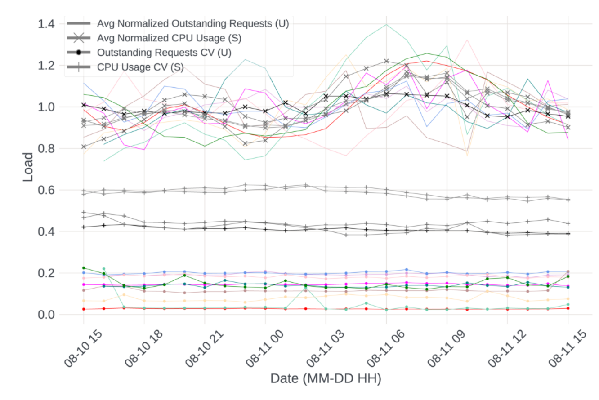
<center>图 12：Load balancing within a region for unsharded (U) and sharded (S) services. The top group shows the normalized average load and the bottom two groups show the load’s coefficient of variation (CV) across servers.</center>

相比之下，分片服务的变异系数（CV）则相对较高（$P50^s_{CV} = 0.44$ 且 $P95^s_{CV} = 0.61$），这表明其负载的均衡程度较低。其根本原因在于，受分片中所存储数据自身特性的影响，某些分片会成为“热点”**（承载大量流量），而其他分片则成为**“冷点”（几乎没有流量）。因此，即便 SR 能够完美地将 RPC 请求分摊到某一分片的不同副本（replicas）上，托管不同分片的服务器之间的负载依然可能存在失衡。

为了进一步平摊负载，可能需要跨容器迁移分片副本，和/或为热点分片创建额外的动态副本。然而，这些操作会带来高昂的系统开销，因此我们的**分片管理器**（shard manager）仅在足以防止服务器过载的情况下才会触发这些操作，而不会刻意追求绝对完美的负载均衡。总体而言，这些数据有力地证明了，SR 能够仅凭**单个服务网格**（service mesh），便可同时实现分片服务与未分片服务的负载均衡。

#### 4.3.2 Cross-Region Load Balancing

**局部性环（Locality ring）。** 服务的局部性环配置引导 SR 在适当时将请求路由至就近的服务器。为了评估其有效性，我们测量了落入不同局部性环的请求的 P90 延迟。

生产环境中各服务对局部性环策略的选择分布如下：

- **默认分层策略（63.8%）**：大多数服务采用 SR 的默认局部性环配置，即 **[同区域 | 相邻区域 | 同大洲 | 全球]** 逐级降级路由。
- **无局部性偏好（15.4%）**：有趣的是，有 15.4% 的服务直接将其局部性环设置为 **[全球]**。这意味着它们没有任何就近路由偏好。这类服务大多属于非面向用户（非前端）的后台服务，对延迟极不敏感，而是更看重全局可用性。
- **负载优先策略（9.7%）**：有 9.7% 的服务将其配置为 **[同区域 | 全球]**。这意味着它们首选在本地区域内消化请求；而一旦本地无法支撑，相比于邻近区域中负载较重的服务器，它们更倾向于将请求直接派发给全球任意区域中负载较轻的服务器。
- **完全自定义（11.1%）**：其余 11.1% 的服务则采用了自行定制的局部性环配置。

我们发现，对于分别由本地区域（Region）、相邻区域（NeighboringRegions）、同大洲（Continent）以及全球（Global）环内的服务器所处理的请求，其 P90 延迟分别为 **12 ms、83 ms、201 ms 和 262 ms**。这证实了系统符合设计预期：即**内层环的延迟明显低于外层环**。此外，在每一个向外扩展的环级别上，延迟的**阶跃**（latency jump）都非常显著，这表明**细粒度的局部性管理**（fine-grained locality management）具有重要的实际价值。

最初，我们的默认环配置为 **[同区域 | 同大洲 | 全球]**。然而，随着我们的全局基础设施中并入更多的数据中心区域，位于同一大洲内部的不同区域之间的延迟差异变得愈发明显。此时，得益于局部性环所带来的极高灵活性，我们能够非常轻松地引入一个全新的环级别——**相邻区域**（neighboring regions），以实现更精准的流量调度。

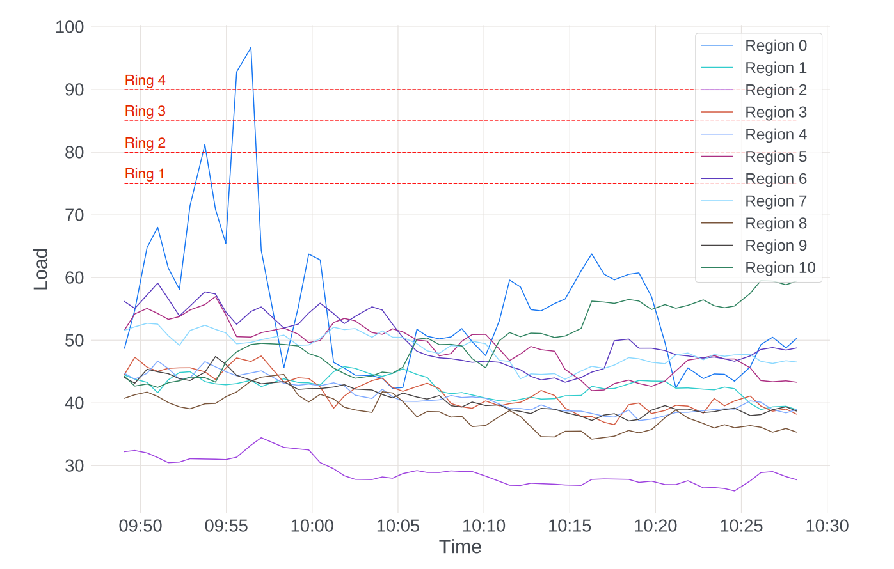

<center>图 13：xRS shapes a service’s traffic across several regions to prevent overloads.</center>

**跨区域负载溢出（Cross-region load spillover）。** xRS 为每个服务计算一张跨区域路由表，用以指导七层（L7）路由器做出路由决策。为了评估该机制的有效性，我们选择了一个为我们某款核心主线产品提供**动态消息（newsfeed）拉取与排序**的服务。

该服务采用了如下的局部性环阈值配置： `[ring_1: 75% | ring_2: 80% | ring_3: 85% | ring_4: 90%]`

其中每组对应关系中的第二个数字（如 75%）代表**负载阈值**。这意味着，一旦测得的内层环实际负载超过了该阈值，xRS 就会重新计算出一张新的路由表，从而**将部分流量从内层环外溢（转移）至紧邻的下一级外层环**，以此来减轻内层环的负载压力。在本服务中，所采用的负载度量指标（load metric）为某个区域内该服务所有服务器的**平均 CPU 利用率**。

**图 13** 记录了该服务在生产环境中发生的一次**真实故障事件**（real incident），而非我们仅为了实验目的而刻意模拟的测试。该图展示了在 **40 分钟**的时间跨度内，该服务在多个区域内的平均负载变化情况。我们可以观察到，xRS 能够成功通过动态调度（转移）流量，将绝大多数区域的负载稳定控制在 **75%** 的 **ring_1** 负载阈值之下；仅有**区域 0**（Region 0）在一次短暂的流量尖峰期间例外。

上午 09:53，区域 0 出现高负载（81.2%），突破了其 **ring_2** 负载阈值（80%）。xRS 随即评估了将部分流量外溢至区域 0 的 `ring_2` 级相关区域（即区域 2、区域 8 和区域 10）的可行性，并因**区域 2** 的实时负载最低而将其选为目标接收区域。

经 xRS 测算，只需将部分流量从区域 0 调度至区域 2，即可使区域 0 的整体负载回落至安全阈值以下。调度随即生效，生成了一张全新的路由表：该表将本地路由流量 $P_{0,0}$ 削减了 **5.35%**，并将跨区域分流系数 $P_{0,2}$ 设为 **5.35%**，即意味着将源自区域 0 的 **5.35%** 的请求重定向至区域 2。此后，区域 0 的负载迅速降至 70.9%，并在紧接着的 09:54 进一步回落至 **65.47%**。与此同时，由于该服务在区域 2 拥有极其庞大的**资源容量底座**（capacity footprint），流量导入给区域 2 带来的负载上升几乎微乎其微。

上午 09:55，区域 0 的负载再次发生剧烈激增，达到 92.83%，紧接着在 09:56 飙升至 96.69%，已然突破了该服务设置的 $\text{ring}_4$ 负载阈值（90%）。

作为应对措施，xRS 开始采取强力流控，首先将本地路由流量比例 $P_{0,0}$ 削减了 12%（从 99.24% 降至 86.92%），随后紧接着又削减了 13%（从 86.92% 进一步降至 74.38%）。被剥离的外溢流量再次被全量导入到区域 2 中，因为在区域 0 的 $\text{ring}_4$ 级所涵盖的所有候选区域中，区域 2 的负载依旧是最低的。相应地，跨区域分流系数 $P_{0,2}$ 先是从 0.76% 提升至 13.08%，继而从 13.08% 骤增至 25.62%。这一系列阶梯式动态微调效果立竿见影，区域 0 的负载随即大幅回落至 64.34%，整个区域在 09:57 重新恢复到健康水位。

总体而言，上述整个过程均由 xRS 完全自动实现，无需任何人工干预。这有力地证明了，xRS 在跨区域流量的动态管理方面是极其行之有效的。

### 4.4 Sharded Services

目前，我们的机群（fleet）运行着数百个分片服务。尽管在数万个服务中，分片服务仅占约 **3%**，但它们产生的流量却超过了其余 **97%** 的未分片服务。这是因为许多分片服务都属于我们规模最大、流量最高的顶级服务。具体而言，**图 8** 和**图 9** 中绝大多数规模最大的服务均为分片服务，且在 **4.2.2 节**中深入研究的两个服务也都是分片服务。为了更直观地展示其体量，我们的机群中仅为未分片服务就部署了**数百万个**容器，而分片副本（shard replicas）的数量更是高达**数亿个**。

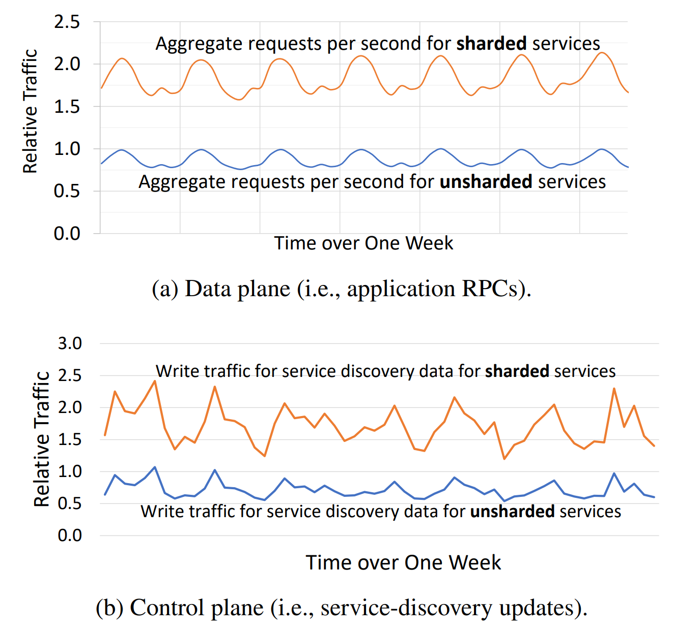

<center>图 14：Traffic for unsharded and sharded services, excluding memcache.</center>

**图 14(a)** 表明，所有分片服务的聚合 RPS（每秒请求数）达到了所有未分片服务聚合 RPS 的 **212%**。我们的 memcache 系统同样采用了分片架构，并且在全厂所有服务中拥有最高的 RPS，但它被排除在图 14(a) 的对比之外，以避免其极端的量级掩盖了其他服务的特征（使其相形见绌）。实际上，仅 memcache 一项服务的 RPS 就高达所有未分片服务聚合 RPS 的 **975%**。尽管 memcache 的 RPS 极高，但其处理的每个请求都非常轻量，因此 memcache 服务器在我们的机群总算力容量（fleet capacity）中所占的比例并不大。

**图 14(b)** 则显示，用于更新所有分片服务之服务发现信息的聚合控制面流量，达到了所有未分片服务聚合流量的 **240%**。这主要是因为分片服务为了平摊负载，需要更频繁地在服务器之间进行跨节点的分片迁移。

总体而言，分片服务的流量在我们的服务网格中，无论是在**数据面**（data plane）还是**控制面**（control plane）都占据了**绝对的主导地位**。这充分凸显了在服务网格内部为分片服务提供**原生的一等公民级内置支持**（first-class built-in support）的至关重要性。

在扣除 memcache 的情况下，分片服务的 RPC 请求仍占到全局总 RPC 量级的 **68%**。而一旦将 memcache 纳入统计（由于其本身也采用分片架构），这一比例则会飙升至 **92%**。尽管分片服务具有如此高的重要性，然而现有的所有通用服务网格都忽略了这一场景，而将目光完全聚焦于未分片服务上。

我们在单个统一框架内同时支持分片与未分片服务的**核心洞察**（key insight）在于：**在 SR 与具体服务之间定义一层“分片抽象（sharding abstraction）”**。通过该抽象来强制实现**关注点分离**（separation of concerns），从而使得 SR 能够对流量进行精准路由，同时完全无需感知服务内部复杂的具体业务逻辑。

## 5. Limitations of SRLib and Our Solutions

在本节中，我们将讨论 SRLib 的若干局限性，并详细阐述我们是如何应对并解决这些问题的。

**动态策略更新。** 除了负载均衡之外，SR 还提供了一系列丰富的服务网格（service-mesh）核心特性，例如**过载保护**、**可观测性**、**分布式链路追踪**以及**数据加密**。这些功能特性均通过动态策略更新来进行统一管理，且需要由七层（L7）路由器以**近乎实时**（near-real-time）的时效性来执行。

如果缺乏完善的工具链支持，为内嵌在应用程序内部的类库（如 SRLib）部署和分发策略更新，通常会比为独立的 Sidecar 代理组件部署更为困难。在 Meta，这一棘手的工程挑战是通过一个名为 **Configurator** 的强大配置管理系统来解决的。无论是 SRProxy 还是 SRLib，其策略配置均采用完全相同的方式进行管理。当某项策略发生变更时，Configurator 会迅速将该变更同步至全网节点，并向内嵌在应用程序中的 SRLib 发起一个**上呼回调**（upcall）。随后，SRLib 会**立即应用新策略，从而在无需重启应用程序的情况下实现了完全无感的热更新**。

**源代码修改。** SRLib 的一个主要固有缺点在于，它需要对现有服务的业务代码进行修改。传统的 RPC 框架通常依赖 **IP 地址和端口号**来构建并获取 RPC 客户端实例。相比之下，SRLib 则直接利用**服务名称**（service name）来获取 RPC 客户端。下述代码示例直观地展示了，将传统的 RPC 框架改造为适配 SRLib 是多么的直接与简便：

```c++
// 传统 RPC 方式：依赖物理网络拓扑（IP + 端口）
TraditionalRPCClient *cln = get_client(IP, port);
cln->foo();  // 发起对 foo() 的 RPC 调用

// SRLib 方式：解耦物理拓扑，面向服务名路由
SRClient *cln2 = SR_get_client("service_name");
cln2->foo(); // 发起对 foo() 的 RPC 调用
```

此外，与 RPC 相关的源代码修改并非 SRLib 所独有，而是被**超大规模头部企业**（hyperscalers）广泛采用。实际上，无论底层路由的具体实现机制如何，只要巨头们的 RPC 框架没有完全依赖标准但性能缓慢的 DNS 来进行服务发现，它们就必须对应用程序代码进行一定程度的修改，以便与各自定制的**服务发现系统**相集成。

诸如此类的业界典型案例包括：

- 谷歌（Google）的 **Borg 命名服务**（Borg Name Service）
- Netflix 的 **Eureka**
- LinkedIn 的 **Rest.li 动态发现**（Rest.li Dynamic Discovery）
- Twitter 的 **Finagle**
- Uber 的 **Hyperbahn**
- Airbnb 的 **Synapse**

这类通常需要修改源码才能投入使用的自定义服务发现系统在工业界**高度普及**，这有力地表明：只要这种代码变更足够简单，且完全局限于 RPC 极为精简的**窄接口**（narrow interface）之内，该方案在工程实践中就是完全切实可行的。

**类库代码部署。** 部署新版本的 SRLib 比部署新版本的 Sidecar 代理更具挑战性。这是因为 SRLib 是被编译并嵌入到数以万计的服务之中的，而每个服务都拥有其各自独立的部署排期。此外，从理论上讲，某些服务可能会长期不进行更新，从而导致它们持续运行在过时的 SRLib 版本之上。

在 Meta，这一棘手问题是通过一个名为 **Conveyor** 的强大软件持续部署工具来解决的。在 Conveyor 的协助下，Meta 多达 **97%** 的服务均被配置为无需人工干预的完全自动部署，无论是采用按天、按周的定期发布模式，还是在代码更新成功通过所有测试时自动触发。此外，出于超出 SR 自身范畴的全局合规考量，公司内部也有一项硬性规定，强制要求所有服务必须进行定期重新部署。这一行政与技术双重机制，在客观上确保了所有服务都能始终运行在较新版本的 SRLib 之上。

**SRLib 中的缺陷应对。** 如果 SRLib 的新代码中存在缺陷（bug），想要在瞬间回滚所有服务是极具挑战性的。为了有效降低这一风险，SRLib 中的每一次重大代码变更或新特性的引入，都会通过一个配置参数来进行**门控**（gated）。正如以下代码示例所示，该参数可以通过 Configurator 在生产环境中进行**在线实时热切换**，而完全不需要重新部署软件或重启服务进程：

```c++
// 在 SRLib 代码中引入一项新特性 FEATURE_X
if (check_gate(FEATURE_X)) {
    // 新代码路径（执行新特性逻辑）...
} else {
    // 旧代码路径（安全降级回退）...
}
```

在上述示例中，当通过中心服务器上的 Configurator 更新 `FEATURE_X` 的配置时，新的参数值会在**数秒内**迅速同步至所有的 SRLib 实例。当 SRLib 下一次调用 `check_gate(FEATURE_X)` 时，就会立即返回更新后的参数值并据此切换代码路径，而**完全无需重启应用程序进程**。

当上述新代码首次发布到生产环境时，`check_gate(FEATURE_X)` 的返回值默认设为 `false`，此时新代码路径就如同不存在一样，对线上流量完全隐形。随后，Configurator 会主导一个**金丝雀测试**（canary testing）流程：通过将特定的 `check_gate(FEATURE_X)` 选择性地设为 `true`，从而仅在极少数服务的少量副本（replicas）上动态启用新代码路径。

如果测试符合预期，新代码路径将逐步扩大范围，渐进式地使能到更多服务中。反之，一旦在线上遭遇缺陷（bug），只需通过一次简单的配置变更，便能在**瞬间对全局所有服务一键禁用 FEATURE_X**。总体而言，这种由配置变更动态门控的 **SRLib 新代码渐进式下发**（incremental rollouts）机制，使我们能够以极低的代价有效化解并控制 SRLib 潜在缺陷带来的故障风险。

**总结。** 在 Meta，得益于 Configurator 和 Conveyor 的支持，管理诸如 SRLib 等广泛部署的类库（WDL，Widely Deployed Libraries）在很大程度上已经成为一个已被攻克的问题。这些工具同时还协助管理着大约十几个其他的 WDL，因此这类工程挑战并非 SRLib 所独有。

然而我们必须承认，即便有了 Configurator 和 Conveyor 的协助，由于 SRLib 静态链接到了每一个服务之中，其开发、部署和管理的难度依然显著高于 Sidecar 或远程代理（remote proxies）模式。尽管我们的 SR 架构同时支持 SRProxy 和 SRLib 两种形态，但**相比于代理模式所带来的架构简单性，我们更优先考虑路由库模式所能带来的数十万台服务器的巨额成本节省**。我们在生产环境中的实际落地经验表明，尽管路由库方案伴随着诸多挑战，但它不仅极具成本效益，而且在高度复杂的极限环境下同样完全切实可行。

## 6. Related Work

学术界和工业界均有大量研究工作探讨了数据中心环境下的路由与负载均衡技术，这些工作主要集中在**三/四层**（Layer-3/4）或**七层**（Layer-7）。其中，三/四层负载均衡器既可以通过硬件来实现，也可以通过软件来实现。作为一种典型的三层解决方案，**任播**（anycast）能够将请求路由至就近的服务器，但它并未考虑服务器的动态负载变化。正如图 14 所示，我们机群中的绝大多数流量都源自**分片服务**，而这些传统的三/四层解决方案根本无法处理此类流量，因为它们完全无法感知或理解上层应用的分片逻辑。

与 SR 更为紧密相关的是**七层（L7）服务网格解决方案**，它们负责在微服务之间进行请求路由。七层路由能够深度检查**应用层级的信息**，从而实现更为高级、精细的负载均衡策略。

这种七层路由通常可以由一组专用的代理组件来执行。然而，采用远程代理（remote proxies）会引入**显著的时延抖动与硬件算力开销**。因此，SR 在策略上将代理模式（SRProxy）的使用范围严格限制在仅占全局约 **1%** 的流量内，仅专门用于那些能够从**连接复用**（connection reuse）中获得最大收益的特定服务。

与承载了我们 99% 流量的 SRLib 更为相关的，是将**七层（L7）决策下沉并分发至更靠近客户端侧**的服务网格解决方案。虽然 **eBPF** 性能极其高效，但其在七层协议的处理能力上表现得相对有限。例如，**Cilium** 的 eBPF 程序目前只能处理三/四层（L3/L4）协议，在面对七层协议时，它依然需要借助独立的 Sidecar 代理组件来完成。诸如 **Thrift**、**gRPC** 以及 **Finagle** 等 RPC 框架虽然构成了现代服务网格的底层基石，但它们并不能提供构建**地理分布式服务网格**（geo-distributed service mesh）所需的完整核心能力，例如**感知全局流量的动态路由**（global-traffic-aware routing）。

为了应对上述局限性，业界提出了结构更为复杂的**服务网格**（service meshes）方案。其中，**Envoy** 通常被部署为 **Sidecar 代理**，而 **Istio** 则提供了一个控制面（control plane）用以统一管理这些 Envoy 代理。

我们在**表 2** 中横向对比了不同的服务网格架构。结果表明，Sidecar 方案虽然具备**易于部署**的工程优势，但却会显著拉高网络时延并带来高昂的硬件算力成本。Zhu 等人的研究表明，Istio 会引入高达 **92% 的额外 CPU 开销**，并将时延拉高 **185%**。此外，mRPC 同样证实，Sidecar 架构会导致 **P99 RPC 时延激增 180%**，同时使**系统吞吐量骤降 44%**。相比之下，SR 坚定地采用了**路由库**（routing-library）方案，从而彻底规避了外挂代理组件所带来的各项性能内耗与算力开销。

**mRPC** 通过使用共享内存在应用程序与 Sidecar 之间进行通信，并避免在应用程序内部重复执行编组，从而消除了 Sidecar 方案固有的**双重序列化开销**（double marshaling overhead）。然而，这种方案要求修改应用程序，以便从共享内存的堆（heap）中为 RPC 参数分配内存。在工程实践中，这具有极高的落地难度，因为内存分配操作往往散落在应用程序的各个角落，甚至有时会发生在诸如 `strdup()` 等无法轻易修改的底层系统库内部。

相比于 **Istio** 仅能基于静态规则提供局部性感知路由（locality-aware routing），**SR** 则能够根据全局实时流量，动态计算出面向单服务的全球路由表。此外，谷歌的 **Slicer** 虽然支持分片服务（sharded services）的服务发现，但这一核心功能底层的服务网格并不能做到**开箱即用**（out of the box）。

## 7. Conclusion

本文介绍了 Meta 的全球服务网格系统 **ServiceRouter（简称 SR）**。与其他公开已知的服务网格相比，SR 在以下几个显著维度上截然不同：

- **极致的扩展性（Scalability）**：SR 的扩展规模远超此前发表的所有相关工作，目前其日常处理的生产流量高达**每秒数百亿次请求**（tens of billions of requests per second）。这一惊人吞吐量是通过对路由信息库（RIB，Routing Information Base）进行大规模全量复制实现的，从而引导七层（L7）路由器以完全去中心化的方式实现自我配置与自我管理。
- **极低的算力内耗（Cost Efficiency）**：与业界单纯依赖 Sidecar 或远程代理的常规方案不同，SR 通过内嵌路由库（embedded routing library）的形式承载了全厂 **99%** 的流量，最大程度地控制并降低了硬件算力与物理服务器成本。
- **多层就近调度（Locality-Awareness）**：SR 开创性地引入了局部性环（locality rings）的概念，在将 RPC 网络时延压缩至极致的同时，完美实现了跨地理分布式数据中心区域的全局负载均衡。
- **全场景通用架构（Generality）**：SR 通过一套完全通用的底层路由框架，优雅地同时支持**分片服务**（sharded services）与**副本服务**（replicated services）。

我们目前正在开展的后续工作主要聚焦于：结合**全球容量管理**（global capacity management）来进一步精细化演进全球路由策略；同时持续增强系统的**过载保护**（overload protection）机制，以确保各核心业务链路在遭遇大规模突发灾难事件时能够实现安全、受控的**优雅降级**（graceful degradation）。

## 8. 面试问题与可追问方向

### 8.1 论文理解问题

#### 1. 为什么 SR 不采用传统 Istio/Envoy 那种 sidecar-only 架构？

**问题：** ServiceRouter 为什么没有把所有流量都交给 sidecar proxy 或 remote proxy，而是选择把 99% 的 RPC 路由逻辑放进 SRLib？这种设计解决了什么核心问题？

**可追问方向：**

- 除了延迟，还有哪些硬件成本？
- 为什么 proxy 会额外消耗 CPU 和机器？
- 如果完全从 SRLib 切换到 proxy，论文中估计会发生什么？
- Sidecar proxy 还有哪些优点，使得 SR 仍然保留 sidecar / remote proxy 形态？

#### 2. SR 的控制面为什么要和 L7 router 解耦？

**问题：** 论文中强调 SR 的 central control plane 不直接管理每个 L7 router，而是让 L7 router self-configuring / self-managing。为什么这是 hyperscale service mesh 的关键？

**可追问方向：**

- 如果一个 service mesh 有数百万个 L7 routers，控制面逐个下发路由表会遇到什么扩展性问题？
- SR 中哪些组件负责生成全局元数据？哪些组件只负责消费元数据？
- RIB 在这个解耦中起什么作用？

#### 3. 请完整描述一次 SRLib 访问新服务时的 service discovery 流程。

**问题：** 假设某台机器上的 client 第一次通过 SRLib 访问 Service X，从最初没有缓存到可以发送 RPC，中间发生了什么？

**可追问方向：**

- RIBDaemon 和 SRLib 分别缓存什么？
- miniRIB 初始状态是什么？
- RIBDaemon 为什么要把数据缓存到磁盘，而 SRLib 为什么只缓存在内存？
- 后续 Service X 扩容、缩容、迁移、故障时，更新路径是什么？

#### 4. 为什么 SRLib 不自己维护 miniRIB，而是让 RIBDaemon 维护？

**问题：** 既然 SRLib 已经在 client 进程里，为什么不让 SRLib 直接从 RIB replica 拉取并维护 miniRIB？为什么还要每台机器跑一个 RIBDaemon？

**可追问方向：**

- RIB 更新为什么会造成 CPU spike？
- cgroup 在这里解决了什么问题？
- 如果 miniRIB 由 SRLib 维护，会对应用进程造成什么影响？
- RIBDaemon 被 throttling 时，为什么对 RPC 关键路径影响较小？

#### 5. SR 的 RIB 如何扩展？它的瓶颈在哪里？

**问题：** 论文中 RIB 是中心化的 routing metadata store，但 SR 又要支撑 millions of L7 routers。为什么 RIB 没有成为不可扩展的单点瓶颈？

**可追问方向：**

- RIB 的 write path 和 read path 分别如何扩展？
- 为什么写入速率不高？
- RIB replicas 的作用是什么？
- 如果 RIB update 传播延迟存在，客户端拿到 stale routing metadata 时怎么办？
- 论文中如何处理 shard migration 时的 stale routing？

#### 6. SR 如何支持 sharded services？

**问题：** ServiceRouter 中 sharded service 的抽象是什么？SR 如何在不了解业务逻辑的情况下，把请求路由到正确 shard 和正确 role？

**可追问方向：**

- 128-bit key space 是如何被使用的？
- shard、replica、role 三者是什么关系？
- primary / secondary role 对 service mesh 来说意味着什么？
- 为什么说 SR 的 shard-map abstraction 实现了 separation of concerns？

#### 7. 为什么 shard-map 方案比一致性哈希更适合 Meta 的高级分片服务？

**问题：** 论文中比较了 consistent hashing 和 shard-map approach。请解释两者差异，并说明为什么论文认为 consistent hashing 对 advanced sharding use cases 不够。

**可追问方向：**

- 一致性哈希的优点是什么？
- 它为什么不需要存 Figure 7 那样的 shard map？
- 它在哪些场景下不支持动态 shard migration？
- 如果有 hot shard，shard-map 比一致性哈希更容易做什么？
- 为什么有些服务最初想用 custom lookaside service，最后却没有采用？

#### 8. Pick-2 在 SR 中为什么不够？SR 对 Pick-2 做了哪些增强？

**问题：** 论文说 SR 的负载均衡基于 Pick-2，但单独使用 Pick-2 在 geo-distributed service mesh 中不够。为什么？

**可追问方向：**

- 如果从全局 server pool 随机选两台，会出现什么问题？
- locality rings 如何改变候选集？
- stable subset 如何帮助连接复用？
- adaptive load estimation 解决了什么问题？
- 这三项增强分别对应延迟、连接、负载信息中的哪类问题？

#### 9. Rendezvous Hashing 在 SR 中到底解决什么问题？

**问题：** 论文中 SR 使用 Rendezvous Hashing 为每个 client 选择稳定的 server subset。请解释它的输入、输出、选择过程和收益。

**可追问方向：**

- 为什么不是每次 RPC 都从全部 server 中 Pick-2？
- client ID 在 hashing 中起什么作用？
- 如果新增或删除一台 server，Rendezvous Hashing 如何降低扰动？
- 为什么论文说 Rendezvous Hashing 比 consistent hashing 更适合 heterogeneous hardware？
- weighted hashing 如何结合 Pick-2 的权重？

#### 10. locality rings 和 xRS 分别解决什么问题？它们之间是什么关系？

**问题：** 论文中 locality rings 和 xRS 都涉及跨地域路由。请解释它们各自负责什么，以及为什么只靠 locality rings 不够。

**可追问方向：**

- locality rings 是 client 本地使用的策略，还是全局优化器？
- 为什么 locality rings 可能导致某个 region 被打爆？
- xRS 计算的 cross-region routing table 中，$P_{ij}$ 表示什么？
- 为什么 xRS 需要 global traffic 和 load information？
- xRS 如何在灾难或维护前把流量从某个 region 移出？
- black holes 是什么，什么时候会用？

#### 11. adaptive load estimation 为什么需要三种模式？

**问题：** SR 如何获得 server load 信息？为什么既不用每次请求前都 poll server，也不用永远相信 cached load？

**可追问方向：**

- 默认 load metric 是什么？还有哪些自定义 load metric？
- response piggyback load 的优缺点是什么？
- just-in-time polling 什么时候值得做？
- 缓存过期且 polling 成本高时，为什么 SR 退化为随机选择？
- 这对 tail latency 和 load balancing 有什么影响？

#### 12. 什么时候应该用 SRRemoteProxy，而不是 SRLib？

**问题：** SRLib 避免了 proxy 成本，那为什么论文仍然保留 SRRemoteProxy？请给出一个适合使用 remote proxy 的场景。

**可追问方向：**

- 大量低频 client 访问远端 region 时，SRLib 会有什么连接问题？
- remote proxy 为什么能提高跨 region keep-alive connection 复用？
- SRRemoteProxy 和 SRSidecarProxy 的区别是什么？
- SRProxy 节省了什么，又额外消耗了什么？
- 如何判断一项业务是否值得用 SRProxy？

### 8.2 技术发展问题

#### 1. 未来是否可以用更强的全局优化器替代 xRS 的启发式流量调度？

**问题：** xRS 当前基于 locality ring threshold、RPS cost、region load 等信息计算 cross-region routing table。未来是否可以把它改造成更完整的全局优化问题，例如同时优化 latency、error rate、capacity cost、carbon cost、SLO priority 和 failure domain 风险？

**可追问方向：**

- 可以讨论线性规划、在线优化、强化学习、MPC、PID controller 的优缺点。
- 全局优化器需要稳定、可解释、可回滚，不能只追求理论最优。
- 生产系统更怕 overreaction、oscillation 和不可解释的流量迁移。

#### 2. SRLib 这种 embedded routing library 是否会增加应用治理复杂度？

**问题：** SRLib 带来了硬件成本优势，但它需要链接进应用进程。未来是否可以设计一种既接近 SRLib 成本，又不要求应用深度集成的方案？

**可追问方向：**

- 可以比较 sidecar、eBPF、kernel bypass、shared memory proxy、language-specific library、RPC framework-level integration。
- L7 routing 需要认证、加密、重试、观测、分片、超时、流量镜像等能力，单纯 eBPF 或 kernel-level 方案很难完整表达 L7 语义。
- sidecar 虽然解耦语言栈，却会带来明显成本；SR 选择 routing-library approach 正是为了避免 proxy overhead。

#### 3. 对于 stale routing metadata，有没有比“错误后重试 + graceful migration”更好的机制？

**问题：** RIB 更新传播到所有 clients 有 P50/P95/P99 延迟，期间 client 可能持有 stale metadata。未来是否可以减少 stale routing 的影响，而不显著增加控制面压力？

**可追问方向：**

- 可以讨论版本号、lease、server-side redirect、negative cache、request token、epoch-based routing、two-phase drain、目标 server 主动校验 shard ownership。
- 更强一致性会增加延迟和控制面压力；更弱一致性需要应用层容错。
- 服务发现系统通常要在 correctness、availability、latency、metadata freshness 之间权衡。

#### 4. sharded service 的 hot shard 问题能否由 service mesh 自动解决？

**问题：** 论文中 SR 支持 shard-map，但真正的 shard migration、hot shard 拆分、replica 增减仍然依赖 shard manager 或服务自身策略。未来 service mesh 是否应该进一步参与 hot shard 检测和自动扩缩？

**可追问方向：**

- service mesh 能看到 RPC traffic 和 load，但不了解业务数据语义。
- 自动迁移 shard 可能涉及数据复制、状态一致性、leader/follower 切换、缓存失效和写入一致性。
- 需要区分 routing-level balancing 和 data-placement-level balancing：前者 SR 可以做，后者需要和 shard manager、storage layer、application semantics 协同。

#### 5. locality rings 是否足够表达现代多目标调度需求？

**问题：** locality rings 主要表达 latency 和 load 的权衡。未来如果还要考虑成本、能源、碳排、region 法规、数据主权、租户优先级、SLO class，locality rings 是否仍然合适？

**可追问方向：**

- 可以提出 policy language、constraint-based routing、multi-objective scoring、per-tenant routing class、SLO-aware traffic shedding 等方案。
- 重点不是提出复杂模型，而是说明如何保持配置可理解、可调试、可验证。
- 论文最后也提到后续工作集中在把 global routing 和 global capacity management 结合，并增强 overload protection，使服务在大规模灾难中能够 graceful degradation。

#### 6. 服务网格未来是否应该统一处理 routing、overload protection 和 capacity management？

**问题：** SR 已经支持 service discovery、load balancing、failover、overload protection、observability、tracing、resource attribution、shadow traffic 等能力。未来这些功能是否应该由一个统一 service mesh 控制，还是应该继续拆成多个独立系统？

**可追问方向：**

- 统一系统的优点是全局视角强，可以把容量、路由、限流、熔断、降级联动起来。
- 统一系统的缺点是系统复杂度和 blast radius 变大。
- 可以继续追问控制面分层、策略隔离、灰度发布、回滚、安全边界、跨团队 ownership 等工程问题。
