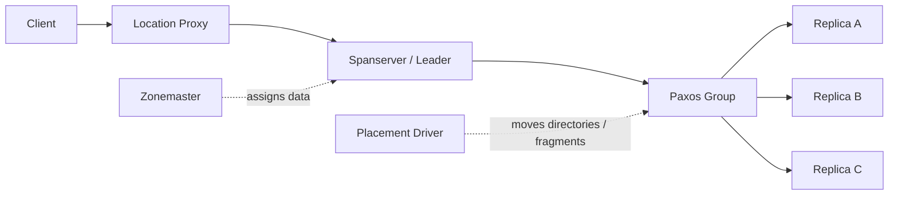

# Spanner

## 1. Spanner 是什么

Spanner 是 Google 设计、构建并在生产环境中部署的一套**全球分布式、多版本、同步复制数据库系统**。它要解决的问题不是“如何把数据放到很多机器上”，而是“如何在跨数据中心、跨地域复制的前提下，仍然提供接近传统关系型数据库的事务语义和一致性语义”。

在 Spanner 出现之前，大规模系统通常面临一个很现实的二分：

- 传统关系型数据库有 SQL、事务和强一致性，但横向扩展、跨数据中心容灾和自动分片能力有限；
- Bigtable、Dynamo 一类 NoSQL 系统能扩展，但往往要求应用接受更弱的一致性、更少的事务能力，或者把大量分片、重试、冲突处理逻辑写进业务层；
- Megastore 这类系统提供跨数据中心同步复制和半关系模型，但写吞吐和扩展能力不足。

Spanner 的核心贡献，是把这些原本被认为难以同时满足的能力组合在一起：

- **全球范围的数据分片与同步复制**；
- **Paxos 复制组之上的强一致读写**；
- **跨分片、跨副本的分布式事务**；
- **外部一致性（external consistency）**，即事务顺序不仅可串行化，而且符合真实时间顺序；
- **多版本数据与时间戳读**，支持过去时间点的一致快照；
- **半关系型表、SQL 风格查询语言和通用事务**；
- **自动重分片、自动数据迁移和应用可控的数据放置策略**。

如果用一句话概括，Spanner 不是“带 SQL 的 Bigtable”，也不是“分布式版 MySQL”。它更像是一个把数据库、复制协议、时间服务、分片管理和地理放置策略整合在一起的全球事务数据库系统。

今天 Google Cloud 上的 Spanner 已经产品化为托管数据库服务。官方文档将它描述为一种 fully managed、mission-critical 的数据库服务，组合了 relational、graph、key-value 和 search 能力，提供全球规模的事务一致性、自动同步复制和 GoogleSQL / PostgreSQL 两种 SQL 方言支持。本文前半部分主要讨论论文中的 Spanner 设计，后半部分再讨论它作为产品演进到今天的意义。

---

## 2. 设计初衷：Google 需要怎样的全球数据库

Spanner 的设计背景非常明确：Google 需要一个能承载关键业务、跨数据中心运行、自动扩展、并且不把一致性复杂度甩给应用层的数据库系统。

论文中反复出现的痛点有三类。

第一类是 **Bigtable 的可用性和扩展性很好，但对复杂业务应用不够友好**。Bigtable 的数据模型偏底层，应用如果有复杂、演进中的 schema，或者需要跨行事务、全局一致读、SQL 风格查询，就必须自己补很多能力。

第二类是 **Megastore 有同步复制和半关系模型，但写性能相对较弱**。论文提到 Google 内部大量应用使用 Megastore，正是因为它比 Bigtable 更接近业务数据库；但 Megastore 的写吞吐限制使它不适合所有高规模场景。

第三类是 **手工分片的关系型数据库维护成本极高**。Spanner 的第一个重要客户 F1，是 Google 广告后端的重写。F1 原来基于手工分片的 MySQL，客户及其相关数据会固定落到某个 shard 上。这样做虽然保留了每个客户内部的索引和复杂查询能力，但应用逻辑必须理解分片，数据增长后 resharding 成本极高。论文中提到最后一次 resharding 花了两年以上，涉及几十个团队协同测试和降低风险。

因此，Spanner 的底层目标可以概括为：

1. **强一致性不能只在单机或单数据中心成立**。系统必须能在跨数据中心复制时仍然提供严肃的事务语义。
2. **扩展不能依赖业务手工分片**。数据增长、负载变化、机器增减和故障恢复都应尽量由系统自动处理。
3. **应用需要数据库抽象，而不只是 key-value 抽象**。复杂业务仍需要 schema、查询语言、事务、索引和演进能力。
4. **地理位置是数据库设计的一部分**。应用应该能控制数据离用户有多近、副本之间有多远、有多少副本，以及副本应该放在哪些区域。
5. **一致快照要成为基础能力**。备份、审计、MapReduce、报表和 schema change 都需要在全局范围读到某个时间点的一致数据库状态。

Spanner 的关键判断是：与其让每个业务系统在“分片、复制、事务、一致性、容灾”之间各自做一套不完整的工程折中，不如把这些能力变成数据库系统的内建能力。

---

## 3. 设计理念：Spanner 为什么重要

### 3.1 不把“一致性”和“全球规模”视为天然对立

很多分布式数据库把全球复制和强一致性看作必须取舍的两端：要低延迟和高可用，就弱化一致性；要强一致，就牺牲跨地域能力。Spanner 的设计目标恰好相反：它把外部一致性作为系统级语义，而不是应用可选项。

外部一致性比普通 serializability 更强。Serializability 只要求并发事务的结果等价于某个串行顺序，但这个串行顺序不一定符合真实时间。External consistency 要求：如果事务 `T1` 在真实时间上已经提交完成，而事务 `T2` 之后才开始提交，那么系统给出的序列化顺序必须让 `T1` 排在 `T2` 前面。对应用开发者来说，这意味着 Spanner 在语义上更接近“一个单机数据库”，即使它实际上运行在多个数据中心和大量机器上。

这个性质极大降低了业务层复杂度。应用不需要额外处理“我刚写完的数据，另一个事务按理说应该看到但没看到”这类异常，也不需要为跨地域复制设计复杂的补偿逻辑。

### 3.2 显式承认时钟不确定性，而不是假装时钟完全同步

Spanner 最有辨识度的设计是 TrueTime。TrueTime 的关键不在于“Google 有非常准的时钟”，而在于它把**时间不确定性**暴露为 API。

普通时间 API 通常返回一个时间点，例如 `now = 10:00:00.123`。问题是，在分布式系统中，这个时间点并不绝对可靠：不同机器的时钟可能有偏差，网络延迟会影响校时，硬件也可能故障。TrueTime 不返回单点时间，而是返回一个区间：

```text
TT.now() -> [earliest, latest]
```

这个区间的语义是：真实时间一定落在 `earliest` 和 `latest` 之间。也就是说，TrueTime 不承诺“我知道现在精确是什么时刻”，而是承诺“我知道现在一定在这个有界区间内”。这使得 Spanner 可以基于区间边界做安全推理。

这种设计非常工程化。Spanner 不要求时钟没有误差，而是要求误差有上界；当误差上界变大时，Spanner 会等待更久。这种“把不确定性等过去”的机制，是 external consistency 能成立的关键。

### 3.3 把复制协议和并发控制放在一起设计

Spanner 不是简单地把事务层堆在复制层之上。它把 Paxos 复制、leader lease、lock table、two-phase commit、commit timestamp 和 TrueTime 放在一个整体里设计。

在单个 Paxos group 内，leader 负责写入顺序和锁管理；在多个 Paxos group 之间，事务使用 two-phase commit 协调；事务提交时间戳则要同时满足 Paxos 内部单调性、参与者 prepare timestamp 约束和 TrueTime 约束。这样做的结果是：Spanner 能在分布式复制基础上提供真正的数据库事务，而不是只提供“最终会复制过去”的存储写入。

论文中有一句很能体现 Spanner 思路的观点：在 Spanner 中，把 concurrency control 和 replication 集成起来可以降低 commit wait 的成本。换句话说，Spanner 的优势不只是用了 Paxos，也不只是用了时间戳，而是把多个分布式系统机制在数据库语义目标下协同起来。

### 3.4 自动移动数据，但让应用表达地理偏好

Spanner 不是把数据切好之后永远固定。它会自动 reshards、迁移数据、平衡负载，并在故障或容量变化时调整数据位置。但它又不是完全忽视业务语义的自动调度器。应用可以通过 placement 约束表达副本数量、地域位置、延迟和容灾偏好。

这种设计比单纯的 hash sharding 更接近真实业务需求。一个全球应用可能希望欧洲用户数据主要放在欧洲，北美用户数据放在北美；同时，关键业务又希望某些数据有跨洲灾备能力。Spanner 把这类策略纳入数据模型和复制配置，而不是要求业务自己维护复杂映射。

### 3.5 多版本不是附加功能，而是全局一致读的基础

Spanner 把数据版本和提交时间戳绑定起来。每次写入都会生成带 commit timestamp 的新版本，旧版本按可配置垃圾回收策略保留。这样，系统可以在某个时间戳上执行一致快照读。

这直接支撑了几个重要能力：

- 过去时间点的 snapshot read；
- 不阻塞写入的 read-only transaction；
- 全数据库一致备份；
- 一致的 MapReduce / 批处理读取；
- 全局 schema change 的时间戳化。

在 Spanner 中，“时间”不是观察指标，而是数据模型的一部分。

### 3.6 关系模型仍然重要，但主键和局部性仍然决定性能

Spanner 提供 schematized semi-relational tables 和 SQL 风格查询语言，但它并没有退回到传统单机关系数据库的思维。每张表必须有有序主键，主键不仅用于唯一标识行，也决定数据在分布式 key space 中的布局。表之间还可以通过 interleaving 表达父子局部性关系。

这说明 Spanner 的关系模型是“分布式系统约束下的关系模型”：开发者能获得更熟悉的 schema 和查询抽象，但仍必须理解主键、热点、局部性、跨分片事务和地理复制对性能的影响。

---

## 4. 数据模型：从 Key-Value 到半关系型多版本表

Spanner 底层的数据表示仍然很像一个带时间戳的 key-value 映射：

```text
(key: string, timestamp: int64) -> string
```

但应用看到的不是裸 key-value，而是数据库、表、行、列、主键、事务和查询语言。这个设计介于传统关系数据库和 Bigtable 之间：它保留了分布式 key-value 存储容易切分、复制和迁移的特点，同时提供更适合业务系统使用的 schema 和事务接口。

### 4.1 Universe、Database、Table、Directory

Spanner 的几个核心数据层级可以这样理解：

| 层级 | 含义 |
|---|---|
| Universe | 一个 Spanner 部署，管理一组全球分布的 zones |
| Database | 应用创建的数据库，一个 universe 中可以有多个 database |
| Table | 带 schema 的表，类似关系数据库中的表 |
| Row | 由主键命名的行 |
| Directory | 具有共同 key prefix 的连续 key 集合，是数据放置和迁移的基本单位 |
| Fragment | 当 directory 过大时，被进一步拆分出的片段 |

Directory 是 Spanner 数据模型中非常关键但容易被忽略的概念。它是数据放置、复制配置和迁移的基本单位。一个 directory 内的数据共享相同的 replication configuration；系统可以把 directory 从一个 Paxos group 移到另一个 Paxos group，以减轻负载、改善局部性或靠近访问者。

论文中还指出，如果 directory 太大，Spanner 会把它拆成多个 fragments；实际移动时 movedir 移动的是 fragments，而不是一定移动整个 directory。

### 4.2 主键决定行名，也决定数据局部性

Spanner 的表看起来像关系表，有 rows、columns 和 versioned values；但它要求每张表必须有一个有序的 primary key。主键在这里不只是约束，也是分布式数据布局的基础。

这有一个重要后果：**schema design 本身就是分布式系统设计的一部分**。如果主键选择不当，例如大量写入集中到单调递增的时间戳前缀上，就可能制造热点。相反，如果主键能反映访问模式和局部性，就能让大多数事务落在较少的 Paxos groups 上，减少跨组事务成本。

### 4.3 Interleaving：用 schema 表达父子局部性

Spanner 允许应用通过 `INTERLEAVE IN PARENT` 把子表行物理上排列在父表行附近。论文中的例子是用户和相册：

```sql
CREATE TABLE Users {
  uid INT64 NOT NULL,
  email STRING
} PRIMARY KEY (uid), DIRECTORY;

CREATE TABLE Albums {
  uid INT64 NOT NULL,
  aid INT64 NOT NULL,
  name STRING
} PRIMARY KEY (uid, aid),
  INTERLEAVE IN PARENT Users ON DELETE CASCADE;
```

这种 interleaving 的目的不是语法美观，而是让数据库知道哪些表之间存在重要的 locality relationship。例如某个用户及其相册元数据经常一起访问，系统就应该尽量把这些数据放在同一个 directory 或相近位置中。没有这种声明，分布式数据库很难从普通 SQL schema 自动推断最重要的数据局部性。

### 4.4 操作类型：读写事务、只读事务、快照读

Spanner 支持几类不同操作，它们的并发控制方式不同：

| 操作类型 | 是否加锁 | 时间戳来源 | 典型用途 |
|---|---|---|---|
| Read-write transaction | 使用 two-phase locking | commit 时分配 | 更新业务状态、跨行事务 |
| Read-only transaction | lock-free | 系统选择一致时间戳 | 一致读取多个 key range |
| Snapshot read | lock-free | 客户端指定 timestamp 或 staleness bound | 历史查询、报表、备份、审计 |

只读事务和快照读的价值很大。它们可以在不阻塞写入的情况下读取一致快照，并且可以在任意 sufficiently up-to-date 的副本上执行。这使得 Spanner 可以把强一致事务和高吞吐读路径同时保留，而不是让长时间读取压住写入。

---

## 5. TrueTime 与外部一致性：Spanner 的关键机制

### 5.1 TrueTime API

TrueTime 的 API 很小：

| 方法 | 返回含义 |
|---|---|
| `TT.now()` | 返回 `[earliest, latest]`，表示真实时间一定在该区间内 |
| `TT.after(t)` | 如果时间 `t` 已经确定过去，返回 true |
| `TT.before(t)` | 如果时间 `t` 尚未到来，返回 true |

Spanner 论文中的关键表述是：TrueTime 显式表示 bounded time uncertainty。它不是让每台机器都相信自己知道精确时间，而是让系统知道“我最多不确定多少”。

在 Google 的实现中，TrueTime 使用 GPS 和 atomic clocks 两类时间源，因为它们的故障模式不同。每个数据中心有一组 time masters，每台机器有 timeslave daemon。daemon 会从多个 time masters 拉取时间，检测并剔除异常时间源，然后给本机提供带不确定性边界的时间区间。

论文给出的 2012 年生产环境数据是：TrueTime 的 ε 通常表现为随 polling interval 变化的锯齿形，大约在 1 到 7ms 之间，多数时候约为 4ms；如果不确定性变大，Spanner 会等待更久。

### 5.2 Commit timestamp 和 commit wait

Spanner 为每个事务分配 commit timestamp。这个时间戳必须满足两个关键约束：

1. 在每个 Paxos group 内，Paxos writes 的 timestamp 单调递增；
2. 如果 `T1` 在真实时间上先于 `T2` 完成 / 开始提交，则 `T1` 的 timestamp 必须小于 `T2` 的 timestamp。

为了做到第二点，Spanner 在提交读写事务时使用 commit wait。

简化后的流程是：

1. coordinator leader 收到 commit 请求；
2. 它选择一个 commit timestamp `s`，其中 `s` 至少不小于 `TT.now().latest`；
3. commit record 通过 Paxos 写入；
4. 在对外宣布提交完成前，coordinator 等到 `TT.after(s)` 为 true；
5. 一旦 `s` 已经确定在过去，事务才对客户端和其他参与者可见。

这个等待看起来像额外开销，但它换来的是非常强的语义：当事务对外声明已经提交时，系统已经能确定所有之后开始的事务会拿到更大的时间戳。论文指出，commit wait 通常可以和 Paxos 通信重叠，因此并不总是完全额外叠加在写延迟上。

### 5.3 只读事务为什么可以 lock-free

对于 read-only transaction，Spanner 会先选择一个读时间戳 `sread`，然后把所有读取都当作 `sread` 上的 snapshot reads 执行。只要某个副本 sufficiently up-to-date，它就能服务该时间戳上的读取，不需要给读操作加锁，也不需要阻塞写入。

这背后的关键仍然是时间戳语义：读事务不需要阻止并发写，只需要选择一个满足 external consistency 的读时间点。MVCC 保证历史版本可读，TrueTime 保证时间戳和真实时间顺序一致，safe time 机制保证副本知道自己已经足够新，可以安全返回该时间戳的数据。

### 5.4 为什么 TrueTime 不是“违反 CAP”

Spanner 常被误解为“用时钟绕过了 CAP”。更准确的说法是：Spanner 并没有推翻 CAP，而是在工程上把常见故障模式下的可用性、一致性和性能组合到了很高水平。

如果发生真正的网络分区，某个副本组失去多数派，Paxos 仍然不能在少数派上继续提交写入。也就是说，Spanner 在需要时仍然会选择一致性而不是任意可用性。TrueTime 的作用不是让少数派也能安全写入，而是让系统在有多数派、时钟误差有界的前提下，以较低协调成本分配全局有意义的时间戳，并让只读快照和 external consistency 变得可实现。

因此，Spanner 的启示不是“CAP 失效了”，而是：CAP 过于粗粒度，不足以描述真实系统中的故障概率、地理部署、时钟基础设施、复制拓扑和应用语义。Spanner 通过工程化控制这些变量，使强一致全球数据库在很多生产场景中变得可用。

---

## 6. 实现架构：Spanner 是如何跑起来的

### 6.1 总体组织：Universe、Zone、Spanserver

Spanner 的一个部署称为 universe。一个 universe 由多个 zones 组成，zone 是管理部署和物理隔离的基本单位，也是一组可复制位置的集合。

每个 zone 中有：

- **zonemaster**：负责把数据分配给 spanservers；
- **spanserver**：真正服务客户端读写请求；
- **location proxy**：帮助客户端定位负责某段数据的 spanserver。

在 universe 级别，还有：

- **universe master**：主要用于展示状态和交互式调试；
- **placement driver**：以分钟级周期处理跨 zone 的数据移动、复制约束调整和负载均衡。

可以用下面的简化图理解：



这套组织方式说明 Spanner 的数据服务和数据放置是分开的：spanserver 负责实际读写，placement driver 负责长期的数据位置优化。

### 6.2 Spanserver 软件栈

Spanserver 是 Spanner 的核心服务节点。每个 spanserver 负责 100 到 1000 个 tablet。tablet 存储底层的 `(key, timestamp) -> value` 映射，其状态保存在类似 B-tree 的文件和 write-ahead log 中，底层文件系统是 Colossus。

为了支持复制，每个 spanserver 在每个 tablet 上实现一个 Paxos state machine。一个 tablet 的多个副本组成一个 Paxos group。Paxos group 内有 leader 和 followers：

- 写入必须从 leader 发起 Paxos；
- 读取可以在任何 sufficiently up-to-date 的副本上执行；
- leader lease 默认长度为 10 秒；
- Paxos 被 pipeline 化，以便在 WAN latency 存在时提高吞吐。

在每个 leader replica 上，spanserver 还维护：

- **lock table**：实现 two-phase locking，记录 key ranges 到 lock states 的映射；
- **transaction manager**：支持跨 Paxos group 的分布式事务；
- **participant leader / coordinator leader** 角色：用于 two-phase commit。

如果事务只涉及一个 Paxos group，就可以绕过 transaction manager，因为 lock table + Paxos 已经足以提供事务性。如果事务涉及多个 Paxos groups，相关 group 的 leaders 通过 two-phase commit 协调，其中一个 participant group 被选为 coordinator。

### 6.3 读写路径

一个读写事务大致经历以下过程：

1. 客户端向相关 group leader 发起读操作；
2. leader 获取读锁并读取最新数据；
3. 客户端在本地缓冲写入；
4. 客户端完成读和写准备后，驱动 two-phase commit；
5. 非 coordinator participant 获取写锁，写 prepare record 到 Paxos，并返回 prepare timestamp；
6. coordinator 收集所有 prepare timestamps，选择全局 commit timestamp；
7. coordinator 通过 Paxos 写 commit record；
8. 执行 commit wait，直到 `TT.after(s)` 成立；
9. 返回客户端，参与者按相同 timestamp 应用写入并释放锁。

有一个细节很重要：论文中说由客户端驱动 two-phase commit，可以避免把数据在 wide-area links 上发送两遍。这类细节体现出 Spanner 对 WAN 成本的敏感度。

### 6.4 数据移动：Movedir

Directory 是数据放置单位，但移动一个 directory 可能包含大量数据。Spanner 的 movedir 任务不会把整个移动过程作为一个大事务执行，因为那会阻塞正在进行的读写。

Movedir 的做法更像是：

1. 登记开始移动；
2. 在后台复制大部分数据；
3. 当只剩很小一部分时，用一个事务原子移动剩余数据并更新两个 Paxos groups 的元数据。

这样可以在客户端操作仍在进行时完成数据迁移。论文中举例说，一个 50MB 的 directory 可以在几秒内移动。

### 6.5 Atomic schema change

Schema change 在全球分布式数据库中很难，因为一个数据库可能横跨成千上万个 server、数百万个 groups。如果用普通大事务做 schema change，会阻塞大量操作。

Spanner 的做法是把 schema change 赋予一个未来时间戳。读写操作如果时间戳早于该 schema-change timestamp，可以继续按旧 schema 执行；如果时间戳晚于它，就必须在 schema change 后执行。

这个设计再次依赖 TrueTime：没有全局有意义的时间戳，“schema 在未来某个时间点生效”这句话就没有可执行的精确定义。

---

## 7. 性能与规模：Spanner 的工程取舍

### 7.1 设计规模

论文中对 Spanner 的目标规模描述非常激进：它被设计为扩展到数百万台机器、数百个数据中心和数万亿行数据。这个目标不是说每个应用都要全球分布，而是说基础设施层要允许不同应用在同一套系统中选择不同复制范围和地理放置策略。

典型应用不一定把所有数据复制到全世界。论文中说，多数应用可能会在一个地理区域内选择 3 到 5 个数据中心，在保持较低延迟的同时抵御 1 到 2 个数据中心故障。F1 则为了灾备，在美国东西海岸部署了 5 个副本。

### 7.2 Microbenchmark 数据

论文中的 microbenchmark 在特定测试环境下完成：每个 zone 一个 spanserver，zone 间网络距离小于 1ms，测试数据库有 50 个 Paxos groups 和 2500 个 directories，操作为 4KB 读写。结果不能直接等同于今天 Cloud Spanner 的线上性能，但能说明设计取舍。

| 副本配置 | 写延迟 | 只读事务延迟 | 快照读延迟 | 写吞吐 | 只读事务吞吐 | 快照读吞吐 |
|---|---:|---:|---:|---:|---:|---:|
| 1D（单副本，禁用 commit wait） | 9.4ms | — | — | 4.0 Kops/s | — | — |
| 1 副本 | 14.4ms | 1.4ms | 1.3ms | 4.1 Kops/s | 10.9 Kops/s | 13.5 Kops/s |
| 3 副本 | 13.9ms | 1.3ms | 1.2ms | 2.2 Kops/s | 13.8 Kops/s | 38.5 Kops/s |
| 5 副本 | 14.4ms | 1.4ms | 1.3ms | 2.8 Kops/s | 25.3 Kops/s | 50.0 Kops/s |

这张表揭示了几个趋势：

- commit wait 在该测试中约带来 5ms 级别成本；
- Paxos 延迟约 9ms；
- 增加副本并不必然显著增加写延迟，因为 Paxos 在副本间并行执行，只需多数派；
- 快照读可以由任意足够新的副本服务，所以吞吐随副本数接近线性增长；
- 写吞吐会受到副本数增加带来的写放大影响。

### 7.3 Two-phase commit 的可扩展性

论文还测试了 two-phase commit 参与者数量对延迟的影响：

| Participants | 平均延迟 | 99 分位延迟 |
|---:|---:|---:|
| 1 | 17.0ms | 75.0ms |
| 2 | 24.5ms | 87.6ms |
| 5 | 31.5ms | 104.5ms |
| 10 | 30.0ms | 95.6ms |
| 25 | 35.5ms | 100.4ms |
| 50 | 42.7ms | 93.7ms |
| 100 | 71.4ms | 131.2ms |
| 200 | 150.5ms | 320.3ms |

论文的结论是，扩展到 50 个 participants 在平均值和 99 分位上仍然合理，但到 100 个 participants 后延迟明显上升。这说明 Spanner 能支持跨分片事务，但并不意味着应用可以无成本地把每个事务都做成大范围分布式事务。良好的 schema 和主键设计仍然重要。

### 7.4 可用性实验

论文中的可用性实验使用 5 个 zones，每个 zone 25 个 spanservers，测试数据库分为 1250 个 Paxos groups，客户端以总计 50K reads/s 的速率持续读取。

结果显示：

- 杀掉非 leader 所在 zone，对 read throughput 没有明显影响；
- 如果 leader zone 被有序下线并提前 handoff leadership，影响很小，约 3% 到 4%；
- 如果 leader zone 无预警死亡，吞吐会短暂跌近 0，随后随着 leader 重新选举恢复；
- 因为 leader lease 默认为 10 秒，大约 10 秒后所有 groups 恢复 leader。

这体现了 Spanner 的一个基本可用性逻辑：多数据中心复制能抵御副本故障；但如果 leader 突然失效，仍需要 leader lease 过期和重新选举时间。可用性不是魔法，而是复制协议、lease 长度、故障检测和容量冗余共同作用的结果。

### 7.5 F1 生产案例

F1 是 Spanner 论文中最重要的生产案例。它把 Google 广告后端从手工分片 MySQL 迁移到 Spanner，核心原因包括：

- 避免手工 resharding；
- 获得同步复制和自动 failover；
- 获得强事务语义和一致读；
- 能用 Spanner 事务维护全局一致的二级索引；
- 能基于 timestamp snapshot 初始化内存数据结构，再用增量变更更新。

论文中给出的 F1 观测数据是：在 24 小时内，所有读操作平均延迟 8.7ms，single-site commit 平均 72.3ms，multi-site commit 平均 103.0ms。写延迟尾部较厚，主要来自锁冲突；读延迟标准差很大，也与 leader 分布、SSD 差异和读取大小差异有关。

这组数据说明 Spanner 不是以牺牲一切性能换取一致性。它能支撑严肃生产业务；但跨地域复制、锁冲突、跨站点提交和复杂访问模式仍然会反映到延迟上。

---

## 8. 典型应用场景：Spanner 适合解决什么问题

### 8.1 全球 OLTP 和关键业务状态

Spanner 最典型的场景是全球或跨区域 OLTP：用户、账户、订单、权限、库存、配置、广告状态、游戏状态等。这类数据的共同特点是：

- 需要高可用和灾备；
- 写入不能随意丢失；
- 读写之间需要强一致语义；
- 数据量和吞吐会增长；
- 业务不希望长期维护手工分片。

传统数据库在这类场景中常常需要主从复制、手工分片、应用层路由和复杂 failover；Spanner 把这些能力收敛到数据库系统内部。

### 8.2 跨地域强一致应用

对于金融、广告、旅游、供应链、游戏、协作软件等系统，跨地域读写经常不可避免。Spanner 的价值在于它能让应用用事务语义处理跨地域状态，而不是把每个区域当作独立数据库，再通过异步复制和补偿逻辑收敛。

这并不意味着所有写入都能低延迟。跨地域强一致写入仍然要支付网络往返和 quorum 成本。因此，优秀的 Spanner 应用会通过主键、leader placement 和事务范围设计，把常见读写尽量限制在局部区域，把真正需要跨区域一致性的操作留给少数关键路径。

### 8.3 一致快照、备份、审计和分析

Spanner 的 timestamp read 能让系统读取某个时间点的一致数据库状态。这对备份和审计尤其重要：备份不应该看到半提交状态，审计不应该因为跨分片读取而混入不同时间点的数据。

论文中还提到一致 MapReduce。今天从产品角度看，Spanner 还提供备份、导入导出、Dataflow connector、Data Boost、change streams、federated query 等能力，使它既能作为事务数据库，也能与分析和数据管道结合。

### 8.4 需要关系模型但不能接受传统数据库扩展边界的系统

很多系统并不想使用纯 key-value，因为业务需要 schema、SQL 查询、二级索引、事务和约束。但它们又不能接受单机或小规模主从数据库的扩展边界。Spanner 的目标正是这个夹层：给应用更熟悉的数据库接口，同时把扩展、复制、故障处理和地理放置交给底层系统。

### 8.5 多模型应用

从今天的产品演进看，Spanner 已经不再只是论文中的半关系型分布式数据库。官方文档将 Spanner 描述为结合 relational、graph、key-value 和 search 的服务，并提供 full-text search、vector search、Spanner Graph、AI/ML 相关集成等能力。这使它能够承载更多“同一份核心事务数据上叠加检索、图关系和 AI 检索”的应用。

不过，这些产品能力应与论文中的核心设计区分开来。论文的核心贡献是全球事务、一致性、TrueTime 和自动分片；多模型、向量、全文检索等是后续产品化演进。

---

## 9. 优势与局限：应该怎样评价 Spanner

### 9.1 主要优势

**第一，Spanner 把全球复制和强事务语义结合起来。** 它不是只做最终一致复制，而是在跨数据中心复制的基础上提供 externally consistent distributed transactions。这是它最核心的系统价值。

**第二，TrueTime 提供了非常清晰的时间建模方式。** Spanner 没有假设分布式时钟完美一致，而是把不确定性显式暴露出来，并把 commit wait、snapshot reads、schema change 和 external consistency 建立在这个边界之上。

**第三，自动分片和自动迁移减少了长期运维负担。** F1 案例中，手工 MySQL resharding 花费两年以上；Spanner 的自动数据移动和 directory/fragments 机制，正是为了解决这种增长型运维成本。

**第四，读路径设计很强。** MVCC + timestamp read 允许 lock-free read-only transactions 和 snapshot reads；读取可以在 sufficiently up-to-date 的副本上执行，因此读吞吐能随副本数增长。

**第五，数据库接口更接近业务需求。** Spanner 提供 schema、SQL 风格查询、事务和表间局部性表达，比裸 key-value 更适合复杂业务系统。

**第六，应用可以表达地理放置策略。** 副本数量、位置、读延迟、写延迟、容灾目标都能进入数据库层决策，而不只是云资源层配置。

### 9.2 主要局限

**第一，跨地域强一致写入必然有网络成本。** Spanner 可以优化、并行化和隐藏部分成本，但不能消除光速、WAN RTT、quorum 和两阶段提交。强一致全球写入不可能像单机内存写入一样便宜。

**第二，TrueTime 降低了协调成本，但依赖高质量时间基础设施。** Google 内部 TrueTime 使用 GPS、atomic clocks、time masters 和 timeslave daemons。Cloud Spanner 用户不需要自己管理这些，但系统本身仍依赖时间不确定性上界。对于想在普通基础设施中复制 Spanner 思路的系统，时钟基础设施是一个重要门槛。

**第三，schema 和主键设计仍然关键。** Spanner 自动分片不等于应用可以忽视热点。单调递增主键、高频写入同一 key range、过大的跨分片事务都会造成性能问题。它降低了手工分片压力，但没有取消数据建模责任。

**第四，分布式事务不是免费午餐。** 论文的 two-phase commit 实验已经显示，参与 Paxos groups 越多，延迟越高。Spanner 支持跨任意数据事务，但优秀应用仍应尽量让常见事务局部化。

**第五，成本和复杂度较高。** Spanner 的价值主要体现在大规模、高可用、强一致、跨区域场景。如果只是小型单区域应用、弱一致缓存、简单 key-value 查询或低成本批处理，使用 Spanner 可能并不经济。

**第六，CAP 约束仍然存在。** 如果网络分区导致某个 Paxos group 无法形成多数派，系统不能在少数派上继续安全提交写入。Spanner 提供的是工程上很强的高可用和一致性组合，而不是数学上同时满足 CAP 三者的例外。

---

## 10. 今天再看 Spanner：它留下了什么方法论

Spanner 的影响不只在于 Google 做出了一个强大的数据库产品，更在于它重新定义了“分布式数据库可以提供什么语义”。

### 10.1 数据库和分布式系统不再是两层独立问题

传统做法常常是：底层存储负责复制和分片，上层数据库或应用负责事务和查询。Spanner 证明，在全球规模下，这种分层如果过于僵硬，会产生额外成本。复制协议、事务协议、并发控制、时间戳和数据模型必须一起设计。

这也是为什么 Spanner 论文既是数据库论文，也是分布式系统论文。它讨论 SQL、schema、事务，也讨论 Paxos、leader lease、TrueTime、clock uncertainty 和 placement。

### 10.2 时间服务可以成为基础设施能力

Spanner 最经典的方法论是：把时间从“机器本地状态”提升为“数据中心基础设施能力”。TrueTime 不是一个普通 NTP 替代品，而是一个带语义保证的时间 API。它能让系统对全局事件顺序做出严格推理。

许多后来的系统即使没有完全复制 TrueTime，也会采用 hybrid logical clock、bounded uncertainty、timestamp ordering 等思路。Spanner 让行业重新重视了“时间”在分布式数据库中的一等地位。

### 10.3 强一致不是反用户体验，关键是选择合适拓扑

Spanner 说明，强一致不一定意味着所有操作都很慢。读可以通过 MVCC 和副本扩展；写可以通过局部 leader placement、合理副本布局和事务范围控制优化。真正的问题不是“要不要强一致”，而是“哪些数据需要强一致、放在哪里、leader 在哪里、事务范围多大”。

### 10.4 产品化后的 Spanner 已经扩展到多模型数据库

今天官方 Spanner 文档强调 relational、graph、key-value、search、GoogleSQL、PostgreSQL、Spanner Graph、full-text search 和 vector search 等能力。Spanner Omni 文档还描述了可下载、可部署在本地、其他公有云或笔记本上的版本；不过截至该文档，Spanner Omni 仍标记为 Preview，仅应用于开发、测试、原型和演示用途，不应与生产 GA 能力混淆。

这说明 Spanner 的产品路线已经从“全球强一致关系型数据库”扩展为“强一致事务底座上的多模型数据平台”。但不论产品功能如何增加，其核心仍然是 Spanner 论文中确立的几个基础：自动分片、同步复制、TrueTime、MVCC、外部一致事务和可控数据放置。

---

## 11. 总结

Spanner 的设计之所以经典，不在于它简单地把数据复制到很多地方，而在于它证明了几件事：

1. **全球分布式数据库可以提供外部一致的分布式事务。**
2. **时间不确定性可以被显式建模，并成为数据库一致性协议的一部分。**
3. **自动分片、同步复制、事务、schema 和地理放置可以在同一系统中协同设计。**
4. **强一致和高可用不是抽象口号，而是复制拓扑、Paxos 多数派、TrueTime 误差、leader placement 和数据模型共同决定的工程结果。**
5. **关系型接口仍然有价值，但在全球分布式环境中，主键、局部性和事务范围仍然是性能设计的核心。**

如果要用一句话概括 Spanner，可以这样说：

**Spanner 不是简单的全球复制数据库，而是一套把时间、复制、事务和数据模型统一起来的全球强一致数据库工程体系。**

---

## 参考资料

[^paper]: [Spanner: Google’s Globally-Distributed Database, OSDI 2012](https://research.google.com/archive/spanner-osdi2012.pdf)

[^cloud]: [Google Cloud Spanner documentation](https://docs.cloud.google.com/spanner/docs)

[^tt]: [Spanner: TrueTime and external consistency, Google Cloud Documentation](https://docs.cloud.google.com/spanner/docs/true-time-external-consistency)

[^cap]: [Spanner, TrueTime and the CAP Theorem, Google Research](https://research.google/pubs/spanner-truetime-and-the-cap-theorem/)

[^omni]: [Spanner Omni overview, Google Cloud Documentation](https://docs.cloud.google.com/spanner-omni/overview)
