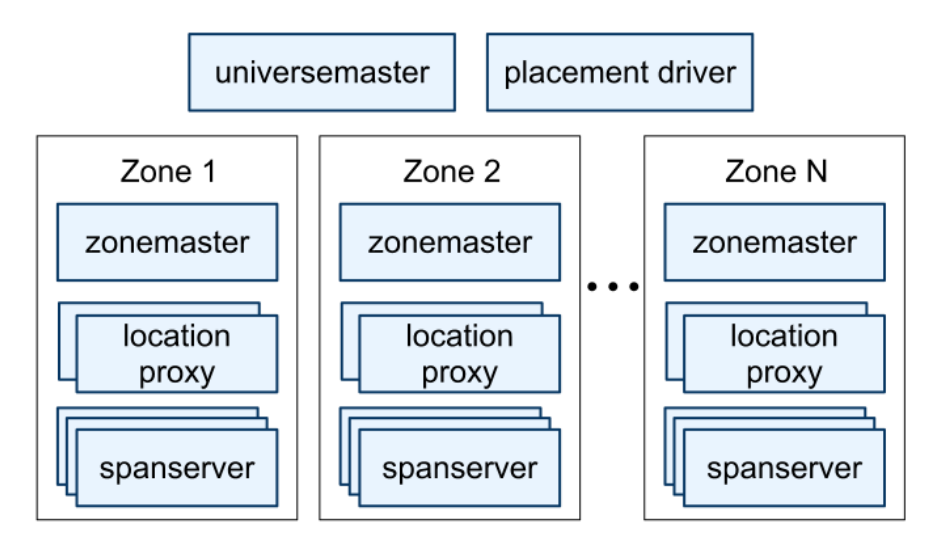
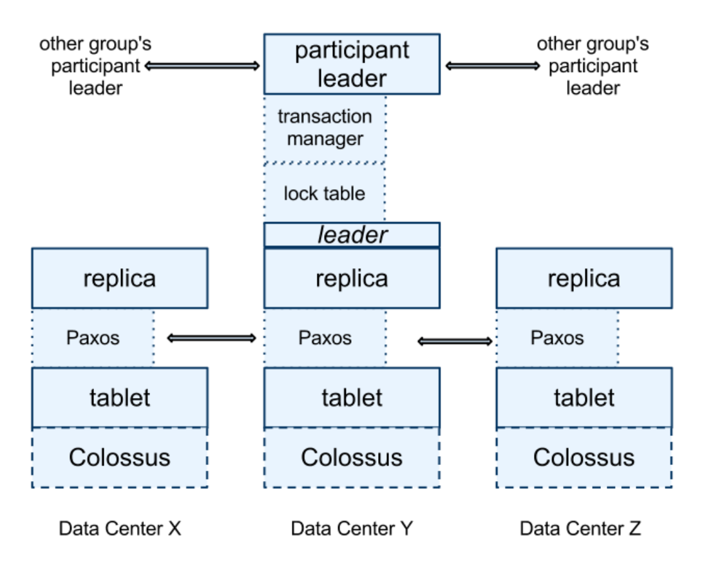
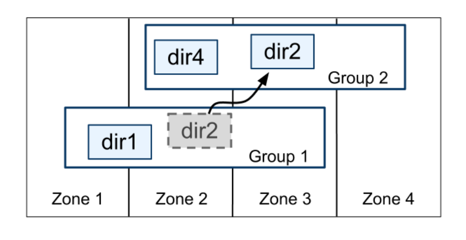
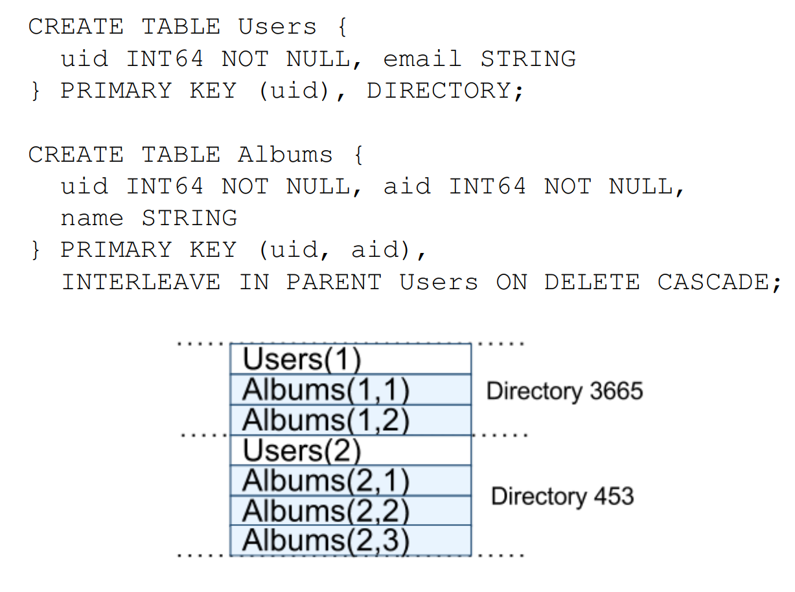
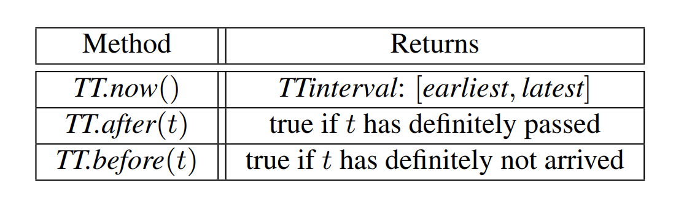

# Spanner: Google's Globally-Distributed Database 

## Abstract 

**Spanner** 是 Google 研发的一款具备高度可扩展性、支持多版本并发控制、全球分布式部署以及同步复制特性的数据库系统。作为业界首个实现全球化规模数据分布的系统，它率先提供了具备**“外部一致性”（External Consistency）**的分布式事务支持。本文将深入探讨 **Spanner** 的系统架构、功能特性，以及各项设计决策背后的核心逻辑。此外，本文还将介绍一种能够量化并显式暴露“时钟不确定性”的新型时间 API。该 API 及其具体实现对于支撑**外部一致性**以及多项强大的系统特性至关重要，包括：全系统范围内的**历史版本非阻塞读取**、**无锁只读事务**，以及**原子级模式变更**（Schema Changes）。

## 1. Introduction

**Spanner** 是 Google 自主研发、构建并部署的一款具备高可扩展性的全球分布式数据库。从最高层的抽象视角来看，其本质是一个将数据分片（Sharding）存储于分布在全球各地的、基于 **Paxos** 状态机集群的数据库系统。系统利用副本复制（Replication）技术来保障全球可用性并实现数据的地理局部性（Geographic Locality）。同时，客户端能够在不同副本之间实现自动的**故障转移（Failover）**。随着数据量或服务器规模的变化，Spanner 会自动在机器间对数据进行重新分片。此外，为了实现负载均衡并应对系统故障，它还支持跨机器、甚至跨数据中心的数据自动迁移。在设计规格上，Spanner 旨在支撑跨数百个数据中心、数百万台服务器集群以及数万亿行数据记录的超大规模应用场景。

通过在洲内甚至跨洲进行数据复制，应用程序可以利用 Spanner 实现极高的可用性，即便在面对大范围自然灾害时依然能保持业务连续。Spanner 的首个用户是 **F1**（这是一个经过重构的 Google 广告后端系统）。F1 在美国全境部署了五个副本。相比之下，大多数其他应用可能会选择在同一个地理区域内的 3 到 5 个数据中心之间进行数据复制，并确保这些中心具备相对独立的故障模式（Failure Modes）。也就是说，在能够承受 1 到 2 个数据中心级故障的前提下，大多数应用在权衡“极高可用性”与“低延迟”时，往往会倾向于优先保证**低延迟**。

**Spanner** 的核心任务是**管理跨数据中心的复制数据**。与此同时，我们也在分布式系统基础设施之上，投入了大量精力来设计并实现关键的数据库特性。尽管 Bigtable 在许多项目中得到了广泛应用，但我们也持续收到用户的反馈，指出 Bigtable 在某些应用场景下存在局向性，特别是对于那些拥有**复杂且不断演进的模式（Schema）**，或是在**广域复制（Wide-area Replication）环境下仍要求强一致性**的应用。Google 内部的许多应用此前选择了 **Megastore**，主要是看重其**半关系型数据模型**以及对**同步复制**的支持，尽管其写入吞吐量相对较低。受此影响，Spanner 已从最初类似 Bigtable 的“带版本键值存储”演进为一种**时态多版本数据库（Temporal Multi-version Database）**。在 Spanner 中，数据存储在结构化的半关系型表中。数据具备多版本特性，且每个版本都会根据其**提交时间（Commit Time）**自动打上时间戳。旧版本数据由可配置的垃圾回收策略进行管理，应用程序亦可读取历史时间点的数据。此外，Spanner 还支持**通用事务处理**，并提供了一种基于 SQL 的查询语言。

**副本配置（Replication Configurations）**进行细粒度的动态控制。具体来讲，就是应用可以通过指定约束条件来灵活管理：哪些数据中心存放哪些数据、数据与用户间的地理距离（以控制读取延迟）、副本之间的物理间距（以控制写入延迟），以及副本的维护数量（以兼顾持久性、可用性和读取性能）。此外，系统支持在数据中心之间透明且动态地迁移数据，从而实现跨数据中心的资源负载均衡。其次，Spanner 实现了分布式数据库领域中极难攻克的两大特性：

1. 它提供了具备**外部一致性（External Consistency）的读写操作；**
2. **它支持在全库范围内实现基于特定时间戳的全局一致性读取**。正是由于具备了这些特性，Spanner 才能够在全球规模下，即便在事务并发执行的过程中，依然能够高效支撑一致性备份、一致性 MapReduce 任务执行以及原子级模式更新。

上述特性之所以能够实现，归功于 Spanner 的一项核心机制：尽管事务可能跨地域分布，系统仍能为其分配具有**全局意义的提交时间戳（Globally-meaningful commit timestamps）**。这些时间戳真实地反映了事务的**串行化顺序（Serialization order）**。此外，该串行化顺序还满足**外部一致性（External Consistency）**，亦即**线性一致性（Linearizability）**：若事务 $T_1$ 在事务 $T_2$ 启动之前已完成提交，则 $T_1$ 的提交时间戳必然早于（小于）$T_2$ 的提交时间戳。Spanner 是业界首个在全球规模下提供此类强一致性保证的系统。

支撑上述特性的核心技术在于一种全新的 **TrueTime API** 及其具体实现。该 API 能够直接显式地表示**“时钟不确定性”**。而 Spanner 时间戳所能提供的一致性保证，则直接取决于底层实现所能限定的误差边界。若时钟不确定性区间较大，Spanner 将会采取降速策略，以**“静默等待”**该不确定性的消解。Google 的集群管理软件提供了 TrueTime API 的具体实现方案，该方案通过引入 GPS 和原子钟等多种现代时钟参考源，成功将不确定性控制在极小范围内（通常低于 10 毫秒）。

**第 2 节** 介绍了 Spanner 的实现架构、功能特性，以及在系统设计中所涉及的各项工程决策。**第 3 节** 详细阐述了全新的 TrueTime API，并对其底层实现方案进行了简要说明。**第 4 节** 探讨了 Spanner 如何通过 TrueTime 技术来实现具备外部一致性的分布式事务、无锁只读事务以及原子级模式更新。**第 5 节** 给出了关于 Spanner 性能表现及 TrueTime 运行行为的基准测试数据，并分享了 F1 系统的实际应用经验。最后，**第 6、7、8 节** 分别涵盖了相关工作、未来研究方向以及全文总结。

## 2. Implementation

本节将介绍 Spanner 实现的整体结构及其背后的设计动因。随后，我们将说明 **directory（目录）抽象**：它用于管理副本放置与数据本地性，同时也是数据迁移的基本单位。最后，本节还将介绍我们的数据模型，解释为什么 Spanner 采用的是类似**关系型数据库**而非**键值存储**的形态，以及应用程序如何对数据本地性进行控制。

一次 Spanner 部署被称为一个 **universe**。鉴于 Spanner 以全局范围管理数据，实际运行中的 universe 数量通常很少。目前，我们运行着三类 universe：

+ 一个测试/试验 universe
+ 一个开发/生产混合 universe
+ 一个仅用于生产的 universe。

Spanner 被组织为一组 **zone（区）**。其中，每个 zone 大致可类比为一组 Bigtable 服务器部署。Zone 是管理部署的基本单位，同时也是数据可进行复制的地理位置单位。随着新的数据中心投入使用，或旧的数据中心下线，运行中的系统可以相应地增加或移除 zone。Zone 还是物理隔离的基本单位。例如，在同一个数据中心中可以设置一个或多个 zone；当不同应用的数据需要在同一数据中心内划分到不同服务器集合上时，就可以采用这种方式。

图 1
	

图 1 展示了 Spanner 部署 Universe 中的服务器构成。一个**Zone**包含一个 zonemaster 以及数百至数千个 spanserver。前者负责将数据分配给各个 spanserver，而后者则直接为客户端提供数据读写服务。客户端通过各区域设置的**位置代理（Location Proxies）**来定位负责其目标数据的 spanserver。目前，**全局主节点（Universe Master）**与**放置驱动（Placement Driver）**均采用单例（Singleton）设计。其中，universe master 主要充当控制台角色，显示所有区域的状态信息以供交互式调试；placement driver 则负责在分钟级的时间尺度上处理跨区域的数据自动迁移，它会定期与 spanserver 通信，识别并迁移相关数据，以满足更新后的副本约束或实现负载均衡。限于篇幅，本文仅对 spanserver 展开详细论述。

### 2.1 Spanserver Software Stack

本节将重点介绍 **spanserver** 的实现细节，讲述我们如何在基于 Bigtable 的架构之上，通过分层设计（Layered）引入了**副本复制**与**分布式事务支持**。其软件栈（Software Stack）如图 2 所示。在架构底层，每个 spanserver 负责管理 100 到 1000 个名为 **tablet** 的数据结构实例。Spanner 中的 tablet 与 Bigtable 的 tablet 抽象高度相似，其本质是实现了一组如下形式的映射集合：
$$
(key:\text{string},\ timestamp:\text{int64}) \rightarrow \text{string}
$$

图 2：Spanserver software stack
	

与 Bigtable 不同，Spanner 会为数据分配时间戳，这一关键特性使其更趋向于**多版本数据库（Multi-version Database）**，而非简单的键值存储（Key-value Store）。Tablet 的状态信息存储在一组类 B 树文件以及**预写日志（Write-ahead Log, WAL）**中，所有这些文件均持久化于名为 **Colossus** 的分布式文件系统之上（该系统是 Google File System 的继任者）。

为了支持副本复制，每个 **spanserver** 会在每个 **tablet** 之上实现一个单一的 **Paxos 状态机**。（在 Spanner 的早期版本中，曾尝试在每个 tablet 上支持多个 Paxos 状态机以实现更灵活的复制配置，但由于设计过于复杂，我们最终放弃了该方案。）每个状态机均将其元数据与日志存储在对应的 tablet 中。我们的 Paxos 实现支持“长效 Leader”（Long-lived Leaders）机制，并引入了基于时间的 **Leader 租约（Leader Leases）**，租约长度默认为 10 秒。在目前的 Spanner 实现中，每次 Paxos 写入都会记录两次日志：一次记录在 tablet 的日志中，另一次则记录在 Paxos 日志中。这一设计纯属权宜之计，我们未来可能会对此进行优化。此外，我们的 Paxos 实现采用了**流水线（Pipelined）**技术，旨在提升广域网（WAN）延迟环境下的系统吞吐量；即便如此，Paxos 仍会确保写入操作的按序应用（这一特性是第 4 节讨论的基础）。

**Paxos 状态机**的核心作用是实现一个具备强一致性副本的映射集合（Bag of mappings）。每个副本的键值映射状态均持久化于其对应的 **tablet** 中。在操作流程上，**写操作**必须由 **Leader（主节点）** 发起 Paxos 协议以达成共识；而**读操作**则具有更高的灵活性，可以直接从任何数据版本“足够新”（Sufficiently up-to-date）的副本底层 tablet 中读取状态。这一组共同维护同一数据分片的副本合称为一个 **Paxos 组（Paxos group）**。

在每个担任 Leader 角色的副本中，spanserver 都会实现一个**锁表（Lock Table）**以执行并发控制。该锁表维护了**二阶段锁（Two-phase Locking, 2PL）**的状态信息：它负责将特定的键范围（Key Ranges）映射到相应的锁定状态。（注：维持长效 Paxos Leader 对高效管理锁表至关重要。）在 Bigtable 和 Spanner 的设计过程中，我们都针对**长事务**（例如耗时通常在分钟级的报表生成任务）进行了优化。因为在存在数据冲突的情况下，这类长事务在**乐观并发控制（Optimistic Concurrency Control, OCC）**机制下的性能表现通常不尽如人意。在具体执行中，诸如事务性读取等需要同步的操作必须先在锁表中获取锁，而其他操作则可以绕过锁表直接执行。

图 3：  Directories are the unit of data movement between Paxos groups

在每个担任 Leader 角色的副本中，spanserver 还会实现一个**事务管理器（Transaction Manager）**以支持分布式事务。该事务管理器被用于实现“**参与者主节点**”（Participant Leader），而同组内的其他副本则被称为“**参与者从节点**”（Participant Slaves）。若事务仅涉及单个 Paxos 组（大多数事务均属此类），则可以绕过事务管理器，因为锁表与 Paxos 协议的结合已足以提供完备的事务性保证。然而，若事务涉及多个 Paxos 组，这些组的 Leader 将协同执行**二阶段提交（Two-phase Commit, 2PC）**。在这些参与组中，会有一个组被选定为**协调组（Coordinator）**。该组的参与者主节点被称为“**协调者主节点**”（Coordinator Leader），其从节点则被称为“**协调者从节点**”（Coordinator Slaves）。每个事务管理器的状态均持久化于底层的 Paxos 组中（因此也具备副本冗余）。

### 2.2 Directories and Placement

在底层的键值映射集合之上，Spanner 的实现还支持一种名为 **directory（目录）** 的分桶（Bucketing）抽象。所谓 directory，是指共享同一个公共前缀的一组连续键（Contiguous Keys）的集合。（注：更准确的称谓或许应该是“桶”。）我们将在第 2.3 节中进一步阐述该前缀的来源。通过对 directory 的支持，应用程序可以通过精细化地设计键（Key），从而实现对数据**局部性（Locality）**的有效控制。

**Directory（目录）** 是数据分布（Data Placement）的基本单元。同一目录下的所有数据均共享相同的副本配置。如图 3 所示，当数据在不同 **Paxos 组**之间进行迁移时，其操作粒度细化至每一个目录。

Spanner 触发目录迁移的典型场景包括：

1. **负载分担**：旨在减轻特定 Paxos 组的过重负载。
2. **协同聚簇**：将频繁被共同访问的多个目录整合至同一分组内，以优化访问效率。
3. **就近访问**：将目录迁移至地理位置更靠近访问者的分组，从而降低延迟。

值得注意的是，目录迁移支持在线操作，即在迁移过程中客户端的各项请求仍可正常进行。通常情况下，一个 50MB 规模的目录仅需数秒即可完成迁移。

由于一个 **Paxos 组**可以包含多个目录，这使得 Spanner 中的 **tablet** 概念与 Bigtable 存在显著差异。前者（Spanner tablet）不再局限于行空间中单一且在字典序上连续的分区。相反，Spanner 的 tablet 演变为一种容器，能够封装行空间中的多个分区。我们做出这一设计决策，是为了能够将那些频繁被共同访问的多个目录**协同放置（Colocate）**在同一存储单元中。

**Movedir** 是用于在 Paxos 组之间迁移目录的后台任务。由于 Spanner 尚不支持 Paxos 协议内的配置变更（In-Paxos configuration changes），Movedir 也被用于向 Paxos 组添加或移除副本。在实现细节上，为了避免大规模数据迁移（Bulky data move）导致正在进行的读写操作被阻塞，Movedir 并没有被设计为单一的事务。相反，Movedir 会先注册迁移启动状态并在后台静默搬运数据。当绝大部分数据迁移完成、仅剩**极少量名义数据（Nominal amount）**时，它会通过一个原子事务来迁移这部分剩余数据，并同步更新涉及的两个 Paxos 组的元数据。

**Directory（目录）** 也是应用程序指定其**地理副本属性**（简称**数据分布策略**，Placement）的最小单位。我们的分布规范语言（Placement-specification language）在设计上实现了副本配置管理权限的**职责分离**。其中，系统管理员管控两个维度：副本的数量与类型，以及这些副本的具体地理位置。他们基于这两个维度创建一系列具名的配置预设（例如：“北美区，5 副本，包含 1 个见证节点”）。随后，应用程序可以通过为特定的数据库或单个目录标记（Tagging）不同的预设组合，来灵活控制数据的副本策略。例如，应用程序可以将每个终端用户的数据存储在独立的目录中，从而实现将用户 A 的数据在欧洲备份 3 个副本，而将用户 B 的数据在北美备份 5 个副本。

为了使表述更为清晰，我们此前对相关机制做了简化处理。事实上，当单个目录（Directory）的规模过大时，Spanner 会将其进一步划分为多个**分片（Fragments）**。这些分片可以分布在不同的 Paxos 组中（相应地由不同的服务器负责处理）。因此，**Movedir** 任务在各 Paxos 组之间实际迁移的物理单位是这些分片，而非完整的目录。

### 2.3 Data Model

Spanner 向应用程序提供了一系列核心的数据特性：一套基于**模式化半关系表**（schematized semi-relational tables）的数据模型、一种**查询语言**以及**通用事务**支持。

转向支持这些特性的决策是由多种因素驱动的。其中，支持模式化半关系表和**同步复制**（synchronous replication）的需求，主要受到了 Megastore 普及的影响。尽管 Megastore 的性能相对较低，但 Google 内部至少有 300 个应用在使用它。这是因为 Megastore 的数据模型比 Bigtable 更易于管理，且其支持跨数据中心的同步复制（相比之下，Bigtable 仅支持跨数据中心的**最终一致性**复制）。使用 Megastore 的知名 Google 应用包括 Gmail、Picasa、Calendar、Android Market 以及 AppEngine。此外，鉴于 Dremel 作为交互式数据分析工具的广泛流行，Spanner 对 **SQL 类查询语言**的需求也显而易见。

最后，Bigtable 缺乏**跨行事务**（cross-row transactions）支持引发了开发者的频繁抱怨。Percolator 的诞生在一定程度上就是为了解决这一缺陷。一些学者认为，通用**两阶段提交**（two-phase commit, 2PC）由于会带来性能或可用性问题，其支持成本过于昂贵。然而我们认为，与其让开发者始终在没有事务支持的环境下进行痛苦的规避式编程，不如让他们在性能瓶颈出现时再去处理因过度使用事务而导致的性能问题。此外，在 Paxos 协议之上运行两阶段提交，可以有效缓解其带来的可用性风险。

Spanner 的数据模型并非纯粹的关系模型，其独特之处在于每一行都必须具备“标识名”（names）。更准确地说，每个表都被要求包含一组由一个或多个列组成的**有序主键列**（ordered set of primary-key columns）。正是这一要求，使得 Spanner 在特征上仍表现出**键值存储**（key-value store）的色彩：主键构成了每一行的“名称”，而每个表本质上定义了从主键列到非主键列的映射关系：

$$
\text{Primary-Key Columns} \rightarrow \text{Non-Primary-Key Columns}
$$

在 Spanner 中，只有当一行的主键被赋予了明确的值（即便该值为 `NULL`）时，该行才被视为存在。强制推行这种结构具有重要的工程意义，因为它允许应用程序通过对主键的选择，实现对**数据局部性**（data locality）的精确控制。

图 4：Example Spanner schema for photo metadata, and the interleaving implied by `INTERLEAVE IN
	

图 4 展示了一个 Spanner 模式（Schema）示例，该示例按“用户-相册”维度存储照片的元数据。Spanner 的模式语言与 Megastore 类似，但增加了一项额外要求：客户端必须将每个 Spanner 数据库划分为一个或多个**表层次结构**（hierarchies of tables）。客户端应用通过在数据库模式中使用 `INTERLEAVE IN` 声明来定义这些层次结构。处于层次结构顶层的表被称为**目录表**（directory table）。在目录表中，键为 $K$ 的每一行，连同其后代表中所有以 $K$ 为键前缀（按字典序排列）的行，共同构成了一个**目录**（directory）。此外，`ON DELETE CASCADE` 声明意味着删除目录表中的某一行时，将自动级联删除所有关联的子行。图中还说明了示例数据库的交错布局（interleaved layout）：例如，`Albums(2, 1)` 代表 `Albums` 表中 `user_id` 为 2、`album_id` 为 1 的数据行。

这种通过表交错（Interleaving）形成目录的设计具有核心意义。它允许客户端显式描述多个表之间存在的**局部性关系**（locality relationships），这对于分片式分布式数据库（sharded, distributed database）实现高性能至关重要。若缺乏这一机制，Spanner 将无法获知这些关键的局部性关联，从而难以优化数据分布。

## 3. TrueTime

表 1：TrueTime API. The argument t is of type TTstamp
	

表 1 列出了该 API 的核心方法。TrueTime 显式地将时间表示为一个 **TTinterval**，即一个具有**有界时间不确定性**（bounded time uncertainty）的时间区间。这与标准的时间接口截然不同，后者通常无法为客户端提供任何关于“不确定性”的概念。一个 **TTinterval** 的端点类型为 **TTstamp**。调用 $TT.now()$ 方法会返回一个 **TTinterval**，该区间保证涵盖调用发生的时刻所对应的绝对时间。其时间历元（epoch）类似于采用了**闰秒平滑**（leap-second smearing）技术的 UNIX 时间。我们将**瞬时误差界限**（instantaneous error bound）定义为 $\epsilon$，其值为区间宽度的一半：

$$
\epsilon = \frac{1}{2} (\text{TTinterval.latest} - \text{TTinterval.earliest})
$$
同时，将平均误差界限定义为 $\bar{\epsilon}$。此外，$TT.after()$ 和 $TT.before()$ 方法均是基于 $TT.now()$ 的便捷封装。

我们将事件 $e$ 的绝对时间表示为函数 $t_{abs}(e)$。更严谨地说，TrueTime 保证对于任何一次调用 $tt = TT.now()$，均满足以下不等式：

$$
tt.earliest \le t_{abs}(e_{now}) \le tt.latest
$$
其中，$e_{now}$ 代表该次 API 调用事件。

TrueTime 底层采用 **GPS** 和**原子钟**作为时间基准（Time References）。之所以使用两种不同形式的基准，是因为它们的**故障模式**（failure modes）各不相同。GPS 参考源的脆弱性主要体现在：天线与接收器故障、局部无线电干扰、关联性故障（例如闰秒处理错误、信号欺骗等设计缺陷）以及 GPS 系统性停机。相比之下，原子钟的故障方式与 GPS 及其彼此之间均不相关。但受限于频率误差，原子钟在长时间运行后可能会产生显著的**时间漂移**（drift）。

TrueTime 的具体实现依赖于每个数据中心部署的一组**时间主节点**（time master），以及每台服务器上运行的 **timeslave 守护进程**（timeslave daemon）。在主节点中，绝大多数配置了带有专用天线的 **GPS 接收器**。为了最大限度地降低天线故障、无线电干扰以及信号欺骗（spoofing）的影响，这些主节点在物理位置上保持相互隔离。其余的主节点则配备了原子钟，我们称之为 **Armageddon 主机**。原子钟的造价其实并不昂贵：一台 Armageddon 主机的成本与一台 GPS 主机基本处于同一数量级。所有主节点的时间基准都会定期进行横向对比。此外，每个主节点还会将其参考源的时间演进速率与本地时钟进行交叉验证；一旦发现两者之间存在显著偏差（substantial divergence），该节点将**主动下线**（evicts itself）。在两次同步操作的间隔期间，Armageddon 主机会根据保守估算的最坏情况时钟漂移量，发布一个随时间缓慢增加的**时间不确定性**（time uncertainty）数值。相比之下，GPS 主机发布的不确定性通常始终接近于零。

为了降低因单一主节点错误而导致的系统脆弱性，每个守护进程（Daemon）都会同时轮询多个主节点。这些主节点包括从邻近数据中心选取的 GPS 主节点、来自更远数据中心的 GPS 主节点，以及部分 **Armageddon 主机**。守护进程采用 **Marzullo 算法**（Marzullo’s algorithm）的一种变体来检测并剔除“异常源”（liars），随后将本地机器时钟与这些经校验的正常节点（non-liars）进行同步。此外，为了防止本地时钟故障带来的影响，系统会严格监控机器的运行状态。如果某台机器表现出的**频率偏移**（frequency excursions）超过了根据硬件组件规格和运行环境推导出的“最坏情况界限”，该机器将被判定为故障并执行**下线**（evicted）处理。

在两次同步操作的间隔期间，守护进程发布的时间不确定性会随时间推移缓慢增加。误差界限 $\epsilon$ 是基于保守估算的最坏情况本地时钟漂移（worst-case local clock drift）推导得出的。此外，$\epsilon$ 还取决于时间主节点（time-master）本身的不确定性，以及与主节点通信时产生的网络延迟。在我们的生产环境中，$\epsilon$ 通常表现为时间的**锯齿函数**（sawtooth function）。在每个轮询周期内，其数值大约在 1 到 7 毫秒（ms）之间波动。因此，在绝大多数时间内，平均误差界限满足：

$$
\bar{\epsilon} \approx 4\text{ ms}
$$
目前，守护进程的轮询间隔设定为 30 秒，采用的漂移率设定为 200 微秒/秒（$\mu s/s$）。这两项参数共同构成了锯齿波中 0 到 6 毫秒的增长区间。而基础的 1 毫秒偏移则源自与时间主节点之间的通信延迟。当系统出现故障时，$\epsilon$ 可能会偏离这种锯齿状的正常模式。例如，时间主节点的偶发性不可用会导致整个数据中心范围内的 $\epsilon$ 值升高。同理，服务器过载或网络链路拥塞也可能导致局部性的 $\epsilon$ **突刺**（spikes）。

## 4. Concurrency control

本节详细阐述了如何利用 **TrueTime** 来保障并发控制的相关正确性准则，以及如何基于这些准则来实现诸多核心特性，包括：**外部一致性事务**（externally consistent transactions）、**无锁只读事务**（lock-free read-only transactions）以及**针对过去快照的非阻塞读取**（non-blocking reads in the past）。

得益于这些特性，系统可以提供极强的确定性保障。例如，在特定时间戳 $t$ 执行的一次全库审计读取（audit read），能够且仅能观察到所有截至 $t$ 时刻已提交事务的变更效果。在随后的讨论中，必须严格区分 **Paxos 写入**（Paxos writes，即从 Paxos 协议层面观测到的写入操作）与 **Spanner 客户端写入**。举例而言，两阶段提交（2PC）在“预提交”（prepare）阶段会产生一次 Paxos 写入，但这次操作在 Spanner 客户端层面并没有任何对应的写入行为。

### 4.1 Timestamp Management