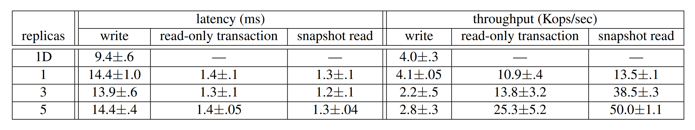
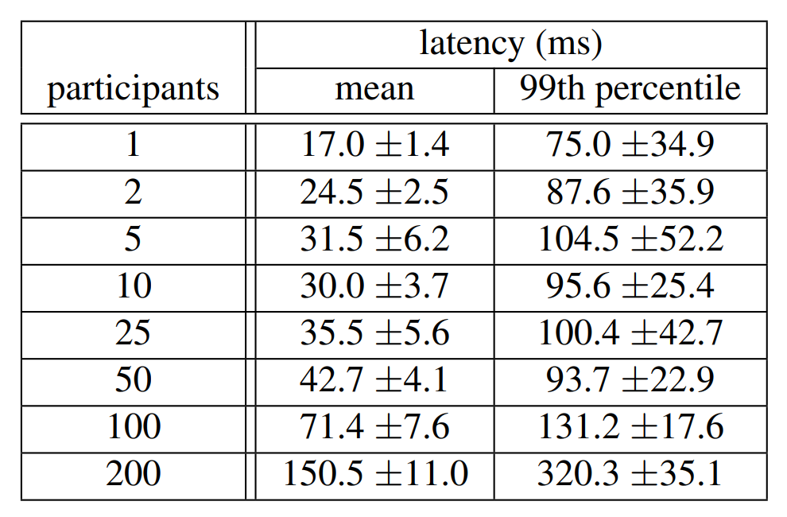
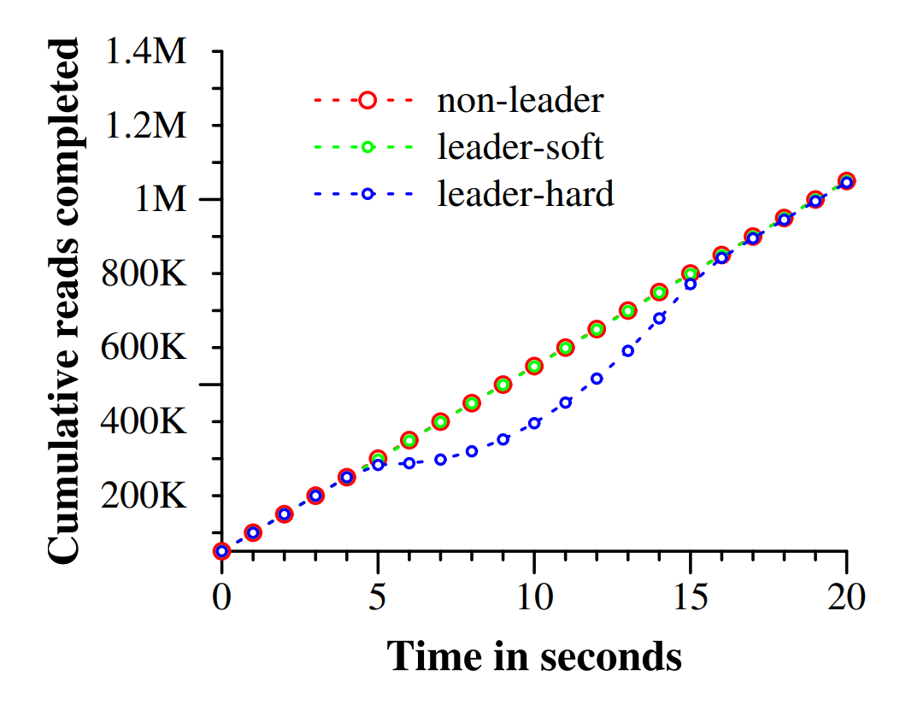
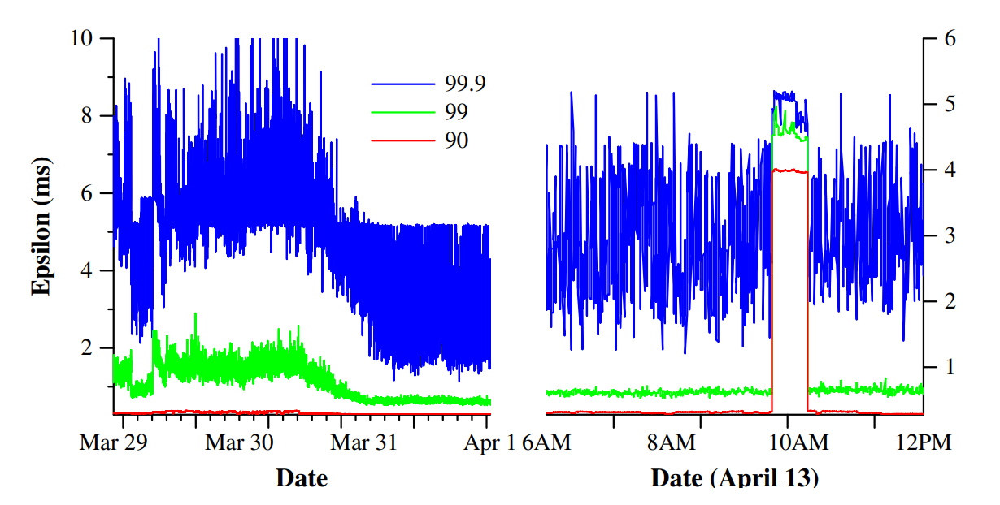
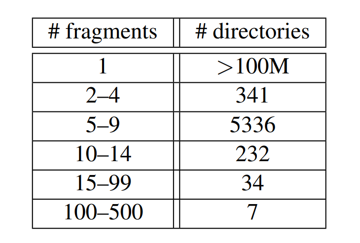
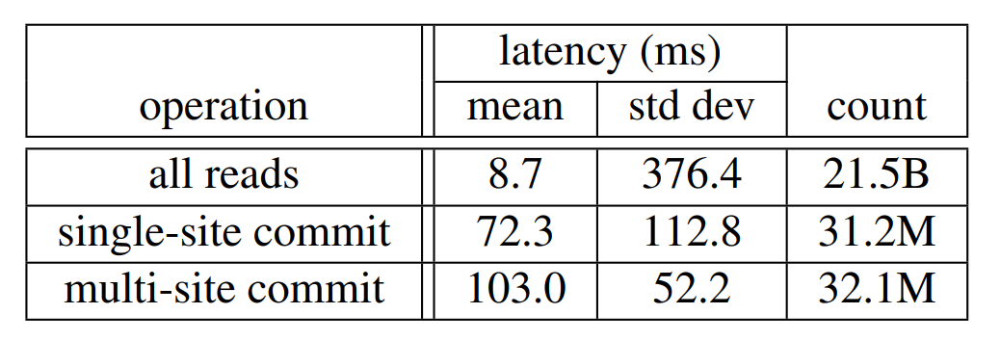

# Spanner: Google's Globally-Distributed Database 

## Abstract 

**Spanner** 是 Google 研发的一款具备高度可扩展性、支持多版本并发控制、全球分布式部署以及同步复制特性的数据库系统。作为业界首个实现全球化规模数据分布的系统，它率先提供了具备**“外部一致性”（External Consistency）**的分布式事务支持。本文将深入探讨 **Spanner** 的系统架构、功能特性，以及各项设计决策背后的核心逻辑。此外，本文还将介绍一种能够量化并显式暴露“时钟不确定性”的新型时间 API。该 API 及其具体实现对于支撑**外部一致性**以及多项强大的系统特性至关重要，包括：全系统范围内的**历史版本非阻塞读取**、**无锁只读事务**，以及**原子级模式变更**（Schema Changes）。

## 1. Introduction

**Spanner** 是 Google 自主研发、构建并部署的一款具备高可扩展性的全球分布式数据库。从最高层的抽象视角来看，其本质是一个将数据分片（Sharding）存储于分布在全球各地的、基于 **Paxos** 状态机集群的数据库系统。系统利用副本复制（Replication）技术来保障全球可用性并实现数据的地理局部性（Geographic Locality）。同时，客户端能够在不同副本之间实现自动的**故障转移（Failover）**。随着数据量或服务器规模的变化，Spanner 会自动在机器间对数据进行重新分片。此外，为了实现负载均衡并应对系统故障，它还支持跨机器、甚至跨数据中心的数据自动迁移。在设计规格上，Spanner 旨在支撑跨数百个数据中心、数百万台服务器集群以及数万亿行数据记录的超大规模应用场景。

通过在洲内甚至跨洲进行数据复制，应用程序可以利用 Spanner 实现极高的可用性，即便在面对大范围自然灾害时依然能保持业务连续。Spanner 的首个用户是 **F1**（这是一个经过重构的 Google 广告后端系统）。F1 在美国全境部署了五个副本。相比之下，大多数其他应用可能会选择在同一个地理区域内的 3 到 5 个数据中心之间进行数据复制，并确保这些中心具备相对独立的故障模式（Failure Modes）。也就是说，在能够承受 1 到 2 个数据中心级故障的前提下，大多数应用在权衡“极高可用性”与“低延迟”时，往往会倾向于优先保证**低延迟**。

**Spanner** 的核心任务是**管理跨数据中心的复制数据**。与此同时，我们也在分布式系统基础设施之上，投入了大量精力来设计并实现关键的数据库特性。尽管 Bigtable 在许多项目中得到了广泛应用，但我们也持续收到用户的反馈，指出 Bigtable 在某些应用场景下存在局向性，特别是对于那些拥有**复杂且不断演进的模式（Schema）**，或是在**广域复制（Wide-area Replication）环境下仍要求强一致性**的应用。Google 内部的许多应用此前选择了 **Megastore**，主要是看重其**半关系型数据模型**以及对**同步复制**的支持，尽管其写入吞吐量相对较低。受此影响，Spanner 已从最初类似 Bigtable 的“带版本键值存储”演进为一种**时态多版本数据库（Temporal Multi-version Database）**。在 Spanner 中，数据存储在结构化的半关系型表中。数据具备多版本特性，且每个版本都会根据其**提交时间（Commit Time）**自动打上时间戳。旧版本数据由可配置的垃圾回收策略进行管理，应用程序亦可读取历史时间点的数据。此外，Spanner 还支持**通用事务处理**，并提供了一种基于 SQL 的查询语言。

**副本配置（Replication Configurations）**进行细粒度的动态控制。具体来讲，就是应用可以通过指定约束条件来灵活管理：哪些数据中心存放哪些数据、数据与用户间的地理距离（以控制读取延迟）、副本之间的物理间距（以控制写入延迟），以及副本的维护数量（以兼顾持久性、可用性和读取性能）。此外，系统支持在数据中心之间透明且动态地迁移数据，从而实现跨数据中心的资源负载均衡。其次，Spanner 实现了分布式数据库领域中极难攻克的两大特性：

1. 它提供了具备**外部一致性（External Consistency）的读写操作；**
2. **它支持在全库范围内实现基于特定时间戳的全局一致性读取**。正是由于具备了这些特性，Spanner 才能够在全球规模下，即便在事务并发执行的过程中，依然能够高效支撑一致性备份、一致性 MapReduce 任务执行以及原子级模式更新。

上述特性之所以能够实现，归功于 Spanner 的一项核心机制：尽管事务可能跨地域分布，系统仍能为其分配具有**全局意义的提交时间戳（Globally-meaningful commit timestamps）**。这些时间戳真实地反映了事务的**串行化顺序（Serialization order）**。此外，该串行化顺序还满足**外部一致性（External Consistency）**，亦即**线性一致性（Linearizability）**：若事务 $T_1$ 在事务 $T_2$ 启动之前已完成提交，则 $T_1$ 的提交时间戳必然早于（小于）$T_2$ 的提交时间戳。Spanner 是业界首个在全球规模下提供此类强一致性保证的系统。

支撑上述特性的核心技术在于一种全新的 **TrueTime API** 及其具体实现。该 API 能够直接显式地表示**“时钟不确定性”**。而 Spanner 时间戳所能提供的一致性保证，则直接取决于底层实现所能限定的误差边界。若时钟不确定性区间较大，Spanner 将会采取降速策略，以**“静默等待”**该不确定性的消解。Google 的集群管理软件提供了 TrueTime API 的具体实现方案，该方案通过引入 GPS 和原子钟等多种现代时钟参考源，成功将不确定性控制在极小范围内（通常低于 10 毫秒）。

**第 2 节** 介绍了 Spanner 的实现架构、功能特性，以及在系统设计中所涉及的各项工程决策。**第 3 节** 详细阐述了全新的 TrueTime API，并对其底层实现方案进行了简要说明。**第 4 节** 探讨了 Spanner 如何通过 TrueTime 技术来实现具备外部一致性的分布式事务、无锁只读事务以及原子级模式更新。**第 5 节** 给出了关于 Spanner 性能表现及 TrueTime 运行行为的基准测试数据，并分享了 F1 系统的实际应用经验。最后，**第 6、7、8 节** 分别涵盖了相关工作、未来研究方向以及全文总结。

## 2. Implementation

本节将介绍 Spanner 实现的整体结构及其背后的设计动因。随后，我们将说明 **directory（目录）抽象**：它用于管理副本放置与数据本地性，同时也是数据迁移的基本单位。最后，本节还将介绍我们的数据模型，解释为什么 Spanner 采用的是类似**关系型数据库**而非**键值存储**的形态，以及应用程序如何对数据本地性进行控制。

一次 Spanner 部署被称为一个 **universe**。鉴于 Spanner 以全局范围管理数据，实际运行中的 universe 数量通常很少。目前，我们运行着三类 universe：

+ 一个测试/试验 universe
+ 一个开发/生产混合 universe
+ 一个仅用于生产的 universe。

Spanner 被组织为一组 **zone（区）**。其中，每个 zone 大致可类比为一组 Bigtable 服务器部署。Zone 是管理部署的基本单位，同时也是数据可进行复制的地理位置单位。随着新的数据中心投入使用，或旧的数据中心下线，运行中的系统可以相应地增加或移除 zone。Zone 还是物理隔离的基本单位。例如，在同一个数据中心中可以设置一个或多个 zone；当不同应用的数据需要在同一数据中心内划分到不同服务器集合上时，就可以采用这种方式。

图 1
	

图 1 展示了 Spanner 部署 Universe 中的服务器构成。一个**Zone**包含一个 zonemaster 以及数百至数千个 spanserver。前者负责将数据分配给各个 spanserver，而后者则直接为客户端提供数据读写服务。客户端通过各区域设置的**位置代理（Location Proxies）**来定位负责其目标数据的 spanserver。目前，**全局主节点（Universe Master）**与**放置驱动（Placement Driver）**均采用单例（Singleton）设计。其中，universe master 主要充当控制台角色，显示所有区域的状态信息以供交互式调试；placement driver 则负责在分钟级的时间尺度上处理跨区域的数据自动迁移，它会定期与 spanserver 通信，识别并迁移相关数据，以满足更新后的副本约束或实现负载均衡。限于篇幅，本文仅对 spanserver 展开详细论述。

### 2.1 Spanserver Software Stack

本节将重点介绍 **spanserver** 的实现细节，讲述我们如何在基于 Bigtable 的架构之上，通过分层设计（Layered）引入了**副本复制**与**分布式事务支持**。其软件栈（Software Stack）如图 2 所示。在架构底层，每个 spanserver 负责管理 100 到 1000 个名为 **tablet** 的数据结构实例。Spanner 中的 tablet 与 Bigtable 的 tablet 抽象高度相似，其本质是实现了一组如下形式的映射集合：
$$
(key:\text{string},\ timestamp:\text{int64}) \rightarrow \text{string}
$$

图 2：Spanserver software stack
	

与 Bigtable 不同，Spanner 会为数据分配时间戳，这一关键特性使其更趋向于**多版本数据库（Multi-version Database）**，而非简单的键值存储（Key-value Store）。Tablet 的状态信息存储在一组类 B 树文件以及**预写日志（Write-ahead Log, WAL）**中，所有这些文件均持久化于名为 **Colossus** 的分布式文件系统之上（该系统是 Google File System 的继任者）。

为了支持副本复制，每个 **spanserver** 会在每个 **tablet** 之上实现一个单一的 **Paxos 状态机**。（在 Spanner 的早期版本中，曾尝试在每个 tablet 上支持多个 Paxos 状态机以实现更灵活的复制配置，但由于设计过于复杂，我们最终放弃了该方案。）每个状态机均将其元数据与日志存储在对应的 tablet 中。我们的 Paxos 实现支持“长效 Leader”（Long-lived Leaders）机制，并引入了基于时间的 **Leader 租约（Leader Leases）**，租约长度默认为 10 秒。在目前的 Spanner 实现中，每次 Paxos 写入都会记录两次日志：一次记录在 tablet 的日志中，另一次则记录在 Paxos 日志中。这一设计纯属权宜之计，我们未来可能会对此进行优化。此外，我们的 Paxos 实现采用了**流水线（Pipelined）**技术，旨在提升广域网（WAN）延迟环境下的系统吞吐量；即便如此，Paxos 仍会确保写入操作的按序应用（这一特性是第 4 节讨论的基础）。

**Paxos 状态机**的核心作用是实现一个具备强一致性副本的映射集合（Bag of mappings）。每个副本的键值映射状态均持久化于其对应的 **tablet** 中。在操作流程上，**写操作**必须由 **Leader（主节点）** 发起 Paxos 协议以达成共识；而**读操作**则具有更高的灵活性，可以直接从任何数据版本“足够新”（Sufficiently up-to-date）的副本底层 tablet 中读取状态。这一组共同维护同一数据分片的副本合称为一个 **Paxos 组（Paxos group）**。

在每个担任 Leader 角色的副本中，spanserver 都会实现一个**锁表（Lock Table）**以执行并发控制。该锁表维护了**二阶段锁（Two-phase Locking, 2PL）**的状态信息：它负责将特定的键范围（Key Ranges）映射到相应的锁定状态。（注：维持长效 Paxos Leader 对高效管理锁表至关重要。）在 Bigtable 和 Spanner 的设计过程中，我们都针对**长事务**（例如耗时通常在分钟级的报表生成任务）进行了优化。因为在存在数据冲突的情况下，这类长事务在**乐观并发控制（Optimistic Concurrency Control, OCC）**机制下的性能表现通常不尽如人意。在具体执行中，诸如事务性读取等需要同步的操作必须先在锁表中获取锁，而其他操作则可以绕过锁表直接执行。

图 3：  Directories are the unit of data movement between Paxos groups

在每个担任 Leader 角色的副本中，spanserver 还会实现一个**事务管理器（Transaction Manager）**以支持分布式事务。该事务管理器被用于实现“**参与者主节点**”（Participant Leader），而同组内的其他副本则被称为“**参与者从节点**”（Participant Slaves）。若事务仅涉及单个 Paxos 组（大多数事务均属此类），则可以绕过事务管理器，因为锁表与 Paxos 协议的结合已足以提供完备的事务性保证。然而，若事务涉及多个 Paxos 组，这些组的 Leader 将协同执行**二阶段提交（Two-phase Commit, 2PC）**。在这些参与组中，会有一个组被选定为**协调组（Coordinator）**。该组的参与者主节点被称为“**协调者主节点**”（Coordinator Leader），其从节点则被称为“**协调者从节点**”（Coordinator Slaves）。每个事务管理器的状态均持久化于底层的 Paxos 组中（因此也具备副本冗余）。

### 2.2 Directories and Placement

在底层的键值映射集合之上，Spanner 的实现还支持一种名为 **directory（目录）** 的分桶（Bucketing）抽象。所谓 directory，是指共享同一个公共前缀的一组连续键（Contiguous Keys）的集合。（注：更准确的称谓或许应该是“桶”。）我们将在第 2.3 节中进一步阐述该前缀的来源。通过对 directory 的支持，应用程序可以通过精细化地设计键（Key），从而实现对数据**局部性（Locality）**的有效控制。

**Directory（目录）** 是数据分布（Data Placement）的基本单元。同一目录下的所有数据均共享相同的副本配置。如图 3 所示，当数据在不同 **Paxos 组**之间进行迁移时，其操作粒度细化至每一个目录。

Spanner 触发目录迁移的典型场景包括：

1. **负载分担**：旨在减轻特定 Paxos 组的过重负载。
2. **协同聚簇**：将频繁被共同访问的多个目录整合至同一分组内，以优化访问效率。
3. **就近访问**：将目录迁移至地理位置更靠近访问者的分组，从而降低延迟。

值得注意的是，目录迁移支持在线操作，即在迁移过程中客户端的各项请求仍可正常进行。通常情况下，一个 50MB 规模的目录仅需数秒即可完成迁移。

由于一个 **Paxos 组**可以包含多个目录，这使得 Spanner 中的 **tablet** 概念与 Bigtable 存在显著差异。前者（Spanner tablet）不再局限于行空间中单一且在字典序上连续的分区。相反，Spanner 的 tablet 演变为一种容器，能够封装行空间中的多个分区。我们做出这一设计决策，是为了能够将那些频繁被共同访问的多个目录**协同放置（Colocate）**在同一存储单元中。

**Movedir** 是用于在 Paxos 组之间迁移目录的后台任务。由于 Spanner 尚不支持 Paxos 协议内的配置变更（In-Paxos configuration changes），Movedir 也被用于向 Paxos 组添加或移除副本。在实现细节上，为了避免大规模数据迁移（Bulky data move）导致正在进行的读写操作被阻塞，Movedir 并没有被设计为单一的事务。相反，Movedir 会先注册迁移启动状态并在后台静默搬运数据。当绝大部分数据迁移完成、仅剩**极少量名义数据（Nominal amount）**时，它会通过一个原子事务来迁移这部分剩余数据，并同步更新涉及的两个 Paxos 组的元数据。

**Directory（目录）** 也是应用程序指定其**地理副本属性**（简称**数据分布策略**，Placement）的最小单位。我们的分布规范语言（Placement-specification language）在设计上实现了副本配置管理权限的**职责分离**。其中，系统管理员管控两个维度：副本的数量与类型，以及这些副本的具体地理位置。他们基于这两个维度创建一系列具名的配置预设（例如：“北美区，5 副本，包含 1 个见证节点”）。随后，应用程序可以通过为特定的数据库或单个目录标记（Tagging）不同的预设组合，来灵活控制数据的副本策略。例如，应用程序可以将每个终端用户的数据存储在独立的目录中，从而实现将用户 A 的数据在欧洲备份 3 个副本，而将用户 B 的数据在北美备份 5 个副本。

为了使表述更为清晰，我们此前对相关机制做了简化处理。事实上，当单个目录（Directory）的规模过大时，Spanner 会将其进一步划分为多个**分片（Fragments）**。这些分片可以分布在不同的 Paxos 组中（相应地由不同的服务器负责处理）。因此，**Movedir** 任务在各 Paxos 组之间实际迁移的物理单位是这些分片，而非完整的目录。

### 2.3 Data Model

Spanner 向应用程序提供了一系列核心的数据特性：一套基于**模式化半关系表**（schematized semi-relational tables）的数据模型、一种**查询语言**以及**通用事务**支持。

转向支持这些特性的决策是由多种因素驱动的。其中，支持模式化半关系表和**同步复制**（synchronous replication）的需求，主要受到了 Megastore 普及的影响。尽管 Megastore 的性能相对较低，但 Google 内部至少有 300 个应用在使用它。这是因为 Megastore 的数据模型比 Bigtable 更易于管理，且其支持跨数据中心的同步复制（相比之下，Bigtable 仅支持跨数据中心的**最终一致性**复制）。使用 Megastore 的知名 Google 应用包括 Gmail、Picasa、Calendar、Android Market 以及 AppEngine。此外，鉴于 Dremel 作为交互式数据分析工具的广泛流行，Spanner 对 **SQL 类查询语言**的需求也显而易见。

最后，Bigtable 缺乏**跨行事务**（cross-row transactions）支持引发了开发者的频繁抱怨。Percolator 的诞生在一定程度上就是为了解决这一缺陷。一些学者认为，通用**两阶段提交**（two-phase commit, 2PC）由于会带来性能或可用性问题，其支持成本过于昂贵。然而我们认为，与其让开发者始终在没有事务支持的环境下进行痛苦的规避式编程，不如让他们在性能瓶颈出现时再去处理因过度使用事务而导致的性能问题。此外，在 Paxos 协议之上运行两阶段提交，可以有效缓解其带来的可用性风险。

Spanner 的数据模型并非纯粹的关系模型，其独特之处在于每一行都必须具备“标识名”（names）。更准确地说，每个表都被要求包含一组由一个或多个列组成的**有序主键列**（ordered set of primary-key columns）。正是这一要求，使得 Spanner 在特征上仍表现出**键值存储**（key-value store）的色彩：主键构成了每一行的“名称”，而每个表本质上定义了从主键列到非主键列的映射关系：

$$
\text{Primary-Key Columns} \rightarrow \text{Non-Primary-Key Columns}
$$

在 Spanner 中，只有当一行的主键被赋予了明确的值（即便该值为 `NULL`）时，该行才被视为存在。强制推行这种结构具有重要的工程意义，因为它允许应用程序通过对主键的选择，实现对**数据局部性**（data locality）的精确控制。

图 4：Example Spanner schema for photo metadata, and the interleaving implied by `INTERLEAVE IN
	

图 4 展示了一个 Spanner 模式（Schema）示例，该示例按“用户-相册”维度存储照片的元数据。Spanner 的模式语言与 Megastore 类似，但增加了一项额外要求：客户端必须将每个 Spanner 数据库划分为一个或多个**表层次结构**（hierarchies of tables）。客户端应用通过在数据库模式中使用 `INTERLEAVE IN` 声明来定义这些层次结构。处于层次结构顶层的表被称为**目录表**（directory table）。在目录表中，键为 $K$ 的每一行，连同其后代表中所有以 $K$ 为键前缀（按字典序排列）的行，共同构成了一个**目录**（directory）。此外，`ON DELETE CASCADE` 声明意味着删除目录表中的某一行时，将自动级联删除所有关联的子行。图中还说明了示例数据库的交错布局（interleaved layout）：例如，`Albums(2, 1)` 代表 `Albums` 表中 `user_id` 为 2、`album_id` 为 1 的数据行。

这种通过表交错（Interleaving）形成目录的设计具有核心意义。它允许客户端显式描述多个表之间存在的**局部性关系**（locality relationships），这对于分片式分布式数据库（sharded, distributed database）实现高性能至关重要。若缺乏这一机制，Spanner 将无法获知这些关键的局部性关联，从而难以优化数据分布。

## 3. TrueTime

表 1：TrueTime API. The argument t is of type TTstamp
	

表 1 列出了该 API 的核心方法。TrueTime 显式地将时间表示为一个 **TTinterval**，即一个具有**有界时间不确定性**（bounded time uncertainty）的时间区间。这与标准的时间接口截然不同，后者通常无法为客户端提供任何关于“不确定性”的概念。一个 **TTinterval** 的端点类型为 **TTstamp**。调用 $TT.now()$ 方法会返回一个 **TTinterval**，该区间保证涵盖调用发生的时刻所对应的绝对时间。其时间历元（epoch）类似于采用了**闰秒平滑**（leap-second smearing）技术的 UNIX 时间。我们将**瞬时误差界限**（instantaneous error bound）定义为 $\epsilon$，其值为区间宽度的一半：

$$
\epsilon = \frac{1}{2} (\text{TTinterval.latest} - \text{TTinterval.earliest})
$$
同时，将平均误差界限定义为 $\bar{\epsilon}$。此外，$TT.after()$ 和 $TT.before()$ 方法均是基于 $TT.now()$ 的便捷封装。

我们将事件 $e$ 的绝对时间表示为函数 $t_{abs}(e)$。更严谨地说，TrueTime 保证对于任何一次调用 $tt = TT.now()$，均满足以下不等式：

$$
tt.earliest \le t_{abs}(e_{now}) \le tt.latest
$$
其中，$e_{now}$ 代表该次 API 调用事件。

TrueTime 底层采用 **GPS** 和**原子钟**作为时间基准（Time References）。之所以使用两种不同形式的基准，是因为它们的**故障模式**（failure modes）各不相同。GPS 参考源的脆弱性主要体现在：天线与接收器故障、局部无线电干扰、关联性故障（例如闰秒处理错误、信号欺骗等设计缺陷）以及 GPS 系统性停机。相比之下，原子钟的故障方式与 GPS 及其彼此之间均不相关。但受限于频率误差，原子钟在长时间运行后可能会产生显著的**时间漂移**（drift）。

TrueTime 的具体实现依赖于每个数据中心部署的一组**时间主节点**（time master），以及每台服务器上运行的 **timeslave 守护进程**（timeslave daemon）。在主节点中，绝大多数配置了带有专用天线的 **GPS 接收器**。为了最大限度地降低天线故障、无线电干扰以及信号欺骗（spoofing）的影响，这些主节点在物理位置上保持相互隔离。其余的主节点则配备了原子钟，我们称之为 **Armageddon 主机**。原子钟的造价其实并不昂贵：一台 Armageddon 主机的成本与一台 GPS 主机基本处于同一数量级。所有主节点的时间基准都会定期进行横向对比。此外，每个主节点还会将其参考源的时间演进速率与本地时钟进行交叉验证；一旦发现两者之间存在显著偏差（substantial divergence），该节点将**主动下线**（evicts itself）。在两次同步操作的间隔期间，Armageddon 主机会根据保守估算的最坏情况时钟漂移量，发布一个随时间缓慢增加的**时间不确定性**（time uncertainty）数值。相比之下，GPS 主机发布的不确定性通常始终接近于零。

为了降低因单一主节点错误而导致的系统脆弱性，每个守护进程（Daemon）都会同时轮询多个主节点。这些主节点包括从邻近数据中心选取的 GPS 主节点、来自更远数据中心的 GPS 主节点，以及部分 **Armageddon 主机**。守护进程采用 **Marzullo 算法**（Marzullo’s algorithm）的一种变体来检测并剔除“异常源”（liars），随后将本地机器时钟与这些经校验的正常节点（non-liars）进行同步。此外，为了防止本地时钟故障带来的影响，系统会严格监控机器的运行状态。如果某台机器表现出的**频率偏移**（frequency excursions）超过了根据硬件组件规格和运行环境推导出的“最坏情况界限”，该机器将被判定为故障并执行**下线**（evicted）处理。

在两次同步操作的间隔期间，守护进程发布的时间不确定性会随时间推移缓慢增加。误差界限 $\epsilon$ 是基于保守估算的最坏情况本地时钟漂移（worst-case local clock drift）推导得出的。此外，$\epsilon$ 还取决于时间主节点（time-master）本身的不确定性，以及与主节点通信时产生的网络延迟。在我们的生产环境中，$\epsilon$ 通常表现为时间的**锯齿函数**（sawtooth function）。在每个轮询周期内，其数值大约在 1 到 7 毫秒（ms）之间波动。因此，在绝大多数时间内，平均误差界限满足：

$$
\bar{\epsilon} \approx 4\text{ ms}
$$
目前，守护进程的轮询间隔设定为 30 秒，采用的漂移率设定为 200 微秒/秒（$\mu s/s$）。这两项参数共同构成了锯齿波中 0 到 6 毫秒的增长区间。而基础的 1 毫秒偏移则源自与时间主节点之间的通信延迟。当系统出现故障时，$\epsilon$ 可能会偏离这种锯齿状的正常模式。例如，时间主节点的偶发性不可用会导致整个数据中心范围内的 $\epsilon$ 值升高。同理，服务器过载或网络链路拥塞也可能导致局部性的 $\epsilon$ **突刺**（spikes）。

## 4. Concurrency control

本节详细阐述了如何利用 **TrueTime** 来保障并发控制的相关正确性准则，以及如何基于这些准则来实现诸多核心特性，包括：**外部一致性事务**（externally consistent transactions）、**无锁只读事务**（lock-free read-only transactions）以及**针对过去快照的非阻塞读取**（non-blocking reads in the past）。

得益于这些特性，系统可以提供极强的确定性保障。例如，在特定时间戳 $t$ 执行的一次全库审计读取（audit read），能够且仅能观察到所有截至 $t$ 时刻已提交事务的变更效果。在随后的讨论中，必须严格区分 **Paxos 写入**（Paxos writes，即从 Paxos 协议层面观测到的写入操作）与 **Spanner 客户端写入**。举例而言，两阶段提交（2PC）在“预提交”（prepare）阶段会产生一次 Paxos 写入，但这次操作在 Spanner 客户端层面并没有任何对应的写入行为。

### 4.1 Timestamp Management

表 2 列举了 Spanner 所支持的操作类型。在具体实现上，Spanner 支持**读写事务**（read-write transactions）、**只读事务**（read-only transactions，即预声明的快照隔离事务）以及**快照读**（snapshot reads）。对于**独立写**（standalone writes）操作，系统将其封装为读写事务执行；而**非快照独立读**（non-snapshot standalone reads）则被封装为只读事务。上述两类操作均由系统内部自动执行重试逻辑，因此客户端无需自行编写重试循环。

表 2： Types of reads and writes in Spanner, and how they compare
	

**只读事务**是一种兼具快照隔离（snapshot isolation）性能优势的事务类型。此类事务必须**预先声明**（predeclared）不包含任何写操作；它并非简单地等同于一个“恰好没有写操作的读写事务”。在只读事务中，读操作会在系统分配的时间戳上执行且**无需加锁**，因此不会阻塞后续进入的写请求。此外，只读事务的读操作可以在任何数据时效性达标（sufficiently up-to-date）的**副本**（replica）上执行（详见第 4.1.3 节）。

**快照读**是指针对过去某一时间点且无需加锁的读取操作。客户端既可以为快照读指定具体的时间戳，也可以提供一个期望的**陈旧度上限**（staleness bound），交由 Spanner 选取合适的时间戳。无论采取哪种方式，快照读均可在任何数据时效性达标的**副本**（replica）上执行。

对于只读事务和快照读而言，一旦选定了执行时间戳，除非该时间戳对应的数据已被**垃圾回收**（garbage-collected），否则该操作的成功提交是必然的。因此，客户端无需在重试循环中缓存结果。当某台服务器发生故障时，客户端只需复用原有的时间戳和当前的读取位置，即可在另一台服务器上静默地续接查询。

#### 4.1.1 Paxos Leader Leases

Spanner 的 Paxos 实现利用**定时租约**（timed leases）来延长主节点地位（leadership）的有效期（默认为 10 秒）。候选主节点会发送定时**租约投票**（lease votes）请求。在收到**法定人数**（quorum）的租约投票后，该主节点即确认已获得租约。副本在成功执行写操作时会隐式地延长其租约投票，而主节点则会在租约即将到期时主动请求延长投票。

我们将主节点的**租约区间**（lease interval）定义为：起始于主节点发现其获得法定人数租约投票之时，终止于其不再拥有法定人数租约投票（因部分投票已过期）之时。Spanner 依赖于如下**不相交不变性**（disjointness invariant）：对于每个 Paxos 组，任意 Paxos 主节点的租约区间与任何其他主节点的租约区间必须互不相交。附录 A 详细描述了该不变性的强制执行机制。

#### 4.1.2 Assigning Timestamps to RW Transactions

**事务性读写**采用两阶段锁协议（two-phase locking）。因此，系统可以在事务已获取全部锁、但尚未释放任何锁的任意时刻，为其分配时间戳。对于特定事务，Spanner 会将 Paxos 为“代表该事务提交的 Paxos 写操作”所分配的时间戳，作为该事务的最终时间戳。

Spanner 依赖于如下**单调性不变性**（monotonicity invariant）：在每个 Paxos 组内部，Spanner 为 Paxos 写操作分配的时间戳必须保持**单调递增**，即便是在主节点更替的情况下也需满足这一特性。

对于单一主副本（leader replica）而言，实现时间戳单调递增是显而易见的。而在跨主节点的情况下，该不变性是通过**不相交不变性**（disjointness invariant）来强制执行的：主节点必须仅在其租约有效期内分配时间戳。需要注意的是，每当系统分配一个时间戳 $s$ 时，$s_{max}$ 都会被推进至 $s$，以确保不相交性的成立。

$$
s_{max} \leftarrow s
$$
Spanner 还强制执行以下**外部一致性不变性**（external-consistency invariant）：若事务 $T_2$ 的开始发生在事务 $T_1$ 提交之后，那么 $T_2$ 的提交时间戳必须大于 $T_1$ 的提交时间戳。我们将事务 $T_i$ 的“开始事件”与“提交事件”分别定义为 $e_i^{start}$ 和 $e_i^{commit}$，并将事务 $T_i$ 的提交时间戳定义为 $s_i$。该不变性可形式化为：

$$
t_{abs}(e_1^{commit}) < t_{abs}(e_2^{start}) \Rightarrow s_1 < s_2
$$
事务执行与时间戳分配协议遵循两条规则，二者共同确保了上述不变性的成立。在此之前，我们将写事务 $T_i$ 的提交请求到达协调者主节点（coordinator leader）这一事件定义为 $e_i^{server}$。

**起始规则（Start）**：写事务 $T_i$ 的协调者主节点在事件 $e_i^{server}$ 发生后，为其分配一个提交时间戳 $s_i$。该时间戳不小于调用 $TT.now().latest$ 所获得的观测值。需要注意的是，此处不涉及参与者主节点（participant leaders）；第 4.2.1 节将阐述它们如何参与下一条规则的实现。

**提交等待规则（Commit Wait）**：协调者主节点必须确保：在 $TT.after(s_i)$ 为真（即绝对时间确定已超过 $s_i$）之前，客户端无法看到由 $T_i$ 提交的任何数据。提交等待确保了 $s_i$ 严格小于 $T_i$ 的绝对提交时间，即 $s_i < t_{abs}(e_i^{commit})$。提交等待的具体实现详见第 4.2.1 节。

**证明：**
$$
s_1 < t_{abs}(e_1^{commit}) \quad \text{（提交等待规则）}
$$

$$
t_{abs}(e_1^{commit}) < t_{abs}(e_2^{start}) \quad \text{（外部一致性假设）}
$$

$$
t_{abs}(e_2^{start}) \le t_{abs}(e_2^{server}) \quad \text{（因果律）}
$$

$$
t_{abs}(e_2^{server}) \le s_2 \quad \text{（起始规则）}
$$

$$
s_1 < s_2 \quad \text{（传递性）}
$$

#### 4.1.3 Serving Reads at a Timestamp

第 4.1.2 节中描述的**单调性不变性**（monotonicity invariant），使得 Spanner 能够准确判断副本（replica）的状态是否具备足够的**时效性**（up-to-date）以处理读取请求。每个副本都会维护一个被称为**安全时间**（safe time）的变量 $t_{safe}$，它代表了副本数据已达最新状态的最大时间戳。若读取请求的时间戳 $t$ 满足：

$$
t \le t_{safe}
$$
则该副本即可执行此次读取操作。

我们将**安全时间**定义为如下公式：

$$
t_{safe} = \min(t_{safe}^{Paxos}, t_{safe}^{TM})
$$
在此定义中，每个 Paxos 状态机均维护一个安全时间 $t_{safe}^{Paxos}$，而每个事务管理器（Transaction Manager, TM）也各有一个安全时间 $t_{safe}^{TM}$。相比之下，$t_{safe}^{Paxos}$ 的定义更为直观：它是副本已应用的 Paxos 写操作中所携带的最大时间戳。由于时间戳保持单调递增且写操作均按序应用（applied in order），因此就 Paxos 而言，未来将不再出现时间戳小于或等于 $t_{safe}^{Paxos}$ 的新写操作。

若副本中不存在处于“已就绪但未提交”（prepared but not committed）状态的事务（即处于两阶段提交协议两个阶段之间的事务）则该副本的 $t_{safe}^{TM}$ 为 $\infty$。（对于参与者从副本而言，$t_{safe}^{TM}$ 实际上指其所属主节点的事务管理器状态，从副本可通过 Paxos 写操作中携带的元数据推断出该状态。）

如果存在此类事务，则受其影响的状态是**不确定的**：参与者副本尚无法获知这些事务最终是否会提交。正如第 4.2.1 节所述，提交协议确保了每个参与者都能知晓已就绪事务时间戳的一个**下界**。对于事务 $T_i$，（Paxos 组 $g$ 的）每个参与者主节点都会为其就绪记录分配一个就绪时间戳 $s_{i,g}^{prepare}$。协调者主节点负责确保该事务在所有参与者组 $g$ 上的提交时间戳 $s_i$ 均满足 $s_i \ge s_{i,g}^{prepare}$。因此，对于组 $g$ 中的每个副本，针对所有在该组内已就绪的事务 $T_i$，其 $t_{safe}^{TM}$ 的计算公式为：

$$
t_{safe}^{TM} = \min_i(s_{i,g}^{prepare}) - 1
$$

#### 4.1.1 Assigning Timestamps to RO Transactions

**只读事务**的执行分为两个阶段：首先分配一个时间戳 $s_{read}$；随后在该时间戳下，将该事务的所有读操作作为**快照读**执行。这些快照读可以在任何时效性达标（sufficiently up-to-date）的副本上运行。

在事务启动后的任意时刻，简单地将时间戳赋值为 $s_{read} = TT.now().latest$ 即可维护外部一致性，其论证逻辑与第 4.1.2 节中关于写操作的论证类似。然而，如果 $t_{safe}$ 尚未充分推进，采用这种方式分配的时间戳可能会导致在 $s_{read}$ 时刻的数据读取操作发生阻塞。（此外请注意，选取 $s_{read}$ 的值也可能推进 $s_{max}$ 以维护不相交性。）

为了降低阻塞的概率，Spanner 应当分配在确保外部一致性的前提下所允许的**最旧**（即数值最小）的时间戳。第 4.2.2 节详细阐述了应如何选择此类时间戳。

### 4.2 Details

本节将阐述前文略去的关于**读写事务**与**只读事务**的实现细节，并介绍一种用于实现**原子模式变更**（atomic schema changes）的特殊事务类型。随后，本节还将对前问的基本方案的改进与优化措施进行说明。

#### 4.2.1 Read-Write Transactions

与 Bigtable 类似，事务中的写操作在提交之前会一直缓存在客户端。因此，事务内部的读操作无法看到本事务内写操作所产生的影响。这种设计在 Spanner 中行之有效，是因为读操作会返回所读数据的时间戳，而未提交的写操作尚未被分配时间戳。

读写事务内部的读操作采用**伤亡等待**（wound-wait）方案以规避死锁。客户端向对应 Paxos 组的**主副本**（leader replica）发起读请求，由后者获取读锁并读取最新数据。在客户端事务保持开启期间，它会持续发送心跳消息（keepalive messages），以防止参与者主节点判定该事务超时。当客户端完成所有读取并缓存了所有写入后，便开始执行**两阶段提交**。客户端选择一个协调组（coordinator group），并向每个参与者组的主节点发送提交消息，消息中包含协调者的身份信息以及所有已缓存的写数据。由客户端驱动两阶段提交的设计，避免了数据在广域网（WAN）链路上的二次传输。

**非协调者参与者主节点**（non-coordinator-participant leader）首先获取写锁。随后，它选取一个**就绪时间戳**（prepare timestamp），该时间戳必须大于其先前分配给其他事务的所有时间戳（以保证单调性），并据此通过 Paxos 记录一条就绪记录（prepare record）。各参与者随后将其就绪时间戳通知给协调者。

**协调者主节点**（coordinator leader）同样首先获取写锁，但会跳过就绪阶段。在收到所有其他参与者主节点的响应后，它为整个事务选取一个时间戳。提交时间戳 $s$ 必须满足以下约束：

1. **$s \ge$ 所有就绪时间戳**（以满足第 4.1.3 节讨论的约束）；
2. **$s > TT.now().latest$**（取协调者收到提交消息时的观测值）；
3. **$s >$ 该主节点分配给先前事务的所有时间戳**（同样是为了保证单调性）。

随后，协调者主节点通过 Paxos 记录一条提交记录（如果在等待其他参与者时超时，则记录一条中止记录）。

在允许任何协调者副本应用提交记录之前，协调者主节点会等待直到 $TT.after(s)$ 为真，以遵循第 4.1.2 节中描述的**提交等待规则**。由于协调者主节点是基于 $TT.now().latest$ 选取的 $s$，且现在需等待至该时间戳确定已成为过去，因此预期的等待时间至少为：

$$
2 \times \bar{\epsilon}
$$
这种等待通常会与 Paxos 通信过程相互重叠（从而掩盖延迟）。提交等待结束后，协调者将提交时间戳发送给客户端及所有其他参与者主节点。各参与者主节点随后通过 Paxos 持久化事务决策（提交或中止）。最终，所有参与者均在相同的时间戳下应用变更，并释放所持有的锁。

#### 4.2.2 Read-Only Transactions

分配时间戳需要涉及读取操作的所有 Paxos 组之间进行一个**协商阶段**（negotiation phase）。因此，Spanner 要求每个只读事务都提供一个**范围表达式**（scope expression），用以汇总整个事务将要读取的所有键（keys）。对于独立查询（standalone queries），Spanner 会自动推断其范围。

如果该范围内的值仅由单个 Paxos 组负责，客户端则会将该只读事务直接发往该组的主节点（Leader）。（当前的 Spanner 实现仅在 Paxos 主节点上为只读事务分配时间戳。）该主节点负责分配 $s_{read}$ 并执行读取。对于此类**单点读取**（single-site read），Spanner 的处理效果通常优于直接选取 $TT.now().latest$。

我们将 $LastTS()$ 定义为某个 Paxos 组内最后一次提交写操作的时间戳。若当前不存在处于“已就绪”（prepared）状态的事务，则直接赋值：

$$
s_{read} = LastTS()
$$
这显然能满足外部一致性，该事务将能够观察到最后一次写操作的结果，从而在逻辑顺序上排在其后。

若该范围（scope）涵盖的值由多个 Paxos 组提供，则存在多种可选方案。其中最复杂的方案是与所有相关组的主节点（leader）进行一轮通信，并基于 $LastTS()$ 协商确定 $s_{read}$。目前，Spanner 采用了一种更为简便的选择：客户端无需进行该协商轮次，直接令其读操作在下述时间戳执行：

$$
s_{read} = TT.now().latest
$$
（此举可能需要等待安全时间 $t_{safe}$ 的推进）。随后，该事务中的所有读请求均可发送至任何时效性达标（sufficiently up-to-date）的副本处执行。

#### 4.2.3 Schema-Change Transactions

TrueTime 使得 Spanner 能够支持**原子模式变更**。在这种场景下，使用标准的分布式事务方案是不可行的，因为一个数据库中的参与者（即 Paxos 组）数量可能高达数百万之众。尽管 Bigtable 在单个数据中心内支持原子模式变更，但其变更操作会阻塞所有其他业务操作。

Spanner 的模式变更事务本质上是标准事务的一种**非阻塞变体**。首先，系统会显式地为其分配一个**未来时间戳**（timestamp in the future），并在准备阶段（prepare phase）完成该时间戳的注册。得益于此，横跨数千台服务器的模式变更可以在对并发业务干扰极小的情况下完成。其次，所有隐式依赖于模式（schema）的读写操作都会与已注册的模式变更时间戳 $t$ 进行同步协调：若读写操作的时间戳早于 $t$，则可正常推进；若其时间戳晚于 $t$，则必须在该模式变更事务之后阻塞等待。如果没有 TrueTime，将模式变更定义在特定时间点 $t$ 发生将毫无实际意义。

#### 4.2.4 Refinements

上文定义的 $t_{safe}^{TM}$ 存在一个局限性：哪怕仅有一个**已就绪事务**（prepared transaction）未完成，也会阻碍 $t_{safe}$ 的整体推进。其后果是，即便后续时间戳的读取操作与该事务并无数据冲突，也无法执行。这种**虚假冲突**（false conflicts）可以通过增强 $t_{safe}^{TM}$ 的功能来消除：即引入从**键值范围**（key ranges）到已就绪事务时间戳的**细粒度映射**。此类信息可以存储在**锁表**（lock table）中，因为锁表本身已具备了键值范围到锁元数据的映射关系。当读取请求到达时，系统只需针对该请求所涉及（即存在冲突）的键值范围，检查其对应的细粒度安全时间即可。

上文定义的 $LastTS()$ 存在类似的局限性：即便某个事务刚刚完成提交，与其并无数据冲突的只读事务仍需被分配一个紧随其后的 $s_{read}$。这可能导致读取操作的执行产生不必要的延迟。该局限性同样可以通过增强 $LastTS()$ 的功能来弥补，即在锁表中建立从**键值范围**（key ranges）到**提交时间戳**（commit timestamps）的细粒度映射。（截至目前，我们尚未实现该项优化。）当只读事务到达时，系统可以通过提取与该事务存在冲突的键值范围所对应的 $LastTS()$ 最大值来为其分配时间戳；前提是当前不存在冲突的**已就绪事务**（conflicting prepared transaction，这可以通过细粒度安全时间来判定）。

上文定义的 $t_{safe}^{Paxos}$ 存在一个局限性：在缺乏 Paxos 写操作的情况下，该值无法推进。这意味着，如果某个 Paxos 组的最后一次写操作发生在时间戳 $t$ 之前，那么时间戳为 $t$ 的快照读操作将无法在该组上执行。Spanner 通过利用主节点租约区间（leader-lease intervals）的**不相交性**（disjointness）解决了这一问题。每个 Paxos 主节点通过维护一个阈值来推进 $t_{safe}^{Paxos}$，该阈值划定了未来写操作时间戳的下限：主节点维护了一个映射关系 $MinNextTS(n)$，其定义了从 Paxos 序列号 $n$ 到“可能分配给序列号 $n + 1$ 的最小时间戳”之间的映射。当副本已应用至序列号 $n$ 时，即可将 $t_{safe}^{Paxos}$ 推进至：

$$
t_{safe}^{Paxos} = MinNextTS(n) - 1
$$
单一主节点能够轻易履行其 $MinNextTS()$ 承诺。由于 $MinNextTS()$ 所承诺的时间戳均处于该主节点的租约期限之内，**不相交不变性**（disjointness invariant）确保了此类承诺在跨主节点更替时依然有效。若主节点欲将 $MinNextTS()$ 推进至其租约到期时间之后，则必须首先延长其租约。需要注意的是，为维护不相交性，$s_{max}$ 始终会被推进至 $MinNextTS()$ 中的最大值。

$$
s_{max} \leftarrow \max(MinNextTS())
$$
主节点默认每 8 秒推进一次 $MinNextTS()$ 的值。因此，在不存在已就绪事务的情况下，一个空闲 Paxos 组中的健康从副本（slave）在最坏情况下可以处理时间戳陈旧度（staleness）超过 8 秒的读取请求。此外，主节点也可以根据从副本的请求按需推进 $MinNextTS()$ 值。

表 3：Operation microbenchmarks. Mean and standard deviation over 10 runs. 1D means one replica with commit wait disabled

## 5. Evaluation

首先，我们评估了 Spanner 在**数据复制**、**事务处理**以及**可用性**方面的性能表现。随后，我们提供了有关 **TrueTime** 运行特性的相关数据，并针对首个应用案例 **F1** 进行了深入分析。

### 5.1 Microbenchmarks

表 3 给出了 Spanner 的部分微基准测试结果。这些测量数据采集自采用分时机制的机器：每个 spanserver 均运行在配置为 **4GB RAM** 和 **4 核**（AMD Barcelona 2200MHz）的调度单元上。客户端部署在独立的机器上。每个可用区（zone）包含一个 spanserver。客户端与可用区分布在网络距离（时延）小于 **1ms** 的一组数据中心内。（这种布局非常普遍：大多数应用并不需要将所有数据分布在全球范围内。）测试数据库由 **50 个 Paxos 组**构成，包含 **2500 个目录**（directories）。操作类型为 **4KB** 大小的独立读写。在执行紧实（compaction）操作后，所有读取请求均由内存直接响应，从而确保我们仅测量 Spanner **调用栈**（call stack）产生的开销。此外，在正式测量前先进行了一轮不计入数据的读取操作，以预热**位置缓存**（location caches）。

在**延迟实验**中，客户端发起的请求频率较低，以避免在服务器端产生排队现象。单副本实验结果显示，**提交等待**（commit wait）约为 5ms，**Paxos 延迟**约为 9ms。随着副本数量的增加，延迟基本保持稳定，且**标准差**（standard deviation）有所减小。这是由于 Paxos 协议在各副本上并行执行，副本总数的增加使得达成**多数派共识**（quorum）所需的延迟对单个从副本（slave replica）的性能波动（如响应缓慢）不再敏感。

在**吞吐量实验**中，客户端发起大量请求以使服务器 CPU 达到饱和状态。**快照读**可以在任何数据时效达标的副本上执行，因此其吞吐量随副本数量几乎呈线性增长。**单次读的只读事务**仅在主节点（leader）上执行，因为时间戳分配必须由主节点完成。尽管如此，只读事务的吞吐量仍随副本数增加而增长，原因在于有效 spanserver 的总数随之增加：在实验配置中，spanserver 的数量与副本总数相等，且各 Paxos 组的主节点随机分布在不同可用区（zone）中。**写吞吐量**同样受益于这一实验特性（这解释了副本数从 3 增至 5 时吞吐量的提升），但随着副本数继续增加，单次写入所产生的总工作量也在线性增长，这一开销最终抵消了服务器规模增加带来的收益。

表 4：Two-phase commit scalability. Mean and standard deviations over 10 runs
	

表 4 表明，两阶段提交协议能够扩展至合理规模的参与者数量。该表汇总了在 3 个可用区（每个区配置 25 台 spanserver）中运行的一系列实验结果。数据显示，当参与者规模扩展至 50 个时，其平均延迟和 **99 分位值**（99th-percentile, P99）延迟表现均处于合理范围内；而当参与者数量增加到 100 个时，延迟开始显著上升。

### 5.2 Availability

图 5 展示了跨多数据中心部署 Spanner 所带来的**可用性**优势。该图汇总了在模拟数据中心故障的情况下，三组吞吐量实验的结果，并将其叠加在统一的时间轴上进行对比。本次测试环境由 5 个可用区（$Z_1$ 至 $Z_5$）组成，每个区配置 25 台 spanserver。测试数据库被划分为 1250 个 Paxos 组，由 100 个测试客户端以每秒 5 万次（50K reads/second）的总速率持续发起**非快照读**（non-snapshot reads）。在实验设计上，所有 Paxos 组的主节点（leaders）均被显式部署在 $Z_1$ 中。在每个测试开始 5 秒后，系统会关闭某一个可用区内的所有服务器，具体包含以下三种故障场景：

+ **非主节点关停（non-leader kills）**：关闭不持有主节点的 $Z_2$ 区；

+ **主节点硬性关停（leader-hard kills）**：直接关闭 $Z_1$ 区，且不发出任何预警；

+ **主节点软性关停（leader-soft kills）**：关闭 $Z_1$ 区，但在关停前会向所有服务器发出通知，要求它们先行完成**主节点地位移交**（leadership handoff）。

图 5：Effect of killing servers on throughput

关停 $Z_2$ 对读取吞吐量没有产生影响。在预留足够时间让主节点将其地位移交给其他可用区的情况下关停 $Z_1$，其产生的影响微乎其微：吞吐量的下降在图表中几乎不可见，实际仅为 3-4% 左右。相比之下，在无预警的情况下直接关停 $Z_1$ 则会产生严重影响：请求完成率几乎降至 0。然而，随着新主节点选举完成，系统吞吐量会攀升至约每秒 10 万次读取。这种现象源于实验中的两个特定因素：一是系统拥有冗余的处理能力，二是主节点不可用期间积压了大量的待处理操作。因此，系统吞吐量在经历一段脉冲式上升后，最终会重新回落并稳定在**稳态速率**（steady-state rate）水平。

我们还可以观察到 **Paxos 主节点租约**（Paxos leader leases）被设置为 10 秒所产生的具体影响。当我们关停整个可用区时，各 Paxos 组主节点租约的过期时间应当均匀分布在接下来的 10 秒内。在每个已失效主节点的租约过期后，系统会迅速选出新的主节点。约在关停操作 10 秒后，所有 Paxos 组均已重新拥有主节点，且系统吞吐量完成恢复。

虽然缩短租约时长可以降低服务器宕机对可用性的影响，但这也会显著增加租约续期产生的网络流量。目前，我们正在设计并实现一种新机制，旨在让从副本（slaves）能够在主节点失效时主动释放 Paxos 主节点租约。

### 5.3 TrueTime

关于 TrueTime，有两个关键问题必须予以回答：$\epsilon$ 是否确实是时钟不确定性的**边界**（bound）？以及 $\epsilon$ 的数值究竟会变得多大？

针对前者，最严重的问题在于：如果本地时钟的**漂移**（drift）超过了 $200\mu s/\text{s}$，就会破坏 TrueTime 的基本假设。而我们的机器统计数据显示，CPU 故障的发生概率比时钟故障高出 6 倍。也就是说，相对于其他更严重的硬件故障，时钟问题的发生频率极低。因此，我们认为 TrueTime 实现的可靠性，与 Spanner 所依赖的其他任何软件组件不相上下。

图 6：Distribution of TrueTime epsilon  values, sampled right after timeslave daemon polls the time masters. 90th, 99th, and 99.9th percentiles are graphed

图 6 展示了从横跨多个数据中心（地理间距高达 2200 公里）的数千台 spanserver 机器上采集到的 TrueTime 数据。该图绘制了 $\epsilon$（时钟不确定性边界）的 90 分位、99 分位以及 99.9 分位值。采样工作由 **timeslave** 守护进程在完成对 **time master** 的轮询（polling）后立即执行。这种采样方式避开了因本地时钟不确定性而产生的 $\epsilon$ **锯齿状波动**（sawtooth），因此该实验测量的是 time-master 的不确定性（通常为 0）以及与 time-master 之间的通信延迟。

数据表明，决定 $\epsilon$ 基准值的上述两个因素（注：指 Time Master 误差与通信延迟）通常不会构成问题。然而，显著的**长尾延迟**（tail-latency）问题可能会导致 $\epsilon$ 值升高。自 3 月 30 日起观测到的长尾延迟下降，归功于旨在减少瞬时网络链路拥塞的改进措施。而 4 月 13 日 $\epsilon$ 出现的时长约一小时的数值增高，则是由于某数据中心的两个时间主节点（time masters）因例行维护而关停所致。我们将持续调查并消除导致 TrueTime 误差峰值的各类因素。

### 5.4 F1

Spanner 于 2011 年初开始在生产负载下进行实验性评估，作为 Google 广告后端重写项目 **F1** 的重要组成部分。该后端最初基于一个经过深度**人工分片**（manually sharded）的 MySQL 数据库。其未压缩的数据集规模为数十 TB，虽然与许多 NoSQL 实例相比体量较小，但足以让分片后的 MySQL 陷入困境。

当时的 MySQL 分片方案将每个客户及其所有相关数据分配到固定的分片上。这种布局允许针对单个客户执行索引和复杂查询处理，但要求应用程序的业务逻辑必须感知分片细节。随着客户数量和数据量的增长，对这个关乎营收的核心数据库进行**重新分片**（resharding）的成本变得极高。最近一次重新分片耗时两年多，投入了巨大的人力，并涉及数十个团队的协作与测试以最小化风险。由于该操作过于复杂而无法常态化进行，团队不得不通过将部分数据转存至外部 **Bigtable** 这种权宜之计来限制 MySQL 的规模增长，但这牺牲了事务一致性，也失去了跨全部数据进行查询的能力。

表 5：Distribution of directory-fragment counts in F1

F1 团队选择使用 Spanner 主要基于以下几点原因：

- **首先**，Spanner 消除了**手动重新分片**（manually reshard）的需求。
- **其次**，Spanner 提供了**同步复制**（synchronous replication）与**自动故障切换**（automatic failover）。相比之下，MySQL 的主从复制在故障切换时操作困难，且面临数据丢失和停机的风险。
- **第三**，F1 需要**强事务语义**，这使得其他 NoSQL 系统在实际应用中并不可行。应用逻辑要求能够支持跨任意数据的事务处理以及**一致性读取**（consistent reads）。

此外，F1 团队还需要对其数据建立**二级索引**（secondary indexes）。由于当时的 Spanner 尚未提供对二级索引的自动支持，F1 团队利用 Spanner 的事务机制，自行实现了一套具有全球一致性的全局索引。

目前，所有应用写入已默认通过 F1 发送至 Spanner，彻底取代了原有的基于 MySQL 的应用栈。F1 在美国西海岸部署了 2 个副本，东海岸部署了 3 个副本。副本站点的选择旨在应对潜在重大自然灾害导致的停机风险，同时也与前端站点的布局相匹配。

据反馈，Spanner 的**自动故障切换**（automatic failover）对 F1 团队而言几乎是“无感”的。尽管在过去几个月中发生过若干次非计划性的集群故障，但 F1 团队所需做的最大程度的操作，也仅仅是更新数据库模式（schema），以告知 Spanner 应当将 **Paxos 主节点**优先部署在何处，从而确保主节点与迁移后的前端保持物理邻近。

此外，Spanner 的**时间戳语义**使得 F1 能够高效地维护一套基于数据库状态计算而得的内存数据结构。F1 会维护一份包含所有变更的**逻辑历史日志**（logical history log），并将其作为每个事务的一部分写入 Spanner 自身。F1 首先获取特定时间戳下的全量数据快照以初始化其数据结构，随后通过读取增量变更来持续更新这些结构。

表 5 展示了 F1 中每个**目录**（directory）的**碎片**（fragment）数量分布情况。在 F1 之上的应用栈中，每个目录通常对应一名客户。绝大多数目录（即绝大多数客户）仅包含 $1$ 个碎片，这意味着针对这些客户数据的读写操作可以确保仅在**单台服务器**上完成。拥有超过 $100$ 个碎片的目录均属于包含 F1 **二级索引**（secondary indexes）的表：对这类表中超过少数碎片的写入操作极其罕见。F1 团队仅在执行未经调优的、以事务形式开展的批量数据加载时，才观察到过此类行为。

表 6：F1-perceived operation latencies measured over the course of 24 hours
	

表 6 展示了从 F1 服务器端测得的 Spanner 操作延迟。在 Paxos 主节点（leader）的选举中，位于东海岸数据中心的副本被赋予了更高的优先级。表中的测量数据均采集自这些数据中心的 F1 服务器。写操作延迟之所以存在较大的标准差，是因为锁冲突引发了显著的**“肥尾”**（fat tail）效应。而读操作延迟的标准差甚至更大，部分原因在于 Paxos 主节点横跨了两个数据中心，但其中仅有一个数据中心配备了固态硬盘（SSD）。此外，该测量涵盖了来自两个数据中心的所有读操作：读取字节数的均值和标准差分别约为 **1.6KB** 和 **119KB**。

## 6. Related Work

作为存储服务，Megastore 和 DynamoDB 已经实现了跨数据中心的一致性复制。DynamoDB 提供键值（key-value）接口，且仅在区域（region）内进行复制。Spanner 沿袭了 Megastore 的设计，提供**半关系型**（semi-relational）数据模型，甚至采用了类似的模式（schema）语言。然而，Megastore 未能实现高性能。它构建在 Bigtable 之上，这带来了高昂的通信开销。此外，它不支持**长期存续的主节点**（long-lived leaders）：多个副本均可发起写入。在这种机制下，来自不同副本的所有写入在 Paxos 协议层面必然会产生冲突，即便这些写入在逻辑上并不冲突。这导致 Paxos 组的吞吐量在每秒仅执行几次写入时就会发生崩溃。相比之下，Spanner 提供了更高的性能、通用事务以及外部一致性。

Pavlo 等人对数据库与 MapReduce 的性能进行了对比研究。他们指出，目前已有多项尝试在分布式键值（key-value）存储之上构建数据库功能，这有力地证明了这两个领域正趋于**融合**。我们认同这一结论，但同时证明了**多层级整合**（integrating multiple layers）具备显著优势：例如在 Spanner 中，将**并发控制**与**副本复制**深度集成，有效降低了**提交等待**（commit wait）的开销。

在副本存储之上构建事务层的构想，至少可以追溯到 Gifford 的博士论文。**Scatter** 是近期出现的一种基于 DHT（分布式哈希表）的键值存储系统，它同样在一致性副本之上构建了事务层；相比之下，Spanner 致力于提供比 Scatter 更高级别的接口。Gray 和 Lamport 描述了一种基于 Paxos 的**非阻塞提交协议**。然而，该协议产生的消息传递开销高于两阶段提交（2PC），这会进一步加剧跨广域分布组的提交成本。**Walter** 提供了一种快照隔离（SI）的变体，但其仅适用于数据中心内部，无法跨数据中心工作。与之形成对比的是，由于我们支持所有操作的**外部一致性**，我们的只读事务能够提供更符合直觉的（natural）语义。

近期涌现了大量关于减少或消除锁定开销的研究。**Calvin** 消除了传统的并发控制机制：它通过预分配时间戳，并按照时间戳顺序执行事务。**H-Store** 和 **Granola** 则各自支持一套事务类型分类，其中部分类型可以避免加锁。然而，上述系统均未提供**外部一致性**（external consistency）。Spanner 则通过支持**快照隔离**（snapshot isolation）来解决资源竞争问题。**VoltDB** 是一款分片式内存数据库，它支持跨广域网的主从复制以实现灾难恢复，但不支持更通用的复制配置。它是所谓“**NewSQL**”的一个典型代表，而 NewSQL 是市场推动支持可扩展 SQL 的产物。此外，许多商用数据库也实现了对历史版本数据的读取（reads in the past），例如 **MarkLogic** 和 Oracle 的 **Total Recall**。Lomet 和 Li 曾描述过此类**时态数据库**（temporal database）的一种实现策略。

Farsite 基于可信时钟参考推导出了时钟不确定性的边界（该边界远比 TrueTime 的宽松）；Farsite 维护服务器租约（server leases）的方式与 Spanner 维护 Paxos 租约的方式一致。在早期的研究中，松散同步的时钟（loosely synchronized clocks）已被用于并发控制。我们已经证明，TrueTime 能够支持跨多个 Paxos 状态机集合对全局时间进行推演（reason about global time）。

## 7. Related Work

在过去的一年中，我们的大部分精力都投入在与 F1 团队的协作上，旨在将 Google 的广告后端从 MySQL 迁移至 Spanner。目前，我们正积极改进其监控与支持工具，并进行性能调优。目前，我们正在实现 Spanner 模式语言（schema language）、二级索引的自动维护，以及基于负载的自动重新分片（automatic load-based resharding）。从长远来看，我们还计划研究几项新特性：**乐观并行读取**（optimistically doing reads in parallel）可能是一个值得追求的有价值策略，但初步实验表明，正确的实现方式并非易事。此外，我们计划最终实现对 **Paxos 配置直接变更** 的支持。

考虑到许多应用预期会在地理位置相对接近的数据中心之间进行数据复制，TrueTime 的不确定性边界 $\epsilon$ 可能会对性能产生显著影响。我们认为，将 $\epsilon$ 降低至 **1ms 以下**不存在无法逾越的障碍。具体而言，可以缩短向时间主节点（time-master）发起查询的间隔，且更优质的时钟晶振（clock crystals）成本也相对低廉。此外，通过改进网络技术可以降低查询时间主节点的延迟，甚至可能通过替代性的时间分发技术来完全避免此类延迟。

最后，Spanner 仍有明显的改进空间。尽管 Spanner 在节点数量上具备良好的可扩展性，但由于其**节点本地数据结构**（node-local data structures）最初是为简单的键值访问而设计的，因此在执行复杂 SQL 查询时性能相对较弱。借鉴数据库经典文献中的算法和数据结构，有望大幅提升单节点性能。其次，根据客户端负载的变化在数据中心之间自动迁移数据，一直是我们的目标。但要使该目标真正发挥作用，我们还需要具备以自动化、协同的方式在数据中心间迁移**客户端应用进程**（client-application processes）的能力。而进程的迁移又引发了一个更棘手的问题：即如何管理跨数据中心之间的资源获取与分配。

## 8. Conclusion

总而言之，Spanner 结合并扩展了来自两个研究领域的思想：从**数据库领域**，它汲取了大家熟悉的、易用的**半关系型接口**、**事务处理**以及基于 **SQL 的查询语言**；从**系统领域**，它继承了**可扩展性**、**自动分片**、**容错性**、**一致性复制**、**外部一致性**以及**广域分布**特性。自 Spanner 项目启动以来，我们历时五年多才迭代出目前的设计与实现。这一漫长的迭代期部分源于我们逐渐意识到：Spanner 不应仅仅致力于解决“全球复制命名空间”的问题，更应当聚焦于那些 **Bigtable 所缺失的数据库特性**。

我们的设计中有一个方面尤为突出：**Spanner 功能集的核心枢纽（linchpin）在于 TrueTime**。我们已经证明，通过在时间 API 中将**时钟不确定性具体化**（reifying clock uncertainty），构建具有更强时间语义的分布式系统已成为可能。此外，随着底层系统对时钟不确定性实施更紧凑的边界限制（tighter bounds），实现强语义所产生的开销也会随之降低。作为一个技术社区，我们在设计分布式算法时，不应再依赖于松散同步的时钟和薄弱的时间 API。

## A. Paxos Leader-Lease Management

确保 Paxos 主节点租约区间**不相交**（disjointness）的最简单方法是：每当主节点需要延长租约时，发起一次关于该租约区间的**同步 Paxos 写入**。继任的主节点将读取该区间记录，并保持等待，直到该区间完全届满。

TrueTime 可用于在不增加额外日志写入的情况下确保租约的不相交性。潜在的第 $i$ 任主节点会记录从副本 $r$ 发起租约投票请求的起始时间下界：$v_{i,r}^{leader} = TT.now().earliest$（该值在 $e_{i,r}^{send}$ 之前计算，即主节点发送租约请求的时刻）。

每个副本 $r$ 在时刻 $e_{i,r}^{grant}$ 授予租约，该时刻晚于 $e_{i,r}^{receive}$（副本收到租约请求的时刻）；租约的到期时间定义为 $t_{i,r}^{end} = TT.now().latest + 10$，该值在 $e_{i,r}^{receive}$ 之后计算。副本 $r$ 遵循**单票规则**：在 $TT.after(t_{i,r}^{end})$ 为真之前，它不会授予另一个租约投票。为了在副本 $r$ 的不同**实例生命周期**（incarnations）中强制执行此规则，副本在授予租约前会先记录一次投票日志；该日志写入可以**捎带**（piggybacked）在现有的 Paxos 协议日志写入中。

当第 $i$ 任主节点收到法定人数的投票（事件 $e_i^{quorum}$）时，它计算自身的租约区间为：$lease_i = [TT.now().latest, \min_r(v_{i,r}^{leader}) + 10]$。当 $TT.before(\min_r(v_{i,r}^{leader}) + 10)$ 为假时，主节点即认为其租约已到期。为了证明不相交性，我们利用了以下事实：第 $i$ 任和第 $i+1$ 任主节点的法定人数中必有一个共同的副本。称该副本为 $r0$。证明如下：

我们将 $t_{abs}(e)$ 理解为事件 $e$ 发生的**绝对物理时间**。

$$
lease_i.end = \min_r(v_{i,r}^{leader}) + 10
$$
   - **定义**：第 $i$ 任 Leader 认为自己租约结束的时间。它是基于它发出请求时的“最早可能物理时间”计算的。
$$
\min_r(v_{i,r}^{leader}) + 10 \le v_{i,r0}^{leader} + 10
$$
   - **数学属性**：最小值一定小于等于其中任意一个元素（$r0$ 是两任 Quorum 的交集副本）。
$$
v_{i,r0}^{leader} + 10 \le t_{abs}(e_{i,r0}^{send}) + 10
$$
   - **TrueTime 性质**：因为 $v^{leader}$ 取的是 $TT.now().earliest$，它一定是绝对物理时间 $t_{abs}$ 的**下界**。
$$
t_{abs}(e_{i,r0}^{send}) + 10 \le t_{abs}(e_{i,r0}^{receive}) + 10
$$
   - **因果律**：消息发出的时间一定早于收到的时间。
$$
t_{abs}(e_{i,r0}^{receive}) + 10 \le t_{i,r0}^{end}
$$
   - **定义**：副本 $r0$ 承诺的到期时间是基于收到请求时的 $TT.now().latest + 10$。由于 $latest$ 是物理时间的**上界**，所以它一定大于等于“物理收到时间 + 10”。
$$
t_{i,r0}^{end} < t_{abs}(e_{i+1,r0}^{grant})
$$
   - **核心规则（单票制）**：这是最关键的一步！副本 $r0$ 在 $TT.after(t^{end})$ 为真之前绝不投下一张票。由于 TrueTime 的保证，这意味着下一任 Leader 拿到票的物理时间**必然晚于**上一任的到期时间。
$$
t_{abs}(e_{i+1,r0}^{grant}) \le t_{abs}(e_{i+1}^{quorum})
$$
   - **因果律**：必须先拿到票（grant），才能凑齐法定人数（quorum）。
$$
t_{abs}(e_{i+1}^{quorum}) \le lease_{i+1}.start
$$
   - **定义**：新 Leader 的租约起点取的是凑齐人数时的 $TT.now().latest$。同理，$latest$ 是物理时间的上界。

