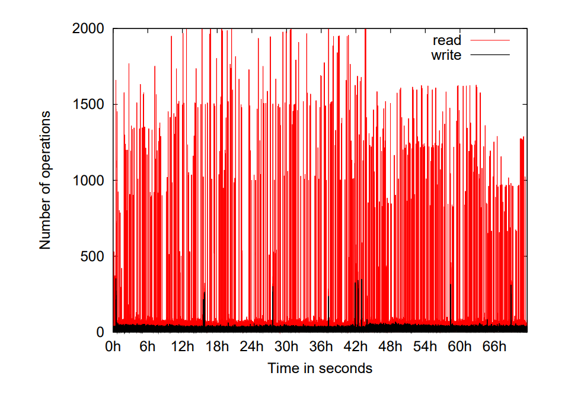
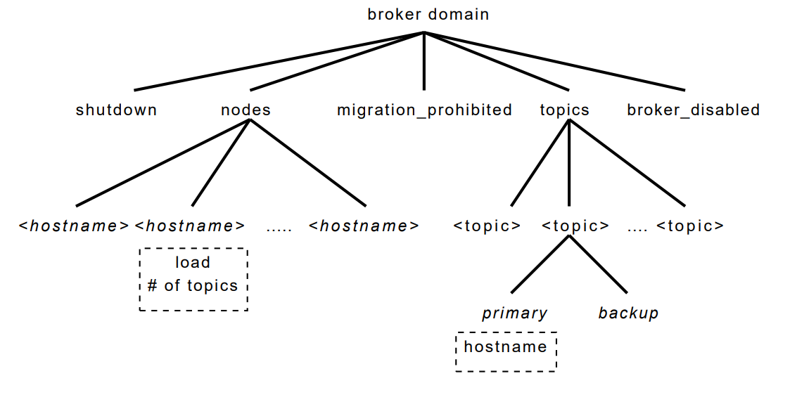
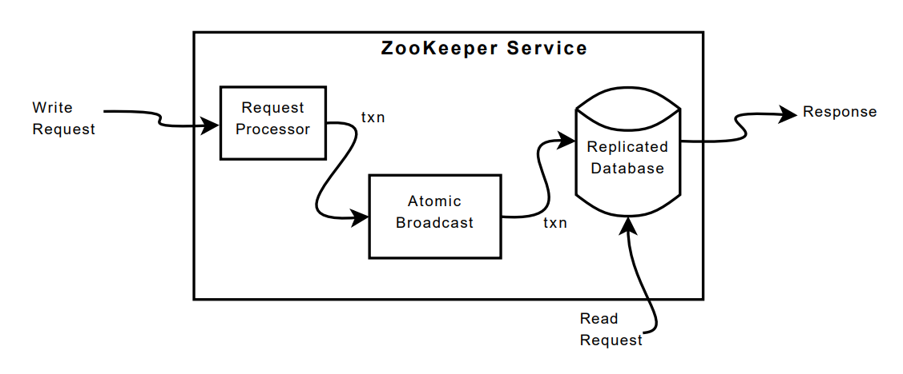
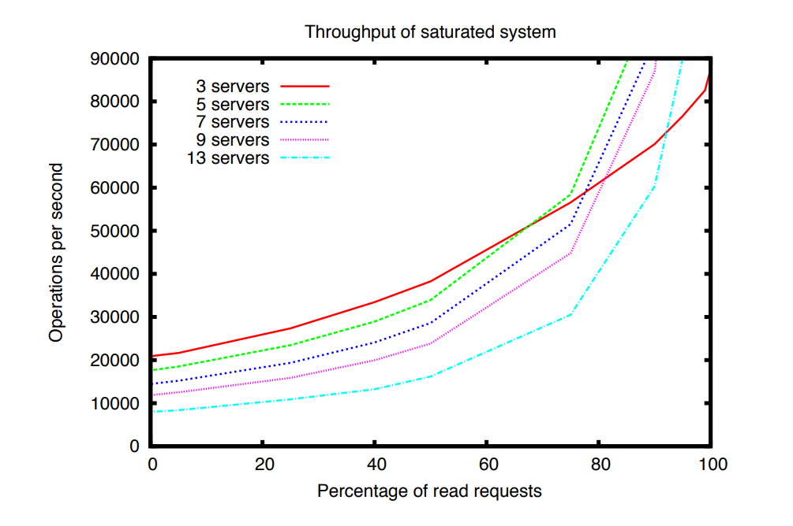
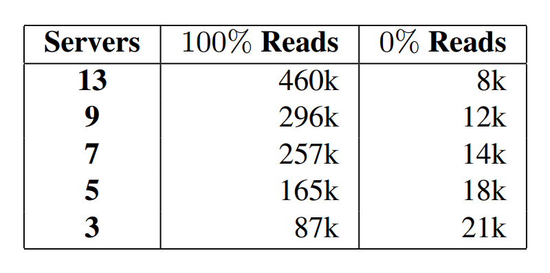
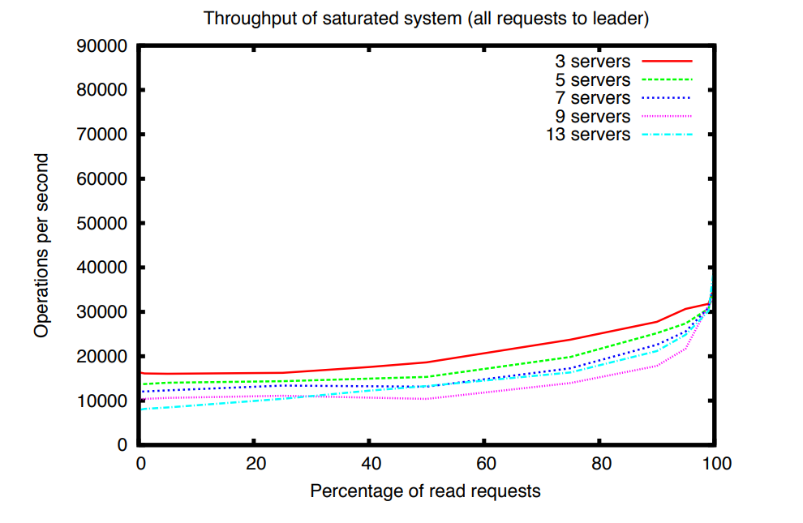
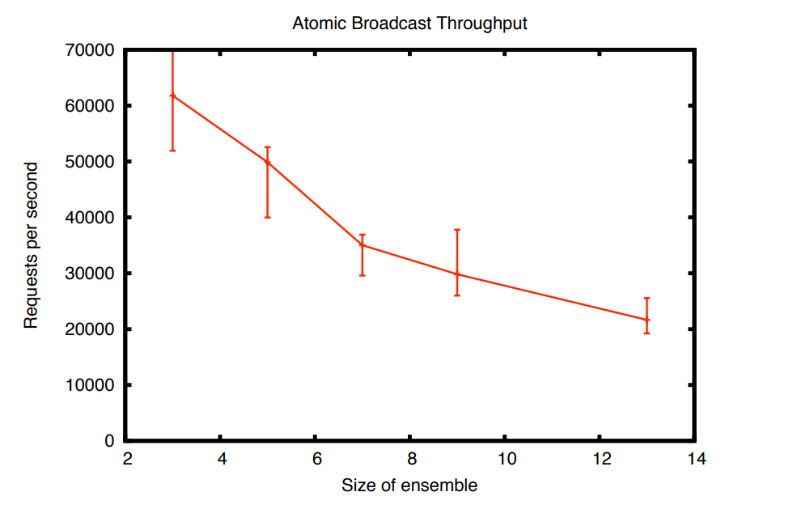
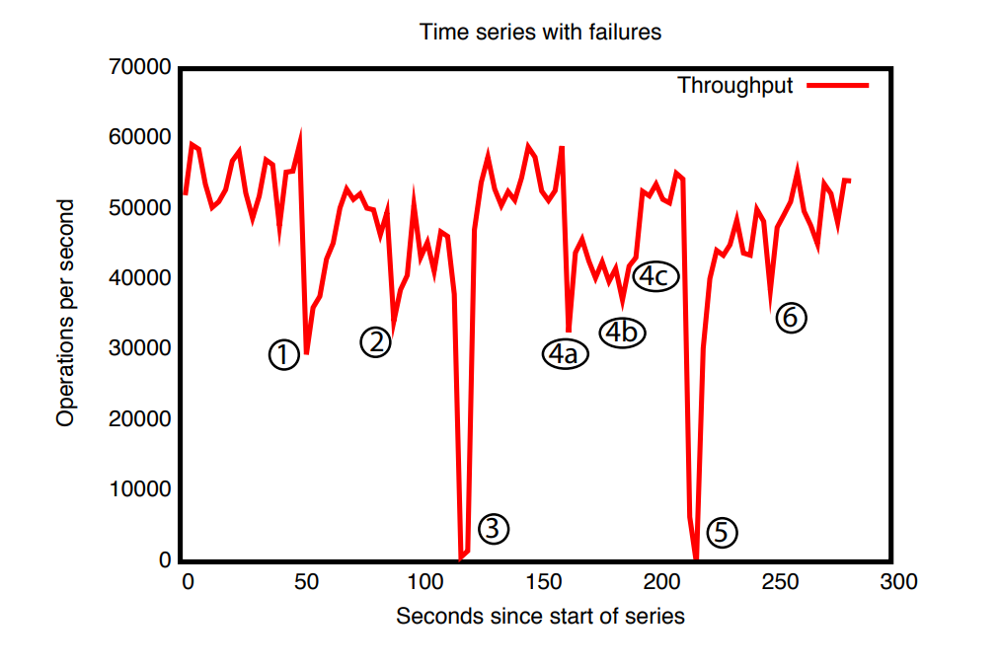
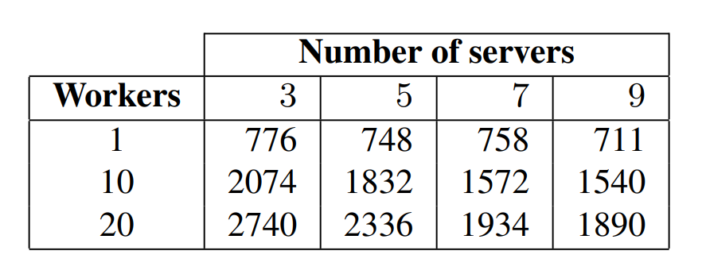
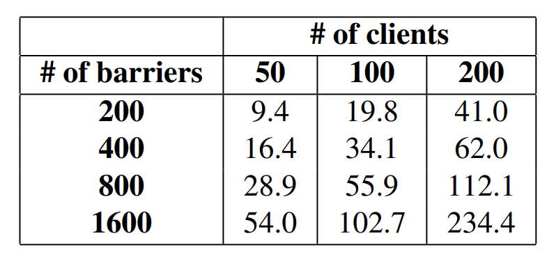

# ZooKeeper: Wait-free coordination for Internet-scale systems

## Abstract
本文介绍了 `ZooKeeper` ，一种用于**协调分布式应用中各个进程**的服务。由于 `ZooKeeper` 属于关键基础设施的一部分，因此它的设计目标是提供一个**简单且高性能的核心机制**，使客户端能够在此基础上构建更复杂的协调原语。ZooKeeper` 将**组消息通信、共享寄存器**以及**分布式锁服务**等机制整合到一个**集中式、可复制**的服务中。它对外提供的接口既保留了共享寄存器那种**无需阻塞等待的特性**，又结合了类似分布式文件系统中**缓存失效通知**的事件驱动机制，从而形成一种**简单但功能强大的协调服务**。

`ZooKeeper` 的接口设计使其能够实现**高性能服务**。除了具备**无等待（wait-free）**这一特性之外，`ZooKeeper` 还保证：对每个客户端而言，请求都按照 **FIFO** 顺序执行；而所有会改变 `ZooKeeper` 状态的请求，则满足**线性一致性**。正是这些设计选择，使得 `ZooKeeper` 可以构建出一种**高性能处理流水线**：其中读请求可以直接由**本地服务器**完成。实验表明，在目标负载下，当**读写比**介于 **2:1 到 100:1** 之间时，`ZooKeeper` 每秒可处理**数万到数十万次事务**。这样的性能使得 `ZooKeeper` 能够被客户端应用广泛采用。

## 1. Introduction
**大规模分布式应用需要多种不同的协调机制。**其中，**配置**是最基础的一种。最简单的时候，配置不过是系统中各个进程运行参数的一份清单；而在更复杂的系统里，配置参数往往还是**动态变化**的。在分布式系统中，**成员管理**和**领导者选举**也很常见：进程通常需要知道，**哪些其他进程当前仍然存活**，以及**这些进程分别负责哪些事务**。此外，**锁**是一种非常有力的协调原语，它用于实现对关键资源的**互斥访问**。

**一种协调思路，是针对各种不同的协调需求分别设计专门的服务。**例如，Amazon Simple Queue Service（Amazon SQS）就专门聚焦于**队列**功能。还有一些服务，则是专门为**领导者选举**和**配置管理**而开发的。不过，**能力更强的协调原语，也可以拿来实现能力较弱的那些功能。**比如，Chubby 是一种带有**强同步保证**的**锁服务**。而有了锁之后，就还可以进一步实现**领导者选举、组成员管理**等机制。

**在设计这个协调服务时，我们没有选择在服务端直接实现一组固定的协调原语，**而是改为**提供一套 API，让应用开发者能够自行实现所需的原语**。这一选择最终催生出一个**“协调内核”（coordination kernel）**：借助它，人们可以在**不改动服务核心**的前提下，扩展出新的协调原语。这种设计的好处在于，它能够支持**多种适配不同应用需求的协调方式**，而不是把开发者限制在一套**预先定义、不可变更的原语集合**里。

**在设计 ZooKeeper 的 API 时，我们有意避开了锁这类阻塞式原语。**这是因为，对于协调服务而言，阻塞式原语会带来不少问题，其中之一就是：**缓慢或失效的客户端，可能拖累原本运行更快的客户端的性能**。如果一个请求的处理过程还依赖于**其他客户端的响应**以及**对其他客户端故障的检测**，那么服务本身的实现也会变得更加复杂。因此，ZooKeeper 采用的是这样一套 API：它操作的是一些**简单的、无等待（wait-free）的数据对象**，这些对象像文件系统一样以**层次化结构**组织起来实际上，ZooKeeper 的 API 看起来很像普通文件系统的接口。如果只看 API 的函数签名，那么 ZooKeeper 几乎就像是**去掉了锁方法以及 `open`、`close` 操作的 Chubby**。不过，真正让 ZooKeeper 与那些基于锁等阻塞式原语的系统明显区分开来的，正是它对这类**无等待数据对象**的实现。

**虽然“无等待（wait-free）”这一特性对于性能和容错性都很重要，但仅靠它本身，还不足以支撑协调。**  我们还必须为各类操作提供**顺序保证**。更具体地说，我们发现：如果同时保证  
- **所有操作都满足按客户端维度的 FIFO 顺序**，以及  
- **写操作满足线性化（linearizable writes）**

那么不仅可以让服务本身实现得**高效**，而且这已经足以支持我们应用所关心的那些**协调原语**。事实上，借助这套 API，我们可以为**任意数量的进程实现共识（consensus）**；并且按照 **Herlihy 的层级理论**，ZooKeeper 实现的是一种**通用对象（universal object）**。

**ZooKeeper 服务由一组服务器共同组成，它们通过复制机制来实现高可用性和高性能。**正因为 ZooKeeper 性能很高，即便是由大量进程构成的应用，也可以把这样一个**协调内核**用于管理各种协调任务。我们之所以能够实现高性能，很大程度上得益于一种**简单的流水线式架构**：它允许系统在保持**低延迟**的同时，仍然并行处理**数百甚至数千个未完成请求**。这种流水线机制还天然保证了：**同一个客户端发出的操作，会按照 FIFO 顺序执行。**而一旦保证了客户端的 FIFO 顺序，客户端就可以**异步提交操作**。在异步模式下，一个客户端可以同时拥有**多个尚未完成的操作**。这一点在某些场景下尤其重要。比如，当一个新客户端刚刚成为 **leader** 时，它往往需要处理并更新一系列**元数据**。如果系统不支持同时存在多个未完成操作，那么初始化过程可能需要**几秒钟**；而有了这种能力，初始化时间就可以缩短到**亚秒级**。

**为了保证更新操作满足线性化（linearizability），我们实现了一种基于 leader 的原子广播协议**，称为 **Zab**。不过，ZooKeeper 应用的典型负载通常是**读多写少**，也就是说，系统中的大多数请求其实是**读操作**。因此，一个很自然的目标就是：**尽可能提升读吞吐量**。在 ZooKeeper 中，服务器会**在本地直接处理读请求**，我们**不会借助 Zab 去为所有读操作建立一个全局总顺序**。

**在客户端缓存数据，是提升读性能的一项重要手段。**例如，一个进程如果需要知道当前的 leader 是谁，与其每次都去查询 ZooKeeper，不如把当前 leader 的标识缓存在本地。ZooKeeper 通过 **watch 机制**，让客户端能够在**不由服务端直接管理客户端缓存**的情况下，依然安全地使用缓存。借助这一机制，客户端可以对某个数据对象设置监听；一旦该对象发生更新，客户端就会收到通知。与此不同，**Chubby 会直接管理客户端缓存**。当某份数据发生变化时，它会**阻塞更新操作**，直到所有缓存了该数据的客户端缓存都被失效为止。当某份数据发生变化时，它会**阻塞更新操作**，直到所有缓存了该数据的客户端缓存都被失效为止。这种设计的问题在于：**只要这些客户端中有一个很慢，或者出现故障，更新就会被拖延。**Chubby 为了避免故障客户端无限期阻塞系统，引入了 **lease（租约）机制**。但租约最多只能**限制慢客户端或故障客户端带来的影响范围**，并不能从根本上消除这个问题；相比之下，ZooKeeper 的 **watch 机制**则是**直接绕开了这一问题**。

**本文将介绍 ZooKeeper 的设计与实现。**借助 ZooKeeper，尽管系统中**只有写操作具备线性化保证**，我们仍然能够实现应用所需的**全部协调原语**。为了验证这一设计思路的有效性，我们还进一步展示了：**如何基于 ZooKeeper 来实现若干具体的协调原语。**

总而言之，我们的贡献如下：
+ **协调内核（Coordination kernel）：**我们提出了一种面向分布式系统的**无等待协调服务**，它采用了**较为宽松的一致性保证**。  具体来说，本文介绍了我们设计并实现的一种**协调内核**；我们已经在许多关键应用中使用它来构建各种协调机制。
+ **协调范式（Coordination recipes）：**我们进一步展示了，如何利用 ZooKeeper 构建**更高层次的协调原语**。这些原语甚至包括分布式应用中常用的那些**阻塞式原语**和**强一致性原语**。
+ **协调实践经验（Experience with Coordination）：**我们还分享了 ZooKeeper 的一些实际使用方式，并对它的性能进行了评估。

## 2. The ZooKeeper service
客户端通过 **ZooKeeper 客户端库**，借助一套**客户端 API**向 ZooKeeper 提交请求。客户端库的作用不仅是把 ZooKeeper 的服务接口暴露给应用程序，更重要的是，它还负责**管理客户端与 ZooKeeper 服务器之间的网络连接**。在这一节中，我们会先从整体上介绍 **ZooKeeper 服务的高层结构**，然后再进一步讨论：**客户端究竟是通过怎样的 API 与 ZooKeeper 交互的。**

在本文中，我们约定：
- **client** 指的是 **ZooKeeper 服务的使用者**
- **server** 指的是 **提供 ZooKeeper 服务的进程**
- **znode** 指的是 **ZooKeeper 数据模型中的内存数据节点

这些数据节点按照层次化命名空间组织在一起，整体称为**数据树（data tree）**。此外，文中用 **update** 和 **write** 来统称一切会**修改数据树状态**的操作。当客户端连接到 ZooKeeper 时，会先建立一个 **session（会话）**，并获得一个 **session handle（会话句柄）**；之后，客户端就是通过这个句柄来发起各种请求。

### 2.1 Service overview
ZooKeeper 向客户端提供的是这样一种抽象：它把数据表示为一组 **数据节点（znode）**，并按照**层次化命名空间**来组织。在这套层次结构中，每个 znode 都是客户端通过 **ZooKeeper API** 进行操作的数据对象。这种层次化命名空间在文件系统中很常见，也是组织数据对象的一种很自然的方式。一方面，用户对这种抽象形式已经很熟悉；另一方面，它也更便于整理应用中的**元数据**。为了表示某个特定 znode，ZooKeeper 采用了标准的 **UNIX 文件路径记法**。例如，`/A/B/C` 表示节点 `C` 的路径，其中 `C` 的父节点是 `B`，而 `B` 的父节点是 `A`。所有 znode 都可以存储数据；并且除了临时 znode（ephemeral znode）之外，其他 znode 都可以拥有子节点。


图 1

客户端可以创建的 znode 主要分为两类：
+ **普通节点（Regular）：**普通 znode 的生命周期由客户端**显式控制**。也就是说，客户端需要主动去**创建它**，也需要主动去**删除它**。
+ **临时节点（Ephemeral）：**临时 znode 也是由客户端创建的。不过，创建之后，它既可以由客户端显式删除，也可以在**创建它的那个 session 结束时**，由系统**自动删除**。这里的 session 结束，既可能是客户端主动断开，也可能是因为发生了故障。

此外，在创建新的 znode 时，客户端还可以设置 **sequential（顺序）标志**。一旦设置了这个标志，系统就会在该节点名称后面自动追加一个**单调递增的计数值**。假设新创建的节点是 `n`，它的父节点是 `p`，那么 `n` 所带的序号一定**不会小于**此前在 `p` 下面创建过的任何其他顺序节点名称中的序号。换句话说，**在同一个父节点下，顺序节点会按创建先后自动获得不断增大的编号。**

ZooKeeper 实现了 `watch` 机制，使客户端无需通过轮询就能及时收到变更通知。当客户端发起一个设置了 `watch` 标志的读操作时，该操作会像平常一样完成，但不同之处在于：服务器承诺在返回的信息发生变化时通知客户端。`watch` 是与会话相关联的一次性触发器；一旦被触发，或者会话关闭，它们就会被注销。`watch` 只能表明某个变化已经发生，但不会提供变化的具体内容。例如，如果客户端在 `"/foo"` 被修改两次之前执行了 `getData("/foo", true)`，那么客户端只会收到一次 `watch` 事件，用来告知 `"/foo"` 的数据已经发生了变化。会话事件（例如连接丢失事件）也会被发送到 `watch` 回调中，以便客户端知道 `watch` 事件可能会延迟到达。会话事件（例如连接丢失事件）也会被发送到 `watch` 回调中，以便客户端知道 `watch` 事件可能会延迟到达。

**数据模型(Data Model)**。ZooKeeper 的数据模型本质上可以看作一种带有精简接口的文件系统，它只支持对完整数据进行读取和写入；也可以把它理解为一张采用层次化键结构的键值表。这种层次化的命名空间非常有用，一方面可以为不同应用划分各自的子树空间，另一方面也便于针对这些子树设置访问权限。此外，我们还利用客户端侧“目录”这一概念来构建更高层次的原语，这一点将在第 2.4 节进一步说明。

与文件系统中的普通文件不同，`znode` 并不是为了通用数据存储而设计的。相反，`znode` 更像是客户端应用中某种抽象对象的映射，通常对应的是用于协调操作的元数据。为了说明这一点，图 1 中给出了两棵子树，一棵属于应用 1（`/app1`），另一棵属于应用 2（`/app2`）。其中，应用 1 的这棵子树实现了一个简单的组成员管理协议，每个客户端进程 `p_i` 都会在 `/app1` 下创建一个 `znode p_i`，并且只要该进程仍在运行，这个节点就会一直存在。

尽管 `znode` 并不是为通用数据存储而设计的，但 ZooKeeper 的确允许客户端保存一些信息，用作分布式计算中的元数据或配置信息。例如，在基于领导者的应用中，对于一个刚刚启动的应用服务器来说，知道当前哪台服务器是领导者是很有价值的。为实现这一点，可以让当前的领导者把相关信息写入 `znode` 命名空间中的某个已知位置，供其他服务器读取。此外，`znode` 还带有关联的元数据，例如时间戳和版本计数器。这些信息使客户端能够跟踪 `znode` 的变化，并根据 `znode` 的版本执行条件更新。

**会话(Sessions)**。客户端连接到 ZooKeeper 后，会建立一个会话。每个会话都对应一个超时时间；如果 ZooKeeper 在超过该时间后仍未从该会话收到任何消息，就会认为客户端已经发生故障。当客户端显式关闭会话句柄，或者 ZooKeeper 检测到客户端失效时，会话就会结束。在一个会话期间，客户端会观察到一系列状态变化，这些变化反映了其各项操作的执行过程。会话机制使客户端能够在 ZooKeeper 集群中的不同服务器之间透明地切换，因此会话本身可以跨服务器持续存在，而不会因为连接切换到另一台 ZooKeeper 服务器而丢失。

### 2.2 Client API
下面给出 ZooKeeper API 中一组较为重要的子集，并说明各个请求的语义。
- `create(path, data, flags)`：创建一个路径名为 `path` 的 `znode`，将 `data[]` 存入其中，并返回新创建的 `znode` 名称。参数 `flags` 用于让客户端选择 `znode` 的类型，例如普通节点、临时节点，以及是否设置顺序标志。
- `delete(path, version)`：如果 `znode path` 的版本号与期望版本一致，则删除该 `znode`。
- `exists(path, watch)`：如果路径名为 `path` 的 `znode` 存在，则返回 `true`，否则返回 `false`。参数 `watch` 允许客户端在该 `znode` 上设置监听。
- `getData(path, watch)`：返回与该 `znode` 关联的数据及元数据，例如版本信息。这里的 `watch` 参数与 `exists()` 中的作用相同，不同之处在于：如果该 `znode` 不存在，ZooKeeper 不会设置监听。
- `setData(path, data, version)`：如果版本号与该 `znode` 的当前版本一致，则将 `data[]` 写入 `path` 对应的 `znode`。
- `getChildren(path, watch)`：返回某个 `znode` 的所有子节点名称集合。
- `sync(path)`：等待在该操作开始时尚未完成传播的所有更新同步到客户端当前连接的服务器上。这里的 `path` 参数当前会被忽略。

所有方法在 API 中都同时提供了同步和异步两种版本。当应用只需要执行一次 ZooKeeper 操作、并且没有其他并发任务需要处理时，通常会使用同步 API，它发起所需的 ZooKeeper 调用，然后阻塞等待结果返回。而异步 API 则允许应用在发起多个尚未完成的 ZooKeeper 操作的同时，并行执行其他任务。ZooKeeper 客户端还保证：每个操作对应的回调函数都会按照顺序被调用。

需要注意的是，ZooKeeper 并不通过句柄来访问 `znode`。相反，每个请求都会直接给出被操作 `znode` 的完整路径。这样设计不仅简化了 API（例如不再需要 `open()` 或 `close()` 之类的方法），同时也减少了服务器端必须维护的额外状态。

另外，各种更新方法都会带上一个“期望版本号”，从而支持条件更新。如果 `znode` 的实际版本号与期望版本号不一致，更新就会失败，并返回版本不匹配错误。若版本号设置为 `-1`，则表示不进行版本检查。

### 2.3 ZooKeeper guarantees
ZooKeeper 提供了两项基本的顺序性保证：
- **写操作的线性化（Linearizable writes）**：所有会更新 ZooKeeper 状态的请求都是可串行化的，并且会遵循先后次序。
- **客户端 FIFO 顺序（FIFO client order）**：同一客户端发出的所有请求，都会按照其发送顺序依次执行。

需要说明的是，这里对“线性化”的定义不同于 Herlihy 最初提出的定义，我们将其称为 **A-线性化**（`A-linearizability`，即“异步线性化”）。在 Herlihy 原始的线性化定义中，一个客户端在任意时刻只能有一个尚未完成的操作，也就是说，一个客户端对应一条执行线程。而在我们的定义中，允许同一个客户端同时存在多个未完成的操作。因此，对于同一客户端的这些未完成操作，我们既可以选择不保证它们之间的特定顺序，也可以选择保证它们遵循 FIFO 顺序；这里我们采用的是后者。需要注意的是，所有适用于线性化对象的结论，同样也适用于 A-线性化对象，因为一个满足 A-线性化的系统也必然满足线性化。又由于只有更新请求需要满足 A-线性化，ZooKeeper 可以在每个副本上直接本地处理读请求。这样一来，随着系统中服务器数量的增加，服务的扩展能力也能够近似线性提升。

为了说明这两种保证是如何相互配合的，考虑这样一种场景：一个由多个进程组成的系统会选举出一个领导者，由它来指挥各个工作进程。每当新的领导者接管系统时，它都需要修改大量配置参数，并在全部修改完成后通知其他进程。于是，这里就有两个重要要求：
- 当新领导者开始进行配置变更时，其他进程不应在配置尚未改完之前就开始使用这套正在变动的配置；
- 如果新领导者在配置尚未完全更新之前就失效了，那么其他进程也不应使用这份只更新了一部分的不完整配置。

需要注意的是，像 Chubby 提供的那类分布式锁可以帮助满足第一个要求，但不足以满足第二个要求。借助 ZooKeeper，新领导者可以指定一个路径作为 `ready` 节点；只有当这个 `znode` 存在时，其他进程才会使用相应的配置。新领导者进行配置变更的方式是：先删除 `ready`，再更新各个配置 `znode`，最后重新创建 `ready`。这些变更都可以通过流水线方式异步发出，从而快速完成配置状态的更新。虽然一次变更操作的延迟大约只有 2 毫秒，但如果一个新领导者需要更新 5000 个不同的 `znode`，按顺序逐个发起请求就需要大约 10 秒；而如果采用异步方式发起这些请求，完成时间将不到 1 秒。由于 ZooKeeper 提供了顺序性保证，只要某个进程看到了 `ready` 节点，它就必然也能看到新领导者此前完成的全部配置变更。反过来，如果新领导者在创建 `ready` 节点之前就失效了，其他进程就会知道这次配置更新尚未最终完成，因此不会使用这份配置。

不过，上述方案仍然存在一个问题：如果某个进程在新领导者开始修改配置之前就已经看到 `ready` 存在，并且恰好在配置变更进行过程中开始读取配置，会发生什么？这个问题可以通过 ZooKeeper 对通知事件的顺序保证来解决：如果客户端正在监听某个变化，那么在它看到变更后的系统新状态之前，一定会先收到这次变化的通知事件。因此，如果读取 `ready` 节点的进程事先请求在该 `znode` 上监听变化，那么它一定会先收到“该节点已发生变化”的通知，然后才可能读到新的配置信息。也就是说，客户端会先得知配置正在变化，再去接触变更后的内容。

当客户端之间除了 ZooKeeper 之外，还有自己的通信通道时，就可能出现另一个问题。比如，设想有两个客户端 `A` 和 `B`，它们在 ZooKeeper 中共享一份配置，同时也通过一条共享的通信通道彼此交流。假如 `A` 在 ZooKeeper 中修改了这份共享配置，并通过这条通信通道把变更通知了 `B`，那么 `B` 自然会认为，自己重新读取配置时应该能看到这次更新。但如果 `B` 所连接的 ZooKeeper 副本相比 `A` 略有滞后，它就可能还看不到最新的配置。根据前面提到的保证机制，`B` 可以在重新读取配置之前先发起一次写操作，以确保自己读到的是最新信息。为了更高效地处理这种情况，ZooKeeper 提供了 `sync` 请求：在执行读取之前先执行 `sync`，就构成了一种“慢读”（slow read）。`sync` 会让服务器先应用所有尚未处理的写请求，然后再处理这次读取，从而避免一次完整写操作所带来的额外开销。这个原语在思想上与 ISIS 中的 `flush` 原语类似。

ZooKeeper 还提供以下两方面的**活性**与**持久性**保证：  
1. 只要大多数 ZooKeeper 服务器处于正常运行并且能够相互通信，整个服务就是可用的；
2. 只要 ZooKeeper 服务已经成功响应了某个变更请求，那么这项变更就能够在任意次数的故障之后依然被保留下来，前提是最终仍有一个达到法定多数的服务器集合能够恢复运行。

### 2.4 Examples of primitives
本节将说明如何利用 ZooKeeper 的 API 来实现功能更强的原语。ZooKeeper 服务本身并不了解这些更高级的原语，因为它们完全是在客户端一侧通过 ZooKeeper 客户端 API 实现的。像**组成员管理**、**配置管理**这类常见原语，也可以做到**无等待**（wait-free）。而对于另一些原语，例如**会合**（rendezvous），客户端则需要等待某个事件发生。尽管 ZooKeeper 本身是 wait-free 的，我们仍然可以基于它实现高效的阻塞型原语。ZooKeeper 提供的**顺序保证**使得系统状态的推理更加高效，而 **watch** 机制则让等待过程也能高效完成。

**动态配置管理（Configuration Management)**。ZooKeeper 可以用于在分布式应用中实现**动态配置管理**。最简单的做法是把配置信息存放在一个 znode `z_c` 中。各个进程启动时都会知道 `z_c` 的完整路径。新启动的进程通过读取 `z_c` 来获取配置，并将 `watch` 标志设为 `true`。这样一来，只要 `z_c` 中的配置被更新，这些进程就会收到通知，然后重新读取最新配置，并再次把 `watch` 标志设置为 `true`

需要注意的是，在这种方案中（以及大多数使用 `watch` 的方案中）`watch` 的作用是确保进程能够获知自己当前掌握的信息是否已经不是最新的。比如，一个正在监视 `z_c` 的进程收到一次关于 `z_c` 发生变化的通知后，如果它还没来得及再次读取 `z_c`，`z_c` 又连续发生了三次变化，那么这个进程并不会再额外收到三次通知事件。

**会和（Rendezvous）**。在分布式系统中，有时事先并不清楚系统最终会呈现怎样的配置。比如，某个客户端可能希望启动一个 `master` 进程和若干个 `worker` 进程，但这些进程实际上是由调度器负责启动的，因此客户端事先并不知道诸如地址、端口之类的信息，也就无法提前把这些信息告诉 `worker`，让它们去连接 `master`。在 ZooKeeper 中，这种场景可以通过一个 **znode** `z_r` 来处理，它是由客户端创建的一个节点。客户端把 `z_r` 的完整路径作为启动参数传递给 `master` 和各个 `worker` 进程。`master` 启动后，会把自己使用的地址和端口等信息写入 `z_r`。`worker` 启动时，则在将 `watch` 设为 `true` 的情况下读取 `z_r`。如果这时 `z_r` 里还没有填入相关信息，`worker` 就会等待，直到 `z_r` 被更新并收到通知为止。如果 `z_r` 是一个**临时节点**（ephemeral node），那么 `master` 和 `worker` 进程还可以监视 `z_r` 是否被删除；一旦客户端结束运行、导致该节点被删除，它们就可以执行相应的清理操作。

**组成员管理（Group Membership)**。我们利用**临时节点**（ephemeral node）来实现组成员管理。更具体地说，我们利用了这样一个特性：通过临时节点，可以反映出创建该节点的会话当前是否仍然存在。首先，我们指定一个 znode `z_g` 来表示这个组。某个进程作为组成员启动时，会在 `z_g` 之下创建一个临时子 znode。如果每个进程本身都有唯一的名称或标识符，那么这个名称就直接作为子 znode 的名字；否则，进程会在创建 znode 时设置 `SEQUENTIAL` 标志，从而由系统为其分配一个唯一名称。进程还可以把自己的相关信息写入这个子 znode 的数据中，例如该进程所使用的地址和端口等。

在 `z_g` 下面创建好子 znode 之后，进程就可以正常开始运行，不需要再额外做什么。如果进程发生故障或结束运行，那么 `z_g` 下代表该进程的那个 znode 会被自动删除。

各个进程只需列出 `z_g` 的所有子节点，就可以获得当前的组成员信息。如果某个进程希望监控组成员的变化，就可以把 `watch` 标志设为 `true`；每当收到变更通知时，再重新读取并刷新组信息，同时再次把 `watch` 标志设置为 `true`。

**简单锁（Simple Locks）**。虽然 ZooKeeper 本身并不是一个专门的锁服务，但它可以用来实现锁机制。实际使用 ZooKeeper 的应用，通常会根据自身需求构造合适的同步原语，就像前面介绍的那些例子一样。这里之所以专门说明如何用 ZooKeeper 实现锁，是为了表明它实际上能够支持多种通用的同步机制。

最简单的加锁方式类似于使用“锁文件”。锁由一个 znode 表示。客户端如果想获取锁，就尝试以 `EPHEMERAL` 标志创建指定的 znode。若创建成功，就说明该客户端已经获得了锁。否则，客户端可以在读取这个 znode 时将 `watch` 标志设为开启，这样一旦当前持锁者失效，便会收到通知。客户端在自身结束时，或显式删除该 znode 时，就会释放锁。其他正在等待锁的客户端在观察到该 znode 被删除后，就会再次尝试获取锁。

不过，这种简单的加锁协议虽然能够工作，但确实存在一些问题。首先，它会受到**惊群效应**（herd effect）的影响。如果有很多客户端都在等待获取同一把锁，那么一旦锁被释放，它们就会同时发起竞争，尽管最终只有一个客户端能够真正拿到锁。其次，这种方式只能实现**排他锁**。下面介绍的两种原语展示了如何克服这两个问题。

**Simple Locks without Herd Effect**。我们定义一个表示锁的 znode `l`，并用它来实现这种锁机制。直观地说，就是把所有请求这把锁的客户端排成一个队列，谁先发出请求，谁就按顺序先获得锁。因此，想要获取锁的客户端需要执行下面这些步骤：
```
Lock
1 n = create(l + “/lock-”, EPHEMERAL|SEQUENTIAL)
2 C = getChildren(l, false)
3 if n is lowest znode in C, exit
4 p = znode in C ordered just before n
5 if exists(p, true) wait for watch event
6 goto 2

Unlock
1 delete(n)
```

在 `Lock` 的第 1 步中使用 `SEQUENTIAL` 标志，作用是按照请求到达的先后顺序，为各个客户端的加锁尝试排定次序。到了第 3 步，如果某个客户端对应的 znode 拥有最小的序号，那么它就获得了这把锁。否则，它就需要等待排在自己前面的那个 znode 被删除——这个 znode 要么当前正持有锁，要么会比它更早获得锁。通过只监视紧挨在自己前面的那个 znode，系统就避免了**惊群效应**。每次锁被释放，或者某个加锁请求被放弃时，只会唤醒一个后继进程，而不是把所有等待者都唤醒。等到客户端所监视的 znode 消失之后，它还必须再次检查自己是否已经获得了锁。因为也有可能前一个加锁请求虽然被放弃了，但仍然存在某个序号更小的 znode，正在等待获得锁或者已经持有锁。

释放锁很简单，只需要删除表示该次加锁请求的 znode `n` 即可。由于在创建这个节点时使用了 `EPHEMERAL` 标志，如果某个进程发生崩溃，系统会自动清理它留下的加锁请求，或者自动释放它已经持有的锁。总的来说，这种加锁方案有以下几个优点：
1. 删除一个 znode 时，只会唤醒一个客户端，因为每个 znode 都只会被紧随其后的一个客户端监视，因此不会出现**惊群效应**；
2. 不需要轮询，也不需要依赖超时机制；
3. 由于这种加锁方式的实现是可观察的，我们可以通过查看 ZooKeeper 中的数据，了解锁竞争的情况，必要时强制解除锁，并对加锁相关的问题进行调试。

**Read/Write Locks**。
在实现读写锁时，我们对加锁流程进行了细微调整，将其划分为独立的读锁加锁例程与写锁加锁例程。而解锁操作则保持不变，与全局锁的处理方式完全一致。
```
Write Lock
1 n = create(l + “/write-”, EPHEMERAL|SEQUENTIAL)
2 C = getChildren(l, false)
3 if n is lowest znode in C, exit
4 p = znode in C ordered just before n
5 if exists(p, true) wait for event
6 goto 2

Read Lock
1 n = create(l + “/read-”, EPHEMERAL|SEQUENTIAL)
2 C = getChildren(l, false)
3 if no write znodes lower than n in C, exit
4 p = write znode in C ordered just before n
5 if exists(p, true) wait for event
6 goto 3
```
该加锁流程与前述锁机制略有不同。写锁（Write locks）仅在命名方式上有所区别。由于读锁（Read locks）具有共享特性，代码第 3、4 行做了相应微调：只有序号更小的“写锁 znode”才会阻塞客户端获取读锁。当多个客户端同时等待读锁，并因序号较小的“write-”znode 被删除而同时收到通知时，表面上看似引发了**“惊群效应”**（herd effect）；但实际上，这正是预期的设计行为。此时应当释放所有等待读锁的客户端，因为它们现在均已具备获取锁的权限。

**Double Barrier**。双重栅栏旨在使客户端能够同步计算任务的起始与结束。当加入栅栏的进程数量达到预设的栅栏阈值（Barrier Threshold）时，各进程开始执行计算，并在任务完成后退出栅栏。在 ZooKeeper 的实现中，我们使用一个名为 `b` 的 znode 来表示栅栏：每个进程 `p` 在进入阶段会通过创建 `b` 的子节点来执行注册（Register），并在准备退出时通过删除该子节点来执行注销（Unregister）。当 `b` 的子节点总数达到阈值时，进程即可进入栅栏开始计算；而当所有进程都已移除其对应的子节点后，进程方可彻底离开栅栏。我们利用 Watch（监听）机制来高效地等待准入与退出条件的达成。在进入阶段，进程会监听 `b` 节点下 ready 子节点的创建状态，该节点由最后一个使子节点总数达到阈值的进程负责创建。在离开阶段，进程则会监听某个特定子节点的消失，仅在该 znode 被移除后，才会触发对退出条件的最终校验。

## 3. ZooKeeper Applications
接下来，我们将介绍几个使用 ZooKeeper 的应用实例，并简要阐述其具体实现机制。在各示例中，涉及到的**原语（primitives）**均以粗体标识。

**抓取服务（The Fetching Service）** 
网络抓取是搜索引擎的核心环节，Yahoo! 需处理数十亿规模的网页文档。**抓取服务（Fetching Service，简称 FS）**作为 Yahoo! 爬虫系统的组成部分，目前已投入生产环境运行。从架构本质上看，该服务通过“主进程（master processes）”来调度“页面抓取进程（page-fetching processes）”。其中，主进程负责向抓取节点（fetchers）分发配置信息，而抓取节点则通过回写操作上报其运行状态与健康状况。在 FS 中引入 ZooKeeper 的主要优势在于：实现了主进程的故障恢复，确保了系统在局部失效时仍具备高可用性，并完成了客户端与服务端的解耦。客户端仅需从 ZooKeeper 中读取实时状态，即可将请求精准路由至健康的服务器节点。综上所述，FS 主要利用 ZooKeeper 来管理配置元数据（configuration metadata），同时也将其用于主进程的领导者选举（leader election）。


图 2

图 2 展示了 FS（抓取服务）所使用的 ZooKeeper 服务器在连续三天内的读写流量情况。为了绘制该图表，我们统计了此期间内每一秒的操作次数，图中的每个数据点均对应于该秒内的操作总量。观察可见，读流量远高于写流量。在操作速率超过每秒 1,000 次的时段内，读写比在 10:1 至 100:1 之间波动。在该工作负载中，读操作涉及 `getData()`、`getChildren()` 以及 `exists()`，且其使用频率依次递增。

**Katta**
Katta 是一款利用 ZooKeeper 进行协调的分布式索引系统，也是非 Yahoo! 体系应用的一个典型案例。Katta 采用**分片（shards）**机制来拆分索引任务,由主服务器（master server）负责将分片分配给各个从服务器（slaves），并持续追踪其处理进度。鉴于从服务器可能会发生故障，主服务器必须在节点动态上线或离线时实时重新分配负载。同时，由于主服务器自身也存在失效风险，其他服务器必须保持就绪状态，以便在故障发生时立即接管业务。在具体实现中，Katta 利用 ZooKeeper 监控从服务器及主服务器的存活状态（即**组员管理，group membership**），并处理主服务器的故障转移（即**领导者选举，leader election**）。此外，Katta 还通过 ZooKeeper 来记录并同步分片在从服务器上的分配方案（即**配置管理，configuration management**）。

**Yahoo! 消息代理（Yahoo! Message Broker）**
Yahoo! 消息代理（YMB）是一款分布式发布-订阅系统。该系统管理着数以千计的主题（topics），客户端可以向这些主题发布消息或从中接收消息。为了实现良好的可扩展性，这些主题被分布在多台服务器上。每个主题都采用了主备（primary-backup）模式，通过将消息同步至两台机器来确保数据交付的可靠性。由于构成 YMB 的服务器集群采用了无共享（shared-nothing）分布式架构，协调机制便成为了保障系统正确运行的核心。具体而言，YMB 利用 ZooKeeper 来管理主题的分布信息（即**配置元数据**）、处理系统内的机器故障（涉及**故障检测与组成员管理**），并对整个系统的运行进行管控。


图 3

图 3 展示了 YMB 在 ZooKeeper 中的部分 znode 数据布局。每个代理域（broker domain）均包含一个名为 nodes 的 znode，该节点下为组成 YMB 服务的每一台活跃服务器都创建了一个临时节点（ephemeral znode）。每台 YMB 服务器都会在 nodes 下建立一个包含负载及状态信息的临时节点，旨在通过 ZooKeeper 同步**组成员状态（group membership）**与运行信息。此外，服务中的所有服务器都会监控诸如 shutdown 和 migration_prohibited 等节点，从而实现对 YMB 的集中式控制。在 topics 目录下，YMB 为其管理的每个主题都设置了对应的子 znode。这些主题节点进一步包含子节点，用以指明负责该主题的主服务器（primary）、备服务器（backup）以及相关的订阅者（subscribers）。这些 primary 和 backup 节点不仅能让各服务器发现负责特定主题的节点，还承担着管理**领导者选举（leader election）**以及应对服务器崩溃（server crashes）的重要职能。

## 4. Zookeeper Implementation
ZooKeeper 通过在构成服务的每台服务器上维护数据副本，从而实现了高可用性。我们假设服务器的失效模式为**崩溃故障（crash failure）**，且此类故障节点在随后可能恢复正常。图 4 展示了 ZooKeeper 服务的核心架构组件。在接收到请求后，服务器会通过请求处理器（request processor）对其进行预处理以准备执行。若该请求涉及跨服务器的协作（例如写请求），则会启用共识协议（agreement protocol，即原子广播的一种具体实现）；最终，由集群（ensemble）中的所有服务器同步提交更改，确保各节点上的 ZooKeeper 数据库实现全量副本一致。而对于读请求，服务器只需读取其本地数据库的状态并直接生成响应即可。


<center>图 4</center>

该副本数据库是一个包含完整数据树的内存数据库（in-memory database）。默认情况下，树中的每个 znode 最多可存储 1MB 数据，但该上限作为一个配置参数，在特定场景下可以进行调整。为了保障系统的**可恢复性（recoverability）**，我们会将更新操作高效地记录到磁盘中，且必须确保这些写入操作在应用于内存数据库之前已完成**强制刷盘（force writes to disk media）**。事实上，参考 Chubby 的设计，我们维护了一份记录已提交操作的**重放日志（replay log，在本文中即预写式日志 WAL）**，并定期对内存数据库生成**快照（snapshots）**。

每台 ZooKeeper 服务器均可为客户端提供服务。客户端连接至其中任意一台服务器以提交请求。正如前文所述，读请求直接由各服务器数据库的本地副本进行处理。而对于涉及服务状态变更的请求（即写请求），则需通过一套**共识协议（agreement protocol）**进行处理。

作为共识协议执行流程的一部分，写请求会被转发至一台特定的服务器，称为领导者（leader）。集群中的其余服务器则被称为跟随者（followers），它们接收来自领导者的包含状态变更信息的消息提案（proposals），并就这些状态变更达成一致。

### 4.1 Request Rrocessor
由于消息层具备原子性，我们能够保证各节点的本地副本绝不会产生歧义（diverge），尽管在某一特定时刻，不同服务器所应用（apply）的事务进度可能存在差异。与客户端直接发送的请求不同，系统内部生成的事务具有**幂等性（idempotent）**。当领导者（Leader）接收到写请求时，它会预先计算该操作执行后的系统状态，并将其转化为一个涵盖该新状态的事务。这种对“预期状态”的计算至关重要，因为此时数据库中可能还存在尚未生效的**未完成事务（outstanding transactions）**。例如，若客户端发起一次带条件的 `setData` 操作，且请求中的版本号与目标 znode 的预期版本号相匹配，服务便会生成一个 `setDataTXN` 事务，其中包含了新数据、更新后的版本号以及时间戳。反之，若发生版本不匹配或目标 znode 不存在等错误，系统则会生成一个 `errorTXN` 作为替代。

### 4.2 Atomic Broadcast
凡涉及更新 ZooKeeper 状态的请求，均需转发至**领导者（leader）**节点。领导者负责执行该请求，并利用 **Zab （一种原子广播协议）将产生的状态变更广播至整个集群。最初接收到客户端请求的服务器，会在完成相应状态变更的传播（delivers）后，向客户端返回响应。Zab 协议默认采用多数派机制（simple majority quorums）**对提案达成决议；因此，只有当集群中过半数的服务器运行正常时，Zab 以及整个 ZooKeeper 服务才能保持可用（即对于规模为 $2f + 1$ 的集群，系统最高可容忍 $f$ 台服务器发生故障）。

为了实现高吞吐量，ZooKeeper 致力于确保其请求处理流水线（pipeline）始终处于满载状态。在流水线的各个阶段，可能同时并行处理着数千个请求。鉴于每一项状态变更都依赖于前序变更的执行结果，Zab 协议提供了比常规原子广播协议更为严苛的顺序保证（order guarantees）。具体而言，Zab 确保由领导者广播的变更均严格按照发送顺序进行交付；同时，在任一新当选的领导者开始发布其自身的变更之前，必须确保来自往届领导者的所有变更均已实施结束。

通过一些关键的实现细节，我们不仅简化了系统开发，还获得了卓越的性能表现。首先，我们选用 TCP 协议作为传输层，利用其底层网络特性直接保障了消息的顺序性，从而精简了应用层的实现逻辑。其次，我们直接将 Zab 协议选出的领导者（leader）作为 ZooKeeper 的领导者，确保了事务生成与提案发起均由同一个进程完成。最后，我们将记录提案的日志复用为内存数据库的**预写日志（write-ahead log）**，从而避免了消息在磁盘上的重复写入（二次落盘）。

在系统正常运行期间，Zab 协议确实能够保证消息按序且**精确一次（exactly once）**分发。然而，由于 Zab 并未持久化记录每一条已交付消息的 ID，因此在故障恢复阶段，Zab 可能会重复交付某些消息。由于我们采用了**幂等事务（idempotent transactions）**机制，只要能确保交付顺序一致，这种多次重复交付的操作对系统而言是完全可以接受的。事实上，ZooKeeper 要求 Zab 必须重新交付至少自最近一次快照（snapshot）起始点之后的所有消息。

### 4.3 Replicated Database
每个副本均在内存中维护着一份 ZooKeeper 状态。当 ZooKeeper 服务器从崩溃中恢复时，必须重建这一内部状态。由于在服务器运行一段时间后，通过重放所有已交付的消息来恢复状态会耗费极长的时间，因此 ZooKeeper 采用了定期快照机制，仅需重新交付自快照起始点以来的消息。我们将 ZooKeeper 的快照称为**模糊快照（fuzzy snapshots）**，因为在执行快照时，我们并不会锁定 ZooKeeper 的状态；相反，我们通过对数据树进行深度优先遍历，以原子化的方式读取每个 znode 的数据及其元数据并将其写入磁盘。由于生成的模糊快照可能包含了快照生成期间所交付的部分状态变更子集，其结果可能并不对应 ZooKeeper 在任何特定时间点的状态。然而，由于状态变更是**幂等（idempotent）**的，只要我们严格按序执行，即使重复应用这些状态变更也不会产生副作用。

例如，假设在模糊快照启动时，ZooKeeper 数据树中的两个节点 /foo 和 /goo 的初始值分别为 f1 和 g1，且版本号均为 1。随后，系统接收到一系列格式为 <transactionType, path, value, new-version>（事务类型、路径、值、新版本号）的状态变更流：

```
<SetDataTXN, /foo, f2, 2>
<SetDataTXN, /goo, g2, 2>
<SetDataTXN, /foo, f3, 3>
```

在处理完上述状态变更后，节点 `/foo` 和 `/goo` 的值应分别更新为 `f3` 和 `g2`，其对应版本号也分别为 3 和 2。然而，由于**模糊快照（fuzzy snapshot）**的特性，它记录下的数据可能是 `/foo` 的值为 `f3`（版本 3）而 `/goo` 的值仍为 `g1`（版本 1）。这种组合在 ZooKeeper 数据树的历史演变中从未真实存在过，因而不是一个合法状态（valid state）。尽管如此，若服务器发生崩溃并利用该快照进行恢复，只要 Zab 协议重新交付（redelivers）后续的状态变更，系统最终恢复出的状态仍将与崩溃前的服务状态完全一致。

### 4.4 Client-Server Interactions
当服务器处理写请求时，会同步发送并清除与该次更新相对应的所有监听（watch）通知。服务器严格按序处理写操作，且在处理过程中不会并发执行其他读写任务，从而保障了通知产生的严格先后顺序（strict succession）。需要注意的是，通知的处理具有本地性：只有客户端直接连接的那台服务器，才会负责维护并触发该客户端所需的通知。

读请求由各服务器节点在本地处理。每个读请求在处理时都会关联一个 $zxid$，该 ID 对应于该服务器所能观测到的最近一次事务。这一 $zxid$ 确立了读请求相对于写请求的**偏序关系（partial order）**。由于读操作完全基于本地节点的内存操作，既不涉及磁盘 I/O 也不需要运行共识协议，因此这种本地化的处理方式实现了很高的读吞吐量。对于以读为主（read-dominant）的工作负载，该设计决策是实现系统卓越性能表现的核心关键。

采用快速读取机制的一个弊端在于，它无法为读操作提供**时序保证（precedence order）**。也就是说，即便针对同一 znode 的最新更新已完成提交，随后的读操作仍可能返回陈旧值（stale value）。并非所有应用都依赖严格的时序保证，但针对有此需求的应用，我们实现了 `sync` 原语。该原语以异步方式执行，并由领导者（leader）负责进行排序，确保其排在该节点本地副本的所有**待处理写操作（pending writes）**之后。为了确保特定的读操作能够获取到最新的更新值，客户端需先调用 `sync`，紧接着发起读请求。凭借客户端操作的 FIFO 顺序保证以及 `sync` 提供的全局性保障，读操作的结果能够完整反映出在 `sync` 指令发出之前所发生的所有变更。在具体实现中，由于采用了基于领导者的算法，我们无需对 `sync` 进行原子广播，只需简单地将其置于领导者与执行 `sync` 调用的服务器之间的请求队列末尾即可。为确保该机制生效，跟随者（follower）必须确认领导者的身份依然有效。若当前仍有待提交的事务正在处理，服务器便不会对领导者的状态产生怀疑；若待处理队列为空，则领导者需发布一个**空事务（null transaction）**进行提交，并将 sync 排序在该事务之后。这一设计具备一个优良特性：当领导者处于高负载状态时，系统不会产生额外的广播流量。此外，在我们的实现中，通过合理设置超时阈值，确保领导者能在跟随者放弃（abandon）其地位之前预先察觉到自身职权的失效，从而规避了发布空事务的需求。

ZooKeeper 服务器严格按先进先出（FIFO）顺序处理客户端请求，且每项响应都会包含该结果所对应的 $zxid$。即便是在没有任何业务活动的空闲期，客户端所连的服务器在发送心跳消息时，也会携带其观测到的最新 $zxid$。若客户端尝试连接到一台新的服务器，该服务器会通过比对客户端持有的最新 $zxid$ 与自身的最新 $zxid$，来确保其持有的数据视图至少与客户端视图同步（即不晚于客户端已见的进度）。如果客户端的视图比该服务器更领先，则在服务器追赶上系统进度之前，它不会与该客户端重建会话。由于客户端仅能观测到那些已同步至集群多数派节点的变更，因此系统可以保证客户端总能找到另一台视图足够新的服务器。这一行为机制对于保障系统的**持久性（durability）**至关重要。

ZooKeeper 利用超时机制来检测客户端会话的失效情况。如果在设定的会话超时时间内，集群中没有任何服务器接收到来自某一客户端的消息，领导者（leader）节点便会判定该会话已发生故障。若客户端发送请求的频率足够高，则无需额外发送任何信息；而在业务低活跃期，客户端则通过发送**心跳（heartbeat）**消息来维持连接。一旦客户端因通信故障无法向当前服务器发送请求或心跳，它会尝试连接至其他 ZooKeeper 服务器以重新建立会话。为了规避会话超时的风险，ZooKeeper 客户端库采用了如下定时策略：当会话空闲达 $s/3$ 毫秒时，将自动触发一次心跳；若持续 $2s/3$ 毫秒未收到服务器响应，则立即切换并连接至新的服务器。此处 $s$ 代表以毫秒为单位的会话超时阈值。

## 5. Evaluation
所有的性能评估工作均在一个由 50 台服务器组成的集群上展开。每台服务器的硬件配置为：一颗至强（Xeon）双核 2.1GHz 处理器、4GB 内存、千兆以太网适配器以及两块 SATA 硬盘。接下来的讨论将分为两个维度：请求的**吞吐量（throughput）**与**延迟（latency）**。

### 5.1 Throughput
为评估系统性能，我们对系统在负载饱和（saturated）状态下的吞吐量，以及在各种故障注入（injected failures）场景下的吞吐量变化进行了基准测试。实验过程中，我们调整了构成 ZooKeeper 服务的服务器数量，但始终保持客户端总数固定。为了模拟大规模客户端访问，我们利用 35 台机器模拟了 250 个并发客户端（simultaneous clients）。

我们实现了 Java 版本的 ZooKeeper 服务器，以及 Java 和 C 两种语言版本的客户端。在本次实验中，我们对 Java 服务器进行了如下配置：使用一块专用磁盘记录日志，并在另一块磁盘上存储快照。我们的基准测试客户端采用异步 Java 客户端 API，且每个客户端始终保持至少 100 个未完成请求（requests outstanding）。每个请求涉及 1KB 的数据读写。由于所有修改状态的操作性能表现基本一致，且除 `sync` 之外的所有非修改状态操作性能也大致相同，因此我们未展示其他操作的基准测试结果。（`sync` 的性能接近于一种轻量级写入，因为该请求虽必须发送至领导者节点，但无需进行广播。）客户端每隔 300 毫秒上报一次已完成的操作统计量，我们则每隔 6 秒进行一次采样。为防止内存溢出，服务器会对系统中的并发请求数量进行节流（throttle）。ZooKeeper 通过请求节流机制来避免服务器过载。在这些实验中，我们将 ZooKeeper 服务器配置为最多同时处理 2,000 个请求。


图 5

图 5 展示了吞吐量随读写请求比例变化而波动的曲线，其中每条曲线代表了不同规模的 ZooKeeper 服务器集群。表 1 则列出了在读取负载达到极端情况下的具体数值。观察可见，读吞吐量显著高于写吞吐量，这主要归功于读操作无需运行原子广播协议。此外，图表还反映出服务器数量的增加会对广播协议的性能产生负面影响（即性能损耗）。通过这些图表可以发现，系统中服务器的数量不仅决定了服务能够容忍的故障节点数，还会影响其能够处理的负载总量。值得注意的是，三服务器配置下的曲线在读请求占比约为 60% 时与其他曲线发生了交叉。这种现象并非三服务器配置所特有，由于本地读取机制提升了系统的并行处理能力，所有配置下均会出现此类交叉。然而，出于对图表可读性的考虑，我们对 y 轴的最大吞吐量数值进行了截断（设置了显示上限），因此该现象在其他配置的曲线上并未显现。


表 1

写请求的延迟高于读请求，主要源于以下两个原因：
1. 写请求必须经过**原子广播（atomic broadcast）协议处理，这引入了额外的计算开销并增加了请求延迟。**
2. **服务器在向领导者返回确认（acknowledgment）之前，必须确保事务已持久化记录至非易失性存储（non-volatile store）**中。

从理论上讲，这一要求可能显得过于严苛，但对于生产系统而言，鉴于 ZooKeeper 承载着应用的基准事实（ground truth），我们选择牺牲部分性能来换取更高的可靠性。我们通过增加服务器数量来提升系统的容错能力，并利用**数据分区（partitioning）**技术将数据分布到多个 ZooKeeper 集群（ensembles）中，以提升整体写吞吐量。这种在副本复制（replication）与数据分区之间的性能权衡，在 Gray 等人的早期研究中已有先例。


图 6

ZooKeeper 之所以能够实现如此卓越的吞吐性能，关键在于它能将负载有效分散到构成集群的各台服务器上。这种负载均衡能力源于我们对一致性保证的适度放宽（relaxed consistency guarantees）。与之形成对比的是，Chubby 客户端必须将所有请求直接导向领导者节点（leader）。图 6 揭示了如果不利用这一松散特性、转而强制客户端仅连接领导者时的后果。在以读为主的工作负载下，系统吞吐量显著下降；然而，即便在以写为主的场景中，吞吐量也同样遭遇了下滑。究其原因，直接响应客户端请求会占用额外的 CPU 和网络资源，从而削弱了领导者协调**提案（proposals）**广播的核心职能，最终对整体写性能造成了负面冲击。


图 7

原子广播协议承载了系统的核心工作负载，因此相较于其他组件，它是限制 ZooKeeper 性能表现的最主要瓶颈。图 7 展示了原子广播组件的吞吐量。为了对其性能进行基准测试，我们通过直接在领导者（leader）节点生成事务的方式来模拟客户端，从而排除了客户端连接以及请求/响应交互产生的开销。在达到最大吞吐量时，原子广播组件呈现出 **CPU 密集型（CPU bound）**特征。从理论上讲，图 7 所示的性能应当与 ZooKeeper 在全写（100% writes）负载下的表现相匹配。然而，实际应用中 ZooKeeper 的客户端通信、ACL（访问控制列表）检查以及从请求到事务的转换过程均需消耗 CPU 资源。这种 CPU 资源竞争导致 ZooKeeper 的实际吞吐量显著低于独立运行时的原子广播组件。鉴于 ZooKeeper 是生产环境中的关键组件，截至目前，我们的开发重点始终在于保障其正确性（correctness）与健壮性（robustness）。未来，通过消除冗余内存拷贝、避免同一对象的多次序列化以及采用更高效的内部数据结构等手段，系统性能仍有巨大的提升空间。


图 8

为了展示系统在故障注入情况下随时间演变的行为特征，我们运行了一个由 5 台服务器组成的 ZooKeeper 集群。我们沿用了此前的**饱和基准测试（saturation benchmark）**方案，但将写请求占比固定为 30%；对于我们预期的工作负载而言，这是一个较为保守的比例。实验期间，我们周期性地强制停止（kill）部分服务器进程。图 8 展示了系统吞吐量随时间变化的曲线，图中标记的事件说明如下：
1. 某台跟随者（follower）发生故障并随后恢复；
2. 另一台跟随者发生故障并随后恢复；
3. 领导者（leader）发生故障；
4. 前两个标记位（a, b）处两台跟随者相继故障，第三个标记位（c）处恢复；
5. 领导者再次发生故障；
6. 领导者完成恢复。

通过该图表可以得出几个重要的观测结论。首先，如果跟随者（follower）发生故障并迅速恢复，ZooKeeper 依然能够在故障期间维持高吞吐量。
1. 单个跟随者的故障并不会阻碍服务器集群达成多数派（quorum），此时吞吐量的下降程度，大致等同于该服务器在故障前所承担的读请求份额。
2. 我们的领导者选举算法恢复速度极快，足以避免吞吐量出现大幅暴跌。据观测，ZooKeeper 选出新领导者的时间不足 200 毫秒。因此，尽管服务器会短暂停服（不足一秒），但由于我们的采样周期处于秒级水平，在图表中并未观测到吞吐量归零的情况。
3. 即便跟随者需要较长时间恢复，一旦它们重新开始处理请求，ZooKeeper 依然能提升整体吞吐量。在事件 1、2、4 之后，吞吐量之所以未能完全恢复至初始的满载水平，原因之一在于客户端仅在与当前跟随者的连接断开时才会切换节点。因此，在事件 4 之后，客户端并未在集群内进行重新分配，直到事件 3 和 5 发生领导者故障触发了重连。在实际生产中，随着客户端的不断加入与退出，这种负载不平衡现象会随时间推移逐渐自动平复。

### 5.2 Latency of requests
为评估请求延迟，我们参照 Chubby 基准测试构建了一套测试框架。在该框架中，我们设计了一个工作进程，其执行逻辑如下：首先发起一次创建请求并等待其完成，随后对该新节点发起异步删除操作，接着立即进入下一次创建循环。实验中通过相应地调整工作进程的数量来观察性能表现；在每轮测试中，每个工作进程负责创建 50,000 个节点。最终，吞吐量的计算方式为：已完成的创建请求总数除以所有工作进程全部结束所需的总时长。


表 2

表 2 展示了我们的基准测试结果。为了使测试更贴合预期的实际应用场景，我们将创建请求的数据载荷设为 1KB，而非 Chubby 基准测试中所采用的 5 字节。即便在处理此类大数据量请求的情况下，ZooKeeper 的吞吐量仍比 Chubby 已公布的数据高出 3 倍以上。此外，单工作进程的基准测试结果表明，在 3 台服务器配置下，平均请求延迟为 1.2ms，而在 9 台服务器配置下该延迟为 1.4ms。

### 5.3 Performance of barriers 
在本实验中，我们通过顺序执行一系列屏障（Barrier）操作，旨在评估基于 ZooKeeper 实现的各类同步原语的性能表现。在给定 $b$ 个屏障的测试场景下，每个客户端需首先依次进入这 $b$ 个屏障，随后再接连退出。由于我们采用了第 2.4 节中详述的“双重屏障算法”，客户端在进入下一次调用前，必须处于等待状态，直至所有其他客户端均已完成 `enter()` 过程；对于 `leave()` 操作，其同步逻辑亦然。


表 3 

表 3 汇总了本实验的结果。在实验设计中，我们分别设置了 50、100 和 200 个客户端，使其依次进入数量为 $b$ 的屏障，其中 $b \in \{200, 400, 800, 1600\}$。尽管一个应用程序可能包含数千个 ZooKeeper 客户端，但在实际场景中，通常只有规模较小的子集会参与特定的协调操作，因为客户端往往会根据应用的业务逻辑进行分组。

本实验有两个值得关注的发现：
1. 处理所有屏障所需的时间随屏障数量呈近似线性增长，这表明对数据树（Data Tree）相同部分的并发访问并未引发任何异常延迟；
2. 延迟随客户端数量成比例增加。

上述现象是 ZooKeeper 服务尚未达到饱和状态的结果。事实上，我们观察到即便客户端以“步调一致”（Lock-step）的方式同步运行，在所有测试场景下，屏障操作（进入与离开）的吞吐量仍保持在每秒 1,950 至 3,100 次之间。若对应到 ZooKeeper 的底层操作，这相当于每秒 10,700 至 17,000 次操作。由于我们的实验实现采用了 4:1 的读写比（即 80% 为读操作），基准测试代码所体现的吞吐量远低于 ZooKeeper 本身可达到的原生吞吐量（根据图 5 所示，该值可超过 40,000）。这种吞吐量的缺口主要是由客户端之间的相互等待所导致的。

## 6. Related work
ZooKeeper 旨在提供一种协调服务，用以应对分布式应用中进程协作的复杂性难题。为实现这一目标，其架构设计融合了早期**协调服务、容错系统、分布式算法以及文件系统**的核心设计思想。

在分布式应用协调系统的研究领域，我们并非先行者。早期已有研究针对事务性应用提出了分布式锁服务，或将其用于计算机集群中的信息共享。近期，Chubby 系统提出了一种面向分布式应用的建议性锁管理方案。Chubby 与 ZooKeeper 在设计目标上有诸多相似之处：它同样提供类文件系统接口，并利用共识协议来保证副本间的一致性。然而，ZooKeeper 本质上并非一种锁服务。尽管客户端可以基于 ZooKeeper 实现锁功能，但其 API 原语中并不直接提供锁操作。与 Chubby 不同，ZooKeeper 允许客户端连接至集群中的任意服务器，而非局限于主节点（Leader）。此外，由于 ZooKeeper 的**一致性模型较 Chubby 更为松散**，客户端可以利用本地副本来提供数据查询并管理**监听机制（Watches）**。这种架构设计赋予了 ZooKeeper 远超 Chubby 的性能表现，从而支持应用程序开展更广泛、更密集的业务调用。

学术界此前已提出过多种容错系统，旨在降低构建可靠分布式应用的复杂性。其中，早期的 ISIS 系统具有代表性，它将抽象类型规范转化为容错分布式对象，从而使容错机制对用户完全透明。Horus 与 Ensemble 则是从 ISIS 演进派生而来的后续系统。ZooKeeper 亦借鉴并采纳了 ISIS 中的**“虚拟同步”（Virtual Synchrony）**设计理念。此外，Totem 系统在一种利用局域网硬件广播特性的架构中，实现了消息传递的全序保证。相比之下，由于 ZooKeeper 需要适配各类复杂的网络拓扑结构，这促使我们选择依赖服务器进程间的 TCP 连接，而不对特定的拓扑结构或硬件特性做任何预设。同时，ZooKeeper 内部使用的集群通信机制也并未对外部暴露。

状态机复制（SMR）是构建容错服务的关键技术之一，而 Paxos 算法则为异步系统下的复制状态机实现提供了高效方案。我们所采用的算法借鉴了 Paxos 的部分特性，并创新性地将共识机制所需的事务日志与**数据树恢复所需的预写日志（WAL）**有机结合，从而实现了性能的显著提升。针对拜占庭容错（BFT）复制状态机的工程落地，学术界已有多项协议提案。ZooKeeper 的设计初衷并未假设服务器会发生拜占庭故障（即恶意行为），但我们仍引入了**校验和（Checksums）**与**合理性检查（Sanity checks）**等机制，以捕获并处理非恶意类的拜占庭错误（如内存位翻转导致的数据损坏）。Clement 等人曾探讨过一种无需修改现有代码库即可使 ZooKeeper 实现完全拜占庭容错的方案。然而，截至目前，我们在生产环境中尚未观察到任何必须依靠全拜占庭容错协议才能规避的故障实例。

Boxwood 是一个基于分布式锁服务器构建的系统。它通过一套基于 Paxos 协议的分布式锁服务，为应用程序提供高层抽象接口。与 Boxwood 类似，ZooKeeper 也是用于构建分布式系统的核心组件。然而，ZooKeeper 对性能有着更为严苛的要求，并在客户端应用中得到了更广泛的使用。在设计思路上，ZooKeeper 选择向应用程序暴露更为底层的原语，从而允许开发者根据实际需求灵活地实现各种高层逻辑。

ZooKeeper 的架构形态类似于一个轻量级文件系统，但它仅提供传统文件系统操作的一个精简子集。与此同时，它引入了多数文件系统并不具备的特有功能，例如顺序性保证和条件写操作。此外，ZooKeeper 的监听机制（Watches）在设计理念上与 AFS（安德鲁文件系统）的缓存回调机制（Cache Callbacks）异曲同工。

Sinfonia 引入了**“微型事务”（Mini-transactions）**概念，为构建可扩展分布式系统开创了新范式。Sinfonia 的设计初衷是存储应用业务数据，而 ZooKeeper 则专注于存储应用元数据。为了实现高性能与确定的低延迟，ZooKeeper 将所有状态进行全量副本化并驻留在内存中。通过利用类文件系统的操作原语以及顺序性保证，ZooKeeper 能够提供类似于微型事务的功能。此外，znode 这一抽象极具便利性，支持在其上挂载监听机制（Watches），而这正是 Sinfonia 所欠缺的功能。相比之下，Dynamo 作为一个分布式键值存储系统，允许客户端读写规模较小（小于 1MB）的数据。与 ZooKeeper 不同，Dynamo 的键空间不具备层级结构。此外，Dynamo 并不提供强一致性的写入保证或严苛的持久性承诺，而是采用在读取阶段解决冲突的策略。

DepSpace 采用元组空间（Tuple Space）模型实现了一套拜占庭容错服务。与 ZooKeeper 类似，DepSpace 亦通过简单的服务端接口，支持在客户端侧实现强同步原语。尽管在性能表现上远逊于 ZooKeeper，但 DepSpace 能够提供级别更高的容错能力以及更为完备的机密性保障。

## 7. Conclusions
ZooKeeper 在解决分布式系统进程协调问题时，采用了“无等待”（Wait-free）的设计理念，通过向客户端暴露无等待对象来实现这一目标。实践证明，ZooKeeper 已在雅虎内外众多的应用场景中发挥了重要作用。在读密集型的工作负载下，ZooKeeper 能够利用由本地副本直接响应的“快速读取”及“监听机制”（Watches），实现每秒数十万次的超高吞吐量。尽管我们在读取与监听上提供的一致性保证看似较弱，但通过实际案例可以证明：这种设计组合支持开发者在客户端构建出既高效又复杂的协调协议。即便读取操作不满足严格的偏序关系，且数据对象的实现遵循无等待原则，其功能依然完备。事实证明，无等待特性是系统实现高性能的关键基石。

尽管本文仅列举了少数应用案例，但 ZooKeeper 实际上已在更多领域得到了广泛采用。我们认为，其成功主要归功于简洁的接口设计，以及开发者能够基于该接口构建出的强大抽象能力。此外，得益于 ZooKeeper 卓越的高吞吐性能，应用程序可以对其进行更深度的调用，而不再局限于实现“粗粒度锁”这一单一应用场景。
