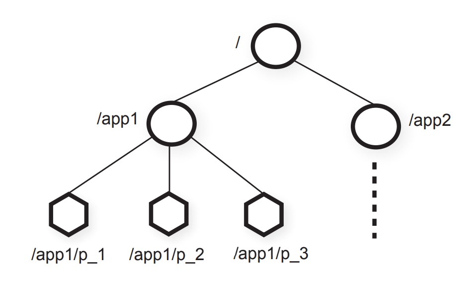

# ZooKeeper: Wait-free coordination for Internet-scale systems

## Abstract
本文介绍了 `ZooKeeper` ，一种用于**协调分布式应用中各个进程**的服务。由于 `ZooKeeper` 属于关键基础设施的一部分，因此它的设计目标是提供一个**简单且高性能的核心机制**，使客户端能够在此基础上构建更复杂的协调原语。ZooKeeper` 将**组消息通信、共享寄存器**以及**分布式锁服务**等机制整合到一个**集中式、可复制**的服务中。它对外提供的接口既保留了共享寄存器那种**无需阻塞等待的特性**，又结合了类似分布式文件系统中**缓存失效通知**的事件驱动机制，从而形成一种**简单但功能强大的协调服务**。

`ZooKeeper` 的接口设计使其能够实现**高性能服务**。除了具备**无等待（wait-free）**这一特性之外，`ZooKeeper` 还保证：对每个客户端而言，请求都按照 **FIFO** 顺序执行；而所有会改变 `ZooKeeper` 状态的请求，则满足**线性一致性**。正是这些设计选择，使得 `ZooKeeper` 可以构建出一种**高性能处理流水线**：其中读请求可以直接由**本地服务器**完成。实验表明，在目标负载下，当**读写比**介于 **2:1 到 100:1** 之间时，`ZooKeeper` 每秒可处理**数万到数十万次事务**。这样的性能使得 `ZooKeeper` 能够被客户端应用广泛采用。

## 1. Introduction
**大规模分布式应用需要多种不同的协调机制。**其中，**配置**是最基础的一种。最简单的时候，配置不过是系统中各个进程运行参数的一份清单；而在更复杂的系统里，配置参数往往还是**动态变化**的。在分布式系统中，**成员管理**和**领导者选举**也很常见：进程通常需要知道，**哪些其他进程当前仍然存活**，以及**这些进程分别负责哪些事务**。此外，**锁**是一种非常有力的协调原语，它用于实现对关键资源的**互斥访问**。

**一种协调思路，是针对各种不同的协调需求分别设计专门的服务。**例如，Amazon Simple Queue Service（Amazon SQS）就专门聚焦于**队列**功能。还有一些服务，则是专门为**领导者选举**和**配置管理**而开发的。不过，**能力更强的协调原语，也可以拿来实现能力较弱的那些功能。**比如，Chubby 是一种带有**强同步保证**的**锁服务**。而有了锁之后，就还可以进一步实现**领导者选举、组成员管理**等机制。

**在设计这个协调服务时，我们没有选择在服务端直接实现一组固定的协调原语，**而是改为**提供一套 API，让应用开发者能够自行实现所需的原语**。这一选择最终催生出一个**“协调内核”（coordination kernel）**：借助它，人们可以在**不改动服务核心**的前提下，扩展出新的协调原语。这种设计的好处在于，它能够支持**多种适配不同应用需求的协调方式**，而不是把开发者限制在一套**预先定义、不可变更的原语集合**里。

**在设计 ZooKeeper 的 API 时，我们有意避开了锁这类阻塞式原语。**这是因为，对于协调服务而言，阻塞式原语会带来不少问题，其中之一就是：**缓慢或失效的客户端，可能拖累原本运行更快的客户端的性能**。如果一个请求的处理过程还依赖于**其他客户端的响应**以及**对其他客户端故障的检测**，那么服务本身的实现也会变得更加复杂。因此，ZooKeeper 采用的是这样一套 API：它操作的是一些**简单的、无等待（wait-free）的数据对象**，这些对象像文件系统一样以**层次化结构**组织起来实际上，ZooKeeper 的 API 看起来很像普通文件系统的接口。如果只看 API 的函数签名，那么 ZooKeeper 几乎就像是**去掉了锁方法以及 `open`、`close` 操作的 Chubby**。不过，真正让 ZooKeeper 与那些基于锁等阻塞式原语的系统明显区分开来的，正是它对这类**无等待数据对象**的实现。

**虽然“无等待（wait-free）”这一特性对于性能和容错性都很重要，但仅靠它本身，还不足以支撑协调。**  我们还必须为各类操作提供**顺序保证**。更具体地说，我们发现：如果同时保证  
- **所有操作都满足按客户端维度的 FIFO 顺序**，以及  
- **写操作满足线性化（linearizable writes）**

那么不仅可以让服务本身实现得**高效**，而且这已经足以支持我们应用所关心的那些**协调原语**。事实上，借助这套 API，我们可以为**任意数量的进程实现共识（consensus）**；并且按照 **Herlihy 的层级理论**，ZooKeeper 实现的是一种**通用对象（universal object）**。

**ZooKeeper 服务由一组服务器共同组成，它们通过复制机制来实现高可用性和高性能。**正因为 ZooKeeper 性能很高，即便是由大量进程构成的应用，也可以把这样一个**协调内核**用于管理各种协调任务。我们之所以能够实现高性能，很大程度上得益于一种**简单的流水线式架构**：它允许系统在保持**低延迟**的同时，仍然并行处理**数百甚至数千个未完成请求**。这种流水线机制还天然保证了：**同一个客户端发出的操作，会按照 FIFO 顺序执行。**而一旦保证了客户端的 FIFO 顺序，客户端就可以**异步提交操作**。在异步模式下，一个客户端可以同时拥有**多个尚未完成的操作**。这一点在某些场景下尤其重要。比如，当一个新客户端刚刚成为 **leader** 时，它往往需要处理并更新一系列**元数据**。如果系统不支持同时存在多个未完成操作，那么初始化过程可能需要**几秒钟**；而有了这种能力，初始化时间就可以缩短到**亚秒级**。

**为了保证更新操作满足线性化（linearizability），我们实现了一种基于 leader 的原子广播协议**，称为 **Zab**。不过，ZooKeeper 应用的典型负载通常是**读多写少**，也就是说，系统中的大多数请求其实是**读操作**。因此，一个很自然的目标就是：**尽可能提升读吞吐量**。在 ZooKeeper 中，服务器会**在本地直接处理读请求**，我们**不会借助 Zab 去为所有读操作建立一个全局总顺序**。

**在客户端缓存数据，是提升读性能的一项重要手段。**例如，一个进程如果需要知道当前的 leader 是谁，与其每次都去查询 ZooKeeper，不如把当前 leader 的标识缓存在本地。ZooKeeper 通过 **watch 机制**，让客户端能够在**不由服务端直接管理客户端缓存**的情况下，依然安全地使用缓存。借助这一机制，客户端可以对某个数据对象设置监听；一旦该对象发生更新，客户端就会收到通知。与此不同，**Chubby 会直接管理客户端缓存**。当某份数据发生变化时，它会**阻塞更新操作**，直到所有缓存了该数据的客户端缓存都被失效为止。当某份数据发生变化时，它会**阻塞更新操作**，直到所有缓存了该数据的客户端缓存都被失效为止。这种设计的问题在于：**只要这些客户端中有一个很慢，或者出现故障，更新就会被拖延。**Chubby 为了避免故障客户端无限期阻塞系统，引入了 **lease（租约）机制**。但租约最多只能**限制慢客户端或故障客户端带来的影响范围**，并不能从根本上消除这个问题；相比之下，ZooKeeper 的 **watch 机制**则是**直接绕开了这一问题**。

**本文将介绍 ZooKeeper 的设计与实现。**借助 ZooKeeper，尽管系统中**只有写操作具备线性化保证**，我们仍然能够实现应用所需的**全部协调原语**。为了验证这一设计思路的有效性，我们还进一步展示了：**如何基于 ZooKeeper 来实现若干具体的协调原语。**

总而言之，我们的贡献如下：
+ **协调内核（Coordination kernel）：**我们提出了一种面向分布式系统的**无等待协调服务**，它采用了**较为宽松的一致性保证**。  具体来说，本文介绍了我们设计并实现的一种**协调内核**；我们已经在许多关键应用中使用它来构建各种协调机制。
+ **协调范式（Coordination recipes）：**我们进一步展示了，如何利用 ZooKeeper 构建**更高层次的协调原语**。这些原语甚至包括分布式应用中常用的那些**阻塞式原语**和**强一致性原语**。
+ **协调实践经验（Experience with Coordination）：**我们还分享了 ZooKeeper 的一些实际使用方式，并对它的性能进行了评估。

## 2. The ZooKeeper service
客户端通过 **ZooKeeper 客户端库**，借助一套**客户端 API**向 ZooKeeper 提交请求。客户端库的作用不仅是把 ZooKeeper 的服务接口暴露给应用程序，更重要的是，它还负责**管理客户端与 ZooKeeper 服务器之间的网络连接**。在这一节中，我们会先从整体上介绍 **ZooKeeper 服务的高层结构**，然后再进一步讨论：**客户端究竟是通过怎样的 API 与 ZooKeeper 交互的。**

在本文中，我们约定：
- **client** 指的是 **ZooKeeper 服务的使用者**
- **server** 指的是 **提供 ZooKeeper 服务的进程**
- **znode** 指的是 **ZooKeeper 数据模型中的内存数据节点

这些数据节点按照层次化命名空间组织在一起，整体称为**数据树（data tree）**。此外，文中用 **update** 和 **write** 来统称一切会**修改数据树状态**的操作。当客户端连接到 ZooKeeper 时，会先建立一个 **session（会话）**，并获得一个 **session handle（会话句柄）**；之后，客户端就是通过这个句柄来发起各种请求。

### 2.1 Service overview
ZooKeeper 向客户端提供的是这样一种抽象：它把数据表示为一组 **数据节点（znode）**，并按照**层次化命名空间**来组织。在这套层次结构中，每个 znode 都是客户端通过 **ZooKeeper API** 进行操作的数据对象。这种层次化命名空间在文件系统中很常见，也是组织数据对象的一种很自然的方式。一方面，用户对这种抽象形式已经很熟悉；另一方面，它也更便于整理应用中的**元数据**。为了表示某个特定 znode，ZooKeeper 采用了标准的 **UNIX 文件路径记法**。例如，`/A/B/C` 表示节点 `C` 的路径，其中 `C` 的父节点是 `B`，而 `B` 的父节点是 `A`。所有 znode 都可以存储数据；并且除了临时 znode（ephemeral znode）之外，其他 znode 都可以拥有子节点。


图 1

客户端可以创建的 znode 主要分为两类：
+ **普通节点（Regular）：**普通 znode 的生命周期由客户端**显式控制**。也就是说，客户端需要主动去**创建它**，也需要主动去**删除它**。
+ **临时节点（Ephemeral）：**临时 znode 也是由客户端创建的。不过，创建之后，它既可以由客户端显式删除，也可以在**创建它的那个 session 结束时**，由系统**自动删除**。这里的 session 结束，既可能是客户端主动断开，也可能是因为发生了故障。

此外，在创建新的 znode 时，客户端还可以设置 **sequential（顺序）标志**。一旦设置了这个标志，系统就会在该节点名称后面自动追加一个**单调递增的计数值**。假设新创建的节点是 `n`，它的父节点是 `p`，那么 `n` 所带的序号一定**不会小于**此前在 `p` 下面创建过的任何其他顺序节点名称中的序号。换句话说，**在同一个父节点下，顺序节点会按创建先后自动获得不断增大的编号。**

ZooKeeper 实现了 `watch` 机制，使客户端无需通过轮询就能及时收到变更通知。当客户端发起一个设置了 `watch` 标志的读操作时，该操作会像平常一样完成，但不同之处在于：服务器承诺在返回的信息发生变化时通知客户端。`watch` 是与会话相关联的一次性触发器；一旦被触发，或者会话关闭，它们就会被注销。`watch` 只能表明某个变化已经发生，但不会提供变化的具体内容。例如，如果客户端在 `"/foo"` 被修改两次之前执行了 `getData("/foo", true)`，那么客户端只会收到一次 `watch` 事件，用来告知 `"/foo"` 的数据已经发生了变化。会话事件（例如连接丢失事件）也会被发送到 `watch` 回调中，以便客户端知道 `watch` 事件可能会延迟到达。会话事件（例如连接丢失事件）也会被发送到 `watch` 回调中，以便客户端知道 `watch` 事件可能会延迟到达。

**数据模型(Data Model)**。ZooKeeper 的数据模型本质上可以看作一种带有精简接口的文件系统，它只支持对完整数据进行读取和写入；也可以把它理解为一张采用层次化键结构的键值表。这种层次化的命名空间非常有用，一方面可以为不同应用划分各自的子树空间，另一方面也便于针对这些子树设置访问权限。此外，我们还利用客户端侧“目录”这一概念来构建更高层次的原语，这一点将在第 2.4 节进一步说明。

与文件系统中的普通文件不同，`znode` 并不是为了通用数据存储而设计的。相反，`znode` 更像是客户端应用中某种抽象对象的映射，通常对应的是用于协调操作的元数据。为了说明这一点，图 1 中给出了两棵子树，一棵属于应用 1（`/app1`），另一棵属于应用 2（`/app2`）。其中，应用 1 的这棵子树实现了一个简单的组成员管理协议，每个客户端进程 `p_i` 都会在 `/app1` 下创建一个 `znode p_i`，并且只要该进程仍在运行，这个节点就会一直存在。

尽管 `znode` 并不是为通用数据存储而设计的，但 ZooKeeper 的确允许客户端保存一些信息，用作分布式计算中的元数据或配置信息。例如，在基于领导者的应用中，对于一个刚刚启动的应用服务器来说，知道当前哪台服务器是领导者是很有价值的。为实现这一点，可以让当前的领导者把相关信息写入 `znode` 命名空间中的某个已知位置，供其他服务器读取。此外，`znode` 还带有关联的元数据，例如时间戳和版本计数器。这些信息使客户端能够跟踪 `znode` 的变化，并根据 `znode` 的版本执行条件更新。

**会话(Sessions)**。客户端连接到 ZooKeeper 后，会建立一个会话。每个会话都对应一个超时时间；如果 ZooKeeper 在超过该时间后仍未从该会话收到任何消息，就会认为客户端已经发生故障。当客户端显式关闭会话句柄，或者 ZooKeeper 检测到客户端失效时，会话就会结束。在一个会话期间，客户端会观察到一系列状态变化，这些变化反映了其各项操作的执行过程。会话机制使客户端能够在 ZooKeeper 集群中的不同服务器之间透明地切换，因此会话本身可以跨服务器持续存在，而不会因为连接切换到另一台 ZooKeeper 服务器而丢失。

### 2.2 Client API
下面给出 ZooKeeper API 中一组较为重要的子集，并说明各个请求的语义。
- `create(path, data, flags)`：创建一个路径名为 `path` 的 `znode`，将 `data[]` 存入其中，并返回新创建的 `znode` 名称。参数 `flags` 用于让客户端选择 `znode` 的类型，例如普通节点、临时节点，以及是否设置顺序标志。
- `delete(path, version)`：如果 `znode path` 的版本号与期望版本一致，则删除该 `znode`。
- `exists(path, watch)`：如果路径名为 `path` 的 `znode` 存在，则返回 `true`，否则返回 `false`。参数 `watch` 允许客户端在该 `znode` 上设置监听。
- `getData(path, watch)`：返回与该 `znode` 关联的数据及元数据，例如版本信息。这里的 `watch` 参数与 `exists()` 中的作用相同，不同之处在于：如果该 `znode` 不存在，ZooKeeper 不会设置监听。
- `setData(path, data, version)`：如果版本号与该 `znode` 的当前版本一致，则将 `data[]` 写入 `path` 对应的 `znode`。
- `getChildren(path, watch)`：返回某个 `znode` 的所有子节点名称集合。
- `sync(path)`：等待在该操作开始时尚未完成传播的所有更新同步到客户端当前连接的服务器上。这里的 `path` 参数当前会被忽略。

所有方法在 API 中都同时提供了同步和异步两种版本。当应用只需要执行一次 ZooKeeper 操作、并且没有其他并发任务需要处理时，通常会使用同步 API，它发起所需的 ZooKeeper 调用，然后阻塞等待结果返回。而异步 API 则允许应用在发起多个尚未完成的 ZooKeeper 操作的同时，并行执行其他任务。ZooKeeper 客户端还保证：每个操作对应的回调函数都会按照顺序被调用。

需要注意的是，ZooKeeper 并不通过句柄来访问 `znode`。相反，每个请求都会直接给出被操作 `znode` 的完整路径。这样设计不仅简化了 API（例如不再需要 `open()` 或 `close()` 之类的方法），同时也减少了服务器端必须维护的额外状态。

另外，各种更新方法都会带上一个“期望版本号”，从而支持条件更新。如果 `znode` 的实际版本号与期望版本号不一致，更新就会失败，并返回版本不匹配错误。若版本号设置为 `-1`，则表示不进行版本检查。

### 2.3 ZooKeeper guarantees
ZooKeeper 提供了两项基本的顺序性保证：
- **写操作的线性化（Linearizable writes）**：所有会更新 ZooKeeper 状态的请求都是可串行化的，并且会遵循先后次序。
- **客户端 FIFO 顺序（FIFO client order）**：同一客户端发出的所有请求，都会按照其发送顺序依次执行。

需要说明的是，这里对“线性化”的定义不同于 Herlihy 最初提出的定义，我们将其称为 **A-线性化**（`A-linearizability`，即“异步线性化”）。在 Herlihy 原始的线性化定义中，一个客户端在任意时刻只能有一个尚未完成的操作，也就是说，一个客户端对应一条执行线程。而在我们的定义中，允许同一个客户端同时存在多个未完成的操作。因此，对于同一客户端的这些未完成操作，我们既可以选择不保证它们之间的特定顺序，也可以选择保证它们遵循 FIFO 顺序；这里我们采用的是后者。需要注意的是，所有适用于线性化对象的结论，同样也适用于 A-线性化对象，因为一个满足 A-线性化的系统也必然满足线性化。又由于只有更新请求需要满足 A-线性化，ZooKeeper 可以在每个副本上直接本地处理读请求。这样一来，随着系统中服务器数量的增加，服务的扩展能力也能够近似线性提升。

为了说明这两种保证是如何相互配合的，考虑这样一种场景：一个由多个进程组成的系统会选举出一个领导者，由它来指挥各个工作进程。每当新的领导者接管系统时，它都需要修改大量配置参数，并在全部修改完成后通知其他进程。于是，这里就有两个重要要求：
- 当新领导者开始进行配置变更时，其他进程不应在配置尚未改完之前就开始使用这套正在变动的配置；
- 如果新领导者在配置尚未完全更新之前就失效了，那么其他进程也不应使用这份只更新了一部分的不完整配置。

需要注意的是，像 Chubby 提供的那类分布式锁可以帮助满足第一个要求，但不足以满足第二个要求。借助 ZooKeeper，新领导者可以指定一个路径作为 `ready` 节点；只有当这个 `znode` 存在时，其他进程才会使用相应的配置。新领导者进行配置变更的方式是：先删除 `ready`，再更新各个配置 `znode`，最后重新创建 `ready`。这些变更都可以通过流水线方式异步发出，从而快速完成配置状态的更新。虽然一次变更操作的延迟大约只有 2 毫秒，但如果一个新领导者需要更新 5000 个不同的 `znode`，按顺序逐个发起请求就需要大约 10 秒；而如果采用异步方式发起这些请求，完成时间将不到 1 秒。由于 ZooKeeper 提供了顺序性保证，只要某个进程看到了 `ready` 节点，它就必然也能看到新领导者此前完成的全部配置变更。反过来，如果新领导者在创建 `ready` 节点之前就失效了，其他进程就会知道这次配置更新尚未最终完成，因此不会使用这份配置。

不过，上述方案仍然存在一个问题：如果某个进程在新领导者开始修改配置之前就已经看到 `ready` 存在，并且恰好在配置变更进行过程中开始读取配置，会发生什么？这个问题可以通过 ZooKeeper 对通知事件的顺序保证来解决：如果客户端正在监听某个变化，那么在它看到变更后的系统新状态之前，一定会先收到这次变化的通知事件。因此，如果读取 `ready` 节点的进程事先请求在该 `znode` 上监听变化，那么它一定会先收到“该节点已发生变化”的通知，然后才可能读到新的配置信息。也就是说，客户端会先得知配置正在变化，再去接触变更后的内容。

当客户端之间除了 ZooKeeper 之外，还有自己的通信通道时，就可能出现另一个问题。比如，设想有两个客户端 `A` 和 `B`，它们在 ZooKeeper 中共享一份配置，同时也通过一条共享的通信通道彼此交流。假如 `A` 在 ZooKeeper 中修改了这份共享配置，并通过这条通信通道把变更通知了 `B`，那么 `B` 自然会认为，自己重新读取配置时应该能看到这次更新。但如果 `B` 所连接的 ZooKeeper 副本相比 `A` 略有滞后，它就可能还看不到最新的配置。根据前面提到的保证机制，`B` 可以在重新读取配置之前先发起一次写操作，以确保自己读到的是最新信息。为了更高效地处理这种情况，ZooKeeper 提供了 `sync` 请求：在执行读取之前先执行 `sync`，就构成了一种“慢读”（slow read）。`sync` 会让服务器先应用所有尚未处理的写请求，然后再处理这次读取，从而避免一次完整写操作所带来的额外开销。这个原语在思想上与 ISIS 中的 `flush` 原语类似。

ZooKeeper 还提供以下两方面的**活性**与**持久性**保证：  
1. 只要大多数 ZooKeeper 服务器处于正常运行并且能够相互通信，整个服务就是可用的；
2. 只要 ZooKeeper 服务已经成功响应了某个变更请求，那么这项变更就能够在任意次数的故障之后依然被保留下来，前提是最终仍有一个达到法定多数的服务器集合能够恢复运行。

### 2.4 Examples of primitives
本节将说明如何利用 ZooKeeper 的 API 来实现功能更强的原语。ZooKeeper 服务本身并不了解这些更高级的原语，因为它们完全是在客户端一侧通过 ZooKeeper 客户端 API 实现的。像**组成员管理**、**配置管理**这类常见原语，也可以做到**无等待**（wait-free）。而对于另一些原语，例如**会合**（rendezvous），客户端则需要等待某个事件发生。尽管 ZooKeeper 本身是 wait-free 的，我们仍然可以基于它实现高效的阻塞型原语。ZooKeeper 提供的**顺序保证**使得系统状态的推理更加高效，而 **watch** 机制则让等待过程也能高效完成。

**动态配置管理（Configuration Management)**。ZooKeeper 可以用于在分布式应用中实现**动态配置管理**。最简单的做法是把配置信息存放在一个 znode `z_c` 中。各个进程启动时都会知道 `z_c` 的完整路径。新启动的进程通过读取 `z_c` 来获取配置，并将 `watch` 标志设为 `true`。这样一来，只要 `z_c` 中的配置被更新，这些进程就会收到通知，然后重新读取最新配置，并再次把 `watch` 标志设置为 `true`

需要注意的是，在这种方案中（以及大多数使用 `watch` 的方案中）`watch` 的作用是确保进程能够获知自己当前掌握的信息是否已经不是最新的。比如，一个正在监视 `z_c` 的进程收到一次关于 `z_c` 发生变化的通知后，如果它还没来得及再次读取 `z_c`，`z_c` 又连续发生了三次变化，那么这个进程并不会再额外收到三次通知事件。

**会和（Rendezvous）**。在分布式系统中，有时事先并不清楚系统最终会呈现怎样的配置。比如，某个客户端可能希望启动一个 `master` 进程和若干个 `worker` 进程，但这些进程实际上是由调度器负责启动的，因此客户端事先并不知道诸如地址、端口之类的信息，也就无法提前把这些信息告诉 `worker`，让它们去连接 `master`。在 ZooKeeper 中，这种场景可以通过一个 **znode** `z_r` 来处理，它是由客户端创建的一个节点。客户端把 `z_r` 的完整路径作为启动参数传递给 `master` 和各个 `worker` 进程。`master` 启动后，会把自己使用的地址和端口等信息写入 `z_r`。`worker` 启动时，则在将 `watch` 设为 `true` 的情况下读取 `z_r`。如果这时 `z_r` 里还没有填入相关信息，`worker` 就会等待，直到 `z_r` 被更新并收到通知为止。如果 `z_r` 是一个**临时节点**（ephemeral node），那么 `master` 和 `worker` 进程还可以监视 `z_r` 是否被删除；一旦客户端结束运行、导致该节点被删除，它们就可以执行相应的清理操作。

**组成员管理（Group Membership)**。我们利用**临时节点**（ephemeral node）来实现组成员管理。更具体地说，我们利用了这样一个特性：通过临时节点，可以反映出创建该节点的会话当前是否仍然存在。首先，我们指定一个 znode `z_g` 来表示这个组。某个进程作为组成员启动时，会在 `z_g` 之下创建一个临时子 znode。如果每个进程本身都有唯一的名称或标识符，那么这个名称就直接作为子 znode 的名字；否则，进程会在创建 znode 时设置 `SEQUENTIAL` 标志，从而由系统为其分配一个唯一名称。进程还可以把自己的相关信息写入这个子 znode 的数据中，例如该进程所使用的地址和端口等。

在 `z_g` 下面创建好子 znode 之后，进程就可以正常开始运行，不需要再额外做什么。如果进程发生故障或结束运行，那么 `z_g` 下代表该进程的那个 znode 会被自动删除。

各个进程只需列出 `z_g` 的所有子节点，就可以获得当前的组成员信息。如果某个进程希望监控组成员的变化，就可以把 `watch` 标志设为 `true`；每当收到变更通知时，再重新读取并刷新组信息，同时再次把 `watch` 标志设置为 `true`。

**简单锁（Simple Locks）**。虽然 ZooKeeper 本身并不是一个专门的锁服务，但它可以用来实现锁机制。实际使用 ZooKeeper 的应用，通常会根据自身需求构造合适的同步原语，就像前面介绍的那些例子一样。这里之所以专门说明如何用 ZooKeeper 实现锁，是为了表明它实际上能够支持多种通用的同步机制。

最简单的加锁方式类似于使用“锁文件”。锁由一个 znode 表示。客户端如果想获取锁，就尝试以 `EPHEMERAL` 标志创建指定的 znode。若创建成功，就说明该客户端已经获得了锁。否则，客户端可以在读取这个 znode 时将 `watch` 标志设为开启，这样一旦当前持锁者失效，便会收到通知。客户端在自身结束时，或显式删除该 znode 时，就会释放锁。其他正在等待锁的客户端在观察到该 znode 被删除后，就会再次尝试获取锁。

不过，这种简单的加锁协议虽然能够工作，但确实存在一些问题。首先，它会受到**惊群效应**（herd effect）的影响。如果有很多客户端都在等待获取同一把锁，那么一旦锁被释放，它们就会同时发起竞争，尽管最终只有一个客户端能够真正拿到锁。其次，这种方式只能实现**排他锁**。下面介绍的两种原语展示了如何克服这两个问题。

**Simple Locks without Herd Effect**。我们定义一个表示锁的 znode `l`，并用它来实现这种锁机制。直观地说，就是把所有请求这把锁的客户端排成一个队列，谁先发出请求，谁就按顺序先获得锁。因此，想要获取锁的客户端需要执行下面这些步骤：
```
Lock
1 n = create(l + “/lock-”, EPHEMERAL|SEQUENTIAL)
2 C = getChildren(l, false)
3 if n is lowest znode in C, exit
4 p = znode in C ordered just before n
5 if exists(p, true) wait for watch event
6 goto 2

Unlock
1 delete(n)
```

在 `Lock` 的第 1 步中使用 `SEQUENTIAL` 标志，作用是按照请求到达的先后顺序，为各个客户端的加锁尝试排定次序。到了第 3 步，如果某个客户端对应的 znode 拥有最小的序号，那么它就获得了这把锁。否则，它就需要等待排在自己前面的那个 znode 被删除——这个 znode 要么当前正持有锁，要么会比它更早获得锁。通过只监视紧挨在自己前面的那个 znode，系统就避免了**惊群效应**。每次锁被释放，或者某个加锁请求被放弃时，只会唤醒一个后继进程，而不是把所有等待者都唤醒。等到客户端所监视的 znode 消失之后，它还必须再次检查自己是否已经获得了锁。因为也有可能前一个加锁请求虽然被放弃了，但仍然存在某个序号更小的 znode，正在等待获得锁或者已经持有锁。

释放锁很简单，只需要删除表示该次加锁请求的 znode `n` 即可。由于在创建这个节点时使用了 `EPHEMERAL` 标志，如果某个进程发生崩溃，系统会自动清理它留下的加锁请求，或者自动释放它已经持有的锁。总的来说，这种加锁方案有以下几个优点：
1. 删除一个 znode 时，只会唤醒一个客户端，因为每个 znode 都只会被紧随其后的一个客户端监视，因此不会出现**惊群效应**；
2. 不需要轮询，也不需要依赖超时机制；
3. 由于这种加锁方式的实现是可观察的，我们可以通过查看 ZooKeeper 中的数据，了解锁竞争的情况，必要时强制解除锁，并对加锁相关的问题进行调试。

**Read/Write Locks**。
在实现读写锁时，我们对加锁流程进行了细微调整，将其划分为独立的读锁加锁例程与写锁加锁例程。而解锁操作则保持不变，与全局锁的处理方式完全一致。
```
Write Lock
1 n = create(l + “/write-”, EPHEMERAL|SEQUENTIAL)
2 C = getChildren(l, false)
3 if n is lowest znode in C, exit
4 p = znode in C ordered just before n
5 if exists(p, true) wait for event
6 goto 2

Read Lock
1 n = create(l + “/read-”, EPHEMERAL|SEQUENTIAL)
2 C = getChildren(l, false)
3 if no write znodes lower than n in C, exit
4 p = write znode in C ordered just before n
5 if exists(p, true) wait for event
6 goto 3
```
该加锁流程与前述锁机制略有不同。写锁（Write locks）仅在命名方式上有所区别。由于读锁（Read locks）具有共享特性，代码第 3、4 行做了相应微调：只有序号更小的“写锁 znode”才会阻塞客户端获取读锁。当多个客户端同时等待读锁，并因序号较小的“write-”znode 被删除而同时收到通知时，表面上看似引发了**“惊群效应”**（herd effect）；但实际上，这正是预期的设计行为。此时应当释放所有等待读锁的客户端，因为它们现在均已具备获取锁的权限。

**Double Barrier**。双重栅栏旨在使客户端能够同步计算任务的起始与结束。当加入栅栏的进程数量达到预设的栅栏阈值（Barrier Threshold）时，各进程开始执行计算，并在任务完成后退出栅栏。在 ZooKeeper 的实现中，我们使用一个名为 `b` 的 znode 来表示栅栏：每个进程 `p` 在进入阶段会通过创建 `b` 的子节点来执行注册（Register），并在准备退出时通过删除该子节点来执行注销（Unregister）。当 `b` 的子节点总数达到阈值时，进程即可进入栅栏开始计算；而当所有进程都已移除其对应的子节点后，进程方可彻底离开栅栏。我们利用 Watch（监听）机制来高效地等待准入与退出条件的达成。在进入阶段，进程会监听 `b` 节点下 ready 子节点的创建状态，该节点由最后一个使子节点总数达到阈值的进程负责创建。在离开阶段，进程则会监听某个特定子节点的消失，仅在该 znode 被移除后，才会触发对退出条件的最终校验。

## 3. ZooKeeper Applications
