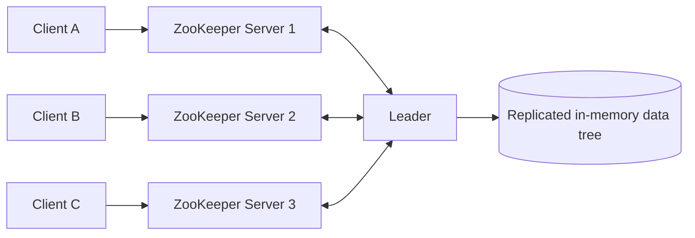
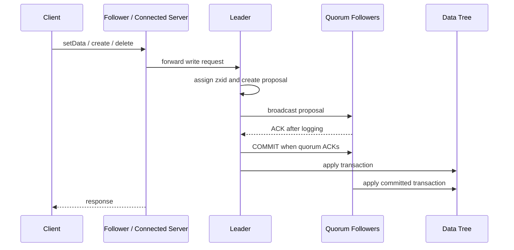
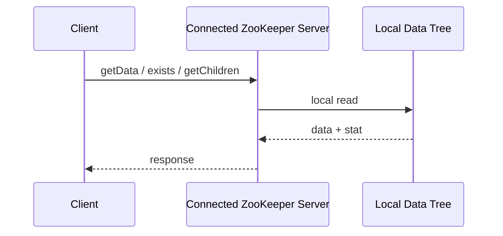

# ZooKeeper

## 1. ZooKeeper 是什么

ZooKeeper 是 Apache 生态中一套经典的**分布式协调服务（distributed coordination service）**。它要解决的问题不是“如何存储大量业务数据”，而是“一个分布式系统里的多个进程，如何安全、可靠、低成本地就某些共享事实达成一致”。这些共享事实通常包括：谁是 leader、哪些节点还活着、某个任务是否已经被领取、某份配置是否已经发布完成、某个分片现在由谁负责、某组服务实例当前有哪些成员。

在大规模分布式系统中，这类 coordination 问题非常容易被低估。它们看起来只是“写一个锁”“发一个心跳”“维护一张成员表”，但一旦涉及网络分区、进程崩溃、重启恢复、请求重试、时钟偏差、并发更新和故障切换，就会迅速变成一个复杂的一致性问题。ZooKeeper 的价值在于：它把这些容易写错的协调逻辑收敛到一个小而稳定的内核中，让应用开发者基于一组简单原语构造更高层的 coordination recipes。

ZooKeeper 的核心抽象是一个类似文件系统的层级命名空间。每个节点称为 **znode**，可以保存少量数据，也可以有子节点；客户端可以读写 znode、监听变化、创建随会话消失的临时节点、创建自动递增编号的顺序节点。通过这些看似简单的能力，应用可以实现 leader election、group membership、configuration management、distributed locks、barriers、queues 等常见分布式协调模式。

如果用一句话概括，ZooKeeper 不是“分布式数据库”，也不是“分布式锁服务”的单一实现，而是一套**用于构造分布式协调原语的高可用、一致、有序、事件驱动的 coordination kernel**。

今天的 ZooKeeper 仍然是 Apache 项目，并且在很多分布式系统中承担元数据、选主、成员管理、轻量配置和协调职责。Apache 官方文档把它描述为一个 distributed、open-source coordination service，提供一组简单 primitives，使分布式应用可以在其上构建 synchronization、configuration maintenance、groups、naming 等高层服务。[2]

---

## 2. 设计初衷：分布式系统需要怎样的 coordination kernel

ZooKeeper 的设计背景来自 Yahoo! 早期的大规模分布式系统实践。搜索爬虫、消息系统、分布式索引、广告系统等都需要不同形式的协调：有的需要维护动态配置，有的需要选主，有的需要知道哪些 worker 存活，有的需要对共享资源做互斥访问，有的需要在多个进程之间做阶段同步。

一种自然方案是为每一种 coordination 需求分别写一个专用服务：配置服务、选主服务、锁服务、队列服务、成员服务。问题在于，这些服务底层面对的是同一类难题：故障检测、一致更新、有序事件通知、复制、恢复、并发控制。如果每个团队都自己实现一遍，就会形成大量脆弱、语义不一致、难以验证的系统。

另一种方案是提供一个很强的锁服务。例如 Google Chubby 就以 distributed lock service 的形式提供强同步能力。ZooKeeper 的设计选择不同：它不把服务端设计成一个“内建所有 coordination primitive 的大系统”，也不直接暴露阻塞式锁，而是提供一组简单、wait-free、可组合的数据对象和操作，让复杂 primitive 在客户端侧实现。

这个选择背后有几个底层判断。

第一，**服务端不应该被慢客户端拖住**。如果 coordination 服务直接实现阻塞锁，那么某个持锁客户端变慢、失联或行为异常时，服务端必须处理复杂的等待、租约、释放和恢复逻辑。ZooKeeper 选择让服务端只维护状态和顺序，不在服务端保存复杂阻塞调用栈。

第二，**协调需求多样，固定 primitive 不够用**。不同系统对选主、锁、barrier、配置发布、任务领取的语义要求并不完全一样。把服务端做成 coordination kernel，可以让应用根据自身需求组合 znode、session、watch 和 version，而不是被固定 API 限制。

第三，**读多写少是 coordination 的常态**。很多协调场景会频繁读取“当前 leader 是谁”“当前成员有哪些”“配置版本是多少”，但真正修改这些事实的频率较低。ZooKeeper 因此把读路径做得非常快：读可以由客户端连接的本地 server replica 直接服务，而写通过 Zab 原子广播协议全序复制。

第四，**事件通知比轮询更适合协调系统**。如果所有客户端都不断轮询配置或成员表，服务会被读请求压垮，也会产生延迟和抖动。ZooKeeper 的 watch 机制允许客户端缓存数据，并在相关 znode 变化时收到通知，从而减少无意义轮询。

第五，**协调数据应当很小，但语义必须严肃**。ZooKeeper 不适合保存大对象或高吞吐业务数据；它适合保存那些“体积很小，但一旦错了就会影响整个系统行为”的元数据。例如 leader 标识、epoch、配置指针、任务状态、服务实例地址、分片归属等。

因此，ZooKeeper 的底层目标可以概括为：

- **用简单 API 覆盖复杂协调需求**；
- **通过复制和 quorum 避免单点故障**；
- **保证写操作全序且线性化**；
- **允许读操作本地执行，以获得高读吞吐**；
- **通过 session 和 ephemeral znode 表达进程存活性**；
- **通过 watch 提供低成本事件通知和缓存失效机制**；
- **让客户端侧 recipes 构造更高层的分布式原语**。

---

## 3. 设计理念：ZooKeeper 为什么“成了”

### 3.1 Coordination kernel，而不是万能协调服务

ZooKeeper 最重要的设计判断，是把自己定位成 coordination kernel。它不在服务端内建各种复杂 primitive，而是暴露足够小、足够一致、足够可组合的底层能力。

论文中明确说，设计 ZooKeeper 时，他们从“为每一种协调需求开发一个专用服务”的方案转向了“暴露一个 API，让应用开发者实现自己的 primitive”。这使得 ZooKeeper 核心服务不需要因为每一种新协调模式而变更，也避免了把服务端变成语义庞杂的中心系统。[1]

这个思想非常重要：

- 服务端只负责维护有序、一致、可恢复的共享状态；
- 客户端负责把共享状态解释成锁、选主、队列、barrier 等语义；
- recipes 可以演化，核心协议保持稳定；
- 不同应用可以根据需求选择更适合自己的协调模式。

ZooKeeper 因此更像“分布式协调的最小可信内核”，而不是一个包含所有业务语义的元数据平台。

### 3.2 Wait-free interface，而不是服务端阻塞锁

ZooKeeper 的 API 操作本身不以“在服务端等待另一个客户端释放锁”为核心。比如获取锁的 recipe 不是调用 `lock()` 后让服务端阻塞，而是创建一个 ephemeral sequential znode，然后观察自己是否排在最前；如果没有排到，就 watch 前一个节点，等前一个节点消失再判断。

这个模式有几个好处。

第一，服务端不需要维护阻塞等待队列。等待是客户端语义，不是服务端调用栈。

第二，慢客户端不会直接拖慢快客户端。一个客户端失效后，它的 session 到期，ephemeral znode 自动删除；等待它的下一个客户端通过 watch 被唤醒。

第三，可以避免 herd effect。好的锁 recipe 不让所有等待者 watch 同一个根节点，而是让每个等待者只 watch 排在自己前面的一个 znode。这样释放锁时通常只唤醒一个客户端，而不是唤醒一群客户端再让它们重新竞争。

这也是 ZooKeeper 与“直接提供锁方法”的系统之间的关键差别：ZooKeeper 提供的是构造锁的有序状态和通知机制，而不是把阻塞锁本身硬编码进服务端。

### 3.3 读多写少：本地读 + 线性化写

ZooKeeper 的典型工作负载是 read-dominant。论文和官方文档都强调，ZooKeeper 在读远多于写的情况下表现最好；官方概述中甚至指出，它适合 reads more common than writes、约 10:1 的场景。[2]

因此 ZooKeeper 没有让每次读都走 quorum。客户端连接到某个 ZooKeeper server 后，普通读请求可以由该 server 的本地内存副本直接返回。这显著提高了读吞吐，也使新增 server 能提高读扩展能力。

但写请求不同。所有修改 ZooKeeper 状态的请求都会通过 leader 和 Zab 原子广播协议形成全序，再复制到 quorum。论文中的语义是：ZooKeeper 提供 per-client FIFO execution，并对所有改变 ZooKeeper 状态的请求提供线性化语义；这正是它可以安全支撑 coordination 的原因。[1]

这是一种明确的工程取舍：

- 写要强一致、有序、可恢复；
- 读要足够快、可扩展，但可能不是全局最新；
- 需要更强读语义时，应用必须理解 `sync`、版本、写屏障或其他协议技巧。

### 3.4 Watches：把缓存失效做成一等能力

ZooKeeper 的 watch 机制不是附属功能，而是其性能模型的重要组成部分。

客户端可以在 `exists`、`getData`、`getChildren` 等读操作中设置 watch。当被观察的 znode 或子节点集合发生变化时，ZooKeeper 会通知客户端。早期 watch 是 one-time trigger：触发后就被清除，客户端需要重新读取并重新设置 watch。当前文档中还提到，从 3.6.0 开始，客户端也可以设置 permanent、recursive watches，用于递归监听某个 znode 及其子节点变化。[2]

watch 的设计价值有三点。

第一，允许客户端缓存协调数据。比如客户端可以缓存当前 leader 或配置版本，而不是每次请求都读 ZooKeeper。

第二，把变化通知与读取分离。watch 只告诉客户端“发生了变化”，不直接携带完整新状态；客户端收到通知后再读取当前状态。这减少了通知本身的数据量，也避免服务端为所有客户端维护复杂缓存内容。

第三，避免阻塞更新。与直接管理客户端缓存不同，ZooKeeper 不需要在写入前等待所有客户端确认缓存失效。慢客户端不会阻塞写路径。

这种机制非常适合 coordination：应用关心的通常不是每个中间状态，而是“我持有的判断可能失效了，需要重新读取事实”。

### 3.5 顺序节点与临时节点：用命名空间表达并发关系

ZooKeeper 的两个关键 znode 类型是 **ephemeral** 和 **sequential**。

Ephemeral znode 与客户端 session 绑定：创建它的 session 结束后，该节点自动删除。它天然适合表达“进程仍然活着”“锁仍然被某个 session 持有”“服务实例仍然可用”。

Sequential znode 会在创建时由 ZooKeeper 自动追加一个单调递增编号。它天然适合表达“先来后到”“排队顺序”“候选者顺序”。

两者组合起来，就可以构造非常强的 coordination primitive。例如 leader election：所有候选者在同一路径下创建 ephemeral sequential znode，编号最小者成为 leader；其他候选者 watch 排在自己前面的节点。一旦 leader session 失效，其 ephemeral 节点删除，后继候选者收到通知并重新判断。

这个模型非常简洁：ZooKeeper 不需要理解“leader election”这四个字，但它提供了足够强的有序状态，使客户端可以可靠地实现选主。

### 3.6 有限状态，而不是通用数据库

ZooKeeper 的数据模型故意很小。官方程序员指南明确说明，ZooKeeper 不是 general database 或 large object store，而是用于管理 coordination data；这些数据通常是配置、状态、rendezvous 等，并且应该以 KB 级为主。文档还说明，客户端和服务端都有 sanity check，确保 znode 小于 1MB，但平均大小应远小于这个值。[3]

这个限制不是缺陷，而是设计前提。ZooKeeper 的可靠性和性能来自：

- 整个数据树保存在内存中；
- 写操作需要持久化 transaction log；
- 所有写需要全序；
- 读写都围绕小元数据进行。

一旦把 ZooKeeper 当作大对象存储、消息队列主体数据存储或高吞吐业务数据库使用，系统的延迟、内存、快照、恢复和 watch 语义都会被破坏。正确做法通常是：大对象放到 HDFS、S3、NFS、数据库或消息系统里，ZooKeeper 只保存指针、版本、状态或所有权。

---

## 4. 数据模型：Znode、Session、Watch、Version 到底怎么表达协调

ZooKeeper 的数据模型可以理解为一棵层级数据树：

```text
/
├── app1
│   ├── leader
│   ├── members
│   │   ├── worker-0000000001
│   │   └── worker-0000000002
│   └── config
└── app2
    ├── locks
    └── tasks
```

每个节点都是一个 znode。与普通文件系统不同的是，ZooKeeper 中一个 znode 既可以存数据，也可以有子节点。路径必须是绝对路径，例如 `/app1/config`。

### 4.1 Znode 类型

ZooKeeper 的 znode 类型可以按生命周期和命名方式理解。

**Persistent znode** 会一直存在，直到被显式删除。适合存放配置路径、命名空间根、固定元数据等。

**Ephemeral znode** 与 session 绑定。session 结束时自动删除。适合表达成员存活、锁持有、服务实例在线、临时注册等状态。因为它依赖 session 生命周期，ephemeral znode 不允许有子节点。

**Sequential znode** 在创建时由 ZooKeeper 为路径追加一个递增编号。适合表达顺序关系，如锁队列、任务队列、选主候选顺序。

**Ephemeral sequential znode** 是最常见的 recipe 构造块之一。它同时表达“这个候选者还活着”和“这个候选者在队列里的顺序”。

当前 ZooKeeper 还支持一些扩展 znode 类型，例如 container znode 和 TTL znode。官方文档说明 container znodes 在 3.5.3 引入，常用于 leader、lock 等 recipes；TTL nodes 也在 3.5.3 引入，但默认禁用，需要显式启用。[3]

### 4.2 Stat 与版本号

每个 znode 都维护一个 stat 结构，包含版本号、时间戳、zxid、数据长度、子节点数量、ephemeral owner 等信息。

版本号是 ZooKeeper 实现条件更新的关键。客户端读取 znode 时会同时得到当前版本；更新或删除时可以带上期望版本。如果期望版本与实际版本不匹配，操作失败。这样可以实现类似 compare-and-set 的乐观并发控制。

常见版本字段包括：

| 字段 | 含义 |
|---|---|
| `version` | znode 数据被修改的次数 |
| `cversion` | 子节点集合被修改的次数 |
| `aversion` | ACL 被修改的次数 |
| `czxid` | 创建该 znode 的事务 ID |
| `mzxid` | 最后修改该 znode 数据的事务 ID |
| `pzxid` | 最后修改该 znode 子节点集合的事务 ID |
| `ephemeralOwner` | 如果是 ephemeral znode，则记录 owner session id |

这些字段使应用可以判断“我看到的状态是不是还有效”，也使 ZooKeeper 能在 recipes 中提供强条件更新能力。

### 4.3 Zxid：ZooKeeper 的全序时间

ZooKeeper 不依赖物理时间来定义更新顺序。每个改变 ZooKeeper 状态的事务都会获得一个 **zxid（ZooKeeper Transaction Id）**。官方程序员指南说明，每个状态变化都有唯一 zxid；如果 `zxid1 < zxid2`，则 `zxid1` 对应的变化发生在 `zxid2` 之前。[3]

从实现角度看，zxid 通常可以理解为 `(epoch, counter)`：

- epoch 表示 leader 任期；
- counter 表示该 leader 任期内的事务顺序。

这使得 ZooKeeper 能够跨 leader 切换维持全局更新顺序。对 coordination 来说，这比物理时钟更重要，因为应用通常关心“哪个状态更新先发生”，而不是“墙上时间几点发生”。

### 4.4 Session：进程存活性的基础

客户端连接 ZooKeeper ensemble 时会建立 session。session 有超时时间，并通过心跳维持。如果 ZooKeeper 集群在 session timeout 内没有收到该客户端的消息，就会认为 session 过期，并删除该 session 拥有的所有 ephemeral znode。

这正是 ZooKeeper 能表达 group membership 和 failure detection 的原因。一个 worker 在 `/members` 下创建 ephemeral znode；只要 session 还活着，其他进程就能看到它；如果 worker 崩溃、网络断开且超过 session timeout，它的节点就会消失，watch 该成员集合的客户端会收到变化通知。

但这里有一个重要细节：session expiration 由 ZooKeeper cluster 管理，而不是由客户端自己决定。客户端本地看到 disconnected 并不等于 session 已经过期；如果在 timeout 内重连成功，session 可以继续存在。应用必须区分 transient disconnection 和 session expiration，否则很容易在故障切换时写出错误逻辑。[3]

### 4.5 Watch：变化通知，而不是消息队列

watch 是 ZooKeeper 的事件通知机制。它可以被设置在 znode 数据、znode 存在性或子节点集合上。当相关状态发生变化，ZooKeeper 向客户端发送通知。

需要注意：

- watch 通知的是“发生了变化”，不是完整变更内容；
- 早期 watch 是一次性触发，触发后需要重新注册；
- 连接断开期间，客户端可能无法及时收到变化通知；
- 客户端收到 watch 后，应重新读取当前状态，而不是假设只发生了一次变化；
- watch 适合做缓存失效和状态刷新，不适合当作高吞吐事件流。

官方程序员指南的 gotchas 也特别提醒：如果使用 watch，必须处理连接事件；当客户端断开连接时，不会收到变化通知，若某个 znode 在断线期间创建又删除，客户端可能错过该事件。[3]

### 4.6 API：小而可组合

论文中的核心 API 包括：

| 操作 | 含义 |
|---|---|
| `create(path, data, flags)` | 创建 znode，可指定 persistent、ephemeral、sequential 等 flag |
| `delete(path, version)` | 按版本删除 znode |
| `exists(path, watch)` | 判断 znode 是否存在，可设置 watch |
| `getData(path, watch)` | 读取 znode 数据和元信息，可设置 watch |
| `setData(path, data, version)` | 按版本更新 znode 数据 |
| `getChildren(path, watch)` | 获取子节点列表，可设置 watch |
| `sync(path)` | 等待挂起更新传播到当前连接 server |

这个 API 刻意不像文件系统那样提供 `open()`、`close()` 句柄操作。每次请求都用完整路径表达目标 znode。这样服务端无需维护复杂句柄状态，客户端 failover 到其他 server 也更简单。

---

## 5. 实现架构：ZooKeeper 是如何跑起来的

### 5.1 Ensemble：复制的集中式协调服务

ZooKeeper 本身是一个分布式系统，通常以 **ensemble** 形式部署。一个 ensemble 由多个 ZooKeeper server 组成，其中多数节点可用时，整个服务可用。官方管理员指南建议，容错集群至少需要 3 台 ZooKeeper server，并强烈建议使用奇数台；3 台通常足够生产使用，5 台可以在维护期间提供更高冗余。[4]

典型结构如下：



每个 server 都维护 ZooKeeper 数据树的内存副本，并将更新写入磁盘 transaction log 和 snapshot。客户端连接到其中一个 server，读请求可以由该 server 本地服务，写请求会被转发给 leader。

这种架构看似“中心化”，但不是单机中心化。它的中心化含义是：对外暴露的是一个统一的协调服务和命名空间；内部通过 leader、follower、quorum 和复制协议维持高可用。

### 5.2 Leader、Follower 与 Observer

ZooKeeper ensemble 中通常包含一个 leader 和若干 followers。

- **Leader** 负责接收和排序写事务，提出 proposal，协调 quorum ACK，并广播 commit。
- **Follower** 参与投票，持久化 proposal，服务客户端读请求，也可接收客户端写请求并转发给 leader。
- **Observer** 是非投票成员，接收已提交更新、服务客户端读请求、转发写请求，但不参与 quorum 投票。

Observer 是后来用于提高扩展性的重要机制。官方 Observer 指南说明，随着 voting member 增加，写性能会下降，因为写通常需要至少半数节点同意；Observer 不参与投票，只接收投票结果，因此可以增加客户端服务能力，而不显著增加投票成本。Observer 也可用于跨数据中心桥接和隔离核心 ensemble 负载。[5]

这体现了 ZooKeeper 的一个基本扩展原则：**不要通过无限增加 voting members 来扩展读负载**。voting members 增多会提升故障容忍度，但也会提高写入 quorum 和广播成本。扩展读客户端时，应考虑 Observer、分 ensemble、缓存和客户端侧架构。

### 5.3 写路径：Zab 原子广播

ZooKeeper 使用 Zab（ZooKeeper Atomic Broadcast）协议复制写事务。所有修改状态的请求最终都会被 leader 排序成 proposal，再通过 quorum 复制并提交。

简化后的写路径如下：



官方 internals 文档把 ZooKeeper 的 atomic broadcast 描述为其核心消息系统，并列出 reliable delivery、total order、causal order 等保证。proposal 获得 quorum ACK 后提交；默认 quorum 是多数派，并要求任意两个 quorum 至少有一个 server 交集。[6]

Zab 有两个阶段：

1. **Leader activation**：选出新 leader，使其与 quorum follower 同步到正确状态，并提交 `NEW_LEADER` proposal。
2. **Active messaging**：leader 接受写请求，分配 zxid，广播 proposal，等待 quorum ACK，然后按顺序 commit。

这个设计的重点是让所有 server 以相同顺序应用写事务，避免副本分歧。ZooKeeper 写入是有序状态机复制；只要写事务顺序一致，每个副本最终会到达同一状态。

### 5.4 读路径：本地副本服务

普通读请求不走 Zab。客户端连接的 server 直接从本地内存数据树读取并返回。这是 ZooKeeper 能在读多写少负载下达到高吞吐的关键。



这个优化的代价是：读可能不是全局线性化的。官方 internals 文档明确说明，ZooKeeper 写操作是 linearizable，但读操作不是 linearizable，因为读不是 quorum operation，server 会立即响应客户端本地读；读操作是 sequentially consistent。文档还说明，常见 workaround 是在读前调用 `sync`，但 `sync` 当前也不是严格 quorum operation；如果需要更强保证，执行实际 quorum operation 后再读能提供更强语义。[6]

因此，ZooKeeper 的一致性语义应精确理解为：

- 写操作全序并线性化；
- 单客户端请求保持 FIFO 顺序；
- 客户端 failover 不应看到比自己已见状态更旧的视图；
- 普通读可能读到旧值；
- 应用若需要“读到全局最新”，必须设计额外同步步骤。

这也是 ZooKeeper 的高性能来源之一：它不是把所有操作都做成 quorum 操作，而是把强一致性集中在状态变化上。

### 5.5 持久化：transaction log + snapshots

ZooKeeper 的 replicated database 是内存数据树。为了恢复，更新会写入磁盘 transaction log，并周期性生成 snapshot。论文说明，ZooKeeper 会在更新应用到内存数据库之前将其写到磁盘介质，并对内存状态生成周期性快照。[1]

一个关键点是：ZooKeeper 的 snapshot 可以是 fuzzy snapshot。也就是说，生成 snapshot 时并不停止整个数据树；它遍历数据树并写出状态，期间可能有一些事务继续提交。恢复时，ZooKeeper 可以从 snapshot 加上之后的事务日志恢复到一致状态，因为事务是幂等且有序的。

这套机制平衡了三件事：

- 数据树常驻内存，读延迟低；
- transaction log 保证崩溃恢复；
- snapshot 避免从过久日志开始重放。

但它也带来运维要求：transaction log 所在磁盘性能非常重要。官方 gotchas 明确指出，ZooKeeper 最性能关键的部分是 transaction log，必须在返回响应前把事务 sync 到介质；使用 dedicated transaction log device 是获得稳定性能的关键，把 log 放到繁忙设备上会严重影响性能。[3]

### 5.6 请求处理管线

ZooKeeper 采用管线化请求处理。论文提到，其架构允许数百或数千个 outstanding requests，同时保持低延迟；FIFO client order 也使客户端能够异步提交多个操作。[1]

这个设计对于实际 coordination 很重要。例如新 leader 接管时可能需要更新大量配置 znode。如果一个个同步更新，5000 个 znode 可能需要数秒甚至更久；如果异步流水线提交，再依靠 FIFO 顺序和最后的 ready znode 表达“配置发布完成”，整体初始化时间可以从秒级降低到亚秒级。

ZooKeeper 的异步 API 因此不是语法便利，而是性能模型的一部分。它允许客户端把 coordination 操作当作有序流提交，而不必每一步都阻塞等待。

---

## 6. 性能与规模：ZooKeeper 为什么适合读多写少的协调负载

ZooKeeper 的性能设计建立在一个前提上：coordination workload 通常读多写少、数据小、状态变化不频繁、但一致性要求高。

### 6.1 读吞吐随 server 增加而提高

论文评估显示，在 1KB 读写请求、饱和系统条件下，读吞吐远高于写吞吐。极端情况下，13 台 server、100% reads 可以达到约 460k ops/s；而 13 台 server、0% reads 时写吞吐约 8k ops/s。3 台 server 时，100% reads 约 87k ops/s，0% reads 约 21k ops/s。[1]

| Ensemble 大小 | 100% Reads | 0% Reads |
|---:|---:|---:|
| 3 servers | 87k ops/s | 21k ops/s |
| 5 servers | 165k ops/s | 18k ops/s |
| 7 servers | 257k ops/s | 14k ops/s |
| 9 servers | 296k ops/s | 12k ops/s |
| 13 servers | 460k ops/s | 8k ops/s |

这个结果非常符合 ZooKeeper 的架构：

- 读请求由本地副本服务，所以 server 越多，可服务读负载越大；
- 写请求要经过 atomic broadcast 和磁盘持久化，所以 voting server 越多，写成本越高；
- 读多写少场景下，副本越多越有利；
- 写多场景下，过大的 voting ensemble 反而降低吞吐。

### 6.2 写路径受 Zab 和磁盘 fsync 限制

ZooKeeper 写请求比读请求慢，主要原因有两个。

第一，写必须走 atomic broadcast。这会引入 leader 排序、proposal 传播、quorum ACK 和 commit。

第二，server 在给 leader ACK 前要把事务记录到 non-volatile storage。论文明确说，这一要求从性能上看较重，但 ZooKeeper 在生产系统中承担 application ground truth，因此选择用性能换可靠性。[1]

这解释了为什么 ZooKeeper 不适合作为高写吞吐数据库。它可以承担关键元数据变化，但不适合承载每秒大量业务状态更新。如果某个应用需要高写吞吐，常见策略是：

- 减少写入 ZooKeeper 的频率；
- 只保存关键元数据或指针；
- 把业务数据放到专门存储系统；
- 将不同应用或命名空间拆分到多个 ensemble；
- 使用 Observer 扩展读流量，而不是增加 voting nodes。

### 6.3 Leader 故障恢复很快，但不是无感

论文的故障实验使用 5 台 ZooKeeper server、30% write workload，并周期性注入 follower 和 leader 故障。结果显示，如果 follower 快速失败并恢复，ZooKeeper 可以维持高吞吐；leader 选举足够快，观察到新 leader 选举耗时低于 200ms。[1]

这说明 ZooKeeper 的故障恢复能力很强，但不应被理解为“故障完全无感”。在实际生产中，leader 选举、session 超时、客户端重连、watch 重设、应用状态恢复都会影响上层系统。ZooKeeper client library 可以处理连接恢复，但应用必须正确处理 disconnected、expired、operation retry 和 watch 重新注册。

### 6.4 请求延迟低，但依赖正确部署

论文中的 create benchmark 表明，单 worker 下平均请求延迟约为 1.2ms（三台 server）到 1.4ms（九台 server）。这说明 ZooKeeper 对小规模协调操作可以提供非常低的延迟。[1]

但这种低延迟依赖正确部署：

- 不要让 JVM swap；
- 为 transaction log 使用低延迟、稳定的磁盘；
- 避免把 log 放在繁忙设备上；
- 控制 znode 大小和数量；
- 控制 watch 数量和触发风暴；
- 合理设置 `tickTime`、`initLimit`、`syncLimit` 和 session timeout；
- 不要把所有高频业务变化都写进 ZooKeeper。

官方 gotchas 特别强调 heap sizing：ZooKeeper 中所有事情都是有序的，如果一个请求因为磁盘或 swap 卡住，其他排队请求也会被拖慢。[3]

### 6.5 容错与性能之间的权衡

ZooKeeper 通常建议 3 或 5 个 voting servers。3 台可以容忍 1 台故障；5 台可以容忍 2 台故障。增加到 7、9、13 台可以提高故障容忍度，但写吞吐和广播成本会下降。

因此，ZooKeeper 的容量规划不能简单说“节点越多越好”。正确做法是区分两类扩展：

- **提高容错能力**：增加 voting members，但要接受写性能下降；
- **提高读服务能力**：增加 Observer、客户端缓存、分 ensemble，而不是无限增加 voters。

这也是 ZooKeeper 与业务数据库集群扩容的不同之处。ZooKeeper ensemble 是协调内核，它的规模应保持克制，避免把 quorum 系统扩展成一个巨大且难以维护的集群。

---

## 7. 典型应用场景：ZooKeeper 到底怎么用

ZooKeeper 的强项不是“提供一个万能锁”，而是让分布式系统把关键共享状态以有序、可观察、可恢复的方式表达出来。

### 7.1 配置管理

配置管理是 ZooKeeper 最基础的用途之一。

应用可以把配置写入某个固定路径，例如 `/app/config`，客户端读取配置并设置 watch。当配置变更时，客户端收到通知，重新读取最新配置。为了避免读到部分更新，可以使用版本、ready znode 或 multi-step protocol：先删除 ready 标记，写入所有配置，再创建 ready 标记。

这种设计的关键不是“ZooKeeper 存了配置文本”，而是：ZooKeeper 保证配置更新有顺序，watch 通知能让客户端知道缓存失效，version 能让客户端做条件更新。

### 7.2 Group membership 与服务发现

服务实例启动时，在 `/services/foo/members` 下创建 ephemeral znode，内容包含地址、端口、权重、状态等元数据。只要 session 存活，该节点存在；实例崩溃或 session 过期后，节点自动删除。

消费者 watch `getChildren('/services/foo/members')`。成员集合变化时，消费者收到通知并重新获取实例列表。

这种模式适合轻量服务发现和成员管理。但需要注意：ZooKeeper watch 不是高吞吐事件总线。如果服务实例频繁上下线，或者成员数极大，watch 风暴和 `getChildren` 大列表会造成压力。大规模服务发现通常需要客户端缓存、分层注册中心或专门服务发现系统。

### 7.3 Leader election

leader election 是 ZooKeeper 最经典的 recipe。

基本步骤是：

1. 每个候选者在 `/election` 下创建 ephemeral sequential znode，例如 `/election/candidate-0000000007`；
2. 获取 `/election` 的所有子节点并排序；
3. 编号最小者成为 leader；
4. 非 leader watch 排在自己前面的那个 znode；
5. 当前 leader session 过期或主动退出时，其 ephemeral 节点删除；
6. 后继者被唤醒并重新判断是否成为 leader。

这个 recipe 的优点是避免 herd effect：每个候选者只 watch 一个前驱节点，而不是所有候选者都 watch 当前 leader。

leader election 的实际难点不在 ZooKeeper API，而在应用语义：新 leader 接管前是否需要 fencing？旧 leader 网络分区后是否可能继续执行副作用？外部资源是否能识别 epoch？ZooKeeper 能告诉你谁赢得了选举，但不能自动保证旧 leader 不再影响外部系统。因此严肃场景通常需要 fencing token、epoch、租约外部校验或幂等操作。

### 7.4 Distributed lock

ZooKeeper 可以实现分布式锁，但正确实现并不是“创建一个固定节点，创建成功即获得锁”。更稳妥的做法是使用 ephemeral sequential znode：

1. 客户端在锁路径下创建 ephemeral sequential znode；
2. 如果自己的编号最小，则获得锁；
3. 否则 watch 编号刚好小于自己的节点；
4. 前驱删除后重新检查；
5. 释放锁时删除自己的节点；session 过期时节点自动删除。

这个模式能避免所有等待者同时被唤醒，也能在持锁进程崩溃后自动释放锁。

但分布式锁仍然需要谨慎使用。ZooKeeper session 过期后，锁节点会删除；如果客户端由于长时间 GC pause 或网络分区而没有及时意识到 session 过期，它可能继续执行临界区逻辑。严肃场景需要结合 fencing token，确保外部资源只接受最新 epoch 或最高 token 的写入。

### 7.5 Barrier 与 double barrier

barrier 用来让一组进程等待某个条件满足后再继续。ZooKeeper 可以用一个 barrier znode 表达屏障是否存在；客户端 watch 该 znode，等其删除或创建后继续。

double barrier 更复杂：它同步一组进程的开始和结束。每个进程进入时创建 ephemeral child；当子节点数量达到阈值时，创建 ready 节点，所有参与者开始执行；退出时删除自己的 child，并等待所有 child 消失。

论文中使用 ZooKeeper 实现并评估了 double barrier，说明 recipes 可以基于 znode、watch 和 ephemeral 机制构造出高层同步原语。[1]

### 7.6 Queues 与任务领取

ZooKeeper 可以实现简单队列：生产者创建 sequential znode，消费者读取子节点列表并处理编号最小的任务。

但 ZooKeeper 并不适合作为高吞吐消息队列。原因很直接：

- 每个任务都是 znode，会增加数据树和 snapshot 压力；
- 每个入队/出队都是写操作，要经过 Zab；
- 大量 watch 和 children list 会放大开销；
- 消息系统还需要 ack、重试、批量、压缩、保留策略、消费组、背压等能力。

因此，ZooKeeper 队列更适合低频控制面任务，而不是替代 Kafka、Pulsar、RabbitMQ 或其他专门消息系统。

### 7.7 大型系统中的元数据协调

Apache 官方 use cases 文档列举了大量使用 ZooKeeper 的项目和公司。例如 Hadoop HDFS automatic failover 使用 ZooKeeper 做 failure detection 和 Active NameNode election；HBase 使用 ZooKeeper 做 master election、server lease management 和 server coordination；Druid 使用 ZooKeeper 进行 coordinator / overlord leader election、segment publishing、load/drop protocol 等；早期 Kafka 使用 ZooKeeper 做 controller election、topic configuration、ACL 和 broker membership 等。[7]

这些例子说明 ZooKeeper 最常见的角色是**控制面元数据协调**：它不处理主要业务数据流，而是决定谁负责处理业务数据、集群当前结构是什么、某个控制面动作是否完成。

---

## 8. 优势与局限：应该怎样评价 ZooKeeper

### 8.1 主要优势

**第一，抽象小但表达力强。** Znode、session、watch、version、zxid、ephemeral、sequential 这些原语很少，但可以组合出选主、锁、成员管理、配置发布、barrier、队列等大量 coordination recipes。

**第二，写语义足够强。** ZooKeeper 对写操作提供全序和线性化语义，并保持单客户端 FIFO 顺序。这使它可以作为 distributed coordination 的可信状态源。

**第三，读性能高。** 普通读由本地副本服务，不需要每次 quorum，因此读多写少场景下吞吐很高。

**第四，事件驱动降低轮询成本。** Watch 机制让客户端可以缓存状态，并在状态变化后刷新，避免持续轮询。

**第五，session + ephemeral 节点自然表达存活性。** 这让 group membership、leader failover、临时锁、服务实例注册等模式实现起来很直接。

**第六，工程生态成熟。** ZooKeeper 经过大量 Apache 项目和生产系统使用，围绕它形成了 Curator 等高层客户端库。Apache Curator 官方 recipes 包含 leader election、distributed locks、barriers、caches 等常见模式，降低了直接手写 ZooKeeper recipes 的复杂度。[8]

### 8.2 主要局限

**第一，读不是默认线性化读。** 普通读由本地副本返回，可能读到旧数据。很多误用来自把 ZooKeeper 理解成“所有读写都强一致”。准确说，ZooKeeper 的强项是线性化写和有序观察，而不是每次读都读到全局最新。

**第二，watch 是缓存失效，不是可靠消息流。** Watch 可能一次性触发，断线期间可能错过中间变化；客户端必须在收到通知后重新读取状态，并处理连接状态变化。

**第三，写扩展能力有限。** 所有写都要被全序复制，并写入事务日志。ZooKeeper 不适合高频写业务数据，也不适合大量任务消息入队出队。

**第四，znode 数据必须很小。** 官方文档虽然设置了接近 1MB 的 sanity check，但明确建议数据平均大小应远小于此。大对象应放在外部存储，ZooKeeper 只保存指针或元数据。

**第五，session 语义容易被误用。** Disconnected 不等于 expired；expired 后 ephemeral 节点被删除；客户端重连、重试、watch 重设和本地状态清理都必须谨慎处理。

**第六，分布式锁不能消除外部副作用问题。** ZooKeeper 可以告诉你谁持有锁，但如果旧持有者因 GC pause、网络分区或 session 过期后继续执行外部写入，仍可能破坏系统语义。严肃场景需要 fencing token。

**第七，运维敏感。** 磁盘延迟、事务日志设备、JVM heap、GC、swap、网络抖动、时钟配置、snapshot 策略都会影响 ZooKeeper 稳定性。ZooKeeper 是小系统，但不是可以随便部署的系统。

**第八，不适合跨广域强一致大 ensemble。** ZooKeeper 可以跨数据中心使用 Observer 做桥接，但把 voting ensemble 拉到高延迟 WAN 上通常会伤害写延迟和故障检测稳定性。

---

## 9. 今天再看 ZooKeeper：它留下了什么方法论

ZooKeeper 的历史地位很特殊。它既是很多分布式系统的基础设施，又在一些系统中逐渐被“内嵌共识协议”取代。

最典型的例子是 Kafka。早期 Kafka 长期依赖 ZooKeeper 做 controller election、broker membership 和 topic metadata 管理；但 Kafka 后来引入 KRaft，把 metadata quorum 内置到 Kafka 自身。当前 Kafka 4.0 官方升级文档明确说明：Kafka 4.0 只支持 KRaft mode，ZooKeeper mode 已经被移除；ZooKeeper mode 集群必须先迁移到 KRaft，才能升级到 4.0 及以上版本。[9]

这并不意味着 ZooKeeper “失败了”。更准确地说，它说明了分布式系统架构的一个演进方向：

- 在早期，外部 coordination service 可以显著降低系统构建复杂度；
- 当某个系统规模和语义足够特殊时，把共识和元数据管理内嵌进系统自身，可能减少外部依赖和运维复杂度；
- 但对于通用分布式协调问题，ZooKeeper 仍然提供成熟、可组合、语义清晰的解决方案。

从今天看，ZooKeeper 留下的方法论主要有以下几点。

### 9.1 Coordination data 与 business data 应该分离

ZooKeeper 的核心价值在于管理小而关键的控制面状态，而不是业务数据。这个边界非常清晰，也非常值得学习。很多系统问题来自把控制面和数据面混在一起：要么让元数据系统承载过高业务吞吐，要么让业务数据库承担复杂协调语义。

ZooKeeper 的做法是：控制面状态保持小、强语义、可观察；数据面交给专门系统。

### 9.2 简单原语比复杂大 API 更耐用

ZooKeeper 的 API 很小，但生命周期极长。相比在服务端内建大量 primitive，小而稳定的原语更容易验证、复制、恢复和演化。

这对基础设施系统尤其重要：服务端核心越简单，越容易保持正确；复杂性可以放到客户端 library 和 recipes 中，用版本化、测试和最佳实践逐步沉淀。

### 9.3 事件通知应当服务于缓存失效

ZooKeeper 的 watch 机制强调“通知你状态变了，请重新读取”，而不是把每次变化都作为完整消息投递给客户端。这种设计适合配置、成员表、leader 等状态型数据。

今天很多控制面系统仍然遵循类似原则：客户端持有缓存，通过事件流或 watch invalidation 触发重读，最终以当前状态为准。

### 9.4 有序元数据比物理时间更可靠

ZooKeeper 用 zxid 表达事务顺序，而不是依赖物理时间判断谁先谁后。对于分布式协调而言，逻辑顺序通常比时钟时间更可靠。Leader epoch、version、fencing token、generation id 等现代系统常见机制，本质上都延续了这种思想。

### 9.5 共识系统要克制规模

ZooKeeper 提醒我们：quorum 系统不是越大越好。参与投票的节点越多，故障容忍度可能更高，但写延迟、广播成本和运维复杂度也更高。控制面 quorum 应该保持小而稳定，读扩展可以通过 observer、cache、分区和专门架构实现。

### 9.6 不要手写复杂 recipes，优先使用成熟库

ZooKeeper 的原语简单，但正确 recipes 并不简单。Leader election、distributed lock、barrier、cache、connection state handling 都有大量边界条件。因此生产系统通常不应手写全部逻辑，而应使用 Curator 等成熟客户端库，并认真理解其 session、retry 和 fencing 语义。

---

## 10. 总结

ZooKeeper 的设计之所以经典，不在于它提供了一个“分布式锁 API”，而在于它把分布式协调问题拆成了一组稳定、可组合、可验证的核心原语：

1. **用 znode 表达共享状态**；
2. **用 version 和 zxid 表达条件更新与全局顺序**；
3. **用 session 和 ephemeral znode 表达进程存活性**；
4. **用 sequential znode 表达排队和候选顺序**；
5. **用 watch 表达缓存失效和状态变化通知**；
6. **用 Zab 和 quorum 复制保证写操作有序、可靠、线性化**；
7. **用本地读换取读多写少负载下的高吞吐**。

ZooKeeper 最值得学习的不是某个具体 recipe，而是它的系统边界：**把最难写对的一致性、顺序、失败检测和通知机制收敛到一个小内核里，同时把具体业务协调语义留给客户端组合。**

如果要用一句话概括 ZooKeeper，可以这样说：

**ZooKeeper 不是用来保存大量数据的数据库，而是把分布式系统中的关键控制面事实变成有序、可观察、可恢复共享状态的协调内核。**

---

## 参考资料

[1] Patrick Hunt, Mahadev Konar, Flavio P. Junqueira, Benjamin Reed. *ZooKeeper: Wait-free Coordination for Internet-scale Systems*. USENIX ATC 2010. https://www.usenix.org/conference/usenix-atc-10/zookeeper-wait-free-coordination-internet-scale-systems

[2] Apache ZooKeeper Documentation. *ZooKeeper Overview*. https://zookeeper.apache.org/doc/current/zookeeperOver.html

[3] Apache ZooKeeper Documentation. *ZooKeeper Programmer's Guide*. https://zookeeper.apache.org/doc/current/zookeeperProgrammers.html

[4] Apache ZooKeeper Documentation. *ZooKeeper Administrator's Guide*. https://zookeeper.apache.org/doc/current/zookeeperAdmin.html

[5] Apache ZooKeeper Documentation. *ZooKeeper Observers*. https://zookeeper.apache.org/doc/current/zookeeperObservers.html

[6] Apache ZooKeeper Documentation. *ZooKeeper Internals*. https://zookeeper.apache.org/doc/current/zookeeperInternals.html

[7] Apache ZooKeeper Documentation. *ZooKeeper Use Cases*. https://zookeeper.apache.org/doc/current/zookeeperUseCases.html

[8] Apache Curator Documentation. *Recipes*. https://curator.apache.org/docs/recipes/

[9] Apache Kafka Documentation. *Upgrading to Apache Kafka 4.0*. https://kafka.apache.org/40/getting-started/upgrade/